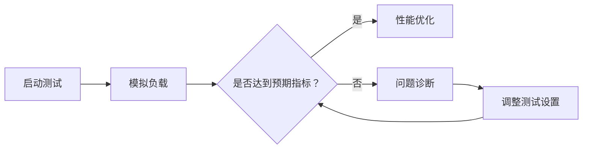

                 


## 《性能测试：评估AI服务承载能力的重要手段》

### 关键词：性能测试、AI服务、承载能力、测试工具、最佳实践

### 摘要：

随着人工智能技术的飞速发展，AI服务在现代企业和组织中扮演着越来越重要的角色。然而，如何确保这些服务的稳定性和高效性，成为了技术人员面临的一大挑战。本文将深入探讨性能测试在评估AI服务承载能力方面的关键作用，通过详细的目录大纲和章节内容，帮助读者了解性能测试的基础知识、AI服务性能测试的特性和方法，以及性能测试工具的实战应用和最佳实践。

### 目录大纲

#### 第一部分：性能测试基础

**第1章：性能测试概述**
- **1.1 性能测试的定义与重要性**
- **1.2 性能测试的目标**
- **1.3 性能测试的基本概念**
- **1.4 性能测试的分类**

**第2章：性能测试目标与指标**
- **2.1 性能测试的关键指标**
  - **响应时间**
  - **吞吐量**
  - **并发用户数**
  - **资源利用率**
- **2.2 性能测试的目标设定**
- **2.3 性能测试指标的优先级**

**第3章：性能测试方法与类型**
- **3.1 负载测试**
  - **静态负载测试**
  - **动态负载测试**
- **3.2 压力测试**
  - **确定阈值**
  - **性能抖动测试**
- **3.3 可用性测试**
  - **用户参与**
  - **反馈收集**
- **3.4 性能测试的类型**

#### 第二部分：AI服务性能测试

**第4章：AI服务性能测试概述**
- **4.1 AI服务的特点**
- **4.2 AI服务性能测试的重要性**
- **4.3 AI服务性能测试的挑战**

**第5章：AI服务性能测试目标与指标**
- **5.1 AI服务性能测试的目标**
- **5.2 AI服务性能测试的指标**
  - **计算性能**
  - **存储性能**
  - **网络性能**
  - **延迟性能**
- **5.3 AI服务性能测试的特殊指标**

**第6章：AI服务性能测试方法与类型**
- **6.1 AI服务的负载生成**
- **6.2 AI服务的压力测试**
- **6.3 AI服务的性能优化**
- **6.4 AI服务的性能分析**

#### 第三部分：性能测试工具与实战

**第7章：性能测试工具介绍**
- **7.1 开源性能测试工具**
  - **Apache JMeter**
  - **Gatling**
- **7.2 商业性能测试工具**
  - **LoadRunner**
  - **LoadNinja**

**第8章：性能测试工具实战案例**
- **8.1 使用JMeter进行AI服务性能测试**
- **8.2 使用Gatling进行AI服务性能测试**
- **8.3 性能测试工具的配置与优化**

**第9章：性能测试工具配置与使用**
- **9.1 性能测试环境的搭建**
- **9.2 性能测试脚本的编写**
- **9.3 性能测试报告的生成**

#### 第四部分：性能测试最佳实践

**第10章：性能测试最佳实践**
- **10.1 性能测试计划的制定**
- **10.2 性能测试环境的准备**
- **10.3 性能测试的数据分析**
- **10.4 性能测试的持续集成**

**第11章：性能测试常见问题与解决方案**
- **11.1 性能测试中的常见问题**
- **11.2 解决方案与建议**

### 核心概念、算法、数学模型、实战案例等

在本文中，我们将详细讨论以下核心概念、算法、数学模型和实战案例：

- **性能测试基础**：介绍性能测试的定义、目标、指标和方法，以及性能测试在AI服务中的应用。
- **AI服务性能测试**：探讨AI服务的特点、性能测试目标与指标，以及性能测试的方法和类型。
- **性能测试工具与实战**：介绍开源和商业性能测试工具，并通过实战案例展示如何使用这些工具进行AI服务性能测试。
- **性能测试最佳实践**：提供性能测试计划制定、环境准备、数据分析等最佳实践。

### Mermaid流程图

为了更好地理解性能测试的过程，我们将使用Mermaid流程图来展示性能测试的基本流程：



### Python源代码与数学模型

在讲解核心算法原理时，我们将使用Python源代码结合数学模型和公式，进行详细讲解和举例说明。例如：

```python
import numpy as np

# 计算响应时间
def response_time(num_requests, avg_response_time):
    return np.mean([np.random.exponential(avg_response_time) for _ in range(num_requests)])

# 延迟性能指标计算
def latency_performance(num_requests, avg_response_time, std_deviation):
    return np.std([response_time(num_requests, avg_response_time) for _ in range(num_requests)])
```

通过这些代码和模型，读者可以更直观地理解性能测试的原理和实现方法。

### 最佳实践与小结

在文章的最后一部分，我们将总结性能测试的最佳实践，包括性能测试计划的制定、环境的准备、数据分析和持续集成等。同时，针对性能测试中常见的问题，提供解决方案和建议，帮助读者在实际工作中更好地应用性能测试技术。

通过本文的详细分析和讲解，读者将对性能测试有更深入的理解，掌握评估AI服务承载能力的重要手段，为构建稳定高效的AI服务体系奠定坚实基础。

### 作者信息

作者：AI天才研究院/AI Genius Institute & 禅与计算机程序设计艺术 /Zen And The Art of Computer Programming

---

以上是《性能测试：评估AI服务承载能力的重要手段》的目录大纲和初步内容框架。接下来，我们将逐步深入每个章节，详细阐述性能测试的基础知识、AI服务性能测试的特性和方法，以及性能测试工具的实战应用和最佳实践。

