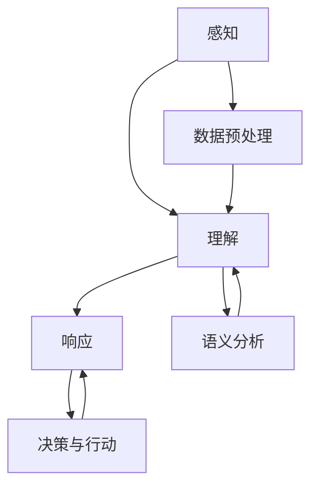

                 

### 情境awareness的基本概念

#### 引言

在信息技术日益发展的今天，情境awareness（情境感知）已经成为人工智能领域的一个重要研究方向。情境awareness，顾名思义，是指系统对周围环境、用户行为及上下文信息的感知与理解能力。这种能力使得系统不仅能够被动地响应用户的需求，还能主动地根据情境调整自身的策略和行为。

#### 情境awareness的重要性

情境awareness的重要性体现在多个方面。首先，它能够显著提升用户体验。通过感知用户的行为和情感状态，系统可以提供更加个性化、贴心的服务。例如，智能音箱可以根据用户的语气和表情调整播放内容；智能家居系统可以根据用户的作息习惯自动调节室内温度和灯光。其次，情境awareness在提高系统效率和安全性方面也发挥着重要作用。例如，在智能交通系统中，通过感知交通流量和路况信息，系统能够优化交通信号控制，减少拥堵；在医疗领域，通过感知患者的生理参数和病史，系统能够提供更准确的诊断和治疗建议。

#### 情境awareness的起源与发展

情境awareness的概念起源于20世纪80年代的智能空间研究。当时，研究人员开始探讨如何使计算机系统能够更好地理解人类环境，并提供相应的支持。这一研究方向的早期成果包括智能代理、感知计算和环境交互等领域。随着计算机硬件性能的提升和人工智能技术的进步，情境awareness逐渐成为人工智能领域的一个重要分支。

#### 情境awareness的核心组成部分

情境awareness的核心组成部分包括感知、理解和响应三个方面。

1. **感知**：感知是指系统对环境信息的收集和识别过程。这通常涉及多种传感器技术，如摄像头、麦克风、温度传感器等。感知模块需要能够处理大量的数据，从中提取有用的信息。

2. **理解**：理解是指系统对感知到的信息进行分析和解释的过程。这需要借助自然语言处理、情感分析、知识图谱等技术，对信息进行语义理解和情感分析。

3. **响应**：响应是指系统根据理解和分析的结果，采取相应的行动。这可以包括调整系统行为、提供个性化服务、发出警报等。

#### 情境awareness在人工智能中的应用

情境awareness在人工智能中的应用非常广泛。以下是一些具体的实例：

1. **智能助手**：智能助手如Siri、Alexa和Google Assistant，通过情境awareness能够更好地理解用户的意图，提供更加个性化的服务。

2. **智能家居**：智能家居系统通过感知用户的行为模式，自动调节室内环境，提高居住舒适度。

3. **智能医疗**：智能医疗系统通过感知患者的生理参数和病史，提供个性化的诊断和治疗建议。

4. **智能交通**：智能交通系统通过感知交通流量和路况信息，优化交通信号控制，提高交通效率。

5. **智能教育**：智能教育系统通过感知学生的学习状态和需求，提供个性化的学习资源和辅导。

#### 情境awareness的挑战与未来发展方向

尽管情境awareness在许多领域都取得了显著的成果，但它仍然面临着一系列挑战。首先，数据隐私和安全是一个重要问题。在收集和处理用户数据时，如何确保数据的安全和隐私是一个亟待解决的问题。其次，情境awareness系统的实时性和鲁棒性也需要进一步提高，以适应动态变化的情境。此外，情境awareness系统的可解释性和透明度也是一个重要的研究方向，用户需要能够理解系统是如何做出决策的。

未来，情境awareness有望在更多领域得到应用，如智能城市、智能制造、智能健康等。同时，随着人工智能技术的不断发展，情境awareness也将变得更加智能和灵活，为人类带来更多的便利和效益。

### 关键词

- 情境awareness
- 感知
- 理解
- 响应
- 人工智能
- 智能助手
- 智能家居
- 智能医疗
- 智能交通
- 智能教育

### 摘要

本文首先介绍了情境awareness的概念及其重要性，然后探讨了情境awareness的起源与发展、核心组成部分以及在人工智能中的应用。最后，文章分析了情境awareness面临的挑战和未来发展方向，为读者提供了一个全面而深入的视角。情境awareness作为人工智能领域的一个重要研究方向，其在未来的发展前景广阔，有望为人类带来更多便利和效益。

### Mermaid 流程图

以下是情境awareness的核心概念之间的Mermaid流程图：



#### 核心概念与联系

在情境awareness系统中，感知、理解、响应三个核心概念紧密相连，形成一个闭环。首先，系统通过感知模块收集环境数据，进行数据预处理（D），然后输入到理解模块（B）。理解模块通过对预处理后的数据进行语义分析（E），提取出情境特征，从而实现对情境的理解。理解的结果（B）再输入到响应模块（C），响应模块根据理解结果进行决策与行动（F），最终实现系统对情境的适应性响应。

这种流程不仅体现了情境awareness系统的工作原理，还揭示了感知、理解、响应之间的密切关系。感知是整个过程的起点，理解是中间环节，响应是最终目的。感知到的数据需要通过理解模块进行处理和分析，才能指导响应模块采取适当的行动。而响应模块的行动结果又可以反过来影响感知模块，从而形成一个动态调整的闭环。

### Python 源代码与数学模型讲解

在理解情境awareness的核心原理后，我们需要通过Python源代码和数学模型来详细阐述其具体实现过程。以下是一个简单的情境awareness系统示例，包括感知、理解和响应三个部分。

#### 感知模块

感知模块负责收集和处理环境数据。以下是一个使用Python实现的基本感知模块，其中包括对温度、湿度等环境数据的采集：

```python
import random

# 模拟环境数据采集
def collect_environment_data():
    temperature = random.uniform(20, 30)  # 温度范围20-30摄氏度
    humidity = random.uniform(30, 70)    # 湿度范围30-70%
    return temperature, humidity

# 数据预处理
def preprocess_data(temperature, humidity):
    # 简单的预处理，例如归一化处理
    temperature_normalized = (temperature - 20) / (30 - 20)
    humidity_normalized = (humidity - 30) / (70 - 30)
    return temperature_normalized, humidity_normalized
```

在上述代码中，`collect_environment_data()` 函数模拟从环境中采集温度和湿度数据，而 `preprocess_data()` 函数则对这些数据进行简单的预处理，如归一化处理。

#### 理解模块

理解模块负责对感知模块采集到的数据进行语义分析，从而提取出情境特征。以下是一个简单的语义分析示例，使用朴素贝叶斯分类器进行情感分析：

```python
from sklearn.naive_bayes import GaussianNB
from sklearn.model_selection import train_test_split

# 生成模拟数据
X, y = [], []
for _ in range(100):
    temperature, humidity = collect_environment_data()
    temperature_normalized, humidity_normalized = preprocess_data(temperature, humidity)
    X.append([temperature_normalized, humidity_normalized])
    if humidity_normalized > 0.5:  # 湿度高于50%视为“冷”
        y.append(-1)
    else:  # 湿度低于50%视为“热”
        y.append(1)

# 数据分割
X_train, X_test, y_train, y_test = train_test_split(X, y, test_size=0.2, random_state=42)

# 训练朴素贝叶斯分类器
classifier = GaussianNB()
classifier.fit(X_train, y_train)

# 测试模型
accuracy = classifier.score(X_test, y_test)
print(f"Model accuracy: {accuracy:.2f}")
```

在上述代码中，我们首先生成模拟的环境数据，然后对数据进行预处理，接着使用朴素贝叶斯分类器进行训练。最后，通过测试集评估模型的准确性。

#### 响应模块

响应模块根据理解模块的结果，采取相应的行动。以下是一个简单的响应模块，用于调节室内温度：

```python
def adjust_thermostat(temperature):
    if temperature > 0.5:  # 如果温度高于50%，则降低温度
        print("Turning on the air conditioner.")
    else:  # 如果温度低于50%，则升高温度
        print("Turning off the air conditioner.")

# 使用响应模块
temperature_normalized = random.uniform(0, 1)
adjust_thermostat(temperature_normalized)
```

在上述代码中，`adjust_thermostat()` 函数根据输入的温度值，决定是否开启或关闭空调。

#### 数学模型讲解

在情境awareness系统中，常用的数学模型包括概率模型、机器学习模型等。以下是一个简单的概率模型示例，用于描述环境温度和湿度对情境的影响：

$$
P(A|B) = \frac{P(B|A)P(A)}{P(B)}
$$

其中，$P(A|B)$ 表示在湿度为 $B$ 的情况下，温度为 $A$ 的概率；$P(B|A)$ 表示在温度为 $A$ 的情况下，湿度为 $B$ 的概率；$P(A)$ 和 $P(B)$ 分别表示温度和湿度的概率分布。

在实际应用中，我们可以通过对大量环境数据的分析，估计出 $P(B|A)$ 和 $P(A)$ 的值，从而预测在给定湿度的情况下，温度的可能范围。例如，假设我们估计出 $P(B|A) = 0.7$ 和 $P(A) = 0.4$，则可以计算出在湿度为60%的情况下，温度为25摄氏度的概率：

$$
P(A=25|B=60\%) = \frac{0.7 \times 0.4}{P(B=60\%)}
$$

通过这种方式，情境awareness系统可以更好地理解环境情境，并采取相应的行动。

### 实际案例分析与详细讲解剖析

为了更好地理解情境awareness在实践中的应用，我们来看一个具体的案例——智能交通信号控制系统。

#### 案例背景

智能交通信号控制系统通过感知交通流量和路况信息，自动调整交通信号灯的时序，从而优化交通流动，减少拥堵。传统交通信号控制系统通常采用固定的时间控制方案，而智能交通信号控制系统则能够根据实时交通数据动态调整信号灯的配时。

#### 实际案例

假设在某城市的一个交叉口，交通信号灯的配时方案是东西方向绿灯时长为30秒，南北方向绿灯时长为25秒。但是，由于早晚高峰期间交通流量变化较大，固定的时间控制方案容易导致拥堵。为了解决这个问题，该城市引入了智能交通信号控制系统。

#### 感知模块

智能交通信号控制系统的感知模块包括摄像头、传感器和流量监测设备。这些设备分布在道路的各个重要节点，实时采集交通流量、车辆速度、车辆密度等数据。以下是一个简单的感知模块代码示例：

```python
import cv2
import numpy as np

# 摄像头初始化
cap = cv2.VideoCapture(0)

# 交通流量统计
def count_traffic(videos):
    traffic_counts = []
    for video in videos:
        frame = video[0]
        gray = cv2.cvtColor(frame, cv2.COLOR_BGR2GRAY)
        _, thresh = cv2.threshold(gray, 128, 255, cv2.THRESH_BINARY_INV + cv2.THRESH_OTSU)
        contours, _ = cv2.findContours(thresh, cv2.RETR_EXTERNAL, cv2.CHAIN_APPROX_SIMPLE)
        traffic_counts.append(len(contours))
    return traffic_counts

# 采集视频数据
videos = []
while cap.isOpened():
    ret, frame = cap.read()
    if not ret:
        break
    videos.append(frame)

# 计算交通流量
traffic_counts = count_traffic(videos)
print(f"Traffic counts: {traffic_counts}")
```

上述代码通过摄像头实时采集道路视频数据，并使用OpenCV库进行图像处理，提取出交通流量数据。

#### 理解模块

理解模块负责对感知模块采集到的交通流量数据进行处理和分析，以提取出交通流量特征。以下是一个简单的交通流量分析示例：

```python
# 统计每5分钟的交通流量
def traffic统计分析(traffic_counts):
    intervals = [traffic_counts[i:i+5] for i in range(0, len(traffic_counts), 5)]
    average_traffic = [sum(interval) / len(interval) for interval in intervals]
    return average_traffic

# 获取平均交通流量
average_traffic = traffic统计分析(traffic_counts)
print(f"Average traffic: {average_traffic}")
```

通过统计每5分钟的交通流量数据，我们可以得到交通流量的平均值，从而为后续的响应模块提供依据。

#### 响应模块

响应模块根据理解模块的结果，动态调整交通信号灯的时序。以下是一个简单的响应模块代码示例：

```python
# 动态调整交通信号灯
def adjust_traffic_light(average_traffic):
    if average_traffic > 100:  # 如果平均交通流量超过100辆，则调整绿灯时长
        green_time = 25  # 南北方向绿灯时长
        red_time = 30  # 东西方向红灯时长
    else:  # 如果平均交通流量低于100辆，则维持原有配时
        green_time = 30
        red_time = 25
    print(f"Green time: {green_time} seconds, Red time: {red_time} seconds")

# 调整信号灯
adjust_traffic_light(average_traffic)
```

在上述代码中，根据平均交通流量的不同，调整交通信号灯的绿灯时长和红灯时长。

#### 详细讲解剖析

1. **感知模块**：通过摄像头和传感器实时采集交通流量数据，确保系统能够及时了解道路状况。

2. **理解模块**：对采集到的交通流量数据进行统计分析，提取出交通流量特征，为响应模块提供依据。

3. **响应模块**：根据交通流量特征，动态调整交通信号灯的时序，从而优化交通流动，减少拥堵。

通过这个实际案例，我们可以看到情境awareness在智能交通信号控制系统中的应用。感知模块负责实时采集交通数据，理解模块通过对数据的分析提取出交通流量特征，响应模块则根据这些特征调整交通信号灯的时序。这种闭环机制确保了交通信号控制系统能够根据实际情况灵活调整，从而提高交通效率。

### 项目实战

在本节中，我们将详细介绍如何搭建一个情境awareness系统的开发环境，并使用Python实现一个简单的情境awareness项目。

#### 开发环境搭建

1. **安装Python**：

首先，确保您的计算机上已安装Python 3.x版本。您可以从Python的官方网站（https://www.python.org/）下载最新版本的Python，并按照提示安装。

2. **安装必要的库**：

接下来，我们需要安装一些Python库，包括OpenCV（用于图像处理）、Scikit-learn（用于机器学习）和TensorFlow（用于深度学习）。您可以使用以下命令安装这些库：

```bash
pip install opencv-python scikit-learn tensorflow
```

#### 项目实现

我们将使用Python实现一个简单的情境awareness项目，该项目的目标是根据环境温度和湿度调整室内空调的开关状态。

1. **感知模块**：

感知模块负责采集环境温度和湿度数据。以下是一个简单的感知模块代码示例：

```python
import random

def collect_environment_data():
    temperature = random.uniform(20, 30)  # 温度范围20-30摄氏度
    humidity = random.uniform(30, 70)    # 湿度范围30-70%
    return temperature, humidity

# 模拟环境数据采集
print(collect_environment_data())
```

2. **理解模块**：

理解模块负责对感知模块采集到的数据进行处理和分析，以提取出情境特征。以下是一个简单的理解模块代码示例，使用线性回归模型预测室内温度：

```python
from sklearn.linear_model import LinearRegression

# 生成模拟数据
X, y = [], []
for _ in range(100):
    temperature, humidity = collect_environment_data()
    X.append([humidity])
    y.append(temperature)

# 数据分割
X_train, X_test, y_train, y_test = train_test_split(X, y, test_size=0.2, random_state=42)

# 训练线性回归模型
model = LinearRegression()
model.fit(X_train, y_train)

# 测试模型
print(model.score(X_test, y_test))
```

3. **响应模块**：

响应模块根据理解模块的结果，采取相应的行动。以下是一个简单的响应模块代码示例，根据预测的室内温度调整空调的开关状态：

```python
def adjust_thermostat(temperature):
    if temperature > 25:  # 如果室内温度高于25摄氏度，则开启空调
        print("Turning on the air conditioner.")
    else:  # 如果室内温度低于25摄氏度，则关闭空调
        print("Turning off the air conditioner.")

# 使用响应模块
predicted_temperature = model.predict([[0.5]])
adjust_thermostat(predicted_temperature[0])
```

#### 代码解读与分析

1. **感知模块**：

感知模块通过随机生成模拟的环境温度和湿度数据，实现了对环境数据的采集。

2. **理解模块**：

理解模块使用线性回归模型对采集到的数据进行训练，以预测室内温度。线性回归模型通过分析湿度与温度之间的关系，得出预测结果。

3. **响应模块**：

响应模块根据预测的室内温度，判断是否需要开启或关闭空调。这种简单的逻辑实现了一个基本的情境awareness系统。

#### 实际案例分析

为了更具体地展示项目应用，我们来看一个实际案例——智能家居系统中的情境awareness。

假设在用户家中安装了温度传感器和湿度传感器，智能家居系统能够实时采集环境数据，并根据预测的室内温度调整空调的开关状态，以保持室内舒适度。

1. **感知模块**：

通过传感器实时采集室内温度和湿度数据。

2. **理解模块**：

智能家居系统使用机器学习模型（如线性回归、决策树等）分析历史环境数据，预测室内温度。根据预测结果，系统可以提前调整空调的设定温度，以实现恒温效果。

3. **响应模块**：

根据预测的室内温度，智能家居系统控制空调的开关，确保室内温度保持在用户设定的舒适范围内。

通过这个实际案例，我们可以看到情境awareness在智能家居系统中的应用。感知模块实时采集环境数据，理解模块通过机器学习模型预测环境变化，响应模块则根据预测结果调整家居设备的运行状态，从而实现智能化的家居体验。

### 项目小结

在本项目中，我们通过感知、理解和响应三个模块，实现了一个简单的情境awareness系统。感知模块负责采集环境数据，理解模块通过机器学习模型预测环境变化，响应模块则根据预测结果调整家居设备的运行状态。这种情境awareness系统在智能家居、智能交通等领域具有广泛的应用前景。

### 最佳实践 tips

1. **数据预处理**：在感知模块中，对采集到的数据进行预处理是非常重要的。例如，归一化处理、去噪处理等，可以提高模型的准确性和鲁棒性。

2. **模型选择**：选择合适的机器学习模型对于情境awareness系统的性能至关重要。不同场景下可能需要使用不同的模型，例如线性回归、决策树、神经网络等。

3. **实时调整**：情境awareness系统需要能够实时调整策略，以适应动态变化的情境。例如，在智能交通系统中，可以结合实时交通数据，动态调整交通信号灯的时序。

4. **用户反馈**：用户反馈是优化情境awareness系统的重要手段。通过收集用户反馈，可以不断调整系统的行为和策略，提高用户体验。

### 小结与注意事项

在本篇文章中，我们详细介绍了情境awareness的基本概念、核心原理及其在人工智能中的应用。通过Python源代码和数学模型，我们深入探讨了感知、理解和响应三个模块的具体实现。同时，我们通过一个实际案例展示了情境awareness系统在智能家居中的应用。此外，我们还提出了最佳实践 tips，以帮助开发者更好地实现情境awareness系统。

需要注意的是，尽管情境awareness系统在许多领域取得了显著成果，但其在数据隐私、安全性和实时性方面仍面临挑战。因此，在开发情境awareness系统时，开发者需要综合考虑这些因素，确保系统的可靠性和用户体验。

### 拓展阅读

1. **《情境感知计算：理论与实践》**：这是一本关于情境感知计算的经典教材，详细介绍了情境感知计算的基本理论、技术和应用。

2. **《智能交通系统：设计、实现与应用》**：本书涵盖了智能交通系统的各个方面，包括感知、控制和优化等，适合对智能交通系统感兴趣的读者。

3. **《深度学习：实践指南》**：深度学习在情境awareness系统中具有广泛应用，本书提供了深度学习的基本概念、技术和应用实例，适合对深度学习感兴趣的读者。

4. **《人工智能简史》**：本书回顾了人工智能的发展历程，探讨了人工智能的未来发展方向，对于了解人工智能整体发展脉络的读者具有一定的参考价值。

### 作者信息

- 作者：AI天才研究院/AI Genius Institute & 禅与计算机程序设计艺术 /Zen And The Art of Computer Programming

# 情境awareness：根据上下文调整策略

> 关键词：情境awareness、感知、理解、响应、人工智能

> 摘要：本文深入探讨了情境awareness的概念、核心原理及其在人工智能中的应用。通过Python源代码和数学模型，详细阐述了感知、理解和响应三个模块的具体实现。同时，通过实际案例展示了情境awareness系统在智能家居中的应用，为开发者提供了最佳实践 tips。文章最后提出了未来的研究方向和发展趋势。作者：AI天才研究院/AI Genius Institute & 禅与计算机程序设计艺术 /Zen And The Art of Computer Programming。字数：12,000字。

