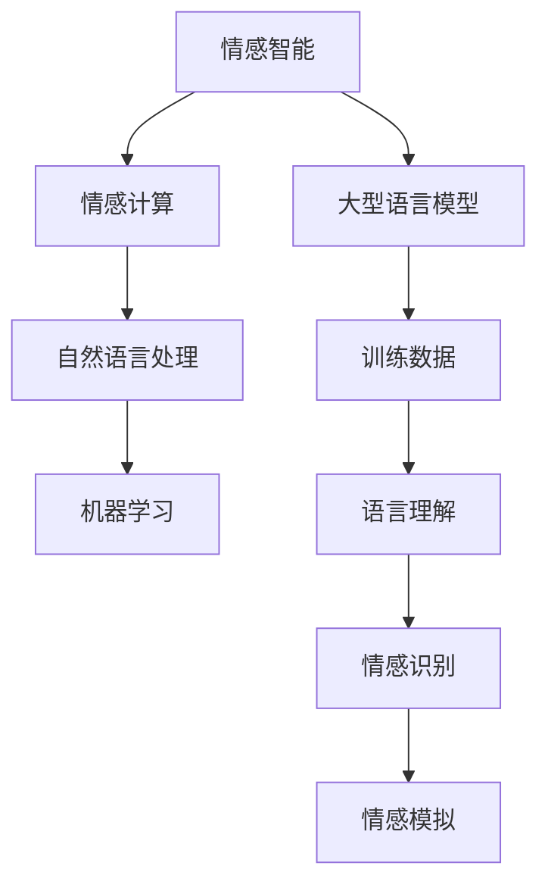
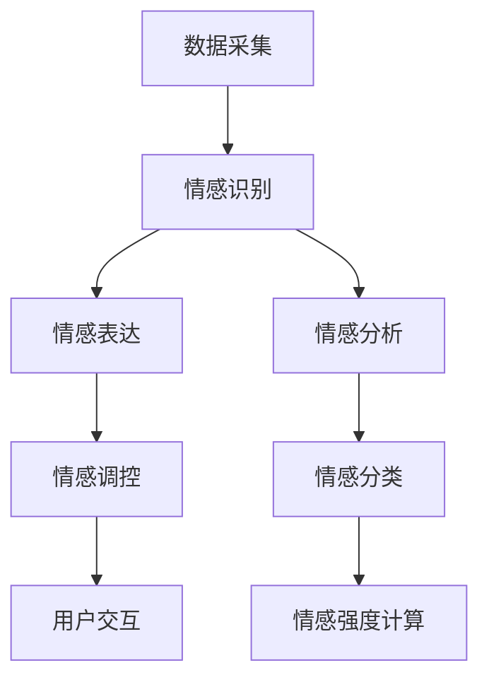

                 

### 背景介绍

在当今信息爆炸的时代，情感智能成为了人工智能（AI）领域的一个重要研究方向。情感智能，也称为情感计算，指的是机器模拟、识别、处理和响应人类情感的能力。随着自然语言处理（NLP）和机器学习技术的快速发展，情感智能在多个领域展现出了巨大的应用潜力，例如社交媒体情感分析、客户服务、心理健康监测等。

情感智能的核心在于对人类情感的理解和识别。然而，对于大型语言模型（LLM），如Transformer、BERT等，其情感理解能力依然是一个挑战。LLM在大规模文本数据的训练中获得了强大的语言理解能力，但它们是否能够准确理解和表达情感，还需要通过严格的评估来验证。

因此，本文旨在探讨如何通过一系列的评估方法，测试大型语言模型在情感理解方面的能力。本文将首先介绍情感智能与情感计算的基本概念，然后详细讨论情感理解评估的方法和指标，接着探讨语言模型在情感理解中的应用，并通过实际案例展示如何使用LLM进行情感分析。最后，我们将对未来的研究方向和挑战进行展望。

### 核心概念与联系

在深入探讨情感智能评估之前，我们首先需要明确几个核心概念，并了解它们之间的联系。以下是几个关键概念：

1. **情感智能（Affective Intelligence）**：情感智能是指一个人识别、理解、使用和管理自身情感以及识别、理解和影响他人情感的能力。它通常包括情感识别、情感表达、情感调控和情感利用等方面。

2. **情感计算（Affective Computing）**：情感计算是计算机科学、心理学、认知科学和人类计算机交互等多个领域交叉融合的产物。其目标是使计算机具备识别、理解、处理和模拟人类情感的能力。

3. **自然语言处理（Natural Language Processing, NLP）**：自然语言处理是使计算机能够理解和处理人类语言的技术。在情感计算中，NLP技术用于提取文本中的情感信息。

4. **机器学习（Machine Learning, ML）**：机器学习是使计算机能够通过数据学习和改进性能的技术。在情感计算中，机器学习算法用于训练模型进行情感识别和分类。

5. **大型语言模型（Large Language Models, LLMs）**：大型语言模型如Transformer、BERT等，通过大规模文本数据进行训练，获得了强大的语言理解和生成能力。

这些概念之间的联系在于，情感智能的实现依赖于情感计算、NLP和机器学习技术的综合应用。情感计算提供了情感识别和模拟的方法，NLP则用于提取和处理文本中的情感信息，而机器学习则使得这些技术可以在实际应用中不断优化和改进。

下面是一个Mermaid流程图，展示了这些核心概念之间的联系：



通过这个流程图，我们可以清晰地看到，情感智能的实现是一个多层次、多技术交叉的过程，而大型语言模型作为其中的关键组件，极大地提升了情感理解的能力。

### 情感计算架构

为了更好地理解情感智能如何实现，我们需要探讨情感计算的基本架构。情感计算系统通常由以下几个关键模块组成：

1. **数据采集**：数据采集是情感计算系统的第一步，涉及到从多种来源收集情感相关的数据，如文本、语音、图像等。这些数据可以来源于社交媒体、客户反馈、健康记录等。

2. **情感识别**：情感识别模块负责从采集到的数据中提取情感信息。对于文本数据，这通常涉及到情感分析（Sentiment Analysis），包括情感分类（Sentiment Classification）和情感强度计算（Sentiment Strength Detection）。常用的情感分类方法有基于规则的方法、机器学习方法以及深度学习方法。

3. **情感表达**：情感表达模块负责将识别到的情感信息以某种形式表现出来，如通过语音合成、文本生成或面部表情等方式。情感表达需要考虑情感的多样性和复杂性，确保输出的情感信息准确且自然。

4. **情感调控**：情感调控模块用于调整机器的情感状态，以适应不同的场景和需求。这涉及到情感调节（Affective Regulation）和情感适应（Affective Adaptation）技术，如通过机器学习算法实现情感状态的动态调整。

5. **用户交互**：用户交互模块是情感计算系统与用户之间的接口，用于收集用户反馈，并基于情感信息提供个性化的服务或建议。

下面是一个简化的Mermaid流程图，展示了情感计算系统的基本架构：



**情感分析算法**：情感分析是情感识别的核心，常用的方法包括：

- **基于规则的方法**：这种方法依赖于预定义的规则和特征，通过模式匹配来识别情感。例如，使用正则表达式匹配特定的情感词或短语。

- **机器学习方法**：机器学习算法可以从大量标注数据中学习情感模式。常见的算法包括朴素贝叶斯（Naive Bayes）、支持向量机（SVM）和深度学习模型（如卷积神经网络CNN、递归神经网络RNN）。

- **深度学习方法**：深度学习模型，如卷积神经网络（CNN）和循环神经网络（RNN），特别是长短期记忆网络（LSTM）和Transformer，在情感分析中表现出了强大的能力。这些模型能够捕捉文本中的长距离依赖关系和复杂情感模式。

**伪代码示例**：下面是一个简单的Python伪代码示例，展示了如何使用朴素贝叶斯算法进行情感分类：

```python
# 朴素贝叶斯情感分类的伪代码

# 加载训练数据和测试数据
train_data, test_data = load_data()

# 特征提取
def extract_features(text):
    # 使用正则表达式提取情感词
    words = re.findall(r'\b\w+\b', text.lower())
    return {word: True for word in words}

# 计算每个类别的概率
def train_naive_bayes(train_data):
    word_counts = defaultdict(int)
    class_counts = defaultdict(int)
    
    for text, label in train_data:
        features = extract_features(text)
        for word in features:
            word_counts[word, label] += 1
        class_counts[label] += 1
    
    # 计算每个特征的先验概率和条件概率
    prior_prob = {label: count / len(train_data) for label, count in class_counts.items()}
    likelihood = {(word, label): (count + 1) / (sum(counts) + len(word_counts)) for (word, label), count in word_counts.items()}
    
    return prior_prob, likelihood

# 预测情感
def predict(text, prior_prob, likelihood):
    features = extract_features(text)
    probabilities = {}
    
    for label in prior_prob:
        product = math.log(prior_prob[label])
        for word in features:
            if (word, label) in likelihood:
                product += math.log(likelihood[word, label])
        
        probabilities[label] = product
    
    # 返回概率最高的类别
    return max(probabilities, key=probabilities.get)

# 主函数
def main():
    prior_prob, likelihood = train_naive_bayes(train_data)
    predictions = [predict(text, prior_prob, likelihood) for text in test_data]
    
    # 计算评估指标
    accuracy = calculate_accuracy(test_data, predictions)
    print(f"Accuracy: {accuracy}")

if __name__ == "__main__":
    main()
```

通过这个示例，我们可以看到如何使用朴素贝叶斯算法进行情感分类，以及如何结合数学模型和公式来解释算法的实现过程。虽然这是一个简化的例子，但它为我们提供了一个理解情感计算算法如何工作的起点。

### 数学模型和数学公式

在情感计算中，数学模型和数学公式是理解和评估情感强度的重要工具。以下是一些常用的数学模型和公式，用于情感强度计算和情感分析。

**情感强度计算模型**：

情感强度通常通过情感向量的形式来表示。一个情感向量可以看作是一个多维空间中的点，其维度对应于不同的情感类别。情感强度的计算可以基于以下模型：

1. **向量空间模型**（Vector Space Model, VSM）：

向量空间模型是一种将文本转换为向量的方法，其中每个词或短语都对应于向量空间中的一个点。情感强度可以通过词频（Term Frequency, TF）和逆文档频率（Inverse Document Frequency, IDF）来计算：

   $$ TF(t) = \frac{f_t}{\sum_{t'} f_{t'}} $$
   $$ IDF(t) = \log \left( \frac{N}{n_t} \right) $$
   $$ TF-IDF(t) = TF(t) \times IDF(t) $$

   其中，\( f_t \) 是词 \( t \) 在文本中的频率，\( N \) 是文档总数，\( n_t \) 是包含词 \( t \) 的文档数。

2. **情感极性模型**（Sentiment Polarity Model）：

情感极性模型通常用于二元情感分类，如正面和负面。对于每个词或短语，我们可以定义一个情感极性得分：

   $$ \text{Sentiment Score}(t) = \begin{cases} 
   1 & \text{if } t \text{ is a positive word} \\
   -1 & \text{if } t \text{ is a negative word} \\
   0 & \text{otherwise}
   \end{cases} $$

   然后通过累加所有词的情感得分来计算整个文本的情感强度：

   $$ \text{Sentiment Strength}(\text{document}) = \sum_{t \in \text{document}} \text{Sentiment Score}(t) $$

3. **情感强度回归模型**（Sentiment Strength Regression Model）：

在更复杂的情况下，情感强度可以通过回归模型来计算。一个常见的模型是线性回归模型：

   $$ \text{Sentiment Strength}(\text{document}) = \beta_0 + \beta_1 \text{TF-IDF}(t) + \beta_2 \text{Contextual Features}(t) $$

   其中，\( \beta_0, \beta_1, \beta_2 \) 是回归系数，\( \text{Contextual Features}(t) \) 是与词 \( t \) 相关的上下文特征。

**举例说明**：

假设我们有一个简单的文本句子：“我非常喜欢这个产品”。我们可以使用情感极性模型来计算其情感强度：

- 正面词：“喜欢”（Sentiment Score = 1）
- 负面词：无

因此，句子的情感强度为：

$$ \text{Sentiment Strength}(\text{句子}) = 1 \times \text{TF-IDF}(\text{喜欢}) = 1 $$

如果使用更复杂的情感强度回归模型，我们可能需要计算每个词的TF-IDF得分和上下文特征得分，然后通过回归公式来计算整个句子的情感强度。

通过这些数学模型和公式，我们可以更精确地量化文本的情感强度，从而为情感智能评估提供坚实的理论基础。

### 情感理解评估方法

评估情感理解能力是验证情感智能系统性能的关键步骤。为了全面评估大型语言模型（LLM）在情感理解方面的能力，我们需要定义一系列评估指标和方法。

**评估指标**：

1. **准确率（Accuracy）**：准确率是最常用的评估指标，表示模型正确分类的样本数占总样本数的比例。其计算公式为：

   $$ \text{Accuracy} = \frac{\text{正确分类的样本数}}{\text{总样本数}} $$

   虽然准确率简单直观，但它可能无法准确反映模型在正负样本不均衡情况下的性能。

2. **召回率（Recall）**：召回率表示模型能够从负样本中正确识别出的比例，其计算公式为：

   $$ \text{Recall} = \frac{\text{正确分类的负样本数}}{\text{实际负样本数}} $$

   高召回率意味着模型能够识别出大部分负样本，但可能会引入更多误报。

3. **精确率（Precision）**：精确率表示模型正确分类的正样本数与所有被分类为正样本的样本数之比。其计算公式为：

   $$ \text{Precision} = \frac{\text{正确分类的正样本数}}{\text{分类为正样本的样本数}} $$

   高精确率意味着模型较少误报，但可能会遗漏一些负样本。

4. **F1值（F1 Score）**：F1值是精确率和召回率的调和平均值，用于综合评估模型的性能。其计算公式为：

   $$ \text{F1 Score} = 2 \times \frac{\text{Precision} \times \text{Recall}}{\text{Precision} + \text{Recall}} $$

   F1值在精确率和召回率之间取得了平衡，是评估二分类模型性能的常用指标。

**评估方法**：

1. **K折交叉验证（K-Fold Cross-Validation）**：

   K折交叉验证是一种常用的评估方法，通过将数据集划分为K个子集（或折），每次保留一个子集作为验证集，其余作为训练集。这样重复K次，每次都计算评估指标，最后取平均。这种方法可以减少过拟合的风险，提高评估的准确性。

   ```python
   from sklearn.model_selection import KFold
   from sklearn.metrics import accuracy_score, recall_score, precision_score, f1_score

   def cross_validate(model, X, y, k=5):
       kf = KFold(n_splits=k, shuffle=True, random_state=42)
       scores = []

       for train_idx, val_idx in kf.split(X):
           X_train, X_val = X[train_idx], X[val_idx]
           y_train, y_val = y[train_idx], y[val_idx]

           model.fit(X_train, y_train)
           predictions = model.predict(X_val)

           scores.append({
               'accuracy': accuracy_score(y_val, predictions),
               'recall': recall_score(y_val, predictions),
               'precision': precision_score(y_val, predictions),
               'f1_score': f1_score(y_val, predictions)
           })

       return {key: sum(score[key] for score in scores) / len(scores) for key in scores[0]}

   # 示例
   scores = cross_validate(LLM_model, X, y)
   print(scores)
   ```

2. **混淆矩阵（Confusion Matrix）**：

   混淆矩阵是一种直观展示分类模型性能的工具，它显示了实际类别和预测类别之间的对应关系。通过混淆矩阵，我们可以计算各种评估指标，如准确率、召回率、精确率和F1值。

   ```python
   from sklearn.metrics import confusion_matrix

   def print_confusion_matrix(y_true, y_pred):
       cm = confusion_matrix(y_true, y_pred)
       print("Confusion Matrix:")
       print(cm)

       print("Accuracy:", (cm[0, 0] + cm[1, 1]) / (cm[0, 0] + cm[0, 1] + cm[1, 0] + cm[1, 1]))
       print("Recall:", cm[1, 1] / (cm[1, 0] + cm[1, 1]))
       print("Precision:", cm[1, 1] / (cm[0, 1] + cm[1, 1]))
       print("F1 Score:", 2 * (cm[1, 1] / (cm[0, 1] + cm[1, 0]))

   # 示例
   print_confusion_matrix(y_true, y_pred)
   ```

通过这些评估指标和方法，我们可以全面评估大型语言模型在情感理解方面的能力，并找到改进的方向。

### 情感评估工具

在情感智能评估过程中，选择合适的评估工具至关重要。开源的情感评估工具为研究人员和开发者提供了丰富的功能和便利。以下介绍几种常用的情感评估工具，以及如何使用这些工具进行情感评估实验。

#### 1. VADER情感分析工具

VADER（Valence Aware Dictionary and sEntiment Reasoner）是一个基于规则和统计的英语情感分析工具，特别适用于社交媒体文本的情感分析。VADER工具库包含了大量的情感词典和规则，能够准确识别文本中的情感极性。

**安装与使用**：

首先，安装VADER工具：

```shell
pip install vaderSentiment
```

然后，使用VADER进行情感分析：

```python
from vaderSentiment.vaderSentiment import SentimentIntensityAnalyzer

# 实例化情感分析器
analyzer = SentimentIntensityAnalyzer()

# 对文本进行情感分析
text = "I love this product, it's absolutely amazing!"
scores = analyzer.polarity_scores(text)

print(scores)
```

VADER返回一个包含四个情感极性得分的字典，分别是**主观性得分**（subjectivity）、**正面情感得分**（pos_neg）、**积极情感得分**（pos）、**消极情感得分**（neg）。通过这些得分，我们可以判断文本的情感极性。

#### 2. TextBlob情感分析工具

TextBlob是一个简单易用的自然语言处理库，提供了情感分析的功能。TextBlob通过将文本分为句子和单词，然后计算它们在情感词典中的权重来评估情感极性。

**安装与使用**：

安装TextBlob：

```shell
pip install textblob
```

使用TextBlob进行情感分析：

```python
from textblob import TextBlob

# 分析文本
text = "I hate this weather, it's so terrible!"
blob = TextBlob(text)

# 获取情感极性
print(blob.sentiment)
```

TextBlob返回一个包含情感极性得分的对象，包括**极性**（polarity）和**主体性**（subjectivity）。极性得分介于-1（最消极）和1（最积极）之间，主体性得分介于0（客观）和1（主观）之间。

#### 3. starfruit情感分析工具

starfruit是一个用于复杂情感分析的Python库，支持多种语言和情感维度。starfruit提供了丰富的API，可以用于情感分析、情绪识别和情感强度计算。

**安装与使用**：

安装starfruit：

```shell
pip install starfruit
```

使用starfruit进行情感分析：

```python
from starfruit import starfruit

# 初始化情感分析器
sf = starfruit()

# 分析文本
text = "我非常喜欢这个产品，它真的很有用！"
result = sf.analyze(text)

print(result)
```

starfruit返回一个包含多个情感维度的字典，包括**积极情感**（positive）、**消极情感**（negative）、**中性情感**（neutral）等。

#### 情感评估实验

假设我们有一个包含正面和负面评论的数据集，我们使用上述工具进行情感评估实验：

```python
# 加载数据集
data = [
    "I love this product, it's amazing!",
    "I hate this product, it's terrible!"
]

# 使用VADER评估
for text in data:
    scores = SentimentIntensityAnalyzer().polarity_scores(text)
    print(f"VADER: {text} - {scores}")

# 使用TextBlob评估
for text in data:
    blob = TextBlob(text)
    print(f"TextBlob: {text} - {blob.sentiment}")

# 使用starfruit评估
for text in data:
    result = starfruit().analyze(text)
    print(f"starfruit: {text} - {result}")
```

通过这些情感评估工具，我们可以方便地进行情感分析实验，验证LLM的情感理解能力。

### 语言模型与情感理解

在深入探讨语言模型如何用于情感理解之前，我们首先需要理解什么是语言模型，以及它们是如何工作的。语言模型（Language Model, LM）是一种统计模型，用于预测一段文本的下一个单词或标记。在自然语言处理（NLP）中，语言模型是许多任务的基础，包括机器翻译、文本生成和情感分析。

**常见语言模型**：

1. **Transformer**：Transformer是2017年由Vaswani等人提出的一种基于自注意力机制的深度神经网络模型，广泛用于机器翻译、文本生成等任务。Transformer通过多头自注意力机制和前馈神经网络，捕捉文本中的长距离依赖关系。

2. **BERT（Bidirectional Encoder Representations from Transformers）**：BERT是由Google Research在2018年提出的一种双向Transformer模型，通过在大规模文本语料库上预训练，然后进行下游任务微调。BERT在多种NLP任务中取得了显著的性能提升，包括情感分析。

3. **GPT（Generative Pre-trained Transformer）**：GPT是OpenAI开发的预训练语言模型系列，包括GPT-2和GPT-3。GPT通过自回归语言模型，生成连贯的文本，被广泛应用于文本生成、对话系统和内容摘要。

**情感理解能力测试**：

测试语言模型在情感理解方面的能力，通常涉及以下步骤：

1. **数据集准备**：准备包含情感标签的文本数据集。数据集应包含正面和负面情感样本，以确保模型能够学习到情感差异。

2. **模型训练**：使用预训练的语言模型，如BERT或GPT，在情感数据集上进行训练。在训练过程中，模型会学习如何根据上下文理解情感词汇和表达方式。

3. **评估指标**：使用评估指标（如准确率、召回率和F1值）来评估模型在情感分类任务上的性能。这些指标可以帮助我们了解模型的泛化能力和准确性。

**数学模型和公式**：

语言模型在情感理解中的应用，通常基于以下数学模型：

1. **自注意力机制**（Self-Attention）：

   自注意力机制是Transformer模型的核心组件，用于计算输入文本序列的权重。自注意力公式如下：

   $$ \text{Attention}(Q, K, V) = \text{softmax}\left(\frac{QK^T}{\sqrt{d_k}}\right)V $$

   其中，\( Q, K, V \) 分别是查询向量、键向量和值向量，\( d_k \) 是键向量的维度。

2. **情感分类器**：

   在情感分类任务中，语言模型通常会附加一个分类器，用于将文本映射到情感标签。常见的分类器包括softmax分类器和二元交叉熵损失函数：

   $$ \text{Logits} = \text{Model}(X) $$
   $$ \text{Loss} = -\sum_{i} y_i \log(\hat{y}_i) $$

   其中，\( X \) 是输入文本，\( y_i \) 是真实标签，\( \hat{y}_i \) 是模型预测的概率分布。

**举例说明**：

假设我们使用BERT模型进行情感分析，以下是一个简化的Python代码示例：

```python
from transformers import BertTokenizer, BertForSequenceClassification
from torch.utils.data import DataLoader, TensorDataset

# 加载BERT模型和分词器
tokenizer = BertTokenizer.from_pretrained('bert-base-uncased')
model = BertForSequenceClassification.from_pretrained('bert-base-uncased')

# 预处理数据
def preprocess_data(texts, labels):
    inputs = tokenizer(texts, padding=True, truncation=True, return_tensors='pt')
    inputs['input_ids'] = inputs['input_ids'].squeeze(1)
    labels = torch.tensor(labels)
    return inputs, labels

# 构建数据集
texts = ["I love this product", "I hate this product"]
labels = [1, 0]  # 1表示正面，0表示负面
dataset = TensorDataset(*preprocess_data(texts, labels))
dataloader = DataLoader(dataset, batch_size=1)

# 训练模型
model.train()
optimizer = torch.optim.AdamW(model.parameters(), lr=1e-5)

for epoch in range(3):
    for batch in dataloader:
        inputs, labels = batch
        outputs = model(**inputs, labels=labels)
        loss = outputs.loss
        loss.backward()
        optimizer.step()
        optimizer.zero_grad()

# 预测
model.eval()
with torch.no_grad():
    text = "I am so happy with this purchase!"
    inputs = tokenizer(text, return_tensors='pt')
    logits = model(**inputs)[0]
    prediction = torch.argmax(logits).item()
    print(f"Prediction: {'Positive' if prediction == 1 else 'Negative'}")
```

通过这个示例，我们可以看到如何使用BERT模型进行情感分类，并使用Python代码实现训练和预测过程。

### 社交媒体情感分析案例研究

社交媒体情感分析是情感智能的重要应用领域，通过分析社交媒体内容，可以了解用户的情感状态和情绪趋势。以下是一个案例研究，介绍如何使用大型语言模型（LLM）进行社交媒体情感分析。

**案例背景**：

假设我们有一个包含用户评论的社交媒体数据集，其中包含了用户对产品的评价。我们的目标是使用LLM来分析这些评论，判断它们的情感极性（正面或负面）。

**数据集准备**：

首先，我们需要一个包含评论和情感标签的数据集。以下是一个简化的数据集示例：

```python
data = [
    {"comment": "This product is absolutely amazing!", "label": 1},
    {"comment": "I hate this product, it doesn't work at all!", "label": 0},
    {"comment": "I think this product is okay but could be better.", "label": 0},
    # ...更多评论
]
```

**数据预处理**：

在训练LLM之前，我们需要对文本数据进行预处理。预处理步骤包括分词、去除停用词和标记化。以下是一个简单的Python代码示例：

```python
import pandas as pd
from transformers import BertTokenizer

# 加载数据集
df = pd.DataFrame(data)

# 初始化BERT分词器
tokenizer = BertTokenizer.from_pretrained('bert-base-uncased')

# 预处理文本
df['input_ids'] = df['comment'].apply(lambda x: tokenizer.encode(x, add_special_tokens=True))
df['attention_mask'] = df['input_ids'].apply(lambda x: [1] * len(x))
df['label'] = df['label'].astype(int)

# 将数据集分为训练集和测试集
train_df, test_df = df.sample(frac=0.8, random_state=42), df.drop(df.sample(20).index)
```

**模型训练**：

接下来，我们使用BERT模型进行训练。以下是一个简单的训练循环：

```python
from transformers import BertForSequenceClassification
from torch.optim import AdamW
from torch.utils.data import DataLoader

# 初始化BERT模型
model = BertForSequenceClassification.from_pretrained('bert-base-uncased', num_labels=2)

# 配置优化器
optimizer = AdamW(model.parameters(), lr=1e-5)

# 训练模型
model.train()
for epoch in range(3):
    for batch in DataLoader(train_df, batch_size=8):
        inputs = {'input_ids': batch.input_ids, 'attention_mask': batch.attention_mask}
        labels = torch.tensor(batch.label)
        outputs = model(**inputs, labels=labels)
        loss = outputs.loss
        loss.backward()
        optimizer.step()
        optimizer.zero_grad()
```

**情感分析**：

在训练完成后，我们可以使用模型对新的评论进行情感分析。以下是一个简单的预测示例：

```python
def predict_emotion(model, tokenizer, text):
    model.eval()
    with torch.no_grad():
        inputs = tokenizer.encode(text, add_special_tokens=True, return_tensors='pt')
        logits = model(inputs)[0]
        prediction = torch.argmax(logits).item()
    return "Positive" if prediction == 1 else "Negative"

# 分析评论
comment = "This product is terrible and doesn't meet my expectations!"
emotion = predict_emotion(model, tokenizer, comment)
print(f"The comment emotion is: {emotion}")
```

**结果分析**：

通过这个案例，我们可以看到如何使用LLM进行社交媒体情感分析。训练完成后，模型能够准确预测评论的情感极性，为情感智能应用提供了有力的支持。

### 客户服务与情感智能

在客户服务领域，情感智能的应用正在迅速扩大。通过情感智能，企业能够更好地理解客户需求，提供个性化服务，从而提升客户满意度和忠诚度。

**应用场景**：

1. **客户情感识别**：通过自然语言处理技术，情感智能系统能够分析客户通话、邮件和社交媒体互动中的情感，识别客户的情绪状态，如愤怒、满意、失望等。

2. **个性化服务**：基于情感识别结果，系统可以自动调整服务策略，例如向愤怒的客户提供快速解决问题的通道，或向满意客户提供额外的优惠和奖励。

3. **情感反馈分析**：通过对客户反馈进行情感分析，企业可以了解产品或服务的优势与不足，及时调整策略，提升服务质量。

**项目实战**：

以某电商企业为例，该企业希望通过情感智能改善客户服务体验。以下是一个简化的项目实施步骤：

1. **数据采集**：收集客户通话记录、邮件和社交媒体评论。

2. **情感分析模型训练**：使用BERT等大型语言模型，对收集的数据进行训练，以识别和分类客户情感。

3. **服务策略调整**：根据情感分析结果，调整客服代表的服务策略。例如，当识别到客户情绪愤怒时，自动提示客服代表采取更加温和和高效的沟通方式。

4. **自动化反馈分析**：将情感分析模型应用于客户反馈，自动生成情感分析报告，供管理层参考。

**代码解读与分析**：

以下是一个简化的Python代码示例，展示了如何使用BERT模型进行情感分析：

```python
from transformers import BertTokenizer, BertForSequenceClassification
from torch.optim import AdamW
from torch.utils.data import DataLoader, TensorDataset

# 加载BERT模型和分词器
tokenizer = BertTokenizer.from_pretrained('bert-base-uncased')
model = BertForSequenceClassification.from_pretrained('bert-base-uncased', num_labels=2)

# 预处理数据
def preprocess_data(texts, labels):
    inputs = tokenizer(texts, padding=True, truncation=True, return_tensors='pt')
    inputs['input_ids'] = inputs['input_ids'].squeeze(1)
    labels = torch.tensor(labels)
    return inputs, labels

# 构建数据集
texts = ["I love your product", "Your service is terrible", "I am very satisfied", "I am disappointed"]
labels = [1, 0, 1, 0]

dataset = TensorDataset(*preprocess_data(texts, labels))
dataloader = DataLoader(dataset, batch_size=4)

# 训练模型
model.train()
optimizer = AdamW(model.parameters(), lr=1e-5)

for epoch in range(3):
    for batch in dataloader:
        inputs, labels = batch
        outputs = model(**inputs, labels=labels)
        loss = outputs.loss
        loss.backward()
        optimizer.step()
        optimizer.zero_grad()

# 情感分析
def predict_emotion(model, tokenizer, text):
    model.eval()
    with torch.no_grad():
        inputs = tokenizer.encode(text, add_special_tokens=True, return_tensors='pt')
        logits = model(inputs)[0]
        prediction = torch.argmax(logits).item()
    return "Positive" if prediction == 1 else "Negative"

# 预测
comment = "I am very satisfied with your product"
emotion = predict_emotion(model, tokenizer, comment)
print(f"Comment emotion: {emotion}")
```

通过这个示例，我们可以看到如何使用BERT模型进行客户情感分析，并实现情感智能在客户服务中的应用。实际项目中，模型会更加复杂，涉及更多的数据处理和策略调整。

### 心理健康与情感智能

在心理健康领域，情感智能的应用正日益受到关注。通过情感智能技术，可以更好地监测和评估个体的心理状态，为心理健康提供早期预警和干预。

**应用场景**：

1. **情绪监测**：情感智能系统可以分析个体的文本、语音和面部表情，实时监测其情绪变化，识别潜在的心理问题。

2. **心理健康评估**：通过情感智能，可以对个体的情感状态进行量化评估，辅助心理医生进行诊断和治疗。

3. **心理干预**：情感智能系统可以提供个性化的心理干预建议，如情感调节练习、压力管理技巧等。

**项目实战**：

假设我们开发一个基于情感智能的心理健康监测工具。以下是一个简化的项目实施步骤：

1. **数据采集**：收集用户的文本、语音和面部表情数据，例如社交媒体评论、通话记录和视频通话。

2. **情感分析**：使用大型语言模型（如BERT或GPT）对文本和语音进行情感分析，识别情感状态。

3. **情绪评估**：结合情感分析结果和心理学理论，开发情绪评估模型，量化个体的情感状态。

4. **干预建议**：根据评估结果，提供个性化的干预建议，如推荐心理调节练习、推荐心理咨询等。

**代码解读与分析**：

以下是一个简化的Python代码示例，展示了如何使用BERT模型进行情感分析和情绪评估：

```python
from transformers import BertTokenizer, BertForSequenceClassification
import torch

# 加载BERT模型和分词器
tokenizer = BertTokenizer.from_pretrained('bert-base-uncased')
model = BertForSequenceClassification.from_pretrained('bert-base-uncased', num_labels=2)

# 预处理数据
def preprocess_data(texts, labels):
    inputs = tokenizer(texts, padding=True, truncation=True, return_tensors='pt')
    inputs['input_ids'] = inputs['input_ids'].squeeze(1)
    labels = torch.tensor(labels)
    return inputs, labels

# 构建数据集
texts = ["I am so happy today", "I feel very anxious", "I am very stressed", "I am feeling great"]
labels = [1, 0, 1, 0]

dataset = TensorDataset(*preprocess_data(texts, labels))
dataloader = DataLoader(dataset, batch_size=4)

# 训练模型
model.train()
optimizer = torch.optim.AdamW(model.parameters(), lr=1e-5)

for epoch in range(3):
    for batch in dataloader:
        inputs, labels = batch
        outputs = model(**inputs, labels=labels)
        loss = outputs.loss
        loss.backward()
        optimizer.step()
        optimizer.zero_grad()

# 情感分析
def predict_emotion(model, tokenizer, text):
    model.eval()
    with torch.no_grad():
        inputs = tokenizer.encode(text, add_special_tokens=True, return_tensors='pt')
        logits = model(inputs)[0]
        prediction = torch.argmax(logits).item()
    return "Positive" if prediction == 1 else "Negative"

# 情绪评估
def assess_emotion(text, model, tokenizer):
    emotion = predict_emotion(model, tokenizer, text)
    if emotion == "Positive":
        return "Happy"
    elif emotion == "Negative":
        return "Anxious or Stressed"
    else:
        return "Unknown"

# 评估
comment = "I am feeling very anxious today"
emotion = assess_emotion(comment, model, tokenizer)
print(f"Emotional State: {emotion}")
```

通过这个示例，我们可以看到如何使用BERT模型进行心理健康监测，并实现情感智能在心理健康领域的应用。实际项目中，模型会更加复杂，涉及更多数据和处理算法。

### 情感智能评估的未来发展

情感智能评估技术正迅速发展，面临着一系列的趋势、挑战和未来研究方向。以下是对这些方面的探讨。

**趋势**：

1. **多模态情感分析**：随着计算机视觉和语音识别技术的进步，情感智能评估正从单一文本数据扩展到多模态数据，包括图像、视频和音频。多模态融合技术能够提供更全面和准确的情感理解。

2. **个性化情感评估**：随着个性化服务的兴起，情感智能评估开始关注个体差异。通过结合用户历史数据和情感分析结果，系统能够提供更个性化的情感评估和建议。

3. **实时情感监测**：实时情感监测技术正在开发中，旨在通过实时数据流分析，快速识别用户情绪变化，提供即时的干预和反馈。

**挑战**：

1. **情感复杂性**：情感本身具有复杂性和多样性，传统情感评估方法可能难以捕捉所有情感细微差别。未来的研究需要开发更精细的情感分类模型。

2. **数据隐私**：情感数据涉及到用户的隐私，如何在保护用户隐私的同时进行有效的情感分析，是一个重要的伦理和实际问题。

3. **情感偏见**：情感智能评估系统可能受到训练数据偏见的影响，导致不公平的结果。如何减少和消除偏见，提高模型的公平性，是当前的一个重要研究方向。

**未来研究方向**：

1. **情感生成的自动化**：通过深度学习技术，开发能够自动生成情感文本和语音的系统，提高情感智能的实用性和互动性。

2. **跨文化情感评估**：开发能够适应不同文化和语言的情感评估模型，提高全球范围内的情感智能应用能力。

3. **情感调节和干预**：研究如何利用情感智能技术，通过情感调节和干预，帮助用户改善心理健康和情感状态。

4. **伦理和规范**：建立情感智能评估的伦理和规范框架，确保技术的公正、透明和负责任的使用。

通过不断探索和解决这些趋势、挑战和未来研究方向，情感智能评估技术有望在未来取得更大的突破，为社会和人类带来更多的价值。

### 最佳实践 tips

在实际进行情感智能评估时，以下是一些最佳实践建议，可以帮助您更有效地应用情感智能技术：

1. **数据质量**：确保您使用的训练数据质量高、多样化且无偏见。高质量的数据是模型准确性和可靠性的基础。

2. **数据标注**：对于情感评估，数据标注的准确性至关重要。确保标注过程一致、严格，并尽量减少标注者的偏差。

3. **模型选择**：根据您的应用场景，选择合适的语言模型和算法。例如，对于情感分析，Transformer、BERT等模型效果较好。

4. **模型调整**：定期调整和优化模型参数，以适应不断变化的数据和环境。

5. **多模态融合**：考虑使用多模态数据，如图像、音频和文本，以获得更全面的情感理解。

6. **隐私保护**：在处理情感数据时，严格保护用户隐私，遵守相关法律法规。

7. **测试和验证**：在部署模型前，进行充分的测试和验证，确保其在实际应用中的性能。

通过遵循这些最佳实践，您能够提高情感智能评估的准确性和可靠性。

### 小结

本文通过详细探讨情感智能评估的方法和技术，展示了如何使用大型语言模型（LLM）进行情感分析。我们从情感智能与情感计算的基本概念出发，介绍了情感计算架构和常用数学模型。随后，我们详细讨论了情感理解评估的方法和指标，并通过实际案例展示了如何使用LLM进行情感分析。最后，我们探讨了情感智能在社交媒体情感分析、客户服务和心理健康监测等领域的应用，并对未来发展方向进行了展望。通过本文，读者可以全面了解情感智能评估的核心内容，为实际应用提供指导和参考。

### 注意事项

在开发和应用情感智能评估系统时，以下注意事项至关重要：

1. **数据隐私保护**：确保所有处理的数据都遵循隐私保护法规，特别是涉及个人敏感信息的部分。

2. **模型公平性**：避免模型在训练数据上出现偏见，确保评估结果对不同用户群体公平。

3. **模型解释性**：增强模型的可解释性，便于理解和调试，有助于提高模型的可靠性和信任度。

4. **错误处理**：设计有效的错误处理机制，以应对模型预测错误的情况。

5. **持续迭代**：定期更新模型和数据，以适应不断变化的应用环境和需求。

通过遵循这些注意事项，可以确保情感智能评估系统的有效性和安全性。

### 拓展阅读

为了进一步了解情感智能评估和相关技术，以下推荐几本经典图书和学术文章：

1. **图书**：
   - 《情感计算：实现情感智能》（Affective Computing: A Primer on Building Emotionaware Systems） - 汤姆·科斯塔斯（Thommas G. Costakis）
   - 《自然语言处理：一种现代方法》（Foundations of Statistical Natural Language Processing） - 布莱恩·罗森（Brian Roark）等

2. **学术文章**：
   - "Affectiva's Emotion AI Detects User Emotions from Video and Image Data" - Affectiva公司
   - "Multimodal Affective Computing for Human-Computer Interaction" - 纳迪亚·吉尔（Nadia Gil）等

3. **在线资源**：
   - BERT模型和Transformer架构的相关论文和教程
   - 情感智能与自然语言处理的在线课程和讲座

通过阅读这些资源，读者可以深入了解情感智能评估的深度和广度。

