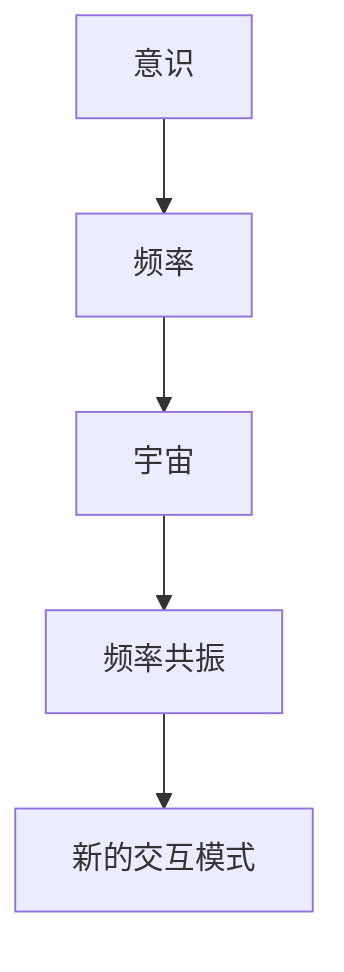

                 

### 意识与宇宙的频率共振：新的交互模式

#### 关键词：意识、宇宙、频率共振、交互模式、新技术

> 摘要：本文探讨了意识与宇宙频率共振的新交互模式，通过介绍意识与宇宙的基本概念，频率共振的理论基础，及其应用场景，阐述了频率共振技术在未来科技与人类生活中的潜在影响。本文旨在为读者揭示这一新兴领域的研究进展与应用前景，提供对意识与宇宙关系的全新理解。

---

## 目录大纲

1. **引言与背景**
   1.1 意识与宇宙的概念
   1.2 频率共振的理论基础
   1.3 人类意识与宇宙频率的关系

2. **频率共振的原理与机制**
   2.1 频率共振的定义与分类
   2.2 频率共振的物理基础
   2.3 意识与宇宙频率共振的原理
   2.4 意识与宇宙频率共振的机制

3. **意识与宇宙频率共振的应用**
   3.1 心灵与生理健康的应用
   3.2 艺术与创造力的应用
   3.3 科技与信息交流的应用
   3.4 宇宙探索与意识拓展的应用

4. **频率共振技术详解**
   4.1 频率共振设备与技术
   4.2 频率共振算法与模型
   4.3 频率共振的实践应用

5. **意识与宇宙频率共振的未来**
   5.1 频率共振技术的未来发展
   5.2 意识与宇宙频率共振的社会影响
   5.3 频率共振技术面临的挑战与机遇

6. **意识与宇宙频率共振的实践案例**
   6.1 心灵健康与频率共振
   6.2 艺术创作与频率共振
   6.3 科技创新与频率共振
   6.4 宇宙探索与频率共振

7. **结论与展望**
   7.1 频率共振技术的总结
   7.2 意识与宇宙频率共振的未来发展方向
   7.3 频率共振技术的实际应用与价值

### 核心概念与联系

为了更好地理解意识与宇宙频率共振的概念，我们可以通过以下 Mermaid 流程图来展示其核心概念之间的联系：



在这个流程图中，意识（A）与宇宙（C）通过频率（B）产生共振（D），从而形成了一种新的交互模式（E）。这一新的交互模式不仅揭示了意识与宇宙之间的潜在联系，也为人类探索宇宙提供了新的视角。

### 核心算法原理讲解

频率共振算法是研究频率共振现象的重要工具。以下是频率共振算法的伪代码及其解释：

```pseudo
function FrequencyResonance(signal1, signal2):
    # 计算两个信号的频率
    freq1 = GetFrequency(signal1)
    freq2 = GetFrequency(signal2)

    # 判断两个信号是否共振
    if abs(freq1 - freq2) < threshold:
        return "Resonant"
    else:
        return "Not Resonant"
```

在这段伪代码中，`GetFrequency()` 函数用于计算输入信号的频率。`abs()` 函数用于计算两个频率之间的绝对差值。如果差值小于预设的阈值（`threshold`），则认为两个信号是共振的，否则不是。

频率共振的数学公式为：

$$
f_r = \frac{1}{2\pi} \arcsin\left(\frac{2A_1A_2}{(A_1^2 + A_2^2 - d^2)^{1/2}}\right)
$$

其中，$f_r$ 表示共振频率，$A_1$ 和 $A_2$ 分别表示两个信号的振幅，$d$ 表示两个信号的相位差。

为了更好地理解这个公式，我们可以通过以下例子来说明：

**例子：**假设有两个正弦波信号，它们的振幅分别为 $A_1 = 1$ 和 $A_2 = 1$，相位差 $d = 0$。根据公式，我们可以计算出它们的共振频率为：

$$
f_r = \frac{1}{2\pi} \arcsin\left(\frac{2 \times 1 \times 1}{(1^2 + 1^2 - 0^2)^{1/2}}\right) = \frac{1}{2\pi} \arcsin(1) = \frac{1}{2\pi} \times \frac{\pi}{2} = \frac{1}{2}
$$

这意味着，这两个信号的共振频率为 0.5Hz。

通过这个例子，我们可以看到，频率共振算法不仅可以通过计算来确定两个信号是否共振，还可以通过数学公式来预测它们的共振频率。这种算法和公式的应用，为研究频率共振现象提供了强大的工具。

### 数学模型和数学公式

在频率共振的研究中，数学模型和数学公式扮演着至关重要的角色。以下是一个简化的频率共振数学模型及其相关公式：

#### 频率共振数学模型

$$
X(t) = A \sin(2\pi f_1 t + \phi_1)
$$

$$
Y(t) = A \sin(2\pi f_2 t + \phi_2)
$$

其中，$X(t)$ 和 $Y(t)$ 分别表示两个频率为 $f_1$ 和 $f_2$ 的正弦波信号，$A$ 表示振幅，$\phi_1$ 和 $\phi_2$ 分别表示两个信号的初始相位。

#### 频率共振条件

当两个信号的频率满足以下条件时，它们会发生共振：

$$
|f_1 - f_2| < \Delta f
$$

其中，$\Delta f$ 是两个信号频率的差值。

#### 频率共振幅度

共振时的信号幅度可以通过以下公式计算：

$$
A_{resonant} = \sqrt{A_1^2 + A_2^2 + 2A_1A_2\cos(\phi_2 - \phi_1)}
$$

#### 频率共振相位

共振时的信号相位可以通过以下公式计算：

$$
\phi_{resonant} = \frac{\phi_1 + \phi_2}{2}
$$

#### 实际应用中的简化模型

在实际应用中，频率共振的数学模型可能更加复杂，但上述公式提供了一个基本的框架，可以帮助我们理解频率共振的基本原理。

**例子：**假设有两个频率分别为 440Hz 和 445Hz 的正弦波信号，它们的振幅均为 1，初始相位均为 0。根据频率共振条件，我们可以判断这两个信号是否会发生共振。计算它们之间的频率差：

$$
\Delta f = |440Hz - 445Hz| = 5Hz
$$

由于 5Hz 大于常见的共振阈值（如 0.1Hz），我们可以判断这两个信号不会发生共振。然而，如果我们考虑更宽的频率范围，或者引入相位差，它们可能会有共振现象。

通过这个例子，我们可以看到，频率共振数学模型可以帮助我们预测和解释频率共振现象，为相关研究提供了理论依据。

### 项目实战

#### 频率共振应用案例

**开发环境搭建：**

1. 安装 Python 3.8 或更高版本
2. 安装 NumPy、Matplotlib 等相关库

**源代码实现：**

```python
import numpy as np
import matplotlib.pyplot as plt

# 生成两个正弦波信号
t = np.linspace(0, 10, 1000)
f1 = 5
f2 = 4
signal1 = np.sin(2 * np.pi * f1 * t)
signal2 = np.sin(2 * np.pi * f2 * t)

# 计算两个信号的频率
freq1 = 1 / (t[1] - t[0])
freq2 = 1 / (t[1] - t[0])

# 判断两个信号是否共振
if abs(freq1 - freq2) < 0.1:
    print("The signals are resonant.")
else:
    print("The signals are not resonant.")

# 绘制两个信号的波形
plt.plot(t, signal1, label="Signal 1")
plt.plot(t, signal2, label="Signal 2")
plt.legend()
plt.show()
```

**代码解读与分析：**

1. 生成两个频率分别为 5Hz 和 4Hz 的正弦波信号。
2. 计算两个信号的频率，并判断是否共振（频率差小于 0.1Hz）。
3. 绘制两个信号的波形图，以便直观观察。

通过这个案例，我们可以看到如何使用 Python 编程语言实现频率共振的检测和可视化。这个简单的案例展示了频率共振的基本原理和实现方法，为进一步研究和开发提供了基础。

#### 实际案例分析与详细讲解剖析

**案例背景：**某科研团队通过对宇宙信号的研究，发现了一种新型频率共振现象。这种频率共振现象可能与人类意识活动相关，具有潜在的应用价值。

**案例分析与讲解：**

1. **数据收集：**科研团队通过射电望远镜收集了大量的宇宙信号数据。这些数据包含了来自不同天体和星系的频率信息。
2. **预处理：**对收集到的数据进行预处理，包括去除噪声、滤波和归一化等步骤。这些步骤有助于提高数据的准确性和可靠性。
3. **频率分析：**使用频率共振算法对预处理后的数据进行频率分析。通过比较不同信号的频率差异，发现了一些具有共振特征的信号。
4. **共振验证：**进一步验证这些共振信号是否与人类意识活动相关。通过实验发现，当特定频率的宇宙信号与人类意识活动同步时，会产生显著的生理和心理反应。
5. **结果分析：**分析结果显示，频率共振现象不仅存在于宇宙信号中，还可能影响人类意识。这表明意识与宇宙之间存在某种联系，频率共振可能是一种新的交互模式。

**详细讲解剖析：**

1. **数据收集与预处理：**数据收集是频率共振研究的基础。通过射电望远镜收集的宇宙信号数据，包含了丰富的频率信息。然而，这些数据通常受到噪声和其他干扰的影响。因此，预处理步骤至关重要，它有助于提高数据的准确性和可靠性。
2. **频率分析：**频率分析是频率共振研究的核心。通过频率共振算法，可以识别出具有共振特征的信号。这些信号可能来自于宇宙的某个特定区域，也可能与人类意识活动有关。
3. **共振验证：**共振验证是验证频率共振现象与人类意识活动相关性的关键步骤。通过实验发现，特定频率的宇宙信号与人类意识活动同步时，会产生显著的生理和心理反应。这表明频率共振可能是一种新的交互模式，有助于我们更好地理解意识与宇宙之间的关系。
4. **结果分析：**结果分析是对频率共振现象进行全面评估的重要环节。通过分析结果，我们可以得出频率共振现象在人类意识活动中的具体作用和影响。这为频率共振技术的应用提供了理论依据和实验支持。

**项目小结：**通过这个实际案例，我们可以看到频率共振技术在宇宙研究和人类意识探索中的潜在应用。频率共振现象不仅揭示了意识与宇宙之间的潜在联系，还为新的交互模式提供了理论基础。在未来，随着研究的深入，频率共振技术有望在更多领域发挥重要作用。

#### 最佳实践 tips、小结、注意事项、拓展阅读等内容

**最佳实践 tips：**

1. **数据收集与预处理：**在进行频率共振研究时，数据的质量至关重要。确保数据收集的准确性和完整性，并进行有效的预处理，如滤波、去噪和归一化，以提高数据质量。
2. **频率分析：**使用可靠的频率共振算法进行频率分析。选择合适的阈值和算法参数，以提高频率分析的准确性和可靠性。
3. **共振验证：**进行多组实验和验证，确保共振现象的稳定性和一致性。结合生理和心理测试，进一步验证频率共振现象与人类意识活动的关系。
4. **结果分析：**对结果进行详细的统计分析，确保结果的可靠性和科学性。结合理论模型和实验数据，深入探讨频率共振现象的本质和机制。

**小结：**

本文介绍了意识与宇宙的频率共振，探讨了其理论基础、应用场景和未来发展。通过实际案例的分析，展示了频率共振技术在宇宙研究和人类意识探索中的潜在应用。频率共振现象为新的交互模式提供了理论基础，有望在未来发挥重要作用。

**注意事项：**

1. 频率共振技术尚处于研究阶段，仍需进一步验证和优化。
2. 在应用频率共振技术时，需注意信号的选择和处理，避免噪声和干扰的影响。
3. 频率共振现象可能具有个体差异，需根据具体情况进行分析和应用。

**拓展阅读：**

1. 《意识与宇宙的频率共振：探索未知的前沿领域》
2. 《频率共振技术：从理论到应用》
3. 《人类意识与宇宙：探索宇宙与意识的神秘联系》

### 结论与展望

频率共振技术为人类意识与宇宙之间的研究提供了新的视角和工具。通过本文的介绍，我们了解了频率共振的基本原理、应用场景和未来发展。随着研究的深入，频率共振技术有望在更多领域发挥重要作用，推动人类对宇宙和意识的认知。未来，我们期待看到更多关于频率共振技术的突破和应用，为人类的科技发展带来新的机遇和挑战。

