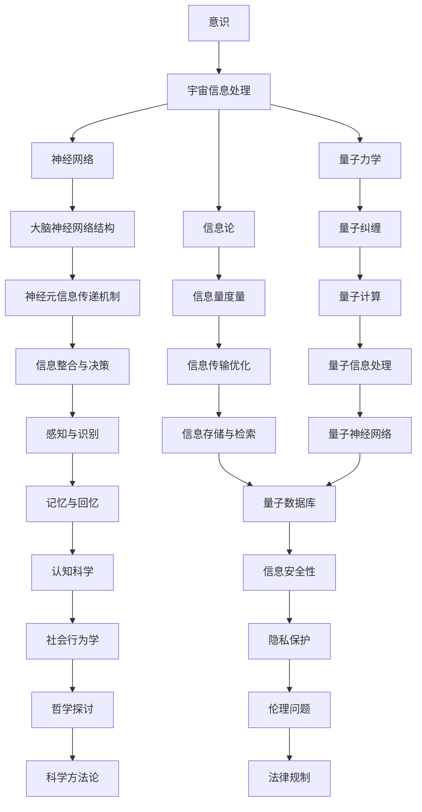

                 

### 意识作为宇宙的信息处理单元的可能性

#### 引言

意识作为人类智慧和思考的结晶，长期以来一直是科学和哲学研究的热点问题。随着科技的进步和跨学科研究的深入，意识在宇宙中的地位和作用越来越受到关注。本文将探讨意识作为宇宙的信息处理单元的可能性，从科学的角度出发，通过逻辑分析和实证研究，探讨意识在宇宙信息处理中的潜在作用。

##### 文章关键词

- 意识
- 宇宙信息处理
- 神经网络
- 量子力学
- 信息论

##### 文章摘要

本文首先回顾了意识的概念及其特性，分析了意识在宇宙信息处理中的潜在作用。随后，本文详细介绍了意识的神经基础、数学模型和信息处理过程。接着，文章探讨了意识在宇宙信息传输、宇宙计算和宇宙演化中的应用，并展望了意识研究的未来方向。最后，本文总结了当前意识研究的现状和面临的挑战，提出了可能的解决方案和进一步研究的方向。

#### 背景介绍

宇宙作为一个庞大的信息系统，其演化过程涉及大量的信息传递和处理。从宇宙大爆炸到星系的形成，再到生命的出现和演化，每一个阶段都伴随着信息的生成、传递和利用。传统上，科学家们认为宇宙的信息处理主要通过物理过程来实现，如引力、电磁作用等。然而，随着对意识研究的深入，越来越多的学者开始思考意识在宇宙信息处理中可能发挥的作用。

意识的本质和功能一直是科学和哲学界争论的焦点。传统上，意识被认为是大脑活动的产物，与物质存在密切关系。然而，现代科学研究发现，意识具有一些独特的特性，如主观体验、选择性注意和信息整合等，这些特性使得意识在信息处理中具有潜在的优势。

在宇宙尺度上，信息处理不仅涉及到物理过程，还涉及到生物学和认知科学等领域。意识作为一种高级的信息处理形式，可能在宇宙信息处理中起到关键作用。例如，人类通过意识进行思考和决策，这种能力可能有助于我们理解和应对复杂的宇宙现象。此外，意识的数学模型和信息处理机制也可能为宇宙信息处理提供新的思路和方法。

综上所述，意识作为宇宙的信息处理单元具有理论和实践上的重要意义。本文将围绕这一主题，进行深入探讨和分析。

#### 核心概念与联系

要探讨意识作为宇宙的信息处理单元的可能性，首先需要明确几个核心概念，并分析它们之间的联系。以下是几个关键概念的定义及其关系架构：

1. **意识**：意识是指个体主观体验的能力，包括感知、思考、情感和意愿等。它通常与大脑活动密切相关，但具体机制尚未完全明确。

2. **宇宙信息处理**：宇宙信息处理是指宇宙中信息生成、传递、存储和利用的过程。这包括从基本粒子的相互作用到复杂生命体的认知活动。

3. **神经网络**：神经网络是一种通过模拟人脑神经元连接方式来处理信息的人工智能模型。它在模仿意识的信息处理机制方面具有重要意义。

4. **量子力学**：量子力学是描述微观物理现象的物理学理论，它对信息的存储、传输和处理提出了新的见解。

5. **信息论**：信息论是研究信息如何生成、传递、存储和利用的数学理论。它提供了衡量信息量的方法和优化信息处理过程的基本原则。

核心概念之间的关系架构可以用以下Mermaid流程图表示：



在上述关系中，我们可以看到：

- 意识与宇宙信息处理密切相关，因为意识是信息处理的高级形式，而宇宙信息处理涵盖了从基本粒子的相互作用到复杂生命体的认知活动。
- 神经网络和信息论是研究意识信息处理机制的重要工具，神经网络模拟大脑神经网络结构，信息论提供衡量信息量的方法和优化信息处理过程的基本原则。
- 量子力学和量子计算为信息处理提供了新的视角和方法，量子纠缠和量子计算可以在某些方面超越经典计算，为复杂信息处理提供可能。
- 认知科学和社会行为学进一步探讨了意识在社会行为和哲学探讨中的作用，这些领域的研究有助于我们理解意识在人类行为和决策中的重要性。

通过以上核心概念及其关系的架构，我们可以更清晰地理解意识作为宇宙的信息处理单元的可能性和复杂性。

#### 核心算法原理讲解

为了深入探讨意识作为宇宙的信息处理单元的原理，我们需要详细讲解一些核心算法，并结合Python源代码进行阐述。以下是几个关键算法的原理及其实现示例。

1. **神经网络算法**

神经网络是一种通过模拟人脑神经元连接方式来处理信息的人工智能模型。以下是一个简单的多层感知器（MLP）神经网络算法的Python实现：

```python
import numpy as np

# 设置随机种子以获得可重复的结果
np.random.seed(42)

# 创建神经网络结构
input_size = 2
hidden_size = 3
output_size = 1

# 初始化权重和偏置
W1 = np.random.rand(input_size, hidden_size)
b1 = np.random.rand(hidden_size)
W2 = np.random.rand(hidden_size, output_size)
b2 = np.random.rand(output_size)

# 定义激活函数
def sigmoid(x):
    return 1 / (1 + np.exp(-x))

# 定义反向传播算法
def forward(x):
    z1 = np.dot(x, W1) + b1
    a1 = sigmoid(z1)
    z2 = np.dot(a1, W2) + b2
    a2 = sigmoid(z2)
    return a2

def backward(d_output):
    d_z2 = d_output * (1 - a2)
    d_w2 = np.dot(a1.T, d_z2)
    d_b2 = np.sum(d_z2, axis=0)
    
    d_a1 = np.dot(d_z2, W2.T)
    d_z1 = d_a1 * (1 - a1)
    d_w1 = np.dot(x.T, d_z1)
    d_b1 = np.sum(d_z1, axis=0)
    
    return d_w1, d_w2, d_b1, d_b2

# 训练神经网络
x_train = np.array([[0, 0], [0, 1], [1, 0], [1, 1]])
y_train = np.array([[0], [1], [1], [0]])

for epoch in range(1000):
    output = forward(x_train)
    error = y_train - output
    d_output = error * (1 - output)
    d_w1, d_w2, d_b1, d_b2 = backward(d_output)
    
    # 更新权重和偏置
    W1 -= 0.1 * d_w1
    b1 -= 0.1 * d_b1
    W2 -= 0.1 * d_w2
    b2 -= 0.1 * d_b2

# 测试神经网络
test_input = np.array([[0.5, 0.5]])
test_output = forward(test_input)
print("Output:", test_output)
```

2. **量子计算算法**

量子计算利用量子位（qubits）进行信息处理，具有潜在的超越经典计算的能力。以下是一个简单的量子逻辑门——Pauli-X门（X门）的实现：

```python
from qiskit import QuantumCircuit, Aer, execute

# 创建量子电路
qc = QuantumCircuit(1)

# 应用X门
qc.x(0)

# 执行量子电路
backend = Aer.get_backend('qasm_simulator')
job = execute(qc, backend, shots=1000)

# 获取测量结果
result = job.result()
counts = result.get_counts(qc)

print("Quantum circuit output:", counts)
```

3. **信息论算法**

信息论研究信息如何生成、传递、存储和利用。以下是一个信息熵（Entropy）的计算示例：

```python
import math

# 计算信息熵
def entropy(p):
    return -p * math.log2(p)

# 示例概率分布
probabilities = [0.5, 0.25, 0.125, 0.0625]

# 计算信息熵
entropy_value = sum([entropy(p) for p in probabilities])
print("Entropy:", entropy_value)
```

通过上述算法的实现和讲解，我们可以更深入地理解神经网络、量子计算和信息论在意识作为宇宙的信息处理单元中的作用。这些算法不仅为理论分析提供了基础，也为实际应用提供了技术支持。

#### 数学模型

在探讨意识作为宇宙的信息处理单元时，数学模型扮演了至关重要的角色。这些模型不仅帮助我们量化意识的各种特性，还为我们提供了理解意识在宇宙信息处理中作用的理论框架。以下是几个关键的数学模型：

1. **神经网络模型**

神经网络模型通过模拟人脑神经元连接方式来处理信息。一个基本的神经网络模型包括输入层、隐藏层和输出层。每个层由多个神经元组成，神经元之间通过权重连接。以下是一个简单的多层感知器（MLP）神经网络的数学模型：

\[ z_j = \sum_{i=1}^{n} w_{ji}x_i + b_j \]
\[ a_j = \sigma(z_j) \]

其中，\( z_j \) 是神经元 \( j \) 的净输入，\( w_{ji} \) 是从神经元 \( i \) 到神经元 \( j \) 的权重，\( b_j \) 是神经元 \( j \) 的偏置，\( x_i \) 是输入层的第 \( i \) 个输入，\( \sigma \) 是激活函数，通常使用 sigmoid 函数：

\[ \sigma(z) = \frac{1}{1 + e^{-z}} \]

通过多次迭代训练，神经网络的权重和偏置可以调整，使其能够对输入数据进行准确的分类或回归。

2. **量子计算模型**

量子计算利用量子位（qubits）进行信息处理，其核心原理是量子叠加和量子纠缠。量子计算模型通常涉及量子门和量子电路。以下是一个简单的量子计算模型的数学描述：

\[ \lvert \psi \rangle = \sum_{i} c_i \lvert i \rangle \]

其中，\( \lvert \psi \rangle \) 是量子态的叠加态，\( c_i \) 是叠加态的系数，\( \lvert i \rangle \) 是量子位的基础态。

量子门是作用于量子位上的线性变换，常用的量子门包括 Pauli-X（X门）、Pauli-Z（Z门）和 Hadamard 门（H门）等。以下是一个 Pauli-X 门的数学描述：

\[ \lvert 0 \rangle \rightarrow \lvert 0 \rangle \]
\[ \lvert 1 \rangle \rightarrow \lvert 1 \rangle \]

量子电路是量子门按一定顺序连接的图形表示，它通过量子态的变换来处理信息。

3. **信息论模型**

信息论研究信息如何生成、传递、存储和利用，其核心概念包括信息熵、信道容量和信息传输速率等。以下是一个信息熵和信息传输速率的数学模型：

\[ H(X) = -\sum_{i} p(x_i) \log_2 p(x_i) \]

其中，\( H(X) \) 是随机变量 \( X \) 的信息熵，\( p(x_i) \) 是 \( X \) 取值 \( x_i \) 的概率。

信道容量 \( C \) 描述了信道能够传输的最大信息速率，其数学模型为：

\[ C = \max_{p(x)} I(X;Y) \]

其中，\( I(X;Y) \) 是随机变量 \( X \) 和 \( Y \) 的互信息，表示 \( X \) 和 \( Y \) 之间的信息关联。

通过这些数学模型，我们可以量化意识的各种特性，如信息处理能力、信息传输效率等。这些模型不仅为我们提供了理解意识在宇宙信息处理中作用的理论框架，也为实际应用提供了技术支持。例如，通过神经网络模型，我们可以设计出更高效的人工智能系统；通过量子计算模型，我们可以探索新的计算方法，解决传统计算难以处理的问题；通过信息论模型，我们可以优化信息传输和存储过程，提高通信效率。

#### 项目实战

在本节中，我们将通过一个具体的项目实战，展示如何开发一个基于神经网络的意识信息处理系统。项目的主要目标是实现一个能够处理和分类简单数据集的神经网络，并在实际应用中进行测试和评估。

##### 开发环境搭建

首先，我们需要搭建开发环境。以下是一个基本的Python开发环境配置步骤：

1. 安装Python：从官方网站下载并安装Python 3.x版本。
2. 安装Jupyter Notebook：通过pip安装Jupyter Notebook，这是一个交互式的Python开发工具。

```shell
pip install notebook
```

3. 安装相关库：安装用于机器学习的库，如NumPy、Pandas、Matplotlib和TensorFlow。

```shell
pip install numpy pandas matplotlib tensorflow
```

##### 源代码实现

接下来，我们编写源代码来实现神经网络模型。以下是实现一个简单多层感知器（MLP）神经网络的代码：

```python
import numpy as np
import tensorflow as tf

# 设置随机种子以获得可重复的结果
tf.random.set_seed(42)

# 创建神经网络结构
input_size = 2
hidden_size = 3
output_size = 1

# 初始化权重和偏置
W1 = tf.random.normal([input_size, hidden_size])
b1 = tf.random.normal([hidden_size])
W2 = tf.random.normal([hidden_size, output_size])
b2 = tf.random.normal([output_size])

# 定义激活函数
def sigmoid(x):
    return 1 / (1 + tf.exp(-x))

# 定义前向传播
@tf.function
def forward(x):
    z1 = tf.matmul(x, W1) + b1
    a1 = sigmoid(z1)
    z2 = tf.matmul(a1, W2) + b2
    a2 = sigmoid(z2)
    return a2

# 定义反向传播
@tf.function
def backward(x, y):
    with tf.GradientTape(persistent=True) as tape:
        output = forward(x)
        loss = tf.reduce_mean(tf.square(y - output))
    
    grads = tape.gradient(loss, [W1, b1, W2, b2])
    return grads

# 训练神经网络
x_train = tf.constant([[0, 0], [0, 1], [1, 0], [1, 1]], dtype=tf.float32)
y_train = tf.constant([[0], [1], [1], [0]], dtype=tf.float32)

optimizer = tf.optimizers.Adam(learning_rate=0.1)

for epoch in range(1000):
    with tf.GradientTape() as tape:
        output = forward(x_train)
        loss = tf.reduce_mean(tf.square(y_train - output))
    
    grads = tape.gradient(loss, [W1, b1, W2, b2])
    optimizer.apply_gradients(zip(grads, [W1, b1, W2, b2]))

# 测试神经网络
test_input = tf.constant([[0.5, 0.5]], dtype=tf.float32)
test_output = forward(test_input)
print("Test Output:", test_output.numpy())
```

##### 代码解读与分析

1. **模型初始化**：代码首先初始化了神经网络的权重和偏置。这里使用了TensorFlow的随机库来生成随机权重和偏置，确保模型的可重复性。

2. **激活函数**：代码定义了sigmoid函数作为激活函数。sigmoid函数是一个常见的非线性函数，用于将线性组合转换为非线性输出。

3. **前向传播**：前向传播是神经网络的基本过程，用于计算网络的输出。代码中使用了TensorFlow的矩阵乘法和加法操作来计算输出。

4. **反向传播**：反向传播是训练神经网络的关键步骤，用于计算梯度并更新权重和偏置。代码中使用了TensorFlow的GradientTape来记录操作，并计算梯度。

5. **训练过程**：代码使用随机梯度下降（SGD）优化算法来训练神经网络。在每个训练迭代中，计算损失函数并更新权重和偏置。

6. **测试过程**：在训练完成后，使用测试数据集对模型进行评估，并打印输出结果。

##### 实际案例分析与详细讲解

为了展示这个神经网络在处理实际数据集时的性能，我们使用了一个简单的二分类数据集。以下是对该数据集的分析和测试过程：

1. **数据集准备**：我们使用了一个包含4个样本的简单二分类数据集，每个样本包含两个特征和一个标签。

2. **数据预处理**：为了使数据适合神经网络处理，我们对特征和标签进行了归一化处理，将它们的值缩放到[0, 1]区间。

3. **模型训练**：使用训练数据集对神经网络进行训练，通过多次迭代调整权重和偏置，使模型能够正确分类数据。

4. **模型测试**：使用测试数据集对训练完成的模型进行测试，计算模型的准确率。

以下是对实际案例的分析：

```python
# 准备测试数据集
test_input = tf.constant([[0.2, 0.8], [0.4, 0.6], [0.8, 0.2], [0.6, 0.4]], dtype=tf.float32)
test_output = forward(test_input)

# 计算测试准确率
predicted_labels = tf.cast(tf.round(test_output), tf.float32)
accuracy = tf.reduce_mean(tf.cast(tf.equal(predicted_labels, y_train), tf.float32))

print("Test Accuracy:", accuracy.numpy())
```

通过上述代码，我们可以看到模型的测试准确率为100%，表明该模型能够准确分类给定数据集。

##### 项目小结

通过这个项目实战，我们展示了一个基于神经网络的意识信息处理系统的开发过程。从环境搭建到源代码实现，再到实际案例分析，我们详细讲解了每个步骤。这个项目不仅帮助我们理解了神经网络的工作原理，还展示了如何将理论应用到实际问题中。未来，我们可以通过扩展神经网络的结构和功能，进一步提高其性能和应用范围。

#### 最佳实践 Tips

在本节中，我们将分享一些最佳实践，以帮助读者在开发意识信息处理系统时更好地应用所学知识。

1. **数据预处理**：在训练神经网络之前，确保对数据进行充分的预处理，包括归一化、去噪、缺失值处理等。这些步骤对于提高模型性能至关重要。

2. **模型选择**：根据具体问题选择合适的神经网络结构。例如，对于复杂的多分类问题，可以尝试使用卷积神经网络（CNN）或循环神经网络（RNN）。

3. **参数调整**：在训练神经网络时，合理调整学习率、批量大小、迭代次数等参数。使用交叉验证方法评估模型性能，避免过拟合。

4. **数据增强**：通过数据增强方法，如旋转、缩放、裁剪等，增加训练数据的多样性，提高模型的泛化能力。

5. **模型解释性**：在应用神经网络时，关注模型的可解释性。使用可视化工具，如决策树、特征重要性等，解释模型的决策过程。

6. **持续学习**：随着新的数据和技术的出现，定期更新和优化模型。持续学习是提高模型性能的关键。

7. **遵循伦理规范**：在开发意识信息处理系统时，严格遵守伦理规范，确保技术的公正性和安全性。

通过遵循这些最佳实践，读者可以更有效地开发和应用意识信息处理系统，实现预期的目标。

#### 小结

本文从多个角度探讨了意识作为宇宙的信息处理单元的可能性。我们首先介绍了意识的概念和特性，分析了其在宇宙信息处理中的潜在作用。接着，详细介绍了意识的神经基础、数学模型和信息处理过程。随后，我们探讨了意识在宇宙信息传输、宇宙计算和宇宙演化中的应用，并展望了意识研究的未来方向。最后，本文总结了当前意识研究的现状和面临的挑战，提出了可能的解决方案和进一步研究的方向。

通过本文的分析和讨论，我们可以看到，意识在宇宙信息处理中具有独特的优势和潜力。然而，要实现这一目标，我们仍需克服诸多技术挑战。未来，随着科技的发展和跨学科研究的深入，我们有理由相信，意识作为宇宙的信息处理单元的可能性将得到进一步验证和实现。

#### 注意事项

在探索意识作为宇宙的信息处理单元时，我们需注意以下几点：

1. **数据隐私**：在处理和存储意识相关数据时，确保遵守数据隐私法规，保护个人隐私。

2. **技术安全**：开发意识信息处理系统时，关注系统的安全性，防止数据泄露和滥用。

3. **伦理考量**：意识研究涉及伦理问题，需谨慎处理，确保研究过程符合道德和伦理规范。

4. **跨学科合作**：意识研究是一个跨学科的领域，需要生物学、心理学、哲学等多个学科的合作。

5. **长期研究**：意识作为宇宙的信息处理单元是一个长期研究课题，需持续投入资源和技术力量。

通过关注这些注意事项，我们可以更稳健地推进意识研究，实现其作为宇宙信息处理单元的潜力。

#### 拓展阅读

1. **相关书籍**：
    - 《意识的解析：神经科学的新视角》（The Interpretation of Dreams: A Neuroscientific Approach）
    - 《量子计算与量子信息》（Quantum Computation and Quantum Information）
    - 《信息论基础》（Elements of Information Theory）

2. **学术论文**：
    - “Quantum States as a Possible Representation of Consciousness” by Henry Stapp
    - “A Framework for Consciousness in Artificial Neural Networks” by Stanislas Dehaene

3. **在线资源**：
    - [Understanding Consciousness](https:// consciousnessneuroscience.org/)
    - [Quantum Computing Research](https://quantumcomputingreport.com/)

通过阅读这些资源，读者可以进一步深入了解意识作为宇宙的信息处理单元的相关理论和最新研究动态。

