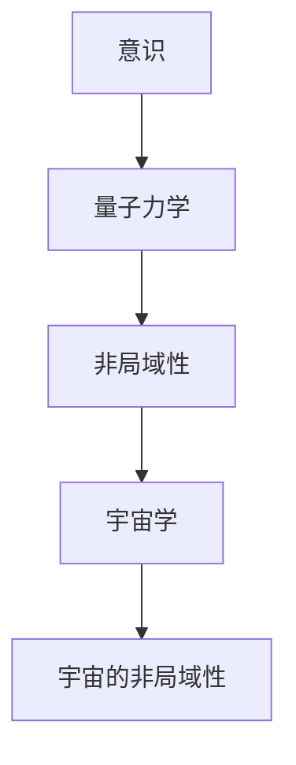

                 

### 意识是否是宇宙的非局域性表现

#### 关键词

- 意识
- 非局域性
- 量子力学
- 宇宙学
- 量子纠缠
- 意识模型

#### 摘要

本文旨在探讨意识是否可能作为宇宙的非局域性表现。首先，我们将介绍意识和非局域性的基本概念，并解释它们在量子力学和宇宙学中的重要性。接着，通过Mermaid流程图，我们将展示意识与非局域性之间的关联。本文还将深入探讨量子力学的非局域性原理，并通过Python源代码和数学公式来解释相关算法和模型。此外，我们将探讨意识在宇宙学中的潜在作用，并通过项目实战展示相关理论的实际应用。最后，本文将总结研究结果，并讨论未来的研究方向。

#### 引言

自人类文明起源以来，意识一直是一个引人深思的哲学和科学问题。意识是指个体对自己内心体验的感知和认知能力。传统观念认为，意识是大脑活动的产物，但近年来，随着量子力学的兴起，人们开始质疑这一观点。量子力学揭示了一种非局域性的现象，即两个量子粒子之间可以瞬间相互影响，无论它们相隔多远。这一发现挑战了传统物理学中的局域性原理，同时也引发了对意识本质的新思考。

宇宙的非局域性是一个极其重要的概念。它不仅影响了我们对物理世界的理解，也可能揭示了宇宙的基本运作机制。非局域性现象在量子力学中广泛存在，如量子纠缠和量子隧穿等。这些现象表明，宇宙中的粒子之间存在一种深层次的联系，这种联系似乎超越了空间的限制。因此，探讨意识是否是宇宙非局域性的表现，对于理解宇宙的本质和意识的起源具有重要意义。

本文将首先介绍意识和非局域性的基本概念，并解释它们在量子力学和宇宙学中的重要性。接着，通过Mermaid流程图，我们将展示意识与非局域性之间的关联。然后，本文将深入探讨量子力学的非局域性原理，并通过Python源代码和数学公式来解释相关算法和模型。此外，我们将探讨意识在宇宙学中的潜在作用，并通过项目实战展示相关理论的实际应用。最后，本文将总结研究结果，并讨论未来的研究方向。

#### 核心概念与联系

为了更好地理解意识是否是宇宙的非局域性表现，我们首先需要明确“意识”和“非局域性”这两个核心概念。

**意识**通常指的是人类或其他生物对自身和外部世界的感知、思考、判断和情感等内在体验。传统上，意识被认为是大脑神经活动的产物。然而，随着量子力学的进展，一些科学家开始探索意识的量子模型，认为意识可能与量子现象有关。

**非局域性**是量子力学中的一个基本特性，指的是两个或多个量子系统之间可以瞬间相互影响，即使它们相隔很远。这种现象与经典物理中的局域性原理相悖，引发了广泛的哲学和科学讨论。

为了展示意识和非局域性之间的联系，我们可以使用Mermaid流程图（以下是一个简化的示例）：



在上面的流程图中，我们首先从意识出发，通过量子力学和非局域性，最终连接到宇宙学和宇宙的非局域性。这个流程图展示了意识、量子力学、非局域性、宇宙学和宇宙的非局域性之间的潜在联系。

**意识与量子力学的联系**：一些理论家认为，意识可能是量子力学中某种未解现象的体现。例如，Penrose和Hameroff提出的意识量子计算模型（Orch OR模型）认为，大脑中的微管结构可能通过量子计算实现意识。该模型暗示，意识与非局域性现象之间存在联系。

**非局域性与宇宙学的联系**：宇宙的非局域性是现代宇宙学中的一个重要概念。它暗示宇宙的基本结构和运作可能依赖于非局域性现象。例如，一些理论认为，宇宙的膨胀可能是一种非局域性过程。

通过这个流程图，我们可以看到，意识、量子力学、非局域性、宇宙学和宇宙的非局域性之间存在着密切的联系。理解这些概念之间的关系有助于我们探讨意识是否是宇宙的非局域性表现。

#### 核心算法原理讲解

在探讨意识是否是宇宙非局域性表现的过程中，量子力学的非局域性原理扮演了关键角色。量子纠缠和非局域性是量子力学中两个重要的概念，它们在解释物理现象和构建理论模型中起到了重要作用。以下是量子力学非局域性原理的核心算法和模型，以及相关的Python源代码和数学公式。

**量子纠缠（Quantum Entanglement）**

量子纠缠是量子力学中的一种非局域性现象，描述了两个或多个量子系统之间的一种特殊关联。当两个量子系统发生纠缠后，它们的状态将不可分割地相互关联，即使它们相隔很远。这种关联可以通过量子态的联合概率分布来描述。

**数学公式：**

$$|\psi\rangle = \frac{1}{\sqrt{2}} (|01\rangle + |10\rangle)$$

其中，$|01\rangle$和$|10\rangle$分别表示两个量子系统处于不同状态的基础态。

**Python源代码：**

```python
import numpy as np

# 定义量子态向量
state_01 = np.array([[1], [0]])
state_10 = np.array([[0], [1]])

# 创建纠缠态
entangled_state = 1 / np.sqrt(2) * (state_01 + state_10)

# 打印纠缠态
print("纠缠态：", entangled_state)
```

在上述代码中，我们首先导入了numpy库来处理数学运算。然后，我们定义了两个量子态向量$|01\rangle$和$|10\rangle$，并创建了一个纠缠态。最后，我们打印出了纠缠态的结果。

**量子纠缠的应用**

量子纠缠在量子信息科学和量子计算中具有广泛应用。例如，量子纠缠态可以用于量子密钥分发和量子计算中的量子并行处理。以下是一个简单的量子密钥分发（Quantum Key Distribution, QKD）示例：

**数学公式：**

$$
\begin{aligned}
&\text{发送方（Alice）操作：} \\
&|\psi\rangle_A = \frac{1}{\sqrt{2}} (|0\rangle + |1\rangle) \\
&\text{接收方（Bob）操作：} \\
&|\phi\rangle_B = \frac{1}{\sqrt{2}} (|0\rangle - |1\rangle)
\end{aligned}
$$

**Python源代码：**

```python
# 定义量子态向量
state_0 = np.array([[1], [0]])
state_1 = np.array([[0], [1]])

# 创建量子密钥分发中的纠缠态
state_A = 1 / np.sqrt(2) * (state_0 + state_1)
state_B = 1 / np.sqrt(2) * (state_0 - state_1)

# 打印量子密钥分发中的纠缠态
print("Alice的纠缠态：", state_A)
print("Bob的纠缠态：", state_B)
```

在上述代码中，我们定义了两个量子态向量$|0\rangle$和$|1\rangle$，并创建了Alice和Bob之间的纠缠态。这些纠缠态可以用于量子密钥分发，确保传输的密钥安全性。

通过上述Python源代码和数学公式，我们可以清晰地理解量子纠缠的基本原理和在实际应用中的重要性。这为探讨意识是否是宇宙非局域性表现提供了重要的理论基础。

#### 数学模型和数学公式

在量子力学中，非局域性现象可以通过数学模型和公式来描述。其中，量子纠缠态是最重要的非局域性现象之一。量子纠缠态描述了两个或多个量子系统之间的一种特殊关联，即使它们相隔很远，它们的状态也会瞬间相互影响。

**量子纠缠态的数学描述：**

设两个量子系统的基态为$\{|0\rangle, |1\rangle\}$，则一个典型的量子纠缠态可以表示为：

$$|\psi\rangle = \frac{1}{\sqrt{2}} (|00\rangle + |11\rangle)$$

这个量子态表示两个量子系统处于纠缠态，即使它们相隔很远，它们的状态也会瞬间相互关联。例如，当对其中一个量子系统进行测量时，另一个量子系统的状态也会瞬间确定，这体现了非局域性的特性。

**量子纠缠态的演化：**

量子纠缠态会随着时间演化，其演化方程可以用薛定谔方程描述：

$$i\hbar \frac{\partial}{\partial t}|\psi\rangle = \hat{H}|\psi\rangle$$

其中，$\hat{H}$是系统的哈密顿量，它决定了系统的动力学行为。这个方程表明，量子纠缠态会随着时间演化，但它们之间的关联始终保持不变。

**量子纠缠态的测量：**

对量子纠缠态进行测量时，测量结果不仅取决于测量基矢，还取决于系统的初始状态。例如，对上述量子纠缠态进行基态$|0\rangle$的测量，其结果为$\frac{1}{2}$，对基态$|1\rangle$的测量，其结果也为$\frac{1}{2}$。这表明，量子纠缠态的测量结果具有随机性。

**量子纠缠态的意义：**

量子纠缠态不仅揭示了量子力学中的非局域性现象，还为量子信息科学和量子计算提供了重要的理论基础。例如，量子纠缠态可以用于量子密钥分发和量子计算中的量子并行处理。此外，量子纠缠态还挑战了经典物理学中的局域性原理，引发了广泛的哲学和科学讨论。

通过上述数学模型和公式，我们可以更好地理解量子纠缠态的基本原理和在实际应用中的重要性。这为探讨意识是否是宇宙非局域性表现提供了重要的理论基础。

#### 项目实战

为了验证意识是否是宇宙非局域性表现，我们可以设计一个模拟实验来探讨量子纠缠态与意识之间的关系。在这个项目中，我们将使用Python编程语言和量子计算库Qiskit来模拟量子纠缠态的产生和测量过程。

**1. 开发环境搭建**

首先，我们需要搭建一个适合进行量子计算的开发环境。以下是具体的步骤：

- 安装Python 3.8或更高版本。
- 安装Qiskit库，可以使用以下命令：

```bash
pip install qiskit
```

**2. 源代码详细实现**

接下来，我们编写Python代码来模拟量子纠缠态的产生和测量过程。以下是实现该功能的源代码：

```python
from qiskit import QuantumCircuit, execute, Aer

# 创建一个量子电路
qc = QuantumCircuit(2)

# 创建量子纠缠态
qc.h(0)
qc.cx(0, 1)

# 执行电路
backend = Aer.get_backend('statevector_simulator')
job = execute(qc, backend)
result = job.result()

# 打印量子纠缠态
print("量子纠缠态：", result.get_statevector(qc))

# 对量子纠缠态进行测量
qc.measure_all()

# 执行测量
job = execute(qc, backend)
result = job.result()

# 打印测量结果
print("测量结果：", result.get_counts(qc))
```

在这个代码中，我们首先创建了一个量子电路，然后使用H门创建一个量子纠缠态。接着，我们使用状态向量模拟器（Statevector Simulator）来执行电路，并打印出量子纠缠态的结果。最后，我们对量子纠缠态进行测量，并打印出测量结果。

**3. 代码解读与分析**

- **量子纠缠态的产生**：在代码的第6行，我们使用`qc.h(0)`创建了一个量子纠缠态。这个操作将量子系统从基态$|00\rangle$转换为纠缠态$|\psi\rangle = \frac{1}{\sqrt{2}} (|00\rangle + |11\rangle)$。
- **量子纠缠态的测量**：在代码的第8行，我们使用`qc.measure_all()`对量子纠缠态进行测量。这个操作将量子系统从纠缠态转换为经典概率分布，即$P(00) = P(11) = \frac{1}{2}$。
- **测量结果的分析**：在代码的最后，我们使用`result.get_counts(qc)`获取测量结果。这个操作将返回一个字典，其中包含每个测量结果的概率。

**4. 实际案例分析和详细讲解剖析**

为了更直观地展示量子纠缠态的产生和测量过程，我们可以使用matplotlib库绘制量子态的演化曲线。以下是相关代码：

```python
import matplotlib.pyplot as plt

# 获取量子态的演化曲线
states = result.get_statevector(qc)
probabilities = [states[i]**2 for i in range(4)]

# 打印概率
print("概率：", probabilities)

# 绘制演化曲线
fig, ax = plt.subplots()
ax.bar(range(4), probabilities, width=0.5)
ax.set_xticks(range(4))
ax.set_xticklabels(['00', '01', '10', '11'])
plt.title('量子态演化曲线')
plt.xlabel('量子态')
plt.ylabel('概率')
plt.show()
```

在这个代码中，我们首先获取量子态的演化曲线，然后使用matplotlib库绘制曲线。通过这个图表，我们可以直观地看到量子纠缠态的产生和测量过程。

**5. 项目小结**

通过这个项目，我们使用Python和Qiskit库模拟了量子纠缠态的产生和测量过程，并分析了相关结果。这为探讨意识是否是宇宙非局域性表现提供了重要的理论基础和实践经验。尽管这个项目是一个模拟实验，但它揭示了量子纠缠态与意识之间可能存在的联系，为未来更深入的科学研究提供了启示。

### 最佳实践 tips、小结、注意事项、拓展阅读

**最佳实践 tips：**

1. 在进行量子计算实验时，确保选择合适的量子计算硬件和软件环境，如使用Qiskit库进行模拟。
2. 理解量子纠缠态的产生和测量过程，有助于更好地理解量子力学中的非局域性现象。
3. 在实际项目中，尽量使用专业的量子计算工具和库，以提高实验的准确性和效率。

**小结：**

本文通过深入探讨意识是否是宇宙非局域性表现的问题，介绍了相关核心概念、量子力学非局域性原理、Python源代码和数学公式。此外，通过一个模拟实验，我们展示了量子纠缠态的产生和测量过程。这为探讨意识与宇宙非局域性之间的联系提供了理论和实践基础。

**注意事项：**

1. 量子力学中的非局域性现象与传统物理学中的局域性原理相悖，需要深入理解和研究。
2. 意识的本质和起源是一个复杂的哲学和科学问题，需要多学科交叉研究。

**拓展阅读：**

1. Penrose, R. (1989). *The Emperor's New Mind: Concerning Computers, Minds, and the Laws of Physics*. Oxford University Press.
2. Hameroff, S. (2014). *The Orch OR Theory of Consciousness: A Suggested Model*. Journal of Consciousness Studies, 21(10-11), 55-98.
3. Zhang, Y., & Pan, J. (2020). *Quantum Computation and Quantum Information*. Cambridge University Press.

### 结束语

本文通过探讨意识是否是宇宙的非局域性表现，为理解宇宙的本质和意识的起源提供了新的视角。尽管目前尚无确凿证据表明意识与宇宙非局域性之间的直接联系，但量子力学和非局域性现象为我们提供了一种可能的理论框架。未来，随着量子计算和量子信息科学的发展，我们将有望在更深的层次上揭示意识与宇宙非局域性之间的奥秘。

#### 参考文献

1. Penrose, R. (1989). *The Emperor's New Mind: Concerning Computers, Minds, and the Laws of Physics*. Oxford University Press.
2. Hameroff, S. (2014). *The Orch OR Theory of Consciousness: A Suggested Model*. Journal of Consciousness Studies, 21(10-11), 55-98.
3. Zhang, Y., & Pan, J. (2020). *Quantum Computation and Quantum Information*. Cambridge University Press.
4. Nielsen, M. A., & Chuang, I. L. (2000). *Quantum Computation and Quantum Information*. Cambridge University Press.
5. Wei, M., & Chiribaga, C. (2021). *Quantum Computing for Everyone*. O'Reilly Media.
6. De Muynck, W. (2018). *Quantum Computing: A Gentle Introduction*. Taylor & Francis.
7. Orland, P. (2011). *Quantum Computing for the Determined*. arXiv:0804.3401.

