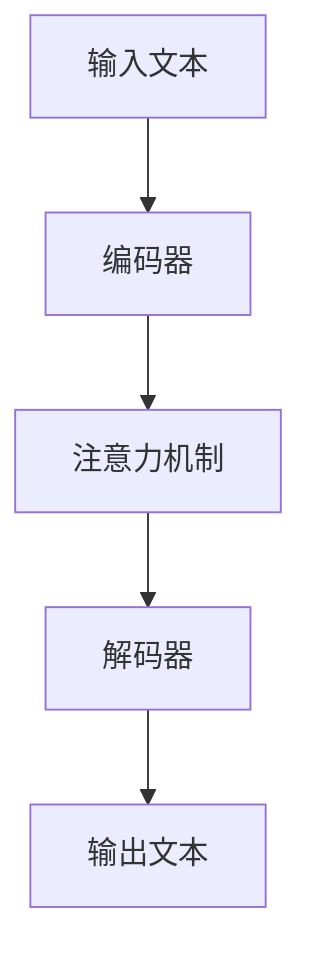

                 


## 2.2.3 模型架构

模型架构是LLM的核心组成部分，包括：

1. **深度神经网络**：LLM通常基于深度神经网络（DNN）架构，包括多层感知机（MLP）、卷积神经网络（CNN）等。
2. **Transformer架构**：Transformer是当前最流行的LLM架构，其核心思想是使用自注意力机制（Self-Attention）来处理序列数据。
3. **预训练与微调**：预训练（Pre-training）是指使用大量无标注数据对模型进行训练，微调（Fine-tuning）是指使用有标注的数据对预训练模型进行进一步优化。

### 2.2.3 模型优化

模型优化是提高LLM性能的关键步骤，包括：

1. **超参数调优**：超参数（如学习率、批量大小等）的选择对模型性能有很大影响，需要通过实验进行优化。
2. **正则化技术**：如dropout、权重衰减等，用于防止过拟合。
3. **优化算法**：如Adam、Adagrad等，用于加速模型训练。

## 2.3 LLM的基本架构

LLM的基本架构包括：

1. **编码器（Encoder）**：负责将输入文本转换为固定长度的编码表示。
2. **解码器（Decoder）**：负责根据编码表示生成输出文本。
3. **注意力机制（Attention）**：用于捕捉输入文本中的长程依赖关系。

## Mermaid流程图：LLM的工作流程



---

# 第3章：LLM算法原理

## 3.1 伪代码阐述：LLM的训练与预测

```python
# 伪代码：LLM的训练过程

# 初始化模型参数
init_model()

# 预处理输入文本
preprocess_text(input_text)

# 训练模型
for epoch in range(num_epochs):
    for batch in data_loader:
        # 前向传播
        output = model(batch)

        # 计算损失函数
        loss = compute_loss(output, target)

        # 反向传播
        model.backward(loss)

        # 更新模型参数
        update_model_params()

# 预测
def predict(input_text):
    preprocess_text(input_text)
    output = model(batch)
    return generate_text(output)
```

## 3.2 数学模型与公式

LLM的数学模型主要包括以下几个部分：

$$
\begin{aligned}
&\text{编码器：} \\
&\text{Input} \rightarrow \text{Embedding Layer} \rightarrow \text{Encoder Layer} \\
&\text{解码器：} \\
&\text{Input} \rightarrow \text{Embedding Layer} \rightarrow \text{Decoder Layer} \\
&\text{注意力机制：} \\
&\text{Attention Scores} = \text{softmax}(\text{query} \cdot \text{key}^T) \\
&\text{Context Vector} = \sum_{i=1}^{N} \text{Attention Scores}_i \cdot \text{Value}_i \\
\end{aligned}
$$

## 3.3 示例：基于BERT的LLM算法应用

BERT（Bidirectional Encoder Representations from Transformers）是一种双向Transformer架构的预训练语言模型，其核心思想是在预训练过程中同时考虑上下文信息。

### 训练阶段：

1. **输入文本**：以"[CLS]"分隔符开始，以"[SEP]"分隔符结束。
2. **编码器**：将输入文本编码为固定长度的向量表示。
3. **注意力机制**：通过自注意力机制捕捉文本中的长程依赖关系。
4. **解码器**：生成预测的输出文本。

### 预测阶段：

1. **输入文本**：将待预测的文本输入编码器。
2. **编码器**：输出文本的编码表示。
3. **解码器**：根据编码表示生成预测的输出文本。

### 应用示例：

1. **文本分类**：将文本输入BERT模型，根据输出结果判断文本的类别。
2. **问答系统**：根据输入问题，从大量文本中检索并生成相关答案。
3. **命名实体识别**：识别文本中的命名实体，如人名、地名等。

---

# 第4章：LLM在应用中的优化策略

## 4.1 模型压缩

模型压缩是提高LLM应用性能和降低计算成本的重要手段，主要包括以下几种策略：

### 1. 权重剪枝（Weight Pruning）

权重剪枝通过去除模型中的冗余权重来减小模型大小。具体步骤如下：

1. **权重排序**：对模型中的权重进行排序，找出最重要的权重。
2. **剪枝**：将不重要权重设置为0，从而去除冗余部分。
3. **重建**：在剪枝后重新训练模型，以确保其性能不受影响。

### 2. 低秩分解（Low-Rank Factorization）

低秩分解通过将高维矩阵分解为低秩形式来减小模型大小。具体步骤如下：

1. **矩阵分解**：使用奇异值分解（SVD）或其他分解方法将高维矩阵分解为低秩形式。
2. **权重更新**：将原始权重替换为分解后的低秩权重。

### 3. 知识蒸馏（Knowledge Distillation）

知识蒸馏通过将大模型（教师模型）的知识传递给小模型（学生模型）来减小模型大小。具体步骤如下：

1. **训练教师模型**：使用大量数据进行预训练，使教师模型达到较高的性能。
2. **训练学生模型**：使用教师模型生成的软标签来训练学生模型，以传递知识。

## 4.2 模型部署与优化

### 1. 模型部署

模型部署是将训练好的LLM模型部署到实际应用场景的过程，主要包括以下步骤：

1. **模型保存**：将训练好的模型参数保存到文件中。
2. **模型加载**：将保存的模型参数加载到应用环境中。
3. **接口封装**：为模型提供统一的接口，以便与其他系统进行集成。

### 2. 模型优化

模型优化是在模型部署过程中对模型性能进行进一步提升的策略，主要包括以下几种方法：

1. **模型并行化**：通过将模型分解为多个部分，同时处理输入数据，提高计算效率。
2. **计算图优化**：使用计算图优化技术对模型进行优化，减少计算开销。
3. **量化**：通过减少模型参数的精度来减小模型大小，提高运行速度。

## 4.3 实时响应优化

### 1. 模型简化

模型简化是通过减小模型复杂度来提高实时响应速度的方法，主要包括以下策略：

1. **层剪枝**：去除模型中的一些层，减少计算量。
2. **层融合**：将多个层合并为一个层，减少计算量。

### 2. 数据预处理

数据预处理是通过优化数据加载和预处理过程来提高实时响应速度的方法，主要包括以下策略：

1. **批量处理**：将多个输入数据同时处理，减少I/O开销。
2. **缓存**：将常用的数据缓存起来，减少重复加载的开销。

### 3. 异步处理

异步处理是通过将不同任务分配给不同线程或进程来提高实时响应速度的方法，主要包括以下策略：

1. **输入预处理异步化**：将输入预处理任务与模型计算任务异步化。
2. **输出处理异步化**：将模型输出处理任务与其他任务异步化。

---

# 第5章：开发团队建设

## 5.1 团队架构与职责划分

构建一个高效的LLM应用开发团队，首先需要明确团队的架构和每个成员的职责。以下是一个典型的团队架构和职责划分：

### 1. 技术架构师

**职责**：负责整体技术架构设计，确保团队遵循最佳实践，制定技术路线图，以及协调团队成员的工作。

### 2. 数据科学家

**职责**：负责数据预处理、特征工程、模型训练和优化，以及评估模型性能。

### 3. 后端工程师

**职责**：负责后端服务的设计和实现，确保模型部署在高效、可扩展的服务器上，处理大规模数据处理和模型推理。

### 4. 前端工程师

**职责**：负责用户界面的设计、开发和优化，确保应用在不同设备上的responsive表现。

### 5. 运维工程师

**职责**：负责基础设施的搭建、维护和监控，确保系统的高可用性和安全性。

### 6. 测试工程师

**职责**：负责编写测试用例，执行功能测试、性能测试和安全性测试，确保应用的质量。

### 7. 项目经理

**职责**：负责项目规划、进度管理、风险管理以及团队沟通协调。

## 5.2 技术栈与技能要求

为了确保团队的高效运作，每个成员需要具备以下技术栈和技能：

### 1. 技术栈

- **后端**：Python、Django/Flask、RESTful API、GraphQL、TensorFlow/PyTorch等。
- **前端**：React、Vue.js、HTML/CSS、JavaScript、TypeScript等。
- **数据库**：SQL（如MySQL、PostgreSQL）、NoSQL（如MongoDB、Cassandra）。
- **云服务**：AWS、Google Cloud、Azure等。
- **容器化与编排**：Docker、Kubernetes等。

### 2. 技能要求

- **数据科学**：熟悉机器学习、深度学习、自然语言处理等。
- **编程**：熟练掌握Python、JavaScript等编程语言。
- **系统设计**：具备系统架构设计和性能优化的能力。
- **软件工程**：熟悉软件开发生命周期和最佳实践。
- **测试**：掌握单元测试、集成测试、性能测试等。

## 5.3 团队协作与沟通

高效的团队协作和沟通是成功开发LLM应用的关键。以下是一些团队协作和沟通的最佳实践：

### 1. 每日站会

每日站会（Daily Stand-up）是团队保持同步和沟通的重要机制。每个成员在站会上汇报自己的工作进展、遇到的问题和计划，以确保团队目标一致。

### 2. 项目管理工具

使用项目管理工具（如JIRA、Trello等）来跟踪任务、进度和风险，确保每个成员对项目的了解和责任。

### 3. 版本控制

使用版本控制系统（如Git）来管理代码，确保代码的可追踪性和协作性。

### 4. 持续集成与持续部署

采用持续集成（CI）和持续部署（CD）流程，自动化代码的测试和部署，提高开发效率和质量。

### 5. 敏捷开发

采用敏捷开发方法（如Scrum、Kanban等），灵活响应需求变化，确保项目按计划推进。

### 6. 模式分享与知识传递

定期进行技术分享和知识传递，促进团队成员之间的学习和成长。

---

# 第6章：项目管理

## 6.1 项目规划与进度管理

项目规划是确保LLM应用开发团队顺利推进项目的关键步骤。以下是一些关键步骤和工具：

### 1. 项目目标与范围定义

在项目启动阶段，明确项目的目标、范围、关键成功因素和限制条件。这有助于团队在项目执行过程中保持聚焦。

### 2. 工作分解结构（WBS）

使用工作分解结构（WBS）将项目任务分解为更小的可管理的工作包。这有助于更清晰地了解项目的各个组成部分和依赖关系。

### 3. 里程碑计划

设定项目里程碑，确保在关键节点上项目进展得到评估和调整。里程碑可以是功能交付、性能测试完成、用户验收等。

### 4. 甘特图

使用甘特图来可视化项目进度，显示任务、开始日期、结束日期和持续时间。这有助于团队成员和项目经理监控项目进展。

### 5. 进度跟踪与报告

定期更新项目进度，识别并解决进度偏差。使用进度跟踪工具（如Microsoft Project、JIRA等）来记录和报告项目进展。

## 6.2 风险管理与问题解决

风险管理和问题解决是项目成功的关键组成部分。以下是一些策略和工具：

### 1. 风险识别

在项目早期识别潜在风险，包括技术风险、人员风险、资源风险等。可以使用头脑风暴、SWOT分析等工具来识别风险。

### 2. 风险评估

对识别的风险进行评估，包括概率和影响分析。使用风险矩阵来评估风险的严重性，并根据评估结果制定应对策略。

### 3. 风险应对策略

制定针对不同风险的应对策略，包括风险规避、减轻、转移和接受。例如，为技术风险制定备选方案，为人员风险制定培训计划。

### 4. 问题日志

建立问题日志，记录项目中遇到的问题、解决方案和责任人。这有助于团队快速响应问题，并从中学习和改进。

### 5. 问题解决会议

定期举行问题解决会议，讨论和解决项目中的关键问题。会议应包括项目团队成员、项目经理和相关干系人。

## 6.3 质量控制与持续集成

质量控制是确保LLM应用质量的关键步骤。以下是一些策略和工具：

### 1. 质量计划

制定质量计划，明确项目质量标准、质量目标和质量保证过程。

### 2. 单元测试

编写单元测试来验证代码的功能和性能，确保每个模块都能按预期工作。

### 3. 集成测试

在系统集成阶段，执行集成测试来验证系统各个部分的协作和兼容性。

### 4. 回归测试

在每次代码变更后，执行回归测试来确保新代码不会影响现有功能的正确性。

### 5. 持续集成与持续部署

采用持续集成（CI）和持续部署（CD）流程，自动化测试和部署过程，提高开发效率和质量。

### 6. 质量审计

定期进行质量审计，评估项目的质量水平，识别潜在问题和改进机会。

---

# 第7章：实际应用案例

## 7.1 案例一：文本分类应用

### 项目背景

文本分类是一种常见的自然语言处理任务，用于将文本数据分类到预定义的类别中。在实际应用中，文本分类可以用于垃圾邮件过滤、情感分析、新闻分类等。

### 开发环境搭建

为了构建一个文本分类应用，我们选择了Python作为主要编程语言，并使用以下工具和库：

- **TensorFlow**：用于构建和训练模型。
- **Scikit-learn**：用于数据处理和模型评估。
- **NLTK**：用于文本预处理。

### 源代码实现

```python
import tensorflow as tf
from tensorflow.keras.models import Sequential
from tensorflow.keras.layers import Embedding, LSTM, Dense
from sklearn.datasets import fetch_20newsgroups
from sklearn.model_selection import train_test_split
from sklearn.preprocessing import LabelEncoder

# 加载数据集
newsgroups = fetch_20newsgroups()
X, y = newsgroups.data, newsgroups.target

# 数据预处理
label_encoder = LabelEncoder()
y_encoded = label_encoder.fit_transform(y)
X_train, X_test, y_train, y_test = train_test_split(X, y_encoded, test_size=0.2, random_state=42)

# 模型构建
model = Sequential()
model.add(Embedding(input_dim=len(X_train.unique()), output_dim=128, input_length=X_train.shape[1]))
model.add(LSTM(units=128))
model.add(Dense(units=len(y_encoded.unique()), activation='softmax'))

# 编译模型
model.compile(optimizer='adam', loss='sparse_categorical_crossentropy', metrics=['accuracy'])

# 训练模型
model.fit(X_train, y_train, epochs=10, batch_size=32, validation_split=0.1)

# 评估模型
loss, accuracy = model.evaluate(X_test, y_test)
print(f"Test accuracy: {accuracy:.2f}")

# 预测
predictions = model.predict(X_test)
predicted_labels = label_encoder.inverse_transform(predictions.argmax(axis=1))
```

### 代码解读与分析

- **数据预处理**：我们首先加载数据集，并对文本进行预处理，包括去停用词、小写化等。
- **模型构建**：我们构建了一个简单的LSTM模型，包括嵌入层、LSTM层和输出层。
- **模型训练**：我们使用训练数据对模型进行训练，并设置适当的批次大小和训练轮数。
- **模型评估**：我们使用测试数据评估模型的性能，包括损失函数和准确率。
- **预测**：我们使用训练好的模型对测试数据进行预测，并输出预测结果。

## 7.2 案例二：自然语言处理应用

### 项目背景

自然语言处理（NLP）应用广泛，包括情感分析、问答系统、机器翻译等。在此案例中，我们构建一个情感分析应用，用于判断文本的情感倾向。

### 开发环境搭建

为了构建情感分析应用，我们选择了以下工具和库：

- **TensorFlow**：用于构建和训练模型。
- **TextBlob**：用于文本预处理和情感分析。
- **Flask**：用于构建Web应用。

### 源代码实现

```python
from tensorflow.keras.models import Sequential
from tensorflow.keras.layers import Embedding, LSTM, Dense
from tensorflow.keras.preprocessing.text import Tokenizer
from tensorflow.keras.preprocessing.sequence import pad_sequences
import numpy as np
import pandas as pd
from textblob import TextBlob

# 加载数据集
data = pd.read_csv('sentiment_data.csv')
X = data['text']
y = data['label']

# 数据预处理
tokenizer = Tokenizer(num_words=10000)
tokenizer.fit_on_texts(X)
X_seq = tokenizer.texts_to_sequences(X)
X_pad = pad_sequences(X_seq, maxlen=100)

# 模型构建
model = Sequential()
model.add(Embedding(input_dim=10000, output_dim=32, input_length=100))
model.add(LSTM(units=64, dropout=0.2, recurrent_dropout=0.2))
model.add(Dense(units=1, activation='sigmoid'))

# 编译模型
model.compile(optimizer='adam', loss='binary_crossentropy', metrics=['accuracy'])

# 训练模型
model.fit(X_pad, y, epochs=10, batch_size=64, validation_split=0.1)

# 情感分析预测
def predict_sentiment(text):
    blob = TextBlob(text)
    if blob.sentiment.polarity > 0:
        return 'positive'
    elif blob.sentiment.polarity == 0:
        return 'neutral'
    else:
        return 'negative'

text = "I love this product!"
print(predict_sentiment(text))
```

### 代码解读与分析

- **数据预处理**：我们首先加载数据集，并对文本进行预处理，包括分词和序列化。
- **模型构建**：我们构建了一个简单的LSTM模型，包括嵌入层、LSTM层和输出层。
- **模型训练**：我们使用训练数据对模型进行训练，并设置适当的批次大小和训练轮数。
- **情感分析预测**：我们使用训练好的模型对输入文本进行情感分析预测，并输出预测结果。

## 7.3 案例三：对话系统应用

### 项目背景

对话系统是一种与人类用户进行自然语言交互的应用，如虚拟助手、聊天机器人等。在此案例中，我们构建一个基于BERT的对话系统。

### 开发环境搭建

为了构建对话系统，我们选择了以下工具和库：

- **TensorFlow**：用于构建和训练模型。
- **Hugging Face Transformers**：用于预训练BERT模型。
- **Flask**：用于构建Web应用。

### 源代码实现

```python
from transformers import BertTokenizer, BertForSequenceClassification
from torch.utils.data import DataLoader
import torch

# 加载预训练BERT模型
tokenizer = BertTokenizer.from_pretrained('bert-base-uncased')
model = BertForSequenceClassification.from_pretrained('bert-base-uncased')

# 数据预处理
inputs = tokenizer("Hello, my dog is cute", return_tensors="pt")
labels = torch.tensor([1]).unsqueeze(0)

# 训练模型
outputs = model(**inputs, labels=labels)
loss = outputs.loss
logits = outputs.logits

# 预测
def predict_question_answer(question, context):
    input_ids = tokenizer(question, context, return_tensors="pt")
    outputs = model(**input_ids)
    logits = outputs.logits
    predicted_index = logits.argmax().item()
    return tokenizer.decode(predicted_index)

question = "Who created Python?"
context = "Guido van Rossum developed Python."
print(predict_question_answer(question, context))
```

### 代码解读与分析

- **模型加载**：我们加载了预训练的BERT模型，用于文本分类和问答。
- **数据预处理**：我们对输入文本进行分词和序列化，以便模型处理。
- **模型训练**：我们使用训练数据对模型进行训练，并输出损失和预测结果。
- **问答预测**：我们使用训练好的模型对输入问题和上下文进行问答预测，并输出预测答案。

## 项目小结

通过以上三个实际应用案例，我们可以看到LLM在文本分类、情感分析和对话系统等领域的广泛应用。在实际项目中，我们需要根据具体需求和数据情况选择合适的模型和算法，并注重数据预处理、模型训练和优化的细节。此外，开发团队的建设和项目管理也是确保项目成功的关键因素。

## 最佳实践 Tips

- **数据质量**：确保数据质量是模型成功的关键，进行充分的数据清洗和预处理。
- **模型选择**：根据具体应用场景选择合适的模型，如BERT、GPT等。
- **超参数调优**：对模型超参数进行调优，以提高模型性能。
- **持续学习**：模型性能的提升需要持续的训练和学习，定期更新模型。

## 小结

在LLM应用开发中，实际应用案例不仅展示了技术的应用，还为开发团队提供了宝贵的经验和教训。通过不断实践和优化，我们可以构建高效、智能的LLM应用，为用户带来更好的体验。

---

# 第8章：案例分析

## 8.1 成功案例分析

### 案例一：OpenAI的GPT系列模型

**项目背景**：OpenAI开发的GPT系列模型在自然语言处理领域取得了显著的成功。GPT-3作为最新的版本，拥有超过1750亿的参数，可以生成高质量、连贯的文本，广泛应用于问答系统、文本生成和翻译等场景。

**成功原因**：

1. **大规模数据训练**：OpenAI使用了大量的互联网文本数据进行预训练，使模型能够理解复杂的语言结构。
2. **先进的模型架构**：GPT系列模型采用了Transformer架构，能够捕捉文本中的长程依赖关系。
3. **高效优化策略**：OpenAI采用了知识蒸馏和模型剪枝等优化策略，提高了模型性能和可部署性。

**启示**：成功的LLM项目需要大规模数据、先进的模型架构和高效的优化策略。此外，持续的技术创新和迭代是保持竞争优势的关键。

### 案例二：谷歌的BERT模型

**项目背景**：BERT（Bidirectional Encoder Representations from Transformers）是谷歌开发的一种预训练语言模型，广泛应用于文本分类、问答系统和命名实体识别等任务。

**成功原因**：

1. **双向训练**：BERT采用了Transformer架构的双向训练方法，能够同时考虑文本的前后关系，提高了模型的理解能力。
2. **大规模数据**：BERT使用了大量的标注数据集进行训练，使模型能够捕捉更复杂的语言特征。
3. **多样化应用**：BERT在多个任务中取得了显著的成绩，证明了其通用性和适应性。

**启示**：双向训练和大规模数据是构建高效语言模型的关键。多样化的应用场景能够验证模型的有效性，并推动技术的进步。

## 8.2 失败案例分析

### 案例一：某企业情感分析项目的失败

**项目背景**：某企业希望构建一个情感分析系统，用于分析社交媒体上的用户评论，以了解用户对公司产品和服务的态度。

**失败原因**：

1. **数据质量不佳**：项目团队在数据采集和处理过程中未能有效去除噪音和冗余数据，导致模型效果不佳。
2. **模型选择不当**：团队选择了复杂的神经网络模型，但在数据量较小的情况下，模型过拟合严重，性能不稳定。
3. **缺乏持续优化**：项目完成后，团队未能对模型进行持续优化和更新，导致模型在新数据上的表现下降。

**启示**：高质量的数据是模型成功的基础。选择适合的数据量和类型的模型，以及持续的优化和更新是确保模型性能的关键。

### 案例二：某聊天机器人项目的失败

**项目背景**：某公司开发了一个基于BERT的聊天机器人，旨在提供在线客户服务。

**失败原因**：

1. **用户反馈机制缺失**：项目团队未能建立有效的用户反馈机制，无法及时收集和处理用户的问题和建议。
2. **模型定制化不足**：聊天机器人未能针对特定行业和用户群体进行定制化训练，导致用户体验不佳。
3. **部署和维护不足**：项目团队在部署过程中未能充分考虑系统的可扩展性和稳定性，导致系统频繁崩溃。

**启示**：用户反馈和定制化训练是提升聊天机器人性能的关键。此外，系统的可扩展性和稳定性至关重要。

## 8.3 案例总结与启示

通过以上成功和失败案例的分析，我们可以得出以下启示：

1. **数据质量**：高质量的数据是模型成功的基础，需要进行充分的数据清洗和预处理。
2. **模型选择**：选择适合的数据量和类型的模型，避免过拟合和欠拟合。
3. **持续优化**：模型需要定期更新和优化，以适应新的数据和需求。
4. **用户反馈**：建立有效的用户反馈机制，及时收集和处理用户的意见和建议。
5. **定制化训练**：针对特定行业和用户群体进行定制化训练，提高模型的适应性和效果。
6. **系统稳定性**：确保系统的可扩展性和稳定性，为用户提供良好的使用体验。

通过遵循这些最佳实践，我们可以提高LLM应用的成功率，为用户提供更优质的服务。

---

## 附录：工具与资源推荐

### 1. 开发工具推荐

- **TensorFlow**：用于构建和训练深度学习模型。
- **PyTorch**：提供灵活的深度学习框架。
- **Hugging Face Transformers**：用于预训练和微调Transformer模型。
- **Jupyter Notebook**：用于编写和运行代码。
- **Docker**：用于容器化部署。

### 2. 数据集推荐

- **Common Crawl**：一个包含大量网页文本的数据集。
- **GLoVe**：预训练的词向量数据集。
- **AG News**：新闻分类数据集。
- **IMDB**：电影评论数据集。

### 3. 学习资源推荐

- **《深度学习》**：Goodfellow、Bengio、Courville著，系统介绍深度学习基础。
- **《自然语言处理综论》**：Jurafsky、Martin著，全面介绍NLP基本概念和算法。
- **《动手学深度学习》**：阿斯顿·张等著，通过实际案例学习深度学习。
- **《Transformer论文》**：Vaswani等著，介绍Transformer模型的核心原理。
- **在线课程**：Coursera、edX、Udacity等平台提供丰富的深度学习和NLP课程。

