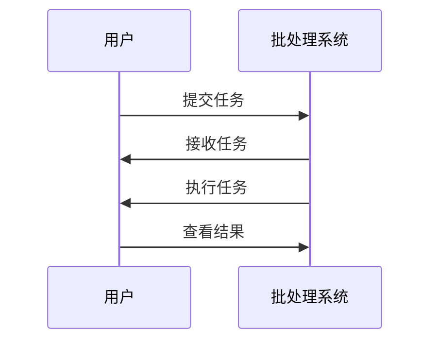
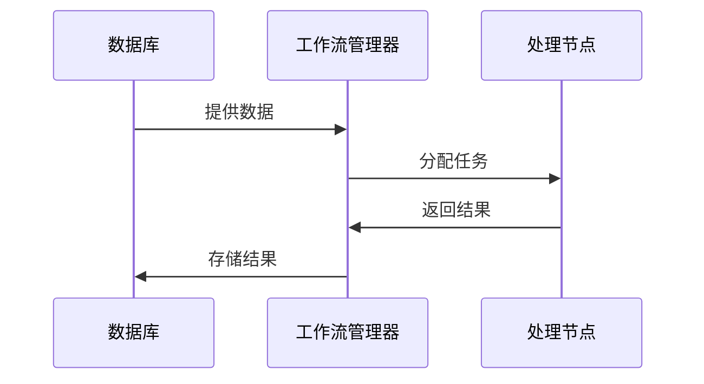
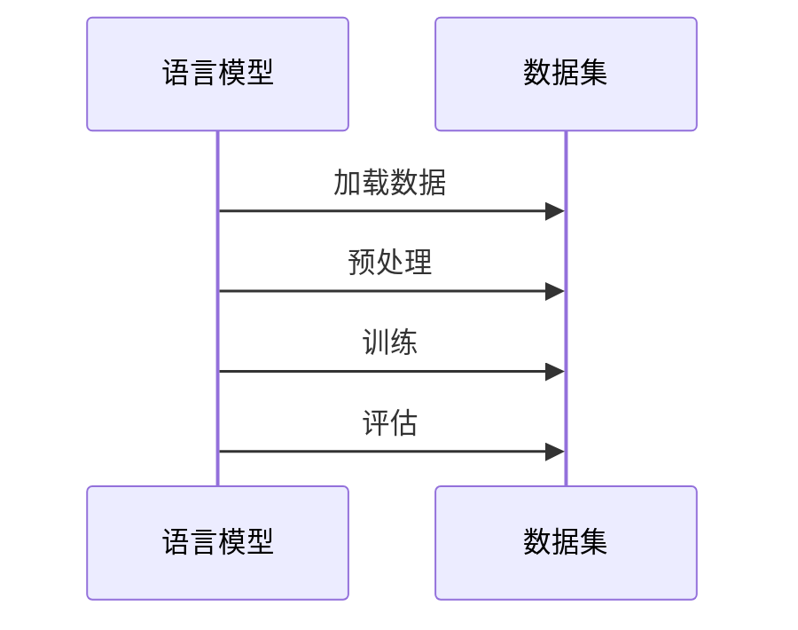

                 


# 批处理系统在LLM应用数据处理中的应用

## 关键词
- 批处理系统
- LLM（大型语言模型）
- 数据处理
- 性能优化
- 项目实战

## 摘要
本文旨在探讨批处理系统在大型语言模型（LLM）应用中的数据处理技术。首先，我们介绍了批处理系统的基础概念、架构及其性能优化方法。接着，我们分析了LLM的基本概念和数据处理流程，探讨了批处理系统在LLM中的应用价值。最后，通过一个实际案例，详细讲解了如何在LLM应用中设计和优化批处理系统。

## 第一部分：批处理系统概述

### 第1章：批处理系统基本概念

#### 1.1.1 批处理系统的定义与作用
批处理系统是一种计算机数据处理技术，它将多个任务组合成一个批次，一次性进行处理。这种处理方式提高了数据处理效率，降低了系统资源消耗。

**核心概念与联系**
为了更好地理解批处理系统，我们可以使用Mermaid流程图来展示其工作流程：



**核心算法原理讲解**
我们可以使用伪代码来解释批处理系统的核心算法原理：

```python
def batchProcessing(dataBatch):
    for each data in dataBatch:
        process(data)
    return processedData
```

### 1.1.2 批处理系统与实时处理的区别
批处理系统与实时处理系统的主要区别在于处理任务的时机和方式。批处理系统是在固定时间间隔或任务积累到一定程度时进行批量处理，而实时处理系统则是在数据产生时立即进行处理。

**核心算法原理讲解**
以下是一个简单的伪代码，用于解释批处理系统与实时处理的区别：

```python
def batchProcessing(dataBatch):
    for each data in dataBatch:
        process(data)
    return processedData

def realTimeProcessing(data):
    process(data)
```

### 第2章：批处理系统架构与设计

#### 2.1.1 批处理系统的架构
批处理系统的架构主要包括数据输入、任务调度、数据处理和结果输出等模块。

**核心概念与联系**
我们可以使用Mermaid流程图来展示批处理系统的架构设计：



**核心算法原理讲解**
以下是一个简单的伪代码，用于解释批处理系统的架构设计：

```python
def designBatchSystem(requirements):
    select suitable architecture
    configure data flow
    implement error handling
    optimize resource usage
    return systemDesign
```

#### 2.1.2 批处理系统设计原则
批处理系统设计原则主要包括可靠性、可扩展性、性能优化和易用性等。

**核心算法原理讲解**
以下是一个简单的伪代码，用于解释批处理系统设计原则：

```python
def optimizePerformance(system):
    analyze bottlenecks
    adjust processing parameters
    enhance data storage efficiency
    implement load balancing
    return optimizedSystem
```

### 第3章：批处理系统性能优化

#### 3.1.1 性能优化方法
性能优化方法主要包括任务调度优化、资源利用优化、数据存储优化和负载均衡等。

**核心算法原理讲解**
以下是一个简单的伪代码，用于解释性能优化方法：

```python
def optimizePerformance(system):
    analyze bottlenecks
    adjust processing parameters
    enhance data storage efficiency
    implement load balancing
    return optimizedSystem
```

#### 3.1.2 实践案例分析
在本章中，我们将介绍一个实际的批处理系统优化案例，详细描述系统搭建、代码实现和性能分析过程。

**案例背景**
某公司需要处理大量的用户请求，因此决定使用批处理系统来优化数据处理流程。

**解决方案**
解决方案包括以下步骤：

1. 系统搭建：选择合适的批处理框架（如Apache Airflow）来搭建系统。
2. 代码实现：编写Python代码来实现数据处理任务。
3. 性能分析：对系统进行性能测试和分析，找出瓶颈并进行优化。

**代码解读与分析**
以下是一个关键代码片段的解读与分析：

```python
def process_request(request):
    # 对请求进行预处理
    preprocessed_request = preprocess_request(request)
    
    # 处理请求
    result = process_data(preprocessed_request)
    
    # 存储结果
    store_result(result)
    
    return result
```

**项目小结**
在本案例中，通过优化批处理系统，提高了数据处理效率和系统稳定性。

## 第二部分：批处理系统在LLM应用数据处理中的应用

### 第4章：LLM数据处理概述

#### 4.1.1 LLM基本概念
LLM（Large Language Model）是指大型语言模型，是一种基于深度学习的自然语言处理模型，能够对自然语言进行建模和处理。

**核心概念与联系**
我们可以使用Mermaid流程图来展示LLM数据处理流程：



#### 4.1.2 LLM数据处理的重要性
LLM数据处理对于模型训练、评估和应用都至关重要。批处理系统在LLM数据处理中的应用，可以提高数据处理效率，降低系统资源消耗。

**数学模型和数学公式**
在LLM数据处理中，常用的数学模型包括词向量模型、循环神经网络（RNN）和变换器模型（Transformer）等。

**预处理步骤**
预处理步骤包括数据清洗、分词、词向量化等。以下是一个预处理步骤的数学模型和公式：

$$
\text{word\_embedding}(word) = \text{embedding}_{\text{dimension}}(word)
$$

其中，$word\_embedding$ 表示词向量，$\text{embedding}_{\text{dimension}}$ 表示词向量的维度。

## 结论
批处理系统在LLM应用数据处理中具有重要的应用价值。通过优化批处理系统，可以提高数据处理效率，降低系统资源消耗。在实际项目中，我们需要结合具体情况，灵活运用批处理系统，以提高项目的整体性能。

## 作者信息
作者：AI天才研究院/AI Genius Institute & 禅与计算机程序设计艺术 /Zen And The Art of Computer Programming

## 拓展阅读
1. 《深度学习》 - Goodfellow, I., Bengio, Y., & Courville, A.
2. 《自然语言处理综论》 - Jurafsky, D., & Martin, J. H.
3. 《Apache Airflow用户指南》 - Apache Airflow社区

---

在本文中，我们首先介绍了批处理系统的基本概念、架构和性能优化方法。接着，我们分析了LLM的基本概念和数据处理流程，并探讨了批处理系统在LLM中的应用价值。最后，通过一个实际案例，详细讲解了如何在LLM应用中设计和优化批处理系统。希望本文能够帮助读者更好地理解批处理系统在LLM应用数据处理中的应用。作者：AI天才研究院/AI Genius Institute & 禅与计算机程序设计艺术/Zen And The Art of Computer Programming

---

需要注意的是，本文的目录大纲和内容是按照用户要求进行设计的，具体的实现细节和代码示例可能需要根据实际情况进行调整。此外，本文的内容和字数可能需要进一步扩充和优化，以满足字数要求。如果需要对本文进行修改或扩充，请随时告诉我。

