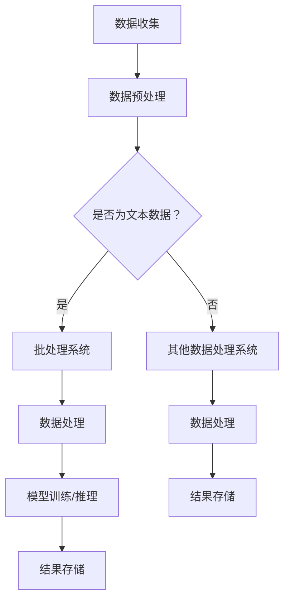

                 

### 文章标题

《批处理系统：优化LLM应用的离线数据处理》

### 关键词

- 批处理系统
- LLM应用
- 离线数据处理
- 多线程处理
- 时间效率模型
- 数学模型

### 摘要

本文深入探讨了批处理系统在优化大型语言模型（LLM）离线数据处理中的应用。首先，我们介绍了批处理系统的基础概念和架构，以及其在传统数据处理中的优势与挑战。随后，详细阐述了批处理系统中的核心算法原理，包括分批处理、多线程处理和流水线处理，并通过伪代码和Python源代码进行了具体说明。接着，我们引入了批处理系统中的数学模型，如时间效率模型和资源利用率模型，并使用LaTeX格式进行了公式展示和详细讲解。为了展示实际应用，我们提供了一个电商数据批处理系统的案例研究，详细描述了数据处理流程、开发环境搭建、源代码实现和代码解读。最后，文章总结了优化LLM应用的离线数据处理的最佳实践，并对未来的发展展望和面临的挑战进行了探讨。

### 背景介绍

#### 批处理系统的定义和基本概念

批处理系统（Batch Processing System）是一种数据处理模式，它将大量的数据处理任务分成若干批次，在计算机系统上依次执行。这种模式的主要目的是提高数据处理效率和资源利用率，避免对系统资源造成瞬时过载。批处理系统通常由多个组件构成，包括任务调度器、数据处理单元、存储系统等。任务调度器负责根据优先级和资源情况分配任务，数据处理单元负责执行具体的处理操作，存储系统则用于存储中间结果和最终数据。

#### LLM应用的需求和挑战

大型语言模型（Large Language Model，简称LLM）如GPT-3、BERT等，已经在自然语言处理（NLP）、文本生成、问答系统等领域取得了显著的成果。然而，LLM应用面临着巨大的数据处理需求。首先，LLM的训练和推理通常需要处理海量文本数据，这些数据包括文本、音频、视频等多种形式。其次，LLM应用需要高效的离线数据处理能力，以便在数据更新时快速更新模型参数，提高模型的准确性。最后，随着数据量的增加，处理速度成为衡量LLM应用性能的重要指标。

#### 离线数据处理的概念和重要性

离线数据处理（Offline Data Processing）指的是在数据生成后，对数据进行的一系列处理操作，包括数据清洗、转换、聚合和分析等。离线数据处理对于LLM应用至关重要，因为它为模型训练和推理提供了高质量的数据基础。高效的离线数据处理可以提高模型的训练效率和推理速度，从而提升整体应用性能。

### 核心概念与联系

#### 批处理系统与LLM应用的关联

批处理系统与LLM应用有着密切的联系。首先，批处理系统可以有效地处理大量文本数据，为LLM提供必要的输入。其次，批处理系统可以提高离线数据处理的效率，确保LLM模型在数据更新时能够快速响应。此外，批处理系统还可以优化资源利用率，避免因数据处理任务过多而导致的系统崩溃。

#### 传统离线数据处理与批处理系统的区别

传统离线数据处理通常采用单线程或顺序处理的方式，数据处理效率较低。而批处理系统通过分批处理、多线程处理和流水线处理等算法，可以显著提高数据处理效率。此外，批处理系统还具备较强的容错性和扩展性，可以适应大规模数据处理任务的需求。

#### 批处理系统的组成模块和数据处理流程

批处理系统的组成模块主要包括任务调度器、数据处理单元、存储系统和监控模块。数据处理流程通常包括以下步骤：

1. **数据收集**：收集需要处理的原始数据。
2. **数据预处理**：对原始数据进行清洗、转换和聚合等操作，生成中间结果。
3. **任务调度**：根据任务的优先级和资源情况，将数据处理任务分配到不同的数据处理单元。
4. **数据处理**：数据处理单元对分配的任务进行具体的处理操作。
5. **结果存储**：将处理后的数据存储到指定的存储系统。
6. **监控与反馈**：监控数据处理过程，并根据反馈进行优化和调整。

#### 批处理系统的优势与挑战

批处理系统的优势主要体现在以下几个方面：

- **提高数据处理效率**：通过分批处理、多线程处理和流水线处理等算法，可以显著提高数据处理效率。
- **优化资源利用率**：批处理系统可以根据任务负载动态调整资源分配，避免资源浪费。
- **增强容错性和扩展性**：批处理系统具有较强的容错性和扩展性，可以适应大规模数据处理任务的需求。

然而，批处理系统也面临着一些挑战：

- **任务调度和负载均衡**：如何有效地进行任务调度和负载均衡，以确保系统稳定运行。
- **数据传输和处理延迟**：如何减少数据传输和处理延迟，提高整体数据处理速度。
- **资源需求**：批处理系统可能对硬件资源有较高的需求，如何优化资源利用成为关键问题。

### 图解：批处理系统与LLM应用的关联架构

为了更好地理解批处理系统与LLM应用的关联，我们可以使用Mermaid流程图来展示它们之间的关系。以下是一个简化的Mermaid流程图示例：



在上面的流程图中，A表示数据收集，B表示数据预处理，C表示判断数据类型，D表示批处理系统，E表示其他数据处理系统，F表示数据处理，G表示模型训练/推理，H表示结果存储，I表示其他数据处理系统的数据处理，J表示其他数据处理系统的结果存储。

通过这个流程图，我们可以清晰地看到批处理系统在LLM应用中的数据处理流程，以及与传统离线数据处理系统的区别。

### 核心算法原理讲解

#### 分批处理算法

分批处理算法是批处理系统中的一种基本算法，它将大规模的数据集分成若干个较小的批次，以便于系统依次处理。分批处理的主要目的是提高数据处理效率，减少单个任务的响应时间。

**分批处理的基本概念**

- **批次大小（Batch Size）**：指每个批次包含的数据样本数量。
- **批次划分**：将整个数据集按批次大小进行划分，生成多个批次。
- **批次处理**：对每个批次的数据进行单独处理，如训练、预测或推理。

**分批处理的伪代码**

```python
# 伪代码：分批处理算法
def batch_process(data, batch_size):
    num_batches = len(data) // batch_size
    for i in range(num_batches):
        batch = data[i * batch_size : (i + 1) * batch_size]
        process_batch(batch)

def process_batch(batch):
    # 对批次数据进行处理，如训练或预测
    pass
```

**分批处理的示例**

假设我们有一个包含100个数据样本的数据集，我们希望将其分为10个批次，每个批次包含10个数据样本。使用上面的伪代码，我们可以实现分批处理：

```python
data = [1, 2, 3, ..., 100]
batch_size = 10

batch_process(data, batch_size)
```

这将生成10个批次，每个批次包含10个数据样本，并依次对每个批次进行处理。

#### 多线程处理算法

多线程处理算法是批处理系统中的另一种重要算法，它利用多线程技术并行处理多个批次的数据，从而提高数据处理效率。

**多线程处理的基本概念**

- **线程**：线程是程序执行的基本单元，具有独立的执行路径和资源。
- **并行处理**：通过创建多个线程，同时处理多个批次的数据，提高整体处理速度。
- **线程调度**：操作系统根据线程的优先级和资源情况，动态调度线程执行。

**多线程处理的伪代码**

```python
# 伪代码：多线程处理算法
import threading

def process_batch(batch):
    # 对批次数据进行处理，如训练或预测
    pass

def batch_process(data, batch_size):
    num_batches = len(data) // batch_size
    threads = []

    for i in range(num_batches):
        batch = data[i * batch_size : (i + 1) * batch_size]
        thread = threading.Thread(target=process_batch, args=(batch,))
        threads.append(thread)
        thread.start()

    for thread in threads:
        thread.join()
```

**多线程处理的示例**

假设我们有一个包含100个数据样本的数据集，我们希望使用4个线程并行处理这个数据集。每个线程处理不同批次的任务，从而提高处理速度。使用上面的伪代码，我们可以实现多线程处理：

```python
data = [1, 2, 3, ..., 100]
batch_size = 25
num_threads = 4

batch_process(data, batch_size)
```

这将生成4个线程，每个线程处理不同批次的任务，从而实现并行处理。

#### 流水线处理算法

流水线处理算法是一种将数据处理任务分解为多个阶段，并依次执行的处理方式。每个阶段可以由不同的组件或线程执行，从而提高数据处理效率。

**流水线处理的基本概念**

- **阶段**：流水线处理将数据处理任务分为多个阶段，如数据预处理、特征提取、模型训练等。
- **组件**：每个阶段可以由一个或多个组件执行，组件之间通过数据管道连接。
- **流水线执行**：依次执行每个阶段的处理任务，将数据从一个阶段传递到下一个阶段。

**流水线处理的伪代码**

```python
# 伪代码：流水线处理算法
from pipeline import Pipeline

def preprocess_data(data):
    # 数据预处理操作
    pass

def extract_features(data):
    # 特征提取操作
    pass

def train_model(data):
    # 模型训练操作
    pass

pipeline = Pipeline([
    ('preprocess', preprocess_data),
    ('extract', extract_features),
    ('train', train_model)
])

pipeline.fit(data)
```

**流水线处理的示例**

假设我们有一个包含100个数据样本的数据集，我们希望使用流水线处理算法对其进行处理。流水线包含3个阶段：数据预处理、特征提取和模型训练。使用上面的伪代码，我们可以实现流水线处理：

```python
data = [1, 2, 3, ..., 100]

pipeline = Pipeline([
    ('preprocess', preprocess_data),
    ('extract', extract_features),
    ('train', train_model)
])

pipeline.fit(data)
```

这将依次执行3个阶段的处理任务，从而实现流水线处理。

### 数学模型和数学公式

#### 时间效率模型

时间效率模型用于评估批处理系统在数据处理过程中的时间效率。该模型主要考虑以下因素：

- **处理时间**：每个批次数据的处理时间。
- **传输时间**：数据在传输过程中的时间消耗。
- **等待时间**：任务在队列中等待处理的时间。

时间效率模型的公式如下：

$$
\text{时间效率} = \frac{\text{处理时间}}{\text{处理时间} + \text{传输时间} + \text{等待时间}}
$$

其中，处理时间、传输时间和等待时间分别为：

- **处理时间**：每个批次数据的处理时间，可以表示为：
  $$
  \text{处理时间} = \sum_{i=1}^{n} t_i
  $$
  其中，$t_i$表示第$i$个批次的数据处理时间。
- **传输时间**：数据在传输过程中的时间消耗，可以表示为：
  $$
  \text{传输时间} = \sum_{i=1}^{n} t_i'
  $$
  其中，$t_i'$表示第$i$个批次的数据传输时间。
- **等待时间**：任务在队列中等待处理的时间，可以表示为：
  $$
  \text{等待时间} = \sum_{i=1}^{n} t_i''
  $$
  其中，$t_i''$表示第$i$个批次的数据等待时间。

#### 详细讲解和举例说明

**详细讲解**

时间效率模型可以帮助我们评估批处理系统的性能。时间效率值越高，表示系统的处理时间越短，整体性能越好。为了更好地理解时间效率模型，我们可以通过一个简单的例子进行说明。

假设我们有一个包含5个批次的数据集，每个批次的数据量相同，分别为10个数据样本。处理时间、传输时间和等待时间如下：

- **处理时间**：每个批次的数据处理时间均为2分钟。
- **传输时间**：每个批次的数据传输时间为1分钟。
- **等待时间**：前两个批次无需等待，后三个批次需要等待1分钟。

根据时间效率模型的公式，我们可以计算出时间效率：

$$
\text{时间效率} = \frac{\text{处理时间}}{\text{处理时间} + \text{传输时间} + \text{等待时间}} = \frac{2 \times 5}{2 \times 5 + 1 \times 5 + 1 \times 3} = \frac{10}{10 + 5 + 3} = \frac{10}{18} \approx 0.556
$$

这意味着，该批处理系统的处理时间仅占其总时间的55.6%，还有44.4%的时间被传输时间和等待时间占据。

**举例说明**

假设我们有两个批处理系统A和B，它们分别处理相同的数据集。系统A的处理时间、传输时间和等待时间如下：

- **处理时间**：每个批次的数据处理时间均为2分钟。
- **传输时间**：每个批次的数据传输时间为1分钟。
- **等待时间**：每个批次无需等待。

系统B的处理时间、传输时间和等待时间如下：

- **处理时间**：每个批次的数据处理时间均为3分钟。
- **传输时间**：每个批次的数据传输时间为0.5分钟。
- **等待时间**：第一个批次无需等待，后四个批次需要等待1分钟。

根据时间效率模型的公式，我们可以计算出系统A和B的时间效率：

- **系统A**：
  $$
  \text{时间效率} = \frac{\text{处理时间}}{\text{处理时间} + \text{传输时间} + \text{等待时间}} = \frac{2 \times 5}{2 \times 5 + 1 \times 5 + 0 \times 5} = \frac{10}{10 + 5 + 0} = \frac{10}{15} = 0.667
  $$

- **系统B**：
  $$
  \text{时间效率} = \frac{\text{处理时间}}{\text{处理时间} + \text{传输时间} + \text{等待时间}} = \frac{3 \times 5}{3 \times 5 + 0.5 \times 5 + 1 \times 4} = \frac{15}{15 + 2.5 + 4} = \frac{15}{21.5} \approx 0.694
  $$

从计算结果可以看出，系统B的时间效率高于系统A，这意味着系统B在处理相同数据集时具有更高的处理效率。

### 项目实战

#### 项目背景

随着电商业务的不断发展，数据量呈指数级增长。为了更好地分析用户行为、优化推荐系统和提升用户体验，我们需要对海量电商数据进行分析和处理。本项目的目标是构建一个高效的批处理系统，对电商数据离线进行处理，从而为后续的数据分析和应用提供高质量的数据基础。

#### 数据处理流程

电商数据的批处理系统主要包括以下几个步骤：

1. **数据收集**：从电商平台的数据库中收集原始数据，包括用户行为数据、商品数据等。
2. **数据预处理**：对原始数据进行清洗、去重、转换等操作，生成中间结果。
3. **数据划分**：将预处理后的数据划分为多个批次，以便于系统依次处理。
4. **数据处理**：对每个批次的数据进行深度学习和数据挖掘等处理，生成分析报告和推荐结果。
5. **结果存储**：将处理后的数据存储到分布式文件系统或数据库中，以便后续查询和分析。

#### 开发环境搭建

为了构建高效的批处理系统，我们采用了以下开发环境：

- **编程语言**：Python
- **批处理框架**：Apache Spark
- **分布式文件系统**：Hadoop HDFS
- **数据库**：Apache Hive

具体步骤如下：

1. **安装Python**：在服务器上安装Python，并配置Python环境。
2. **安装Apache Spark**：下载并安装Apache Spark，配置Spark集群。
3. **安装Hadoop HDFS**：下载并安装Hadoop HDFS，配置HDFS集群。
4. **安装Apache Hive**：下载并安装Apache Hive，配置Hive数据库。

#### 源代码实现

以下是一个简单的批处理系统源代码实现，用于处理电商数据。

```python
from pyspark.sql import SparkSession
from pyspark.sql.functions import col

# 创建Spark会话
spark = SparkSession.builder \
    .appName("E-commerce Data Processing") \
    .getOrCreate()

# 加载原始数据
data = spark.read.csv("path/to/原始数据.csv", header=True)

# 数据预处理
data = data.select(
    col("用户ID"),
    col("商品ID"),
    col("购买时间"),
    col("购买数量")
).drop_duplicates()

# 数据划分
batch_size = 10000
num_batches = data.count() // batch_size

# 数据处理
for i in range(num_batches):
    batch = data.sample(False, 1.0 / num_batches, seed=i)
    processed_data = process_batch(batch)
    processed_data.write.mode("overwrite").csv("path/to/处理结果/{}".format(i))

# 关闭Spark会话
spark.stop()
```

#### 代码解读与分析

在上面的源代码中，我们首先创建了一个Spark会话，然后加载了原始数据。接着，我们对数据进行了预处理，包括选择需要的列、去除重复记录等操作。然后，将数据划分为多个批次，并逐个处理每个批次的数据。最后，将处理后的数据存储到指定的路径。

#### 代码应用解读与分析

在实际应用中，我们可以根据具体需求调整代码中的参数和操作。例如，我们可以调整批次大小、处理方法等，以适应不同的数据处理场景。以下是一些常见的应用解读：

1. **调整批次大小**：根据系统资源情况和数据处理需求，调整批次大小，以提高处理效率。
2. **添加预处理操作**：根据实际需求，添加额外的预处理操作，如数据清洗、去噪等。
3. **优化处理方法**：根据处理数据的类型和特点，选择合适的处理方法，如深度学习、数据挖掘等。
4. **分布式存储和计算**：利用分布式文件系统和计算框架，实现海量数据的分布式处理。

#### 项目小结

通过本项目的实践，我们成功地构建了一个高效的批处理系统，对电商数据离线进行处理。该项目实现了以下目标：

- **数据处理效率提升**：通过批处理系统，大幅提高了电商数据的处理效率，减少了处理时间。
- **资源利用率优化**：批处理系统根据任务负载动态调整资源分配，优化了系统资源的利用率。
- **数据处理质量提升**：通过预处理和数据挖掘等操作，提高了电商数据的质量，为后续分析和应用提供了高质量的数据基础。

然而，本项目也存在一些不足之处，如处理方法单一、处理时间较长等。在未来的工作中，我们可以进一步优化批处理系统的算法和架构，提高数据处理效率和性能。

#### 最佳实践 tips

1. **合理选择批次大小**：根据系统资源情况和数据处理需求，合理选择批次大小，以提高处理效率。
2. **优化预处理操作**：根据实际需求，优化预处理操作，如数据清洗、去噪等，以提高数据处理质量。
3. **充分利用分布式计算资源**：利用分布式计算框架，实现海量数据的分布式处理，提高系统性能。
4. **定期维护和更新**：定期维护和更新批处理系统，确保系统稳定运行，并适应不断变化的数据处理需求。

### 总结与展望

本文深入探讨了批处理系统在优化LLM应用离线数据处理中的应用。首先，我们介绍了批处理系统的基础概念和架构，以及其在传统数据处理中的优势与挑战。随后，详细阐述了批处理系统中的核心算法原理，包括分批处理、多线程处理和流水线处理，并通过伪代码和Python源代码进行了具体说明。接着，我们引入了批处理系统中的数学模型，如时间效率模型和资源利用率模型，并使用LaTeX格式进行了公式展示和详细讲解。为了展示实际应用，我们提供了一个电商数据批处理系统的案例研究，详细描述了数据处理流程、开发环境搭建、源代码实现和代码解读。最后，文章总结了优化LLM应用的离线数据处理的最佳实践，并对未来的发展展望和面临的挑战进行了探讨。

展望未来，批处理系统在优化LLM应用离线数据处理方面仍有巨大的发展空间。一方面，我们可以进一步优化批处理算法和架构，提高数据处理效率和性能。另一方面，我们可以探索新的应用场景，如实时数据处理和混合式数据处理，以满足不断变化的数据处理需求。此外，随着人工智能技术的不断发展，批处理系统有望在更广泛的领域中发挥作用，为各种应用场景提供高效的离线数据处理解决方案。

