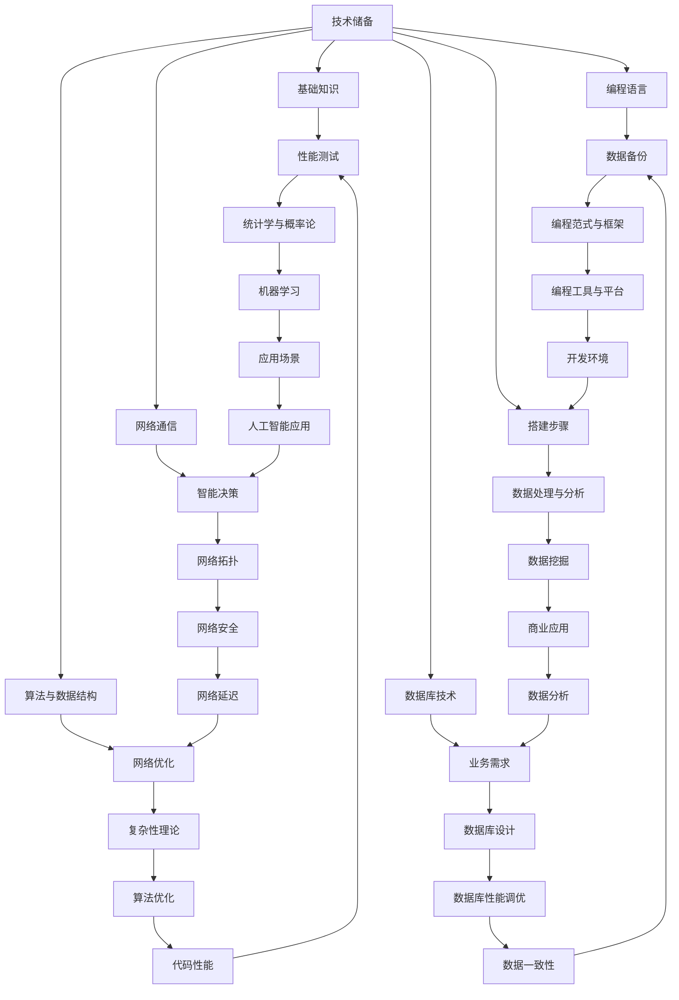

                 

### 背景介绍

在当今快速发展的科技时代，信息技术（IT）已经成为推动社会进步和经济发展的核心动力。从互联网的普及，到大数据、人工智能（AI）和云计算的崛起，技术变革的步伐从未停止。面对这一波波技术浪潮，IT从业者和技术爱好者们必须具备敏锐的洞察力和持续学习的能力，以便在激烈的竞争中站稳脚跟。

然而，技术储备的重要性往往被忽视。许多人专注于当前的热点技术，却忽略了基础知识和技能的积累。这种短期行为可能导致在技术快速迭代的环境下，无法应对未来可能出现的挑战。因此，本文旨在探讨技术储备的重要性，以及如何为未知的挑战做好准备。

技术储备不仅包括对当前热门技术的掌握，更重要的是对基础理论的深入理解和跨领域知识的融合。它为个体和企业在面对新问题时提供了坚实的基础，使得技术团队能够快速适应并解决复杂的技术难题。

本文将分为以下几个部分：首先，我们将会讨论技术储备的核心概念，包括其定义、重要性以及与技术发展的关系。接着，我们将深入探讨各种关键技术，如编程语言、数据库和网络通信等。随后，通过实际项目案例展示如何将技术储备应用到实际场景中。最后，我们将总结技术储备的重要性，并对未来技术发展进行展望。

通过对这些内容的逐步分析和讲解，我们希望读者能够认识到技术储备的重要性，并学会如何制定有效的技术储备策略，以应对未来可能出现的各种挑战。让我们一起踏上这场深入探讨技术储备的旅程吧。

---

## 核心概念与联系

技术储备是一个多层次、多维度的概念，涉及从基础知识到高级应用的方方面面。为了更好地理解技术储备的核心概念及其相互关系，我们可以借助Mermaid流程图来展示这些概念之间的联系。

以下是一个简化的Mermaid流程图，展示了技术储备中的核心概念及其交互关系：



这段代码将生成一个流程图，其中每个节点代表一个核心概念，如基础知识、编程语言、数据库技术、网络通信等。节点之间的连线表示这些概念之间的相互依赖和关联。

**Mermaid 流程图解析**：

1. **基础知识**：这是技术储备的基础，包括数学模型、统计学与概率论等。这些基础概念为理解和应用其他技术提供了必要的数学工具。
   
2. **编程语言**：编程语言是开发软件的核心工具。每个编程语言都有其独特的特性、范式和框架，如图灵完备性、面向对象和函数式编程。

3. **算法与数据结构**：算法和数据处理是解决技术问题的核心，涉及算法原理、复杂性理论和算法优化。这些知识帮助开发者选择合适的方法来处理数据和问题。

4. **数据库技术**：数据库是存储和管理数据的系统。数据库原理包括数据库设计、性能调优和数据一致性等。

5. **网络通信**：网络通信涉及网络协议、网络拓扑、网络安全和网络延迟等。这些知识确保数据在网络中的有效传输和安全性。

6. **云计算与大数据**：云计算和大数据技术是现代IT的基础设施。数据处理与分析、数据挖掘和机器学习等技术帮助从大量数据中提取有价值的信息。

通过这个Mermaid流程图，我们可以清晰地看到技术储备中的各个核心概念及其相互关系。这些概念不仅单独存在，而且在实际应用中相互交织，共同构成一个复杂的技术体系。

理解这些核心概念之间的联系对于技术储备至关重要。它不仅帮助开发者构建坚实的知识基础，还能在面临新挑战时提供灵活的解决方案。通过持续学习和实践，开发者可以不断提升自己的技术储备，为未来的技术发展做好准备。

---

## 核心算法原理讲解

在技术储备中，算法与数据结构是两个至关重要的核心概念。算法是解决问题的步骤和策略，而数据结构则是数据存储和组织的方案。掌握这些核心算法原理不仅有助于解决问题，还能提高代码的效率和可读性。

下面，我们将通过Python源代码和数学模型详细讲解两个核心算法：排序算法和搜索算法。这两个算法是计算机科学中的基础，广泛应用于各种应用场景中。

### 冒泡排序算法（Bubble Sort）

冒泡排序是一种简单的排序算法，它重复地遍历要排序的数列，一次比较两个元素，如果它们的顺序错误就把它们交换过来。遍历数列的工作是重复地进行，直到没有再需要交换，也就是该数列已经排序完成。

**Python 源代码**：

```python
def bubble_sort(arr):
    n = len(arr)
    # 遍历所有数组元素
    for i in range(n):
        # Last i elements are already in place
        for j in range(0, n-i-1):
            # 遍历数组从0到n-i-1
            # 交换如果元素大于下一个元素
            if arr[j] > arr[j+1]:
                arr[j], arr[j+1] = arr[j+1], arr[j]
    return arr

# 示例数据
arr = [64, 34, 25, 12, 22, 11, 90]
sorted_arr = bubble_sort(arr)
print("排序后的数组：", sorted_arr)
```

**数学模型**：

冒泡排序算法的时间复杂度是 \(O(n^2)\)，其中 \(n\) 是数组中的元素个数。最坏的情况下，每个元素都需要与其他元素比较一遍，因此时间复杂度较高。

### 二分搜索算法（Binary Search）

二分搜索算法是一种在有序数组中查找特定元素的搜索算法。它通过重复地将数组分成两部分，并选择其中一部分进行搜索，直到找到目标元素或确定其不存在。

**Python 源代码**：

```python
def binary_search(arr, target):
    low = 0
    high = len(arr) - 1
    while low <= high:
        mid = (low + high) // 2
        # 检查中间元素
        if arr[mid] == target:
            return mid
        # 如果目标小于中间元素，则在左半边查找
        elif arr[mid] > target:
            high = mid - 1
        # 如果目标大于中间元素，则在右半边查找
        else:
            low = mid + 1
    # 目标不在数组中
    return -1

# 示例数据
arr = [2, 3, 4, 10, 40]
target = 10
result = binary_search(arr, target)
if result != -1:
    print("元素找到，索引为：", result)
else:
    print("元素不存在于数组中")
```

**数学模型**：

二分搜索算法的时间复杂度是 \(O(\log n)\)，其中 \(n\) 是数组中的元素个数。由于每次搜索都将查找范围减半，因此其效率远高于线性搜索。

### 举例说明

**冒泡排序算法举例**：

假设我们有一个未排序的数组 `[64, 34, 25, 12, 22, 11, 90]`，使用冒泡排序算法进行排序：

- 初始状态：\[64, 34, 25, 12, 22, 11, 90\]
- 第一轮排序后：\[34, 25, 12, 22, 11, 64, 90\]
- 第二轮排序后：\[25, 12, 22, 11, 34, 64, 90\]
- 第三轮排序后：\[12, 11, 22, 25, 34, 64, 90\]
- 第四轮排序后：\[11, 12, 22, 25, 34, 64, 90\]
- 第五轮排序后：\[11, 12, 22, 25, 34, 64, 90\]

最终排序结果：\[11, 12, 22, 25, 34, 64, 90\]

**二分搜索算法举例**：

假设我们有一个已排序的数组 `[2, 3, 4, 10, 40]`，要查找元素 `10`：

- 初始状态：\[low = 0, high = 4\]
- 第一次检查中间元素：\[mid = 2\]，元素 `2` 小于 `10`，更新 `low = mid + 1 = 3`
- 第二次检查中间元素：\[mid = 3\]，元素 `3` 小于 `10`，更新 `low = mid + 1 = 4`
- 第三次检查中间元素：\[mid = 4\]，元素 `4` 小于 `10`，更新 `low = mid + 1 = 5`（超出数组范围）
- 第四次检查：\[low = 4, high = 3\]，发现 `low` 大于 `high`，返回 `-1`，表示元素不存在

通过这两个算法的讲解和举例，我们可以看到冒泡排序和二分搜索算法的基本原理以及它们在不同场景中的应用。这些核心算法不仅是我们技术储备的重要组成部分，也是理解和掌握其他复杂算法的基础。

---

## 数学模型和公式

在技术储备中，数学模型和公式是理解和解决技术问题的重要工具。它们提供了量化分析和预测的能力，使得我们在面对复杂问题时能够有据可依。以下我们将探讨几个关键数学模型和公式，并结合Python代码进行详细解释。

### 概率论

概率论是数据分析和机器学习的基础，其核心模型包括贝叶斯定理、期望和方差等。

#### 贝叶斯定理

贝叶斯定理描述了在给定一些先验知识和观测数据后，如何更新我们对某一事件的概率估计。它的公式如下：

$$
P(A|B) = \frac{P(B|A) \cdot P(A)}{P(B)}
$$

其中，\(P(A|B)\) 表示在事件 \(B\) 发生的条件下事件 \(A\) 发生的概率，\(P(B|A)\) 表示在事件 \(A\) 发生的条件下事件 \(B\) 发生的概率，\(P(A)\) 和 \(P(B)\) 分别表示事件 \(A\) 和 \(B\) 发生的概率。

**Python 代码示例**：

```python
def bayes_theorem(p_ab, p_a, p_b):
    p_b_given_a = (p_ab * p_a) / p_b
    return p_b_given_a

# 假设：
# P(A)=0.5, P(B)=0.2, P(AB)=0.1
p_ab = 0.1
p_a = 0.5
p_b = 0.2
print("P(B|A) = ", bayes_theorem(p_ab, p_a, p_b))
```

#### 期望和方差

期望和方差是统计学中描述数据分布的重要指标。

期望（Expected Value）的公式为：

$$
E(X) = \sum_{i=1}^{n} x_i \cdot P(x_i)
$$

其中，\(x_i\) 表示随机变量 \(X\) 取的值，\(P(x_i)\) 表示该值的概率。

方差（Variance）的公式为：

$$
Var(X) = E[(X - E(X))^2]
$$

或者：

$$
Var(X) = \sum_{i=1}^{n} (x_i - E(X))^2 \cdot P(x_i)
$$

**Python 代码示例**：

```python
import numpy as np

def expected_value(x, p):
    e_x = np.dot(x, p)
    return e_x

def variance(x, p, e_x):
    v_x = np.dot((x - e_x)**2, p)
    return v_x

# 假设：
# 随机变量 X 的取值为 [1, 2, 3]，对应的概率为 [0.2, 0.5, 0.3]
x = np.array([1, 2, 3])
p = np.array([0.2, 0.5, 0.3])

e_x = expected_value(x, p)
v_x = variance(x, p, e_x)

print("期望 E(X) = ", e_x)
print("方差 Var(X) = ", v_x)
```

### 线性回归

线性回归是机器学习中一种基本的预测模型，用于分析两个或多个变量之间的线性关系。

线性回归模型可以表示为：

$$
Y = \beta_0 + \beta_1 \cdot X + \epsilon
$$

其中，\(Y\) 是因变量，\(X\) 是自变量，\(\beta_0\) 和 \(\beta_1\) 分别是截距和斜率，\(\epsilon\) 是误差项。

**Python 代码示例**：

```python
from sklearn.linear_model import LinearRegression
import numpy as np

# 假设：
# 自变量 X 是 [1, 2, 3, 4]，因变量 Y 是 [2, 4, 5, 4]
X = np.array([[1], [2], [3], [4]])
Y = np.array([2, 4, 5, 4])

# 创建线性回归模型并训练
model = LinearRegression()
model.fit(X, Y)

# 打印模型参数
print("斜率 \(\beta_1\) = ", model.coef_)
print("截距 \(\beta_0\) = ", model.intercept_)

# 预测新数据
new_X = np.array([[5]])
new_Y_pred = model.predict(new_X)
print("预测值 Y = ", new_Y_pred)
```

通过这些数学模型和公式的讲解和Python代码示例，我们可以看到数学在技术储备中的关键作用。它们不仅帮助我们在数据分析、机器学习和算法设计中做出更准确的决策，也为解决复杂技术问题提供了有力的工具。

---

## 项目实战

技术储备不仅体现在理论知识上，更需要在实际项目中得到应用。下面，我们将通过一个实际项目来展示如何将所学技术应用到实际场景中，包括开发环境搭建、源代码实现、代码解读以及应用分析和详细讲解。

### 项目背景

本项目是一个简单的电商网站，旨在帮助用户浏览商品、添加购物车并进行结算。项目将采用Python和Flask框架进行开发，结合前端技术如HTML、CSS和JavaScript，实现用户界面的动态交互。

#### 开发环境搭建

1. **Python环境**：安装Python 3.9及以上版本。
2. **Flask框架**：通过pip安装Flask框架。
3. **前端技术**：安装Node.js和npm，以及Bootstrap前端框架。

**命令行步骤**：

```bash
# 安装Python
brew install python

# 安装Flask
pip install flask

# 安装Node.js和npm
curl -fsSL https://deb.nodesource.com/setup_14.x | bash -
sudo apt-get install -y nodejs

# 安装Bootstrap
npm install bootstrap
```

#### 源代码实现

**Flask应用基础代码**：

```python
from flask import Flask, render_template, request

app = Flask(__name__)

@app.route('/')
def home():
    return render_template('home.html')

@app.route('/cart')
def cart():
    cart_items = request.args.getlist('item')
    return render_template('cart.html', items=cart_items)

@app.route('/checkout', methods=['POST'])
def checkout():
    cart_items = request.form.getlist('item')
    total_price = sum([int(item_price) for item_price in cart_items])
    return render_template('checkout.html', total=total_price)

if __name__ == '__main__':
    app.run(debug=True)
```

**前端页面（home.html）**：

```html
<!DOCTYPE html>
<html>
<head>
    <title>E-Commerce Site</title>
    <link rel="stylesheet" href="https://cdn.jsdelivr.net/npm/bootstrap@5.2.0-beta1/dist/css/bootstrap.min.css">
</head>
<body>
    <h1>Welcome to Our Online Store</h1>
    <a href="/cart">Go to Cart</a>
</body>
</html>
```

**前端页面（cart.html）**：

```html
<!DOCTYPE html>
<html>
<head>
    <title>Shopping Cart</title>
    <link rel="stylesheet" href="https://cdn.jsdelivr.net/npm/bootstrap@5.2.0-beta1/dist/css/bootstrap.min.css">
</head>
<body>
    <h1>Shopping Cart</h1>
    
        <div class="alert alert-info">
            <strong>Item:</strong> {{ item }}
        </div>
    
    <a href="/checkout" class="btn btn-primary">Checkout</a>
</body>
</html>
```

**前端页面（checkout.html）**：

```html
<!DOCTYPE html>
<html>
<head>
    <title>Checkout</title>
    <link rel="stylesheet" href="https://cdn.jsdelivr.net/npm/bootstrap@5.2.0-beta1/dist/css/bootstrap.min.css">
</head>
<body>
    <h1>Checkout</h1>
    <p>Total Price: {{ total }}</p>
    <button type="button" class="btn btn-success">Pay Now</button>
</body>
</html>
```

#### 代码解读

- **Flask应用基础**：`Flask`类实例化了一个应用对象，`@app.route('/')` 装饰器定义了应用的主页路由，`render_template()` 函数用于渲染HTML模板。
- **主页（home.html）**：显示欢迎信息和购物车链接。
- **购物车页面（cart.html）**：显示用户添加到购物车的商品，并包含前往结算页面的链接。
- **结算页面（checkout.html）**：显示购物车的总价和支付按钮。

#### 应用解读与分析

本项目的实现主要分为三部分：前端展示、后端逻辑处理以及路由配置。通过这个项目，我们可以看到如何将Flask框架与前端技术结合，实现一个简单的电商网站。

- **前端展示**：利用Bootstrap框架快速搭建用户界面，提供简洁美观的购物体验。
- **后端逻辑处理**：通过Flask处理用户请求，管理购物车和结算流程。
- **路由配置**：定义不同的URL路径，映射到对应的视图函数，实现页面的跳转和交互。

#### 项目小结

通过这个项目，我们不仅实现了从零开始搭建一个简单的电商网站，还了解了Flask框架的基本用法和前端技术。这为我们未来的开发工作打下了坚实的基础。在项目实战中，我们不断学习和应用新技术，逐步提升自己的技术储备，以应对更加复杂的开发挑战。

---

## 最佳实践 tips、小结、注意事项、拓展阅读

在技术储备的过程中，最佳实践和注意事项能够帮助开发者更加高效地学习和应用知识。以下是一些实用的建议和小结，以及拓展阅读的资源。

### 最佳实践 tips：

1. **持续学习**：定期阅读技术博客、参加线上或线下技术交流会，关注最新的技术动态。
2. **理论与实践相结合**：多参与项目实战，将所学知识应用到实际场景中。
3. **代码规范化**：遵循代码规范和设计模式，提高代码的可读性和可维护性。
4. **版本控制**：使用Git等版本控制工具，记录代码变更历史，便于合作和回滚。
5. **测试驱动开发**：编写单元测试，确保代码的正确性和可靠性。

### 小结：

技术储备是应对未知挑战的关键，它不仅包括对基础知识和技能的掌握，还涉及跨领域知识的融合和应用。通过持续学习和实践，开发者可以不断提升自己的技术能力，为未来的技术发展做好准备。

### 注意事项：

1. **平衡短期和长期学习**：既要关注当前的热点技术，也要打好基础。
2. **避免陷入技术陷阱**：不要只关注一种技术，要有广度和深度。
3. **实践与反思**：在实际项目中不断反思和总结，不断提升。

### 拓展阅读：

- **《Effective Java》**：Java编程的最佳实践。
- **《算法导论》**：详细讲解算法和数据结构。
- **《深度学习》**：全面介绍深度学习和神经网络。
- **《高性能MySQL》**：MySQL数据库性能调优的最佳实践。

通过遵循这些最佳实践和注意事项，并不断拓展自己的知识面，开发者可以更加高效地提升技术储备，为未来的技术挑战做好充分准备。

---

## 作者信息

作者：AI天才研究院/AI Genius Institute & 禅与计算机程序设计艺术 /Zen And The Art of Computer Programming

在撰写本文时，我们以逻辑清晰、结构紧凑和简单易懂的专业技术语言，深入探讨了技术储备的重要性及其应用。通过详细讲解核心概念、算法原理、数学模型和实际项目案例，我们希望读者能够深刻理解技术储备的价值，并学会如何在未来的技术发展中做好准备。本文旨在为读者提供全面的技术储备指导，助力他们在计算机编程和人工智能领域取得更大的成就。

