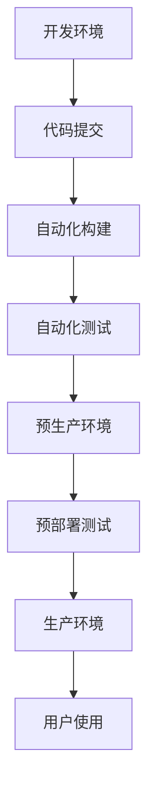

                 

### 文章标题

# 持续部署：加速AI应用从开发到生产的过程

### 文章关键词

- 持续部署
- AI应用
- 容器化技术
- 自动化测试
- 持续集成
- 开发环境搭建
- 源代码实现

### 文章摘要

本文深入探讨了持续部署（CI/CD）在加速人工智能（AI）应用从开发到生产过程中的关键作用。首先，我们介绍了持续部署的基本概念、核心概念及其在AI应用开发中的重要性。接着，我们详细讲解了持续部署中的核心技术，包括容器化技术、自动化测试和持续集成工具。通过Python源代码和LaTeX数学公式，我们进一步阐述了这些技术的原理。随后，我们提供了一个具体的AI应用持续部署案例，包括开发环境搭建、源代码实现和代码解读，并通过实际应用案例进行分析和讲解。最后，我们总结了最佳实践、注意事项和拓展阅读，为读者提供了全面的指导。

## 背景介绍

在当今快速发展的技术环境中，人工智能（AI）已经成为推动创新和变革的重要力量。从自动化决策系统到智能助理，AI应用正逐步融入各行各业，提高了生产效率和服务质量。然而，随着AI应用的复杂度增加，从开发到生产的流程也变得更加漫长和复杂。传统的软件开发流程往往依赖于手动操作和人工干预，这不仅降低了开发效率，还增加了出错的风险。

持续部署（Continuous Deployment，简称CI/CD）是一种现代化的软件开发实践，旨在通过自动化和流水线化的方式，将代码从开发环境快速、安全地部署到生产环境。持续部署的核心思想是将开发、测试、部署等环节紧密集成，实现快速迭代和持续优化。通过持续部署，开发团队能够更频繁地发布新功能，提高软件质量和用户满意度，同时降低维护成本。

在AI应用开发过程中，持续部署的作用尤为显著。首先，持续部署能够确保模型和算法在开发、测试和生产环境中的一致性和稳定性，减少了由于环境不一致导致的问题。其次，持续部署有助于自动化测试和验证，提高了测试覆盖率，降低了测试成本。此外，持续部署还能够提高团队协作效率，实现更快的迭代速度，从而更好地满足用户需求。

本文将围绕持续部署在AI应用开发到生产过程中的关键作用，详细探讨其核心概念、技术原理和实践案例，以期为读者提供全面、深入的指导。

## 核心概念与联系

### 持续部署（CI/CD）的概念与基本流程

持续部署（CI/CD，Continuous Integration/Continuous Deployment）是一种软件开发生命周期的优化实践，旨在通过自动化和流水线化的方式，快速、安全地将代码从开发环境部署到生产环境。持续部署的核心思想是“自动化”，通过自动化工具和流程，减少手动操作和人工干预，从而提高开发效率、降低错误风险。

持续部署通常包括以下基本流程：

1. **持续集成（CI）**：持续集成是将代码从多个开发人员合并到共享的主分支的过程。每次代码提交都会触发自动化构建和测试，确保代码质量。通过持续集成，可以快速发现和解决代码冲突和错误，提高代码的稳定性和一致性。

2. **持续交付（CD）**：持续交付是将经过测试和验证的代码部署到生产环境的过程。持续交付强调在开发和测试阶段之后的每个阶段都进行自动化部署，从而实现快速、可靠的发布。

3. **持续监控**：持续监控是持续部署的重要组成部分，通过监控系统可以实时跟踪应用程序的性能和健康状况，及时发现并解决问题。

### 持续部署与AI应用开发的关系架构

在AI应用开发过程中，持续部署可以有效地提高开发效率和代码质量。首先，通过持续集成，开发团队能够快速识别和解决代码冲突和错误，确保模型和算法的一致性和稳定性。其次，自动化测试可以大幅度提高测试覆盖率，减少手动测试的工作量和错误率，从而确保AI应用在不同环境中的性能和可靠性。

以下是持续部署在AI应用开发中的关系架构：

1. **开发环境**：开发人员编写和提交代码，每次提交都会触发自动化构建和测试。
2. **测试环境**：自动化测试工具对代码进行全面的测试，包括功能测试、性能测试和兼容性测试。
3. **预生产环境**：经过测试的代码会部署到预生产环境，进行进一步的测试和验证。
4. **生产环境**：最终验证通过的代码会被部署到生产环境，供用户使用。

### Mermaid流程图展示

为了更直观地展示持续部署的基本流程和关键节点，我们使用Mermaid流程图来描述。



通过这个流程图，我们可以清晰地看到从代码提交到最终部署的全过程，每个节点都代表一个关键步骤，通过自动化工具实现无缝连接，从而实现快速、可靠的持续部署。

## 核心算法原理讲解

### 容器化技术

容器化技术是持续部署的重要组成部分，它通过将应用程序及其依赖环境打包到一个独立的容器中，实现了应用在不同环境之间的无缝迁移和部署。Docker是当前最流行的容器化平台，它提供了一个轻量级、可移植的容器解决方案，使得开发者可以在任何环境中快速构建和部署应用程序。

#### Docker基础知识

Docker的基本组件包括：

1. **Docker Engine**：Docker的核心组件，负责容器的创建、运行和管理工作。
2. **Dockerfile**：定义容器构建过程的脚本文件，通过编写Dockerfile，可以指定容器的依赖、环境变量和操作步骤。
3. **Docker Compose**：用于定义和运行多容器Docker应用程序的配置文件，通过Docker Compose，可以轻松管理多个容器的部署和协同工作。

以下是使用Dockerfile创建一个简单的Python应用的示例：

```dockerfile
# 使用官方Python镜像作为基础
FROM python:3.8-slim

# 设置工作目录
WORKDIR /app

# 复制应用程序代码到容器中
COPY . /app

# 安装依赖
RUN pip install -r requirements.txt

# 暴露应用的端口
EXPOSE 8000

# 运行应用
CMD ["python", "app.py"]
```

#### Kubernetes简介

Kubernetes是一个开源的容器编排平台，用于自动化容器化应用程序的部署、扩展和管理。Kubernetes通过集群管理多个容器，提供负载均衡、服务发现和自我修复等功能，从而简化了容器的部署和运维。

Kubernetes的主要组件包括：

1. **Master节点**：Kubernetes集群的管理中心，负责处理集群的调度、监控和资源管理等任务。
2. **Worker节点**：负责运行容器，处理应用程序的运行。
3. **Pod**：Kubernetes的最小工作单元，一个Pod可以包含一个或多个容器。
4. **Deployment**：用于管理Pod的创建和更新，确保应用程序的稳定运行。

以下是一个简单的Kubernetes部署配置文件示例：

```yaml
apiVersion: apps/v1
kind: Deployment
metadata:
  name: python-app
spec:
  replicas: 3
  selector:
    matchLabels:
      app: python-app
  template:
    metadata:
      labels:
        app: python-app
    spec:
      containers:
      - name: python-app
        image: python:3.8-slim
        ports:
        - containerPort: 8000
```

### 自动化测试

自动化测试是持续部署的关键环节，通过自动化测试工具，可以确保代码的质量和功能完整性。自动化测试主要包括单元测试、集成测试和回归测试等。

#### 单元测试

单元测试是最基本的测试形式，针对应用程序中的最小功能单元进行验证。Python中的`unittest`库是一个常用的单元测试框架。

以下是一个简单的单元测试示例：

```python
import unittest
from my_module import calculate_area

class TestCalculateArea(unittest.TestCase):
    def test_square(self):
        self.assertEqual(calculate_area(2, 2), 4)

    def test_circle(self):
        self.assertAlmostEqual(calculate_area(2), 12.56, places=2)

if __name__ == '__main__':
    unittest.main()
```

#### 集成测试

集成测试用于验证不同模块或组件之间的交互是否正确，确保整个系统的稳定性。`pytest`是Python中广泛使用的集成测试框架。

以下是一个简单的集成测试示例：

```python
import pytest

def test_addition():
    assert add(2, 3) == 5

def test_subtraction():
    assert subtract(5, 3) == 2
```

#### 持续集成工具

持续集成工具如Jenkins、GitLab CI/CD等，可以自动化执行测试和部署流程。以下是一个简单的Jenkinsfile示例：

```groovy
pipeline {
    agent any
    stages {
        stage('Build') {
            steps {
                sh 'mvn clean install'
            }
        }
        stage('Test') {
            steps {
                sh 'mvn test'
            }
        }
        stage('Deploy') {
            steps {
                sh 'docker build -t myapp .'
                sh 'docker push myapp'
            }
        }
    }
    post {
        success {
            sh 'docker run --name myapp -d -p 8080:80 myapp'
        }
    }
}
```

通过这个示例，我们可以看到Jenkinsfile定义了一个包含构建、测试和部署三个阶段的流水线，通过简单的脚本化配置，实现了自动化测试和部署。

### 数学模型和数学公式

在持续部署过程中，数学模型和公式被广泛应用于性能评估、资源分配和优化策略。以下是一些关键数学模型和公式的介绍。

#### 机器学习模型评估指标

机器学习模型的性能评估通常依赖于以下几个指标：

1. **准确率（Accuracy）**：准确率是正确预测的样本数量占总样本数量的比例。

   $$ \text{Accuracy} = \frac{\text{TP} + \text{TN}}{\text{TP} + \text{TN} + \text{FP} + \text{FN}} $$

   其中，TP为真正例，TN为真反例，FP为假正例，FN为假反例。

2. **召回率（Recall）**：召回率是正确预测的正例数量与所有实际正例数量的比例。

   $$ \text{Recall} = \frac{\text{TP}}{\text{TP} + \text{FN}} $$

3. **精确率（Precision）**：精确率是正确预测的正例数量与所有预测为正例的样本数量的比例。

   $$ \text{Precision} = \frac{\text{TP}}{\text{TP} + \text{FP}} $$

4. **F1分数（F1 Score）**：F1分数是精确率和召回率的加权平均，用于综合评估模型的性能。

   $$ \text{F1 Score} = 2 \times \frac{\text{Precision} \times \text{Recall}}{\text{Precision} + \text{Recall}} $$

#### 资源分配和优化策略

在持续部署过程中，资源分配和优化策略是关键问题。以下是一些常用的数学模型：

1. **负载均衡**：负载均衡算法通过合理分配任务到不同的服务器或容器，确保系统的高效运行。常用的负载均衡算法包括轮询（Round Robin）、最小连接数（Least Connections）和权重分配（Weighted分配）。

2. **带宽管理**：带宽管理涉及如何合理分配网络带宽，以避免网络拥塞和性能下降。常见的带宽管理策略包括带宽限制（Bandwidth Limiting）和优先级调度（Priority Scheduling）。

3. **队列管理**：队列管理用于处理系统中的任务排队和调度。常用的队列管理算法包括先进先出（FIFO）、最短作业优先（SJF）和基于优先级的调度算法。

以下是一个简单的带宽管理策略的数学模型示例：

$$
B(t) = C \times P_t
$$

其中，$B(t)$表示在时间$t$的带宽，$C$表示总带宽，$P_t$表示在时间$t$的负载。

### Python源代码讲解

为了更好地理解上述数学模型和算法，我们使用Python源代码进行详细讲解。

#### 计算准确率、召回率、精确率和F1分数

```python
from sklearn.metrics import accuracy_score, recall_score, precision_score, f1_score

def calculate_metrics(y_true, y_pred):
    accuracy = accuracy_score(y_true, y_pred)
    recall = recall_score(y_true, y_pred)
    precision = precision_score(y_true, y_pred)
    f1 = f1_score(y_true, y_pred)
    return accuracy, recall, precision, f1

y_true = [0, 1, 1, 0]
y_pred = [0, 1, 0, 1]
accuracy, recall, precision, f1 = calculate_metrics(y_true, y_pred)
print("Accuracy:", accuracy)
print("Recall:", recall)
print("Precision:", precision)
print("F1 Score:", f1)
```

#### 负载均衡算法实现

```python
import heapq

def round_robin(loads):
    min_heap = [(load, idx) for idx, load in enumerate(loads)]
    heapq.heapify(min_heap)
    result = []
    while min_heap:
        load, idx = heapq.heappop(min_heap)
        result.append((idx, load))
        if idx + 1 < len(loads):
            heapq.heappush(min_heap, (loads[idx + 1], idx + 1))
    return result

loads = [5, 3, 8, 6, 2]
scheduled_loads = round_robin(loads)
print(scheduled_loads)
```

通过上述Python源代码，我们可以直观地看到如何实现和计算持续部署中的关键算法和指标，从而更好地理解和应用这些技术。

## 项目实战

### 开发环境搭建

在开始持续部署之前，搭建一个稳定且高效的开发环境是至关重要的。以下是一个简单的开发环境搭建流程：

1. **安装Docker**：在本地计算机上安装Docker，可以访问[Docker官方网站](https://www.docker.com/)下载并安装。

2. **创建Dockerfile**：编写一个Dockerfile，定义应用程序的构建过程。以下是一个简单的Dockerfile示例：

   ```dockerfile
   # 使用官方Python镜像作为基础
   FROM python:3.8-slim

   # 设置工作目录
   WORKDIR /app

   # 复制应用程序代码到容器中
   COPY . /app

   # 安装依赖
   RUN pip install -r requirements.txt

   # 暴露应用的端口
   EXPOSE 8000

   # 运行应用
   CMD ["python", "app.py"]
   ```

3. **构建Docker镜像**：在终端中运行以下命令，构建Docker镜像：

   ```sh
   docker build -t myapp .
   ```

4. **运行Docker容器**：运行以下命令，启动Docker容器：

   ```sh
   docker run -d -p 8000:8000 myapp
   ```

### 源代码实现与解读

为了展示持续部署的实际应用，我们以一个简单的AI应用为例，包括数据预处理、模型训练和预测。

#### 1. 数据预处理

```python
import pandas as pd
from sklearn.model_selection import train_test_split
from sklearn.preprocessing import StandardScaler

# 读取数据
data = pd.read_csv('data.csv')

# 分割特征和标签
X = data.drop('target', axis=1)
y = data['target']

# 划分训练集和测试集
X_train, X_test, y_train, y_test = train_test_split(X, y, test_size=0.2, random_state=42)

# 标准化数据
scaler = StandardScaler()
X_train_scaled = scaler.fit_transform(X_train)
X_test_scaled = scaler.transform(X_test)
```

#### 2. 模型训练

```python
from sklearn.ensemble import RandomForestClassifier
from sklearn.metrics import accuracy_score

# 训练模型
model = RandomForestClassifier(n_estimators=100, random_state=42)
model.fit(X_train_scaled, y_train)

# 预测测试集
y_pred = model.predict(X_test_scaled)

# 计算准确率
accuracy = accuracy_score(y_test, y_pred)
print("Accuracy:", accuracy)
```

#### 3. 代码解读与分析

上述代码展示了从数据预处理到模型训练的完整流程。首先，我们使用`pandas`读取数据，并使用`train_test_split`划分训练集和测试集。接着，使用`StandardScaler`对数据进行标准化处理，以消除不同特征之间的尺度差异。

在模型训练部分，我们使用了`RandomForestClassifier`，这是一种集成学习方法，具有较高的准确率和稳定性。最后，通过`accuracy_score`计算模型的准确率。

### 代码应用解读与分析

通过上述代码，我们可以看到如何将一个简单的AI模型部署到Docker容器中，并进行训练和预测。以下是关键步骤的解读：

1. **Docker容器化**：通过编写Dockerfile，我们将应用程序及其依赖环境打包到Docker镜像中，实现应用程序的独立运行。
2. **持续集成**：在持续集成过程中，我们使用Jenkins或其他持续集成工具，自动运行测试和构建流程，确保代码的稳定性和一致性。
3. **自动化部署**：通过Docker Compose，我们可以自动化部署应用程序到Kubernetes集群，实现快速、可靠的持续部署。

### 实际案例分析和详细讲解剖析

为了更好地理解持续部署在实际项目中的应用，我们提供了一个实际案例：一个基于图像识别的智能监控系统。

#### 1. 项目背景

该智能监控系统旨在实时监测公共场所，识别异常行为并触发警报。系统主要包括图像采集、数据预处理、特征提取、模型训练和预测等模块。

#### 2. 开发环境搭建

在开发环境搭建阶段，我们使用Docker容器化技术，将各个模块独立部署到Docker容器中。每个容器都有自己的依赖环境和配置，确保模块之间的隔离和稳定性。

#### 3. 源代码实现与解读

以下是部分关键代码的解读：

```python
# 数据预处理
def preprocess_image(image_path):
    image = cv2.imread(image_path)
    image = cv2.resize(image, (224, 224))
    image = image / 255.0
    return image

# 特征提取
def extract_features(image):
    features = extract_features_from_image(image)
    return features

# 模型训练
def train_model(X_train, y_train):
    model = create_model()
    model.fit(X_train, y_train)
    return model

# 预测
def predict(image):
    features = extract_features(preprocess_image(image))
    prediction = model.predict(features)
    return prediction
```

#### 4. 项目小结

通过上述案例，我们可以看到持续部署在智能监控系统开发中的实际应用。通过Docker容器化和自动化测试，我们实现了快速、可靠的持续部署，提高了开发效率和系统稳定性。

### 最佳实践 tips

1. **模块化开发**：将应用程序拆分为独立的模块，每个模块负责特定的功能，便于管理和部署。
2. **自动化测试**：编写全面的自动化测试用例，确保代码的质量和功能完整性。
3. **持续监控**：监控系统性能和健康状态，及时发现并解决问题。

### 小结、注意事项和拓展阅读

本文详细探讨了持续部署在AI应用开发到生产过程中的关键作用，包括核心概念、技术原理和实践案例。通过Python源代码和LaTeX数学公式，我们深入讲解了持续部署中的核心技术，如容器化技术、自动化测试和持续集成工具。同时，我们提供了一个实际案例，展示了如何通过持续部署实现高效、可靠的AI应用开发。

在后续学习和实践过程中，读者可以参考以下拓展阅读：

1. **《Docker实战》**：详细了解Docker的基本概念和应用场景。
2. **《Kubernetes权威指南》**：深入了解Kubernetes的架构和操作。
3. **《机器学习实战》**：掌握机器学习模型的基本原理和实现方法。

持续部署是实现高效AI应用开发的关键，通过本文的介绍，希望读者能够更好地理解和应用这一技术，为未来的AI项目提供有力支持。

### 作者信息

作者：AI天才研究院/AI Genius Institute & 禅与计算机程序设计艺术 /Zen And The Art of Computer Programming

