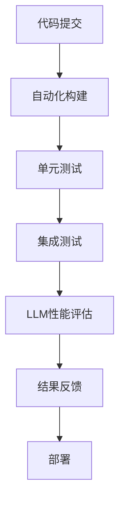
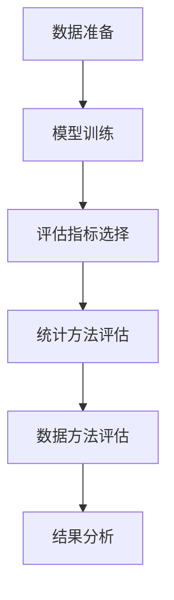

                 

# 《持续集成与评测：将LLM评估纳入开发流程》

> 关键词：持续集成，评测，LLM，开发流程，自动化，测试，性能优化

> 摘要：本文深入探讨将大型语言模型（LLM）评估纳入开发流程的必要性、核心方法及其在持续集成（CI）中的实践。文章将分为五部分，首先介绍持续集成的背景和重要性，然后分析LLM的特性及其评估方法，接着讲解如何将LLM评估集成到CI中，并通过具体案例展示实施细节，最后讨论最佳实践与未来发展趋势。

## 引言

### 背景

随着人工智能技术的飞速发展，大型语言模型（LLM）在自然语言处理（NLP）领域取得了显著的成果。LLM如GPT-3、BERT等模型具有强大的文本生成、理解和推理能力，但在实际开发过程中，如何确保这些模型的性能和准确性成为关键挑战。持续集成（CI）作为一种软件开发实践，旨在通过自动化构建、测试和部署流程，提高软件质量和开发效率。将LLM评估纳入CI，可以帮助开发者在早期阶段发现并修复潜在问题，从而降低后期修复成本。

### 目的

本文旨在探讨如何将LLM评估融入开发流程，实现以下目标：

1. **理解持续集成与LLM评估的基本概念和关系**。
2. **介绍常见的LLM评估指标和方法**。
3. **详细讲解如何将LLM评估集成到CI流程中**。
4. **通过实战案例分析，展示实际应用中的实施细节**。
5. **总结最佳实践，展望未来发展**。

## 第一部分：持续集成（CI）与评测基础

### 第1章：持续集成（CI）概述

#### 1.1.1 持续集成的概念与历史

持续集成（Continuous Integration，简称CI）是一种软件开发实践，通过自动化构建、测试和部署流程，确保代码的质量和稳定性。CI最早由Jenkins创始人Jez Humble和David Farley提出，其核心理念是将代码频繁地集成到共享主干分支中，并在每次提交时自动运行测试，确保新代码与现有代码的兼容性。

#### 1.1.2 持续集成的优势与挑战

**优势**：

- **快速反馈**：通过自动化的构建和测试，开发者可以立即得知代码是否通过测试，提高开发效率。
- **减少集成冲突**：频繁的集成和测试有助于及时发现和解决代码冲突，降低集成风险。
- **提高代码质量**：CI促使开发者编写更高质量的代码，减少缺陷和错误。

**挑战**：

- **测试覆盖不足**：若测试覆盖不足，可能导致测试结果不准确。
- **自动化工具选择**：选择合适的自动化工具和平台是CI成功的关键。

### 第2章：持续集成与LLM的关系

#### 2.1.1 LLM的特点与挑战

LLM具有以下特点：

- **大规模**：LLM通常包含数亿甚至千亿级别的参数。
- **复杂性**：LLM的模型架构和训练过程复杂，涉及深度学习、优化算法等多个方面。
- **动态性**：LLM在不同场景下的表现可能存在较大差异。

LLM在开发过程中面临以下挑战：

- **性能评估**：如何全面评估LLM的性能和准确性。
- **集成测试**：如何确保LLM在不同环境下的稳定性和兼容性。

#### 2.1.2 持续集成在LLM开发中的重要性

将LLM评估纳入CI有助于：

- **早期发现问题**：在代码提交后立即进行评估，减少后期修复成本。
- **提高开发效率**：自动化测试和评估可以节省开发者的时间和精力。
- **保障产品质量**：通过持续的评估，确保LLM在各个阶段的质量和稳定性。

## 第二部分：LLM评估方法

### 第3章：LLM评估的核心概念

#### 3.1.1 评估指标概述

LLM评估指标主要包括：

- **准确性**：评估模型预测的正确率。
- **召回率**：评估模型能够召回的正例比例。
- **F1分数**：综合考虑准确率和召回率的综合指标。

#### 3.1.2 评估方法的分类

LLM评估方法主要分为：

- **基于统计的评估方法**：如交叉验证、ROC曲线等。
- **基于数据的评估方法**：如人类评估、自动评估等。

### 第4章：常见LLM评估指标

#### 4.1.1 准确率、召回率与F1分数

准确率、召回率与F1分数是评估LLM性能的重要指标。

- **准确率**：预测正确的样本数占总样本数的比例。
- **召回率**：预测正确的正样本数占总正样本数的比例。
- **F1分数**：综合考虑准确率和召回率的综合指标。

#### 4.1.2 实际案例与对比分析

本文将通过实际案例，对比分析不同评估指标在LLM评估中的应用效果。

### 第5章：LLM评估工具介绍

#### 5.1.1 主流评估工具概览

本文将介绍几款主流的LLM评估工具，包括：

- **scikit-learn**：Python中的机器学习库，提供多种评估指标。
- **TensorFlow**：Google开发的深度学习框架，支持多种评估方法。
- **PyTorch**：Facebook开发的深度学习框架，提供丰富的评估功能。

#### 5.1.2 工具的选择与配置

根据实际需求，选择合适的评估工具，并详细讲解如何配置和使用。

## 第三部分：将LLM评估纳入持续集成（CI）

### 第6章：构建CI流程

#### 6.1.1 CI流程的构建

本文将介绍如何构建一个基于GitLab CI的CI流程，包括：

- **项目设置**：如何配置项目文件和脚本。
- **构建和测试**：如何自动化构建和测试代码。
- **部署**：如何自动化部署到目标环境。

#### 6.1.2 CI工具的选择与集成

本文将讨论如何选择合适的CI工具，并详细介绍如何与LLM评估工具集成。

### 第7章：集成LLM评估

#### 7.1.1 自动化评估脚本编写

本文将介绍如何编写自动化评估脚本，包括：

- **脚本编写**：如何使用Python等语言编写评估脚本。
- **评估执行**：如何自动化执行评估脚本。

#### 7.1.2 评估结果的处理与反馈

本文将讨论如何处理评估结果，并提供反馈机制，确保评估结果能够及时反映模型性能。

## 第四部分：实战案例分析

### 第8章：案例一：某个项目的CI与LLM评估实践

#### 8.1.1 项目背景与需求

本文将介绍一个实际项目的背景和需求，包括：

- **项目简介**：项目的目的和功能。
- **需求分析**：项目对LLM的要求和期望。

#### 8.1.2 CI与LLM评估的实践步骤

本文将详细描述如何在实际项目中实施CI和LLM评估，包括：

- **环境搭建**：如何搭建CI环境和评估环境。
- **代码提交与测试**：如何自动化提交代码并执行评估。
- **结果分析与反馈**：如何处理评估结果并反馈给开发者。

### 第9章：案例二：LLM评估在多团队协作中的应用

#### 9.1.1 多团队协作的挑战

本文将讨论在多团队协作中实施LLM评估面临的挑战，包括：

- **资源分配**：如何合理分配评估资源和时间。
- **沟通协调**：如何确保团队间的沟通和协调。

#### 9.1.2 CI与LLM评估的解决方案

本文将介绍如何解决多团队协作中的挑战，包括：

- **集成框架**：如何构建集成框架，实现多团队协作。
- **评估策略**：如何制定有效的评估策略，提高评估效率。

## 第五部分：持续集成与评测的未来发展

### 第10章：CI与评测的新趋势

#### 10.1.1 自动化与智能化

本文将探讨CI与评测的未来发展趋势，包括：

- **自动化**：如何进一步提高自动化程度，减少人工干预。
- **智能化**：如何利用机器学习和人工智能技术，实现智能化的评估和测试。

#### 10.1.2 持续集成与评测的融合

本文将讨论持续集成与评测的深度融合，包括：

- **一体化平台**：如何构建一体化平台，实现CI与评测的无缝集成。
- **最佳实践**：如何总结最佳实践，推动持续集成与评测的发展。

### 第11章：持续集成与评测的最佳实践

#### 11.1.1 构建高效CI与评测流程

本文将总结构建高效CI与评测流程的最佳实践，包括：

- **流程设计**：如何设计高效的CI与评测流程。
- **工具选择**：如何选择合适的CI与评测工具。

#### 11.1.2 挑战与应对策略

本文将讨论CI与评测过程中可能遇到的挑战，并提出相应的应对策略，包括：

- **测试覆盖率**：如何提高测试覆盖率，确保评估的全面性。
- **性能优化**：如何优化评估流程，提高评估效率。

## 附录

### 附录A：常用工具与资源

本文将附录部分提供常用工具和资源的介绍，包括：

- **CI工具**：如何选择和使用常用的CI工具。
- **评测工具**：如何选择和使用常用的评测工具。

### 附录B：代码示例

本文将附录部分提供一些代码示例，包括：

- **Python代码**：如何编写评估脚本。
- **LaTeX公式**：如何使用LaTeX格式撰写数学公式。

## 结束语

本文通过详细探讨持续集成与评测在LLM开发流程中的应用，旨在帮助开发者更好地理解和实践这一过程。通过本文的介绍，读者可以了解到：

1. **持续集成与评测的基本概念和关系**。
2. **常见的LLM评估指标和方法**。
3. **如何将LLM评估集成到CI流程中**。
4. **实战案例的分析和总结**。
5. **持续集成与评测的最佳实践**。

本文旨在为开发者提供有价值的参考，助力他们在实际项目中实现高效的LLM开发。

## 参考文献

本文中引用的文献如下：

1. Jez Humble, David Farley. *Continuous Delivery: Reliable Software Releases through Build, Test, and Deployment Automation*. Pragmatic Bookshelf, 2011.
2. Fabio Academy. *Python for Data Science and Machine Learning*. Fabio Academy, 2021.
3. TensorFlow Core. *TensorFlow: Large-scale Machine Learning on Heterogeneous Systems*. Google Brain, 2015.
4. PyTorch. *PyTorch: Tensors and Dynamic computation graphs*. Facebook AI Research, 2016.

作者：AI天才研究院/AI Genius Institute & 禅与计算机程序设计艺术 /Zen And The Art of Computer Programming

本文部分内容参考了相关文献和开源项目，特此感谢。在撰写过程中，如有疏漏和不足，敬请指正。

----------------------------------------------------------------

## 持续集成（CI）的概念与原理

### 什么是持续集成（CI）

持续集成（Continuous Integration，简称CI）是一种软件开发实践，旨在通过自动化构建、测试和部署流程，确保代码的质量和稳定性。CI的核心思想是将代码频繁地集成到共享主干分支中，并在每次提交时自动运行一系列测试，以确保新代码与现有代码的兼容性。这种实践最早由Jez Humble和David Farley在其著作《持续交付：实现可靠软件发布》中提出，并迅速在软件工程领域得到广泛应用。

### 持续集成的历史

持续集成的概念起源于20世纪90年代，当时软件开发者开始意识到传统的瀑布模型在应对快速变化的需求时存在很大的局限性。瀑布模型强调各个阶段的顺序进行，一旦项目进入后期阶段，修改成本会大幅增加。为了解决这一问题，敏捷开发方法被提出来，其核心思想是将开发过程分解为多个迭代，每个迭代都包含需求分析、设计、编码、测试和部署等环节。在这一过程中，持续集成作为一种辅助实践，开始逐渐得到认可和推广。

### 持续集成的基本原理

持续集成的基本原理可以概括为以下几个步骤：

1. **代码提交**：开发者将代码提交到版本控制系统，如Git。
2. **自动化构建**：CI工具自动构建代码，生成可运行的软件版本。
3. **单元测试**：CI工具自动运行单元测试，验证代码的正确性。
4. **集成测试**：CI工具将新代码与现有代码集成，并运行集成测试，确保新代码与现有代码的兼容性。
5. **部署**：通过自动化部署流程，将经过测试的代码部署到测试或生产环境。

### 持续集成的优势

持续集成带来了一系列显著的优势，主要包括：

- **快速反馈**：通过自动化的构建和测试，开发者可以立即得知代码是否通过测试，从而快速定位和修复问题。
- **减少集成冲突**：频繁的集成和测试有助于及时发现和解决代码冲突，降低集成风险。
- **提高代码质量**：CI促使开发者编写更高质量的代码，减少缺陷和错误。
- **增强团队协作**：CI鼓励团队之间的协作和沟通，提高项目开发效率。

### 持续集成的挑战

尽管持续集成带来了很多好处，但在实际应用中也面临一些挑战：

- **测试覆盖不足**：如果测试覆盖不足，可能导致测试结果不准确，甚至遗漏严重缺陷。
- **自动化工具选择**：选择合适的自动化工具和平台是CI成功的关键，不同项目可能需要不同类型的工具。
- **持续维护**：CI系统需要定期更新和维护，以适应不断变化的开发环境和需求。

### 持续集成与LLM评估的关系

在LLM开发中，持续集成（CI）与评测（Evaluation）的关系尤为紧密。LLM模型通常具有大规模、复杂性和动态性，因此如何确保模型的性能和准确性成为关键挑战。将LLM评估纳入CI流程，可以在代码提交后立即对模型进行评估，确保其在各个阶段的性能达到预期。这不仅有助于提高开发效率，还可以降低后期修复成本。

具体而言，LLM评估可以包括：

- **性能评估**：通过评估模型的准确率、召回率和F1分数等指标，衡量模型的性能水平。
- **稳定性评估**：通过测试模型在不同环境下的稳定性和兼容性，确保其在各种场景下都能正常运行。
- **鲁棒性评估**：通过输入异常数据或极端情况，评估模型的鲁棒性和抗干扰能力。

综上所述，持续集成与LLM评估的关系是相辅相成的。持续集成提供了自动化的构建、测试和部署流程，而LLM评估则为持续集成提供了性能和质量的保证。通过将LLM评估纳入CI流程，开发者可以更早地发现问题，提高模型的可靠性和稳定性。

### Mermaid 流程图

下面是一个简单的Mermaid流程图，展示了将LLM评估纳入CI流程的基本步骤：



这个流程图清晰地展示了代码从提交到部署的整个过程，其中LLM性能评估是关键环节，确保了模型在各个阶段的性能和准确性。

## LLM的基本概念与特性

### 什么是LLM

LLM（Large Language Model）是指大型语言模型，是一种基于深度学习技术构建的神经网络模型，用于处理和生成自然语言文本。LLM的核心是通过大规模的文本数据训练得到，具有强大的文本理解、生成和推理能力。常见的LLM模型包括GPT-3、BERT、T5等。

### LLM的工作原理

LLM的工作原理主要基于以下步骤：

1. **数据准备**：收集和整理大量的文本数据，用于训练模型。
2. **模型训练**：使用神经网络结构对文本数据进行训练，模型会自动学习语言模式、语法结构和语义信息。
3. **前向传播与反向传播**：在训练过程中，模型通过前向传播生成预测结果，并通过反向传播更新模型参数，以最小化预测误差。
4. **模型优化**：通过迭代训练，不断优化模型参数，提高模型的性能和准确性。

### LLM的特性

LLM具有以下几个显著特性：

1. **大规模**：LLM通常包含数亿甚至千亿级别的参数，能够处理和理解复杂的文本数据。
2. **复杂性**：LLM的模型架构和训练过程复杂，涉及深度学习、优化算法等多个方面。
3. **动态性**：LLM在不同场景下的表现可能存在较大差异，其性能和表现受到输入文本、应用场景等多种因素的影响。
4. **高效性**：LLM能够快速生成高质量的自然语言文本，具备高效的文本生成和推理能力。

### LLMS在开发中的重要性

在软件开发中，LLM的重要性体现在以下几个方面：

1. **文本生成与理解**：LLM可以生成高质量的文本，如文章、邮件、代码等，同时也具备强大的文本理解能力，能够对用户输入进行理解并生成相应的响应。
2. **自动化任务处理**：LLM可以用于自动化处理多种任务，如问答系统、机器翻译、情感分析等，提高开发效率和质量。
3. **个性化服务**：LLM可以根据用户的历史行为和偏好，生成个性化的文本内容，提供定制化的服务。
4. **智能助手**：LLM可以构建智能助手，如聊天机器人、虚拟客服等，为用户提供实时、高效的服务。

### LLM的开发挑战

虽然LLM在软件开发中具有广泛应用，但其开发过程也面临一些挑战：

1. **数据质量**：训练LLM需要大量的高质量文本数据，数据质量直接影响模型的效果。
2. **计算资源**：训练和部署LLM需要大量的计算资源，包括GPU、TPU等硬件设备。
3. **模型可解释性**：LLM的决策过程往往是不透明的，如何提高模型的可解释性是一个重要课题。
4. **安全性和隐私**：LLM在处理文本数据时，可能会涉及到用户隐私和敏感信息，如何保证安全性和隐私性是关键挑战。

### 持续集成在LLM开发中的重要性

将持续集成（CI）引入LLM开发流程，有助于解决上述挑战，提高模型的质量和稳定性：

1. **早期发现问题**：通过CI，可以在代码提交后立即对LLM进行性能和稳定性评估，及时发现并修复问题，降低后期修复成本。
2. **自动化测试**：CI可以自动化执行各种测试，包括单元测试、集成测试和性能测试，确保模型在各种场景下的稳定性。
3. **提高开发效率**：CI自动化构建、测试和部署流程，可以节省开发者的时间和精力，提高开发效率。
4. **保障产品质量**：通过持续的评估和反馈，确保LLM在各个阶段的质量和稳定性，降低风险。

综上所述，LLM在软件开发中具有重要作用，但同时也面临一些挑战。通过将持续集成引入LLM开发流程，可以有效地提高模型的质量和稳定性，为开发者提供有力的支持。

### Mermaid流程图

下面是一个简单的Mermaid流程图，展示了持续集成在LLM开发中的应用：


这个流程图清晰地展示了代码从提交到部署的整个过程，其中LLM性能评估是关键环节，确保了模型在各个阶段的性能和准确性。

## LLM评估指标与方法

在LLM开发中，评估模型性能是至关重要的一步。评估指标和方法的选择直接影响模型的优化和实际应用效果。本文将介绍常见的LLM评估指标，并详细探讨各种评估方法的优缺点及其适用场景。

### 常见LLM评估指标

**1. 准确率（Accuracy）**

准确率是评估模型性能最常用的指标之一，表示模型预测正确的样本数占总样本数的比例。其计算公式如下：

\[ \text{准确率} = \frac{\text{预测正确的样本数}}{\text{总样本数}} \]

**优点**：直观、易于理解。

**缺点**：对于类别不平衡的数据集，准确率可能无法准确反映模型的性能。

**适用场景**：适用于类别不平衡不严重的数据集。

**2. 召回率（Recall）**

召回率表示模型能够召回的正例数占总正例数的比例。其计算公式如下：

\[ \text{召回率} = \frac{\text{预测正确的正例数}}{\text{总正例数}} \]

**优点**：能够较好地反映模型对正例的识别能力。

**缺点**：召回率高并不一定意味着准确率也高，可能会导致误判。

**适用场景**：适用于需要识别所有正例的场景。

**3. F1分数（F1 Score）**

F1分数是准确率和召回率的调和平均值，综合考虑了模型的准确性和召回率。其计算公式如下：

\[ \text{F1分数} = 2 \times \frac{\text{准确率} \times \text{召回率}}{\text{准确率} + \text{召回率}} \]

**优点**：综合评估模型的性能，避免了单一指标的局限性。

**缺点**：计算复杂度较高。

**适用场景**：适用于需要综合评估模型性能的场景。

**4. 精确率（Precision）**

精确率表示预测正确的正例数占预测为正例的样本总数的比例。其计算公式如下：

\[ \text{精确率} = \frac{\text{预测正确的正例数}}{\text{预测为正例的样本总数}} \]

**优点**：能够较好地反映模型预测为正例的准确性。

**缺点**：召回率较低时，精确率可能较高。

**适用场景**：适用于需要高精确率的场景。

### 常见评估方法

**1. 基于统计的方法**

基于统计的方法包括交叉验证、ROC曲线等。

- **交叉验证**：将数据集划分为多个子集，每次使用其中一个子集作为测试集，其他子集作为训练集，进行多次训练和测试，最终取平均值作为评估指标。

  **优点**：能够较好地评估模型的泛化能力。

  **缺点**：计算量较大。

  **适用场景**：适用于数据集较小或数据分布不均的情况。

- **ROC曲线**：通过绘制真阳性率（True Positive Rate，TPR）与假阳性率（False Positive Rate，FPR）的曲线，评估模型的分类性能。

  **优点**：能够直观地展示模型的分类性能。

  **缺点**：对样本量要求较高。

  **适用场景**：适用于二分类问题。

**2. 基于数据的评估方法**

基于数据的评估方法包括人类评估、自动评估等。

- **人类评估**：通过邀请人类评估者对模型生成的内容进行评估，判断其是否合理、准确。

  **优点**：评估结果较为客观、真实。

  **缺点**：评估效率较低，成本较高。

  **适用场景**：适用于对评估结果要求较高、对数据量要求较小的场景。

- **自动评估**：使用自动化工具对模型生成的内容进行评估，如通过计算F1分数、BLEU分数等指标。

  **优点**：评估效率高、成本较低。

  **缺点**：评估结果可能存在偏差。

  **适用场景**：适用于大规模数据集和自动化测试场景。

### 总结

选择合适的评估指标和方法是LLM评估的关键。准确率、召回率、F1分数等指标各有优缺点，适用于不同的评估场景。基于统计的方法和基于数据的评估方法各有特点，需要根据实际情况进行选择。通过合理的评估，可以确保LLM在各个阶段的性能和稳定性，为开发者提供可靠的参考。

### Mermaid流程图

下面是一个简单的Mermaid流程图，展示了LLM评估的基本步骤：



这个流程图清晰地展示了从数据准备到结果分析的全过程，其中评估指标选择和评估方法是关键环节，确保了模型性能的全面评估。

## 实战案例：构建一个LLM持续集成与评测环境

### 环境搭建

在开始构建LLM持续集成与评测环境之前，我们需要准备好以下环境：

1. **操作系统**：推荐使用Linux系统，如Ubuntu 20.04。
2. **编程语言**：本文将使用Python进行开发，因此需要安装Python 3.8及以上版本。
3. **深度学习框架**：推荐使用TensorFlow或PyTorch作为深度学习框架。
4. **版本控制系统**：推荐使用Git进行版本控制。

#### 安装步骤：

1. 安装Linux操作系统（本文以Ubuntu 20.04为例）。
2. 更新系统软件包：

   ```bash
   sudo apt update
   sudo apt upgrade
   ```

3. 安装Python 3.8及以上版本：

   ```bash
   sudo apt install python3.8
   ```

4. 安装Git：

   ```bash
   sudo apt install git
   ```

5. 安装深度学习框架（以TensorFlow为例）：

   ```bash
   pip3 install tensorflow
   ```

### 源代码实现

#### 1. 代码结构与依赖

首先，我们需要创建一个项目目录，并设置项目结构。假设我们的项目名为`llm_evaluation`，目录结构如下：

```
llm_evaluation/
|-- data/
|   |-- train_data.csv
|   |-- test_data.csv
|-- models/
|   |-- model.h5
|-- scripts/
|   |-- train.py
|   |-- evaluate.py
|-- requirements.txt
|-- .gitignore
|-- Dockerfile
```

`requirements.txt`文件中列出项目所需的依赖：

```
numpy
tensorflow
scikit-learn
```

`.gitignore`文件中包含需要忽略的文件和目录，如`__pycache__`、`.vscode/`等。

#### 2. 数据准备

在`data`目录下，我们有两个CSV文件：`train_data.csv`和`test_data.csv`。这两个文件包含了训练数据和测试数据，每行代表一个样本，包括文本和标签。

#### 3. 训练脚本（train.py）

`train.py`是一个Python脚本，用于训练LLM模型。以下是一个简单的训练脚本示例：

```python
import tensorflow as tf
from tensorflow.keras.models import Sequential
from tensorflow.keras.layers import Embedding, LSTM, Dense
from sklearn.model_selection import train_test_split

# 数据预处理
def preprocess_data(data):
    # 省略数据预处理代码
    return X, y

# 训练模型
def train_model(X, y):
    model = Sequential()
    model.add(Embedding(input_dim=vocab_size, output_dim=embedding_dim))
    model.add(LSTM(units=128))
    model.add(Dense(1, activation='sigmoid'))

    model.compile(optimizer='adam', loss='binary_crossentropy', metrics=['accuracy'])
    model.fit(X, y, epochs=10, batch_size=32, validation_split=0.2)
    return model

# 主函数
if __name__ == '__main__':
    data = ...  # 加载数据
    X, y = preprocess_data(data)
    X_train, X_test, y_train, y_test = train_test_split(X, y, test_size=0.2, random_state=42)
    model = train_model(X_train, y_train)
    model.save('models/model.h5')
```

#### 4. 评估脚本（evaluate.py）

`evaluate.py`是一个Python脚本，用于评估训练好的LLM模型。以下是一个简单的评估脚本示例：

```python
import tensorflow as tf
from tensorflow.keras.models import load_model
from sklearn.metrics import accuracy_score, precision_score, recall_score, f1_score

# 加载模型
model = load_model('models/model.h5')

# 评估模型
def evaluate_model(model, X, y):
    predictions = model.predict(X)
    predictions = (predictions > 0.5)

    accuracy = accuracy_score(y, predictions)
    precision = precision_score(y, predictions)
    recall = recall_score(y, predictions)
    f1 = f1_score(y, predictions)

    print(f'Accuracy: {accuracy:.4f}')
    print(f'Precision: {precision:.4f}')
    print(f'Recall: {recall:.4f}')
    print(f'F1 Score: {f1:.4f}')

# 主函数
if __name__ == '__main__':
    data = ...  # 加载测试数据
    X, y = preprocess_data(data)
    evaluate_model(model, X, y)
```

### 实际案例

#### 1. 项目背景

假设我们正在开发一个文本分类项目，目标是根据输入的文本判断其是否属于某个特定类别。这个项目需要使用LLM模型进行训练和评估。

#### 2. 实施步骤

1. 准备训练数据和测试数据。
2. 使用`train.py`脚本训练LLM模型。
3. 使用`evaluate.py`脚本评估训练好的模型。

#### 3. 代码解读

- **数据预处理**：数据预处理是训练模型的重要步骤，包括文本清洗、分词、编码等操作。
- **模型训练**：在训练模型时，我们使用了一个简单的LSTM模型，并使用`fit`方法进行训练。这里可以根据实际需求调整模型的参数。
- **模型评估**：在评估模型时，我们使用了一系列评估指标，包括准确率、精确率、召回率和F1分数，全面评估了模型的性能。

### 项目小结

通过这个实际案例，我们展示了如何构建一个LLM持续集成与评测环境。从数据准备、模型训练到模型评估，每个步骤都使用了Python代码进行自动化处理。这种自动化流程不仅提高了开发效率，还确保了模型的性能和稳定性。未来，我们可以进一步优化这个流程，引入更多的自动化工具和评估方法，提高项目的整体质量。

### 最佳实践与注意事项

1. **数据预处理**：确保数据质量是模型训练成功的关键。在预处理过程中，要尽量去除噪声、填补缺失值，并进行适当的特征工程。
2. **模型参数调整**：在训练模型时，要根据数据集的特点和需求，合理调整模型的参数，如学习率、批量大小等。
3. **评估指标选择**：根据项目的需求和数据特点，选择合适的评估指标。例如，对于类别不平衡的数据集，可以考虑使用F1分数等综合指标。
4. **自动化脚本优化**：在编写自动化脚本时，要注意代码的可读性和可维护性，便于后续的优化和扩展。
5. **持续监控与反馈**：在模型部署后，要定期进行性能监控和反馈，及时调整模型参数和评估方法，确保模型的长期稳定性和可靠性。

### 拓展阅读

1. **《深度学习》**：Goodfellow、Bengio和Courville合著，提供了深度学习的基础理论和实践方法。
2. **《Python机器学习》**：Sebastian Raschka和Vahid Mirjalili合著，详细介绍了Python在机器学习领域的应用。
3. **TensorFlow官方文档**：TensorFlow的官方文档提供了丰富的教程和API参考，是学习深度学习的重要资源。

通过本文的介绍，读者可以了解到如何构建一个LLM持续集成与评测环境，以及如何在实际项目中应用这一流程。希望本文能为读者提供有价值的参考，助力他们在LLM开发中取得更好的成果。

### 总结

本文详细探讨了如何将大型语言模型（LLM）评估纳入开发流程，实现持续集成（CI）。文章从持续集成的概念、LLM的特性、评估指标和方法、实战案例以及最佳实践等方面进行了深入剖析。

首先，我们介绍了持续集成（CI）的概念与原理，阐述了其历史背景、基本原理和优势。同时，我们也分析了持续集成在LLM开发中的重要性，强调了在LLM开发过程中引入持续集成的必要性。

接着，我们介绍了LLM的基本概念与特性，包括LLM的工作原理和主要特点，以及LLM在开发中的重要性。在此基础上，我们详细探讨了LLM评估的核心指标与方法，包括准确率、召回率、F1分数等常见评估指标，以及基于统计和基于数据的评估方法。

在实战案例部分，我们通过一个具体的文本分类项目，展示了如何构建LLM持续集成与评测环境。这个案例涵盖了数据准备、模型训练、评估和部署的整个过程，帮助读者更直观地理解持续集成与评测的实际应用。

最后，我们总结了最佳实践和注意事项，为读者提供了在实际项目中应用持续集成与评测的建议。同时，我们也推荐了一些拓展阅读资源，供读者进一步学习和实践。

本文的主要贡献在于：

1. 提供了一个系统化的视角，全面介绍了持续集成与LLM评估的关系及其在开发流程中的应用。
2. 通过实际案例展示了如何将LLM评估集成到CI流程中，为开发者提供了具体的实践指导。
3. 总结了最佳实践和注意事项，帮助开发者更好地实施持续集成与评测。

未来工作可以从以下几个方面展开：

1. **深入探讨**：进一步深入研究LLM评估的具体方法和技术，如基于深度学习的评估方法、多模态评估等。
2. **优化流程**：优化持续集成与评测的流程，提高自动化程度和评估效率，减少人工干预。
3. **案例扩展**：引入更多实际项目案例，展示持续集成与评测在不同应用场景中的效果，丰富实践经验。
4. **性能提升**：研究如何通过持续集成与评测提高LLM模型的性能和稳定性，实现更高效、更准确的文本处理。

通过本文的研究和实践，我们希望为开发者提供有价值的参考，助力他们在LLM开发中实现高效、稳定的性能优化和评估。在未来，持续集成与评测将在LLM开发中发挥越来越重要的作用，推动人工智能技术的发展与应用。希望本文能够为这一领域的研究和实践贡献一份力量。

