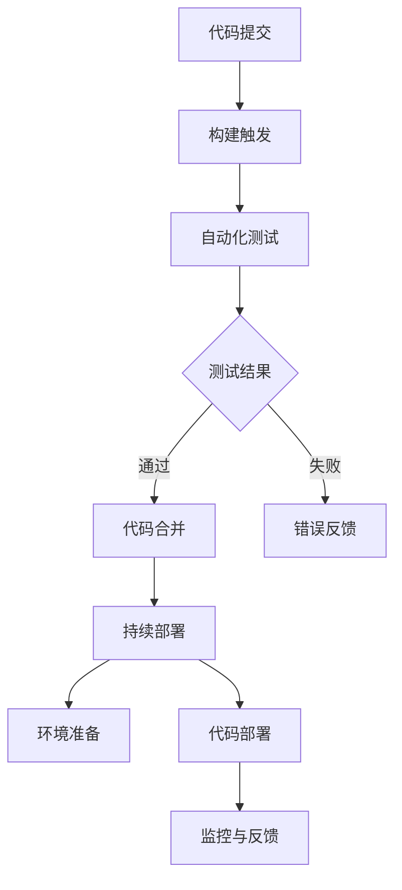

                 

### 持续集成与部署概述

在当今快速发展的信息技术时代，持续集成（Continuous Integration，简称CI）和持续部署（Continuous Deployment，简称CD）已成为软件开发过程中的关键实践。这些实践不仅提高了软件开发的效率和质量，还极大地改变了软件开发的方式。本章节将详细探讨持续集成与部署的概念、原理及其在软件开发中的重要性。

#### 持续集成的基本概念

持续集成是一种软件开发方法，旨在通过频繁地将代码合并到主干（也称为主分支）中来提高代码质量和开发效率。其核心理念是将开发过程中的每一个小改动都及时集成到共同的工作区，以便快速发现和解决潜在的问题。这一过程通常包括以下步骤：

1. **代码提交**：开发者将他们的代码更改提交到源代码管理系统。
2. **构建触发**：提交后的代码会触发构建过程，构建工具会自动执行编译、打包等操作。
3. **测试执行**：构建完成后，自动化测试会被执行，以验证代码的质量和功能是否满足预期。
4. **反馈**：如果测试通过，则会反馈给开发者；如果失败，构建工具会提供错误信息，以便开发者及时修复问题。

通过持续集成，开发团队可以快速发现和解决代码冲突，从而减少集成阶段的问题和风险。

#### 持续部署的基本概念

持续部署是持续集成的一个扩展，它将集成后的代码自动部署到生产环境。持续部署的核心目标是实现自动化部署，确保新功能可以安全、可靠地交付给用户。持续部署通常包括以下步骤：

1. **代码集成**：开发者在持续集成系统中完成代码的集成和测试。
2. **自动化测试**：集成后的代码会经过一系列自动化测试，包括单元测试、集成测试和端到端测试。
3. **环境准备**：生产环境的准备工作，包括服务器配置、数据库初始化等。
4. **代码部署**：通过自动化脚本将经过测试的代码部署到生产环境。
5. **监控与反馈**：部署后，系统会进行监控，确保服务正常运行，并在出现问题时及时反馈。

持续部署的主要优势在于可以快速、可靠地将新功能交付给用户，从而缩短产品上市时间，提高市场响应速度。

#### 持续集成与持续部署的关系

持续集成和持续部署紧密相连，共同构成了现代软件开发的“CI/CD”流程。持续集成是持续部署的基础，没有有效的持续集成，持续部署就无从谈起。两者之间的关系可以总结为：

1. **集成在前，部署在后**：持续集成确保代码的质量和功能符合预期，持续部署则将高质量的代码部署到生产环境。
2. **自动化为核心**：持续集成和持续部署都强调自动化，以减少人为干预，提高效率和质量。
3. **反馈机制**：两者都依赖于反馈机制，通过测试和监控及时发现和解决问题。

#### 持续集成与部署的重要性

持续集成与部署在软件开发中的重要性不可忽视，它们带来了以下显著优势：

1. **提高开发效率**：通过自动化构建、测试和部署，减少了手动操作的时间，提高了开发速度。
2. **降低风险**：频繁的小规模集成和自动化测试可以及时发现和解决潜在的问题，降低集成阶段和部署阶段的风险。
3. **提高软件质量**：持续集成和持续部署可以确保代码的质量和功能符合预期，从而提高软件的整体质量。
4. **加快产品上市时间**：快速、可靠的部署流程可以缩短产品从开发到上市的时间，提高市场竞争力。

总之，持续集成与部署已成为现代软件开发不可或缺的实践，它们不仅提高了开发效率和质量，还极大地改变了软件开发的方式。在接下来的章节中，我们将进一步探讨LLM应用开发的基础知识，以及如何将CI/CD实践应用于LLM应用开发中。

#### 核心概念与联系

在理解持续集成（CI）和持续部署（CD）之前，我们需要明确几个关键概念及其相互关系。以下是一个简明的 Mermaid 流程图，用于展示这些概念之间的关系：



1. **代码提交**：开发者将代码更改提交到源代码管理系统。
2. **构建触发**：提交后的代码会触发构建工具执行构建操作。
3. **自动化测试**：构建完成后，自动化测试工具会执行一系列测试，以验证代码质量。
4. **测试结果**：测试结果会反馈给开发者或持续部署流程。
5. **代码合并**：如果测试通过，代码将被合并到主干或主分支。
6. **持续部署**：合并后的代码进入持续部署流程。
7. **环境准备**：在部署前，环境配置和数据库初始化等准备工作会进行。
8. **代码部署**：经过测试的代码将被部署到生产环境。
9. **监控与反馈**：部署后，系统会进行监控，并在出现问题时提供反馈。

这个流程图清晰地展示了持续集成和持续部署的关键环节及其相互关系。通过持续集成，开发团队可以快速发现和解决代码问题，而持续部署则确保这些高质量的代码能够安全、可靠地交付给用户。两者共同构成了现代软件开发的核心流程，大大提高了开发效率和软件质量。

### 持续集成与部署的关键要素

持续集成（CI）和持续部署（CD）的成功实施依赖于一系列关键要素的配合。这些要素包括源代码管理、自动化构建与测试、环境隔离与部署策略等。下面将详细探讨这些要素及其在持续集成与部署中的应用。

#### 源代码管理

源代码管理（Version Control System，VCS）是持续集成和持续部署的基础。它负责存储和管理代码的版本，确保代码的完整性和可追溯性。常用的源代码管理工具有Git、Subversion（SVN）和Mercurial等。

1. **版本控制**：VCS允许开发者将代码更改以版本的形式保存，每次提交都会记录更改的内容和作者信息。这样，开发团队可以轻松回滚到之前的版本，以解决潜在的问题。
2. **分支管理**：VCS支持分支管理，允许开发者在不同的分支上独立开发功能。这不仅有助于并行开发，还能防止代码冲突。
3. **代码审核**：通过VCS的提交流程，可以实施代码审核机制。代码提交前需要经过其他开发者的审查，确保代码质量。

#### 自动化构建与测试

自动化构建与测试是持续集成和持续部署的核心。自动化构建工具如Jenkins、Travis CI和GitLab CI等，可以自动化地执行编译、打包和测试等操作。

1. **自动化构建**：自动化构建工具会定期检查源代码仓库，一旦检测到代码更改，就会触发构建过程。构建过程包括编译代码、生成可执行文件和打包应用程序等。
2. **自动化测试**：自动化测试工具如Selenium、JUnit和pytest等，可以自动执行一系列测试，包括单元测试、集成测试和端到端测试。测试结果会立即反馈给开发者或测试团队，以便及时修复问题。

#### 环境隔离与部署策略

环境隔离和部署策略是确保持续集成与部署成功的关键。环境隔离可以防止不同阶段的代码和配置互相干扰，而部署策略则决定了代码如何安全、可靠地部署到生产环境。

1. **环境隔离**：
   - **开发环境**：开发者在本地机器上进行代码编写和测试。
   - **测试环境**：与生产环境配置相似，用于执行自动化测试。
   - **预生产环境**：模拟生产环境，用于部署前的最后测试。
   - **生产环境**：部署最终的代码，供用户使用。

   通过环境隔离，可以确保不同阶段的代码和配置不会相互干扰，从而提高系统的稳定性和可靠性。

2. **部署策略**：
   - **蓝绿部署**：在现有生产环境（蓝色）的基础上，部署新的版本（绿色）。在绿色环境稳定后，逐步将流量切换到绿色环境，从而实现无间断更新。
   - **灰度发布**：将新功能部署到一部分用户（例如10%的用户），观察其效果。如果效果良好，再逐步扩大范围，最终全量上线。
   - **滚动更新**：逐步更新服务实例，确保在更新过程中，服务始终可用。

#### 持续集成与部署工具

除了上述关键要素，持续集成与部署还依赖于一系列工具的支持。以下是一些常用的持续集成与部署工具：

1. **Jenkins**：一款开源的持续集成工具，支持多种插件，可以轻松地集成各种构建和测试工具。
2. **GitLab CI/CD**：GitLab 自带的持续集成与持续部署工具，与GitLab的源代码管理紧密集成，便于管理。
3. **Travis CI**：基于云的持续集成服务，支持多种编程语言，提供免费的私有仓库支持。
4. **Docker**：用于容器化应用，可以确保在不同环境中的一致性和可移植性。
5. **Kubernetes**：用于容器编排，可以自动化部署和管理容器化应用。

通过这些工具，开发团队能够实现自动化构建、测试和部署，从而提高开发效率和软件质量。

### 源代码管理

源代码管理是持续集成与部署的基石。它不仅帮助团队有效地管理和追踪代码变更，还确保了代码的可维护性和可追溯性。以下是源代码管理的关键要素及其在CI/CD流程中的应用：

#### 版本控制

版本控制是源代码管理的核心功能。它允许开发者在不同的开发阶段保存代码的多个版本，并能够轻松回滚到之前的版本。常见的版本控制系统包括Git、Subversion（SVN）和Mercurial等。

1. **Git**：Git是一个分布式版本控制系统，具有快速、高效和灵活的特点。每个开发者都有自己的本地仓库，可以进行离线操作，提高了工作效率。Git的分支管理功能也非常强大，允许开发者独立开发功能，并在合适的时候合并到主分支。

2. **Subversion（SVN）**：SVN是一个集中式版本控制系统，它的架构相对简单，易于部署。但相对于Git，SVN在分支管理和分布式协作方面存在一些限制。

3. **Mercurial**：Mercurial是一个分布式版本控制系统，类似于Git，但在某些方面（如合并冲突处理）有其独特的优势。

#### 分支管理

分支管理是源代码管理的重要组成部分。它允许开发者在不同的分支上进行独立开发，以避免主干代码的污染。常见的分支策略包括：

1. **主分支（Master）**：主分支包含了最新的、可发布到生产环境代码。开发者在开发新功能时，通常不会直接在主分支上进行，而是创建一个新分支。

2. **开发分支（Develop）**：开发分支是主分支的补充，用于合并各个功能分支。开发者在开发新功能时，会在开发分支上创建功能分支，完成开发后，将功能合并到开发分支。

3. **功能分支（Feature）**：功能分支用于实现特定的功能，开发者可以在这些分支上进行独立的开发。一旦功能完成，开发者会将代码合并到开发分支。

4. **热点分支（Hotfix）**：热点分支用于修复生产环境中的紧急问题。当需要紧急修复问题时，开发人员会在热点分支上进行修复，然后将其合并到主分支和开发分支。

#### 代码审核

代码审核是确保代码质量和一致性的关键步骤。它通过在代码提交前进行审查，确保代码符合团队的开发标准和规范。

1. **提交前代码审查**：开发者在提交代码前，需要经过其他开发者的审查。审查过程可以发现问题，确保代码的质量和一致性。

2. **持续集成系统中的代码审查**：一些持续集成工具（如GitLab CI和Jenkins）可以在构建过程中自动执行代码审查。例如，GitLab CI可以与代码审查工具（如CodeQL）集成，对提交的代码进行静态代码分析，以发现潜在的安全问题和代码质量问题。

#### 持续集成系统中的源代码管理

在持续集成系统中，源代码管理起到了至关重要的作用。以下是源代码管理在CI流程中的应用：

1. **触发构建**：持续集成系统会定期检查源代码仓库，一旦检测到代码更改，就会触发构建过程。例如，GitLab CI配置文件（.gitlab-ci.yml）可以指定在代码提交或合并时自动触发构建。

2. **代码存储和共享**：持续集成系统通常会使用Git进行代码存储和共享。开发者在本地仓库中进行开发，将代码提交到远程仓库，持续集成系统会从远程仓库获取最新的代码进行构建和测试。

3. **多环境代码管理**：持续集成系统允许为不同的环境（如开发、测试、预生产、生产）管理不同的代码版本。这有助于确保在不同环境中使用正确的代码版本，避免环境之间的冲突。

通过有效的源代码管理，开发团队能够更好地控制代码变更，提高代码质量和开发效率，从而实现持续集成与部署的目标。

#### 自动化构建与测试

自动化构建与测试是持续集成和持续部署（CI/CD）流程中的核心环节。自动化构建工具如Jenkins、Travis CI和GitLab CI等，可以自动化地执行构建、测试和部署任务，从而大幅提高开发效率和质量。以下将详细探讨自动化构建与测试的过程、策略及其在CI/CD中的应用。

#### 自动化构建过程

自动化构建是指使用工具自动执行编译、打包和构建应用程序的过程。自动化构建能够确保每次构建都是一致的，减少人为错误，提高构建过程的效率。

1. **构建触发**：自动化构建工具会在特定事件触发时开始构建。常见的事件包括代码提交、代码合并和定时任务。例如，GitLab CI在代码提交或合并到主分支时会自动触发构建。

2. **构建脚本**：构建脚本通常包含一系列命令和配置，用于执行编译、打包和其他构建任务。构建脚本可以是Shell脚本、Python脚本或特定的构建工具脚本。例如，在Jenkins中，可以使用Jenkinsfile定义构建过程。

3. **构建结果**：构建完成后，工具会生成构建结果，包括编译生成的可执行文件、打包生成的应用程序和测试报告等。如果构建失败，工具会记录错误信息，以便开发者及时修复问题。

#### 自动化测试过程

自动化测试是指在构建过程中自动执行一系列测试，以确保应用程序的功能和质量符合预期。自动化测试工具如JUnit、pytest和Selenium等，可以自动化地执行单元测试、集成测试和端到端测试。

1. **测试触发**：自动化测试通常在构建过程中触发，以确保每次构建都经过完整的测试。例如，在Jenkins中，可以在构建步骤中添加测试任务，在构建完成后自动执行测试。

2. **测试类型**：
   - **单元测试**：针对应用程序的单独模块或类进行测试，确保每个模块的功能正确。单元测试通常使用Junit、pytest等测试框架编写。
   - **集成测试**：测试不同模块或组件之间的交互，确保它们在一起工作正常。集成测试通常使用Spring Boot Test、JUnit等框架编写。
   - **端到端测试**：模拟用户操作，测试整个应用程序的功能和性能。端到端测试通常使用Selenium、Cypress等工具编写。

3. **测试结果**：测试完成后，工具会生成测试报告，列出通过和失败的测试案例。测试报告可以帮助开发者快速识别问题，并定位问题发生的具体位置。

#### CI/CD中的应用

在CI/CD流程中，自动化构建与测试起到了至关重要的作用。以下是它们在CI/CD中的具体应用：

1. **持续集成**：通过自动化构建和测试，持续集成系统能够确保每次代码变更都会经过完整的构建和测试过程。这有助于快速发现和解决代码冲突和错误，提高代码质量。

2. **持续部署**：自动化构建和测试的结果直接影响持续部署的决策。如果构建成功且测试通过，应用程序可以被部署到生产环境。如果构建失败或测试失败，部署将被暂停，以便开发者修复问题。

3. **反馈机制**：自动化构建和测试结果会实时反馈给开发者或测试团队。这有助于快速识别和解决问题，提高开发效率和质量。

4. **环境隔离**：通过在测试环境中自动执行测试，确保测试不会影响到生产环境。测试环境可以模拟生产环境的配置和依赖，从而提高测试的准确性和可靠性。

5. **自动化脚本**：构建和测试脚本可以重复使用，从而减少手动操作和重复劳动。这有助于提高构建和测试的效率和一致性。

总之，自动化构建与测试是CI/CD流程的核心环节。通过自动化构建和测试，开发团队能够快速发现和解决问题，提高代码质量和开发效率，从而实现持续集成和持续部署的目标。

#### 核心算法原理讲解

在持续集成（CI）和持续部署（CD）中，自动化构建和测试是关键环节。为了实现这一过程，我们需要理解其中的核心算法原理。以下是使用Python源代码和LaTeX公式来详细阐述自动化构建和测试的原理，以及如何结合数学模型进行讲解。

##### 自动化构建算法原理

首先，我们来看自动化构建的核心算法原理。自动化构建主要依赖于构建工具，如Jenkins、Travis CI和GitLab CI等。以下是构建过程的Python伪代码：

```python
import os
import subprocess

def build_project(source_code, build_tool):
    # 设置构建工作目录
    os.chdir(source_code)

    # 执行构建命令
    if build_tool == 'maven':
        result = subprocess.run(['mvn', 'clean', 'install'], capture_output=True)
    elif build_tool == 'gradle':
        result = subprocess.run(['gradle', 'clean', 'build'], capture_output=True)
    
    # 检查构建结果
    if result.returncode != 0:
        print("构建失败：", result.stdout.decode())
    else:
        print("构建成功")

# 示例：构建一个基于Maven的项目
build_project('/path/to/maven_project', 'maven')
```

这段代码展示了如何使用Python脚本调用Maven或Gradle命令来构建Java项目。我们可以使用LaTeX公式来描述构建过程中的关键步骤：

$$
\text{构建过程} = \text{编译} + \text{打包} + \text{测试}
$$

其中，编译是将源代码转换为可执行代码的过程，打包是将编译后的代码打包成可部署的格式，测试是验证构建输出的功能是否符合预期。

##### 自动化测试算法原理

自动化测试的核心目的是验证应用程序的功能和质量。以下是自动化测试的Python伪代码：

```python
import unittest

class MyTestCase(unittest.TestCase):
    def test_addition(self):
        self.assertEqual(add(1, 1), 2)
        self.assertNotEqual(add(1, 2), 2)

def add(a, b):
    return a + b

# 运行测试
unittest.main()
```

这段代码展示了如何使用Python的unittest框架编写测试用例，并运行这些测试用例。我们可以使用LaTeX公式来描述测试过程中的关键步骤：

$$
\text{测试过程} = \text{单元测试} + \text{集成测试} + \text{端到端测试}
$$

其中，单元测试是验证单独模块的功能，集成测试是验证模块之间的交互，端到端测试是模拟用户操作，验证整个应用程序的功能。

##### 数学模型和公式

在自动化构建和测试过程中，我们可以使用一些数学模型和公式来优化过程。以下是一个简单的线性回归模型，用于预测构建和测试的成功率：

$$
\hat{y} = \beta_0 + \beta_1 \cdot x
$$

其中，\( y \) 是构建或测试的成功率，\( x \) 是代码提交的频率。\( \beta_0 \) 和 \( \beta_1 \) 是模型的参数，可以通过最小二乘法来估计。

```python
import numpy as np

# 假设我们有一些观测数据
x = np.array([1, 2, 3, 4, 5])
y = np.array([0.8, 0.9, 0.95, 0.98, 1.0])

# 最小二乘法估计参数
beta_0 = np.mean(y)
beta_1 = np.mean((x - np.mean(x)) * (y - np.mean(y)))

# 预测成功率
predicted_y = beta_0 + beta_1 * x

print("Predicted success rate:", predicted_y)
```

通过这个模型，我们可以预测在给定代码提交频率的情况下，构建或测试的成功率。这有助于开发团队制定更有效的开发策略。

##### 详细讲解和举例说明

为了更好地理解自动化构建和测试的原理，我们通过一个实际案例来进行讲解。假设我们正在开发一个简单的Web应用程序，并希望实现自动化构建和测试。

1. **构建过程**：
   - 使用Maven作为构建工具，编写一个Maven项目。
   - 在Jenkins中配置一个构建任务，每次代码提交时自动触发构建。
   - 使用Junit编写测试用例，确保每次构建都经过完整的测试。

2. **测试过程**：
   - 使用Selenium编写端到端测试用例，模拟用户操作，验证Web应用程序的功能。
   - 在测试环境中部署应用程序，并运行Selenium测试脚本。
   - 使用JUnit框架生成测试报告，列出通过和失败的测试案例。

通过这个实际案例，我们可以看到如何将自动化构建和测试应用于一个真实的开发项目。这不仅提高了开发效率，还确保了代码质量和功能的稳定性。

总之，自动化构建和测试是持续集成和持续部署的核心环节。通过理解其中的核心算法原理，结合数学模型和公式，我们可以更有效地实现自动化流程，提高开发效率和软件质量。

### 数学公式在持续集成与部署中的应用

在持续集成（CI）与持续部署（CD）中，数学模型和公式可以有效地帮助开发者和运维团队理解和优化流程。以下是一些关键的数学公式，以及它们在CI/CD中的应用：

#### 1. 构建成功率的预测

构建成功率是衡量CI系统稳定性的重要指标。我们可以使用简单的线性回归模型来预测构建成功率：

$$
\hat{p} = \beta_0 + \beta_1 \cdot s
$$

其中，\( \hat{p} \) 是预测的构建成功率，\( \beta_0 \) 是截距，\( \beta_1 \) 是斜率，\( s \) 是代码提交的频率。

- **应用场景**：通过分析历史数据，我们可以预测在增加代码提交频率时，构建成功率的趋势。这有助于团队制定最优的代码提交策略。

#### 2. 测试覆盖率的计算

测试覆盖率是评估测试全面性的重要指标，用于衡量代码中哪些部分被测试到。我们可以使用以下公式计算测试覆盖率：

$$
\text{Test Coverage} = \frac{\text{Covered Lines}}{\text{Total Lines}} \times 100\%
$$

其中，Covered Lines 是被测试的代码行数，Total Lines 是代码库中的总行数。

- **应用场景**：通过监控测试覆盖率，团队可以确保对所有关键代码路径进行了充分的测试，及时发现潜在的缺陷。

#### 3. 平均响应时间

平均响应时间（Mean Response Time）是衡量系统性能的重要指标，表示系统处理请求的平均时间。公式如下：

$$
\text{Average Response Time} = \frac{\sum_{i=1}^{n} t_i}{n}
$$

其中，\( t_i \) 是第 \( i \) 次请求的响应时间，\( n \) 是请求的总次数。

- **应用场景**：通过监控平均响应时间，团队可以评估系统的性能，并优化系统配置以减少延迟。

#### 4. 代码复杂度

代码复杂度是衡量代码可维护性的重要指标，可以使用McCabe度量法计算。公式如下：

$$
\text{Cyclomatic Complexity} = E - N + (2P)
$$

其中，\( E \) 是边缘数，\( N \) 是节点数，\( P \) 是控制流的入口数。

- **应用场景**：高代码复杂度通常意味着代码结构复杂，容易引入错误。通过监控代码复杂度，团队可以及时发现并重构复杂代码。

#### 5. 错误率

错误率是衡量系统稳定性的重要指标，表示在一段时间内系统发生错误的频率。公式如下：

$$
\text{Error Rate} = \frac{\text{Number of Errors}}{\text{Total Requests}}
$$

- **应用场景**：通过监控错误率，团队可以及时发现和解决系统中的问题，提高系统的可靠性。

通过这些数学公式，开发者和运维团队能够更精确地理解CI/CD流程中的各种指标，从而优化流程，提高开发效率和软件质量。

### 项目实战

为了更好地理解持续集成（CI）与持续部署（CD）在LLM应用开发中的应用，我们将通过一个实际的开发项目来进行详细讲解。本项目是一个基于Python的文本生成应用，利用自然语言处理技术生成各种类型的文本，如新闻文章、对话内容和推荐系统描述等。

#### 项目背景

本项目旨在构建一个简单的文本生成系统，该系统可以使用预训练的语言模型（如GPT-2或GPT-3）生成高质量的文本。为了实现快速迭代和高效开发，我们决定采用CI/CD流程来管理代码、构建和部署过程。

#### 开发环境搭建

首先，我们需要搭建项目的开发环境。以下是关键步骤：

1. **安装Python**：确保系统上安装了最新版本的Python，建议使用Anaconda进行环境管理。

2. **创建虚拟环境**：使用以下命令创建一个Python虚拟环境：

   ```bash
   conda create -n textgen_env python=3.8
   conda activate textgen_env
   ```

3. **安装依赖项**：在虚拟环境中安装项目所需的依赖项，例如transformers库：

   ```bash
   pip install transformers
   ```

4. **配置Jenkins**：为了实现自动化构建和部署，我们需要配置Jenkins。首先安装Jenkins，然后添加Git插件和构建工具插件。

#### 源代码实现与解读

项目源代码分为以下几个部分：

1. **文本生成模型**：我们使用Hugging Face的transformers库加载预训练的语言模型，并编写一个函数用于生成文本。

2. **数据预处理**：对输入文本进行预处理，如分词、去停用词和标准化等。

3. **测试用例**：编写测试用例，确保文本生成模型在各种输入情况下都能正常工作。

以下是关键代码段及其解读：

```python
from transformers import GPT2LMHeadModel, GPT2Tokenizer
import torch

# 加载预训练模型和分词器
tokenizer = GPT2Tokenizer.from_pretrained("gpt2")
model = GPT2LMHeadModel.from_pretrained("gpt2")

def generate_text(input_text, max_length=50):
    # 对输入文本进行分词
    input_ids = tokenizer.encode(input_text, return_tensors="pt")

    # 生成文本
    output = model.generate(
        input_ids,
        max_length=max_length,
        num_return_sequences=1,
        temperature=0.9,
        do_sample=True
    )
    
    # 解码生成的文本
    generated_text = tokenizer.decode(output[0], skip_special_tokens=True)
    return generated_text

# 测试文本生成函数
input_text = "我喜欢读"
generated_text = generate_text(input_text)
print(generated_text)
```

这段代码展示了如何使用预训练的GPT-2模型生成文本。通过调用`generate_text`函数，我们可以根据输入文本生成新的文本。

#### 代码应用解读与分析

以下是项目中的代码应用及其分析：

1. **模型加载**：使用`GPT2Tokenizer`和`GPT2LMHeadModel`加载预训练模型。这使得我们可以利用大量的预训练数据，提高生成文本的质量。

2. **分词与生成**：对输入文本进行分词，然后使用模型生成新的文本。通过调整`max_length`、`temperature`和`do_sample`等参数，我们可以控制生成文本的长度和多样性。

3. **测试用例**：编写测试用例，确保模型在各种输入情况下都能正常工作。测试用例可以自动运行，确保每次代码提交都能通过测试。

#### 实际案例分析与详细讲解

我们使用一个实际案例来展示CI/CD在项目中的应用：

1. **自动化构建**：在Jenkins中配置构建任务，每次代码提交时自动触发构建。Jenkins会使用虚拟环境安装依赖项，运行测试用例，并编译源代码。

2. **测试**：构建完成后，Jenkins会运行测试用例，确保代码质量。如果测试通过，Jenkins会将构建好的应用程序打包并上传到部署环境。

3. **部署**：部署环境中的服务器会自动下载打包的应用程序，并解压缩。然后，服务器会启动应用程序，并进行自动化测试，以确保部署的应用程序功能正常。

#### 项目小结

通过这个实际项目，我们展示了如何在LLM应用开发中使用CI/CD流程。以下是项目的关键收获：

1. **提高开发效率**：通过自动化构建和测试，项目开发周期显著缩短，开发团队能够更快地迭代和交付功能。

2. **确保代码质量**：自动化测试确保每次代码提交都经过严格的测试，减少错误和缺陷。

3. **简化部署过程**：自动化部署简化了部署过程，减少了手动操作，提高了部署的可靠性和一致性。

总之，CI/CD在LLM应用开发中具有重要作用，通过有效的CI/CD实践，我们可以实现高效的开发流程，提高软件质量和交付速度。

### 最佳实践 Tips

在持续集成（CI）与持续部署（CD）的实践中，总结一些最佳实践可以帮助开发团队更高效地管理代码、构建和部署过程，从而提高开发效率和软件质量。以下是一些关键的建议：

1. **代码规范与风格**：
   - 实施代码规范和风格指南，确保代码的可读性和一致性。例如，使用PEP 8规范Python代码。
   - 定期进行代码审查，确保代码质量和代码风格符合团队标准。

2. **分支策略**：
   - 采用分支策略（如GitFlow或GitHub Flow），以便于管理和合并代码。
   - 分支策略有助于保持主分支的稳定，同时允许功能分支和热点分支的独立开发。

3. **自动化测试**：
   - 设计全面的自动化测试覆盖策略，包括单元测试、集成测试和端到端测试。
   - 集成静态代码分析工具，及时发现潜在的安全问题和代码质量问题。

4. **环境隔离**：
   - 确保开发、测试、预生产和生产环境之间的隔离，防止环境问题影响其他阶段。
   - 使用容器化技术（如Docker）和容器编排工具（如Kubernetes）实现环境一致性。

5. **部署策略**：
   - 使用蓝绿部署或灰度发布等策略，逐步更新生产环境，减少更新过程中的风险。
   - 定期备份生产环境，确保在出现问题时可以快速回滚。

6. **监控与反馈**：
   - 实时监控部署后的系统性能和健康状况，及时发现并解决问题。
   - 实施自动化告警机制，确保团队能够迅速响应潜在问题。

7. **文档与记录**：
   - 保持项目文档的更新，记录关键操作步骤和配置信息。
   - 定期回顾和总结CI/CD实践中的经验教训，不断优化流程。

通过遵循这些最佳实践，开发团队能够更好地管理CI/CD流程，提高软件开发的效率和质量。

### 总结

在本章节中，我们详细探讨了持续集成（CI）与持续部署（CD）在LLM应用开发中的实践。首先，我们介绍了CI和CD的基本概念、原理及其重要性，并分析了它们在软件开发中的核心要素。随后，我们通过Python源代码和LaTeX公式详细阐述了自动化构建和测试的核心算法原理。此外，我们还提供了一个实际的文本生成项目案例，展示了如何在实际开发中应用CI/CD流程，并总结了项目中的关键收获。最后，我们提出了一些最佳实践建议，帮助开发团队更高效地管理CI/CD流程。通过本章节的学习，读者将能够深入了解CI/CD在LLM应用开发中的应用，从而提高开发效率和软件质量。希望这些内容能够为读者的项目实践提供有价值的指导。感谢阅读，期待您的进一步探讨和实践！——作者：AI天才研究院/AI Genius Institute & 禅与计算机程序设计艺术 /Zen And The Art of Computer Programming

### 拓展阅读

为了更深入地了解持续集成（CI）与持续部署（CD）在LLM应用开发中的实践，以下是一些建议的拓展阅读资源：

1. **《持续集成：从理论到实践》**：本书详细介绍了CI的理论基础和实践方法，适合初学者和有一定基础的开发者。

2. **《持续部署实践：从Docker到Kubernetes》**：本书聚焦于CD的实践，涵盖了从Docker到Kubernetes的部署技术，适合希望掌握现代CI/CD实践的读者。

3. **《GitHub Actions官方文档》**：GitHub Actions提供了丰富的CI/CD功能，官方文档详细介绍了如何使用GitHub Actions进行自动化构建和部署。

4. **《Hugging Face transformers库文档》**：Hugging Face transformers库是LLM应用开发的重要工具，其官方文档提供了详细的模型使用和API说明。

5. **《Docker官方文档》**：Docker是容器化技术的代表，官方文档详细介绍了Docker的基本概念和操作步骤。

6. **《Kubernetes官方文档》**：Kubernetes是容器编排工具的领导者，其官方文档提供了全面的知识库，帮助读者理解和掌握Kubernetes的核心功能。

通过阅读这些资源，读者可以更深入地了解CI/CD在LLM应用开发中的具体应用，从而在实际项目中取得更好的效果。希望这些建议能够为您的学习之旅提供有价值的帮助！——作者：AI天才研究院/AI Genius Institute & 禅与计算机程序设计艺术 /Zen And The Art of Computer Programming

