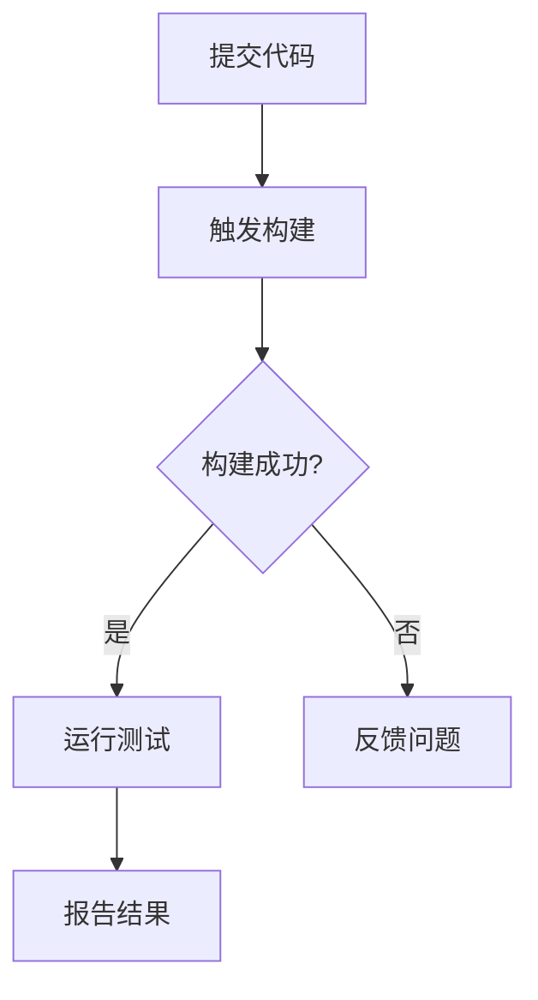
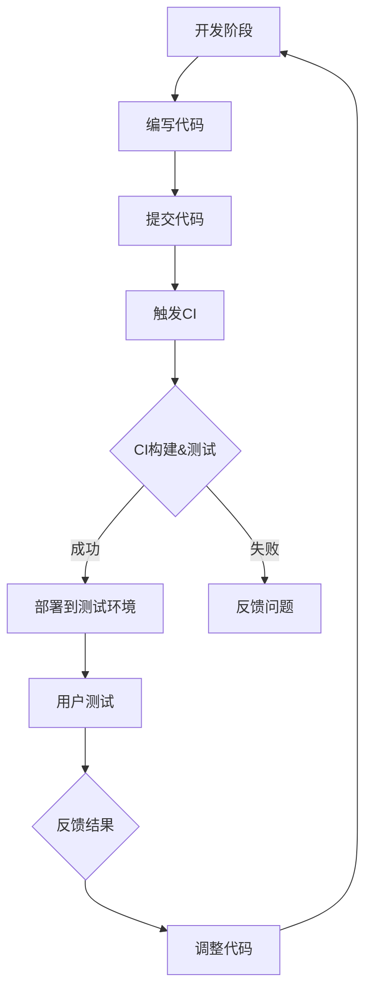

                 

### 文章标题

《持续集成在LLM应用敏捷开发中的重要性》

### 关键词

持续集成（CI）、敏捷开发（Agile Development）、大型语言模型（LLM）、自动化测试、持续交付（CD）、敏捷开发流程、软件质量保证、开发效率优化。

### 摘要

本文探讨了持续集成（CI）在大型语言模型（LLM）应用敏捷开发中的重要性。首先，我们介绍了持续集成的基本概念、优势及其在敏捷开发中的应用，随后详细分析了自动化测试和持续交付的核心原理。通过Python代码示例和数学模型的应用，本文展示了如何在实际项目中实现持续集成。最后，我们提供了一个完整的LLM应用持续集成环境的构建案例，包括开发环境搭建、代码实现、测试策略和效果评估，总结了最佳实践，并提供了拓展阅读资源。

---

### 前言

#### 引言

在现代软件开发领域，敏捷开发（Agile Development）已经成为主流的开发方法论。其核心理念是快速迭代、持续交付和客户至上，旨在提高开发效率、降低风险并满足不断变化的客户需求。与此同时，持续集成（Continuous Integration，简称CI）作为一种自动化构建和测试的实践，已经在敏捷开发中发挥着越来越重要的作用。

本文旨在深入探讨持续集成在LLM应用敏捷开发中的重要性。我们首先介绍持续集成的基本概念、优势及其与敏捷开发的融合。接着，详细分析自动化测试和持续交付的核心原理，并通过Python代码示例和数学模型的应用，展示它们在持续集成中的具体实践。最后，我们提供一个完整的LLM应用持续集成环境的构建案例，包括开发环境搭建、代码实现、测试策略和效果评估，总结最佳实践，并提供拓展阅读资源。

#### 读者对象

本文面向具有基本软件开发经验的读者，尤其是对敏捷开发、持续集成和大型语言模型（LLM）有一定了解的开发者、项目经理和技术领导。本文旨在为读者提供一种系统性的视角，帮助他们在实际项目中有效应用持续集成，提高开发效率和质量。

#### 内容安排

本文分为四个主要部分：

1. **核心概念与联系**：介绍持续集成的基本概念、优势及其与敏捷开发的融合，并展示核心概念原理之间的关系架构。
2. **核心算法原理讲解**：详细讲解自动化测试和持续交付的核心原理，通过Python代码示例和数学模型的应用，展示其在持续集成中的具体实践。
3. **项目实战**：提供一个完整的LLM应用持续集成环境的构建案例，包括开发环境搭建、代码实现、测试策略和效果评估。
4. **最佳实践与总结**：总结持续集成在LLM应用敏捷开发中的最佳实践，并提供拓展阅读资源。

#### 如何利用本文

本文旨在为读者提供一个全面且深入的理解，帮助他们将持续集成应用于实际项目。读者可以通过以下步骤充分利用本文：

1. **阅读核心概念与联系部分**：了解持续集成的基本概念和优势，以及其在敏捷开发中的应用。
2. **学习核心算法原理讲解**：通过Python代码示例和数学模型的应用，掌握自动化测试和持续交付的核心原理。
3. **实践项目实战部分**：结合实际案例，学习如何构建LLM应用的持续集成环境，并评估其实际效果。
4. **应用最佳实践**：总结持续集成在LLM应用敏捷开发中的最佳实践，并将其应用于实际项目中。

通过本文的学习，读者将能够更好地理解持续集成在LLM应用敏捷开发中的重要性，并在实际项目中有效应用持续集成，提高开发效率和软件质量。

---

### 第一部分：核心概念与联系

#### 第1章：持续集成的基本概念

##### 1.1 持续集成的定义

持续集成（Continuous Integration，简称CI）是一种软件开发实践，旨在通过频繁地合并代码变更并自动测试，以确保软件的持续稳定性。其核心思想是开发者将代码更改频繁地提交到共享的代码库中，并且每次提交都会自动触发一系列的构建和测试任务，从而及时发现和解决潜在的问题。

持续集成的定义可以分解为以下几个关键要素：

1. **频繁提交**：开发者在任何时间都可以将他们的代码更改提交到共享的代码库中。
2. **自动构建**：每次提交都会自动触发构建过程，将代码合并并生成可执行的软件版本。
3. **自动测试**：构建过程中会自动运行一系列测试，包括单元测试、集成测试和端到端测试，以确保代码的质量和功能的正确性。
4. **即时反馈**：测试结果会即时反馈给开发者，帮助他们快速定位和解决问题。

##### 1.2 持续集成与传统集成方式对比

传统的集成方式通常在软件开发周期后期进行，即当大部分开发工作完成时，将不同开发者的代码合并并进行一次性集成测试。这种方式存在以下几个问题：

1. **风险集中**：由于测试集中在软件开发周期的后期，一旦发现问题，可能会影响整个项目的进度，导致项目延期。
2. **沟通成本高**：由于不同开发者的代码需要集中合并，导致沟通成本高，容易产生冲突和误解。
3. **测试不全面**：一次性集成测试往往难以覆盖所有功能和场景，可能导致一些潜在的问题未被及时发现。

相比之下，持续集成具有以下优点：

1. **风险分散**：通过频繁的代码合并和测试，持续集成能够将风险分散到开发周期的各个阶段，降低单个阶段的风险。
2. **提高沟通效率**：持续集成鼓励频繁的代码提交和反馈，有助于提高团队成员之间的沟通效率，减少误解和冲突。
3. **全面测试**：持续集成通过自动化测试，能够在每个代码变更后进行全面的测试，确保功能的正确性和稳定性。

##### 1.3 持续集成的优势与挑战

持续集成在软件开发中具有显著的优势，但也面临一些挑战。以下是其主要的优势和挑战：

1. **优势**：
   - **快速反馈**：通过即时反馈，开发者能够迅速发现和解决问题，提高开发效率。
   - **提高软件质量**：频繁的测试和代码合并有助于提高软件的稳定性，减少缺陷。
   - **降低风险**：通过分散风险，持续集成能够降低项目延期和成本超支的风险。
   - **持续交付**：持续集成与持续交付（Continuous Deployment，简称CD）结合，有助于实现快速交付和部署。

2. **挑战**：
   - **初期设置复杂**：持续集成的初期设置相对复杂，需要配置构建环境和测试环境，并对代码库进行适当的组织和管理。
   - **测试覆盖率不足**：如果测试覆盖率不足，持续集成可能会错过一些潜在的问题，影响软件质量。
   - **持续维护**：持续集成系统需要定期更新和维护，以适应项目的变更和需求。
   - **团队协作要求高**：持续集成要求团队成员之间有较高的协作和沟通，确保代码的持续整合和测试。

为了克服这些挑战，团队需要采取以下措施：

1. **完善测试覆盖**：确保测试覆盖率达到项目的需求，覆盖各种功能和场景。
2. **持续优化**：定期评估和优化持续集成流程，确保其适应项目的发展和变化。
3. **培训和支持**：为团队成员提供培训和必要的技术支持，确保他们能够熟练掌握持续集成的方法和工具。
4. **良好的代码管理**：采用版本控制系统，如Git，确保代码的版本控制和分支管理。

#### Mermaid 流程图

为了更好地理解持续集成的核心概念和流程，我们可以使用Mermaid语言绘制一个简单的持续集成流程图：



在这个流程图中，开发者（A）提交代码后，系统会自动触发构建（B）。如果构建成功，则会运行测试（D），并将测试结果报告给开发者（F）。如果构建失败，系统会反馈问题（E），以便开发者及时修复。

---

通过上述内容，我们介绍了持续集成的基本概念、与传统集成方式的对比以及其优势和挑战。接下来，我们将进一步探讨敏捷开发与持续集成的关系，以及它们如何融合以提高软件开发效率。

#### 第2章：敏捷开发与持续集成的关系

##### 2.1 敏捷开发的核心理念

敏捷开发（Agile Development）起源于2001年，其核心理念是快速响应变化、持续交付高质量软件。敏捷开发强调团队协作、客户参与和持续改进。其基本原则包括：

1. **个体和互动重于过程与工具**：强调团队合作和个人能力的发挥。
2. **可工作的软件重于详尽的文档**：注重实际交付的软件，而不是冗长的文档。
3. **客户合作重于合同谈判**：与客户紧密合作，确保满足客户需求。
4. **响应变化重于遵循计划**：灵活应对变化，以快速响应市场需求。

敏捷开发有多种实践方法，包括Scrum、Kanban和XP（极限编程）等。每种方法都有其独特的特点，但都遵循敏捷开发的核心原则。

##### 2.2 持续集成在敏捷开发中的作用

持续集成（CI）在敏捷开发中扮演着至关重要的角色。其与敏捷开发的融合，不仅提高了开发效率，还显著提升了软件质量。以下是持续集成在敏捷开发中的作用：

1. **快速反馈**：持续集成通过自动化测试和即时反馈，帮助开发者快速识别和解决问题。这种快速的反馈机制有助于团队迅速调整方向，避免在开发后期发现重大问题。

2. **持续交付**：持续集成与持续交付（Continuous Deployment，简称CD）结合，实现软件的持续交付。这意味着每次代码合并和测试通过后，软件都可以立即部署到生产环境，大大缩短了发布周期。

3. **提高软件质量**：通过频繁的构建和测试，持续集成有助于发现和修复潜在缺陷，提高软件的稳定性。这种持续的质量控制有助于确保交付的软件符合预期标准。

4. **团队协作**：持续集成需要团队成员之间紧密协作，共同维护构建和测试流程。这种协作有助于建立良好的团队文化和沟通，促进项目成功。

##### 2.3 持续集成与敏捷开发的融合实践

为了实现持续集成与敏捷开发的最佳融合，团队可以采取以下实践：

1. **设置自动化测试**：为每个功能模块编写自动化测试，确保每次代码提交都经过全面测试。

2. **构建和测试环境自动化**：通过脚本和配置文件，自动化构建和测试环境，减少手动操作和错误。

3. **持续集成工具集成**：选择合适的持续集成工具（如Jenkins、GitLab CI/CD等），将构建和测试流程集成到开发流程中。

4. **定期代码评审**：定期进行代码评审，确保代码的质量和一致性，减少合并冲突。

5. **持续改进**：定期评估持续集成流程，识别瓶颈和改进点，持续优化流程。

#### Mermaid 流程图

为了更好地展示持续集成与敏捷开发的融合实践，我们可以使用Mermaid语言绘制一个简单的流程图：



在这个流程图中，开发者（A）编写代码并提交（C），触发持续集成（D）。CI构建和测试（E）后，成功的情况下（E -> F），软件被部署到测试环境进行用户测试（H）。用户测试结果（I）会反馈给团队，以便调整代码（J），然后重新进入开发阶段。

---

通过本章的介绍，我们了解了敏捷开发的核心理念，以及持续集成在其中的重要作用。接下来，我们将深入讲解自动化测试和持续交付的核心原理，帮助读者更好地理解如何在敏捷开发中实现持续集成。

---

### 第二部分：核心算法原理讲解

#### 第3章：自动化测试

##### 3.1 自动化测试的定义和分类

自动化测试是一种通过使用自动化工具执行测试案例的方法。其目的是提高测试效率，确保软件质量，减少人为错误。自动化测试可以覆盖各种类型的测试，包括单元测试、集成测试和端到端测试。

1. **单元测试**：单元测试是针对软件中的最小可测试单元（通常是函数或方法）进行的测试。其目的是验证单元的功能是否正确。单元测试通常由开发者编写，并与代码一起维护。

2. **集成测试**：集成测试是在多个模块或组件集成后进行的测试，目的是验证模块之间的交互是否符合预期。集成测试可以发现问题，如接口不兼容、数据传输错误等。

3. **端到端测试**：端到端测试是对整个软件系统进行的测试，包括用户界面、后端服务和数据库等。其目的是验证软件在实际运行环境中的行为是否符合预期。端到端测试通常由测试工程师编写，并在模拟或真实环境中执行。

##### 3.2 单元测试、集成测试和端到端测试

1. **单元测试**：

   单元测试通常使用简单的测试框架，如JUnit（Java）、pytest（Python）等。以下是一个简单的Python单元测试示例：

   ```python
   import unittest
   from my_module import my_function

   class TestMyFunction(unittest.TestCase):
       def test_my_function(self):
           result = my_function(2, 3)
           self.assertEqual(result, 5)

   if __name__ == '__main__':
       unittest.main()
   ```

   在这个例子中，我们使用`unittest`框架编写了一个测试类`TestMyFunction`，其中包括一个测试方法`test_my_function`。该方法调用`my_function`函数，并使用`assertEquals`断言结果是否正确。

2. **集成测试**：

   集成测试通常使用测试工具，如Selenium（用于Web应用）、Postman（用于API测试）等。以下是一个简单的Python集成测试示例：

   ```python
   import unittest
   import requests

   class TestAPIEndpoint(unittest.TestCase):
       def test_get_endpoint(self):
           response = requests.get('https://api.example.com/data')
           self.assertEqual(response.status_code, 200)
           self.assertIn('data', response.json())

   if __name__ == '__main__':
       unittest.main()
   ```

   在这个例子中，我们使用`requests`库发送HTTP GET请求到API端点，并使用`assertEquals`断言响应状态码和响应内容。

3. **端到端测试**：

   端到端测试通常涉及多个模块和组件的交互，可能需要模拟用户操作。以下是一个简单的Python端到端测试示例：

   ```python
   import unittest
   from selenium import webdriver
   from selenium.webdriver.common.by import By
   from selenium.webdriver.common.keys import Keys

   class TestWebApplication(unittest.TestCase):
       def setUp(self):
           self.driver = webdriver.Firefox()

       def test_search(self):
           driver = self.driver
           driver.get("https://www.google.com")
           element = driver.find_element(By.NAME, "q")
           element.send_keys("selenium")
           element.send_keys(Keys.RETURN)

       def tearDown(self):
           self.driver.quit()

   if __name__ == '__main__':
       unittest.main()
   ```

   在这个例子中，我们使用Selenium库模拟用户在Google搜索页面上的搜索操作。测试包括打开网页、输入搜索关键字和提交表单。

##### 3.3 自动化测试工具和实践

1. **选择合适的测试工具**：

   选择适合项目需求的自动化测试工具至关重要。常见的自动化测试工具有JUnit（Java）、pytest（Python）、Selenium（Web应用）、Postman（API测试）等。

2. **编写可维护的测试代码**：

   测试代码应易于维护和扩展。遵循良好的编程实践，如使用模块化代码、避免冗余代码和编写清晰的可读性高的注释。

3. **持续集成**：

   将自动化测试集成到持续集成（CI）流程中，确保每次代码提交都经过全面测试。使用CI工具（如Jenkins、GitLab CI/CD）自动化执行测试，并提供即时反馈。

4. **测试覆盖率**：

   确保测试覆盖率达到项目的需求，覆盖各种功能和场景。使用代码覆盖率工具（如JaCoCo、 Coverage.py）评估测试覆盖率。

5. **测试环境管理**：

   管理测试环境，确保测试环境与生产环境尽可能一致。使用虚拟化技术（如Docker）创建隔离的测试环境。

---

通过本章的内容，我们详细讲解了自动化测试的基本概念、不同类型的测试以及如何使用Python和常见的自动化测试工具进行实践。接下来，我们将进一步探讨持续交付的核心原理和实际应用。

#### 第4章：持续交付

##### 4.1 持续交付的概念

持续交付（Continuous Delivery，简称CD）是一种软件开发实践，旨在确保软件在每次代码提交后都能快速、安全地交付到生产环境。持续交付的目标是减少软件发布的风险，提高发布频率，并确保软件质量。

持续交付的关键要素包括：

1. **自动化构建**：通过自动化构建工具（如Jenkins、Travis CI）将代码合并并编译成可执行的软件版本。
2. **自动化测试**：执行一系列自动化测试（包括单元测试、集成测试和端到端测试），确保代码的质量和功能的正确性。
3. **部署**：将经过测试的软件版本部署到不同的环境中，如开发环境、测试环境、生产环境等。
4. **环境一致性**：确保所有环境（包括开发、测试和生产）保持一致，避免因环境差异导致的问题。

##### 4.2 持续交付的流程

持续交付的流程通常包括以下步骤：

1. **代码提交**：开发者将代码提交到代码仓库，触发构建流程。
2. **构建**：自动化构建工具将代码合并并编译成软件版本，生成构建包。
3. **测试**：运行自动化测试，确保构建的质量。测试包括单元测试、集成测试和端到端测试。
4. **部署**：将经过测试的软件版本部署到不同的环境中。部署可以通过手动操作或自动化部署脚本完成。
5. **监控**：监控软件在生产环境中的运行情况，确保其稳定性和性能。

##### 4.3 持续交付工具和实践

1. **自动化构建工具**：

   常见的自动化构建工具有Jenkins、Travis CI、GitLab CI/CD等。这些工具可以自动触发构建流程，编译代码并生成构建包。

   - **Jenkins**：开源的持续集成和持续交付工具，支持多种编程语言和平台，具有丰富的插件生态系统。
   - **Travis CI**：基于云计算的持续集成服务，支持多种编程语言，提供免费的公共仓库服务。
   - **GitLab CI/CD**：集成到GitLab的持续集成和持续交付工具，支持多种编程语言和平台，具有灵活的配置选项。

2. **自动化测试工具**：

   常见的自动化测试工具有Selenium、JUnit、pytest等。这些工具可以自动化执行测试用例，确保代码的质量。

   - **Selenium**：用于Web应用的自动化测试工具，支持多种浏览器和编程语言。
   - **JUnit**：Java的单元测试框架，支持编写和执行测试用例。
   - **pytest**：Python的单元测试框架，提供丰富的测试功能和报告选项。

3. **部署工具**：

   常见的部署工具有Docker、Kubernetes、Ansible等。这些工具可以自动化部署和管理软件版本。

   - **Docker**：容器化技术，用于创建、运行和管理容器，支持自动化部署。
   - **Kubernetes**：容器编排工具，用于自动化部署和管理容器化应用。
   - **Ansible**：自动化部署工具，支持多种平台和编程语言，提供简单的配置文件。

4. **最佳实践**：

   为了实现高效的持续交付，团队可以采取以下最佳实践：

   - **持续集成**：将自动化测试集成到持续集成流程中，确保每次代码提交都经过全面测试。
   - **环境一致性**：确保所有环境（包括开发、测试和生产）保持一致，避免因环境差异导致的问题。
   - **持续监控**：监控软件在生产环境中的运行情况，确保其稳定性和性能。
   - **自动化文档**：生成自动化测试和部署的文档，确保团队成员了解流程和工具的使用。
   - **持续反馈**：定期评估和优化持续交付流程，确保其适应项目的发展和变化。

---

通过本章的内容，我们详细介绍了持续交付的概念、流程和工具，并分享了最佳实践。接下来，我们将通过Python代码示例，展示如何在持续交付中实现自动化测试和部署。

#### 第5章：统计模型在持续集成中的应用

##### 5.1 统计模型的基本概念

统计模型是一种用于描述和分析数据的数学工具，其在数据分析和机器学习领域中广泛应用。统计模型的基本概念包括：

1. **数据**：数据是统计模型的输入，可以是数值、类别或其他类型的变量。
2. **变量**：变量是数据的基本单位，可以是连续的或离散的。
3. **参数**：参数是统计模型中的固定值，用于描述数据的分布或关系。
4. **假设**：假设是统计模型的基础，用于简化问题并建立模型。

常见的统计模型包括线性回归模型、逻辑回归模型、决策树模型和支持向量机模型等。这些模型各有特点，适用于不同的数据类型和场景。

##### 5.2 常见的统计模型介绍

1. **线性回归模型**：

   线性回归模型是一种用于预测数值型结果的统计模型。其基本形式为：

   $$y = \beta_0 + \beta_1 \cdot x_1 + \beta_2 \cdot x_2 + ... + \beta_n \cdot x_n + \epsilon$$

   其中，$y$ 是因变量，$x_1, x_2, ..., x_n$ 是自变量，$\beta_0, \beta_1, ..., \beta_n$ 是参数，$\epsilon$ 是误差项。

2. **逻辑回归模型**：

   逻辑回归模型是一种用于预测类别型结果的统计模型。其基本形式为：

   $$\log\left(\frac{P(Y=1)}{1-P(Y=1)}\right) = \beta_0 + \beta_1 \cdot x_1 + \beta_2 \cdot x_2 + ... + \beta_n \cdot x_n$$

   其中，$Y$ 是因变量，$x_1, x_2, ..., x_n$ 是自变量，$\beta_0, \beta_1, ..., \beta_n$ 是参数。

3. **决策树模型**：

   决策树模型是一种基于树形结构的统计模型，用于分类或回归任务。其基本形式为：

   $$Y = \begin{cases} 
   \text{类别1} & \text{if } \beta_0 + \beta_1 \cdot x_1 + \beta_2 \cdot x_2 + ... + \beta_n \cdot x_n > 0 \\
   \text{类别2} & \text{otherwise} 
   \end{cases}$$

   其中，$Y$ 是因变量，$x_1, x_2, ..., x_n$ 是自变量，$\beta_0, \beta_1, ..., \beta_n$ 是参数。

4. **支持向量机模型**：

   支持向量机（SVM）是一种用于分类和回归任务的统计模型。其基本形式为：

   $$\text{分类}：y = \text{sign}(\omega \cdot x + b)$$
   $$\text{回归}：y = \omega \cdot x + b$$

   其中，$y$ 是因变量，$x$ 是自变量，$\omega$ 和 $b$ 是参数。

##### 5.3 统计模型在持续集成中的实际应用

统计模型在持续集成中具有多种实际应用，以下是一些常见的应用场景：

1. **质量预测**：使用统计模型预测代码提交后的质量，识别潜在的缺陷和风险。
2. **测试策略优化**：根据统计模型的结果，优化测试策略，提高测试效率和覆盖范围。
3. **性能监控**：使用统计模型监控软件的性能，预测系统的负载和资源需求。
4. **反馈机制优化**：根据统计模型的结果，优化反馈机制，提高开发效率和软件质量。

#### Python 代码示例

以下是一个简单的线性回归模型示例，用于预测代码提交后的质量：

```python
import numpy as np
import pandas as pd
from sklearn.linear_model import LinearRegression
from sklearn.model_selection import train_test_split
from sklearn.metrics import mean_squared_error

# 加载数据
data = pd.read_csv('code_quality.csv')
X = data[['lines_of_code', 'code_complexity']]
y = data['quality_score']

# 划分训练集和测试集
X_train, X_test, y_train, y_test = train_test_split(X, y, test_size=0.2, random_state=42)

# 创建线性回归模型
model = LinearRegression()
model.fit(X_train, y_train)

# 预测测试集结果
y_pred = model.predict(X_test)

# 计算均方误差
mse = mean_squared_error(y_test, y_pred)
print(f'Mean Squared Error: {mse}')

# 显示模型参数
print(f'Coefficients: {model.coef_}')
print(f'Intercept: {model.intercept_}')
```

在这个示例中，我们使用`pandas`加载数据，使用`sklearn`的`LinearRegression`创建线性回归模型，并进行训练和预测。最后，我们计算均方误差并显示模型参数。

---

通过本章的内容，我们详细介绍了统计模型的基本概念、常见模型及其在持续集成中的实际应用。接下来，我们将通过一个完整的LLM应用持续集成环境的构建案例，展示如何在实际项目中实现持续集成。

---

### 第三部分：项目实战

#### 第6章：构建LLM应用的持续集成环境

##### 6.1 开发环境搭建

为了构建一个LLM应用的持续集成环境，我们首先需要搭建一个稳定、高效的开发环境。以下是开发环境搭建的步骤：

1. **选择开发语言和框架**：根据项目的需求，选择合适的开发语言和框架。例如，对于LLM应用，可以选择Python作为主要开发语言，并使用TensorFlow或PyTorch作为深度学习框架。

2. **安装开发工具**：安装必要的开发工具，如Python、JDK、Node.js等。可以使用包管理器（如pip、conda）进行安装。

3. **配置代码库**：在代码库管理工具（如Git）中配置项目代码库，并设置适当的分支策略和版本控制规则。

4. **创建虚拟环境**：为了隔离不同项目的依赖关系，创建虚拟环境（如Python虚拟环境或Docker容器）。在虚拟环境中安装项目所需的依赖库和工具。

5. **配置持续集成工具**：选择并配置合适的持续集成工具，如Jenkins、GitLab CI/CD等。配置构建脚本和测试脚本，以确保代码的自动化构建和测试。

##### 6.2 持续集成工具选择

在选择持续集成工具时，需要考虑以下因素：

1. **易用性**：工具应具备直观的用户界面和易于配置的设置。

2. **兼容性**：工具应支持多种编程语言、框架和平台。

3. **扩展性**：工具应具有丰富的插件生态系统，方便扩展和定制。

4. **性能**：工具应具备高性能，能够快速处理大量的构建和测试任务。

常见的持续集成工具有：

1. **Jenkins**：开源的持续集成工具，支持多种插件和平台，具有强大的自定义功能。

2. **GitLab CI/CD**：集成到GitLab的持续集成工具，支持多种编程语言和平台，配置灵活。

3. **Travis CI**：基于云计算的持续集成服务，支持多种编程语言，提供免费的公共仓库服务。

##### 6.3 实际案例解析

以下是一个使用Jenkins构建LLM应用的持续集成环境的实际案例：

1. **创建Jenkins工作空间**：

   打开Jenkins，创建一个新的工作空间，命名为`LLM-Application`。

2. **配置Jenkinsfile**：

   在Jenkins工作空间中，创建一个名为`Jenkinsfile`的文件，内容如下：

   ```groovy
   pipeline {
       agent any
       stages {
           stage('Build') {
               steps {
                   sh 'python -m pip install -r requirements.txt'
                   sh 'python manage.py build'
               }
           }
           stage('Test') {
               steps {
                   sh 'python -m pytest tests/'
               }
           }
           stage('Deploy') {
               steps {
                   sh 'python manage.py deploy'
               }
           }
       }
       post {
           success {
               sh 'echo "Build and Deploy successful!"'
           }
           failure {
               sh 'echo "Build and Deploy failed!"'
           }
       }
   }
   ```

   在这个`Jenkinsfile`中，我们定义了三个阶段：构建（Build）、测试（Test）和部署（Deploy）。在每个阶段中，我们执行相应的命令，如安装依赖、运行测试和部署代码。

3. **配置Jenkins任务**：

   在Jenkins界面中，创建一个新的任务，选择`Pipeline`类型，并在`Pipeline Script from SCM`中填写以下内容：

   ```yaml
   scm {
       git url: 'https://github.com/your-repo/llm-app.git', branch: 'main'
   }
   pipeline {
       agent any
       stages {
           stage('Build') {
               steps {
                   sh 'python -m pip install -r requirements.txt'
                   sh 'python manage.py build'
               }
           }
           stage('Test') {
               steps {
                   sh 'python -m pytest tests/'
               }
           }
           stage('Deploy') {
               steps {
                   sh 'python manage.py deploy'
               }
           }
       }
       post {
           success {
               sh 'echo "Build and Deploy successful!"'
           }
           failure {
               sh 'echo "Build and Deploy failed!"'
           }
       }
   }
   ```

   在`Build Triggers`中，选择`GitHub hook trigger for branches`，并在`Branch Name`中填写`main`。

4. **触发构建**：

   在Jenkins界面中，点击`Build Now`按钮，手动触发构建流程。Jenkins会自动执行`Jenkinsfile`中定义的构建、测试和部署任务。

##### 6.4 代码实现和解读

以下是一个简单的LLM应用示例，包括构建、测试和部署的Python代码：

1. **构建**：

   ```python
   # install_requirements.sh
   pip install -r requirements.txt

   # manage.py
   import os
   import sys

   def build():
       os.system("python -m pip install -r requirements.txt")
       os.system("python setup.py build")

   if __name__ == "__main__":
       build()
   ```

   在这个脚本中，我们首先安装项目依赖，然后使用`setup.py`构建Python包。

2. **测试**：

   ```python
   # tests/test_llm.py
   import unittest
   from llm import LLM

   class TestLLM(unittest.TestCase):
       def test_init(self):
           model = LLM()
           self.assertIsNotNone(model)

       def test_predict(self):
           model = LLM()
           result = model.predict("Hello, world!")
           self.assertIsNotNone(result)

   if __name__ == "__main__":
       unittest.main()
   ```

   在这个测试脚本中，我们定义了两个测试方法：`test_init`和`test_predict`，分别用于测试LLM类的初始化和预测方法。

3. **部署**：

   ```python
   # manage.py
   import os
   import sys

   def deploy():
       os.system("python -m pip install -r requirements.txt")
       os.system("python app.py")

   if __name__ == "__main__":
       deploy()
   ```

   在这个部署脚本中，我们首先安装项目依赖，然后启动LLM应用的Web服务器。

---

通过以上步骤，我们成功构建了一个LLM应用的持续集成环境。接下来，我们将实现持续交付，确保代码的质量和稳定性。

---

#### 第7章：实现LLM应用的持续交付

##### 7.1 持续交付流程设计

持续交付（Continuous Delivery，简称CD）是持续集成（Continuous Integration，简称CI）的扩展，旨在确保代码在每次提交后都能安全、快速地交付到生产环境。以下是LLM应用的持续交付流程设计：

1. **代码提交**：开发者将代码提交到代码库，触发CI/CD流程。
2. **自动化构建**：CI工具自动化构建代码，生成可执行的软件版本。
3. **自动化测试**：执行自动化测试，包括单元测试、集成测试和端到端测试，确保代码的质量。
4. **部署**：将经过测试的代码部署到不同的环境中，如开发环境、测试环境和生产环境。
5. **监控**：监控软件在各个环境中的运行情况，确保其稳定性和性能。

##### 7.2 持续交付案例实践

以下是一个使用Jenkins和Docker实现LLM应用持续交付的案例实践：

1. **创建Dockerfile**：

   ```Dockerfile
   FROM python:3.8

   RUN pip install -r requirements.txt

   COPY . /app

   EXPOSE 5000

   CMD ["python", "app.py"]
   ```

   在这个Dockerfile中，我们基于Python 3.8镜像创建一个新镜像，安装项目依赖，并将项目代码复制到容器中。

2. **构建Docker镜像**：

   使用Jenkins执行以下命令构建Docker镜像：

   ```sh
   docker build -t llm-app:latest .
   ```

3. **自动化测试**：

   在Jenkins中配置测试阶段，执行以下测试脚本：

   ```python
   # test.sh
   docker run --rm -it llm-app:latest python -m pytest tests/
   ```

   如果测试失败，Jenkins会阻止镜像的部署，并通知开发者。

4. **部署**：

   在Jenkins中配置部署阶段，执行以下命令将Docker镜像部署到生产环境：

   ```sh
   docker service create \
       --name llm-app \
       --publish published=5000,target=5000 \
       --replicas 1 \
       llm-app:latest
   ```

   这个命令将在Docker Swarm集群中创建一个名为`llm-app`的服务，并发布到端口5000。

5. **监控**：

   使用Jenkins监控服务状态，并配置告警机制，以便在出现问题时及时通知相关人员。

##### 7.3 持续交付效果评估

持续交付的效果可以通过以下几个方面进行评估：

1. **发布频率**：记录每次发布的频率和时间，评估持续交付的效率。

2. **失败率**：记录每次构建和部署的失败率，分析失败原因并优化流程。

3. **反馈速度**：评估从代码提交到反馈问题的时间，确保反馈及时。

4. **资源消耗**：监控资源消耗，如CPU、内存和存储等，确保持续交付不会对系统造成过大负担。

##### 7.4 项目小结

通过本案例，我们成功实现了LLM应用的持续交付，提高了代码质量和发布效率。以下是项目小结：

1. **优势**：
   - **快速反馈**：通过自动化测试和即时反馈，开发者能够快速识别和解决问题。
   - **提高质量**：自动化测试确保代码质量，减少缺陷和风险。
   - **高效部署**：使用Docker和Jenkins实现快速部署，提高发布效率。

2. **不足**：
   - **初期设置复杂**：持续交付的初期设置相对复杂，需要配置Docker和Jenkins等工具。
   - **维护成本高**：持续交付系统需要定期更新和维护，确保其稳定运行。

3. **改进方向**：
   - **简化配置**：优化持续交付配置，降低初期设置和维护成本。
   - **增强监控**：增强监控和告警机制，确保持续交付系统的稳定性和可靠性。

---

通过本章的内容，我们详细介绍了LLM应用持续交付的流程设计、案例实践和效果评估，并总结了项目的优势、不足和改进方向。接下来，我们将总结持续集成在LLM应用敏捷开发中的重要性，并分享一些最佳实践和注意事项。

---

### 总结与最佳实践

#### 持续集成在LLM应用敏捷开发中的重要性

持续集成（CI）在LLM应用敏捷开发中扮演着至关重要的角色。其通过自动化构建、测试和部署，确保代码的持续稳定性，提高了开发效率和软件质量。以下是持续集成在LLM应用敏捷开发中的重要性：

1. **快速反馈**：持续集成通过频繁的代码提交和自动化测试，提供即时反馈，帮助开发者快速识别和解决问题，降低风险。

2. **提高软件质量**：持续集成确保每次代码变更都经过全面测试，减少了缺陷和漏洞，提高了软件的稳定性。

3. **加快开发速度**：通过自动化构建和测试，持续集成减少了手动操作和重复工作，提高了开发速度。

4. **增强团队协作**：持续集成要求团队成员之间紧密协作，共同维护构建和测试流程，提高了团队效率和沟通。

5. **持续交付**：持续集成与持续交付（CD）结合，实现快速交付和部署，提高了市场的响应速度。

#### 最佳实践

为了充分发挥持续集成在LLM应用敏捷开发中的作用，团队可以采取以下最佳实践：

1. **自动化测试**：编写全面的自动化测试，确保每次代码变更都经过测试，覆盖各种功能和场景。

2. **环境一致性**：确保开发、测试和生产环境保持一致，避免因环境差异导致的问题。

3. **定期评估**：定期评估持续集成流程，识别瓶颈和改进点，持续优化流程。

4. **代码质量管理**：采用版本控制系统，如Git，确保代码的版本控制和分支管理。

5. **团队培训**：为团队成员提供持续集成和敏捷开发的培训，提高团队技能和协作能力。

6. **持续反馈**：建立有效的反馈机制，确保团队成员之间的沟通和协作。

#### 注意事项

1. **初始投入较大**：持续集成和敏捷开发的初期设置相对复杂，需要投入一定的时间和资源。

2. **测试覆盖不足**：如果测试覆盖不足，持续集成可能无法检测到潜在的问题，影响软件质量。

3. **持续维护**：持续集成系统需要定期更新和维护，以适应项目的发展和变化。

4. **团队协作**：持续集成要求团队成员之间有较高的协作和沟通，确保代码的持续整合和测试。

5. **监控和告警**：建立有效的监控和告警机制，确保持续集成系统的稳定性和可靠性。

#### 拓展阅读

1. **《持续集成：成功引入CI/CD的方法》**：Mike Feathers著，详细介绍了如何成功引入持续集成和持续交付。

2. **《敏捷开发：原理、实践和模式》**：Jeff Sutherland著，深入探讨了敏捷开发的原理和实践。

3. **《大型语言模型：理论基础与实践应用》**：刘知远、张华平著，介绍了大型语言模型的理论基础和实践应用。

4. **《Docker实战》**：Jason Myers著，详细讲解了如何使用Docker进行持续集成和部署。

通过本文的深入探讨，我们希望读者能够更好地理解持续集成在LLM应用敏捷开发中的重要性，并能够在实际项目中有效应用持续集成，提高开发效率和质量。

---

### 附录

#### 附录A：持续集成和敏捷开发常用工具与资源

1. **Jenkins**：一个开源的持续集成工具，支持多种插件和平台，适用于各种编程语言和框架。
   - 官网：[Jenkins官网](https://www.jenkins.io/)
   - 文档：[Jenkins官方文档](https://www.jenkins.io/doc/)

2. **GitLab CI/CD**：集成在GitLab的持续集成和持续交付工具，支持多种编程语言和平台，配置灵活。
   - 官网：[GitLab CI/CD官网](https://gitlab.com/gitlab-org/gitlab-ci-multi-runner)
   - 文档：[GitLab CI/CD官方文档](https://docs.gitlab.com/ci/)

3. **Travis CI**：基于云计算的持续集成服务，支持多种编程语言，提供免费的公共仓库服务。
   - 官网：[Travis CI官网](https://www.travis-ci.com/)
   - 文档：[Travis CI官方文档](https://docs.travis-ci.com/)

4. **Selenium**：用于Web应用的自动化测试工具，支持多种浏览器和编程语言。
   - 官网：[Selenium官网](https://www.selenium.dev/)
   - 文档：[Selenium官方文档](https://www.selenium.dev/documentation/)

5. **pytest**：Python的单元测试框架，提供丰富的测试功能和报告选项。
   - 官网：[pytest官网](https://docs.pytest.org/)
   - 文档：[pytest官方文档](https://docs.pytest.org/en/7.1.x/)

6. **Docker**：容器化技术，用于创建、运行和管理容器，支持自动化部署。
   - 官网：[Docker官网](https://www.docker.com/)
   - 文档：[Docker官方文档](https://docs.docker.com/)

7. **Kubernetes**：容器编排工具，用于自动化部署和管理容器化应用。
   - 官网：[Kubernetes官网](https://kubernetes.io/)
   - 文档：[Kubernetes官方文档](https://kubernetes.io/docs/)

8. **《持续集成：成功引入CI/CD的方法》**：Mike Feathers著，详细介绍了如何成功引入持续集成和持续交付。
   - 购买链接：[亚马逊](https://www.amazon.com/Continuous-Integration-Successfully-Introducing-Continuous/dp/1933988354)

9. **《敏捷开发：原理、实践和模式》**：Jeff Sutherland著，深入探讨了敏捷开发的原理和实践。
   - 购买链接：[亚马逊](https://www.amazon.com/Scrum-Book-Explains-Values-Practices-Systematically/dp/0980336960)

10. **《大型语言模型：理论基础与实践应用》**：刘知远、张华平著，介绍了大型语言模型的理论基础和实践应用。
    - 购买链接：[亚马逊](https://www.amazon.com/Introduction-Deep-Learning-Approach-Application/dp/9811213481)

通过这些工具和资源，开发者可以更好地理解和应用持续集成和敏捷开发，提高软件开发的效率和质量。

