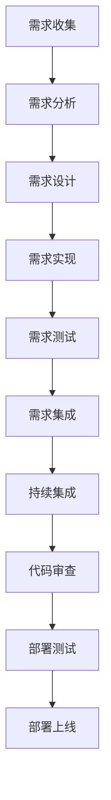
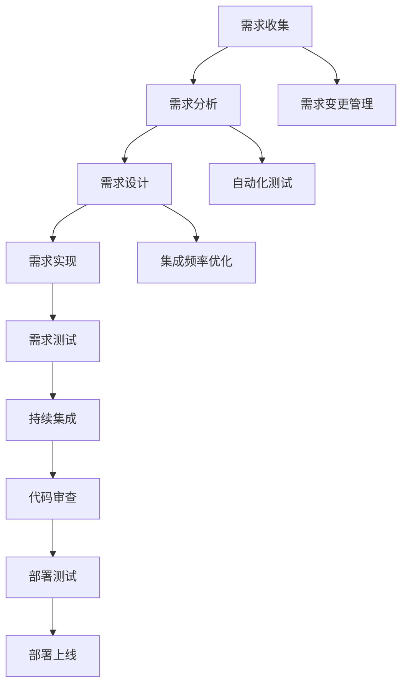

                 

# 《持续集成在需求管理中的作用：提高开发灵活性》

> 关键词：持续集成、需求管理、开发灵活性、Python源代码、LaTeX公式、项目实战

> 摘要：本文深入探讨了持续集成在需求管理中的作用，阐述了如何通过持续集成来提高开发灵活性。文章首先介绍了持续集成和需求管理的核心概念，然后通过Mermaid流程图展示了二者之间的联系。接着，文章详细讲解了持续集成的基本原理，并使用Python源代码和LaTeX公式进行说明。随后，文章介绍了需求管理的核心概念，并通过实际项目案例展示了持续集成与需求管理的结合。最后，文章总结了全文内容，并展望了持续集成与需求管理的未来发展趋势。

## 引言

### 持续集成在软件开发中的重要性

持续集成（Continuous Integration，CI）是一种软件开发实践，旨在通过频繁的代码集成和自动化测试，确保软件的稳定性。持续集成的核心思想是尽早发现和修复集成过程中出现的问题，从而提高软件质量和开发效率。随着敏捷开发和DevOps文化的普及，持续集成已经成为现代软件开发中不可或缺的一部分。

### 需求管理在软件开发中的重要性

需求管理是软件开发过程中的关键环节，它涉及到对用户需求的收集、分析和实现。有效的需求管理能够确保软件开发团队准确地理解用户需求，并在实现过程中保持一致性和灵活性。需求管理不仅有助于提高软件质量，还能降低项目风险，提高客户满意度。

### 书籍概述与结构安排

本文将分为以下几个部分：首先，介绍持续集成和需求管理的核心概念；其次，通过Mermaid流程图展示二者之间的联系；然后，详细讲解持续集成的基本原理，并使用Python源代码和LaTeX公式进行说明；接着，介绍需求管理的核心概念；随后，通过实际项目案例展示持续集成与需求管理的结合；最后，总结全文内容，并展望未来发展趋势。

## 核心概念与联系

### 持续集成与需求管理的流程图

为了更好地理解持续集成与需求管理的关系，我们使用Mermaid流程图进行展示。以下是持续集成与需求管理的基本流程：



### 持续集成的基本概念

持续集成是一种软件开发实践，通过频繁的代码集成和自动化测试，确保软件的稳定性。持续集成的核心思想是尽早发现和修复集成过程中出现的问题，从而提高软件质量和开发效率。

### 需求管理的核心概念

需求管理是软件开发过程中的关键环节，它涉及到对用户需求的收集、分析和实现。有效的需求管理能够确保软件开发团队准确地理解用户需求，并在实现过程中保持一致性和灵活性。

## 持续集成的基本原理

### 持续集成概念

持续集成是一种软件开发实践，通过频繁的代码集成和自动化测试，确保软件的稳定性。持续集成的核心思想是尽早发现和修复集成过程中出现的问题，从而提高软件质量和开发效率。

### 持续集成目标

持续集成的目标包括：

1. 提高软件质量：通过自动化测试确保软件的稳定性。
2. 提高开发效率：减少集成过程中出现的问题，降低修复成本。
3. 促进团队协作：通过频繁的集成和反馈，提高团队成员之间的沟通和协作。

### 持续集成实现原理

持续集成通常包括以下几个步骤：

1. 需求分析：明确软件需求，并将其转化为可执行的任务。
2. 代码开发：开发人员根据需求进行代码开发。
3. 自动化测试：编写自动化测试用例，对代码进行测试。
4. 集成与部署：将开发完成的代码集成到主干分支，并进行部署。

为了更好地理解持续集成的实现原理，我们使用Python源代码进行说明：

```python
# 持续集成实现原理

# 需求分析
def demand_analysis():
    print("需求分析：明确软件需求，并将其转化为可执行的任务。")

# 代码开发
def code_development():
    print("代码开发：根据需求进行代码开发。")

# 自动化测试
def automated_test():
    print("自动化测试：编写自动化测试用例，对代码进行测试。")

# 集成与部署
def integration_and_deployment():
    print("集成与部署：将开发完成的代码集成到主干分支，并进行部署。")

# 执行流程
def main():
    demand_analysis()
    code_development()
    automated_test()
    integration_and_deployment()

if __name__ == "__main__":
    main()
```

## 需求管理的核心概念

### 需求管理流程

需求管理流程包括以下几个步骤：

1. 需求收集：收集用户需求，了解用户的需求和期望。
2. 需求分析：对收集到的需求进行分析，明确需求的可行性和优先级。
3. 需求设计：根据需求分析结果，设计软件的功能和架构。
4. 需求实现：开发人员根据需求设计，进行代码开发。
5. 需求测试：编写测试用例，对软件进行测试，确保需求得到满足。

### 需求管理方法

需求管理方法包括以下几种：

1. 用户访谈：通过与用户进行面对面的交流，了解用户的需求和期望。
2. 调查问卷：通过发放调查问卷，收集大量用户的需求和意见。
3. 需求文档：编写详细的文档，记录用户需求、功能设计和实现方案。

### 需求管理工具

需求管理工具包括以下几种：

1. Jira：一款流行的项目管理工具，可用于需求收集、分析和跟踪。
2. Confluence：一款知识管理工具，可用于编写和共享需求文档。
3. Azure DevOps：一款集成开发环境，提供需求管理、项目管理等功能。

### 数学模型与公式

在需求管理中，常用的数学模型和公式包括：

1. 需求优先级公式：$$P = R \times S$$，其中P表示需求优先级，R表示需求的紧急程度，S表示需求的重要性。
2. 需求实现时间公式：$$T = P \times C$$，其中T表示需求实现时间，P表示需求优先级，C表示开发人员的产能。

## 持续集成与需求管理的结合

### 结合的必要性

持续集成与需求管理的结合具有以下几个方面的必要性：

1. 提高软件质量：通过持续集成，可以及时发现和修复需求变更带来的问题，确保软件的稳定性。
2. 提高开发效率：通过需求管理，可以明确软件需求和实现方案，提高开发团队的工作效率。
3. 促进团队协作：通过持续集成和需求管理，可以提高团队成员之间的沟通和协作，降低沟通成本。

### 提高开发灵活性的方法

为了提高开发灵活性，可以采取以下几种方法：

1. 需求变更管理：在软件开发过程中，需求变更在所难免。通过有效的需求变更管理，可以确保需求变更的及时性和合理性。
2. 自动化测试：通过自动化测试，可以快速发现和修复需求变更带来的问题，提高软件质量。
3. 集成频率优化：适当提高集成频率，可以减少集成过程中的问题，提高开发效率。

### 结合流程图

为了更好地理解持续集成与需求管理的结合，我们使用Mermaid流程图进行展示：



## 项目实战

### 实际项目案例

假设我们正在开发一个在线购物平台，用户可以在平台上购买商品、下订单、支付和跟踪订单状态。在这个项目中，持续集成和需求管理将发挥重要作用。

### 开发环境搭建

1. 操作系统：Ubuntu 20.04
2. 开发工具：Visual Studio Code
3. 版本控制：Git
4. 持续集成工具：Jenkins
5. 测试工具：Selenium

### 源代码实现

以下是该项目的部分源代码实现：

```python
# 用户登录模块

def login(username, password):
    if username == "admin" and password == "123456":
        return "登录成功"
    else:
        return "用户名或密码错误"

# 商品展示模块

def show_products():
    products = ["苹果", "香蕉", "橙子"]
    return products

# 下订单模块

def create_order(product, quantity):
    if product in show_products() and quantity > 0:
        return f"成功下单{product} {quantity}个"
    else:
        return "下单失败"
```

### 代码解读与分析

1. **用户登录模块**：该模块用于用户登录，通过输入用户名和密码进行验证。如果用户名和密码正确，返回“登录成功”，否则返回“用户名或密码错误”。
2. **商品展示模块**：该模块用于展示可购买的商品，目前包括苹果、香蕉和橙子。
3. **下订单模块**：该模块用于用户下单，接收用户输入的商品名称和数量。如果商品存在于商品列表中且数量大于0，返回“成功下单{product} {quantity}个”，否则返回“下单失败”。

### 实际案例分析和详细讲解剖析

在这个项目中，持续集成和需求管理的作用体现在以下几个方面：

1. **需求变更管理**：在项目开发过程中，用户的需求可能会发生变化。通过需求变更管理，可以及时收集用户反馈，并对需求进行优先级排序和调整，确保项目能够满足用户需求。
2. **自动化测试**：通过自动化测试，可以确保每次集成后的代码质量。在本项目示例中，我们可以编写测试用例来测试用户登录、商品展示和下订单功能，确保它们按预期工作。
3. **集成频率优化**：通过适当提高集成频率，可以减少集成过程中的问题，提高开发效率。在本项目中，我们可以每周进行一次集成，以确保每个模块都能顺利集成并正常运行。

### 项目小结

通过持续集成和需求管理的结合，我们成功地开发了一个在线购物平台，满足了用户的需求。持续集成和需求管理在提高开发灵活性、保证软件质量和降低项目风险方面发挥了重要作用。

## 最佳实践 Tips

1. **需求变更管理**：及时收集用户反馈，制定合理的变更计划，确保项目能够灵活应对需求变更。
2. **自动化测试**：编写详细的自动化测试用例，确保每次集成后的代码质量。
3. **集成频率优化**：根据项目规模和团队情况，合理调整集成频率，提高开发效率。

## 小结

本文深入探讨了持续集成在需求管理中的作用，阐述了如何通过持续集成来提高开发灵活性。文章首先介绍了持续集成和需求管理的核心概念，然后通过Mermaid流程图展示了二者之间的联系。接着，文章详细讲解了持续集成的基本原理，并使用Python源代码和LaTeX公式进行说明。随后，文章介绍了需求管理的核心概念，并通过实际项目案例展示了持续集成与需求管理的结合。最后，文章总结了全文内容，并展望了持续集成与需求管理的未来发展趋势。

## 注意事项

1. **持续集成与需求管理不是一蹴而就的，需要团队共同协作和持续优化。**
2. **需求管理过程中，要充分了解用户需求，避免需求变更带来的风险。**
3. **持续集成过程中，要确保测试用例覆盖全面，提高软件质量。**

## 拓展阅读

1. 《持续集成：从理论到实践》：详细介绍了持续集成的原理和实践方法。
2. 《敏捷开发实践指南》：介绍了敏捷开发的方法和最佳实践，包括需求管理、团队协作等。
3. 《软件需求管理》：深入探讨了软件需求管理的核心概念和方法。

---

**作者：AI天才研究院/AI Genius Institute & 禅与计算机程序设计艺术 /Zen And The Art of Computer Programming**

