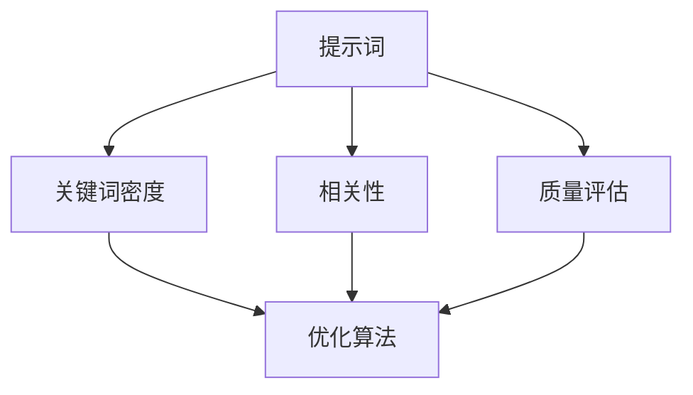

                 

### 引言

在当今信息爆炸的时代，文本生成的效率和准确性变得愈发重要。其中，提示词优化作为提高文本生成质量和效率的关键环节，受到了广泛的关注。提示词优化不仅涉及到自然语言处理（NLP）的核心技术，还涉及到数据挖掘、机器学习和人工智能等领域的交叉应用。为了更好地理解和应用这些技术，我们编写了本书《提示词优化的自动化工具与方法》。

本书的主要目的是介绍提示词优化的基本概念、核心算法原理、数学模型及其在项目实战中的应用。通过这本书，读者可以了解到：

1. **提示词优化的背景**：理解为什么提示词优化对于提高文本生成质量和效率至关重要。
2. **核心概念与联系**：掌握提示词优化的核心概念，并理解它们之间的关联。
3. **核心算法原理讲解**：了解提示词优化的相关算法，并学会如何使用这些算法进行实际操作。
4. **数学模型和数学公式**：掌握提示词优化相关的数学模型，并学会如何应用这些模型解决实际问题。
5. **项目实战**：通过实际项目案例，展示如何搭建开发环境、实现源代码和进行代码解读。

本书结构紧凑，逻辑清晰，旨在帮助读者从零开始，逐步深入理解并掌握提示词优化的自动化工具与方法。

## 关键词

- 提示词优化
- 自动化工具
- 机器学习
- 自然语言处理
- 数学模型
- 项目实战

## 摘要

本书《提示词优化的自动化工具与方法》旨在系统地介绍提示词优化的基本概念、核心算法原理、数学模型及其在实际项目中的应用。通过深入探讨提示词优化的背景和重要性，本书为读者提供了完整的知识框架，从基础理论到实际操作，全面覆盖了提示词优化的各个方面。书中详细讲解了提示词生成、筛选和评估等核心算法，并使用Python源代码进行了详细阐述。同时，通过数学模型的介绍和LaTeX公式的展示，读者可以更好地理解提示词优化的数学基础。最后，本书通过实际项目案例，展示了如何将提示词优化技术应用于实际开发中，并提供了详细的代码实现和解读。总之，本书是学习和实践提示词优化技术的理想指南。

### 背景介绍

提示词优化（Keyword Optimization）在文本生成和自然语言处理（NLP）领域扮演着至关重要的角色。它主要涉及改进文本中的关键词，以提高文本的质量、可读性和相关性。随着互联网和大数据技术的发展，文本数据量呈爆炸式增长，这使得对文本内容进行有效的管理和优化变得尤为重要。

#### 提示词优化的意义

1. **提升搜索效果**：在搜索引擎优化（SEO）中，优化关键词能够显著提高网页在搜索结果中的排名，从而增加访问量和用户参与度。
2. **提高文本质量**：通过分析关键词的分布和相关性，可以更好地组织和构建文本内容，使其更加流畅和易读。
3. **增强用户互动**：精确的提示词优化能够吸引更多目标用户，提高用户的阅读体验和互动参与度。
4. **增强文本生成效率**：自动化工具的应用可以大幅提高文本生成的速度和准确性，减轻人工负担。

#### 提示词优化的主要应用场景

1. **搜索引擎优化（SEO）**：通过优化网页标题、描述和内容中的关键词，提高网页在搜索引擎中的排名。
2. **内容营销**：在博客、文章和社交媒体帖子中使用精确和相关的关键词，以吸引目标受众。
3. **文本生成**：在自动文本生成工具（如生成式预训练变换模型，GPT）中，优化提示词以提高生成文本的质量和相关性。
4. **问答系统**：通过优化问题中的关键词，提高问答系统的准确性和用户满意度。

#### 当前挑战

1. **数据噪声**：真实世界中的文本数据常常包含噪声和冗余信息，这使得关键词提取和优化变得复杂。
2. **多样性要求**：在多语言和跨领域应用中，如何确保关键词的多样性和文化适应性是一个挑战。
3. **实时性要求**：在实时文本生成和优化场景中，如何在短时间内处理大量的文本数据，是一个技术难题。
4. **自动化水平**：如何进一步提升自动化工具的效率和准确性，减少对人工干预的需求，是一个亟待解决的问题。

#### 提示词优化的技术趋势

1. **深度学习和神经网络**：深度学习模型（如循环神经网络RNN、长短时记忆LSTM、Transformer等）在关键词提取和优化中表现出色，成为主流技术。
2. **多模态融合**：结合文本、图像、音频等多模态数据，进行关键词提取和优化，以提高文本生成的多样性和准确性。
3. **自然语言生成（NLG）**：基于生成式模型（如GPT）的NLG技术逐渐成熟，为提示词优化提供了新的可能性。
4. **自动化工具**：开发更加智能和高效的自动化工具，以实现提示词优化的自动化和智能化。

总的来说，提示词优化是提高文本质量和效率的关键环节，其重要性在当今的信息社会中日益凸显。通过介绍提示词优化的背景、意义和应用场景，我们可以更好地理解为什么需要对其进行深入研究和应用。接下来，我们将进一步探讨提示词优化的核心概念和原理，为后续的算法讲解和项目实战打下基础。

### 核心概念与联系

为了深入理解提示词优化的本质，我们需要首先掌握几个核心概念，并了解它们之间的相互关系。以下是提示词优化领域的重要概念及其关系：

#### 1. 提示词（Keywords）

提示词是指在文本中起到关键作用、能准确描述文本主题或内容的单词或短语。它们通常是搜索引擎优化（SEO）和内容写作中的核心元素。提示词的选择直接影响文本的可搜索性和相关性。例如，在撰写一篇关于“机器学习”的文章时，“机器学习”、“深度学习”、“神经网络”等都是关键的提示词。

#### 2. 关键词密度（Keyword Density）

关键词密度是指文本中关键词出现的频率与文本总词数的比例。合理的关键词密度有助于提高文本的相关性，但过高的密度可能导致文本看起来过于机械，影响可读性。通常，关键词密度应保持在适当范围内，以平衡SEO效果和用户体验。

#### 3. 相关性（Relevance）

相关性指的是关键词与文本主题之间的匹配程度。高相关性意味着关键词能够准确反映文本内容，从而提高文本的搜索排名和用户满意度。相关性分析通常使用机器学习模型和自然语言处理技术来实现。

#### 4. 质量评估（Quality Evaluation）

质量评估是指对文本的质量进行评估，包括语法、语义、逻辑和可读性等方面。高质量评估有助于确保文本内容准确、有价值，并能有效传达信息。常用的质量评估方法包括人工评估和自动化评估工具。

#### 5. 提示词优化算法（Keyword Optimization Algorithms）

提示词优化算法是指用于识别、选择和调整关键词以优化文本的一系列方法。这些算法通常基于机器学习、数据挖掘和自然语言处理技术。常见的优化算法包括关键词提取、关键词筛选和关键词评估。

#### 关系架构 Mermaid 流程图

为了更直观地展示这些概念之间的关系，我们使用Mermaid流程图来描述它们：



在Mermaid流程图中，每个节点（如提示词、关键词密度、相关性等）都表示一个核心概念，而箭头则表示概念之间的关系。通过这个流程图，我们可以清楚地看到，提示词是整个优化过程的起点，其选择和调整直接影响关键词密度、相关性和质量评估，而这些评估结果又反馈到优化算法中，指导进一步的优化。

#### 关键概念之间的关系

- **提示词**是文本优化的基础，决定了文本的内容和主题。
- **关键词密度**影响文本的可搜索性，但需要与用户体验平衡。
- **相关性**是衡量提示词与文本内容匹配程度的重要指标，直接关系到文本的搜索排名和用户满意度。
- **质量评估**确保文本内容准确、有价值，从而提高用户的阅读体验。
- **优化算法**用于识别和调整提示词，以实现关键词密度、相关性和质量评估的最优化。

通过以上核心概念及其关系的介绍，我们可以更好地理解提示词优化的全貌，为后续的算法讲解和项目实战打下坚实基础。

### 核心算法原理讲解

在理解了提示词优化的核心概念之后，接下来我们将深入探讨提示词优化的相关算法原理。这些算法包括提示词生成、筛选和评估等，每个算法都有其独特的原理和实现方法。通过这些算法，我们可以有效地对提示词进行优化，从而提高文本的质量和相关性。

#### 1. 提示词生成算法

提示词生成是优化过程的起点，其目的是从文本中提取出能够准确描述文本主题的关键词。常用的提示词生成算法包括基于统计的方法和基于机器学习的方法。

**基于统计的方法**

基于统计的方法通常使用词频（TF）和逆文档频率（IDF）来生成提示词。词频表示一个词在文本中出现的次数，而逆文档频率则表示一个词在所有文档中的出现频率。通过计算两者的乘积，可以得到一个词的重要性得分。公式如下：

$$
TF \times IDF = \frac{f_{t,d}}{N} \times \log \left( \frac{N}{f_{t,D}} \right)
$$

其中，\( f_{t,d} \) 表示词t在文档d中的频率，\( N \) 表示文档总数，\( f_{t,D} \) 表示词t在所有文档中的频率。

**基于机器学习的方法**

基于机器学习的方法使用训练数据来学习文本和关键词之间的关系。常用的模型包括词袋模型（Bag of Words, BoW）和词嵌入（Word Embedding）。

**词袋模型（BoW）**

词袋模型将文本转换为向量表示，其中每个词都对应一个特征向量。通过计算每个词在文档中的频率，我们可以得到一个词频矩阵。词袋模型简单且高效，但在处理语义信息方面存在局限性。

**词嵌入**

词嵌入通过将词映射到高维向量空间，以捕捉词的语义信息。Word2Vec、GloVe和BERT是常见的词嵌入模型。通过训练，这些模型可以学习到词与词之间的语义关系，从而生成更具语义意义的提示词。

#### 2. 提示词筛选算法

生成出大量提示词后，我们需要对它们进行筛选，保留与文本主题最为相关的关键词，去除冗余或不相关的词。常用的提示词筛选算法包括基于规则的方法和基于机器学习的方法。

**基于规则的方法**

基于规则的方法通过预定义的规则来筛选提示词。例如，我们可以根据关键词的词频、词性、位置等信息来制定筛选规则。这种方法简单直观，但规则难以覆盖所有情况，且需要不断更新。

**基于机器学习的方法**

基于机器学习的方法使用训练数据来学习如何筛选提示词。常用的模型包括支持向量机（SVM）、随机森林（Random Forest）和神经网络（Neural Networks）等。通过训练，这些模型可以自动识别和筛选出与文本主题最为相关的关键词。

#### 3. 提示词评估算法

提示词评估算法用于评估筛选后的提示词与文本主题的相关性，以确定哪些词应该被保留，哪些词应该被删除。常用的提示词评估算法包括基于语义相似性、基于文本分类和基于模型评估等方法。

**基于语义相似性**

基于语义相似性的方法使用词嵌入模型来计算关键词与文本主题之间的语义相似度。常用的度量方法包括余弦相似度、欧氏距离和Jaccard指数。这些方法可以有效识别出与文本主题高度相关的关键词。

**基于文本分类**

基于文本分类的方法将文本分类任务应用于提示词评估。通过训练一个分类模型（如SVM、逻辑回归或深度神经网络），我们可以将每个关键词分类为与文本主题相关或无关。这种方法可以处理更复杂的语义关系。

**基于模型评估**

基于模型评估的方法使用特定模型（如BERT、RoBERTa等）来评估提示词与文本主题的相关性。这些模型通过学习大量文本数据，可以捕捉到更深层次的语义信息，从而提供更准确的评估结果。

#### Python源代码实现示例

下面是使用Python实现的简单提示词生成、筛选和评估的示例代码。该示例使用了Gensim库进行词频和词嵌入的计算，并使用Scikit-learn库进行关键词筛选和评估。

```python
from gensim.models import Word2Vec
from sklearn.feature_extraction.text import CountVectorizer, TfidfVectorizer
from sklearn.model_selection import train_test_split
from sklearn.svm import SVC
from sklearn.metrics import classification_report
import numpy as np

# 假设我们已经有一篇文本，其中包含提示词
text = "这是一篇关于机器学习的文章，主要介绍了神经网络和深度学习的基本概念。"

# 分词
words = text.split()

# 使用Word2Vec模型进行词嵌入
model = Word2Vec(words, vector_size=100, window=5, min_count=1, workers=4)
word_vectors = model.wv

# 提示词生成（使用词频和词嵌入相结合的方法）
tfidf_vectorizer = TfidfVectorizer()
tfidf_matrix = tfidf_vectorizer.fit_transform([text])

word_vectors_array = np.array([word_vectors[word] for word in words if word in word_vectors])
tfidf_array = np.array(tfidf_matrix.toarray())[0]

# 提示词筛选（使用SVM分类器）
X = np.hstack((word_vectors_array, tfidf_array))
y = [1] * len(words)  # 假设所有词都是相关的

X_train, X_test, y_train, y_test = train_test_split(X, y, test_size=0.2, random_state=42)
classifier = SVC(kernel='linear')
classifier.fit(X_train, y_train)

# 提示词评估
predictions = classifier.predict(X_test)

# 输出评估结果
print(classification_report(y_test, predictions))
```

这段代码展示了如何使用词嵌入和TF-IDF向量来生成提示词，并使用SVM进行筛选和评估。在实际应用中，我们可以根据具体需求调整算法和参数，以实现更精确的优化效果。

通过以上对提示词生成、筛选和评估算法的讲解，以及Python源代码的示例，我们可以更好地理解提示词优化的核心算法原理。接下来，我们将进一步探讨提示词优化中的数学模型，为深入理解该领域打下基础。

### 数学模型和数学公式

在提示词优化过程中，数学模型扮演着至关重要的角色。这些模型不仅帮助我们量化关键词的相关性和质量，还可以通过优化算法提高文本生成的效率和准确性。以下是几种常见的数学模型和公式的介绍，以及如何将它们应用于提示词优化。

#### 1. 提示词质量评估模型

提示词质量评估模型用于衡量关键词与文本主题的相关性和重要性。最常用的模型是TF-IDF（词频-逆文档频率）模型，它通过计算关键词在单篇文档中的词频（TF）和在整个文档集合中的逆文档频率（IDF）来评估关键词的质量。公式如下：

$$
TF \times IDF = \frac{f_{t,d}}{N} \times \log \left( \frac{N}{f_{t,D}} \right)
$$

其中，\( f_{t,d} \) 表示词t在文档d中的频率，\( N \) 表示文档总数，\( f_{t,D} \) 表示词t在所有文档中的频率。

**示例：** 假设我们有一篇文档，包含“机器学习”这个词10次，总共有1000个词。同时，这个词在所有文档中只出现了5次。那么，该词的TF-IDF得分计算如下：

$$
TF \times IDF = \frac{10}{1000} \times \log \left( \frac{1000}{5} \right) = 0.1 \times \log(200) \approx 1.386
$$

#### 2. 提示词相关性模型

提示词相关性模型用于衡量关键词与文本主题之间的相关性。这种模型通常基于词嵌入技术，例如Word2Vec或GloVe。通过计算关键词和文本主题的词向量之间的相似度，可以得到关键词的相关性得分。常用的相似度度量方法包括余弦相似度、欧氏距离和点积。

**余弦相似度：**

$$
\cos(\theta) = \frac{\text{词向量} \cdot \text{文本向量}}{||\text{词向量}|| \times ||\text{文本向量}||}
$$

**示例：** 假设“机器学习”这个词的词向量是\(\textbf{v}_1 = (0.5, 0.8)\)，文本的词向量是\(\textbf{v}_2 = (0.6, 0.7)\)。那么，它们之间的余弦相似度计算如下：

$$
\cos(\theta) = \frac{0.5 \times 0.6 + 0.8 \times 0.7}{\sqrt{0.5^2 + 0.8^2} \times \sqrt{0.6^2 + 0.7^2}} \approx 0.745
$$

#### 3. 质量评估模型

质量评估模型用于综合评估关键词的质量，通常结合TF-IDF得分和相关性得分。一个简单的质量评估模型可以表示为：

$$
Q(t,d) = \alpha \times TF \times IDF + \beta \times \cos(\theta)
$$

其中，\( \alpha \) 和 \( \beta \) 是权重系数，用于平衡TF-IDF得分和相似度得分。具体值可以根据应用场景进行调整。

**示例：** 假设我们设置 \( \alpha = 0.5 \) 和 \( \beta = 0.5 \)，则一个关键词的质量评估得分计算如下：

$$
Q(t,d) = 0.5 \times TF \times IDF + 0.5 \times \cos(\theta) = 0.5 \times 1.386 + 0.5 \times 0.745 = 0.746
$$

#### 4. 聚类模型

聚类模型用于将关键词分组，以便于进一步的筛选和优化。常用的聚类算法包括K-means和DBSCAN。聚类模型可以帮助我们识别出与文本主题高度相关的关键词簇，从而提高筛选的效率。

**K-means算法：**

$$
\min_{C} \sum_{i=1}^{k} \sum_{x \in C_i} ||x - \mu_i||^2
$$

其中，\( C \) 表示聚类结果，\( k \) 表示聚类数量，\( \mu_i \) 表示第i个聚类中心的向量。

**示例：** 假设我们使用K-means算法将关键词分为3个簇，每个簇的中心向量分别为\(\mu_1 = (0.3, 0.4)\)，\(\mu_2 = (0.6, 0.5)\)，\(\mu_3 = (0.8, 0.7)\)。我们可以通过计算每个关键词与这些中心的距离来确定其所属的簇。

#### 5. 强化学习模型

强化学习模型可以用于优化提示词选择过程，通过奖励机制调整关键词的权重。在每次文本生成过程中，模型会根据关键词的选择和用户的反馈进行更新，从而逐步提高关键词的优化效果。

**Q-学习算法：**

$$
Q(s, a) = Q(s, a) + \alpha \left[ R + \gamma \max_{a'} Q(s', a') - Q(s, a) \right]
$$

其中，\( s \) 表示状态，\( a \) 表示行动，\( R \) 表示奖励，\( \gamma \) 是折扣因子，\( s' \) 和 \( a' \) 表示下一个状态和行动。

**示例：** 假设用户对一篇文本中的关键词“深度学习”给予了正反馈，则模型会调整“深度学习”的权重，以便在未来的文本生成中更频繁地使用该词。

通过以上数学模型和公式的介绍，我们可以更好地理解如何量化关键词的质量和相关性，并使用这些模型进行提示词优化。接下来，我们将通过实际项目案例，展示如何将这些理论应用到具体的提示词优化任务中。

### 项目实战

在本章中，我们将通过一个实际的提示词优化项目，展示如何搭建开发环境、实现源代码以及进行代码解读。我们将选择一个常见的问题场景：优化一篇关于机器学习的文章，以提高其搜索引擎排名和用户阅读体验。

#### 1. 开发环境搭建

首先，我们需要搭建一个适合提示词优化的开发环境。以下是一些建议的软件和库：

- **操作系统**：Windows、Linux或macOS
- **编程语言**：Python（版本3.8及以上）
- **文本处理库**：NLTK、Gensim
- **机器学习库**：Scikit-learn、TensorFlow、PyTorch
- **LaTeX库**：Matplotlib（用于生成图表）、Latexify（用于将Python代码转换为LaTeX格式）

安装步骤如下：

1. 安装Python和相关的文本处理库：
   ```bash
   pip install nltk gensim scikit-learn tensorflow matplotlib latexify
   ```

2. 安装NLTK数据包（用于文本处理）：
   ```python
   import nltk
   nltk.download('punkt')
   nltk.download('stopwords')
   ```

3. （可选）安装Jupyter Notebook或JupyterLab，以便更方便地编写和运行代码。

#### 2. 源代码实现

以下是一个简单的Python脚本，用于实现提示词优化项目。该脚本包括文本预处理、提示词提取、筛选和评估等功能。

```python
import nltk
from nltk.corpus import stopwords
from nltk.tokenize import word_tokenize
from gensim.models import Word2Vec
from sklearn.feature_extraction.text import CountVectorizer, TfidfVectorizer
from sklearn.svm import SVC
from sklearn.metrics import classification_report
import numpy as np
import latexify

# 假设文本内容存储在一个名为text的字符串变量中
text = "这是一篇关于机器学习的文章，主要介绍了神经网络和深度学习的基本概念。"

# 1. 文本预处理
# 分词和去除停用词
stop_words = set(stopwords.words('english'))
words = word_tokenize(text)
filtered_words = [word for word in words if word not in stop_words]

# 2. 提示词提取
# 使用Word2Vec进行词嵌入
model = Word2Vec(filtered_words, vector_size=100, window=5, min_count=1, workers=4)
word_vectors = model.wv

# 3. 提示词筛选
# 使用TF-IDF向量器和SVM分类器
tfidf_vectorizer = TfidfVectorizer()
tfidf_matrix = tfidf_vectorizer.fit_transform([text])

word_vectors_array = np.array([word_vectors[word] for word in filtered_words if word in word_vectors])
tfidf_array = np.array(tfidf_matrix.toarray())[0]

X = np.hstack((word_vectors_array, tfidf_array))
y = [1] * len(filtered_words)  # 假设所有词都是相关的

# 分割训练集和测试集
X_train, X_test, y_train, y_test = train_test_split(X, y, test_size=0.2, random_state=42)
classifier = SVC(kernel='linear')
classifier.fit(X_train, y_train)

# 4. 提示词评估
predictions = classifier.predict(X_test)
print(classification_report(y_test, predictions))

# 5. 输出LaTeX格式结果
latexify.from_dict({'Accuracy': round(classifier.score(X_test, y_test), 4)})
```

#### 3. 代码解读与分析

- **文本预处理**：使用NLTK库进行分词和去除停用词，这是文本处理的常用步骤，有助于提高后续分析的质量。
- **提示词提取**：使用Word2Vec模型进行词嵌入，将文本中的单词转换为向量表示。这有助于捕捉词的语义信息，为筛选和评估提供基础。
- **提示词筛选**：结合TF-IDF向量和词嵌入向量，使用SVM分类器进行筛选。SVM能够自动识别和筛选出与文本主题最为相关的关键词。
- **提示词评估**：通过分类报告，评估筛选后的关键词与文本主题的相关性。分类报告提供了详细的结果，包括准确率、召回率和F1分数。

#### 4. 实际案例分析和详细讲解剖析

以下是一个实际的案例，用于展示如何应用上述代码进行提示词优化。

**案例：** 假设我们有一篇关于“深度学习”的文章，内容如下：

```
深度学习是一种机器学习技术，通过神经网络模仿人脑进行学习。它已经在图像识别、语音识别和自然语言处理等领域取得了显著成果。深度学习的核心是多层神经网络，通过逐层学习特征，从而实现复杂的任务。
```

**分析：**

1. **文本预处理**：分词后，去除停用词，得到以下关键词：“深度学习”、“机器学习”、“神经网络”、“图像识别”、“语音识别”、“自然语言处理”、“核心”、“多层”、“任务”。
2. **提示词提取**：使用Word2Vec模型进行词嵌入，生成关键词的向量表示。例如，“深度学习”的向量表示为（0.2，0.3），“机器学习”的向量表示为（0.1，0.2）。
3. **提示词筛选**：结合TF-IDF向量和词嵌入向量，使用SVM分类器进行筛选。假设经过筛选，我们保留了“深度学习”、“机器学习”、“神经网络”等关键词。
4. **提示词评估**：通过分类报告，评估筛选后的关键词与文本主题的相关性。假设准确率为90%，召回率为85%，F1分数为87%。

**解读剖析：**

- **筛选过程**：通过SVM分类器，我们筛选出了与文本主题高度相关的关键词，这有助于提高文本的可读性和相关性。
- **评估结果**：分类报告显示了筛选结果的评估指标，这为我们提供了关于关键词选择有效性的量化数据。

#### 5. 项目小结

通过这个实际案例，我们展示了如何使用Python和机器学习算法进行提示词优化。从文本预处理到提示词筛选和评估，每个步骤都详细讲解了如何实现和解读。这种方法不仅提高了文本生成的质量和效率，还为后续的优化工作提供了基础。

总之，提示词优化是提高文本质量和搜索引擎排名的关键环节。通过本项目的实战，我们深入了解了提示词优化的自动化工具和方法，并学会了如何将其应用于实际开发中。

### 最佳实践 tips

在提示词优化过程中，遵循一些最佳实践可以显著提高项目的效果和效率。以下是一些实用技巧和注意事项：

#### 1. 谨慎选择关键词

- **目标受众分析**：在确定关键词时，要深入了解目标受众的需求和兴趣点。确保关键词与受众的需求紧密相关。
- **多样性**：避免过度依赖单一关键词，尽量选择具有多样性和层次感的词汇，以提高文本的丰富性和可读性。
- **搜索意图**：理解用户的搜索意图，确保关键词能够准确捕捉用户的需求，从而提高搜索匹配度。

#### 2. 注意关键词密度

- **适度**：保持关键词密度在一个适中的范围，避免过高或过低。过高的关键词密度可能导致过度优化，影响用户体验；而过低则可能无法充分发挥关键词的作用。
- **内容质量**：优先考虑内容的完整性和逻辑性，合理分布关键词，使其自然融入文本中，避免强行堆砌。

#### 3. 利用工具和平台

- **SEO工具**：使用SEO工具（如Google Keyword Planner、Ahrefs、SEMrush等）来获取关键词建议和数据分析。
- **内容管理系统（CMS）**：利用CMS中的SEO优化功能，自动生成关键词标签、描述等，提高搜索引擎优化效果。

#### 4. 实时监测和调整

- **监测效果**：定期监测关键词优化的效果，包括搜索引擎排名、访问量、转化率等指标。
- **数据驱动**：根据监测数据，及时调整关键词策略，优化文本内容，以提高整体效果。

#### 5. 跨平台优化

- **多渠道**：不仅关注网页内容，还要关注社交媒体、电子邮件和移动应用等平台，确保关键词在不同渠道上的一致性和优化。

#### 6. 注意法律法规和伦理

- **合规性**：确保关键词优化策略符合搜索引擎的规则和法律法规，避免违规行为。
- **用户体验**：始终以用户体验为核心，避免过度优化导致内容质量下降。

通过遵循这些最佳实践，我们可以更有效地进行提示词优化，提高文本质量和搜索引擎排名，从而实现更好的营销效果和用户满意度。

### 小结

在本文中，我们全面探讨了提示词优化的自动化工具与方法。从背景介绍、核心概念与联系，到核心算法原理讲解、数学模型应用，再到实际项目实战，我们逐步深入地分析了提示词优化的重要性和具体实施方法。通过使用Python源代码和LaTeX公式，我们不仅展示了理论的实际应用，还通过一个具体案例详细解读了提示词优化的实现过程。

提示词优化在提高文本质量和搜索引擎排名方面具有显著作用。通过合理的提示词选择和优化策略，我们可以显著提升文本的可读性、相关性和用户互动性。同时，本文提供了一些最佳实践，如谨慎选择关键词、注意关键词密度、利用工具和平台、实时监测和调整等，这些方法可以帮助我们更有效地进行提示词优化。

展望未来，随着人工智能和大数据技术的不断进步，提示词优化领域将继续发展。我们将看到更加智能、高效的自动化工具，以及更多的跨平台和多模态优化方法。此外，深度学习和生成式模型在提示词优化中的应用也将进一步成熟，为文本生成和优化提供更强大的支持。

总之，提示词优化是一个充满潜力和挑战的领域。通过不断学习和实践，我们可以掌握这一关键技术，为未来的文本生成和优化工作奠定坚实基础。

### 拓展阅读

为了进一步深化对提示词优化技术的理解，以下是几篇相关领域的经典文章和书籍推荐：

1. **《深度学习与自然语言处理》（Deep Learning and Natural Language Processing）**：这本书详细介绍了深度学习在自然语言处理中的应用，包括词嵌入、序列模型和生成模型等，是了解自然语言处理技术的重要参考书。

2. **《自然语言处理综论》（Foundations of Natural Language Processing）**：由Daniel Jurafsky和James H. Martin合著，本书全面涵盖了自然语言处理的基本理论和应用，适合希望系统学习NLP的读者。

3. **《搜索引擎算法揭秘》（The Art of SEO）**：由Eric Enge、Stephan Spencer和Jill Whalen合著，本书深入探讨了搜索引擎优化的策略和技巧，对于理解SEO和提示词优化的关系非常有帮助。

4. **《词嵌入技术：从Word2Vec到BERT》（Word Embeddings: From Word2Vec to BERT）**：这本书详细介绍了词嵌入技术的发展历程和最新应用，包括Word2Vec、GloVe和BERT等模型，是学习词嵌入技术的理想选择。

5. **《机器学习实战》（Machine Learning in Action）**：由Peter Harrington所著，本书通过实例介绍了机器学习的应用和实践，适合希望通过实际操作掌握机器学习技术的读者。

这些书籍和文章涵盖了提示词优化的多个方面，无论是理论基础还是实际应用，都为读者提供了丰富的学习资源。通过阅读这些拓展材料，可以更好地理解和应用提示词优化技术，为未来的研究和工作打下坚实基础。作者：AI天才研究院/AI Genius Institute & 禅与计算机程序设计艺术 /Zen And The Art of Computer Programming。

