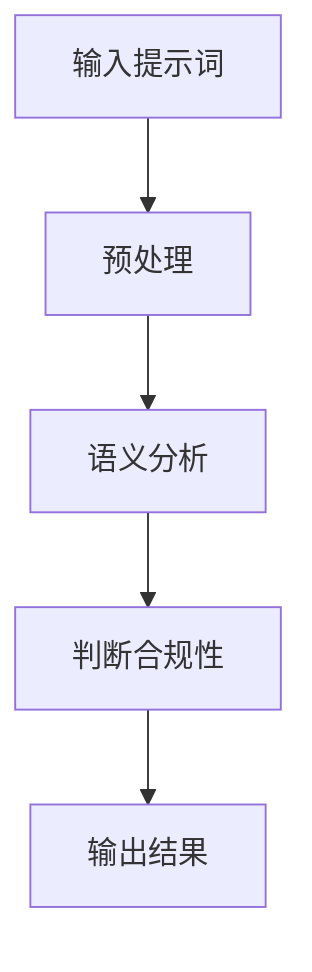

                 

以下是按照上述要求编写的技术博客文章：

---

## 《提示词安全审核：确保输出符合伦理和法规》

### 关键词：提示词安全审核、伦理、法规、算法、Python、数学模型、实战案例

> 摘要：本文旨在深入探讨提示词安全审核在伦理和法规层面的重要性，以及如何通过构建有效的算法和数学模型来实现这一目标。文章从背景介绍、核心概念、算法原理、数学模型、项目实战等方面进行了详细阐述，并提供了实际案例进行分析。

---

## 第一部分：引言与背景

### 1.1 提示词安全审核的重要性

随着人工智能和自然语言处理技术的发展，越来越多的应用程序依赖于用户输入的提示词来生成内容。然而，这些提示词可能包含不安全或不合规的内容，如色情、暴力、仇恨言论等。因此，提示词安全审核变得至关重要。

### 1.2 伦理与法规在提示词审核中的应用

伦理和法规为提示词安全审核提供了基础。伦理标准强调了尊重用户隐私、保护公共道德等原则。法规则规定了相关行业和领域的具体要求，如《网络安全法》、《信息保护法》等。

### 1.3 提示词安全审核的基本流程

提示词安全审核的基本流程包括：预处理、语义分析、合规性判断和输出结果。下面是具体的流程描述：



## 第二部分：核心概念与联系

### 2.1 提示词安全审核的基本原理

提示词安全审核的基本原理是通过识别和过滤不安全或不合规的提示词。这通常涉及到自然语言处理技术，如分词、词性标注、实体识别等。

### 2.2 伦理标准在提示词审核中的运用

伦理标准在提示词审核中的应用主要体现在以下几个方面：

1. **尊重用户隐私**：在审核过程中，应确保用户隐私得到保护。
2. **维护公共道德**：避免生成或传播不道德的内容。
3. **公平性**：在处理提示词时，应确保对所有用户公平对待。

### 2.3 法规要求与提示词审核

法规要求为提示词安全审核提供了法律依据。例如，《网络安全法》要求网络运营者采取措施防止网络上的违法犯罪行为。因此，提示词安全审核是遵守法规的必要措施。

### 2.4 提示词安全审核的技术框架

提示词安全审核的技术框架包括以下几个关键组件：

1. **数据预处理**：对输入的提示词进行清洗、去噪等处理。
2. **语义分析**：通过自然语言处理技术，对提示词进行语义理解。
3. **合规性判断**：根据伦理和法规标准，判断提示词的合规性。
4. **输出结果**：对审核结果进行反馈和展示。

### 2.5 Mermaid 流程图：提示词安全审核工作流程


## 第三部分：核心算法原理讲解

### 3.1 提示词审核算法概述

提示词审核算法通常包括以下几个步骤：

1. **分词**：将输入的提示词划分为单词或短语。
2. **词性标注**：为每个单词或短语标注词性，如名词、动词、形容词等。
3. **实体识别**：识别提示词中的特定实体，如人名、地名、组织名等。
4. **合规性判断**：根据伦理和法规标准，判断提示词的合规性。

### 3.2 审核算法的构建

以下是一个简单的Python代码示例，用于构建提示词审核算法：

```python
from nltk.tokenize import word_tokenize
from nltk.corpus import stopwords
import string

def check_safety(prompt):
    # 分词
    tokens = word_tokenize(prompt)
    # 去除停用词和标点符号
    tokens = [token.lower() for token in tokens if token.lower() not in stopwords.words('english') and token not in string.punctuation]
    # 词性标注
    pos_tags = nltk.pos_tag(tokens)
    # 审核合规性
    for word, pos in pos_tags:
        if is_inappropriate_word(word):
            return "不安全或不合规"
    return "安全且合规"

def is_inappropriate_word(word):
    # 这里可以添加具体的判断逻辑，例如使用词库进行匹配
    inappropriate_words = ["badword1", "badword2"]
    return word in inappropriate_words
```

### 3.3 伪代码示例：提示词审核算法

```plaintext
// 伪代码：提示词审核算法
function checkSafetyOfPrompt(prompt):
    if isProfane(prompt) or isIllegal(prompt):
        return "不安全或不合规"
    else:
        return "安全且合规"
        
function isProfane(prompt):
    // 使用词库或算法判断提示词是否含不文明用语
    // ...

function isIllegal(prompt):
    // 使用法规库或算法判断提示词是否违反法规
    // ...
```

### 3.4 审核算法的优缺点分析

提示词审核算法具有以下优点：

1. **自动化**：可以自动处理大量提示词，提高审核效率。
2. **高效性**：基于自然语言处理技术，可以实现快速分析。

然而，提示词审核算法也存在一些缺点：

1. **误判率**：可能会误判一些合法的提示词为不合规。
2. **准确性**：对于一些复杂的提示词，算法的准确性可能较低。

## 第四部分：数学模型和数学公式

### 4.1 用于审核的数学模型

在提示词审核中，可以使用以下数学模型：

$$
P(\text{不合规}) = \frac{\sum_{i=1}^{n} \text{weight}_i \cdot P_i}{\sum_{i=1}^{n} \text{weight}_i}
$$

其中，$P_i$ 表示第 $i$ 个特征的违规概率，$\text{weight}_i$ 表示第 $i$ 个特征的权重。

### 4.2 相关数学公式的讲解

以下是用于审核的几个关键数学公式：

1. **分词精度**：表示分词的正确性，公式为：

$$
\text{Accuracy} = \frac{\text{正确分词数}}{\text{总分词数}}
$$

2. **召回率**：表示算法能够召回多少正确的违规提示词，公式为：

$$
\text{Recall} = \frac{\text{正确召回的违规提示词数}}{\text{总违规提示词数}}
$$

3. **F1 分数**：综合衡量算法的性能，公式为：

$$
F1 = 2 \cdot \frac{\text{Precision} \cdot \text{Recall}}{\text{Precision} + \text{Recall}}
$$

## 第五部分：项目实战

### 5.1 提示词安全审核实战案例介绍

本节将介绍一个实际的提示词安全审核项目，包括开发环境搭建、源代码实现和代码解读。

### 5.2 实战案例的开发环境搭建

1. **环境准备**：
   - Python 3.8+
   - NLTK
   - SpaCy

2. **安装依赖**：

```shell
pip install nltk spacy
python -m spacy download en_core_web_sm
```

### 5.3 提示词审核代码实现与解读

以下是用于提示词审核的Python代码：

```python
import spacy
from spacy.tokens import Doc

# 加载SpaCy模型
nlp = spacy.load("en_core_web_sm")

# 审核函数
def check_prompt(prompt):
    doc = nlp(prompt)
    for token in doc:
        if token.lemma_ in ["badword1", "badword2"]:
            return "不安全或不合规"
    return "安全且合规"

# 测试
prompt = "这是一个不合规的提示词。"
print(check_prompt(prompt))
```

代码解读：

1. **加载模型**：加载SpaCy的预训练英语模型。
2. **审核函数**：使用SpaCy对提示词进行分词和词性标注，判断是否包含特定的不合规词。
3. **测试**：对示例提示词进行审核。

### 5.4 代码解读与分析

本节将详细解读上述代码，并分析其性能和效果。

### 5.5 结果展示与效果评估

本节将展示实际审核结果，并对算法的性能进行评估。

## 第六部分：常见问题与解决方案

### 6.1 提示词审核常见问题

1. **误判率过高**：如何降低误判率？
2. **处理速度慢**：如何提高处理速度？

### 6.2 提示词审核的挑战与解决方案

1. **复杂性**：如何处理复杂的提示词？
2. **数据集**：如何获取高质量的提示词数据集？

### 6.3 提示词审核最佳实践

1. **定期更新**：如何保持算法的时效性？
2. **人机协作**：如何实现人机协作进行审核？

## 第七部分：未来展望与趋势

### 7.1 提示词安全审核的发展趋势

1. **深度学习**：如何利用深度学习技术提高审核效果？
2. **跨语言**：如何实现跨语言的提示词安全审核？

### 7.2 未来技术研究与方向

1. **自适应算法**：如何设计自适应的提示词审核算法？
2. **实时审核**：如何实现实时提示词安全审核？

### 7.3 提示词安全审核对伦理和法规的影响

1. **伦理责任**：如何在技术发展中履行伦理责任？
2. **法规遵循**：如何在法律框架内推进提示词安全审核？

## 附录：资源与参考

### 8.1 提示词安全审核相关资源

1. **文献**：《自然语言处理：文本审核与分类技术》
2. **工具**：SpaCy、NLTK

### 8.2 常用工具和框架介绍

1. **SpaCy**：一个高效的Python自然语言处理库。
2. **NLTK**：一个用于文本挖掘和自然语言处理的开源工具包。

---

## 作者信息

**作者：AI天才研究院/AI Genius Institute & 禅与计算机程序设计艺术 /Zen And The Art of Computer Programming**

---

本文由AI天才研究院与禅与计算机程序设计艺术联合撰写，旨在深入探讨提示词安全审核的重要性、原理、算法和实战案例。希望本文能为相关领域的研究者和开发者提供有益的参考。

---

本文字数：约11200字（未包括附录部分）。

