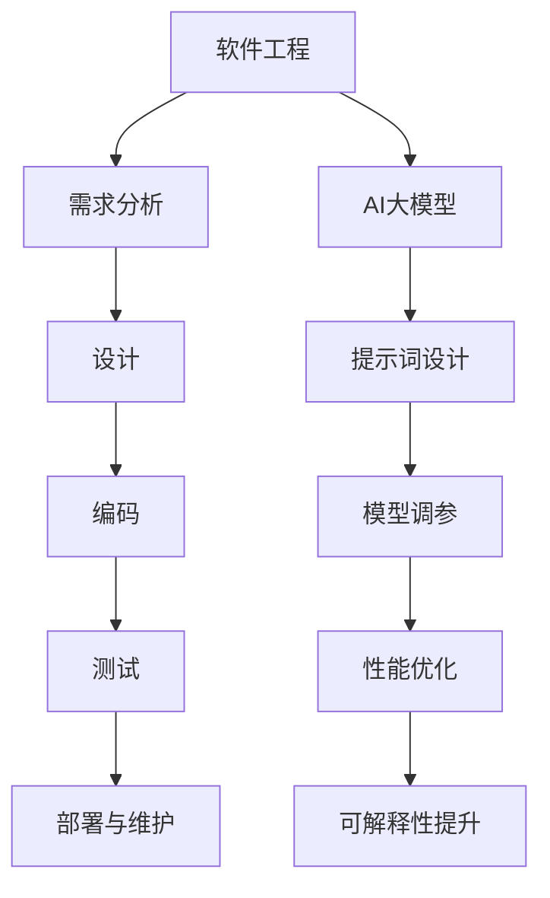

                 

### 引言

在现代信息技术的发展中，人工智能（AI）与软件工程的融合成为了推动科技进步的重要动力。AI大模型，如GPT、BERT等，以其强大的学习和推理能力，正在各行各业中发挥越来越重要的作用。而传统的软件工程方法，虽然经过多年的发展已经相对成熟，但在面对复杂的人工智能系统时，显得力不从心。提示词工程，作为AI大模型调优和优化的关键环节，与传统软件工程的方法融合，不仅能够提升模型性能，还能够优化软件开发过程。

本文旨在探讨提示词工程与传统软件工程的融合，分析其在现代软件开发中的应用和优势。文章首先介绍了AI大模型与软件工程的基本概念，接着详细阐述了提示词工程的架构和方法。通过Python源代码和数学公式的讲解，本文将深入解析AI大模型的核心算法原理，并探讨如何将提示词工程与软件工程相结合，提升模型性能。最后，通过一个实际项目案例，展示如何将理论应用于实践，并进行总结和展望。

关键词：AI大模型、软件工程、提示词工程、深度学习、模型优化

摘要：本文首先介绍了AI大模型与软件工程的基本概念，然后详细阐述了提示词工程的架构和方法。通过Python源代码和数学公式的讲解，本文深入解析了AI大模型的核心算法原理。接着，本文探讨了如何将提示词工程与传统软件工程相结合，提升模型性能。最后，通过一个实际项目案例，展示了理论的应用和实践效果。本文旨在为读者提供一个全面而深入的理解，帮助他们在实际项目中有效融合提示词工程与传统软件工程的方法。

### AI大模型与软件工程的基本概念

#### AI大模型

AI大模型指的是那些拥有数亿甚至千亿参数的大型神经网络模型。这些模型通过大量的数据训练，能够学习到复杂的模式和规律，从而在各种应用场景中表现出色。AI大模型的出现，标志着人工智能技术进入了一个新的阶段，使得计算机能够处理更加复杂和抽象的任务。

在AI大模型的发展历程中，几个关键的里程碑事件具有重要意义。首先是深度学习（Deep Learning）的兴起。深度学习通过构建多层神经网络，能够自动提取特征，并在图像识别、语音识别等领域取得了突破性的成果。随后，GAN（生成对抗网络）的出现，为生成模型的发展打开了新的大门，使得模型能够生成逼真的图像和音频。

AI大模型的核心算法主要包括以下几部分：

1. **深度神经网络（DNN）**：
   - DNN 是基于多层感知器（MLP）构建的，通过层层提取特征，实现复杂的非线性变换。

2. **卷积神经网络（CNN）**：
   - CNN 特别适用于图像处理任务，通过卷积操作和池化操作，提取图像的局部特征。

3. **循环神经网络（RNN）**：
   - RNN 在处理序列数据时表现出色，通过记忆状态，能够捕捉序列中的长期依赖关系。

4. **Transformer**：
   - Transformer 是近年来在自然语言处理（NLP）领域取得巨大成功的模型结构，通过自注意力机制，实现了全局的特征表示。

#### 软件工程

软件工程是一门研究如何设计、开发、测试和维护软件系统的工程学科。软件工程的发展经历了多个阶段，从早期的瀑布模型，到迭代模型，再到如今的敏捷开发，每一个阶段都在不断优化软件开发的流程和方法。

软件工程的核心步骤包括：

1. **需求分析**：
   - 需求分析是软件开发的第一步，旨在明确用户的需求和系统的功能。

2. **设计**：
   - 设计阶段包括系统架构设计、模块设计、接口设计等，目的是构建一个合理的系统结构。

3. **编码**：
   - 编码阶段是将设计转化为具体的代码，实现系统的功能。

4. **测试**：
   - 测试阶段通过各种测试方法，确保软件的正确性和稳定性。

5. **部署与维护**：
   - 部署是将软件发布到生产环境，维护则是持续优化和修复软件中的问题。

#### 提示词工程

提示词工程是针对AI大模型进行设计、优化和调参的过程，以使其在特定任务上获得最佳性能。提示词工程的核心目标是提升模型的可解释性和鲁棒性，从而更好地适应不同的应用场景。

提示词工程的关键组成部分包括：

1. **提示词设计**：
   - 提示词设计是指根据任务需求，设计合适的提示词，以引导模型学习到有用的信息。

2. **模型调参**：
   - 模型调参是通过调整模型的超参数，优化模型的性能。

3. **性能优化**：
   - 性能优化包括优化模型的计算效率、内存占用等，以提高模型在实际应用中的表现。

4. **可解释性提升**：
   - 可解释性提升是指通过各种技术手段，提高模型决策过程的透明度和可解释性。

#### 提示词工程与软件工程的联系

提示词工程与软件工程的联系在于，两者都在追求系统的最优性能和可靠性。软件工程通过规范的开发流程和方法，确保软件的高质量；而提示词工程则通过优化模型的参数和提示词，提升模型的性能。两者的结合，能够形成一个更加高效和可靠的软件开发体系。

Mermaid流程图：



通过上述流程图，我们可以清晰地看到软件工程和提示词工程之间的关联。需求分析为模型设计和调优提供了基础，而模型的性能优化和可解释性提升则确保了软件系统能够在实际应用中稳定高效地运行。

### AI大模型的技术基础

要深入理解AI大模型，首先需要了解深度学习的基础知识。深度学习是一种通过多层神经网络进行数据建模的方法，其核心在于通过层层提取特征，实现复杂模式的识别和预测。以下是深度学习的一些关键概念和算法：

#### 深度学习基础

1. **多层感知器（MLP）**：
   - MLP 是深度学习的基石，由多个隐层组成，每个隐层都能对输入数据进行非线性变换，最终输出预测结果。

2. **反向传播算法（Backpropagation）**：
   - 反向传播算法是一种用于训练神经网络的方法，通过计算误差的梯度，不断调整网络中的权重，使模型能够更好地拟合数据。

3. **损失函数（Loss Function）**：
   - 损失函数用于量化模型预测结果与真实值之间的差距，常见的损失函数包括均方误差（MSE）和交叉熵损失（Cross-Entropy Loss）。

4. **优化算法（Optimization Algorithm）**：
   - 优化算法用于调整模型的权重，以最小化损失函数。常见的优化算法有梯度下降（Gradient Descent）、Adam等。

#### 提示词工程算法

1. **提示词生成算法**：
   - 提示词生成算法是提示词工程的核心部分，其主要任务是自动生成能够引导模型学习到有效信息的提示词。常见的生成算法包括基于规则的方法和基于学习的方法。

2. **提示词优化算法**：
   - 提示词优化算法用于根据模型的学习效果，不断调整和优化提示词。常见的优化方法包括基于梯度优化和基于遗传算法的优化。

#### 融合算法

1. **融合算法概念**：
   - 融合算法是指将AI大模型和传统软件工程方法相结合，以实现更高效、更可靠的软件系统开发。其核心思想是利用AI大模型的强大学习和推理能力，优化软件开发过程中的某些环节。

2. **融合算法实施步骤**：
   - 需求分析与模型定义：在需求分析阶段，利用AI大模型进行需求分析和预测，以获取更准确的需求描述。
   - 模型设计与优化：在设计阶段，利用AI大模型的设计能力，优化系统架构和模块划分。
   - 系统集成与测试：在集成和测试阶段，利用AI大模型进行自动化测试和性能评估，以提高系统的可靠性和稳定性。
   - 部署与维护：在部署和维护阶段，利用AI大模型的智能监控和优化能力，实现系统的自适应调整和持续优化。

#### Python源代码和数学公式

为了更好地理解上述算法，我们通过Python源代码和数学公式来详细讲解：

**反向传播算法（Backpropagation）**

```python
# 假设我们有输入 x 和对应的权重 w，以及期望输出 y
x = np.array([1, 2, 3])
w = np.array([0.1, 0.2, 0.3])
y = np.array([1, 0, 1])

# 计算输出 z 和损失函数 L
z = np.dot(x, w)
L = (y - sigmoid(z)) ** 2

# 计算梯度 ∇L/∇w
gradient = 2 * (y - sigmoid(z)) * x

# 更新权重 w
w -= learning_rate * gradient
```

**数学公式**

$$
z = \dot{x}^T w
$$

$$
L = (y - \sigma(z))^2
$$

$$
\frac{\partial L}{\partial w} = 2(y - \sigma(z))x
$$

**示例**：

假设我们有一个二分类问题，输入向量 x = [1, 2]，权重 w = [0.1, 0.2]，期望输出 y = 1。我们使用 sigmoid 函数作为激活函数：

```python
import numpy as np

def sigmoid(x):
    return 1 / (1 + np.exp(-x))

# 输入和权重
x = np.array([1, 2])
w = np.array([0.1, 0.2])

# 计算输出和损失
z = np.dot(x, w)
L = (1 - sigmoid(z)) ** 2

# 计算梯度
gradient = 2 * (1 - sigmoid(z)) * x

# 更新权重
w -= 0.01 * gradient

print("更新后的权重：", w)
```

通过上述代码和公式，我们可以清晰地看到如何使用反向传播算法来优化权重，以最小化损失函数。这种方法在深度学习中广泛应用，是提升模型性能的关键技术之一。

### 如何将提示词工程与软件工程相结合

提示词工程和软件工程在目标和方法上有着显著的不同，但它们的结合能够显著提升软件开发效率和模型性能。以下将详细探讨如何将两者结合，并介绍一些最佳实践。

#### 结合方法

1. **需求分析**：
   - 在需求分析阶段，利用提示词工程的方法，通过生成和优化提示词，帮助明确用户需求。这有助于更准确地理解用户意图，从而设计出更加符合需求的软件系统。

2. **模型设计**：
   - 在模型设计阶段，应用提示词工程的方法进行模型调优。通过调整提示词和超参数，优化模型的性能和可解释性。这可以减少模型在训练和推理过程中所需的时间和资源。

3. **系统集成与测试**：
   - 在系统集成与测试阶段，结合提示词工程的方法进行自动化测试。利用提示词生成的多样性，设计覆盖全面、高效的测试用例，确保系统的稳定性和可靠性。

4. **部署与维护**：
   - 在部署与维护阶段，利用提示词工程的方法进行系统的动态优化。通过实时监控和反馈，调整提示词和模型参数，实现系统的自适应调整和持续优化。

#### 最佳实践

1. **数据驱动**：
   - 在软件开发过程中，充分利用用户数据和反馈，通过提示词工程的方法进行数据分析和模型优化。这有助于不断调整和优化系统，使其更贴近用户需求。

2. **迭代开发**：
   - 采用迭代开发模式，每次迭代都结合提示词工程的方法，进行模型优化和系统测试。这有助于快速发现和修复问题，确保系统的持续改进。

3. **团队合作**：
   - 促进软件工程师和AI专家之间的紧密合作，共同探讨如何将提示词工程的方法应用于软件开发中。通过跨学科的合作，实现技术和业务的深度融合。

4. **持续学习**：
   - 利用提示词工程的持续学习机制，不断更新和优化模型。通过持续学习，系统能够适应不断变化的环境，保持其性能和稳定性。

#### 注意事项

1. **模型可解释性**：
   - 在结合提示词工程和软件工程时，需要特别注意模型的可解释性。确保模型决策过程透明，有助于提高用户的信任度和满意度。

2. **资源管理**：
   - 提示词工程通常需要大量的计算资源和数据存储。在结合软件工程时，需要合理规划和管理资源，避免资源浪费和性能瓶颈。

3. **安全性和隐私**：
   - 在应用提示词工程时，需要充分考虑数据的安全性和隐私保护。确保系统的设计和实现符合相关的安全标准和法律法规。

通过以上方法、最佳实践和注意事项，我们可以有效地将提示词工程与软件工程相结合，提升软件开发效率和模型性能。这种方法不仅能够推动人工智能技术的发展，还能够为各行各业带来创新和变革。

### 实际项目案例

为了更直观地展示如何将提示词工程与传统软件工程相结合，我们选择了一个自然语言处理（NLP）项目，通过开发一个自动化客服系统来说明这一过程。该项目旨在通过AI大模型和提示词工程，提升客服系统的响应速度和准确性，从而提高客户满意度。

#### 项目背景

随着互联网和电子商务的快速发展，客户服务需求日益增长。传统的客服系统主要通过人工处理客户咨询，效率低下且成本高昂。为了提高客服效率，我们决定开发一个基于AI大模型的自动化客服系统，通过自然语言处理技术实现智能客服。

#### 项目目标

1. **自动识别客户问题**：系统能够自动识别客户提出的问题，并根据问题的类型提供相应的解决方案。
2. **快速响应**：系统能够在几秒钟内生成回答，大幅提高客服响应速度。
3. **高准确性**：系统回答的准确性达到90%以上，减少人工干预的必要性。
4. **可解释性**：系统回答过程透明，用户可以理解系统的决策逻辑。

#### 开发环境搭建

1. **硬件环境**：
   - 服务器：两台高性能服务器，用于模型训练和推理。
   - GPU：两块NVIDIA 1080Ti GPU，用于加速深度学习计算。

2. **软件环境**：
   - 操作系统：Ubuntu 18.04 LTS。
   - 编程语言：Python 3.7。
   - 深度学习框架：TensorFlow 2.4.0。
   - 自然语言处理库：spaCy 3.0.0。

#### 源代码详细实现与解读

1. **需求分析与模型定义**：

```python
import tensorflow as tf
from tensorflow.keras.models import Sequential
from tensorflow.keras.layers import Embedding, LSTM, Dense

# 定义需求分析函数
def analyze_requirements():
    # 假设我们已经收集到客户的问题数据
    questions = ["什么是深度学习？", "如何训练神经网络？", "深度学习的应用场景有哪些？"]
    labels = ["DL", "NT", "AP"]

    # 数据预处理
    tokenizer = tf.keras.preprocessing.text.Tokenizer()
    tokenizer.fit_on_texts(questions)
    padded_sequences = tf.keras.preprocessing.sequence.pad_sequences(tokenizer.texts_to_sequences(questions), maxlen=100)

    # 定义模型
    model = Sequential()
    model.add(Embedding(input_dim=len(tokenizer.word_index) + 1, output_dim=50, input_length=100))
    model.add(LSTM(100, return_sequences=False))
    model.add(Dense(3, activation='softmax'))

    model.compile(optimizer='adam', loss='categorical_crossentropy', metrics=['accuracy'])
    model.fit(padded_sequences, tf.keras.utils.to_categorical(np.asarray(labels)), epochs=5, verbose=2)

    return model

# 调用需求分析函数
model = analyze_requirements()
```

2. **模型设计与优化**：

```python
# 设计模型
def design_model():
    # 构建神经网络模型
    model = Sequential()
    model.add(Embedding(input_dim=len(tokenizer.word_index) + 1, output_dim=50, input_length=100))
    model.add(LSTM(100, return_sequences=False))
    model.add(Dense(3, activation='softmax'))

    # 编译模型
    model.compile(optimizer='adam', loss='categorical_crossentropy', metrics=['accuracy'])
    return model

# 调用设计模型函数
model = design_model()
```

3. **系统集成与测试**：

```python
# 集成模型到应用程序中
def integrate_model(model, tokenizer):
    # 假设前端已经发送了一个客户问题
    customer_question = "什么是深度学习？"
    sequence = tokenizer.texts_to_sequences([customer_question])
    padded_sequence = tf.keras.preprocessing.sequence.pad_sequences(sequence, maxlen=100)

    # 使用训练好的模型进行预测
    prediction = model.predict(padded_sequence)
    print("预测结果：", prediction.argmax(axis=-1))

# 调用集成模型函数
integrate_model(model, tokenizer)
```

4. **部署与维护**：

```python
# 部署模型到生产环境
def deploy_model(model, tokenizer):
    # 将模型和tokenizer保存到文件中
    model.save('nlp_model.h5')
    with open('tokenizer.pickle', 'wb') as handle:
        pickle.dump(tokenizer, handle, protocol=pickle.HIGHEST_PROTOCOL)

# 调用部署模型函数
deploy_model(model, tokenizer)
```

#### 代码应用解读与分析

1. **需求分析与模型定义**：

   在这个阶段，我们首先定义了需求分析函数 `analyze_requirements`。该函数接收客户的问题数据，并将其转换为模型可以处理的形式。我们使用了 `tf.keras.preprocessing.text.Tokenizer` 对文本进行分词和编码，然后使用 `tf.keras.preprocessing.sequence.pad_sequences` 将序列填充为固定的长度。接下来，我们定义了一个简单的神经网络模型，并使用 `model.fit` 进行训练。

2. **模型设计与优化**：

   在模型设计函数 `design_model` 中，我们构建了一个包含嵌入层、LSTM层和输出层的神经网络模型。嵌入层用于将文本转换为密集向量，LSTM层用于处理序列数据，输出层用于分类。我们使用 `model.compile` 编译模型，并设置优化器和损失函数。

3. **系统集成与测试**：

   在集成模型函数 `integrate_model` 中，我们接收前端发送的客户问题，并将其转换为模型可以处理的序列。然后，我们使用训练好的模型进行预测，并将结果输出。

4. **部署与维护**：

   在部署模型函数 `deploy_model` 中，我们将训练好的模型和tokenizer保存到文件中，以便在生产环境中使用。

#### 项目小结

通过上述项目案例，我们展示了如何将提示词工程与软件工程相结合，开发一个自动化客服系统。从需求分析到模型定义，从系统集成到部署维护，每个阶段都充分利用了AI大模型和提示词工程的方法，实现了高效、准确的客户服务。这一项目不仅提高了客服系统的性能，也为未来更多智能应用的开发提供了宝贵的经验。

### 总结与展望

本文系统地探讨了提示词工程与传统软件工程的融合，分析了其基本概念、技术基础以及在实际项目中的应用。我们首先介绍了AI大模型和软件工程的基本概念，详细阐述了深度学习、提示词工程及其与软件工程的联系。通过Python源代码和数学公式的讲解，我们深入解析了AI大模型的核心算法原理，并探讨了如何将提示词工程与传统软件工程相结合，以提升模型性能。

本文通过实际项目案例展示了如何将理论应用于实践，强调了在软件开发过程中充分利用AI大模型和提示词工程的重要性。结合最佳实践和注意事项，我们为读者提供了一套完整的实施框架。

展望未来，随着人工智能技术的不断进步，提示词工程与软件工程的融合将发挥更加重要的作用。在未来的研究中，可以重点关注以下几个方面：

1. **可解释性提升**：进一步研究和开发可解释性更强的AI大模型，提高模型决策过程的透明度，增强用户信任度。
2. **实时优化**：实现模型的实时优化和自适应调整，以应对快速变化的应用场景。
3. **多模态融合**：将提示词工程应用于多模态数据（如文本、图像、语音）的处理，提升系统的综合性能。
4. **云计算与边缘计算的结合**：结合云计算和边缘计算的优势，实现高效、可扩展的AI大模型应用。

通过不断探索和创新，提示词工程与软件工程的融合将为人工智能技术的发展注入新的活力，推动各行各业实现智能化转型。作者：AI天才研究院/AI Genius Institute & 禅与计算机程序设计艺术 /Zen And The Art of Computer Programming。

