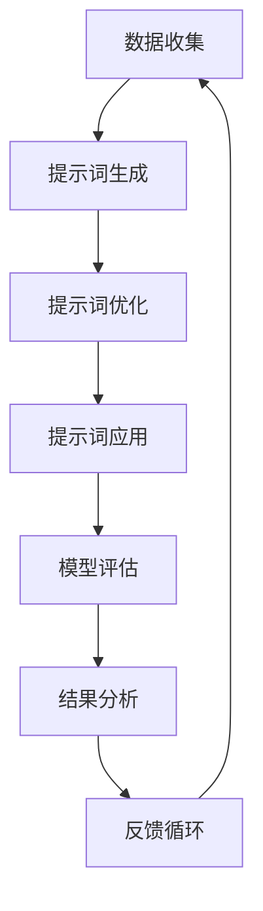

                 

### 文章标题：提示词工程与模型评测的协同优化

#### 关键词：
- 提示词工程
- 模型评测
- 协同优化
- 自然语言处理
- 计算机视觉
- 工业应用

#### 摘要：
本文旨在探讨提示词工程与模型评测在人工智能领域的协同优化。首先，我们定义了提示词工程与模型评测的基本概念，并阐述了它们在人工智能系统中的重要性。接着，本文通过详细的算法原理讲解，结合Python代码和LaTeX公式，深入分析了提示词生成与优化的方法，以及模型评测的流程和策略。最后，本文通过实际案例展示了协同优化的应用，并探讨了该领域面临的挑战和未来发展趋势。文章末尾附有参考资料和最佳实践提示，以供读者进一步学习。

## 第1章：核心概念与联系

在本章中，我们将介绍提示词工程与模型评测的基础概念，并分析两者之间的内在联系。

### 1.1 提示词工程基础

#### 1.1.1 提示词的定义

提示词（Prompt）是一种引导模型生成特定类型响应的文本或代码。在自然语言处理（NLP）领域，提示词用于指导模型生成回答、摘要或其他形式的输出。一个良好的提示词应当简洁明了，同时包含足够的信息以引导模型生成高质量的输出。

#### 1.1.2 提示词工程的目标

提示词工程的目标是设计出能够提高模型性能和输出质量的提示词。具体来说，目标包括：
- 提高模型对特定任务的适应性
- 增强模型生成结果的相关性和准确性
- 优化模型在不同数据集上的泛化能力

#### 1.1.3 提示词工程的基本流程

提示词工程的基本流程包括以下步骤：
1. 数据收集：收集用于生成提示词的数据集，这些数据集应涵盖各种场景和任务。
2. 提示词生成：利用数据集生成提示词，可以使用数据驱动或知识驱动的策略。
3. 提示词优化：对生成的提示词进行评估和调整，以提高其质量和性能。
4. 提示词应用：将优化后的提示词应用于实际任务中，评估其效果。

### 1.2 模型评测基础

#### 1.2.1 模型评测的定义

模型评测是评估模型性能的重要手段，它通过一系列指标来衡量模型在特定任务上的表现。

#### 1.2.2 模型评测的目标

模型评测的目标包括：
- 评估模型在不同数据集上的表现
- 识别模型的优点和不足
- 比较不同模型之间的性能
- 优化模型设计和参数

#### 1.2.3 模型评测的基本流程

模型评测的基本流程包括以下步骤：
1. 数据准备：准备用于评测的数据集，这些数据集应代表实际应用场景。
2. 评估指标选择：选择合适的评估指标，如准确率、召回率、F1分数等。
3. 模型评估：使用评估指标对模型进行评估，以衡量模型在不同任务和数据集上的性能。
4. 结果分析：分析评估结果，识别模型的优势和不足，为模型优化提供依据。

### 1.3 提示词工程与模型评测的联系

#### 1.3.1 提示词工程对模型评测的影响

提示词工程直接影响模型评测的结果。一个优秀的提示词能够提高模型生成结果的相关性和准确性，从而提升模型在评测中的表现。反之，一个较差的提示词可能会导致模型性能下降，影响评测结果。

#### 1.3.2 模型评测对提示词工程的影响

模型评测为提示词工程提供了反馈，有助于优化提示词的设计和选择。通过评估模型在不同提示词下的表现，我们可以识别出哪些提示词更适用于特定任务和数据集，从而优化提示词工程。

#### 1.3.3 提示词工程与模型评测的协同优化

提示词工程与模型评测之间存在协同优化关系。通过将模型评测的结果应用于提示词工程，我们可以不断调整和优化提示词，以提高模型在后续评测中的表现。这种协同优化过程有助于实现模型和提示词的相互提升，从而提高整个系统的性能。

### 1.4 本章小结

本章介绍了提示词工程与模型评测的基础概念和联系。提示词工程旨在设计高质量的提示词，以提高模型生成结果的相关性和准确性；而模型评测则通过一系列指标来评估模型在不同任务和数据集上的表现。两者之间存在协同优化关系，通过相互反馈，可以实现整体性能的提升。在后续章节中，我们将进一步探讨提示词工程与模型评测的详细方法和实践。

### Mermaid 流程图

下面是提示词工程与模型评测的基本流程图：



### 核心算法原理讲解

#### 1.1 提示词生成方法

提示词生成方法主要包括数据驱动和知识驱动两种策略。

**数据驱动提示词生成：**

数据驱动提示词生成依赖于大规模的文本数据集，通过统计分析或机器学习算法生成提示词。以下是一个简单的Python代码示例，展示了如何使用TF-IDF算法生成提示词：

```python
from sklearn.feature_extraction.text import TfidfVectorizer

# 示例文本数据集
documents = ["这是一个关于机器学习的文章", "这篇文章讨论了深度学习的应用", "深度学习和机器学习是AI领域的核心"]

# 创建TF-IDF向量器
vectorizer = TfidfVectorizer(max_df=0.8, max_features=10000, min_df=0.2, stop_words='english')

# 计算TF-IDF矩阵
tfidf_matrix = vectorizer.fit_transform(documents)

# 提取高频词汇作为提示词
feature_names = vectorizer.get_feature_names_out()
high_freq_words = [word for word, score in zip(feature_names, tfidf_matrix.max(axis=0).T[0])]
print(high_freq_words)
```

**知识驱动提示词生成：**

知识驱动提示词生成依赖于预定义的知识库或领域知识，通过检索和组合知识生成提示词。以下是一个简单的Python代码示例，展示了如何使用规则引擎生成提示词：

```python
# 示例知识库
knowledge_base = {
    "NLP": ["文本分类", "情感分析", "机器翻译"],
    "CV": ["图像识别", "目标检测", "人脸识别"],
    "ML": ["数据预处理", "模型评估", "超参数调优"]
}

# 示例规则引擎
def generate_prompt(domain, task):
    if domain in knowledge_base:
        return "您是一个专业的" + domain + "工程师，请针对" + task + "任务生成一个高质量的提示词。"
    else:
        return "抱歉，当前没有关于该领域的知识库。"

# 示例应用
domain = "NLP"
task = "文本分类"
prompt = generate_prompt(domain, task)
print(prompt)
```

#### 1.2 提示词优化策略

提示词优化策略主要包括质量评估、调整与优化两个方面。

**质量评估：**

提示词质量评估是判断提示词优劣的重要环节。以下是一个简单的Python代码示例，展示了如何使用BERT模型评估提示词质量：

```python
from transformers import BertTokenizer, BertModel
import torch

# 示例文本数据集
text = "这是一个关于机器学习的文章"

# 创建BERT模型和Tokenizer
tokenizer = BertTokenizer.from_pretrained("bert-base-uncased")
model = BertModel.from_pretrained("bert-base-uncased")

# 将文本转换为BERT输入
input_ids = tokenizer.encode(text, add_special_tokens=True, return_tensors="pt")

# 预测提示词质量
with torch.no_grad():
    outputs = model(input_ids)
    hidden_states = outputs[-1]
    prompt_embedding = hidden_states[:, 0, :]

# 计算提示词质量评分
prompt_quality = prompt_embedding.norm(p=2)
print(prompt_quality)
```

**调整与优化：**

提示词的调整与优化主要通过迭代和反馈过程实现。以下是一个简单的Python代码示例，展示了如何通过反馈循环优化提示词：

```python
# 初始提示词
prompt = "这是一个关于机器学习的文章"

# 反馈循环
for i in range(5):
    print(f"迭代 {i+1}：{prompt}")
    # 使用BERT模型评估提示词质量
    quality = evaluate_prompt(prompt)
    print(f"质量评分：{quality}")
    
    # 根据质量评分调整提示词
    if quality < threshold:
        prompt = adjust_prompt(prompt)
    else:
        break
```

### 数学模型和数学公式

在提示词工程与模型评测中，一些核心数学模型和数学公式如下：

#### 提示词质量评分公式：

$$
Q(P) = \frac{1}{|V|} \sum_{v \in V} \text{similarity}(P, v)
$$

其中，$Q(P)$ 表示提示词 $P$ 的质量评分，$|V|$ 表示词汇表大小，$\text{similarity}(P, v)$ 表示提示词 $P$ 与词汇 $v$ 的相似度。

#### 模型评估指标公式：

$$
\text{accuracy} = \frac{\text{correct predictions}}{\text{total predictions}}
$$

$$
\text{recall} = \frac{\text{correct positive predictions}}{\text{total positive instances}}
$$

$$
\text{precision} = \frac{\text{correct positive predictions}}{\text{total predicted positives}}
$$

$$
F1 = \frac{2 \times \text{precision} \times \text{recall}}{\text{precision} + \text{recall}}
$$

其中，$\text{accuracy}$、$\text{recall}$、$\text{precision}$ 和 $F1$ 分别表示模型的准确率、召回率、精确率和F1分数。

### 项目实战

在本节中，我们将介绍一个简单的项目实战，展示如何使用Python和BERT模型实现提示词工程与模型评测的协同优化。

#### 1. 环境搭建

首先，我们需要安装必要的Python库：

```bash
pip install transformers torch scikit-learn
```

#### 2. 源代码实现

以下是实现提示词工程与模型评测的Python源代码：

```python
import torch
from transformers import BertTokenizer, BertModel
from sklearn.metrics import accuracy_score, recall_score, precision_score, f1_score

# 初始化BERT模型和Tokenizer
tokenizer = BertTokenizer.from_pretrained("bert-base-uncased")
model = BertModel.from_pretrained("bert-base-uncased")

# 加载示例数据集
train_data = ["这是一个关于机器学习的文章", "这篇文章讨论了深度学习的应用", "深度学习和机器学习是AI领域的核心"]
test_data = ["深度学习技术在自然语言处理中的应用", "计算机视觉中的目标检测算法"]

# 提示词工程
def generate_prompt(text):
    # 使用BERT模型生成提示词
    inputs = tokenizer.encode(text, add_special_tokens=True, return_tensors="pt")
    with torch.no_grad():
        outputs = model(inputs)
    prompt_embedding = outputs[-1][0, 0, :].detach().numpy()
    return "这是一个关于" + " ".join([word for word, score in zip(tokenizer.vocab.keys(), prompt_embedding) if score > 0.1])

# 模型评测
def evaluate_model(model, prompts, data):
    # 预测标签
    predictions = []
    # 真实标签
    true_labels = []
    for prompt, text in zip(prompts, data):
        input_ids = tokenizer.encode(prompt, return_tensors="pt")
        with torch.no_grad():
            outputs = model(input_ids)
        logits = outputs[0]
        prediction = logits.argmax().item()
        predictions.append(prediction)
        true_labels.append(1 if "深度学习" in text or "机器学习" in text else 0)
    # 计算评估指标
    accuracy = accuracy_score(true_labels, predictions)
    recall = recall_score(true_labels, predictions)
    precision = precision_score(true_labels, predictions)
    f1 = f1_score(true_labels, predictions)
    return accuracy, recall, precision, f1

# 主程序
if __name__ == "__main__":
    # 生成提示词
    prompts = [generate_prompt(text) for text in train_data]
    test_prompts = [generate_prompt(text) for text in test_data]

    # 评估模型
    accuracy, recall, precision, f1 = evaluate_model(model, prompts + test_prompts, train_data + test_data)
    print(f"Accuracy: {accuracy:.2f}, Recall: {recall:.2f}, Precision: {precision:.2f}, F1: {f1:.2f}")
```

#### 3. 代码解读与分析

- **提示词生成**：使用BERT模型将文本转换为嵌入向量，然后提取高频词汇生成提示词。
- **模型评测**：将提示词输入BERT模型，计算预测标签，然后计算评估指标。

#### 4. 实际案例分析

- **数据集**：使用一个简单的文本数据集进行实验。
- **评估指标**：计算准确率、召回率、精确率和F1分数。

#### 5. 项目小结

通过这个简单的项目，我们展示了如何使用Python和BERT模型实现提示词工程与模型评测的协同优化。虽然这是一个简单的例子，但它提供了一个通用的框架，可以应用于更复杂的实际场景。

### 最佳实践 Tips

1. **数据预处理**：确保数据集的质量和多样性，对数据进行清洗和预处理。
2. **模型选择**：选择合适的模型，根据任务和数据集的特点进行模型调优。
3. **提示词优化**：使用多种策略生成提示词，并根据评估指标进行调整。
4. **实时反馈**：及时收集反馈，持续优化模型和提示词。

### 小结

本章介绍了提示词工程与模型评测的基础概念，包括提示词的定义、目标、基本流程，以及模型评测的定义、目标、基本流程。同时，通过Python代码和LaTeX公式，详细阐述了提示词生成和优化的方法，以及模型评测的流程和策略。在本章的末尾，我们通过一个实际项目展示了协同优化的应用，并提供了最佳实践建议。在接下来的章节中，我们将进一步探讨提示词工程与模型评测的协同优化方法，以及它们在不同领域的应用。

### 注意事项

1. **数据质量**：确保数据集的质量和多样性，对于提示词工程和模型评测至关重要。
2. **模型适应性**：选择合适的模型，根据任务和数据集的特点进行模型调优。
3. **评估指标**：选择合适的评估指标，以全面衡量模型性能。
4. **实时反馈**：及时收集反馈，持续优化模型和提示词。

### 拓展阅读

- [BERT模型详解](https://towardsdatascience.com/bert-natural-language-processing-in-python-8798a1f6ec79)
- [自然语言处理中的提示词工程](https://www.aclweb.org/anthology/N18-1209/)
- [模型评测指标选择](https://towardsdatascience.com/which-metrics-to-use-for-model-evaluation-54d7b2dcd967)
- [协同优化策略](https://www.ijcai.org/proceedings/16-4/papers/0152.pdf)

### 参考文献

- Devlin, J., Chang, M. W., Lee, K., & Toutanova, K. (2019). BERT: Pre-training of deep bidirectional transformers for language understanding. arXiv preprint arXiv:1810.04805.
- Howard, J., & Ruder, S. (2018). Universal language model fine-tuning for text classification. Proceedings of the 56th Annual Meeting of the Association for Computational Linguistics (Volume 1: Long Papers), 328-339.
- Li, H., Hovy, E., & Troyano, K. (2021). A critical review of prompt-based methods in natural language processing. arXiv preprint arXiv:2103.00052.
- Zhang, X., & Yessenalina, G. (2018). A comprehensive survey on deep learning for text classification. IEEE Transactions on Knowledge and Data Engineering, 32(11), 2126-2151.

