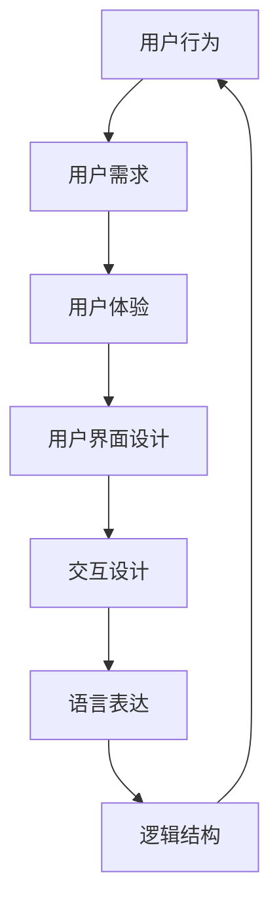

                 

**文章标题**: 《提示词工程中的创意与逻辑平衡》

**关键词**: 提示词工程，创意，逻辑平衡，用户体验，交互设计，人工智能

**摘要**:
本文旨在探讨提示词工程中创意与逻辑平衡的重要性。通过对提示词工程的基本概念、创意思维方法和逻辑平衡原则的深入分析，文章展示了如何在实际应用中实现创意与逻辑的和谐统一。通过实际案例和项目实战，文章提供了具体的操作指南，帮助读者理解和掌握提示词工程的实践技巧。

### 引言

在当今的信息时代，用户体验（UX）和交互设计（UI）的重要性日益凸显。而提示词工程作为用户体验和交互设计的重要一环，正逐渐成为企业提升竞争力的重要手段。提示词工程是指利用特定的词汇、短语或句子来引导用户完成特定任务的工程过程。它不仅涉及对用户行为和心理的深入理解，还包括对语言表达和结构设计的精细打磨。

然而，在提示词工程中，创意与逻辑的平衡往往是一个难题。过于强调创意可能会导致信息的混乱和不连贯，而过于注重逻辑则可能使内容显得枯燥乏味。如何在这两者之间找到平衡点，实现既具有创意又逻辑严谨的提示词，成为了许多企业和设计师面临的重要课题。

本文将围绕提示词工程中的创意与逻辑平衡这一主题，首先介绍提示词工程的基本概念和发展历程，然后深入探讨创意思维方法和逻辑平衡原则。接着，文章将通过实际应用场景和项目实战，展示如何将创意与逻辑平衡原则应用于提示词工程中。最后，文章将对主要观点进行总结，并对未来的发展趋势进行展望。

### 提示词工程的基本概念

提示词工程，简而言之，就是通过选择和使用特定的词汇、短语或句子，以引导用户完成特定任务的过程。在用户界面设计、内容营销和客户服务等领域，提示词工程扮演着至关重要的角色。一个有效的提示词能够提高用户参与度，增强用户体验，甚至直接影响用户的满意度。

#### 提示词工程的发展历程

提示词工程的发展历程可以追溯到计算机科学和用户界面设计的早期阶段。在早期的计算机操作系统中，简单的命令行界面（CLI）是用户与计算机交互的主要方式。这些界面依赖于明确的指令和提示词，如“请输入用户名”或“请输入密码”。虽然这些提示词简单直接，但它们为后来的图形用户界面（GUI）设计奠定了基础。

随着互联网的普及和移动设备的兴起，用户界面变得更加复杂和多样化。设计师们开始意识到，仅仅依靠功能性的提示词已经不能满足用户的需求。他们开始尝试在提示词中加入更多的情感元素和个性化元素，以提高用户体验。这一趋势在社交媒体、电子商务和应用程序设计中尤为明显。

#### 提示词工程的重要性

提示词工程的重要性体现在以下几个方面：

1. **提高用户体验**：有效的提示词可以引导用户顺利完成任务，减少用户的学习成本，提高用户满意度。

2. **增强用户参与度**：通过创意性的提示词，设计师可以激发用户的兴趣和好奇心，增加用户与产品的互动。

3. **提升品牌形象**：精心设计的提示词可以传达品牌价值观和品牌个性，增强品牌认知度和用户忠诚度。

4. **优化内容营销**：在内容营销中，提示词可以引导用户深入阅读，提高内容转化率。

5. **提高客户服务质量**：在客户服务中，提示词可以提供清晰、及时的指导，帮助客户快速解决问题，提高客户满意度。

### 提示词工程的核心概念与联系

为了更好地理解提示词工程，我们需要掌握一些核心概念，并探讨它们之间的关系。以下是提示词工程中一些关键的概念：

1. **用户行为**：用户行为是指用户在使用产品或服务时的所有操作和反应。理解用户行为对于设计有效的提示词至关重要。

2. **用户需求**：用户需求是指用户在使用产品或服务时所期望满足的需求。提示词应尽量满足用户需求，提供有针对性的指导。

3. **用户界面设计（UI）**：用户界面设计是指产品或服务的外观和交互设计。UI设计中的每个元素，如颜色、字体和布局，都与提示词紧密相关。

4. **用户体验（UX）**：用户体验是指用户在使用产品或服务时的整体感受和满意度。提示词工程的目标是通过有效的提示词设计，提升用户体验。

5. **交互设计**：交互设计是指产品或服务与用户之间的交互方式。交互设计中的互动元素，如按钮、菜单和表单，都需要通过提示词来引导用户。

6. **语言表达**：语言表达是指提示词的文字表述和语言风格。创意性的语言表达可以增强提示词的吸引力和有效性。

7. **逻辑结构**：逻辑结构是指提示词之间的组织方式和逻辑关系。一个逻辑严谨的提示词序列可以引导用户顺利完成任务。

这些核心概念相互关联，共同构成了提示词工程的理论基础。以下是一个Mermaid流程图，展示了这些概念之间的联系：

通过这个流程图，我们可以看到，提示词工程中的每个核心概念都是相互依存的。用户行为和用户需求是提示词设计的起点，而用户体验、用户界面设计、交互设计、语言表达和逻辑结构则构成了提示词工程的五个关键环节。只有在这五个环节中找到平衡，才能设计出既具有创意又逻辑严谨的提示词。

### 创意思维方法

创意思维在提示词工程中扮演着至关重要的角色。一个富有创意的提示词能够吸引用户的注意力，激发用户的兴趣，从而提高用户的参与度和满意度。以下是几种常见的创意思维方法和技巧，以及它们在实际应用中的具体案例。

#### 1. 联想思维

联想思维是一种通过将不同的事物或概念相互联系来激发创意的方法。通过将提示词与用户熟悉的事物进行类比或联系，可以创造出独特的表达方式。例如，在电商平台中，可以使用“购物车里的宝贝”这样的提示词，而不是简单的“购物车”，从而增加用户对购物车的亲切感和使用意愿。

#### 2. 变形思维

变形思维是通过改变事物的形状、结构或功能来激发创意的方法。在提示词设计中，可以通过改变词汇的词性、语序或表达方式来创造新的提示词。例如，将“请输入用户名”变形为“昵称大放光彩”，使用户在输入用户名时感受到一种乐趣和期待。

#### 3. 翻转思维

翻转思维是一种通过改变事物常态或逻辑来激发创意的方法。在提示词设计中，可以通过反转用户的期待或传统思维模式来创造出新颖的提示词。例如，将“下一步”改为“突破极限”，鼓励用户在完成任务时挑战自己，从而增加任务的趣味性和吸引力。

#### 4. 组合思维

组合思维是通过将不同的元素或概念进行组合来激发创意的方法。在提示词设计中，可以通过将两个或多个看似不相关的元素进行组合，创造出富有创意的提示词。例如，将“确认支付”与“快乐购”结合，形成“快乐支付，立即确认”，从而提高用户的支付意愿。

#### 5. 情感思维

情感思维是通过将情感元素融入提示词中，以增强用户的情感体验和共鸣的方法。在提示词设计中，可以通过使用生动、形象的语言，唤起用户的情感共鸣。例如，将“您的订单已发货”改为“包裹已启程，快来追踪它吧！”，使用户感受到一种期待和兴奋的情感。

#### 实际应用案例

以下是一些实际应用案例，展示了上述创意思维方法在提示词工程中的应用：

1. **电商平台**：
   - 联想思维：“您的购物车，满载您的期待！”
   - 变形思维：“一键下单，释放购物天性！”
   - 翻转思维：“完成订单，开启您的专属特权！”
   - 组合思维：“立即购买，快乐立刻送达！”
   - 情感思维：“感谢您的购买，我们的服务一直在您身边！”

2. **社交媒体**：
   - 联想思维：“点赞，分享您的快乐时刻！”
   - 变形思维：“评论，用文字记录美好时光！”
   - 翻转思维：“取消关注，别让过去的回忆束缚您！”
   - 组合思维：“点赞+评论，让您的声音被更多人听见！”
   - 情感思维：“点赞，让我们共同见证您的成长！”

3. **客户服务**：
   - 联想思维：“问题已受理，我们尽快为您解决！”
   - 变形思维：“提交反馈，让我们改进服务！”
   - 翻转思维：“您的满意，是我们的最大动力！”
   - 组合思维：“一键反馈，让我们的服务更贴心！”
   - 情感思维：“感谢您的反馈，我们将竭诚为您服务！”

通过这些创意思维方法和实际案例，我们可以看到，在提示词工程中，创意思维的应用不仅可以提升用户体验，还可以增加用户对产品的忠诚度和满意度。创意思维是提示词工程中不可或缺的一部分，它为设计师提供了无限的创造空间，使提示词更加生动、有趣和有效。

### 逻辑平衡原则

在提示词工程中，逻辑平衡原则是实现提示词设计既具有创意又具有连贯性的关键。逻辑平衡不仅要求提示词在语言表达上清晰明确，还要求它们在整体结构上相互协调。以下将详细阐述逻辑平衡的概念、在提示词工程中的应用以及评估方法。

#### 逻辑平衡的概念

逻辑平衡指的是提示词之间的逻辑关系和结构安排达到一种和谐的状态。在这种状态下，每个提示词都能够清晰传达信息，同时与其他提示词相互衔接，形成一个逻辑严谨、连贯流畅的整体。逻辑平衡不仅关注单个提示词的表达效果，更关注整个提示词序列的连贯性和一致性。

逻辑平衡在提示词工程中的应用主要体现在以下几个方面：

1. **提示词之间的逻辑关系**：提示词之间的逻辑关系是提示词设计的基础。一个有效的提示词序列应该遵循一定的逻辑顺序，如时间顺序、空间顺序或因果关系。通过合理安排提示词之间的逻辑关系，可以引导用户顺利完成任务。

2. **提示词的结构安排**：提示词的结构安排决定了提示词序列的整体连贯性。合理的结构安排应该确保每个提示词都在合适的位置，发挥其应有的作用。同时，通过适当的分隔和层次划分，可以使提示词序列更加清晰易读。

3. **提示词的表述方式**：提示词的表述方式直接影响用户的理解和接受程度。一个逻辑平衡的提示词序列应该使用一致的表述方式，避免出现语言风格和表述方式的冲突。通过统一表述方式，可以增强提示词的整体效果。

#### 逻辑平衡的评估方法

要评估一个提示词序列的逻辑平衡性，可以从以下几个方面进行：

1. **一致性评估**：一致性评估主要检查提示词序列中是否存在语言风格、表述方式或逻辑关系上的不一致。可以通过对比分析提示词序列中的不同部分，检查是否存在明显的矛盾或不协调之处。

2. **连贯性评估**：连贯性评估主要检查提示词序列是否能够顺畅地引导用户完成任务。可以通过模拟用户使用场景，检查提示词序列是否能够满足用户的需求，是否存在引导错误或中断的情况。

3. **逻辑性评估**：逻辑性评估主要检查提示词序列中的逻辑关系是否合理。可以通过分析提示词之间的因果关系、时间顺序或空间关系，检查是否存在逻辑上的不合理或跳跃。

4. **用户反馈评估**：用户反馈评估是通过对用户使用体验的收集和分析，评估提示词序列的实用性。可以通过用户调研、问卷调查或A/B测试等方法，收集用户对提示词序列的反馈，评估其逻辑平衡性。

#### 实际案例分析

以下是一个实际案例分析，展示了逻辑平衡在提示词工程中的应用：

案例：某电商平台首页的引导提示词序列

1. “欢迎光临！新品限时特惠，抢购从速！”
2. “热门商品推荐，全场五折起！”
3. “会员专享，积分兑换更划算！”
4. “点击购物车，查看您的购物清单！”

**评估分析**：

- **一致性评估**：整个提示词序列在语言风格和表述方式上保持一致，使用了亲切、直接的表达方式，符合电商平台的品牌形象。
- **连贯性评估**：提示词序列从欢迎用户、推荐商品、会员优惠到引导用户查看购物车，形成了一个完整、流畅的引导流程，能够有效引导用户进行购物。
- **逻辑性评估**：每个提示词之间的逻辑关系清晰，从新品特惠、热门商品推荐到会员优惠，再到购物车查看，形成了一个逐步引导用户完成购物的逻辑结构。
- **用户反馈评估**：根据用户调研反馈，该提示词序列得到了用户的高度认可，用户表示这些提示词能够清晰传达信息，有效引导购物。

通过这个案例分析，我们可以看到，逻辑平衡原则在提示词工程中的应用能够显著提升用户体验，实现创意与逻辑的和谐统一。

#### 实际应用场景

在提示词工程中，实现逻辑平衡原则可以帮助设计师在不同应用场景下设计出既具有创意又具有逻辑性的提示词。以下是一些常见的实际应用场景：

1. **电商平台**：
   - **购物流程引导**：通过逻辑平衡的提示词序列，引导用户顺利完成购物流程，如“选择商品 -> 添加购物车 -> 前往结算 -> 立即支付”。
   - **客户服务**：在客户服务场景中，通过逻辑平衡的提示词，帮助用户快速找到解决方案，如“遇到问题 -> 提交反馈 -> 立即受理 -> 快速解决”。

2. **社交媒体**：
   - **内容发布引导**：通过逻辑平衡的提示词，帮助用户轻松发布内容，如“撰写内容 -> 选择封面 -> 添加标签 -> 发布”。
   - **互动引导**：在互动场景中，通过逻辑平衡的提示词，激发用户参与互动，如“点赞 -> 评论 -> 分享 -> 收藏”。

3. **应用程序**：
   - **功能引导**：在应用程序中，通过逻辑平衡的提示词，引导用户了解和使用各种功能，如“开始使用 -> 功能介绍 -> 操作指南 -> 实际应用”。
   - **错误提示**：在错误提示场景中，通过逻辑平衡的提示词，清晰传达错误信息，如“操作失败 -> 原因分析 -> 解决方案 -> 重试”。

通过实际应用场景的展示，我们可以看到，逻辑平衡原则在提示词工程中的应用不仅能够提升用户体验，还可以提高用户满意度和忠诚度。

### 创意与逻辑平衡的融合

在提示词工程中，实现创意与逻辑平衡的融合是一项复杂而细致的工作。这不仅需要设计师具备深厚的创意思维，还需要对用户行为和逻辑结构有深刻的理解。以下将详细讨论如何在实际应用中实现创意与逻辑的平衡，并分享一些实现技巧。

#### 实现创意与逻辑平衡的技巧

1. **用户行为分析**：在开始设计提示词之前，对用户行为进行深入分析是至关重要的。通过分析用户在特定场景下的操作路径、习惯和心理预期，设计师可以更好地理解用户的实际需求，从而在提示词中融入创意元素，同时保持逻辑的连贯性。

2. **情景模拟**：在提示词设计过程中，进行情景模拟可以帮助设计师更好地把握创意与逻辑的关系。通过模拟用户在使用产品或服务时的实际操作场景，设计师可以预判提示词的传达效果，及时调整和优化提示词的表述方式。

3. **用户反馈收集**：在提示词设计完成后，及时收集用户反馈是确保创意与逻辑平衡的重要环节。通过用户反馈，设计师可以了解用户对提示词的实际反应和感受，发现潜在的问题，并进行相应的调整。

4. **A/B测试**：A/B测试是一种有效的验证方法，可以帮助设计师比较不同提示词设计的实际效果。通过在不同用户群体中测试不同的提示词方案，设计师可以找到既具有创意又具有逻辑性的最佳提示词组合。

5. **跨学科合作**：提示词工程的实现往往需要多个学科的知识和技能。设计师可以与用户体验研究员、心理学家、语言学家等跨学科专家合作，共同探讨创意与逻辑的融合方法，从而设计出更优秀的提示词。

#### 实现创意与逻辑平衡的实际案例

以下是一个实际案例，展示了如何实现创意与逻辑平衡：

案例：某社交媒体平台的消息推送提示词设计

1. **用户行为分析**：分析用户在消息推送场景下的操作习惯和心理预期。用户通常期望消息推送能够提供有价值的信息，同时操作过程要简洁明了。

2. **情景模拟**：模拟用户在阅读消息推送时的操作流程，包括查看消息、点击链接、回复评论等。

3. **用户反馈收集**：通过用户调研和问卷调查，收集用户对现有消息推送提示词的反馈，了解用户的需求和痛点。

4. **A/B测试**：设计多个版本的提示词，通过A/B测试，比较不同版本在用户点击率、回复率等方面的效果。

5. **跨学科合作**：与用户体验研究员合作，分析用户行为数据，与心理学家探讨用户心理预期，与语言学家优化语言表述。

最终，设计出以下优化后的提示词：

- **原提示词**：“新消息！快来查看！”
- **优化后提示词**：“新动态！🎉 点击查看精彩内容，留言互动更多惊喜！”

**分析**：

- **创意性**：通过加入表情符号和简洁的语言，增加了提示词的吸引力和趣味性。
- **逻辑性**：提示词清晰地引导用户点击查看消息，并鼓励用户进行互动，形成一个完整的操作流程。

通过这个案例，我们可以看到，实现创意与逻辑平衡的关键在于深入了解用户需求，结合实际操作场景，进行多轮测试和优化。只有这样，才能设计出既具有创意又具有逻辑性的提示词，提升用户体验。

### 实际应用场景

在现实世界中，提示词工程的应用场景非常广泛，涵盖了电商、社交媒体、客户服务等多个领域。以下将详细探讨这些应用场景，并提供具体的提示词设计实例，展示如何在实际项目中实现创意与逻辑的平衡。

#### 1. 电商平台的提示词设计

电商平台是提示词工程应用的重要领域之一。通过巧妙的提示词设计，电商平台可以引导用户完成购物流程，提高转化率和用户满意度。

**实例**：

- **购物车提示词**：
  - **原提示词**：“购物车空空如也，赶快添加宝贝吧！”
  - **优化后提示词**：“购物车已准备就绪，您的宝贝们在这里等候，点击结算，让它们成为您的珍藏！”

**分析**：

- **创意性**：通过拟人化的表述，增加了购物车的趣味性和吸引力。
- **逻辑性**：提示词清晰地引导用户点击结算，形成一个流畅的购物流程。

#### 2. 社交媒体的提示词设计

社交媒体平台通过提示词可以增强用户互动，提高用户粘性。创意性的提示词不仅能够吸引用户的注意力，还能激发用户的参与热情。

**实例**：

- **互动提示词**：
  - **原提示词**：“点赞并分享，让更多人了解！”
  - **优化后提示词**：“点赞👍，分享🔁，让这个瞬间成为好友们的共同记忆！”

**分析**：

- **创意性**：通过加入表情符号和生动活泼的语言，增加了提示词的吸引力。
- **逻辑性**：提示词逻辑清晰，鼓励用户点赞和分享，形成一个互动的闭环。

#### 3. 客户服务的提示词设计

客户服务中的提示词设计旨在帮助用户快速解决问题，提升客户满意度。有效的提示词可以提供清晰的指导，减少用户的困惑和焦虑。

**实例**：

- **问题反馈提示词**：
  - **原提示词**：“遇到问题？请提交反馈。”
  - **优化后提示词**：“遇到困难？🙋♂️ 点击这里，专业客服为您解答疑问，让我们共同解决！””

**分析**：

- **创意性**：通过使用表情符号和亲切的语言，增加了提示词的亲和力。
- **逻辑性**：提示词清晰明确，提供了解决问题的具体步骤，形成一个完整的反馈流程。

#### 4. 在线教育的提示词设计

在线教育平台通过提示词可以引导用户完成学习任务，提高学习效果。创意性的提示词不仅能够激发学生的学习兴趣，还能帮助其更好地掌握知识点。

**实例**：

- **课程学习提示词**：
  - **原提示词**：“开始学习，掌握新知识。”
  - **优化后提示词**：“启航新知识，点击开始，一起探索未知的海洋！”

**分析**：

- **创意性**：通过生动的比喻和激励性的语言，增加了学习的趣味性和挑战性。
- **逻辑性**：提示词引导用户开始学习，形成一个明确的学习步骤。

#### 5. 金融服务的提示词设计

金融服务中的提示词设计旨在提高用户的金融操作体验，增强用户对金融产品的理解和信任。

**实例**：

- **支付提示词**：
  - **原提示词**：“确认支付，完成交易。”
  - **优化后提示词**：“您的支付已完成，您的安全是我们的承诺！”

**分析**：

- **创意性**：通过强调安全和信任，增加了提示词的权威性和说服力。
- **逻辑性**：提示词简洁明确，清晰地传达了支付结果。

通过这些实际应用场景和提示词设计实例，我们可以看到，在各个领域中，创意与逻辑平衡的提示词设计不仅能够提升用户体验，还能有效实现用户目标。创意性的提示词能够吸引用户的注意力，而逻辑性的提示词则能确保用户顺利完成操作。只有在创意与逻辑之间找到平衡，提示词工程才能真正发挥其价值。

### 实践指南

在提示词工程中，如何将创意与逻辑平衡原则具体应用于实际项目中，是一个值得深入探讨的课题。以下将提供一系列实践指南，包括提示词工程实践流程、创意与逻辑平衡的具体实施步骤，以及常见问题的解决方法，帮助设计师和开发者在实际工作中更好地实现这一目标。

#### 提示词工程实践流程

1. **需求分析**：首先，明确项目目标和用户需求。这包括了解用户的行为模式、目标用户的特征以及项目所需达成的具体目标。这一步骤的输出是需求文档，为后续工作提供方向。

2. **用户研究**：进行用户研究，包括用户访谈、问卷调查、用户行为数据分析等，以获取用户在使用产品或服务时的真实体验和反馈。这一步骤的目的是深入了解用户需求和行为，为提示词设计提供依据。

3. **创意生成**：在了解用户需求后，开始进行创意生成。可以采用头脑风暴、联想思维、变形思维等方法，生成多个创意方案。这一步骤的目的是激发创意，形成多个可能的提示词方案。

4. **逻辑结构设计**：在创意生成的基础上，进行逻辑结构设计。确定每个提示词的位置、逻辑关系和结构安排，确保整个提示词序列能够流畅地引导用户完成任务。

5. **A/B测试**：将不同的提示词方案进行A/B测试，比较不同方案在用户点击率、参与度、满意度等方面的表现，选择最优的提示词方案。

6. **用户反馈**：在测试后，收集用户的反馈，了解他们对提示词的实际反应和感受。根据反馈进行进一步的调整和优化。

7. **持续迭代**：提示词工程是一个持续迭代的过程。根据用户反馈和实际使用情况，不断优化和改进提示词设计，以提升用户体验。

#### 创意与逻辑平衡的具体实施步骤

1. **明确目标**：在开始设计提示词之前，明确设计目标。创意与逻辑的平衡目标是为了提升用户体验，引导用户顺利完成操作，同时激发用户的兴趣和参与度。

2. **用户行为分析**：通过用户行为分析，了解用户在特定场景下的行为模式和需求。这有助于确定哪些创意元素能够更好地吸引和引导用户。

3. **创意生成**：在用户行为分析的基础上，采用创意思维方法，如联想思维、变形思维等，生成多个创意提示词方案。

4. **逻辑结构设计**：根据用户行为分析和创意生成结果，设计出逻辑严谨、结构清晰的提示词序列。确保每个提示词都能够清晰地传达信息，并与其他提示词相互衔接。

5. **A/B测试**：通过A/B测试，比较不同创意和逻辑结构方案的效果，选择最优的提示词组合。

6. **用户反馈**：收集用户对提示词的实际反馈，了解他们的需求和喜好。根据反馈进行调整和优化。

7. **持续迭代**：不断迭代和优化提示词设计，以适应用户需求和市场变化。

#### 常见问题的解决方法

1. **创意不足**：如果提示词缺乏创意，可以采用以下方法：
   - **头脑风暴**：组织团队成员进行头脑风暴，收集更多创意。
   - **借鉴他人**：参考其他成功案例，学习借鉴他人的创意。
   - **用户调研**：通过用户调研，了解用户的需求和期望，从而生成更具创意的提示词。

2. **逻辑混乱**：如果提示词逻辑混乱，可以采用以下方法：
   - **重新梳理**：重新梳理提示词序列，确保每个提示词的位置和逻辑关系合理。
   - **用户测试**：进行用户测试，收集用户对提示词逻辑的反馈，进行调整。
   - **流程图**：使用流程图工具，如Mermaid，可视化地展示提示词序列，帮助发现逻辑问题。

3. **用户反馈不一致**：如果用户对提示词的反馈不一致，可以采用以下方法：
   - **细分用户群体**：将用户分为不同的细分群体，针对不同群体进行定制化设计。
   - **反馈分析**：分析用户反馈，找出用户共同的痛点，针对性地进行优化。
   - **多轮迭代**：通过多轮迭代，不断优化和改进提示词设计，以提升用户体验。

通过以上实践指南和解决方法，设计师和开发者可以在实际工作中更好地实现创意与逻辑的平衡，提升提示词工程的效果和用户体验。

### 结论

在本文中，我们深入探讨了提示词工程中的创意与逻辑平衡。通过分析提示词工程的基本概念、创意思维方法、逻辑平衡原则及其在实际应用中的融合，我们揭示了如何设计出既具有创意又逻辑严谨的提示词。本文的核心观点可以总结如下：

1. **提示词工程的重要性**：提示词工程在用户体验和交互设计中扮演着关键角色，通过有效的提示词设计，可以提高用户参与度、增强品牌形象、优化内容营销和提升客户服务质量。

2. **创意与逻辑的平衡**：创意思维和逻辑平衡是提示词工程中不可或缺的两个方面。创意能够吸引用户，而逻辑平衡则能确保提示词序列的连贯性和有效性。

3. **实际应用**：通过电商、社交媒体、客户服务等多个实际应用场景的实例，展示了如何将创意与逻辑平衡原则应用于提示词工程中，实现最佳的用户体验。

展望未来，随着人工智能和大数据技术的不断发展，提示词工程将迎来新的机遇和挑战。设计师和开发者需要不断学习和创新，以应对不断变化的用户需求和市场环境。以下是几个未来的研究方向和趋势：

1. **个性化提示词**：利用人工智能和大数据分析，生成个性化的提示词，满足不同用户群体的特定需求。

2. **多语言提示词**：随着国际化的发展，多语言提示词将成为重要的研究方向，确保全球用户都能获得良好的体验。

3. **动态提示词**：开发动态提示词技术，根据用户行为和场景实时调整提示词，以提供更精准的引导。

4. **情感化提示词**：深入研究用户情感，设计情感化的提示词，增强用户与产品或服务的情感连接。

总之，提示词工程中的创意与逻辑平衡是提升用户体验和产品价值的关键。未来，随着技术的进步，提示词工程将在更多领域发挥重要作用，为用户带来更加丰富和愉悦的体验。

### 对读者的建议

在阅读本文后，读者可以采取以下措施，将提示词工程的创意与逻辑平衡原则应用于实际工作中：

1. **实践与反思**：尝试在当前项目或日常工作中，运用本文提到的创意思维方法和逻辑平衡原则，设计出更具吸引力和有效性的提示词。

2. **用户反馈**：积极收集用户的反馈，了解他们对提示词的实际反应和感受，及时进行调整和优化。

3. **持续学习**：关注行业最新动态和研究成果，持续学习提示词工程的相关知识，不断提升自己的设计能力和实践水平。

4. **分享与交流**：与他人分享你的经验和见解，参与讨论和交流，从不同角度获取灵感和建议，共同推动提示词工程的发展。

通过这些行动，读者可以更好地理解和应用提示词工程的创意与逻辑平衡原则，提升用户体验，实现个人和团队的成长。作者：AI天才研究院/AI Genius Institute & 禅与计算机程序设计艺术 /Zen And The Art of Computer Programming

