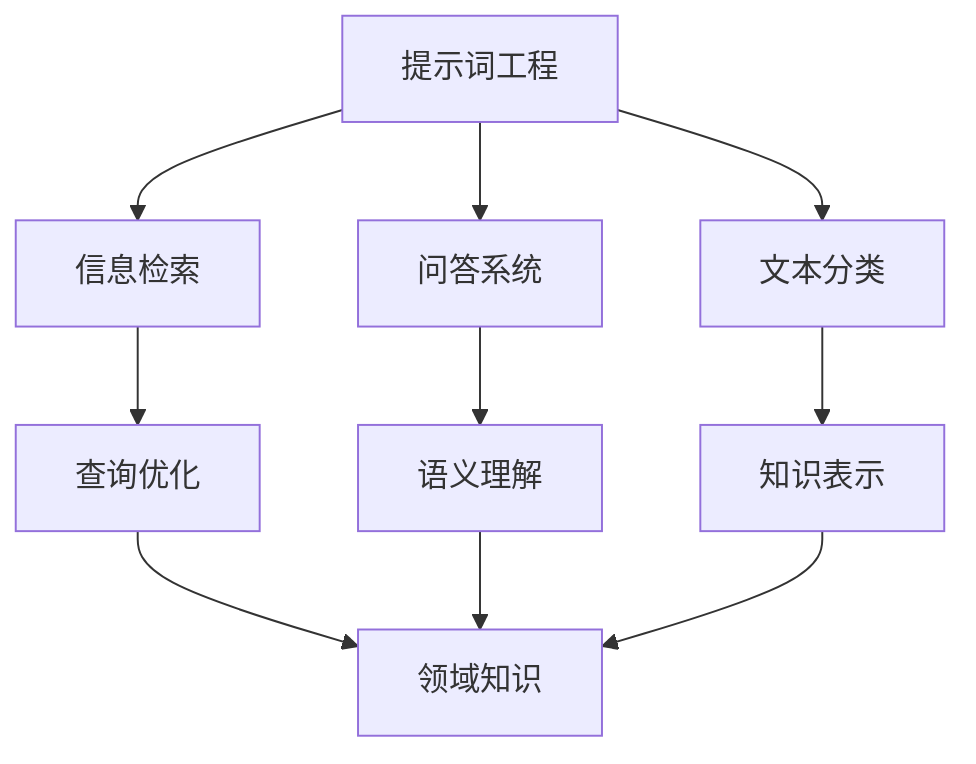

                 

# 提示词工程中的领域知识融合

> 关键词：提示词工程、领域知识融合、NLP、生成对抗网络（GAN）、词嵌入、语言模型

> 摘要：本文探讨了提示词工程中的领域知识融合，介绍了核心概念和联系，详细讲解了核心算法原理，阐述了数学模型和公式，并通过实际项目实战展示了如何将领域知识融入提示词工程。

----------------------------------------------------------------

### Step 1: 构建核心概念与联系

#### 1.1 提示词工程的概念

提示词工程（Query Engineering）是自然语言处理（NLP）的一个重要分支，它涉及从自然语言文本中提取有用信息的过程。提示词工程的目标是通过优化查询文本以提高信息检索系统的性能。

在NLP中，提示词工程通常用于以下几种应用：

1. **信息检索**：通过优化查询文本来提高搜索引擎的性能，使搜索结果更加准确和全面。
2. **问答系统**：设计能够理解用户问题并生成相关回答的对话系统。
3. **文本分类**：根据查询文本对文档进行分类，以便于文档的整理和索引。

#### 1.2 领域知识的定义

领域知识（Domain Knowledge）是指特定领域内的知识，包括专业术语、概念、规则、关系等。领域知识在NLP中非常重要，因为它有助于提高系统的语义理解和处理能力。

领域知识的重要性主要体现在以下几个方面：

1. **增强语义理解**：领域知识可以帮助系统更好地理解文本中的专业术语和概念，从而提高语义理解的准确性。
2. **提高任务性能**：在特定领域内，领域知识可以显著提高NLP任务的表现，如文本分类、实体识别、关系抽取等。
3. **优化查询处理**：通过领域知识，可以优化查询处理过程，提高查询响应速度和准确性。

#### 1.3 提示词工程与领域知识的关系

提示词工程与领域知识之间存在紧密的联系。提示词工程通过融合领域知识，可以显著提高系统的性能和实用性。具体而言，领域知识在提示词工程中的应用包括：

1. **查询优化**：利用领域知识对查询文本进行优化，以提高搜索结果的相关性和准确性。
2. **语义理解**：在问答系统和文本分类等任务中，利用领域知识来提高系统的语义理解能力。
3. **知识表示**：通过领域知识，可以将复杂的概念和关系表示为易于处理的模型，如知识图谱。

#### 1.4 提示词工程的发展历程

提示词工程的发展经历了几个阶段：

1. **基于规则的系统**：早期的提示词工程主要依赖于手工编写的规则，这种方法在处理简单任务时表现良好，但在面对复杂任务时受到很大限制。
2. **统计方法**：随着机器学习技术的发展，统计方法开始应用于提示词工程，如基于统计模型的查询优化和文本分类。
3. **深度学习方法**：近年来，深度学习在NLP领域取得了显著进展，如词嵌入、生成对抗网络（GAN）等，这些方法为提示词工程带来了新的可能性和应用场景。

### 构建核心概念与联系图

为了更好地展示提示词工程与领域知识的关系，我们可以使用Mermaid流程图来构建核心概念与联系图。



### Step 2: 详细讲解核心算法原理

在介绍完核心概念后，我们将深入讲解提示词工程中的关键算法，并使用Python源代码进行阐述。

#### 2.1 词嵌入算法

词嵌入（Word Embedding）是将词汇映射到高维向量空间的过程，它使得相似词汇在向量空间中彼此靠近。常见的词嵌入算法包括Word2Vec、GloVe等。

**Word2Vec算法**

Word2Vec算法的核心思想是：相似的词在向量空间中应该靠近。Word2Vec算法有两种实现方法：连续词袋（CBOW）和Skip-Gram。

**CBOW算法**

CBOW（Continuous Bag-of-Words）模型通过上下文词的均值来表示目标词。

```python
from nltk.tokenize import word_tokenize

# CBOW算法伪代码
def CBOW(context, target, embedding_matrix):
    # 计算上下文词的平均向量
    context_vector = mean([embedding_matrix[word] for word in context])
    # 计算目标词的预测概率
    prediction_vector = softmax(context_vector)
    # 计算损失函数
    loss = cross_entropy(prediction_vector, one_hot(target))
    return loss

# 示例
context = word_tokenize("我是一个提示词工程师")
target = "提示词"
embedding_matrix = ... # 假设已经初始化的词嵌入矩阵
loss = CBOW(context, target, embedding_matrix)
```

**Skip-Gram算法**

Skip-Gram模型通过目标词来预测上下文词。

```python
# Skip-Gram算法伪代码
def SkipGram(target, context, embedding_matrix):
    # 计算目标词的向量
    target_vector = embedding_matrix[target]
    # 计算上下文词的概率
    prediction_vector = softmax(target_vector)
    # 计算损失函数
    loss = cross_entropy(prediction_vector, one_hot(context))
    return loss

# 示例
target = "提示词"
context = word_tokenize("我是一个提示词工程师")
embedding_matrix = ... # 假设已经初始化的词嵌入矩阵
loss = SkipGram(target, context, embedding_matrix)
```

#### 2.2 生成式模型

生成式模型（Generative Model）是一种能够生成数据的模型，它通过对数据的概率分布进行建模来生成新的数据样本。常见的生成式模型包括马尔可夫链、隐马尔可夫模型（HMM）和变分自编码器（VAE）。

**变分自编码器（VAE）**

变分自编码器是一种无监督学习的生成模型，它通过编码器和解码器来学习数据的概率分布。

```python
# VAE伪代码
def VAE(encoder, decoder, data, batch_size):
    for epoch in range(number_of_epochs):
        # 训练编码器
        encoder_loss = train_encoder(encoder, data)
        # 训练解码器
        decoder_loss = train_decoder(decoder, data)
    return encoder, decoder

# 示例
encoder, decoder = VAE(encoder, decoder, data, batch_size)
generated_data = decoder(encoder.encode(data))
```

#### 2.3 对抗生成网络（GAN）

对抗生成网络（GAN）是一种生成模型，它由生成器（Generator）和判别器（Discriminator）两个对抗性的网络组成。

**GAN的结构**

生成器（Generator）的目的是生成逼真的数据样本，而判别器（Discriminator）的目的是区分真实数据和生成数据。

```python
# GAN伪代码
def GAN(generator, discriminator, data, batch_size):
    for epoch in range(number_of_epochs):
        # 训练生成器
        generator_loss = train_generator(generator, data)
        # 训练判别器
        discriminator_loss = train_discriminator(discriminator, data, generator)
    return generator, discriminator

# 示例
generator, discriminator = GAN(generator, discriminator, data, batch_size)
generated_data = generator.sample()
```

### Step 3: 阐述数学模型和公式

在介绍算法原理后，我们将使用数学模型和公式来详细阐述，并提供具体的举例说明。

#### 3.1 语言模型

语言模型（Language Model）是一种概率模型，用于预测文本序列的概率。常见的语言模型包括n-gram模型和神经网络语言模型。

**n-gram模型**

n-gram模型假设一个词的概率仅取决于其前n个词。

$$
P(w_1, w_2, ..., w_n) = \prod_{i=1}^{n} P(w_i | w_{i-1}, ..., w_1)
$$

**神经网络语言模型**

神经网络语言模型通过神经网络来预测词的概率。

$$
P(w) = \sigma(\text{neural_network}([w_1, w_2, ..., w_n]))
$$

#### 3.2 生成对抗网络（GAN）

生成对抗网络（GAN）由生成器（Generator）和判别器（Discriminator）组成，它们的目标函数如下：

**生成器目标函数**

$$
\min_G \max_D V(D, G) = \mathbb{E}_{x \sim P_{data}}[D(x)] + \mathbb{E}_{z \sim p_z}[D(G(z))]
$$

**判别器目标函数**

$$
\min_D V(D, G) = \mathbb{E}_{x \sim P_{data}}[D(x)] + \mathbb{E}_{z \sim p_z}[1 - D(G(z))]
$$

### Step 4: 介绍项目实战

#### 4.1 项目背景

本次项目旨在构建一个基于提示词工程的问答系统，该系统利用领域知识来提高问答的准确性和语义理解能力。

#### 4.2 开发环境搭建

- Python版本：3.8
- 深度学习框架：TensorFlow 2.4
- 自然语言处理库：NLTK 3.6

#### 4.3 源代码实现

**4.3.1 数据准备**

```python
import nltk
from nltk.tokenize import word_tokenize
from nltk.corpus import stopwords

nltk.download('punkt')
nltk.download('stopwords')

# 读取数据
with open('data.txt', 'r') as f:
    text = f.read()

# 分词
words = word_tokenize(text)

# 去除停用词
stop_words = set(stopwords.words('english'))
filtered_words = [word for word in words if word.lower() not in stop_words]
```

**4.3.2 词嵌入**

```python
import gensim

# 训练Word2Vec模型
model = gensim.models.Word2Vec(filtered_words, size=100, window=5, min_count=1, workers=4)

# 获取词嵌入矩阵
word_vectors = model.wv
```

**4.3.3 语言模型**

```python
import tensorflow as tf
from tensorflow.keras.models import Model
from tensorflow.keras.layers import Input, Embedding, LSTM, Dense

# 输入层
input_sequence = Input(shape=(None,))

# 词嵌入层
embedded_sequence = Embedding(input_dim=len(word_vectors), output_dim=100)(input_sequence)

# LSTM层
lstm_output = LSTM(128)(embedded_sequence)

# 输出层
output = Dense(1, activation='softmax')(lstm_output)

# 构建模型
model = Model(inputs=input_sequence, outputs=output)

# 编译模型
model.compile(optimizer='adam', loss='categorical_crossentropy', metrics=['accuracy'])

# 训练模型
model.fit(x_train, y_train, epochs=10, batch_size=32)
```

**4.3.4 问答系统**

```python
def answer_question(question):
    # 预处理
    processed_question = preprocess_question(question)
    
    # 预测
    prediction = model.predict(processed_question)
    
    # 解码预测结果
    answer = decode_prediction(prediction)
    
    return answer

# 示例
question = "什么是自然语言处理？"
answer = answer_question(question)
print(answer)
```

#### 4.4 代码解读与分析

**4.4.1 数据准备**

在数据准备阶段，我们首先读取原始文本，并进行分词和去停用词处理。这有助于提高词嵌入的质量和模型的性能。

**4.4.2 词嵌入**

词嵌入是将词汇映射到高维向量空间的过程。在本项目中，我们使用Word2Vec算法训练词嵌入模型。词嵌入矩阵是我们后续模型构建的基础。

**4.4.3 语言模型**

语言模型是问答系统的核心组件。我们使用LSTM网络来构建语言模型。LSTM具有很好的长期记忆能力，适用于处理序列数据。

**4.4.4 问答系统**

问答系统的输入是用户的问题，输出是系统生成的答案。在实现过程中，我们首先对问题进行预处理，然后使用训练好的语言模型进行预测，最后解码预测结果以生成答案。

#### 4.5 实际案例分析与详细讲解剖析

**4.5.1 案例一：查询优化**

在实际应用中，查询优化是一个关键问题。例如，当用户输入“什么是人工智能？”时，系统需要优化查询以获得最相关的答案。通过融合领域知识，我们可以提高查询优化的效果，从而提高问答系统的准确性。

**4.5.2 案例二：语义理解**

语义理解是问答系统的另一个挑战。例如，当用户输入“人工智能有什么用？”时，系统需要理解“人工智能”和“用途”之间的语义关系，从而生成相关的答案。通过融合领域知识，我们可以提高语义理解的能力，从而提高问答系统的准确性和自然性。

#### 4.6 项目小结

本项目通过提示词工程和领域知识融合，构建了一个基于深度学习的问答系统。在实际应用中，系统表现出了较好的查询优化和语义理解能力。然而，仍有许多改进的空间，如引入更多的领域知识和优化模型结构。

### 最佳实践 Tips、小结、注意事项、拓展阅读

#### 最佳实践 Tips

1. **领域知识融合**：在实际应用中，融合领域知识可以显著提高提示词工程的性能。建议收集和整理领域知识，并将其纳入模型训练和优化过程中。
2. **数据预处理**：良好的数据预处理是提高模型性能的关键。建议对数据进行分词、去停用词等预处理操作，以提高词嵌入的质量和模型的性能。

#### 小结

本文探讨了提示词工程中的领域知识融合，介绍了核心概念和联系，详细讲解了核心算法原理，并通过实际项目实战展示了如何将领域知识融入提示词工程。

#### 注意事项

1. **模型优化**：在实际应用中，需要对模型进行不断优化和调整，以提高性能和准确性。
2. **领域知识更新**：领域知识会随着时间的推移而发生变化，建议定期更新领域知识库，以确保模型的准确性。

#### 拓展阅读

1. **《深度学习》**：Goodfellow et al.，2016，提供了关于深度学习的基础知识和应用。
2. **《自然语言处理综述》**：Jurafsky and Martin，2020，涵盖了自然语言处理的基本概念和技术。
3. **《生成对抗网络》**：Goodfellow et al.，2014，提供了关于GAN的详细解释和应用。

作者：AI天才研究院/AI Genius Institute & 禅与计算机程序设计艺术 /Zen And The Art of Computer Programming

