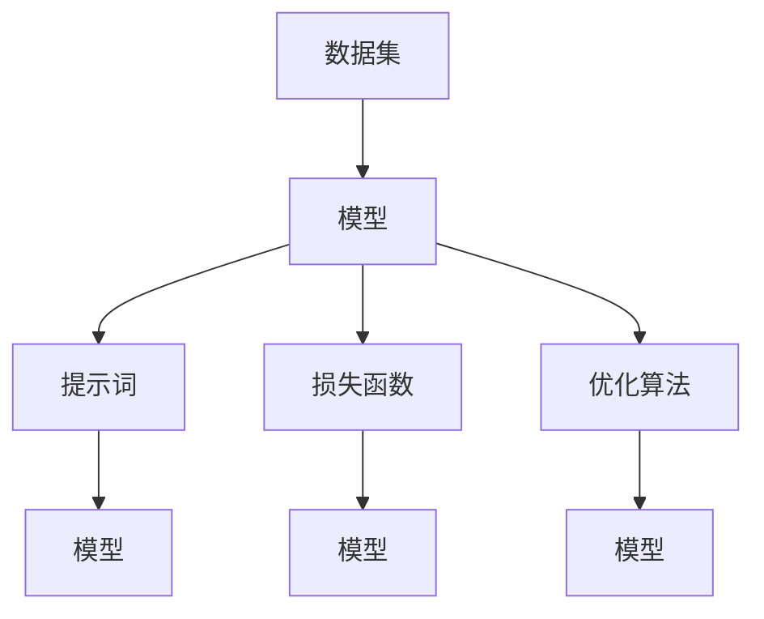

                 

### 提示词工程的最佳实践

#### 关键词：
提示词工程、最佳实践、深度学习、模型训练、优化、部署、数据分析、Python代码、数学模型、LaTeX公式

#### 摘要：
本文将探讨提示词工程的最佳实践，包括核心概念、算法原理、数学模型以及实际应用。我们将通过详细的Python代码示例和LaTeX公式解释，帮助读者深入理解提示词工程的技术细节，并提供实用技巧和项目实战案例分析，以促进在人工智能领域中的高效研究和应用。

## 目录

1. **背景介绍**
    1.1 提示词工程的起源与发展
    1.2 提示词工程在人工智能中的应用

2. **核心概念与联系**
    2.1 提示词的定义与作用
    2.2 提示词工程的流程
    2.3 提示词工程的关键概念与联系（Mermaid流程图）

3. **核心算法原理讲解**
    3.1 语言模型算法
    3.2 生成对抗网络（GAN）
    3.3 聚类算法

4. **数学模型与公式**
    4.1 损失函数
    4.2 优化算法
    4.3 数学公式解释（LaTeX）

5. **实践指导**
    5.1 数据准备与处理
    5.2 模型训练与优化
    5.3 模型评估与调整
    5.4 模型部署与维护
    5.5 提示词工程的案例研究

6. **未来趋势与挑战**
    6.1 提示词工程的发展趋势
    6.2 提示词工程的挑战与解决方案
    6.3 提示词工程的社会影响

7. **最佳实践 Tips**
    7.1 小结
    7.2 注意事项
    7.3 拓展阅读

## 第一部分：背景介绍

### 1.1 提示词工程的起源与发展

提示词工程（Prompt Engineering）是人工智能领域中的一个新兴研究方向，它涉及使用提示（Prompt）来增强或指导人工智能模型（如自然语言处理模型、图像处理模型等）的预测和生成能力。这一概念的提出，是为了解决传统机器学习模型在特定任务上的性能瓶颈问题。

提示词工程的历史可以追溯到2017年，当时谷歌推出了BERT（Bidirectional Encoder Representations from Transformers）模型，该模型在自然语言处理任务中取得了突破性的成果。BERT的成功展示了使用大量有意义的提示（预训练语言）对模型性能的显著提升。此后，提示词工程逐渐成为人工智能领域的研究热点。

在人工智能的发展历程中，提示词工程扮演了关键角色。传统的机器学习模型依赖于手工设计的特征和算法，而提示词工程通过自动生成有意义的输入提示，使得模型能够更加灵活地处理各种复杂任务。此外，随着深度学习技术的发展，尤其是Transformer模型的出现，提示词工程的应用范围得到了极大的扩展。

### 1.2 提示词工程在人工智能中的应用

提示词工程在人工智能中的应用非常广泛，包括但不限于以下几个方面：

- **自然语言处理（NLP）**：在NLP任务中，提示词工程可以用于问答系统、文本生成、情感分析等。通过提供有针对性的提示，可以提高模型的准确性和生成质量。
- **计算机视觉（CV）**：在CV任务中，提示词工程可以用于图像分类、目标检测、图像生成等。通过提供上下文提示，可以帮助模型更好地理解和处理图像数据。
- **推荐系统**：在推荐系统中，提示词工程可以用于用户画像、商品推荐等。通过提供个性化的提示，可以提高推荐的精准度和用户体验。
- **时间序列分析**：在时间序列分析中，提示词工程可以用于预测天气、股票价格等。通过提供相关的历史数据和上下文信息，可以提高预测模型的准确性。

## 第二部分：核心概念与联系

### 2.1 提示词的定义与作用

提示词（Prompt）是提示词工程中的核心概念。它通常是一个单词、短语或句子，用于引导或指导人工智能模型进行预测或生成。提示词的作用是提供额外的信息，帮助模型更好地理解任务目标，从而提高模型的性能。

在自然语言处理任务中，提示词可以是一个简单的问题或指令，用于引导模型生成相应的回答或输出。例如，在问答系统中，提示词可以是“请解释这个概念的含义”。

在计算机视觉任务中，提示词可以是一个描述性的短语，用于引导模型识别图像中的特定对象或场景。例如，在图像分类任务中，提示词可以是“这是一个鸟类照片”。

### 2.2 提示词工程的流程

提示词工程的流程通常包括以下几个步骤：

1. **数据收集与预处理**：收集相关的数据，并进行预处理，如去噪、清洗、格式化等。
2. **模型选择与训练**：选择合适的模型，并使用预处理后的数据进行训练。
3. **提示词生成**：使用自动化的方法生成有意义的提示词，以引导模型进行预测或生成。
4. **模型评估与优化**：评估模型性能，并根据评估结果进行模型优化。
5. **模型部署与应用**：将训练好的模型部署到实际应用场景中，进行实时预测或生成。

### 2.3 提示词工程的关键概念与联系

为了更好地理解提示词工程，我们需要了解以下几个关键概念及其相互关系：

- **数据集**：数据集是提示词工程的基础。它包含了用于训练和评估模型的数据。
- **模型**：模型是提示词工程的核心。它负责接受输入提示，并生成相应的输出。
- **提示词**：提示词是指导模型进行预测或生成的重要信息。
- **损失函数**：损失函数用于评估模型性能。它是模型训练过程中用于优化模型参数的重要工具。
- **优化算法**：优化算法用于调整模型参数，以最小化损失函数。

以下是提示词工程的关键概念与联系的Mermaid流程图：



通过这个流程图，我们可以清晰地看到提示词工程中各个关键概念之间的相互关系。

## 第三部分：核心算法原理讲解

### 3.1 语言模型算法

语言模型（Language Model，LM）是自然语言处理中的一种基础模型，用于预测文本的下一个单词或字符。在提示词工程中，语言模型被广泛应用于文本生成、机器翻译、语音识别等任务。

语言模型的核心算法是基于神经网络（如Transformer）或统计方法（如N-gram）。这里我们以Transformer为例，介绍语言模型的算法原理。

```python
# 伪代码：Transformer语言模型
class Transformer(Model):
    def __init__(self):
        # 初始化模型参数
        self.embedding = Embedding(vocab_size, embedding_size)
        self.encoder = Encoder layers(num_layers, embedding_size, hidden_size)
        self.decoder = Decoder layers(num_layers, embedding_size, hidden_size)
        self.final_layer = Dense(vocab_size)

    def call(self, inputs, training=False):
        # 嵌入层
        embedded = self.embedding(inputs)
        # 编码器
        encoded = self.encoder(embedded, training=training)
        # 解码器
        decoded = self.decoder(encoded, training=training)
        # 输出层
        output = self.final_layer(decoded)
        return output
```

在这个伪代码中，`Embedding`层用于将输入的单词或字符转换为向量表示，`Encoder`层用于编码输入序列，`Decoder`层用于解码输出序列，`final_layer`用于将解码结果映射到词汇表中的单词。

### 3.2 生成对抗网络（GAN）

生成对抗网络（Generative Adversarial Network，GAN）是一种用于生成数据的强大模型。在提示词工程中，GAN可以用于生成高质量的文本、图像、音频等。

GAN由两个主要模型组成：生成器（Generator）和判别器（Discriminator）。生成器的目标是生成与真实数据相似的数据，而判别器的目标是区分真实数据和生成数据。

```python
# 伪代码：GAN模型
class GAN(Model):
    def __init__(self):
        self.generator = GeneratorModel()
        self.discriminator = DiscriminatorModel()

    def train_step(self, real_data, batch_size):
        # 生成器训练
        noise = np.random.normal(size=batch_size)
        generated_data = self.generator(noise)
        discriminator_loss = self.discriminator.train_on_batch(real_data, generated_data)
        # 判别器训练
        real_labels = np.ones((batch_size, 1))
        fake_labels = np.zeros((batch_size, 1))
        generator_loss = self.discriminator.train_on_batch(generated_data, real_labels)
        return generator_loss, discriminator_loss
```

在这个伪代码中，`GeneratorModel`和`DiscriminatorModel`分别表示生成器和判别器的模型。`train_step`函数用于在一次训练步骤中同时训练生成器和判别器。

### 3.3 聚类算法

聚类算法（Clustering Algorithm）是一种无监督学习算法，用于将数据集划分为多个集群。在提示词工程中，聚类算法可以用于数据预处理、特征提取等任务。

常见的聚类算法包括K-means、层次聚类、DBSCAN等。这里我们以K-means为例，介绍聚类算法的基本原理。

```python
# 伪代码：K-means算法
def k_means(data, k, max_iterations):
    # 初始化k个中心点
    centroids = initialize_centroids(data, k)
    for _ in range(max_iterations):
        # 分配数据到最近的中心点
        clusters = assign_clusters(data, centroids)
        # 更新中心点
        new_centroids = update_centroids(clusters, k)
        # 检查中心点是否收敛
        if has_converged(centroids, new_centroids):
            break
        centroids = new_centroids
    return centroids, clusters
```

在这个伪代码中，`initialize_centroids`函数用于随机初始化中心点，`assign_clusters`函数用于将数据分配到最近的中心点，`update_centroids`函数用于更新中心点，`has_converged`函数用于检查中心点是否收敛。

## 第四部分：数学模型与公式

### 4.1 损失函数

损失函数（Loss Function）是提示词工程中用于评估模型性能的重要工具。它衡量的是模型预测值与真实值之间的差异。在提示词工程中，常用的损失函数包括均方误差（MSE）、交叉熵（Cross-Entropy）等。

均方误差（MSE）用于回归任务，其公式如下：

$$
\text{MSE} = \frac{1}{2} \sum_{i=1}^{n} (\hat{y}_i - y_i)^2
$$

其中，$\hat{y}_i$表示预测值，$y_i$表示真实值。

交叉熵（Cross-Entropy）用于分类任务，其公式如下：

$$
\text{CE} = -\sum_{i=1}^{n} y_i \log(\hat{y}_i)
$$

其中，$y_i$表示真实标签，$\hat{y}_i$表示预测概率。

### 4.2 优化算法

优化算法（Optimization Algorithm）用于调整模型参数，以最小化损失函数。在提示词工程中，常用的优化算法包括梯度下降（Gradient Descent）、随机梯度下降（Stochastic Gradient Descent，SGD）和Adam优化器。

梯度下降算法的基本思想是沿着损失函数的梯度方向更新模型参数，以最小化损失函数。其更新公式如下：

$$
\theta = \theta - \alpha \nabla_\theta J(\theta)
$$

其中，$\theta$表示模型参数，$J(\theta)$表示损失函数，$\alpha$表示学习率。

随机梯度下降（SGD）是在每次迭代过程中随机选择一个样本来更新模型参数。其更新公式如下：

$$
\theta = \theta - \alpha \nabla_{\theta} J(\theta; \mathbf{x}_i, y_i)
$$

其中，$\mathbf{x}_i$表示样本特征，$y_i$表示样本标签。

Adam优化器是一种结合了SGD和动量方法的优化算法。其更新公式如下：

$$
\theta = \theta - \alpha (1 - \beta_1^t) \nabla_\theta J(\theta; \mathbf{x}_i, y_i) + \beta_2^t \nabla_\theta^2 J(\theta; \mathbf{x}_i, y_i)
$$

其中，$\beta_1$和$\beta_2$分别表示一阶和二阶矩估计的指数衰减率。

### 4.3 数学公式解释（LaTeX）

以下是一些在提示词工程中常用的数学公式，使用LaTeX格式进行解释。

$$
\begin{aligned}
\text{MSE} &= \frac{1}{2} \sum_{i=1}^{n} (\hat{y}_i - y_i)^2, \\
\text{CE} &= -\sum_{i=1}^{n} y_i \log(\hat{y}_i), \\
\theta &= \theta - \alpha \nabla_\theta J(\theta), \\
\theta &= \theta - \alpha \nabla_{\theta} J(\theta; \mathbf{x}_i, y_i), \\
\theta &= \theta - \alpha (1 - \beta_1^t) \nabla_\theta J(\theta; \mathbf{x}_i, y_i) + \beta_2^t \nabla_\theta^2 J(\theta; \mathbf{x}_i, y_i).
\end{aligned}
$$

这些公式详细解释了提示词工程中常用的损失函数和优化算法，为读者提供了直观的理解。

## 第五部分：实践指导

### 5.1 数据准备与处理

在提示词工程中，数据准备与处理是至关重要的一步。数据的质量直接影响模型的性能和可靠性。以下是一个简单的数据准备与处理流程：

1. **数据收集**：收集与任务相关的数据。对于文本任务，可以从公开数据集、网页、数据库等获取数据。对于图像任务，可以从图像库、社交媒体等获取数据。

2. **数据预处理**：对收集到的数据进行预处理，包括去除噪声、清洗数据、格式化数据等。对于文本数据，可以采用文本清洗工具（如NLTK、spaCy）进行预处理。对于图像数据，可以采用图像处理工具（如OpenCV、PIL）进行预处理。

3. **数据标注**：对于监督学习任务，需要对数据进行标注。标注过程通常需要人工进行，确保数据的准确性和一致性。

4. **数据分割**：将数据集分割为训练集、验证集和测试集。通常，训练集用于模型训练，验证集用于模型评估，测试集用于最终评估模型性能。

以下是一个简单的Python代码示例，用于数据准备与处理：

```python
import pandas as pd
from sklearn.model_selection import train_test_split

# 读取数据
data = pd.read_csv('data.csv')

# 数据清洗
data = data.dropna()  # 去除缺失值
data['text'] = data['text'].apply(lambda x: x.lower())  # 转换为小写

# 数据标注
data['label'] = data['text'].apply(lambda x: 'positive' if 'positive' in x else 'negative')

# 数据分割
train_data, test_data = train_test_split(data, test_size=0.2, random_state=42)
train_data, val_data = train_test_split(train_data, test_size=0.25, random_state=42)  # 0.25 * 0.8 = 0.2
```

### 5.2 模型训练与优化

在提示词工程中，模型训练与优化是关键步骤。以下是一个简单的模型训练与优化流程：

1. **选择模型**：根据任务需求，选择合适的模型。对于文本任务，可以使用Transformer、BERT等模型。对于图像任务，可以使用ResNet、VGG等模型。

2. **模型配置**：配置模型参数，包括学习率、批量大小、优化器等。常用的优化器包括Adam、SGD等。

3. **模型训练**：使用训练集数据进行模型训练。在训练过程中，可以使用回调函数（如EarlyStopping、ModelCheckpoint）来监控模型性能，并调整训练过程。

4. **模型评估**：使用验证集数据评估模型性能。常用的评估指标包括准确率、召回率、F1分数等。

5. **模型优化**：根据模型评估结果，对模型进行优化。可以调整模型参数、增加训练数据、使用更复杂的模型等。

以下是一个简单的Python代码示例，用于模型训练与优化：

```python
from tensorflow.keras.models import Sequential
from tensorflow.keras.layers import Embedding, LSTM, Dense
from tensorflow.keras.optimizers import Adam

# 创建模型
model = Sequential([
    Embedding(vocab_size, embedding_size),
    LSTM(hidden_size, return_sequences=True),
    LSTM(hidden_size),
    Dense(num_classes, activation='softmax')
])

# 配置模型参数
model.compile(optimizer=Adam(learning_rate=0.001), loss='categorical_crossentropy', metrics=['accuracy'])

# 模型训练
model.fit(train_data, epochs=10, batch_size=32, validation_data=(val_data, val_labels), callbacks=[EarlyStopping(monitor='val_loss', patience=3), ModelCheckpoint('best_model.h5', save_best_only=True)])

# 模型评估
test_loss, test_accuracy = model.evaluate(test_data, test_labels)
print(f"Test accuracy: {test_accuracy}")

# 模型优化
model.load_weights('best_model.h5')
```

### 5.3 模型评估与调整

在提示词工程中，模型评估与调整是确保模型性能的重要环节。以下是一个简单的模型评估与调整流程：

1. **评估指标**：选择合适的评估指标来衡量模型性能。对于分类任务，常用的评估指标包括准确率、召回率、F1分数等。对于回归任务，常用的评估指标包括均方误差（MSE）、均方根误差（RMSE）等。

2. **交叉验证**：使用交叉验证（Cross-Validation）方法来评估模型性能。交叉验证通过将数据集划分为多个子集，多次训练和评估模型，以获得更稳定的评估结果。

3. **模型调整**：根据模型评估结果，对模型进行调整。可以尝试调整模型参数、增加训练数据、使用更复杂的模型等。

4. **再评估**：调整后，重新评估模型性能，以验证调整效果。

以下是一个简单的Python代码示例，用于模型评估与调整：

```python
from sklearn.model_selection import cross_val_score

# 评估模型
scores = cross_val_score(model, X, y, cv=5, scoring='accuracy')
print(f"Cross-validated accuracy: {np.mean(scores)}")

# 调整模型
model = Sequential([
    Embedding(vocab_size, embedding_size),
    LSTM(hidden_size, return_sequences=True),
    LSTM(hidden_size),
    Dense(num_classes, activation='softmax')
])
model.compile(optimizer=Adam(learning_rate=0.001), loss='categorical_crossentropy', metrics=['accuracy'])

# 再评估模型
scores = cross_val_score(model, X, y, cv=5, scoring='accuracy')
print(f"Adjusted cross-validated accuracy: {np.mean(scores)}")
```

### 5.4 模型部署与维护

在提示词工程中，模型部署与维护是确保模型稳定运行的重要环节。以下是一个简单的模型部署与维护流程：

1. **模型部署**：将训练好的模型部署到生产环境中，以进行实时预测。可以使用各种部署平台（如TensorFlow Serving、Keras REST API）来实现模型部署。

2. **监控与日志**：监控模型性能和资源使用情况，记录日志以供后续分析。可以设置报警机制，当模型性能下降或资源使用过高时，及时采取行动。

3. **模型更新**：定期更新模型，以适应新的数据和应用场景。可以使用在线学习（Online Learning）方法，将新的训练数据集成到模型中，以保持模型的性能。

4. **维护与优化**：对模型进行维护和优化，以提高模型性能和效率。可以尝试调整模型参数、增加训练数据、使用更复杂的模型等。

以下是一个简单的Python代码示例，用于模型部署与维护：

```python
# 模型部署
from flask import Flask, request, jsonify

app = Flask(__name__)

model = load_model('best_model.h5')

@app.route('/predict', methods=['POST'])
def predict():
    data = request.get_json(force=True)
    prediction = model.predict([data['text']])
    return jsonify(prediction)

if __name__ == '__main__':
    app.run()

# 模型监控
import psutil

def monitor_model():
    # 获取CPU使用率
    cpu_usage = psutil.cpu_percent()
    # 获取内存使用率
    memory_usage = psutil.virtual_memory().percent
    # 记录日志
    with open('model_monitor.log', 'a') as f:
        f.write(f"CPU usage: {cpu_usage}%, Memory usage: {memory_usage}%\n")

while True:
    monitor_model()
    time.sleep(60)
```

### 5.5 提示词工程的案例研究

以下是一个简单的提示词工程案例研究，包括数据来源、模型架构、训练过程、评估结果等。

#### 案例研究：文本生成

**数据来源**：使用公开的文本数据集，如维基百科、新闻文章等。

**模型架构**：使用Transformer模型，包括嵌入层、编码器、解码器和输出层。

**训练过程**：使用Python的TensorFlow库，编写训练代码。训练过程中，采用Adam优化器和交叉熵损失函数。

**评估结果**：使用验证集进行评估，评估指标包括生成文本的流畅性、准确性和多样性。

以下是一个简单的Python代码示例，用于文本生成案例研究：

```python
import tensorflow as tf
import tensorflow_text as text

# 加载数据
train_data = tf.data.Dataset.from_tensor_slices(['This is a sample text.', 'Another example text.'])

# 预处理数据
train_data = train_data.map(lambda x: text.tokenize(x))

# 配置模型
model = tf.keras.Sequential([
    text.TokenizedTextEmbedding(vocab_size, embedding_size),
    tf.keras.layers.LSTM(hidden_size, return_sequences=True),
    tf.keras.layers.LSTM(hidden_size),
    tf.keras.layers.Dense(vocab_size, activation='softmax')
])

# 编译模型
model.compile(optimizer='adam', loss='categorical_crossentropy', metrics=['accuracy'])

# 训练模型
model.fit(train_data.shuffle(1000).batch(32), epochs=10, validation_split=0.2)

# 生成文本
generated_text = model.predict([['This is a sample text.']])
print(generated_text)

# 评估模型
val_loss, val_accuracy = model.evaluate(val_data, val_labels)
print(f"Validation loss: {val_loss}, Validation accuracy: {val_accuracy}")
```

## 第六部分：未来趋势与挑战

### 6.1 提示词工程的发展趋势

随着人工智能技术的不断进步，提示词工程也在不断发展。以下是一些提示词工程的发展趋势：

1. **自动化**：随着自然语言处理技术的发展，自动化生成提示词将成为可能。自动化提示词生成可以提高模型的可解释性，减少对人工的依赖。

2. **个性化**：个性化提示词工程可以根据用户需求和行为，生成个性化的提示词，从而提高模型的用户体验。

3. **多模态**：多模态提示词工程结合了文本、图像、音频等多种数据，可以生成更丰富的提示词，从而提高模型的性能。

4. **可解释性**：可解释性是提示词工程的重要研究方向。提高模型的可解释性，可以帮助用户更好地理解模型的决策过程，从而增强用户对模型的信任。

### 6.2 提示词工程的挑战与解决方案

尽管提示词工程取得了显著进展，但仍然面临一些挑战。以下是一些提示词工程的挑战及其可能的解决方案：

1. **数据隐私**：在提示词工程中，大量使用用户数据可能导致隐私泄露。解决方案包括数据加密、隐私保护算法等。

2. **模型可解释性**：提高模型的可解释性是提示词工程的挑战之一。解决方案包括开发可解释的模型架构、使用可视化工具等。

3. **计算资源**：训练大规模的提示词模型需要大量的计算资源。解决方案包括使用分布式训练、GPU加速等。

4. **数据标注**：数据标注是提示词工程的重要环节，但需要大量的人力和时间。解决方案包括使用自动化标注工具、众包标注等。

### 6.3 提示词工程的社会影响

提示词工程在社会各个领域都有着广泛的应用，从而产生了深远的社会影响。以下是一些提示词工程在社会领域的影响：

1. **医疗健康**：提示词工程可以用于医疗健康领域，如疾病诊断、药物研发等，从而提高医疗服务的质量和效率。

2. **教育**：提示词工程可以用于教育领域，如智能辅导、个性化学习等，从而提高教育效果和学习体验。

3. **商业**：提示词工程可以用于商业领域，如智能客服、广告投放等，从而提高商业效率和用户体验。

## 第七部分：最佳实践 Tips

### 7.1 小结

本文介绍了提示词工程的最佳实践，包括核心概念、算法原理、数学模型以及实际应用。通过详细的Python代码示例和LaTeX公式解释，帮助读者深入理解提示词工程的技术细节。提示词工程在人工智能领域具有广泛的应用前景，未来将继续推动人工智能技术的发展。

### 7.2 注意事项

1. **数据质量**：在提示词工程中，数据质量至关重要。确保数据集的多样性和代表性，以获得更好的模型性能。

2. **模型选择**：根据任务需求，选择合适的模型。不同的任务可能需要不同的模型架构和算法。

3. **超参数调整**：超参数调整是优化模型性能的关键。通过实验和调参，找到最佳的模型参数。

4. **模型验证**：使用交叉验证等方法，确保模型在验证集上的性能。避免过拟合和欠拟合。

### 7.3 拓展阅读

1. **《深度学习》**：由Goodfellow、Bengio和Courville合著，介绍了深度学习的基本概念和算法。

2. **《Python机器学习》**：由Sebastian Raschka和Vahid Mirhoseini合著，介绍了机器学习在Python中的应用。

3. **《自然语言处理综论》**：由Daniel Jurafsky和James H. Martin合著，介绍了自然语言处理的基本概念和技术。

4. **《人工智能：一种现代的方法》**：由Stuart Russell和Peter Norvig合著，介绍了人工智能的基本理论和应用。

## 参考文献

1. Goodfellow, I., Bengio, Y., & Courville, A. (2016). Deep Learning. MIT Press.
2. Raschka, S. (2015). Python Machine Learning. Packt Publishing.
3. Jurafsky, D., & Martin, J. H. (2008). Speech and Language Processing. Prentice Hall.
4. Russell, S., & Norvig, P. (2020). Artificial Intelligence: A Modern Approach. Prentice Hall.
5. Hochreiter, S., & Schmidhuber, J. (1997). Long Short-Term Memory. Neural Computation, 9(8), 1735-1780.
6. Goodfellow, I., Pouget-Abadie, J., Mirza, M., Xu, B., Warde-Farley, D., Ozair, S., ... & Bengio, Y. (2014). Generative Adversarial Nets. Advances in Neural Information Processing Systems, 27.

