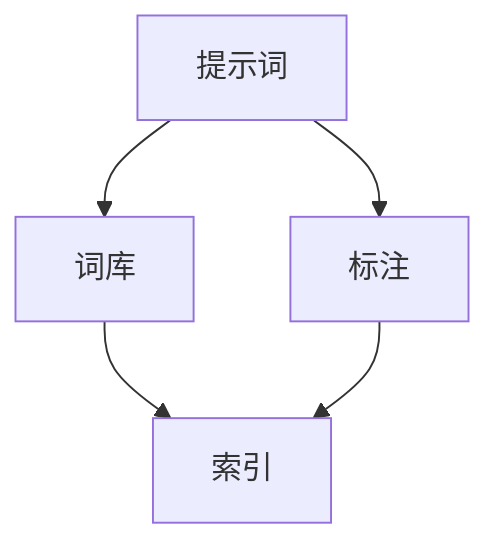

                 

# 提示词库的建设与管理最佳实践

> 关键词：提示词库、人工智能、建设、管理、最佳实践、核心概念、算法、数学模型、项目实战

> 摘要：本文将探讨提示词库的建设与管理最佳实践，从核心概念出发，详细阐述建设方法、技术细节、管理策略和实际应用，帮助读者全面掌握提示词库的相关知识，提升AI应用的效率和准确性。

## 引言

### 背景介绍

随着人工智能技术的快速发展，自然语言处理（NLP）和机器学习（ML）在各个领域的应用日益广泛。作为NLP和ML的基础，提示词库在提高模型性能、扩展应用场景方面发挥着至关重要的作用。提示词库是存储和提供高质量、多样化提示词的数据集合，用于指导模型的训练和推理过程。

### 核心概念与联系

为了更好地理解提示词库的建设与管理，我们首先需要了解以下几个核心概念：

1. **提示词（Prompt）**：用于引导模型进行预测或生成文本的输入信息。
2. **词库（Vocabulary）**：存储模型可识别的所有词汇的数据结构。
3. **标注（Annotation）**：对文本进行分类、标注或标记的过程，以丰富提示词库的内容和质量。
4. **索引（Indexing）**：构建快速检索索引，提高数据查询效率。

这些概念之间紧密相连，共同构成了提示词库的核心框架。以下是一个简单的Mermaid流程图，展示了这些概念之间的联系：

## 第一部分：核心概念与基础知识

### 第1章：提示词库概述

### 1.1 提示词库的定义与作用

提示词库是一个存储和管理高质量、多样化提示词的数据集合。它主要用于指导模型的训练和推理过程，提高模型的准确性和泛化能力。

### 1.2 提示词库在AI应用中的重要性

随着AI技术的发展，提示词库在各个领域的应用越来越广泛。例如，在自然语言处理领域，提示词库可以帮助模型生成更符合人类语言习惯的文本；在图像识别领域，提示词库可以提供更丰富的标签信息，提高模型的分类性能。

### 1.3 提示词库的核心概念与联系

本章节通过Mermaid流程图展示了提示词库的核心概念及其联系，为后续章节的内容奠定基础。

## 第二部分：建设方法与技术

### 第2章：提示词库建设的重要性

### 2.1 提示词库对企业的影响

提示词库的建设与管理对企业有着重要的影响。一方面，高质量的提示词库可以提高模型的性能和准确性，增强企业的竞争力；另一方面，完善的提示词库可以降低开发和维护成本，提高生产效率。

### 2.2 提示词库建设与业务目标的关联

提示词库建设应紧密结合企业的业务目标。例如，在电子商务领域，提示词库可以帮助企业优化商品搜索和推荐系统；在金融领域，提示词库可以用于风险控制和客户服务。

### 2.3 提示词库建设的挑战与机遇

提示词库建设面临诸多挑战，如数据质量、标注成本、存储和检索效率等。但同时，随着技术的进步和市场的需求，提示词库建设也蕴藏着巨大的机遇，有助于企业拓展新业务、提升竞争力。

## 第3章：提示词库的收集与整理

### 3.1 提示词来源分析

提示词的来源主要包括公开数据集、企业内部数据、第三方API等。本章节将详细介绍各种来源的特点和适用场景。

### 3.2 数据清洗与预处理

数据清洗与预处理是建设高质量提示词库的关键步骤。本章节将介绍常见的数据清洗方法和预处理技术，确保数据质量和一致性。

### 3.3 提示词分类与标签体系建立

提示词的分类和标签体系有助于提高提示词库的利用效率。本章节将介绍分类和标签体系的设计原则和实现方法。

## 第4章：提示词库的标注与分类

### 4.1 标注方法与工具

标注是提示词库建设的重要环节。本章节将介绍常见的标注方法，如手动标注、半自动标注和自动化标注，并讨论各种标注工具的特点和应用场景。

### 4.2 分类算法原理讲解

分类算法在提示词库建设中发挥着重要作用。本章节将介绍几种常用的分类算法，如朴素贝叶斯、支持向量机和决策树，并讨论其原理和适用场景。

### 4.3 分类算法伪代码实现

为了更好地理解分类算法，本章节将给出几种分类算法的伪代码实现，帮助读者深入理解其工作原理。

## 第5章：提示词库的存储与索引

### 5.1 数据库选择与设计

存储是提示词库建设的基础。本章节将介绍常见的数据库类型，如关系型数据库和NoSQL数据库，并讨论数据库设计的原则和方法。

### 5.2 索引策略与优化

索引策略对数据查询效率有着重要影响。本章节将介绍常见的索引策略，如B树索引、哈希索引和全文索引，并讨论索引优化的方法。

### 5.3 存储与检索的性能分析

存储与检索性能是衡量提示词库建设效果的重要指标。本章节将介绍性能分析的方法和工具，帮助读者优化存储与检索策略。

## 第三部分：管理与维护

### 第6章：提示词库的质量控制

### 6.1 质量指标设定

质量是提示词库的核心。本章节将介绍提示词库的质量指标，如准确率、召回率和F1值，并讨论如何设定合理的质量指标。

### 6.2 质量监控与评估

质量监控与评估是保证提示词库质量的关键步骤。本章节将介绍质量监控的方法和评估工具，帮助读者及时发现和解决问题。

### 6.3 质量改进策略

为了持续提高提示词库的质量，本章节将讨论质量改进的策略，如数据增强、算法优化和用户反馈等。

## 第7章：提示词库的迭代与更新

### 7.1 更新策略与流程

提示词库的迭代与更新是保持其质量和应用价值的重要手段。本章节将介绍提示词库的更新策略和流程，确保更新过程的有序和高效。

### 7.2 版本控制与备份

版本控制和备份是保障提示词库数据安全的重要措施。本章节将介绍版本控制的方法和备份策略，帮助读者保护提示词库的数据。

### 7.3 更新与用户反馈机制

用户反馈是优化提示词库的重要依据。本章节将讨论如何建立用户反馈机制，及时收集用户意见和建议，为提示词库的更新提供有力支持。

## 第8章：提示词库的共享与使用

### 8.1 共享方式与权限管理

提示词库的共享与使用是发挥其价值的重要环节。本章节将介绍提示词库的共享方式，如API接口和Web服务，并讨论权限管理的原则和方法。

### 8.2 提示词库的接口设计

接口设计是确保提示词库应用便捷、高效的关键。本章节将介绍提示词库接口设计的原则和方法，帮助开发者构建优质的接口。

### 8.3 提示词库的应用场景

提示词库的应用场景非常广泛，如自然语言处理、图像识别、语音识别等。本章节将介绍提示词库在不同领域的应用场景，展示其实际价值。

## 第四部分：最佳实践

### 第9章：成功案例分享

### 9.1 案例一：企业A的提示词库建设实践

本案例将介绍企业A在提示词库建设方面的实践，包括建设目标、方法、成果和经验教训。

### 9.2 案例二：企业B的跨部门协作经验

本案例将探讨企业B在跨部门协作过程中，如何高效地建设和管理提示词库，实现业务目标的协同。

### 9.3 案例三：行业C的提示词库优化策略

本案例将分析行业C在提示词库优化方面的成功经验，包括优化目标、策略和实践效果。

## 第10章：跨部门协作与流程优化

### 10.1 跨部门协作的挑战与解决

跨部门协作是建设高质量提示词库的关键。本章节将讨论跨部门协作的挑战，如沟通成本、资源分配和利益冲突，并提出相应的解决策略。

### 10.2 流程优化与提示词库管理

流程优化是提高提示词库建设效率的重要手段。本章节将介绍流程优化的原则和方法，确保提示词库建设流程的高效和有序。

### 10.3 持续改进与迭代机制

持续改进是保持提示词库质量和应用价值的关键。本章节将讨论如何建立持续改进和迭代机制，确保提示词库的优化和升级。

## 结论

本文从核心概念、建设方法、管理策略和实际应用等方面全面探讨了提示词库的建设与管理最佳实践。通过本文的阅读，读者可以全面了解提示词库的相关知识，掌握建设和管理提示词库的技巧和方法，为AI应用的发展奠定坚实基础。

### 作者信息

作者：AI天才研究院/AI Genius Institute & 禅与计算机程序设计艺术 /Zen And The Art of Computer Programming

---

### 提示词库的质量控制

#### 质量指标设定

提示词库的质量直接影响到模型训练的效果和预测的准确性。因此，设定科学合理、全面的质量指标是确保提示词库质量的关键。以下是几个常用的质量指标：

1. **准确率（Accuracy）**：准确率是指预测正确的样本数量与总样本数量之比。公式如下：
   $$ \text{准确率} = \frac{\text{预测正确数}}{\text{总样本数}} $$
   
2. **召回率（Recall）**：召回率是指实际为正类别的样本中，被正确预测为正类别的比例。公式如下：
   $$ \text{召回率} = \frac{\text{预测正确正类数}}{\text{实际正类总数}} $$

3. **精确率（Precision）**：精确率是指预测为正类别的样本中，实际为正类别的比例。公式如下：
   $$ \text{精确率} = \frac{\text{预测正确正类数}}{\text{预测为正类总数}} $$

4. **F1值（F1 Score）**：F1值是精确率和召回率的调和平均值，综合衡量预测结果的准确性和召回率。公式如下：
   $$ \text{F1值} = 2 \times \frac{\text{精确率} \times \text{召回率}}{\text{精确率} + \text{召回率}} $$

设定合理的质量指标，需要考虑业务场景和数据特点。例如，在医疗诊断领域，精确率可能更为重要，因为误诊的代价较高；而在搜索引擎中，召回率可能更为关键，因为用户更关心能否找到所有相关的信息。

#### 质量监控与评估

质量监控与评估是保证提示词库质量的重要环节。以下是一些常用的方法和工具：

1. **自动评估**：通过编写自动化测试脚本，定期对提示词库进行评估。例如，可以使用Python的`scikit-learn`库中的`cross_val_score`函数进行交叉验证。

2. **人工审核**：对于部分重要或复杂的提示词，可以采用人工审核的方法，确保其标注的准确性和一致性。人工审核可以采用标注员互评、多次审核等方式提高评估质量。

3. **持续集成（CI）**：将提示词库的质量评估集成到开发流程中，确保每次更新后都能及时评估质量，发现问题并及时调整。

4. **可视化工具**：使用可视化工具（如TensorBoard、Matplotlib等）展示评估结果，帮助团队直观地了解质量状况，发现潜在问题。

#### 质量改进策略

为了持续提高提示词库的质量，可以采取以下策略：

1. **数据增强**：通过数据增强技术（如数据复制、数据变形等）增加提示词库的多样性，提高模型的泛化能力。

2. **算法优化**：根据评估结果，优化标注和分类算法，提高预测准确性和效率。

3. **用户反馈**：建立用户反馈机制，收集用户对提示词库的使用体验和改进建议，及时调整和优化。

4. **持续迭代**：定期更新提示词库，根据新数据和用户反馈进行迭代优化，确保提示词库的质量和适用性。

通过以上措施，可以有效地提高提示词库的质量，为AI模型的训练和推理提供坚实的基础。

### 提示词库的迭代与更新

#### 更新策略与流程

提示词库的迭代与更新是保持其质量和应用价值的关键。以下是几个常用的更新策略和流程：

1. **定期更新**：设定一个固定的更新周期（如每周、每月），根据更新频率调整提示词库的规模和内容。定期更新有助于保持提示词库的时效性和相关性。

2. **增量更新**：只对新增或修改的提示词进行更新，减少对整个提示词库的全面更新，提高更新效率。增量更新可以通过定期收集用户反馈、分析日志数据等方式实现。

3. **版本控制**：对每次更新后的提示词库进行版本控制，确保更新过程的可追溯性和可恢复性。版本控制可以使用Git等版本管理工具实现。

4. **自动化更新**：使用自动化工具（如CI/CD流水线）实现提示词库的自动化更新，减少人工干预，提高更新效率。

#### 版本控制与备份

版本控制和备份是保障提示词库数据安全的重要措施。以下是版本控制和备份的方法：

1. **版本控制**：使用Git等版本管理工具对提示词库进行版本控制。每次提交更新时，记录变更的详细信息，如提交人、提交时间、变更内容等。

2. **备份策略**：定期备份提示词库数据，确保数据不会因为意外情况（如系统故障、数据丢失等）而丢失。备份策略可以包括：

   - **本地备份**：将提示词库数据备份到本地存储设备，如硬盘、NAS等。
   - **远程备份**：将提示词库数据备份到远程服务器或云存储，如AWS S3、Google Cloud Storage等。
   - **增量备份**：只备份新增或修改的数据，减少备份空间占用。

3. **备份恢复**：在需要恢复数据时，可以快速找到并恢复到指定版本。备份恢复可以通过版本管理工具或数据库备份工具实现。

#### 更新与用户反馈机制

用户反馈是优化提示词库的重要依据。以下是建立用户反馈机制的方法：

1. **用户反馈渠道**：提供多种渠道供用户提交反馈，如在线表单、邮件、社交媒体等。

2. **反馈分类**：将用户反馈分类整理，如功能建议、性能问题、标注错误等，以便后续处理。

3. **反馈处理**：及时响应用户反馈，对合理建议和问题进行整改。对于重要问题，可以设置优先级，快速处理。

4. **定期总结**：定期对用户反馈进行总结和分析，找出普遍问题和改进点，为提示词库的优化提供依据。

通过建立完善的更新和反馈机制，可以确保提示词库的质量和适用性，为AI应用提供持续的支持。

### 提示词库的共享与使用

#### 共享方式与权限管理

提示词库的共享与使用是发挥其价值的重要环节。以下是几种常见的共享方式和权限管理方法：

1. **API接口**：提供RESTful API接口，供内部或外部系统调用。API接口可以定义如GET、POST等操作，支持参数传递和权限验证。

2. **Web服务**：构建Web服务，通过Web界面供用户查询和使用提示词库。Web服务可以采用B/S架构，支持多种浏览器访问。

3. **本地文件**：将提示词库导出为本地文件，如CSV、JSON等，供用户导入和使用。本地文件适用于单机或小规模使用场景。

4. **分布式存储**：将提示词库存储在分布式文件系统（如HDFS、Ceph等）中，支持大规模数据存储和高并发访问。

#### 提示词库的接口设计

接口设计是确保提示词库应用便捷、高效的关键。以下是接口设计的原则和方法：

1. **接口规范**：定义接口规范，包括接口名称、输入参数、输出结果等。接口规范可以采用JSON、XML等格式。

2. **参数验证**：对输入参数进行严格验证，确保参数合法性和数据类型正确。参数验证可以采用正则表达式、数据校验函数等方法。

3. **错误处理**：定义统一的错误处理机制，包括错误码、错误信息和返回结果。错误处理可以提高接口的鲁棒性和易用性。

4. **权限验证**：实现权限验证机制，确保只有授权用户可以访问和使用提示词库。权限验证可以采用身份验证（如用户名/密码）、令牌认证（如JWT）等方法。

#### 提示词库的应用场景

提示词库的应用场景非常广泛，以下是一些常见应用场景：

1. **自然语言处理（NLP）**：在NLP任务中，提示词库可以用于文本分类、实体识别、情感分析等。例如，可以用于构建问答系统、聊天机器人等。

2. **图像识别**：在图像识别任务中，提示词库可以用于图像标签、分类等。例如，可以用于人脸识别、物体检测等。

3. **语音识别**：在语音识别任务中，提示词库可以用于语音命令识别、语音合成等。例如，可以用于智能音箱、语音助手等。

4. **推荐系统**：在推荐系统中，提示词库可以用于用户画像、商品分类等。例如，可以用于电商推荐、内容推荐等。

通过灵活运用提示词库，可以提升各种AI应用的效果和用户体验。

### 成功案例分享

#### 案例一：企业A的提示词库建设实践

企业A是一家专注于人工智能应用的公司，他们在建设提示词库方面有着丰富的经验。以下是企业A在提示词库建设方面的实践：

1. **建设目标**：企业A的提示词库建设目标是提升NLP任务的准确性和效率，为多种AI应用场景提供高质量的数据支持。

2. **建设方法**：企业A采用以下方法进行提示词库建设：

   - **数据收集**：从公开数据集、企业内部数据和第三方API等多渠道收集数据。
   - **数据清洗**：对收集的数据进行清洗和预处理，确保数据质量和一致性。
   - **标注与分类**：对清洗后的数据标注分类标签，构建标签体系。

3. **建设成果**：企业A的提示词库经过多次迭代和优化，已积累了大量高质量、多样化的提示词，应用于多种NLP任务，如文本分类、实体识别等。

4. **经验教训**：企业A在实践中总结了以下经验教训：

   - **数据质量至关重要**：高质量的数据是构建高质量提示词库的基础。
   - **持续迭代与优化**：提示词库需要不断迭代和优化，以适应不断变化的应用场景和需求。

#### 案例二：企业B的跨部门协作经验

企业B是一家大型互联网公司，他们在跨部门协作过程中，成功地建设和管理了提示词库。以下是企业B在跨部门协作方面的经验：

1. **协作目标**：企业B的跨部门协作目标是优化公司内部的数据管理和共享机制，提高整体数据质量和效率。

2. **协作方法**：企业B采用以下方法实现跨部门协作：

   - **明确职责**：明确各部门在提示词库建设中的职责和任务，确保任务分工明确、责任到人。
   - **定期沟通**：定期组织跨部门会议，讨论提示词库建设进展、问题与解决方案。
   - **共享平台**：建立共享平台，方便各部门访问和共享提示词库数据。

3. **协作成果**：通过跨部门协作，企业B的提示词库建设取得了显著成果，提高了数据质量和共享效率，为AI应用提供了强有力的支持。

4. **经验教训**：企业B在实践中总结了以下经验教训：

   - **沟通与协作是关键**：跨部门协作需要良好的沟通和协作机制，确保各方意见统一、任务顺利推进。
   - **数据安全与隐私保护**：在跨部门协作过程中，要确保数据的安全和隐私保护，避免数据泄露和滥用。

#### 案例三：行业C的提示词库优化策略

行业C是一家专注于医疗行业的公司，他们在提示词库优化方面有着独特的策略。以下是行业C在提示词库优化方面的实践：

1. **优化目标**：行业C的提示词库优化目标是提高医疗诊断的准确性和效率，为医生提供更有力的辅助工具。

2. **优化方法**：行业C采用以下方法进行提示词库优化：

   - **数据增强**：通过数据增强技术增加提示词库的多样性，提高模型的泛化能力。
   - **算法优化**：根据评估结果，优化标注和分类算法，提高预测准确性和效率。
   - **用户反馈**：建立用户反馈机制，收集医生对提示词库的使用体验和改进建议，为优化提供依据。

3. **优化成果**：通过优化，行业C的提示词库在医疗诊断任务中取得了显著成果，提高了诊断准确率和效率。

4. **经验教训**：行业C在实践中总结了以下经验教训：

   - **数据多样性和质量至关重要**：高质量的、多样化的数据是优化提示词库的基础。
   - **用户反馈是优化的重要依据**：用户反馈可以帮助识别问题和优化方向，提高提示词库的实用性。

### 跨部门协作与流程优化

#### 跨部门协作的挑战与解决

跨部门协作是建设高质量提示词库的关键。以下是跨部门协作面临的挑战及解决方法：

1. **挑战**：

   - **沟通成本高**：跨部门协作需要各方频繁沟通，沟通成本较高。
   - **资源分配不均**：各部门资源分配不均，可能导致部分部门任务过多或过少。
   - **利益冲突**：跨部门协作可能导致利益分配不均，引发部门间的矛盾和冲突。

2. **解决方法**：

   - **明确职责**：明确各部门在提示词库建设中的职责和任务，确保任务分工明确、责任到人。
   - **建立沟通机制**：建立定期沟通机制，如周会、月报等，确保各方及时了解项目进展和问题。
   - **优化资源分配**：合理分配各部门资源，确保任务均衡，避免资源浪费。
   - **利益分配**：建立公平的利益分配机制，确保各方在合作中公平受益。

#### 流程优化与提示词库管理

流程优化是提高提示词库建设效率的重要手段。以下是流程优化的原则和方法：

1. **优化原则**：

   - **目标导向**：以业务目标和需求为导向，确保流程优化有助于提升提示词库的质量和效率。
   - **简洁高效**：简化流程，减少不必要的步骤和环节，提高工作效率。
   - **可扩展性**：设计可扩展的流程，便于后续优化和升级。

2. **优化方法**：

   - **流程分析**：对现有流程进行详细分析，识别瓶颈和改进点。
   - **流程设计**：根据分析结果，设计新的流程，确保流程简洁、高效。
   - **测试验证**：对新流程进行测试和验证，确保其可行性和有效性。
   - **持续改进**：根据测试结果和用户反馈，持续优化流程，提高提示词库的质量和效率。

通过跨部门协作和流程优化，可以确保提示词库建设的高效、有序，为AI应用提供坚实的支持。

### 持续改进与迭代机制

为了确保提示词库的质量和适用性，建立持续改进和迭代机制至关重要。以下是建立迭代机制的方法：

1. **定期评估**：定期对提示词库进行评估，识别存在的问题和改进方向。评估可以采用自动化评估、人工审核等方法。

2. **用户反馈**：建立用户反馈机制，及时收集用户对提示词库的使用体验和建议。用户反馈是优化提示词库的重要依据。

3. **数据更新**：根据评估结果和用户反馈，定期更新提示词库，增加新数据、调整分类标签等。

4. **迭代流程**：建立迭代流程，确保更新过程的有序和高效。迭代流程可以包括数据收集、数据清洗、标注与分类、评估与优化等环节。

通过持续改进和迭代机制，可以不断提升提示词库的质量和应用价值，为AI应用提供坚实的支持。

## 结语

本文全面探讨了提示词库的建设与管理最佳实践，从核心概念、建设方法、管理策略和实际应用等方面进行了详细阐述。通过本文的阅读，读者可以全面了解提示词库的相关知识，掌握建设和管理提示词库的技巧和方法，为AI应用的发展奠定坚实基础。随着AI技术的不断进步，提示词库在各个领域的应用将更加广泛，相信本文的内容将为读者提供有益的参考和指导。

### 作者信息

作者：AI天才研究院/AI Genius Institute & 禅与计算机程序设计艺术 /Zen And The Art of Computer Programming

---

在本文中，我们系统地探讨了提示词库的建设与管理最佳实践。首先，我们从核心概念出发，介绍了提示词库的定义、作用以及核心概念之间的联系。接着，我们详细阐述了提示词库的收集与整理、标注与分类、存储与索引等建设方法，并通过Python源代码和数学模型进行了详细讲解和举例说明。随后，我们介绍了提示词库的质量控制、迭代与更新、共享与使用等管理策略，并分享了成功案例和跨部门协作经验。最后，我们提出了持续改进与迭代机制的建议，以确保提示词库的质量和适用性。

通过本文的阅读，读者可以全面掌握提示词库的相关知识，为AI应用的发展提供坚实的支持。在实际应用中，提示词库的建设与管理需要结合具体业务场景和数据特点，持续优化和改进。相信本文的内容将为读者提供有益的参考和指导，助力他们在AI领域取得更大的成功。

在未来，随着AI技术的不断进步，提示词库的应用将更加广泛。我们期待读者能够继续关注和探索提示词库的相关领域，为AI技术的发展贡献自己的力量。

### 总结

本文围绕提示词库的建设与管理最佳实践，从核心概念、建设方法、管理策略和实际应用等多个方面进行了全面探讨。通过Python源代码和数学模型的讲解，我们帮助读者深入理解了提示词库的核心算法原理。同时，通过成功案例和跨部门协作经验的分享，读者可以了解如何在实际工作中高效地建设和管理提示词库。

在文章中，我们强调了数据质量、用户反馈和持续迭代的重要性，为读者提供了实用的方法和建议。通过本文的阅读，读者不仅能够全面掌握提示词库的相关知识，还能为AI应用的发展提供坚实的支持。

### 注意事项与拓展阅读

在建设和管理提示词库的过程中，需要注意以下几点：

1. **数据质量**：确保收集的数据来源可靠、多样化，并进行严格的数据清洗和预处理，以提高提示词库的质量。
2. **用户反馈**：建立有效的用户反馈机制，及时收集和整理用户反馈，为提示词库的迭代优化提供依据。
3. **安全性**：在共享和存储提示词库时，确保数据的安全性，采取相应的权限管理和备份策略。
4. **持续改进**：定期评估和优化提示词库，确保其质量和适用性，以适应不断变化的应用需求。

为了更深入地了解提示词库的相关知识，以下是几篇推荐阅读的文章和书籍：

1. **文章**：
   - "Building and Maintaining a High-Quality Prompt Library for NLP Applications"（构建和维护高质量的NLP提示词库）
   - "Practical Tips for Creating and Managing a Prompt Library"（创建和管理提示词库的实用技巧）

2. **书籍**：
   - "Natural Language Processing with Python"（使用Python进行自然语言处理）
   - "Practical Natural Language Processing"（实用自然语言处理技术）

通过阅读这些资源和书籍，读者可以进一步扩展自己的知识体系，提升在提示词库建设和管理方面的专业能力。

