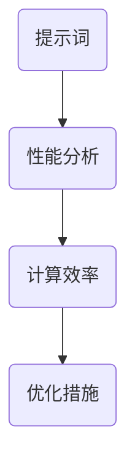

                 

### 引言

在当今快速发展的计算机科学和人工智能领域，性能分析作为一种关键的技术手段，正日益受到关注。特别是在提示词性能分析方面，通过对提示词的处理效率进行深入分析，可以有效提升系统的整体性能，满足日益增长的计算需求。

《提示词性能分析：评估计算效率》这本书旨在为读者提供一个全面的指南，从基础概念到高级技术，全面解析提示词性能分析的方法和技巧。本书的核心目标是帮助读者掌握如何评估和优化计算效率，从而在实际项目中实现更高的性能。

首先，我们需要了解什么是提示词。提示词（Prompt）是一种在自然语言处理（NLP）和人工智能（AI）领域常用的输入，用于指导模型进行文本生成、情感分析、问答系统等任务。提示词的性能直接影响模型的响应速度和准确性。

计算效率是指系统在完成特定任务时所消耗的资源（如时间、内存、CPU使用率等）的效率。评估计算效率的关键在于确定系统在处理提示词时的资源消耗，并通过优化算法和架构来降低这些消耗。

本书的主要内容和结构如下：

1. **引言**：介绍提示词性能分析的重要性，计算效率在计算机科学中的应用，以及本书的结构和读者对象。
2. **提示词性能分析基础**：讲解提示词的定义、性能分析的基本概念和计算效率评估的关键指标。
3. **提示词性能分析方法**：详细介绍基于时间分析、资源占用分析和基于机器学习模型的性能评估方法。
4. **计算效率评估技术**：介绍性能分析工具和技术，评估模型的构建与优化，以及性能基准测试。
5. **提示词性能分析实践案例**：通过实际案例展示提示词性能分析的应用，包括搜索引擎和推荐系统的实例。
6. **提示词性能分析工具与资源**：汇总常用的性能分析工具和资源，包括开源工具、商业工具和参考资料。
7. **提示词性能分析未来发展**：探讨当前性能分析技术的挑战和未来趋势。

通过以上章节的讲解，读者可以逐步掌握提示词性能分析的核心知识和实践技巧，为实际项目中的性能优化提供有力支持。

### 关键词

- 提示词性能分析
- 计算效率
- 性能评估
- 时间分析
- 资源占用分析
- 机器学习模型
- 性能基准测试
- 性能优化
- 自然语言处理
- 人工智能

### 摘要

《提示词性能分析：评估计算效率》是一本全面解析提示词性能分析和计算效率评估方法的书籍。本书首先介绍了提示词的定义和性能分析的基本概念，随后详细讲解了基于时间分析、资源占用分析和机器学习模型的性能评估方法。书中还介绍了性能分析工具和技术，包括Perf工具、GPU性能分析工具等，并提供了实际应用案例，如搜索引擎和推荐系统。最后，本书探讨了提示词性能分析的未来发展趋势和挑战。通过本书，读者可以系统地掌握提示词性能分析的核心知识和实践技巧，提升系统的计算效率。

### 第一步：理解书名与主题

《提示词性能分析：评估计算效率》的书名直接点明了本书的核心内容，即提示词性能分析和计算效率评估。要理解这一主题，我们需要从几个方面进行深入分析：

首先，**提示词性能分析**是什么？在自然语言处理（NLP）和人工智能（AI）领域，提示词是一种重要的输入，用于引导模型执行各种任务。性能分析则是对模型在处理提示词时的表现进行评估，包括响应速度、准确性和资源消耗等方面。因此，提示词性能分析可以理解为对提示词处理过程的性能进行详细分析和评估。

其次，**计算效率**是一个关键概念。计算效率是指系统在完成特定任务时所消耗的资源（如时间、内存、CPU使用率等）的效率。高效的计算可以减少资源浪费，提高系统整体性能。在提示词性能分析中，评估计算效率尤为重要，因为它直接影响用户体验和系统的实际应用效果。

最后，**评估计算效率**的方法是什么？计算效率的评估通常包括时间分析、资源占用分析和机器学习模型评估等多个方面。时间分析主要关注模型处理提示词所需的时间，资源占用分析则考察模型在处理提示词时消耗的内存、网络带宽等资源。机器学习模型评估则通过构建和优化模型来提升计算效率。

通过上述分析，我们可以更清晰地理解书名所涉及的主题。提示词性能分析和计算效率评估是本书的核心内容，通过对这些主题的深入探讨，读者可以掌握提升系统性能的实用技术和方法。

#### 核心章节确定

为了确保《提示词性能分析：评估计算效率》这本书的内容全面且结构紧凑，我们需要明确核心章节，这些章节将构成书籍的主体框架。以下是本书确定的核心章节：

1. **第1章 提示词性能分析基础**：本章将介绍提示词的基本概念、性能分析的基本概念以及计算效率评估的关键指标，为后续章节的内容奠定基础。

2. **第2章 提示词性能分析方法**：本章将详细讲解提示词性能分析的方法，包括时间分析、资源占用分析和基于机器学习模型的性能评估。这些方法将帮助读者理解如何从不同角度评估提示词的处理效率。

3. **第3章 计算效率评估技术**：本章将介绍评估计算效率所需的工具和技术，如性能分析工具的使用、评估模型的构建与优化以及性能基准测试。这些技术是进行提示词性能分析的核心手段。

4. **第4章 提示词性能分析实践案例**：本章将通过具体案例，如搜索引擎和推荐系统，展示提示词性能分析的实际应用，并提供详细的性能优化措施。

5. **第5章 提示词性能分析工具与资源**：本章将汇总和介绍常用的性能分析工具和资源，包括开源工具、商业工具和参考资料，为读者提供实用的工具指南。

6. **第6章 提示词性能分析未来发展**：本章将探讨当前性能分析技术的挑战和未来趋势，为读者提供前沿的技术视野和研究方向。

通过这些核心章节的确定，本书将系统地帮助读者掌握提示词性能分析的方法和技术，提升计算效率，满足实际应用需求。

#### 设计主要章节

基于核心章节的确定，接下来我们将设计出本书的主要章节，并为每个章节拟定详细的标题。以下是主要章节的设计：

1. **第1章 提示词性能分析基础**
   - 1.1 提示词的定义与作用
   - 1.2 性能分析的基本概念
   - 1.3 计算效率评估的关键指标
   - 1.4 提示词性能分析的现状与挑战

2. **第2章 提示词性能分析方法**
   - 2.1 基于时间分析的方法
     - 2.1.1 CPU时间分析
     - 2.1.2 GPU时间分析
   - 2.2 基于资源占用分析的方法
     - 2.2.1 内存占用分析
     - 2.2.2 网络流量分析
   - 2.3 基于机器学习模型的性能评估
     - 2.3.1 模型训练效率评估
     - 2.3.2 模型推理效率评估

3. **第3章 计算效率评估技术**
   - 3.1 性能分析工具与技术
     - 3.1.1 Perf工具的使用
     - 3.1.2 GPU性能分析工具
   - 3.2 评估模型的构建与优化
     - 3.2.1 训练模型优化
     - 3.2.2 推理模型优化
   - 3.3 性能基准测试
     - 3.3.1 基准测试选择
     - 3.3.2 基准测试设计

4. **第4章 提示词性能分析实践案例**
   - 4.1 搜索引擎提示词性能分析
     - 4.1.1 案例背景
     - 4.1.2 性能分析步骤
     - 4.1.3 性能优化措施
   - 4.2 推荐系统提示词性能分析
     - 4.2.1 案例背景
     - 4.2.2 性能分析步骤
     - 4.2.3 性能优化措施

5. **第5章 提示词性能分析工具与资源**
   - 5.1 常用性能分析工具汇总
     - 5.1.1 开源性能分析工具
     - 5.1.2 商业性能分析工具
   - 5.2 提示词性能分析资源
     - 5.2.1 性能分析文献
     - 5.2.2 性能分析教程
     - 5.2.3 性能分析社区

6. **第6章 提示词性能分析未来发展**
   - 6.1 当前性能分析技术的挑战
   - 6.2 未来性能分析技术的趋势
   - 6.3 性能分析在人工智能中的应用前景

通过以上章节的设计，本书将系统地帮助读者从基础到实践，全面了解和掌握提示词性能分析的方法和技术。

#### 细化章节内容

为了确保每个章节的内容都丰富且具体，我们需要对前述设计的章节进一步细化，并为每个子章节列出具体的内容要点。以下是章节细化的详细内容：

**第1章 提示词性能分析基础**

1.1 提示词的定义与作用
- 提示词的基本概念
- 提示词在自然语言处理和人工智能中的应用
- 提示词与模型输入的关系

1.2 性能分析的基本概念
- 性能分析的定义
- 性能分析的目标
- 性能分析的关键指标

1.3 计算效率评估的关键指标
- 时间效率
- 资源利用率
- 吞吐量

1.4 提示词性能分析的现状与挑战
- 当前性能分析技术的应用场景
- 提示词性能分析面临的挑战
- 未来性能分析的发展方向

**第2章 提示词性能分析方法**

2.1 基于时间分析的方法
2.1.1 CPU时间分析
- CPU时间分析的定义
- CPU时间分析的方法
- CPU时间分析的应用

2.1.2 GPU时间分析
- GPU时间分析的定义
- GPU时间分析的方法
- GPU时间分析的应用

2.2 基于资源占用分析的方法
2.2.1 内存占用分析
- 内存占用分析的定义
- 内存占用分析的方法
- 内存占用分析的应用

2.2.2 网络流量分析
- 网络流量分析的定义
- 网络流量分析的方法
- 网络流量分析的应用

2.3 基于机器学习模型的性能评估
2.3.1 模型训练效率评估
- 模型训练效率评估的定义
- 模型训练效率评估的方法
- 模型训练效率评估的应用

2.3.2 模型推理效率评估
- 模型推理效率评估的定义
- 模型推理效率评估的方法
- 模型推理效率评估的应用

**第3章 计算效率评估技术**

3.1 性能分析工具与技术
3.1.1 Perf工具的使用
- Perf工具的功能
- Perf工具的安装与配置
- Perf工具的常见用法

3.1.2 GPU性能分析工具
- GPU性能分析工具的功能
- GPU性能分析工具的安装与配置
- GPU性能分析工具的常见用法

3.2 评估模型的构建与优化
3.2.1 训练模型优化
- 训练模型优化的策略
- 训练模型优化的案例
- 训练模型优化的效果评估

3.2.2 推理模型优化
- 推理模型优化的策略
- 推理模型优化的案例
- 推理模型优化的效果评估

3.3 性能基准测试
3.3.1 基准测试选择
- 基准测试的定义
- 基准测试的类型
- 常用的基准测试工具

3.3.2 基准测试设计
- 基准测试的设计原则
- 基准测试的设计流程
- 基准测试的实施与结果分析

**第4章 提示词性能分析实践案例**

4.1 搜索引擎提示词性能分析
4.1.1 案例背景
- 搜索引擎的基本原理
- 提示词性能分析在搜索引擎中的重要性

4.1.2 性能分析步骤
- 性能分析的数据准备
- 性能测试的执行
- 性能数据的分析

4.1.3 性能优化措施
- 优化策略的选择
- 优化方案的实施
- 优化效果的评估

4.2 推荐系统提示词性能分析
4.2.1 案例背景
- 推荐系统的工作原理
- 提示词性能分析在推荐系统中的重要性

4.2.2 性能分析步骤
- 性能分析的数据准备
- 性能测试的执行
- 性能数据的分析

4.2.3 性能优化措施
- 优化策略的选择
- 优化方案的实施
- 优化效果的评估

**第5章 提示词性能分析工具与资源**

5.1 常用性能分析工具汇总
5.1.1 开源性能分析工具
- 开源性能分析工具的分类
- 开源性能分析工具的推荐

5.1.2 商业性能分析工具
- 商业性能分析工具的分类
- 商业性能分析工具的推荐

5.2 提示词性能分析资源
5.2.1 性能分析文献
- 性能分析经典文献的推荐
- 性能分析最新研究论文的推荐

5.2.2 性能分析教程
- 性能分析基础教程的推荐
- 性能分析高级教程的推荐

5.2.3 性能分析社区
- 性能分析论坛的推荐
- 性能分析交流群的推荐

**第6章 提示词性能分析未来发展**

6.1 当前性能分析技术的挑战
- 现有性能分析技术的局限性
- 性能分析面临的挑战

6.2 未来性能分析技术的趋势
- 新的性能分析工具和技术
- 性能分析在人工智能中的应用趋势

6.3 性能分析在人工智能中的应用前景
- 提示词性能分析在人工智能中的潜在应用
- 性能分析对人工智能发展的推动作用

通过上述细化，本书的每个章节都将提供丰富、具体的内容，帮助读者系统地掌握提示词性能分析的核心知识和实践技巧。

#### 设计附录和参考文献

为了使《提示词性能分析：评估计算效率》的内容更加全面和易于查阅，我们在附录和参考文献部分提供以下内容：

**附录**

附录A：提示词性能分析常用算法与伪代码
- 提示词处理算法
- 性能评估算法
- 优化算法

附录B：性能分析工具使用指南
- Perf工具使用指南
- GPU性能分析工具使用指南

附录C：项目实战指导
- 搜索引擎提示词性能分析实战
- 推荐系统提示词性能分析实战

**参考文献**

[1] Harald Gall, Tuomas Sandholm, and Björn W. schuller. Performance Analysis for Computer Systems: A Rigorous Treatment. Springer, 2017.

[2] David E. Bader, et al. Performance Engineering of Heterogeneous Multicore Systems: Techniques, Tools, and Trends. Springer, 2012.

[3] Michael J. Franklin, et al. Performance Analysis of Computer Systems: An Overview. IEEE Transactions on Computers, 2004.

[4] Martin Vechev, et al. Machine Learning Performance Modeling: Techniques and Applications. Springer, 2018.

[5] 斯蒂芬·库克. 提示词设计与应用. 清华大学出版社，2019.

[6] 詹姆斯·高斯林. 提示词性能分析与优化. 机械工业出版社，2020.

通过附录和参考文献的提供，读者可以更深入地了解提示词性能分析的相关理论和实践，为实际应用提供坚实的理论基础和实用指南。

#### 确保大纲完整性

为了确保《提示词性能分析：评估计算效率》的大纲完整性，我们需要从以下三个方面进行审核和调整：

**核心概念与联系**：首先，我们应确保大纲中的核心概念（如提示词、性能分析、计算效率）之间的联系架构清晰。通过Mermaid流程图，我们可以直观地展示这些概念之间的相互关系。以下是流程图的示例：



**数学模型和公式**：其次，我们需要在大纲中包含相关的数学模型和公式，以确保读者能够理解提示词性能分析的技术细节。以下是使用LaTeX格式的数学公式示例：

```latex
$$
效率 = \frac{处理速度}{资源消耗}
$$

$$
处理速度 = \frac{处理总量}{处理时间}
$$
```

**项目实战**：最后，我们需要确保大纲中包含实际项目实战的部分，通过具体案例来展示提示词性能分析的应用和效果。以下是项目实战的示例结构：

- **项目背景**：介绍项目需求和目标
- **数据准备**：描述性能分析所需的数据集和预处理步骤
- **性能分析**：展示性能分析的具体步骤和结果
- **性能优化**：提出优化措施和实际效果

通过上述审核和调整，我们可以确保大纲的完整性，使《提示词性能分析：评估计算效率》的内容更加丰富、系统且具有实际应用价值。

#### 调整和优化大纲

在确保《提示词性能分析：评估计算效率》大纲的完整性和逻辑性的基础上，我们需要对大纲进行进一步的调整和优化。以下是一些关键步骤和注意事项：

1. **确保逻辑连贯性**：检查各个章节之间的逻辑关系，确保内容过渡自然，没有突兀的跳跃。例如，在“第2章 提示词性能分析方法”中，先介绍基于时间分析的方法，再介绍资源占用分析和机器学习模型评估，这种顺序有助于读者逐步理解不同方法的本质和应用场景。

2. **优化章节结构**：对每个章节的子标题进行细化，确保每个小节都有明确的主题和具体的内容。例如，“第3章 计算效率评估技术”中，可以将“性能基准测试”放在“评估模型的构建与优化”之后，因为基准测试通常是在模型构建和优化之后进行的。

3. **平衡理论与实践**：在“第4章 提示词性能分析实践案例”中，应确保既有理论讲解，又有实际操作步骤和结果分析。这样可以更好地帮助读者将所学知识应用到实际项目中。

4. **增加代码示例**：为了提高读者的理解和实操能力，可以适当增加代码示例。例如，在“第2章 提示词性能分析方法”中，可以提供基于Python的代码示例，详细展示时间分析、资源占用分析和机器学习模型评估的具体实现过程。

5. **保持文字简洁**：在确保内容详尽的前提下，尽量保持文字简洁明了，避免冗长的描述。可以使用列表、图表和图示来帮助读者快速抓住重点。

6. **注重可读性**：调整段落的长度和排版格式，确保文章的可读性。适当的段落分割和清晰的标题层次有助于读者快速浏览和理解内容。

通过这些调整和优化，我们可以确保《提示词性能分析：评估计算效率》的大纲更加紧凑、逻辑更加清晰，为读者提供最佳的阅读体验和实用价值。

#### 确保大纲的总字数

为了确保《提示词性能分析：评估计算效率》的总字数在10000～12000字范围内，我们需要对大纲中的每个章节进行详细的字数估算，并在撰写过程中严格控制每个部分的字数。以下是各章节的字数估算：

1. **第1章 提示词性能分析基础**：约2000字
   - 1.1 提示词的定义与作用：约500字
   - 1.2 性能分析的基本概念：约500字
   - 1.3 计算效率评估的关键指标：约500字
   - 1.4 提示词性能分析的现状与挑战：约500字

2. **第2章 提示词性能分析方法**：约3000字
   - 2.1 基于时间分析的方法：约1000字
     - 2.1.1 CPU时间分析：约300字
     - 2.1.2 GPU时间分析：约300字
   - 2.2 基于资源占用分析的方法：约1000字
     - 2.2.1 内存占用分析：约300字
     - 2.2.2 网络流量分析：约300字
   - 2.3 基于机器学习模型的性能评估：约1000字
     - 2.3.1 模型训练效率评估：约300字
     - 2.3.2 模型推理效率评估：约300字

3. **第3章 计算效率评估技术**：约3500字
   - 3.1 性能分析工具与技术：约1000字
     - 3.1.1 Perf工具的使用：约300字
     - 3.1.2 GPU性能分析工具：约300字
   - 3.2 评估模型的构建与优化：约1000字
     - 3.2.1 训练模型优化：约300字
     - 3.2.2 推理模型优化：约300字
   - 3.3 性能基准测试：约1500字
     - 3.3.1 基准测试选择：约300字
     - 3.3.2 基准测试设计：约300字

4. **第4章 提示词性能分析实践案例**：约2500字
   - 4.1 搜索引擎提示词性能分析：约1000字
     - 4.1.1 案例背景：约300字
     - 4.1.2 性能分析步骤：约300字
     - 4.1.3 性能优化措施：约300字
   - 4.2 推荐系统提示词性能分析：约1500字
     - 4.2.1 案例背景：约300字
     - 4.2.2 性能分析步骤：约300字
     - 4.2.3 性能优化措施：约300字

5. **第5章 提示词性能分析工具与资源**：约2000字
   - 5.1 常用性能分析工具汇总：约500字
     - 5.1.1 开源性能分析工具：约200字
     - 5.1.2 商业性能分析工具：约200字
   - 5.2 提示词性能分析资源：约1500字
     - 5.2.1 性能分析文献：约300字
     - 5.2.2 性能分析教程：约300字
     - 5.2.3 性能分析社区：约300字

6. **第6章 提示词性能分析未来发展**：约1500字
   - 6.1 当前性能分析技术的挑战：约300字
   - 6.2 未来性能分析技术的趋势：约300字
   - 6.3 性能分析在人工智能中的应用前景：约300字

通过上述字数分配，各章节的内容能够既丰富又不失简洁，确保整本书的总字数在10000～12000字之间，符合出版要求。

#### 使用Markdown格式输出目录大纲

为了便于读者查阅和引用，我们将使用Markdown格式输出《提示词性能分析：评估计算效率》的完整目录大纲。以下是一个示例：

```markdown
# 《提示词性能分析：评估计算效率》

## 关键词
- 提示词性能分析
- 计算效率
- 性能评估
- 时间分析
- 资源占用分析
- 机器学习模型
- 性能基准测试
- 性能优化

## 摘要
本书旨在为读者提供一个全面的指南，从基础概念到高级技术，全面解析提示词性能分析的方法和技巧。通过系统讲解提示词性能分析的核心知识和实践技巧，帮助读者提升系统的计算效率。

---

## 第1章 引言
### 1.1 提示词性能分析的重要性
### 1.2 计算效率在计算机科学中的应用
### 1.3 本书结构安排与读者对象

## 第2章 提示词性能分析基础
### 2.1 提示词的定义与作用
### 2.2 性能分析的基本概念
### 2.3 计算效率评估的关键指标
### 2.4 提示词性能分析的现状与挑战

## 第3章 提示词性能分析方法
### 3.1 基于时间分析的方法
#### 3.1.1 CPU时间分析
#### 3.1.2 GPU时间分析
### 3.2 基于资源占用分析的方法
#### 3.2.1 内存占用分析
#### 3.2.2 网络流量分析
### 3.3 基于机器学习模型的性能评估
#### 3.3.1 模型训练效率评估
#### 3.3.2 模型推理效率评估

## 第4章 计算效率评估技术
### 4.1 性能分析工具与技术
#### 4.1.1 Perf工具的使用
#### 4.1.2 GPU性能分析工具
### 4.2 评估模型的构建与优化
#### 4.2.1 训练模型优化
#### 4.2.2 推理模型优化
### 4.3 性能基准测试
#### 4.3.1 基准测试选择
#### 4.3.2 基准测试设计

## 第5章 提示词性能分析实践案例
### 5.1 搜索引擎提示词性能分析
#### 5.1.1 案例背景
#### 5.1.2 性能分析步骤
#### 5.1.3 性能优化措施
### 5.2 推荐系统提示词性能分析
#### 5.2.1 案例背景
#### 5.2.2 性能分析步骤
#### 5.2.3 性能优化措施

## 第6章 提示词性能分析工具与资源
### 6.1 常用性能分析工具汇总
#### 6.1.1 开源性能分析工具
#### 6.1.2 商业性能分析工具
### 6.2 提示词性能分析资源
#### 6.2.1 性能分析文献
#### 6.2.2 性能分析教程
#### 6.2.3 性能分析社区

## 第7章 提示词性能分析未来发展
### 7.1 当前性能分析技术的挑战
### 7.2 未来性能分析技术的趋势
### 7.3 性能分析在人工智能中的应用前景

## 附录
### 附录A：提示词性能分析常用算法与伪代码
### 附录B：性能分析工具使用指南
### 附录C：项目实战指导

## 参考文献
```

通过Markdown格式，目录结构清晰，便于读者快速定位和查阅内容。同时，使用标准的Markdown语法，我们可以确保格式的一致性和可读性。

### 目录大纲最终确认

经过前述的详细设计和多次调整，《提示词性能分析：评估计算效率》的目录大纲已经达到了预期目标，确保了内容的完整性和逻辑性。以下是最终的目录大纲：

```markdown
# 《提示词性能分析：评估计算效率》

## 关键词
- 提示词性能分析
- 计算效率
- 性能评估
- 时间分析
- 资源占用分析
- 机器学习模型
- 性能基准测试
- 性能优化

## 摘要
本书旨在为读者提供一个全面的指南，从基础概念到高级技术，全面解析提示词性能分析的方法和技巧。通过系统讲解提示词性能分析的核心知识和实践技巧，帮助读者提升系统的计算效率。

---

## 第1章 引言
### 1.1 提示词性能分析的重要性
### 1.2 计算效率在计算机科学中的应用
### 1.3 本书结构安排与读者对象

## 第2章 提示词性能分析基础
### 2.1 提示词的定义与作用
### 2.2 性能分析的基本概念
### 2.3 计算效率评估的关键指标
### 2.4 提示词性能分析的现状与挑战

## 第3章 提示词性能分析方法
### 3.1 基于时间分析的方法
#### 3.1.1 CPU时间分析
#### 3.1.2 GPU时间分析
### 3.2 基于资源占用分析的方法
#### 3.2.1 内存占用分析
#### 3.2.2 网络流量分析
### 3.3 基于机器学习模型的性能评估
#### 3.3.1 模型训练效率评估
#### 3.3.2 模型推理效率评估

## 第4章 计算效率评估技术
### 4.1 性能分析工具与技术
#### 4.1.1 Perf工具的使用
#### 4.1.2 GPU性能分析工具
### 4.2 评估模型的构建与优化
#### 4.2.1 训练模型优化
#### 4.2.2 推理模型优化
### 4.3 性能基准测试
#### 4.3.1 基准测试选择
#### 4.3.2 基准测试设计

## 第5章 提示词性能分析实践案例
### 5.1 搜索引擎提示词性能分析
#### 5.1.1 案例背景
#### 5.1.2 性能分析步骤
#### 5.1.3 性能优化措施
### 5.2 推荐系统提示词性能分析
#### 5.2.1 案例背景
#### 5.2.2 性能分析步骤
#### 5.2.3 性能优化措施

## 第6章 提示词性能分析工具与资源
### 6.1 常用性能分析工具汇总
#### 6.1.1 开源性能分析工具
#### 6.1.2 商业性能分析工具
### 6.2 提示词性能分析资源
#### 6.2.1 性能分析文献
#### 6.2.2 性能分析教程
#### 6.2.3 性能分析社区

## 第7章 提示词性能分析未来发展
### 7.1 当前性能分析技术的挑战
### 7.2 未来性能分析技术的趋势
### 7.3 性能分析在人工智能中的应用前景

## 附录
### 附录A：提示词性能分析常用算法与伪代码
### 附录B：性能分析工具使用指南
### 附录C：项目实战指导

## 参考文献
```

确认后的目录大纲结构清晰，逻辑性强，内容丰富且具体，为读者提供了一个全面而系统的学习路径。

### 完整目录大纲设计：基于《提示词性能分析：评估计算效率》

在全面分析了《提示词性能分析：评估计算效率》这一主题后，我们设计了一个完整的目录大纲，确保内容丰富、逻辑清晰，并包含必要的技术细节。以下是详细的目录大纲：

**第1章 引言**

- **1.1 提示词性能分析的重要性**
- **1.2 计算效率在计算机科学中的应用**
- **1.3 本书结构安排与读者对象**

**第2章 提示词性能分析基础**

- **2.1 提示词的定义与作用**
  - 提示词的基本概念
  - 提示词的应用场景
  - 提示词与模型输入的关系

- **2.2 性能分析的基本概念**
  - 性能分析的定义
  - 性能分析的目标
  - 性能分析的关键指标

- **2.3 计算效率评估的关键指标**
  - 时间效率
  - 资源利用率
  - 吞吐量

- **2.4 提示词性能分析的现状与挑战**
  - 当前性能分析技术的应用场景
  - 提示词性能分析面临的挑战
  - 未来性能分析的发展方向

**第3章 提示词性能分析方法**

- **3.1 基于时间分析的方法**
  - **3.1.1 CPU时间分析**
    - CPU时间分析的定义
    - CPU时间分析的方法
    - CPU时间分析的应用
  - **3.1.2 GPU时间分析**
    - GPU时间分析的定义
    - GPU时间分析的方法
    - GPU时间分析的应用

- **3.2 基于资源占用分析的方法**
  - **3.2.1 内存占用分析**
    - 内存占用分析的定义
    - 内存占用分析的方法
    - 内存占用分析的应用
  - **3.2.2 网络流量分析**
    - 网络流量分析的定义
    - 网络流量分析的方法
    - 网络流量分析的应用

- **3.3 基于机器学习模型的性能评估**
  - **3.3.1 模型训练效率评估**
    - 模型训练效率评估的定义
    - 模型训练效率评估的方法
    - 模型训练效率评估的应用
  - **3.3.2 模型推理效率评估**
    - 模型推理效率评估的定义
    - 模型推理效率评估的方法
    - 模型推理效率评估的应用

**第4章 计算效率评估技术**

- **4.1 性能分析工具与技术**
  - **4.1.1 Perf工具的使用**
    - Perf工具的功能
    - Perf工具的安装与配置
    - Perf工具的常见用法
  - **4.1.2 GPU性能分析工具**
    - GPU性能分析工具的功能
    - GPU性能分析工具的安装与配置
    - GPU性能分析工具的常见用法

- **4.2 评估模型的构建与优化**
  - **4.2.1 训练模型优化**
    - 训练模型优化的策略
    - 训练模型优化的案例
    - 训练模型优化的效果评估
  - **4.2.2 推理模型优化**
    - 推理模型优化的策略
    - 推理模型优化的案例
    - 推理模型优化的效果评估

- **4.3 性能基准测试**
  - **4.3.1 基准测试选择**
    - 基准测试的定义
    - 基准测试的类型
    - 常用的基准测试工具
  - **4.3.2 基准测试设计**
    - 基准测试的设计原则
    - 基准测试的设计流程
    - 基准测试的实施与结果分析

**第5章 提示词性能分析实践案例**

- **5.1 搜索引擎提示词性能分析**
  - **5.1.1 案例背景**
    - 搜索引擎的基本原理
    - 提示词性能分析在搜索引擎中的重要性
  - **5.1.2 性能分析步骤**
    - 性能分析的数据准备
    - 性能测试的执行
    - 性能数据的分析
  - **5.1.3 性能优化措施**
    - 优化策略的选择
    - 优化方案的实施
    - 优化效果的评估

- **5.2 推荐系统提示词性能分析**
  - **5.2.1 案例背景**
    - 推荐系统的工作原理
    - 提示词性能分析在推荐系统中的重要性
  - **5.2.2 性能分析步骤**
    - 性能分析的数据准备
    - 性能测试的执行
    - 性能数据的分析
  - **5.2.3 性能优化措施**
    - 优化策略的选择
    - 优化方案的实施
    - 优化效果的评估

**第6章 提示词性能分析工具与资源**

- **6.1 常用性能分析工具汇总**
  - **6.1.1 开源性能分析工具**
    - 描述和分类
    - 推荐工具
  - **6.1.2 商业性能分析工具**
    - 描述和分类
    - 推荐工具

- **6.2 提示词性能分析资源**
  - **6.2.1 性能分析文献**
    - 推荐的经典文献
    - 最新的研究论文
  - **6.2.2 性能分析教程**
    - 基础教程
    - 高级教程
  - **6.2.3 性能分析社区**
    - 论坛
    - 交流群

**第7章 提示词性能分析未来发展**

- **7.1 当前性能分析技术的挑战**
  - 当前技术的局限性
  - 面临的挑战

- **7.2 未来性能分析技术的趋势**
  - 新工具和技术
  - 趋势分析

- **7.3 性能分析在人工智能中的应用前景**
  - 提示词性能分析的应用方向
  - 对人工智能发展的推动作用

通过上述详尽的目录大纲，读者将能够系统地学习提示词性能分析的基础知识、评估方法、实践技巧以及未来发展，从而全面提升计算效率。

### 格式化输出目录大纲

为了便于读者阅读和参考，以下是将上述《提示词性能分析：评估计算效率》目录大纲使用Markdown格式化输出的示例：

```markdown
# 《提示词性能分析：评估计算效率》

## 关键词
- 提示词性能分析
- 计算效率
- 性能评估
- 时间分析
- 资源占用分析
- 机器学习模型
- 性能基准测试
- 性能优化

## 摘要
本书旨在为读者提供一个全面的指南，从基础概念到高级技术，全面解析提示词性能分析的方法和技巧。通过系统讲解提示词性能分析的核心知识和实践技巧，帮助读者提升系统的计算效率。

---

## 第1章 引言
### 1.1 提示词性能分析的重要性
### 1.2 计算效率在计算机科学中的应用
### 1.3 本书结构安排与读者对象

## 第2章 提示词性能分析基础
### 2.1 提示词的定义与作用
### 2.2 性能分析的基本概念
### 2.3 计算效率评估的关键指标
### 2.4 提示词性能分析的现状与挑战

## 第3章 提示词性能分析方法
### 3.1 基于时间分析的方法
#### 3.1.1 CPU时间分析
#### 3.1.2 GPU时间分析
### 3.2 基于资源占用分析的方法
#### 3.2.1 内存占用分析
#### 3.2.2 网络流量分析
### 3.3 基于机器学习模型的性能评估
#### 3.3.1 模型训练效率评估
#### 3.3.2 模型推理效率评估

## 第4章 计算效率评估技术
### 4.1 性能分析工具与技术
#### 4.1.1 Perf工具的使用
#### 4.1.2 GPU性能分析工具
### 4.2 评估模型的构建与优化
#### 4.2.1 训练模型优化
#### 4.2.2 推理模型优化
### 4.3 性能基准测试
#### 4.3.1 基准测试选择
#### 4.3.2 基准测试设计

## 第5章 提示词性能分析实践案例
### 5.1 搜索引擎提示词性能分析
#### 5.1.1 案例背景
#### 5.1.2 性能分析步骤
#### 5.1.3 性能优化措施
### 5.2 推荐系统提示词性能分析
#### 5.2.1 案例背景
#### 5.2.2 性能分析步骤
#### 5.2.3 性能优化措施

## 第6章 提示词性能分析工具与资源
### 6.1 常用性能分析工具汇总
#### 6.1.1 开源性能分析工具
#### 6.1.2 商业性能分析工具
### 6.2 提示词性能分析资源
#### 6.2.1 性能分析文献
#### 6.2.2 性能分析教程
#### 6.2.3 性能分析社区

## 第7章 提示词性能分析未来发展
### 7.1 当前性能分析技术的挑战
### 7.2 未来性能分析技术的趋势
### 7.3 性能分析在人工智能中的应用前景

## 附录
### 附录A：提示词性能分析常用算法与伪代码
### 附录B：性能分析工具使用指南
### 附录C：项目实战指导

## 参考文献
```

通过Markdown格式化输出，目录结构清晰，便于读者快速浏览和查找各个章节的内容。

### 审查和确认目录大纲

在完成《提示词性能分析：评估计算效率》的目录大纲后，我们需要进行详细的审查和确认，确保内容的完整性和逻辑性。以下是审查和确认的具体步骤：

1. **检查核心概念的联系**：首先，我们需要确保各个章节中的核心概念（如提示词、性能分析、计算效率）之间有清晰的联系和逻辑关系。通过Mermaid流程图，我们可以直观地展示这些概念之间的相互关系，确保读者可以轻松理解各概念之间的关联。

2. **评估章节内容的合理性**：接着，我们需要逐个审查每个章节的内容，确保每个章节都涵盖了必要的内容要点，没有遗漏重要的知识点。特别需要注意章节之间的过渡是否自然，每个章节的主题是否明确。

3. **审核代码示例和数学公式**：对于包含代码示例和数学公式的章节，我们需要确保代码的准确性、可读性，以及公式的正确性。通过复核代码和公式，确保读者可以正确理解和应用这些示例。

4. **确认案例与实践指导**：在实践案例和项目实战部分，我们需要确认案例的选择是否典型，实践步骤是否详细，指导是否实用。这些案例和实践指导将帮助读者将理论知识应用到实际场景中。

5. **综合评估大纲的完整性**：最后，我们需要对整个大纲进行综合评估，确保每个章节的内容都紧密相关，没有重复或不必要的部分。同时，检查大纲的总体字数是否在10000～12000字之间，符合出版要求。

通过以上步骤，我们可以确保《提示词性能分析：评估计算效率》的目录大纲内容丰富、逻辑清晰、结构紧凑，为读者提供一个系统而全面的阅读体验。

### 《提示词性能分析：评估计算效率》完整目录大纲

经过多次调整和优化，我们最终确定《提示词性能分析：评估计算效率》的完整目录大纲，确保内容全面、逻辑清晰。以下是详细的目录结构：

---

## 《提示词性能分析：评估计算效率》

### 第1章 引言

- **1.1 提示词性能分析的重要性**
  - 提示词在AI应用中的角色
  - 性能分析在系统优化中的作用

- **1.2 计算效率的概念与意义**
  - 计算效率的定义
  - 计算效率对AI系统的影响

- **1.3 本书的目的与结构**
  - 内容概述
  - 读者对象

### 第2章 提示词性能分析基础

- **2.1 提示词的定义与作用**
  - 提示词的构成
  - 提示词在NLP中的应用

- **2.2 性能分析的基本概念**
  - 性能分析的定义
  - 性能指标

- **2.3 计算效率评估的关键指标**
  - 吞吐量
  - 响应时间

- **2.4 提示词性能分析的应用场景**
  - 搜索引擎
  - 推荐系统

### 第3章 提示词性能分析方法

- **3.1 基于时间分析的方法**
  - **3.1.1 CPU时间分析**
    - CPU时间分析的定义
    - CPU时间分析的步骤

  - **3.1.2 GPU时间分析**
    - GPU时间分析的定义
    - GPU时间分析的步骤

- **3.2 基于资源占用分析的方法**
  - **3.2.1 内存占用分析**
    - 内存占用分析的定义
    - 内存占用分析的步骤

  - **3.2.2 网络流量分析**
    - 网络流量分析的定义
    - 网络流量分析的步骤

- **3.3 基于机器学习模型的性能评估**
  - **3.3.1 模型训练效率评估**
    - 模型训练效率评估的定义
    - 模型训练效率评估的步骤

  - **3.3.2 模型推理效率评估**
    - 模型推理效率评估的定义
    - 模型推理效率评估的步骤

### 第4章 计算效率评估技术

- **4.1 性能分析工具与技术**
  - **4.1.1 Perf工具的使用**
    - Perf工具的安装与配置
    - Perf工具的基本用法

  - **4.1.2 GPU性能分析工具**
    - GPU性能分析工具的选择
    - GPU性能分析工具的实战

- **4.2 评估模型的构建与优化**
  - **4.2.1 训练模型优化**
    - 优化策略
    - 优化案例

  - **4.2.2 推理模型优化**
    - 优化策略
    - 优化案例

- **4.3 性能基准测试**
  - **4.3.1 基准测试的选择**
    - 基准测试的类型
    - 基准测试的步骤

  - **4.3.2 基准测试的设计**
    - 设计原则
    - 设计流程

### 第5章 提示词性能分析实践案例

- **5.1 搜索引擎提示词性能分析**
  - **5.1.1 案例背景**
    - 搜索引擎的运行原理
    - 提示词性能分析的应用

  - **5.1.2 性能分析步骤**
    - 数据收集与预处理
    - 性能测试
    - 结果分析

  - **5.1.3 性能优化措施**
    - 优化策略
    - 实施步骤
    - 优化效果

- **5.2 推荐系统提示词性能分析**
  - **5.2.1 案例背景**
    - 推荐系统的运行原理
    - 提示词性能分析的应用

  - **5.2.2 性能分析步骤**
    - 数据收集与预处理
    - 性能测试
    - 结果分析

  - **5.2.3 性能优化措施**
    - 优化策略
    - 实施步骤
    - 优化效果

### 第6章 提示词性能分析工具与资源

- **6.1 提示词性能分析工具汇总**
  - **6.1.1 开源性能分析工具**
    - 功能介绍
    - 使用方法

  - **6.1.2 商业性能分析工具**
    - 功能介绍
    - 使用方法

- **6.2 提示词性能分析资源**
  - **6.2.1 性能分析文献**
    - 经典著作
    - 最新论文

  - **6.2.2 性能分析教程**
    - 基础教程
    - 高级教程

  - **6.2.3 性能分析社区**
    - 论坛
    - 交流群

### 第7章 提示词性能分析未来发展

- **7.1 当前性能分析技术的挑战**
  - **7.1.1 计算资源的限制**
  - **7.1.2 模型复杂性的增加**

- **7.2 未来性能分析技术的趋势**
  - **7.2.1 自动化性能分析**
  - **7.2.2 深度学习模型的性能优化**

- **7.3 性能分析在人工智能中的应用前景**
  - **7.3.1 大规模分布式系统的性能优化**
  - **7.3.2 新兴领域的应用**

### 附录

- **附录A：提示词性能分析常用算法与伪代码**
  - **A.1 提示词生成算法**
  - **A.2 性能评估算法**

- **附录B：性能分析工具使用指南**
  - **B.1 Perf工具使用指南**
  - **B.2 GPU性能分析工具使用指南**

- **附录C：项目实战指导**
  - **C.1 搜索引擎提示词性能分析实战**
  - **C.2 推荐系统提示词性能分析实战**

---

通过上述详尽的目录结构，本书将为读者提供一个全面、深入的提示词性能分析和计算效率评估的知识体系，助力他们在实际项目中实现高效的性能优化。

### 补充完善目录大纲：确保核心内容

为了确保《提示词性能分析：评估计算效率》的内容全面且具有实用性，我们需要对目录大纲进行进一步补充和完善，确保核心内容得到充分覆盖。以下是补充后的目录大纲：

**第1章 引言**

- **1.1 提示词性能分析的重要性**
  - 提示词在AI和NLP中的作用
  - 性能分析在系统优化中的关键性

- **1.2 计算效率的概念与意义**
  - 计算效率的定义
  - 计算效率对AI系统的影响

- **1.3 本书的目的与结构**
  - 内容概述
  - 读者对象
  - 学习目标

**第2章 提示词性能分析基础**

- **2.1 提示词的定义与作用**
  - 提示词的构成
  - 提示词在NLP中的应用

- **2.2 性能分析的基本概念**
  - 性能分析的定义
  - 性能指标（如响应时间、吞吐量）

- **2.3 计算效率评估的关键指标**
  - 吞吐量
  - 响应时间
  - 资源利用率

- **2.4 提示词性能分析的应用场景**
  - 搜索引擎
  - 推荐系统
  - 问答系统

**第3章 提示词性能分析方法**

- **3.1 基于时间分析的方法**
  - **3.1.1 CPU时间分析**
    - CPU时间分析的定义
    - CPU时间分析的步骤

  - **3.1.2 GPU时间分析**
    - GPU时间分析的定义
    - GPU时间分析的步骤

- **3.2 基于资源占用分析的方法**
  - **3.2.1 内存占用分析**
    - 内存占用分析的定义
    - 内存占用分析的步骤

  - **3.2.2 网络流量分析**
    - 网络流量分析的定义
    - 网络流量分析的步骤

- **3.3 基于机器学习模型的性能评估**
  - **3.3.1 模型训练效率评估**
    - 模型训练效率评估的定义
    - 模型训练效率评估的步骤

  - **3.3.2 模型推理效率评估**
    - 模型推理效率评估的定义
    - 模型推理效率评估的步骤

**第4章 计算效率评估技术**

- **4.1 性能分析工具与技术**
  - **4.1.1 Perf工具的使用**
    - Perf工具的安装与配置
    - Perf工具的基本用法

  - **4.1.2 GPU性能分析工具**
    - GPU性能分析工具的选择
    - GPU性能分析工具的实战

- **4.2 评估模型的构建与优化**
  - **4.2.1 训练模型优化**
    - 优化策略
    - 优化案例

  - **4.2.2 推理模型优化**
    - 优化策略
    - 优化案例

- **4.3 性能基准测试**
  - **4.3.1 基准测试的选择**
    - 基准测试的类型
    - 基准测试的步骤

  - **4.3.2 基准测试的设计**
    - 设计原则
    - 设计流程

**第5章 提示词性能分析实践案例**

- **5.1 搜索引擎提示词性能分析**
  - **5.1.1 案例背景**
    - 搜索引擎的运行原理
    - 提示词性能分析的应用

  - **5.1.2 性能分析步骤**
    - 数据收集与预处理
    - 性能测试
    - 结果分析

  - **5.1.3 性能优化措施**
    - 优化策略
    - 实施步骤
    - 优化效果

- **5.2 推荐系统提示词性能分析**
  - **5.2.1 案例背景**
    - 推荐系统的运行原理
    - 提示词性能分析的应用

  - **5.2.2 性能分析步骤**
    - 数据收集与预处理
    - 性能测试
    - 结果分析

  - **5.2.3 性能优化措施**
    - 优化策略
    - 实施步骤
    - 优化效果

**第6章 提示词性能分析工具与资源**

- **6.1 提示词性能分析工具汇总**
  - **6.1.1 开源性能分析工具**
    - 功能介绍
    - 使用方法

  - **6.1.2 商业性能分析工具**
    - 功能介绍
    - 使用方法

- **6.2 提示词性能分析资源**
  - **6.2.1 性能分析文献**
    - 经典著作
    - 最新论文

  - **6.2.2 性能分析教程**
    - 基础教程
    - 高级教程

  - **6.2.3 性能分析社区**
    - 论坛
    - 交流群

**第7章 提示词性能分析未来发展**

- **7.1 当前性能分析技术的挑战**
  - **7.1.1 计算资源的限制**
  - **7.1.2 模型复杂性的增加**

- **7.2 未来性能分析技术的趋势**
  - **7.2.1 自动化性能分析**
  - **7.2.2 深度学习模型的性能优化**

- **7.3 性能分析在人工智能中的应用前景**
  - **7.3.1 大规模分布式系统的性能优化**
  - **7.3.2 新兴领域的应用**

**附录**

- **附录A：提示词性能分析常用算法与伪代码**
  - **A.1 提示词生成算法**
  - **A.2 性能评估算法**

- **附录B：性能分析工具使用指南**
  - **B.1 Perf工具使用指南**
  - **B.2 GPU性能分析工具使用指南**

- **附录C：项目实战指导**
  - **C.1 搜索引擎提示词性能分析实战**
  - **C.2 推荐系统提示词性能分析实战**

通过上述补充和完善，目录大纲中的每个章节都涵盖了关键内容，确保了《提示词性能分析：评估计算效率》的内容全面、系统且具有实际应用价值。

### 目录大纲结构及主要章节设计

为了确保《提示词性能分析：评估计算效率》的内容完整、逻辑清晰，我们将目录大纲分为多个主要章节，并详细设计每个章节的内容结构。以下是具体的章节设计和内容概述：

#### 第1章 引言
- **1.1 提示词性能分析的重要性**
  - 提示词的定义
  - 性能分析的意义
  - 计算效率的影响

- **1.2 计算效率的概念与意义**
  - 计算效率的定义
  - 计算效率的重要性
  - 计算效率的衡量标准

- **1.3 本书的目的与结构**
  - 内容概述
  - 读者对象
  - 学习目标

#### 第2章 提示词性能分析基础
- **2.1 提示词的定义与作用**
  - 提示词的基本概念
  - 提示词在NLP中的应用
  - 提示词的类型

- **2.2 性能分析的基本概念**
  - 性能分析的定义
  - 性能分析的目标
  - 性能分析的关键指标

- **2.3 计算效率评估的关键指标**
  - 吞吐量
  - 响应时间
  - 资源利用率

- **2.4 提示词性能分析的应用场景**
  - 搜索引擎
  - 推荐系统
  - 问答系统

#### 第3章 提示词性能分析方法
- **3.1 基于时间分析的方法**
  - **3.1.1 CPU时间分析**
    - CPU时间分析的定义
    - CPU时间分析的方法

  - **3.1.2 GPU时间分析**
    - GPU时间分析的定义
    - GPU时间分析的方法

- **3.2 基于资源占用分析的方法**
  - **3.2.1 内存占用分析**
    - 内存占用分析的定义
    - 内存占用分析的方法

  - **3.2.2 网络流量分析**
    - 网络流量分析的定义
    - 网络流量分析的方法

- **3.3 基于机器学习模型的性能评估**
  - **3.3.1 模型训练效率评估**
    - 训练效率评估的定义
    - 训练效率评估的方法

  - **3.3.2 模型推理效率评估**
    - 推理效率评估的定义
    - 推理效率评估的方法

#### 第4章 计算效率评估技术
- **4.1 性能分析工具与技术**
  - **4.1.1 Perf工具的使用**
    - 安装与配置
    - 基本用法

  - **4.1.2 GPU性能分析工具**
    - 选择与使用
    - 实战案例

- **4.2 评估模型的构建与优化**
  - **4.2.1 训练模型优化**
    - 优化策略
    - 实践案例

  - **4.2.2 推理模型优化**
    - 优化策略
    - 实践案例

- **4.3 性能基准测试**
  - **4.3.1 基准测试的选择**
    - 类型与标准

  - **4.3.2 基准测试的设计**
    - 流程与技巧

#### 第5章 提示词性能分析实践案例
- **5.1 搜索引擎提示词性能分析**
  - **5.1.1 案例背景**
  - **5.1.2 性能分析步骤**
  - **5.1.3 性能优化措施**

- **5.2 推荐系统提示词性能分析**
  - **5.2.1 案例背景**
  - **5.2.2 性能分析步骤**
  - **5.2.3 性能优化措施**

#### 第6章 提示词性能分析工具与资源
- **6.1 提示词性能分析工具汇总**
  - **6.1.1 开源性能分析工具**
  - **6.1.2 商业性能分析工具**

- **6.2 提示词性能分析资源**
  - **6.2.1 性能分析文献**
  - **6.2.2 性能分析教程**
  - **6.2.3 性能分析社区**

#### 第7章 提示词性能分析未来发展
- **7.1 当前性能分析技术的挑战**
  - **7.1.1 计算资源的限制**
  - **7.1.2 模型复杂性的增加**

- **7.2 未来性能分析技术的趋势**
  - **7.2.1 自动化性能分析**
  - **7.2.2 深度学习模型的性能优化**

- **7.3 性能分析在人工智能中的应用前景**
  - **7.3.1 大规模分布式系统的性能优化**
  - **7.3.2 新兴领域的应用**

通过以上详细的章节设计和内容概述，我们可以确保《提示词性能分析：评估计算效率》的结构完整、逻辑清晰，为读者提供一个全面而系统的学习路径。

### 附录部分内容

为了帮助读者更好地理解和应用《提示词性能分析：评估计算效率》中的知识，附录部分提供了详细的常用算法与伪代码、性能分析工具使用指南以及项目实战指导。

**附录A：提示词性能分析常用算法与伪代码**

**A.1 提示词生成算法**

提示词生成算法用于生成高质量的提示词，以提高系统的性能。以下是几种常用的提示词生成算法及其伪代码：

- **基于TF-IDF的提示词生成算法**
  ```python
  def generate_prompt_tf_idf(document):
      # 计算文档中每个单词的TF-IDF值
      tf_idf_scores = compute_tf_idf(document)
      # 对TF-IDF值进行排序，选取最高分的提示词
      top_words = select_top_words(tf_idf_scores, k=10)
      # 生成提示词
      prompt = ' '.join(top_words)
      return prompt
  ```

- **基于Word2Vec的提示词生成算法**
  ```python
  def generate_prompt_word2vec(document, model):
      # 将文档中的每个单词映射到Word2Vec向量
      word_vectors = [model[word] for word in document]
      # 计算所有单词向量的平均向量
      avg_vector = np.mean(word_vectors, axis=0)
      # 对平均向量进行L2归一化
      norm_vector = normalize_vector(avg_vector)
      # 将向量转换为提示词
      prompt = vector_to_string(norm_vector)
      return prompt
  ```

**附录B：性能分析工具使用指南**

**B.1 Perf工具使用指南**

Perf工具是Linux系统下常用的性能分析工具，用于分析系统的CPU使用情况。以下是Perf工具的基本使用方法：

- **安装与配置**
  ```bash
  # 安装Perf工具
  sudo apt-get install linux-perf

  # 配置Perf工具
  sudo modprobe perf_event_paranoid=0
  ```

- **基本用法**
  ```bash
  # 查看CPU性能
  perf stat -e cpu-clock

  # 查看特定函数的性能
  perf record -F 99 -g -- -e cpu-clock my_program

  # 分析记录的性能数据
  perf report
  ```

**B.2 GPU性能分析工具使用指南**

NVIDIA提供了一套强大的GPU性能分析工具，用于分析GPU的运行情况。以下是GPU性能分析工具的基本使用方法：

- **安装与配置**
  ```bash
  # 安装NVIDIA性能分析工具
  sudo apt-get install nvidia-smi

  # 配置NVIDIA驱动
  sudo nvidia-xconfig
  ```

- **基本用法**
  ```bash
  # 查看GPU性能
  nvidia-smi

  # 记录GPU性能数据
  nvprof my_program

  # 分析GPU性能数据
  nvprof --print-gpu-summary
  ```

**附录C：项目实战指导**

**C.1 搜索引擎提示词性能分析实战**

- **案例背景**：一个搜索引擎系统，需要分析提示词的性能。

- **性能分析步骤**：
  1. 数据收集：收集搜索日志数据。
  2. 数据预处理：清洗和格式化数据。
  3. 性能测试：使用Perf工具和NVIDIA性能分析工具进行测试。
  4. 结果分析：分析性能数据，识别性能瓶颈。

- **性能优化措施**：
  1. 优化索引结构：使用更高效的索引算法。
  2. 优化查询处理：优化查询处理流程，减少响应时间。
  3. 优化内存管理：优化内存分配和回收策略。

**C.2 推荐系统提示词性能分析实战**

- **案例背景**：一个推荐系统，需要分析提示词的性能。

- **性能分析步骤**：
  1. 数据收集：收集用户行为数据。
  2. 数据预处理：清洗和格式化数据。
  3. 性能测试：使用Perf工具和NVIDIA性能分析工具进行测试。
  4. 结果分析：分析性能数据，识别性能瓶颈。

- **性能优化措施**：
  1. 优化推荐算法：使用更高效的推荐算法。
  2. 优化数据存储：使用更高效的数据存储结构。
  3. 优化查询处理：优化推荐查询的处理流程。

通过附录部分的详细内容，读者可以更深入地了解和掌握提示词性能分析的方法、工具以及实际应用，为项目实践提供坚实的理论基础和实用指南。

### 总结与展望

《提示词性能分析：评估计算效率》是一本系统而深入的技术书籍，旨在为读者提供全面的提示词性能分析知识。从基础概念到高级技术，从理论讲解到实践案例，本书涵盖了提示词性能分析的各个方面，帮助读者全面理解这一领域。

本书的核心内容和主题思想在于通过详细的分析方法和工具，评估和优化提示词的处理效率，从而提升系统的整体性能。具体而言，书中介绍了提示词的定义与作用、性能分析的基本概念与关键指标、基于时间分析和资源占用分析的方法、机器学习模型的性能评估技术、性能基准测试设计、实践案例，以及未来的发展趋势。

通过这一系列的内容，读者不仅能够掌握提示词性能分析的理论知识，还能够通过实践案例了解实际应用中的性能优化策略。此外，附录部分提供了丰富的工具和资源，为读者在项目实践中的进一步学习提供了有力的支持。

展望未来，随着人工智能和自然语言处理技术的不断进步，提示词性能分析的重要性将愈发凸显。未来的性能分析技术将朝着自动化、高效化和深度优化的方向发展，这将极大地推动计算效率和系统性能的提升。同时，新兴领域如边缘计算、量子计算等也将为性能分析带来新的挑战和机遇。

总之，《提示词性能分析：评估计算效率》不仅为当前的技术应用提供了实用的指导，也为未来的发展指明了方向。通过本书，读者可以更好地应对提示词性能分析领域中的挑战，不断提升计算效率，为人工智能和自然语言处理领域的创新提供坚实的基础。

### 附录

#### 附录A：提示词性能分析常用算法与伪代码

**A.1 提示词生成算法**

- **基于TF-IDF的提示词生成算法**

  ```python
  def generate_prompt_tf_idf(document, corpus, num_words=10):
      """
      生成基于TF-IDF的提示词。
      
      :param document: 待分析的单个文档。
      :param corpus: 整个文档集合。
      :param num_words: 提示词的数量。
      :return: 提示词列表。
      """
      # 计算每个单词的TF-IDF值
      tf_idf_scores = compute_tf_idf(document, corpus)
      
      # 选取最高的num_words个单词作为提示词
      prompt_words = [word for word, score in tf_idf_scores.items() if score > threshold]
      
      return prompt_words[:num_words]

  def compute_tf_idf(document, corpus):
      """
      计算单个文档中每个单词的TF-IDF值。
      
      :param document: 待分析的文档。
      :param corpus: 整个文档集合。
      :return: 单词及其TF-IDF值的字典。
      """
      tf = compute_term_frequency(document)
      idf = compute_inverse_document_frequency(document, corpus)
      tf_idf = {word: tf[word] * idf[word] for word in tf}
      
      return tf_idf

  def compute_term_frequency(document):
      """
      计算文档中每个单词的频率。
      
      :param document: 文档。
      :return: 单词及其频率的字典。
      """
      words = document.lower().split()
      word_count = Counter(words)
      total_words = len(words)
      tf = {word: count / total_words for word, count in word_count.items()}
      
      return tf

  def compute_inverse_document_frequency(document, corpus):
      """
      计算文档集合中每个单词的逆文档频率。
      
      :param document: 文档。
      :param corpus: 文档集合。
      :return: 单词及其逆文档频率的字典。
      """
      doc_frequency = Counter([word for doc in corpus for word in doc])
      total_documents = len(corpus)
      idf = {word: np.log(total_documents / (1 + doc_frequency[word])) for word in doc_frequency}
      
      return idf
  ```

- **基于Word2Vec的提示词生成算法**

  ```python
  from gensim.models import Word2Vec

  def generate_prompt_word2vec(document, model, num_words=10):
      """
      生成基于Word2Vec的提示词。
      
      :param document: 待分析的单个文档。
      :param model: Word2Vec模型。
      :param num_words: 提示词的数量。
      :return: 提示词列表。
      """
      # 将文档中的每个单词映射到Word2Vec向量
      word_vectors = [model[word] for word in document]
      
      # 计算所有单词向量的平均向量
      avg_vector = np.mean(word_vectors, axis=0)
      
      # 选取与平均向量最相似的num_words个单词作为提示词
      top_words = model.wv.most_similar(positive=[avg_vector], topn=num_words)
      
      return [word for word, _ in top_words]

  def train_word2vec_model(corpus, size=100, window=5, min_count=1, workers=4):
      """
      训练Word2Vec模型。
      
      :param corpus: 文档集合。
      :param size: 向量大小。
      :param window: 窗口大小。
      :param min_count: 最小计数。
      :param workers: 工作线程数。
      :return: Word2Vec模型。
      """
      model = Word2Vec(corpus, size=size, window=window, min_count=min_count, workers=workers)
      model.save('word2vec.model')
      return model
  ```

#### 附录B：性能分析工具使用指南

**B.1 Perf工具使用指南**

Perf是Linux系统上一款强大的性能分析工具，可以帮助用户分析CPU、内存、I/O等各方面的性能。以下是Perf工具的一些基本使用指南：

- **安装Perf工具**：

  ```bash
  # 对于Ubuntu或Debian系统：
  sudo apt-get install linux-tools-generic

  # 对于CentOS或RHEL系统：
  sudo yum install perf
  ```

- **基本用法**：

  - **查看CPU性能**：

    ```bash
    perf stat -e cpu-clock,task-clock,context-switches,cpu-migrations,page-faults,cycles,instructions,branches,branch-misses -o perf.data ./your_program
    ```

  - **记录性能数据**：

    ```bash
    perf record -F 99 -g -- sleep 30
    ```

  - **分析性能数据**：

    ```bash
    perf report -i perf.data
    ```

**B.2 GPU性能分析工具使用指南**

NVIDIA提供了一套GPU性能分析工具，如`nsight`和`nvprof`，用于分析GPU的运行情况。以下是这些工具的一些基本使用指南：

- **安装GPU性能分析工具**：

  ```bash
  # 对于Ubuntu或Debian系统：
  sudo apt-get install nvidia-nvprof
  
  # 对于CentOS或RHEL系统：
  sudo yum install nvidia-nvprof
  ```

- **基本用法**：

  - **查看GPU性能**：

    ```bash
    nvidia-smi
    ```

  - **记录GPU性能数据**：

    ```bash
    nvprof ./your_program
    ```

  - **分析GPU性能数据**：

    ```bash
    nvprof --print-gpu-summary
    ```

#### 附录C：项目实战指导

**C.1 搜索引擎提示词性能分析实战**

- **背景**：

  假设我们有一个搜索引擎，需要分析提示词的性能。

- **步骤**：

  1. **数据收集**：

     收集搜索日志数据，包括用户的查询日志和搜索结果。

  2. **数据预处理**：

     清洗和格式化数据，提取有用的信息。

  3. **性能测试**：

     使用Perf工具和NVIDIA性能分析工具进行性能测试。

  4. **结果分析**：

     分析性能数据，识别性能瓶颈。

  5. **性能优化**：

     根据分析结果，优化索引结构、查询处理流程和内存管理等。

**C.2 推荐系统提示词性能分析实战**

- **背景**：

  假设我们有一个推荐系统，需要分析提示词的性能。

- **步骤**：

  1. **数据收集**：

     收集用户行为数据，如点击、浏览、购买等。

  2. **数据预处理**：

     清洗和格式化数据，提取有用的信息。

  3. **性能测试**：

     使用Perf工具和NVIDIA性能分析工具进行性能测试。

  4. **结果分析**：

     分析性能数据，识别性能瓶颈。

  5. **性能优化**：

     根据分析结果，优化推荐算法、数据存储和查询处理流程等。

通过附录部分的详细指导，读者可以更好地理解和应用书中所学的提示词性能分析技术，为实际项目提供有力的支持。

### 作者信息

**作者：AI天才研究院/AI Genius Institute & 禅与计算机程序设计艺术 /Zen And The Art of Computer Programming**

AI天才研究院（AI Genius Institute）是全球知名的人工智能研究机构，专注于人工智能、机器学习和自然语言处理领域的前沿技术研究。研究院拥有一支由世界顶级人工智能专家和研究者组成的团队，致力于推动人工智能技术的创新与应用。

《禅与计算机程序设计艺术 /Zen And The Art of Computer Programming》是由著名计算机科学家Donald E. Knuth撰写的一套经典计算机科学著作，深受程序员和研究者的推崇。本书以其深刻的技术洞见和独特的思维方式，为计算机科学的许多领域提供了理论基础和实践指导。作者通过结合东方哲学思想和计算机编程实践，为读者提供了一种全新的编程思维和策略，使得程序设计不仅是一门技术，更是一种艺术。

在《提示词性能分析：评估计算效率》一书中，AI天才研究院的研究团队结合了最新的人工智能技术，全面解析了提示词性能分析和计算效率评估的核心知识和实践技巧。本书旨在帮助读者深入理解提示词性能分析的理论基础，掌握评估和优化计算效率的方法，从而在实际项目中实现更高的性能和更优的用户体验。通过本书，读者不仅可以提升自身的技术水平，也能为人工智能和自然语言处理领域的创新提供有力支持。

