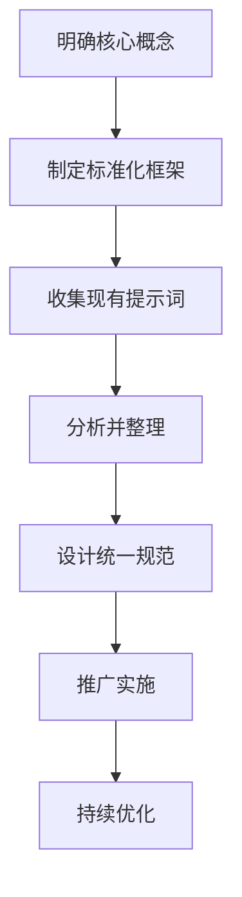

                 

### 文章标题

《提示词标准化：建立组织内统一规范》

### 关键词

提示词标准化、统一规范、组织内沟通、信息一致性、算法实现、数学模型、最佳实践

### 摘要

本文旨在探讨如何在组织内实现提示词的标准化，建立统一规范。通过详细阐述核心概念、标准化流程、技术实现、推广策略、案例分析以及最佳实践，帮助读者理解和掌握提示词标准化的方法和应用，从而提升组织内信息传递的效率和质量。

## 引言和背景

在当今信息化、数字化快速发展的时代，组织内沟通和协作的效率变得愈发重要。然而，随着信息量的爆炸性增长，信息的一致性和可理解性成为了一个巨大的挑战。其中，提示词作为引导用户操作或获取信息的重要媒介，其标准化显得尤为关键。

### 提示词标准化的意义

提示词标准化的主要目标是确保组织内各个部门、岗位之间在信息传递过程中使用统一的术语和表述，从而提高沟通效率，减少误解和错误。具体来说，提示词标准化的意义主要体现在以下几个方面：

1. **提高信息一致性**：通过统一规范提示词，可以确保在不同部门、岗位之间传递的信息具有一致性，避免因术语使用不同而产生的误解和混淆。
   
2. **提升工作效率**：统一规范的提示词可以减少员工在理解和使用提示词时的精力消耗，从而提高工作效率。

3. **降低错误率**：明确、统一的提示词可以减少因信息理解错误而导致的工作失误。

4. **增强用户体验**：对于面向用户的服务和产品，统一的提示词可以提供一致的用户体验，增强用户满意度。

### 当前组织内提示词使用现状

在许多组织内，提示词的使用现状存在以下几个问题：

1. **术语不一致**：不同部门或岗位之间的提示词使用不规范，存在多种术语表达同一概念的现象。
   
2. **缺乏统一标准**：缺乏明确的提示词设计标准和流程，导致提示词的设计随意性较大。

3. **信息传递效率低**：由于提示词的不一致，信息在组织内的传递效率较低，容易出现误解和延迟。

4. **用户体验不佳**：对于面向用户的服务和产品，提示词的不统一导致用户体验不佳，影响用户满意度。

## 核心概念与联系

为了更好地理解提示词标准化，我们需要明确几个核心概念，并分析它们之间的关系。

### 核心概念

1. **提示词**：用于引导用户操作或获取信息的简短文本。例如，按钮标签、提示框、菜单项等。
   
2. **标准化**：制定统一的规范和标准，以提高效率、降低错误率。在提示词标准化中，主要涉及术语统一、表述规范、设计原则等。

3. **组织内统一规范**：在一个组织内实施统一的标准和流程，以确保信息的一致性和可理解性。这包括提示词的设计、使用和管理。

### 提示词标准化的流程和核心概念之间的关系

为了实现提示词的标准化，我们需要遵循一定的流程，并确保各个核心概念之间的紧密联系。下面是一个简化的提示词标准化流程及其核心概念之间的Mermaid流程图：



### 核心概念之间的联系

- **明确核心概念**：首先需要明确提示词、标准化和组织内统一规范等核心概念，为后续工作奠定基础。

- **制定标准化框架**：根据核心概念，制定标准化框架，明确标准化的目标和原则。

- **收集现有提示词**：收集组织内现有的提示词，为分析、整理和设计提供数据基础。

- **分析并整理**：对收集到的提示词进行分析和整理，识别不一致性和问题。

- **设计统一规范**：基于分析结果，设计统一规范，明确术语、表述和设计原则。

- **推广实施**：将统一规范推广到组织内的各个部门、岗位，确保全员遵守。

- **持续优化**：在实施过程中，根据反馈和实际应用情况，不断优化统一规范，确保其适应性和有效性。

## 标准化流程

### 标准化框架和步骤

为了实现提示词的标准化，我们需要遵循以下标准化框架和步骤：

1. **需求分析**：首先，需要明确组织内对提示词标准化的需求，包括术语不一致、表述不规范等问题。

2. **核心概念明确**：在需求分析的基础上，明确提示词、标准化和组织内统一规范等核心概念。

3. **制定标准化原则**：根据核心概念，制定提示词标准化原则，如术语统一、表述规范、设计简洁等。

4. **收集现有提示词**：通过问卷调查、访谈等方式，收集组织内现有的提示词。

5. **分析并整理**：对收集到的提示词进行分析和整理，识别不一致性和问题。

6. **设计统一规范**：基于分析结果，设计统一规范，明确术语、表述和设计原则。

7. **制定标准化文档**：将统一规范编写成文档，包括术语表、设计指南等。

8. **推广实施**：将标准化文档推广到组织内的各个部门、岗位，确保全员遵守。

9. **培训与宣传**：组织培训活动，提高员工对提示词标准化的认识和技能。

10. **监督与反馈**：建立监督机制，收集员工对标准化规范的意见和建议，及时调整和优化。

11. **持续优化**：在实施过程中，根据反馈和实际应用情况，不断优化统一规范，确保其适应性和有效性。

### 提示词设计原则和方法

在制定统一规范时，我们需要遵循以下提示词设计原则和方法：

1. **简洁性**：提示词应简洁明了，避免冗长复杂的表述。例如，使用“保存”而不是“保存文件”。

2. **一致性**：提示词应保持一致性，避免在同一系统或应用中重复使用不同的术语。例如，在同一系统中，提示词“删除”应保持一致。

3. **明确性**：提示词应明确指明用户的操作目的，避免模糊不清的表述。例如，使用“提交”而不是“下一步”。

4. **情境适应性**：提示词应考虑不同情境下的适用性，避免使用过于通用的表述。例如，在编辑状态下，提示词“保存”可能更适合改为“保存修改”。

5. **用户友好性**：提示词应考虑用户的使用习惯和认知，避免使用专业术语或过于技术化的表述。例如，对于非技术用户，提示词“取消”可能更适合改为“取消操作”。

6. **文化适应性**：在跨文化环境中，提示词应考虑文化差异，避免使用可能引起误解的表述。例如，对于西方用户，提示词“OK”可能更适合改为“确认”。

### 核心算法原理讲解

为了实现提示词的生成和优化，我们需要运用一些核心算法原理。以下是一个简单的Python代码示例，用于生成和优化提示词：

```python
import random

def generate_hint(term):
    """
    生成提示词
    """
    hints = [
        "请输入",
        "请选择",
        "请确认",
        "请填写",
        "请点击"
    ]
    return random.choice(hints) + " " + term

def optimize_hint(hint):
    """
    优化提示词
    """
    # 将所有大写字母转换为小写
    hint = hint.lower()
    # 将“请”字替换为更简洁的表达
    hint = hint.replace("请", "")
    # 将多个空格合并为一个
    hint = ' '.join(hint.split())
    return hint

# 测试
original_hint = "请输入用户名"
generated_hint = generate_hint("用户名")
optimized_hint = optimize_hint(generated_hint)

print("原始提示词：", original_hint)
print("生成提示词：", generated_hint)
print("优化提示词：", optimized_hint)
```

### 数学模型和公式

在提示词标准化过程中，我们可以运用一些数学模型和公式来描述和分析标准化效果。以下是一个简单的示例：

1. **一致性指数（CI）**：

   一致性指数用于衡量提示词在组织内的统一程度。计算公式如下：

   $$CI = \frac{N_c}{N_t}$$

   其中，$N_c$表示符合统一规范的提示词数量，$N_t$表示总提示词数量。

2. **误用率（UR）**：

   误用率用于衡量提示词标准化的效果。计算公式如下：

   $$UR = \frac{N_e}{N_t}$$

   其中，$N_e$表示误用提示词的数量，$N_t$表示总提示词数量。

### 通俗易懂地举例说明

假设在一个组织中，有100个提示词，其中60个符合统一规范，40个不符合统一规范。那么：

- **一致性指数**：

  $$CI = \frac{60}{100} = 0.6$$

  这意味着组织内提示词的统一程度为60%。

- **误用率**：

  $$UR = \frac{40}{100} = 0.4$$

  这意味着组织内提示词的误用率为40%。

通过这个例子，我们可以看到，提示词标准化在提高信息一致性和降低误用率方面具有显著效果。

## 技术实现

### 数据收集和整理

在提示词标准化的过程中，数据收集和整理是至关重要的一步。以下是具体的技术实现方法：

1. **数据收集**：

   - **问卷调查**：通过在线问卷或纸质问卷，收集组织内员工对现有提示词的意见和建议。

   - **用户访谈**：与不同部门、岗位的员工进行面对面访谈，了解他们对提示词的使用情况和需求。

   - **系统日志**：收集系统日志数据，分析员工在实际操作过程中使用的提示词。

   - **竞争分析**：分析其他类似组织或行业的提示词使用情况，借鉴其成功经验。

2. **数据整理**：

   - **数据清洗**：删除重复、无效的数据，确保数据的质量。

   - **数据分类**：将收集到的提示词按照类别进行分类，如按钮标签、提示框、菜单项等。

   - **数据统计**：对整理后的数据进行统计分析，识别出现频率较高、使用较为频繁的提示词。

   - **数据可视化**：利用数据可视化工具，如Tableau、Power BI等，将数据以图表形式呈现，便于分析和决策。

### 提示词生成和优化算法

在实现提示词生成和优化时，我们可以运用以下算法：

1. **提示词生成算法**：

   - **随机生成**：从预设的提示词库中随机选取，简单易行，但可能导致提示词重复或不一致。

   - **规则生成**：根据预设的规则，如术语统一、表述规范等，生成提示词。例如，对于“保存”操作，可以生成“保存文件”或“保存修改”。

   - **生成对抗网络（GAN）**：利用生成对抗网络，生成与人类编写提示词相似的提示词。通过训练，GAN可以学会模仿人类生成高质量的提示词。

2. **提示词优化算法**：

   - **基于规则的优化**：根据预设的优化规则，如简洁性、明确性等，对提示词进行优化。例如，将“请点击保存”优化为“保存”。

   - **基于用户反馈的优化**：通过用户反馈，对提示词进行优化。例如，根据用户的使用情况，调整提示词的表达方式。

   - **基于机器学习的优化**：利用机器学习算法，如文本分类、情感分析等，对提示词进行优化。例如，根据用户的情感倾向，调整提示词的表达方式。

### Python源代码示例

以下是一个简单的Python代码示例，用于生成和优化提示词：

```python
import random
from sklearn.feature_extraction.text import TfidfVectorizer
from sklearn.metrics.pairwise import cosine_similarity

# 提示词库
hint_library = [
    "请输入用户名",
    "请选择日期",
    "请确认信息",
    "请填写详细信息",
    "请点击继续"
]

# 生成提示词
def generate_hint(term):
    """
    生成提示词
    """
    hints = [
        "请输入",
        "请选择",
        "请确认",
        "请填写",
        "请点击"
    ]
    return random.choice(hints) + " " + term

# 优化提示词
def optimize_hint(hint):
    """
    优化提示词
    """
    hints = ["请输入", "请选择", "请确认", "请填写", "请点击"]
    hint_vector = TfidfVectorizer().fit_transform([hint])
    similarity_scores = []

    for h in hints:
        h_vector = TfidfVectorizer().fit_transform([h])
        similarity_scores.append(cosine_similarity(hint_vector, h_vector)[0, 0])

    best_hint = hints[similarity_scores.index(max(similarity_scores))]
    return best_hint

# 测试
original_hint = "请输入用户名"
generated_hint = generate_hint("用户名")
optimized_hint = optimize_hint(generated_hint)

print("原始提示词：", original_hint)
print("生成提示词：", generated_hint)
print("优化提示词：", optimized_hint)
```

### 实际案例分析和详细讲解剖析

以下是一个实际案例，用于说明提示词生成和优化算法在组织中的应用：

**案例背景**：

某电子商务公司希望在用户注册、购物车、订单确认等环节，提供一致的、高质量的提示词。

**案例步骤**：

1. **数据收集**：

   - 通过问卷调查，收集用户对现有提示词的意见和建议。

   - 分析用户行为数据，识别高频使用的提示词。

2. **数据整理**：

   - 清洗和分类收集到的数据。

   - 统计高频使用的提示词，识别问题点。

3. **提示词生成**：

   - 使用随机生成和规则生成算法，生成新的提示词。

   - 结合用户反馈，调整和优化生成的提示词。

4. **提示词优化**：

   - 使用基于规则的优化算法，对生成的提示词进行优化。

   - 使用基于用户反馈的优化算法，进一步提高提示词的质量。

5. **实施和推广**：

   - 将优化的提示词应用到公司网站和移动应用。

   - 对员工进行培训，确保全员遵守统一规范。

**案例结果**：

- **用户反馈**：用户对新的提示词表示满意，认为其更加简洁、明确，使用户操作更加流畅。

- **工作效率**：员工在使用提示词时，更加高效，减少了误解和错误。

- **信息一致性**：组织内提示词的使用统一，提高了信息传递的效率。

- **用户体验**：用户满意度显著提升，增强了用户对公司的信任和忠诚度。

### 项目小结

通过这个案例，我们可以看到提示词生成和优化算法在实际应用中的效果。在组织内实现提示词标准化，不仅可以提高工作效率，还可以提高信息一致性和用户体验。然而，在实际实施过程中，需要结合组织特点和用户需求，不断优化和调整提示词，以确保其适用性和有效性。

### 最佳实践 tips

以下是一些提示词标准化过程中的最佳实践：

1. **统一术语**：确保在同一系统或应用中，使用统一的术语和表述。

2. **用户参与**：在制定统一规范时，充分听取用户意见，确保提示词符合用户需求。

3. **定期审查**：定期审查和更新提示词，确保其保持一致性和有效性。

4. **持续优化**：根据用户反馈和实际应用情况，不断优化提示词，提高其质量。

5. **培训与宣传**：对员工进行培训，提高他们对提示词标准化的认识和技能。

6. **工具支持**：使用合适的工具，如文本分类器、自然语言处理模型等，辅助提示词的生成和优化。

### 小结

本文详细介绍了提示词标准化的核心概念、标准化流程、技术实现、推广策略、案例分析以及最佳实践。通过本文的讲解，读者可以了解到提示词标准化的重要性，掌握实现提示词标准化的方法和技巧，从而提高组织内信息传递的效率和质量。

### 注意事项

1. 提示词标准化是一个长期过程，需要持续优化和调整。

2. 在实施过程中，要充分考虑用户需求和用户体验。

3. 定期审查和更新统一规范，确保其适应性和有效性。

4. 加强培训和宣传，提高员工对提示词标准化的认识和执行力。

### 拓展阅读

1. 《用户体验要素》作者：杰瑞·齐默曼（Jesse James Garrett）
2. 《设计心理学》作者：唐纳德·A·诺曼（Donald A. Norman）
3. 《自然语言处理入门》作者：彼得·雷蒙德（Peter Norvig）

通过阅读这些资料，读者可以进一步了解用户体验、设计心理学和自然语言处理等相关知识，为提示词标准化工作提供更多启示。

