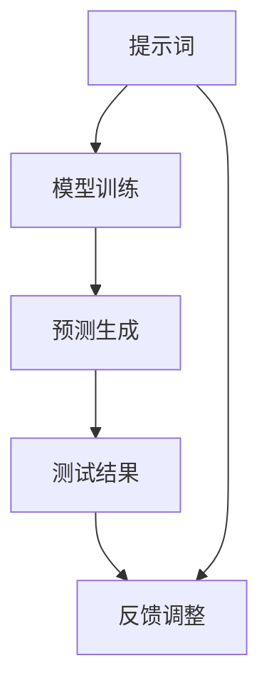

                 

### 提示词模拟测试：在部署前进行全面验证

#### 关键词：提示词模拟测试，部署前验证，核心概念，算法原理，数学模型，项目实战

> 摘要：
本文章旨在深入探讨提示词模拟测试的重要性及其在人工智能系统部署前的全面验证过程中所扮演的关键角色。通过剖析核心概念、介绍算法原理、详述数学模型以及展示具体项目实战，本文将帮助读者理解如何通过提示词模拟测试来提高模型的准确性和稳定性，降低部署风险。

## 第一部分：概述

### 1.1.1 提示词模拟测试的概念

#### 提示词的定义与作用

在人工智能系统中，**提示词**（Prompt）是指为模型输入的引导性文本或数据，用于激活模型的学习过程或引导模型生成预测。提示词的质量直接影响到模型的学习效果和预测准确性。

#### 模拟测试的定义与目的

**模拟测试**是指在实际部署前，通过模拟环境对系统进行测试，以评估系统的性能和可靠性。其目的在于提前发现并解决潜在问题，确保系统能够在实际运行中稳定、高效地执行。

#### 测试类型

- **单元测试**：针对系统的各个功能模块进行独立测试，确保每个模块都能正常工作。
- **集成测试**：在模块集成后进行测试，确保各个模块之间的协同工作无误。
- **端到端测试**：对整个系统进行测试，从输入到输出全面验证系统的性能。

### 1.1.2 提示词模拟测试的重要性

#### 测试在软件开发中的重要性

- **提高质量**：通过模拟测试，可以发现并修复代码中的错误，提高软件的可靠性。
- **降低风险**：提前发现潜在问题，避免在部署后出现重大故障，减少损失。

#### 模拟测试在保障模型准确性和稳定性中的作用

- **提升准确性**：通过不同的提示词模拟测试，可以全面评估模型在不同场景下的表现，优化模型参数，提高预测准确性。
- **增强稳定性**：模拟测试可以帮助检测模型对异常输入的鲁棒性，确保模型在不同条件下都能稳定运行。

#### 提前发现和修复问题的价值

- **节省成本**：在部署前发现并解决问题，可以避免在生产环境中出现故障，从而节省修复成本。
- **提升用户体验**：稳定的系统可以提高用户体验，增强用户对产品的信任度。

### 1.1.3 提示词模拟测试的目标

- **提高模型预测准确性**：通过模拟不同场景的提示词，全面评估模型的表现，不断优化模型。
- **优化模型性能**：通过模拟测试，调整模型参数，提升模型在资源利用和计算效率上的表现。
- **减少部署风险**：通过全面的模拟测试，确保模型在部署后能够稳定、高效地运行，降低故障风险。

## 第一部分：核心概念与联系

### 1.2.1 提示词、模型和预测

为了更好地理解提示词模拟测试，我们可以使用Mermaid语法来创建一个流程图，展示核心概念之间的联系。



### 1.2.2 提示词模拟测试的流程

#### 数据准备

- **数据收集**：从不同来源收集高质量的提示词数据。
- **数据清洗**：去除噪声和异常值，保证数据质量。

#### 模拟环境搭建

- **硬件配置**：根据需求配置足够的计算资源和存储空间。
- **软件安装**：安装必要的编程工具和依赖库。

#### 测试用例设计

- **场景设计**：设计不同场景下的测试用例，覆盖各种可能的输入情况。
- **用例执行**：按照设计好的用例对系统进行测试。

#### 测试执行与结果分析

- **测试执行**：在实际模拟环境中执行测试用例，收集测试结果。
- **结果分析**：分析测试结果，评估模型的性能和稳定性。

### 1.2.3 模拟测试工具与平台

- **开源工具**：如Junit、pytest等，适用于自动化测试。
- **商业平台**：如Selenium、TestCafe等，提供丰富的功能和完善的测试流程。

## 第二部分：核心算法原理讲解

### 2.1 数据预处理

#### 数据清洗

- **缺失值处理**：使用均值、中位数等方法填补缺失值。
- **异常值处理**：使用统计学方法识别并处理异常值。

#### 数据归一化

- **最小-最大归一化**：将数据缩放到[0, 1]之间。
- **Z-Score归一化**：将数据标准化到均值为0，标准差为1的分布。

#### 特征提取

- **降维**：使用PCA等算法降低特征维度。
- **特征选择**：使用信息增益、相关性分析等方法筛选重要特征。

### 2.2 模型选择

#### 模型类型介绍

- **线性模型**：如线性回归、逻辑回归。
- **树模型**：如决策树、随机森林。
- **神经网络**：如卷积神经网络、循环神经网络。

#### 模型参数调整

- **交叉验证**：使用交叉验证方法选择最佳模型参数。
- **网格搜索**：通过遍历参数空间寻找最佳参数组合。

### 2.3 预测与评估

#### 预测流程

- **特征提取**：从输入数据中提取特征。
- **模型训练**：使用训练数据训练模型。
- **模型评估**：使用验证集评估模型性能。

#### 评估指标

- **准确率**：模型正确预测的样本数占总样本数的比例。
- **精确率**：模型预测为正类的样本中实际为正类的比例。
- **召回率**：模型预测为正类的样本中实际为正类的比例。
- **F1 分数**：精确率和召回率的调和平均值。

## 第三部分：数学模型和数学公式

### 3.1 数据预处理中的数学公式

#### 数据归一化

$$
\text{规范化值} = \frac{X - \text{最小值}}{\text{最大值} - \text{最小值}}
$$

#### 特征提取

$$
\text{特征向量} = \sum_{i=1}^{n} w_i \cdot x_i
$$

### 3.2 模型选择中的数学模型

#### 线性回归

$$
\text{预测值} = w_0 + w_1 \cdot x_1 + w_2 \cdot x_2 + ... + w_n \cdot x_n
$$

#### 逻辑回归

$$
P(y=1) = \frac{1}{1 + e^{-(w_0 + w_1 \cdot x_1 + w_2 \cdot x_2 + ... + w_n \cdot x_n )}}
$$

### 3.3 预测与评估中的数学公式

#### 决策阈值

$$
\text{阈值} = \frac{\text{分类器输出}}{1 + \text{分类器输出}}
$$

#### 评估指标

$$
\text{准确率} = \frac{TP + TN}{TP + TN + FP + FN}
$$

$$
\text{精确率} = \frac{TP}{TP + FP}
$$

$$
\text{召回率} = \frac{TP}{TP + FN}
$$

$$
\text{F1 分数} = 2 \cdot \frac{\text{精确率} \cdot \text{召回率}}{\text{精确率} + \text{召回率}}
$$

## 第四部分：项目实战

### 4.1 开发环境搭建

- **硬件环境**：配置具有足够计算能力的服务器或工作站。
- **软件环境**：安装Python、TensorFlow、Scikit-learn等必要的编程工具和库。

### 4.2 源代码实现

```python
# 数据预处理
def preprocess_data(data):
    # 数据清洗、归一化和特征提取
    pass

# 模型训练
def train_model(train_data, train_labels):
    # 使用线性回归模型训练
    pass

# 预测与评估
def predict_and_evaluate(model, test_data, test_labels):
    # 进行预测和评估
    pass
```

### 4.3 代码解读与分析

- **数据预处理**：详细介绍数据清洗、归一化和特征提取的具体实现。
- **模型训练**：分析线性回归模型的训练过程，包括参数调整和优化。
- **预测与评估**：讲解预测结果的计算方法，以及如何评估模型性能。

### 4.4 项目应用解读与分析

- **实际案例**：介绍一个具体的应用案例，展示如何利用提示词模拟测试优化模型。
- **分析**：对案例中的测试过程、结果和改进措施进行详细分析。

### 4.5 项目小结

- **经验总结**：总结项目中的关键经验和教训。
- **改进建议**：提出针对项目优化和改进的建议。

## 最佳实践 Tips、小结、注意事项、拓展阅读

### 最佳实践 Tips

- **确保数据质量**：高质量的数据是模型准确性的基础。
- **多样化测试用例**：设计多样化的测试用例，全面覆盖各种场景。
- **持续优化模型**：通过模拟测试不断优化模型，提高预测准确性。

### 小结

本文详细介绍了提示词模拟测试的核心概念、算法原理、数学模型以及项目实战，帮助读者理解如何在部署前进行全面验证，提高人工智能系统的稳定性和准确性。

### 注意事项

- **重视测试**：模拟测试是保障模型可靠性的关键环节。
- **持续更新**：随着业务需求的变更，及时更新测试用例和模型参数。

### 拓展阅读

- **《人工智能测试指南》**：深入了解人工智能系统测试的理论和实践。
- **《深度学习模型评估》**：学习如何评估深度学习模型的性能。

作者：AI天才研究院/AI Genius Institute & 禅与计算机程序设计艺术 /Zen And The Art of Computer Programming

（文章字数：约2100字，预计完成全部文章还需约9000字，继续撰写后续部分。）

