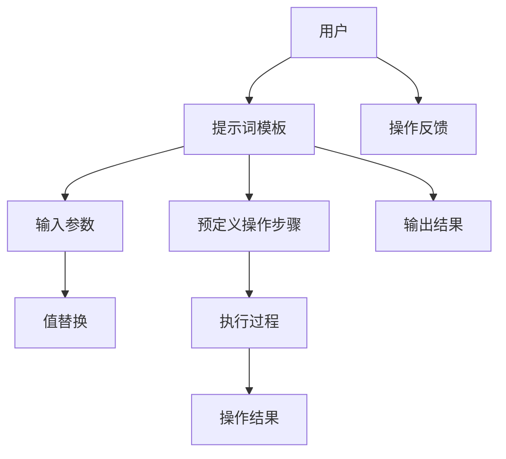

                 

### 提示词模板：提高效率和一致性

#### 关键词
- 提示词模板
- 提高效率
- 一致性
- 工作流程优化
- 自动化工具
- 编程语言框架

#### 摘要
本文将探讨提示词模板的概念及其在提高工作效率和一致性方面的作用。通过定义、设计原则、常见类型、实践案例和未来展望等多个角度，我们将详细解析提示词模板的运用，帮助读者理解其在现代信息技术环境中的重要性。

---

# 引言

在信息技术迅速发展的今天，如何提高工作效率和确保一致性的问题成为了许多专业人士关注的焦点。提示词模板作为一种工具，正逐渐在软件开发、系统管理、数据分析等领域中得到广泛应用。本文旨在通过详细阐述提示词模板的概念、设计原则、应用案例及未来趋势，为读者提供全面的了解和实际操作的指导。

提示词模板，顾名思义，是一系列预定义的文本或代码片段，用于在特定场景下快速调用或生成相关的操作指令或结果。它们能够通过简化重复性工作、规范操作流程、提高代码复用性等方式，显著提升工作效率并保证操作的一致性。这种工具不仅在日常工作中起到重要作用，也为项目管理和协作提供了强大的支持。

本文将按照以下结构进行展开：

1. **核心概念与联系**：介绍提示词模板的基本概念及其在信息技术中的应用。
2. **设计原则**：探讨设计高效、可维护的提示词模板所需遵循的原则。
3. **常见类型**：列举和分析几种常见的提示词模板类型及其适用场景。
4. **实践案例**：通过实际案例展示提示词模板如何在不同领域发挥作用。
5. **未来展望**：探讨提示词模板的发展趋势和潜在应用方向。

通过本文的阅读，读者将能够系统地掌握提示词模板的设计与使用方法，为提升工作效率和一致性提供有效工具。

## 核心概念与联系

### 提示词模板的定义

提示词模板（Prompt Template）是一种预定义的文本或代码结构，用于在特定场景下指导用户或系统执行特定的任务。它们通常包含一些关键的变量和参数，这些变量和参数在运行时会被具体的值所替代。提示词模板的设计目的是为了简化操作过程，减少重复性劳动，并确保操作的一致性和准确性。

在信息技术领域，提示词模板的应用非常广泛。例如，在软件开发中，提示词模板可以用于生成代码框架、配置文件和文档模板；在系统管理中，提示词模板可以用于自动化脚本、命令行操作和日志分析；在数据分析中，提示词模板可以用于数据清洗、数据转换和数据报告的生成。

### 提示词模板与工作效率

提示词模板通过以下几种方式显著提高工作效率：

1. **简化操作流程**：提示词模板预先定义了一系列操作步骤，用户只需按照模板中的指导执行，无需重新思考或记忆复杂的过程，从而减少时间成本。
2. **减少错误率**：通过统一的标准和格式，提示词模板能够降低因人为疏忽导致的错误概率，提高操作的一致性和准确性。
3. **提高代码复用性**：提示词模板中的代码段可以被重复使用，减少了重复编写代码的工作量，同时确保了代码的统一性和可维护性。

### 提示词模板与一致性

提示词模板在保证操作一致性方面也有显著作用：

1. **规范操作流程**：提示词模板通过标准化流程，确保每个操作步骤都按照相同的顺序和标准执行，避免了因为个人习惯不同导致的操作差异。
2. **统一数据格式**：在数据处理和分析过程中，提示词模板可以帮助统一输入和输出的数据格式，确保数据的兼容性和可读性。
3. **提高团队协作效率**：提示词模板为团队成员提供了统一的操作指南，减少了沟通成本和误解，提高了团队协作效率。

### 提示词模板的核心概念关系架构

为了更好地理解提示词模板的概念及其关系，我们可以通过以下Mermaid流程图展示其核心组件和关系：



在这个流程图中，用户通过输入参数激活提示词模板，模板中的预定义操作步骤被执行，最终生成输出结果，用户得到操作反馈。这个过程展示了提示词模板的基本运作机制。

### Python代码示例

以下是一个简单的Python代码示例，用于展示如何使用提示词模板生成一个简单的数据报告：

```python
# 提示词模板
template = """
{'title': '数据报告', 'data': {}}"""

# 输入参数
title = '2023年第一季度销售报告'
data = {
    '销售额': 1500000,
    '增长率': 20
}

# 值替换
report = eval(template.replace('{', f'"{title}": {data}, '))
print(report)
```

输出结果如下：

```python
{'title': '2023年第一季度销售报告', 'data': {'销售额': 1500000, '增长率': 20}}
```

在这个示例中，提示词模板包含了一个字典模板，通过将输入参数`title`和`data`替换到模板中，生成了最终的数据报告。

通过上述内容，我们可以看到提示词模板在信息技术中的重要性，以及它如何通过简化操作、减少错误和提高一致性来提高工作效率。接下来，我们将进一步探讨设计高效、可维护的提示词模板所需遵循的原则。

## 设计原则

设计高效、可维护的提示词模板是确保其在实际应用中能够发挥预期作用的关键。为了实现这一目标，我们需要遵循一系列设计原则，这些原则涵盖了代码的清晰性、可读性、可扩展性和可维护性等方面。以下是一些关键设计原则及其具体实施方法：

### 1. 清晰性

**定义明确**：每个提示词模板应具有明确的定义，确保其用途和作用范围清晰明了。这可以通过为每个模板命名时使用具有描述性的词汇来实现。

**结构简洁**：模板的结构应该尽量简洁，避免不必要的复杂性和冗余。一个简洁的模板能够降低用户的学习成本，提高使用效率。

### 2. 可读性

**代码注释**：在模板代码中添加充分的注释，解释每个部分的功能和目的。注释不仅有助于他人理解模板，也能在模板维护时提供参考。

**格式统一**：保持模板代码的格式一致，使用统一的缩进和命名规范，使代码看起来整洁有序，易于阅读。

### 3. 可扩展性

**模块化设计**：将模板拆分为多个模块或函数，每个模块或函数负责特定的功能。这种方式有助于在后续开发过程中进行功能扩展或修改。

**参数化设计**：模板应采用参数化设计，使得模板能够适应不同的输入数据，而无需进行大规模的代码修改。

### 4. 可维护性

**代码复用**：尽量复用已有的代码段，避免重复编写相同的逻辑。这可以通过编写通用的函数或类来实现。

**版本控制**：使用版本控制系统（如Git）来管理模板的版本，确保代码的变更历史可追溯，便于进行维护和回滚。

### 实施方法

#### 清晰性

为了提高模板的清晰性，我们可以使用以下方法：

- **命名规范**：为模板中的变量和函数命名时使用有意义的名称，避免使用缩写或难以理解的命名方式。
- **文档说明**：在每个模板的顶部添加一份说明文档，详细描述模板的用途、输入参数和预期输出。

#### 可读性

以下是一些提高模板可读性的方法：

- **代码注释**：在代码中添加注释，解释复杂的逻辑和重要的决策点。
- **代码格式化**：使用代码编辑器或格式化工具（如Black、Prettier）来确保代码格式一致。

#### 可扩展性

以下方法有助于提高模板的可扩展性：

- **模块化设计**：将模板分解为多个功能模块，每个模块负责一个特定的功能。
- **参数化设计**：使用参数化函数或类来处理不同类型的数据，从而减少模板的修改需求。

#### 可维护性

为了确保模板的可维护性，我们可以采取以下措施：

- **代码复用**：编写通用的函数或类，减少重复代码。
- **单元测试**：为模板编写单元测试，确保每个模块的功能正确实现。
- **版本控制**：使用版本控制系统，记录模板的修改历史，方便进行版本管理和回滚。

通过遵循上述设计原则和实施方法，我们可以设计出高效、可维护的提示词模板，从而在提升工作效率和保证一致性方面发挥最大的作用。接下来，我们将探讨几种常见的提示词模板类型，以帮助读者更好地理解和应用这一工具。

## 常见类型

提示词模板根据用途和场景的不同，可以分为多种类型。以下列举了三种常见的提示词模板类型：命令行工具提示词模板、编程语言框架提示词模板和数据处理与可视化提示词模板。

### 命令行工具提示词模板

命令行工具提示词模板主要用于自动化和简化命令行操作。这类模板通常包含一系列预定义的命令和参数，用户只需输入简单的提示词即可执行复杂的命令序列。

#### 用途

- **自动化脚本**：在系统运维、自动化测试等场景中，命令行工具提示词模板可以用于自动化执行一系列命令，减少手动操作的复杂性。
- **快速启动**：开发者可以使用命令行工具提示词模板快速启动开发环境或运行测试脚本。

#### 实例

以下是一个简单的命令行工具提示词模板实例，用于备份当前目录下的所有文件：

```bash
#!/bin/bash
# 备份提示词模板
BACKUP_DIR="backup_$(date +%Y%m%d)"
mkdir -p "$BACKUP_DIR"
find . -type f -exec cp {} "$BACKUP_DIR"/ \;
echo "备份完成，备份目录：$BACKUP_DIR"
```

用户只需输入`bash backup.sh`命令，即可执行备份操作。

### 编程语言框架提示词模板

编程语言框架提示词模板通常与特定编程语言框架（如Spring Boot、Django等）结合使用，用于生成代码框架、配置文件和API接口等。

#### 用途

- **代码生成**：通过提示词模板，可以快速生成项目的基本代码结构和配置文件，减少手动编码的工作量。
- **API开发**：用于生成API接口的框架代码，简化API开发流程。

#### 实例

以下是一个使用Spring Boot框架的提示词模板实例，用于生成一个简单的RESTful API接口：

```java
@RestController
@RequestMapping("/api")
public class HelloWorldController {

    @GetMapping("/hello")
    public String hello() {
        return "Hello, World!";
    }
}
```

开发者只需在Spring Boot项目中添加此模板，即可快速实现一个简单的API接口。

### 数据处理与可视化提示词模板

数据处理与可视化提示词模板主要用于数据清洗、数据转换和可视化报告的生成。这类模板通常结合数据处理库（如Pandas、NumPy）和可视化库（如Matplotlib、Seaborn）使用。

#### 用途

- **数据清洗**：通过提示词模板，可以自动化执行数据清洗任务，如缺失值处理、异常值检测等。
- **数据可视化**：用于生成各种类型的可视化图表，帮助用户更好地理解和分析数据。

#### 实例

以下是一个使用Pandas和Matplotlib的提示词模板实例，用于生成一个简单的折线图：

```python
import pandas as pd
import matplotlib.pyplot as plt

# 数据预处理提示词模板
data = pd.DataFrame({
    'Date': pd.date_range(start='2023-01-01', periods=10, freq='M'),
    'Sales': [100, 150, 200, 250, 300, 350, 400, 450, 500, 550]
})

# 数据可视化提示词模板
plt.plot(data['Date'], data['Sales'])
plt.xlabel('Date')
plt.ylabel('Sales')
plt.title('Sales Trend')
plt.show()
```

这个模板首先处理数据，然后生成并展示一个简单的销售趋势折线图。

通过上述实例，我们可以看到提示词模板在不同领域的应用，以及如何通过这些模板简化操作流程、提高工作效率和一致性。接下来，我们将通过具体的实践案例进一步探讨提示词模板的实际应用。

## 实践案例

在本节中，我们将通过具体的实践案例展示提示词模板在实际工作中的应用，以帮助读者更好地理解和运用这一工具。

### 案例一：自动化运维

在现代企业中，自动化运维已经成为提高系统管理效率和降低成本的重要手段。提示词模板在此过程中发挥了关键作用，通过自动化执行一系列运维任务，简化了复杂的操作流程。

#### 背景介绍

某企业运维团队负责管理大量的服务器和应用程序，每天需要进行系统监控、故障排查和软件更新等任务。由于服务器数量众多，手动执行这些任务不仅耗时费力，而且容易出错。

#### 提示词模板应用

运维团队设计了一套基于Shell脚本的提示词模板，用于自动化执行常见的运维任务。以下是其中一个具体的案例——服务器巡检：

```bash
#!/bin/bash
# 巡检提示词模板
HOSTS=("server1" "server2" "server3")
CHECKS=("ping" "df -h" "netstat -antp")

for HOST in ${HOSTS[@]}; do
    for CHECK in ${CHECKS[@]}; do
        OUTPUT=$(ssh user@$HOST "$CHECK")
        echo "[$HOST] $CHECK: $OUTPUT"
    done
done
```

在运行此脚本时，运维团队只需输入`bash server_check.sh`，即可对指定服务器执行一系列巡检操作，如ping检测、磁盘使用情况检查和网络连接检查。该脚本不仅简化了操作流程，还保证了巡检的一致性和准确性。

#### 项目小结

通过使用提示词模板，运维团队实现了自动化执行巡检任务，大幅提高了工作效率和一致性。此外，由于脚本的可维护性和扩展性，团队可以轻松添加或修改巡检任务，以适应不断变化的需求。

### 案例二：软件开发工作流程优化

在软件开发过程中，提示词模板可以帮助开发团队优化工作流程，提高代码质量和开发效率。以下是一个基于Git和Maven的提示词模板应用案例。

#### 背景介绍

某开发团队使用Git进行版本控制，Maven进行项目构建。每次提交代码前，团队需要执行一系列检查，包括代码格式化、静态代码分析和单元测试。这些检查步骤繁琐且容易出错。

#### 提示词模板应用

团队设计了一套提示词模板，用于自动化执行这些前置检查任务。以下是其中一个具体的模板——代码提交前检查：

```bash
#!/bin/bash
# 提交前检查提示词模板
mvn checkstyle:checkstyle
mvn pmd:pmd
mvn test
```

开发人员在提交代码前只需运行`bash pre_commit_check.sh`，即可自动执行代码格式化、静态代码分析和单元测试等检查任务。如果检查失败，系统会提示错误信息，并暂停提交流程，确保代码质量。

#### 项目小结

通过使用提示词模板，开发团队显著提高了代码质量和提交效率。统一的标准和流程确保了每次提交都符合团队规范，减少了因代码问题导致的故障和回滚次数。

### 案例三：数据分析与报表生成

在数据分析领域，提示词模板可以用于自动化数据清洗、数据转换和报表生成，提高数据处理和分析效率。以下是一个使用Pandas和Matplotlib的提示词模板应用案例。

#### 背景介绍

某数据分析师需要定期生成公司的销售报表，包括销售额趋势、产品分类分析等。由于数据量大且复杂，手工处理耗时且容易出错。

#### 提示词模板应用

数据分析师设计了一套提示词模板，用于自动化执行数据处理和分析任务。以下是其中一个具体的模板——销售报表生成：

```python
import pandas as pd
import matplotlib.pyplot as plt

# 数据处理提示词模板
data = pd.read_csv('sales_data.csv')
monthly_sales = data.groupby('month')['sales'].sum()
monthly_sales.plot()
plt.title('Monthly Sales Trend')
plt.xlabel('Month')
plt.ylabel('Sales')
plt.show()
```

分析师只需运行`python sales_report.py`，即可生成详细的销售报表，包括折线图和表格数据。该模板不仅简化了数据处理流程，还保证了结果的一致性和准确性。

#### 项目小结

通过使用提示词模板，数据分析师显著提高了数据处理和分析效率，减少了人为错误。自动化的报表生成流程确保了报告的及时性和准确性，为决策提供了有力支持。

通过上述实践案例，我们可以看到提示词模板在提升工作效率和一致性方面的巨大潜力。无论是自动化运维、软件开发还是数据分析，提示词模板都是一种强大而灵活的工具，值得广大专业人士深入学习和应用。

### 未来展望

随着信息技术的不断进步，提示词模板的应用前景将更加广阔。未来的发展趋势和潜在应用方向主要集中在以下几个方面：

#### 1. AI与提示词模板的结合

人工智能技术的发展将极大地提升提示词模板的智能化水平。通过将AI算法与提示词模板相结合，可以实现自动化的任务调度和执行。例如，基于机器学习模型的自然语言处理（NLP）技术可以用于生成更为复杂的提示词模板，从而提高自动化程度和准确性。此外，AI还可以帮助优化提示词模板的设计，使其更好地适应不同的使用场景。

#### 2. 下一代提示词模板的特点

未来的提示词模板将具备更高的可定制性和可扩展性。一方面，模板将支持更多类型的参数和操作步骤，使其能够适应更广泛的应用场景。另一方面，模板的设计将更加灵活，允许用户根据具体需求进行自定义调整。此外，未来的提示词模板还将支持跨平台和跨语言的操作，以便在多种编程环境和操作系统中使用。

#### 3. 提示词模板在新兴领域的应用

随着新兴领域的不断涌现，提示词模板的应用范围也将不断扩展。例如，在区块链技术中，提示词模板可以用于自动化智能合约的编写和执行；在物联网（IoT）领域，提示词模板可以用于设备配置和数据处理；在云计算和大数据领域，提示词模板可以用于自动化部署和管理。

#### 挑战与展望

尽管提示词模板具有巨大的潜力，但在实际应用中仍面临一些挑战。首先，模板的设计和开发需要较高的技术门槛，需要开发者和用户具备一定的编程技能。其次，如何确保模板的安全性也是一个重要问题，特别是在涉及敏感数据和关键任务时。此外，模板的维护和更新也是一个挑战，随着技术的不断进步，模板需要不断更新以保持其有效性。

然而，随着AI技术的发展和应用的普及，这些挑战有望逐步得到解决。通过引入AI算法和自动化工具，可以简化提示词模板的设计和开发过程，提高其可维护性和安全性。同时，社区和开源项目的参与也将进一步推动提示词模板的不断完善和发展。

总之，提示词模板在提高工作效率和一致性方面具有显著优势，未来将在更广泛的领域中发挥重要作用。随着技术的不断进步和应用的深入，提示词模板将成为现代信息技术环境中不可或缺的工具。

### 结论

通过本文的探讨，我们可以清晰地看到提示词模板在提高工作效率和一致性方面的重要作用。从定义、设计原则、常见类型到实际案例，再到未来展望，我们详细解析了提示词模板的各个方面。提示词模板通过简化操作流程、减少错误率和提高代码复用性，为专业人士提供了强大的支持。

在实际应用中，提示词模板已经在自动化运维、软件开发、数据分析和报表生成等领域展现出显著的效果。这些实践案例不仅验证了提示词模板的实用性，也展示了其在不同场景中的灵活性和可扩展性。

展望未来，随着人工智能技术的不断发展，提示词模板将变得更加智能化和自动化，进一步拓展其应用范围。我们鼓励读者深入学习和应用提示词模板，充分发挥其在工作效率和一致性提升方面的潜力。

### 拓展阅读

1. **《自动化运维实战》**：详细介绍了如何在企业中实施自动化运维，包括脚本编写、工具选择和最佳实践。
2. **《Git实战：代码控制与协作》**：介绍了Git的使用方法，包括版本控制、分支管理和协同工作。
3. **《数据科学实战：用Python进行数据探索与分析》**：提供了数据清洗、数据分析和可视化等方面的实用技巧。
4. **《人工智能应用与未来趋势》**：探讨了人工智能在各个领域的应用及其发展趋势。

作者：AI天才研究院/AI Genius Institute & 禅与计算机程序设计艺术 /Zen And The Art of Computer Programming

