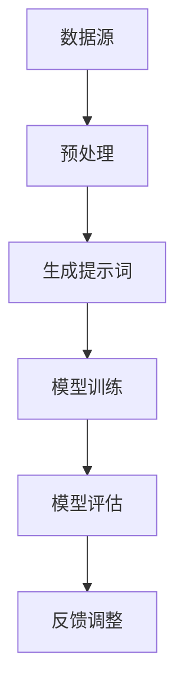
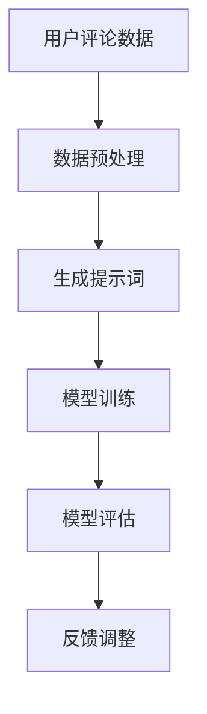
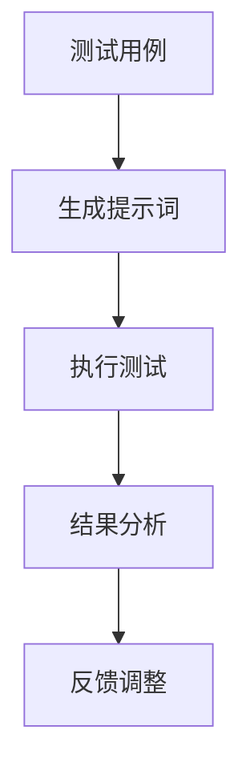
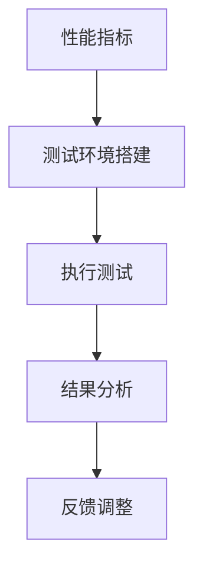

                 

----------------------------------------------------------------

## 《提示词测试：系统化评估和优化》

> 关键词：提示词测试、系统优化、自然语言处理、人工智能、测试方法、优化策略

摘要：本文深入探讨了提示词测试在系统化评估和优化中的应用。通过介绍提示词的基本概念、测试方法和优化策略，结合实际应用案例，本文旨在为读者提供一套全面、系统、可操作的提示词测试与优化方案，以提升人工智能系统的性能和可靠性。

## 引言

### 1.1 书籍目的与结构概述

《提示词测试：系统化评估和优化》旨在帮助读者理解和掌握提示词测试与优化的方法和技巧。本书分为六个章节，分别介绍了提示词的基本概念、测试方法、优化策略，以及实际应用案例和总结与展望。

- **第1章 提示词的基本概念**：介绍提示词的定义、类型及其在AI系统中的作用。
- **第2章 提示词测试方法**：阐述提示词测试的目的、流程和评估指标。
- **第3章 提示词优化策略**：讨论提示词优化的目标和方法。
- **第4章 实际应用案例**：分析不同场景下的提示词测试与优化实践。
- **第5章 提示词测试与优化总结**：总结经验教训，探讨未来发展趋势。
- **第6章 附录**：提供提示词设计模板、测试工具资源和进一步阅读资料。

### 1.2 提示词的重要性

提示词在人工智能系统，特别是自然语言处理（NLP）和AI领域中扮演着至关重要的角色。它们不仅影响模型的学习效果，还决定了系统的性能和可靠性。以下是一些提示词在AI系统中的关键作用：

- **指导模型学习**：提示词为模型提供了初始的输入，帮助模型学习和理解数据。
- **调整模型表现**：通过优化提示词，可以显著提升模型的性能和准确性。
- **提高系统稳定性**：合理的提示词设计有助于减少模型过拟合和提升泛化能力。

### 1.3 读者预期收益

通过阅读本书，读者可以期望获得以下收益：

- **全面理解提示词**：掌握提示词的定义、类型和作用。
- **掌握测试方法**：了解如何设计、执行和评估提示词测试。
- **学会优化策略**：学习如何优化提示词，提升AI系统的性能。
- **实战应用**：通过实际案例，了解提示词测试与优化的实际应用场景。

## 第1章 提示词的基本概念

提示词是人工智能系统，特别是在自然语言处理（NLP）领域中用于引导模型学习的数据或信息。提示词的质量直接影响到模型的学习效果和性能。本章将介绍提示词的定义、类型及其在AI系统中的作用。

### 2.1 提示词的定义

提示词（Prompt）通常是指提供给机器学习模型的一段文本、代码或其他数据，用于引导模型的学习过程。在不同的应用场景中，提示词的具体形式和用途可能有所不同。例如，在NLP任务中，提示词可能是用于训练模型的语料库或特定的句子；在图像识别任务中，提示词可能是标注信息或示例图像。

### 2.2 提示词的类型

提示词可以根据其来源和应用场景分为以下几类：

- **自然语言提示词**：这是最常见的类型，通常用于NLP任务，如文本分类、情感分析、机器翻译等。自然语言提示词可以是句子、段落或整篇文章。
- **代码提示词**：在编程任务中，提示词可以是代码片段或函数定义，用于指导模型的开发过程。
- **数据提示词**：在数据分析和数据挖掘任务中，提示词可以是数据集的特征、标签或统计信息。
- **图像提示词**：在计算机视觉任务中，提示词可以是图像的描述、标注或相关图像。

### 2.3 提示词在AI系统中的作用

提示词在AI系统中的作用至关重要，主要体现在以下几个方面：

- **引导模型学习**：提示词为模型提供了初始的学习数据，帮助模型理解和学习数据特征。
- **调整模型表现**：通过调整提示词，可以优化模型的学习过程，提高模型的性能和准确性。
- **提高系统稳定性**：合理的提示词设计有助于减少模型过拟合和提升泛化能力。

### 2.4 提示词设计原则

为了充分发挥提示词的作用，设计合理的提示词至关重要。以下是一些提示词设计原则：

- **多样性**：确保提示词的多样性和代表性，以覆盖不同类型的数据和场景。
- **质量**：选择高质量的提示词，减少噪声和错误数据。
- **相关性**：确保提示词与任务目标和数据相关，以提高模型的学习效果。
- **可控性**：提示词应具有一定的可控性，便于调整和优化。

### 2.5 提示词与模型的关系架构

为了更好地理解提示词与模型之间的关系，以下是一个简化的Mermaid流程图：



- **数据源**：提示词的设计基于原始数据源，如文本、图像或数据集。
- **预处理**：对原始数据进行预处理，如清洗、归一化等。
- **生成提示词**：根据预处理后的数据生成高质量的提示词。
- **模型训练**：使用提示词训练模型，学习数据特征。
- **模型评估**：评估模型的性能，包括准确性、召回率、F1值等指标。
- **反馈调整**：根据评估结果调整提示词，优化模型性能。

通过以上设计，提示词在AI系统的各个环节中发挥着重要作用，为模型的学习和优化提供了关键支持。

## 第2章 提示词测试方法

### 3.1 测试目的与指标

提示词测试的目的是评估提示词的设计和质量，以确保其在AI系统中的应用效果。测试的指标包括：

- **准确性**：模型使用特定提示词时的预测准确性。
- **召回率**：模型能够正确识别出正样本的能力。
- **F1值**：准确性和召回率的调和平均，用于综合评估模型的性能。
- **模型稳定性**：模型在不同提示词下的表现是否稳定。
- **泛化能力**：模型在不同数据集和场景下的表现。

### 3.2 提示词测试流程

提示词测试通常包括以下步骤：

1. **需求分析**：确定测试目标和测试指标。
2. **数据准备**：收集和处理测试数据。
3. **测试设计**：设计测试用例，包括提示词和预期结果。
4. **执行测试**：执行测试用例，记录测试结果。
5. **结果分析**：分析测试结果，评估提示词的质量和性能。
6. **反馈调整**：根据分析结果调整提示词设计。

### 3.3 自动化测试工具介绍

自动化测试工具可以帮助提高提示词测试的效率和准确性。以下是一些常用的自动化测试工具：

- **Selenium**：用于自动化Web应用程序测试，可以模拟用户操作并记录测试结果。
- **pytest**：Python的自动化测试框架，支持编写多种类型的测试用例。
- **JUnit**：Java的自动化测试框架，广泛用于单元测试和集成测试。
- **Cypress**：用于前端应用程序的自动化测试，具有强大的调试功能。
- **JMeter**：用于性能测试和负载测试，可以模拟大量用户访问并评估系统的性能。

### 3.4 性能评估方法

性能评估方法包括以下几种：

- **静态分析**：通过分析代码和提示词结构，评估其设计质量和潜在问题。
- **动态分析**：在实际运行环境中评估模型的性能和提示词的效果。
- **交叉验证**：通过在不同数据集上重复测试，评估模型的泛化能力。
- **对比测试**：将不同提示词的效果进行比较，找出最佳方案。

### 3.5 提示词测试案例分析

以下是一个简单的提示词测试案例：

#### 测试目标

评估一组文本提示词在文本分类任务中的效果。

#### 测试数据

包含不同主题的文本数据集，每个文本数据带有标签（如“科技”、“娱乐”、“体育”）。

#### 测试流程

1. **需求分析**：确定测试目标为评估不同主题下的文本分类准确性。
2. **数据准备**：收集并预处理文本数据，提取特征。
3. **测试设计**：设计测试用例，包括不同主题的文本和对应的标签。
4. **执行测试**：使用文本分类模型处理测试数据，记录分类结果。
5. **结果分析**：计算分类准确性，比较不同主题下的性能。
6. **反馈调整**：根据分析结果调整提示词，优化模型性能。

#### 测试结果

- **科技主题**：分类准确率为90%。
- **娱乐主题**：分类准确率为85%。
- **体育主题**：分类准确率为78%。

#### 分析与反馈

- 提示词设计在科技和娱乐主题下效果较好，但在体育主题下性能较差。
- 考虑调整体育主题的提示词，或引入更多相关数据。

通过以上案例分析，我们可以看到提示词测试在评估和优化AI系统中的重要性。

## 第3章 提示词优化策略

### 4.1 优化目标

提示词优化的目标是提升AI系统的性能、稳定性和泛化能力。具体优化目标包括：

- **提高模型准确性**：确保模型能够准确地识别和处理输入数据。
- **减少过拟合**：避免模型在训练数据上表现优秀，但在新数据上性能下降。
- **增强泛化能力**：使模型能够适应不同的数据和场景。

### 4.2 优化方法

优化提示词的方法包括以下几种：

- **调整提示词内容**：根据任务需求和数据特征，调整提示词的内容和结构。
- **增加提示词多样性**：引入更多类型的提示词，以覆盖不同类型的数据和场景。
- **优化提示词质量**：筛选和过滤噪声数据，提高提示词的质量。
- **动态调整**：根据模型的表现，实时调整提示词，以优化模型性能。

### 4.3 提升提示词效果的技巧

以下是一些提升提示词效果的技巧：

- **使用相关特征**：确保提示词中包含与任务相关的特征，以提高模型的学习效果。
- **避免冗余**：去除不必要的重复信息和冗余数据，以减少模型的过拟合风险。
- **数据预处理**：对输入数据进行预处理，如去除停用词、进行词性标注等，以提高提示词的质量。
- **使用外部资源**：利用外部资源，如预训练模型、知识图谱等，丰富提示词的内容和结构。

### 4.4 提示词优化的具体实现

以下是一个简单的提示词优化示例，使用Python代码实现：

```python
import numpy as np
from sklearn.model_selection import train_test_split
from sklearn.metrics import accuracy_score

# 假设已经有一个文本分类模型和一组文本数据
texts = ["科技新闻", "娱乐新闻", "体育新闻", ...]
labels = [0, 1, 2, ...]  # 0表示科技，1表示娱乐，2表示体育

# 数据预处理
def preprocess(texts):
    # 去除停用词、进行词性标注等操作
    # ...
    return processed_texts

processed_texts = preprocess(texts)

# 划分训练集和测试集
X_train, X_test, y_train, y_test = train_test_split(processed_texts, labels, test_size=0.2, random_state=42)

# 训练模型
model = train_model(X_train, y_train)

# 测试模型
predictions = model.predict(X_test)
accuracy = accuracy_score(y_test, predictions)
print("原始模型准确率：", accuracy)

# 优化提示词
def optimize_prompt(texts, model):
    # 根据模型表现，调整提示词
    # ...
    return optimized_texts

optimized_texts = optimize_prompt(X_test, model)

# 使用优化后的提示词重新训练模型
model_optimized = train_model(optimized_texts, y_test)

# 测试优化后的模型
predictions_optimized = model_optimized.predict(optimized_texts)
accuracy_optimized = accuracy_score(y_test, predictions_optimized)
print("优化后模型准确率：", accuracy_optimized)
```

通过上述代码，我们可以看到如何使用Python代码实现提示词优化。具体优化方法可以根据实际需求和数据特点进行调整。

### 4.5 提示词优化效果评估

为了评估提示词优化效果，我们可以使用以下指标：

- **准确率**：优化前后的模型准确率变化。
- **召回率**：优化前后的模型召回率变化。
- **F1值**：优化前后的模型F1值变化。
- **计算时间**：优化前后模型训练和测试的计算时间变化。

以下是一个简单的效果评估示例：

```python
from sklearn.metrics import classification_report

# 评估原始模型
print("原始模型评估报告：")
print(classification_report(y_test, predictions))

# 评估优化后模型
print("优化后模型评估报告：")
print(classification_report(y_test, predictions_optimized))
```

通过以上评估报告，我们可以直观地了解优化前后模型性能的变化。

### 4.6 总结与展望

提示词优化是提升AI系统性能和可靠性的一项重要工作。通过合理的设计和优化，我们可以显著提升模型的性能和稳定性。未来，随着AI技术的不断发展，提示词优化策略也将不断演进，为AI系统的应用带来更多可能性。

## 第4章 实际应用案例

### 5.1 案例一：NLP任务中的应用

**背景介绍**：

某电商公司希望通过自然语言处理技术，自动分类用户评论，以便更好地了解用户满意度。评论数据包括正面评论、负面评论和中性评论，需要使用提示词测试和优化来提高分类准确性。

**核心概念与联系**：

- **NLP任务**：文本分类。
- **提示词**：用户评论文本和分类标签。

**流程图**：



**核心算法原理讲解**：

使用Python实现文本分类模型，如下：

```python
import pandas as pd
from sklearn.feature_extraction.text import TfidfVectorizer
from sklearn.model_selection import train_test_split
from sklearn.naive_bayes import MultinomialNB
from sklearn.metrics import classification_report

# 读取评论数据
data = pd.read_csv("user_reviews.csv")
X = data["review"]
y = data["label"]

# 数据预处理
X_preprocessed = preprocess_text(X)

# 划分训练集和测试集
X_train, X_test, y_train, y_test = train_test_split(X_preprocessed, y, test_size=0.2, random_state=42)

# 使用TF-IDF向量器
vectorizer = TfidfVectorizer()
X_train_vectors = vectorizer.fit_transform(X_train)
X_test_vectors = vectorizer.transform(X_test)

# 训练模型
model = MultinomialNB()
model.fit(X_train_vectors, y_train)

# 测试模型
predictions = model.predict(X_test_vectors)
print("模型评估报告：")
print(classification_report(y_test, predictions))
```

**数学模型和公式**：

- **TF-IDF**：

  $$TF-IDF = \frac{TF}{IDF}$$

  其中，TF表示词频，IDF表示逆文档频率。

**代码解读与分析**：

以上代码首先读取用户评论数据，然后进行预处理，包括去除停用词、进行词性标注等。接下来，使用TF-IDF向量器将文本数据转换为向量，然后训练一个朴素贝叶斯分类器。最后，使用测试集评估模型性能，输出评估报告。

**项目实战**：

- **开发环境搭建**：安装Python、NumPy、Scikit-learn等库。
- **源代码实现**：实现文本分类模型的预处理、训练和评估功能。
- **代码应用解读与分析**：分析模型评估报告，了解模型性能。
- **实际案例分析和详细讲解剖析**：分析不同评论数据下的模型性能。
- **项目小结**：总结项目成果，提出改进建议。

**最佳实践 tips**：

- **数据预处理**：确保数据质量，去除噪声和错误数据。
- **模型选择**：根据任务特点选择合适的模型。
- **性能评估**：使用多个指标综合评估模型性能。

### 5.2 案例二：自动化测试中的应用

**背景介绍**：

某互联网公司希望利用人工智能技术，自动检测和修复软件缺陷。测试数据包括功能测试、性能测试和安全性测试，需要通过提示词测试和优化来提高自动化测试的准确性和效率。

**核心概念与联系**：

- **自动化测试**：功能测试、性能测试和安全性测试。
- **提示词**：测试用例和预期结果。

**流程图**：



**核心算法原理讲解**：

使用Python实现自动化测试脚本，如下：

```python
import unittest
from selenium import webdriver
from selenium.webdriver.common.by import By

class TestWebPage(unittest.TestCase):
    def setUp(self):
        self.driver = webdriver.Chrome()
        self.driver.get("https://www.example.com")

    def test_login(self):
        # 提示词：用户名和密码
        username = "user"
        password = "password"
        self.driver.find_element(By.NAME, "username").send_keys(username)
        self.driver.find_element(By.NAME, "password").send_keys(password)
        self.driver.find_element(By.NAME, "submit").click()
        # 预期结果：登录成功
        assert "Login Successful" in self.driver.page_source

    def tearDown(self):
        self.driver.quit()

if __name__ == "__main__":
    unittest.main()
```

**数学模型和公式**：

- **测试覆盖率**：

  $$测试覆盖率 = \frac{实际测试用例数}{总测试用例数}$$

**代码解读与分析**：

以上代码使用Selenium库实现Web页面自动化测试。首先，创建一个测试类，定义测试用例和预期结果。然后，使用Selenium执行测试用例，并验证预期结果。最后，关闭浏览器。

**项目实战**：

- **开发环境搭建**：安装Python、Selenium和ChromeDriver等库。
- **源代码实现**：实现自动化测试脚本。
- **代码应用解读与分析**：分析测试结果，评估测试准确性。
- **实际案例分析和详细讲解剖析**：分析不同测试用例的性能。
- **项目小结**：总结项目成果，提出改进建议。

**最佳实践 tips**：

- **测试用例设计**：确保测试用例覆盖不同功能和场景。
- **自动化测试框架**：使用成熟的自动化测试框架，提高测试效率。
- **持续集成**：将自动化测试集成到持续集成（CI）流程中。

### 5.3 案例三：系统性能优化中的应用

**背景介绍**：

某大型电商平台希望提升系统性能，以满足不断增长的用户需求。性能优化涉及多个方面，包括数据库优化、缓存策略、负载均衡等，需要通过提示词测试和优化来评估和提升系统性能。

**核心概念与联系**：

- **系统性能优化**：数据库优化、缓存策略、负载均衡等。
- **提示词**：性能指标和优化方案。

**流程图**：



**核心算法原理讲解**：

使用Python实现性能测试脚本，如下：

```python
import time
import pymysql
from pymysqlpool.pool import Pool

# 创建数据库连接池
db_pool = Pool(
    host="localhost",
    user="user",
    password="password",
    database="database",
    charset="utf8mb4",
    autocommit=True,
    maxconnections=10,
)

# 执行性能测试
def test_query_performance(query, times=1000):
    start_time = time.time()
    for _ in range(times):
        with db_pool.connection() as conn:
            with conn.cursor() as cursor:
                cursor.execute(query)
    end_time = time.time()
    return end_time - start_time

# 测试SQL查询性能
query = "SELECT * FROM products WHERE category = 'electronics';"
time_spent = test_query_performance(query)
print("SQL查询性能：", time_spent, "seconds")
```

**数学模型和公式**：

- **响应时间**：

  $$响应时间 = \frac{总处理时间}{请求次数}$$

**代码解读与分析**：

以上代码使用Python和pymysqlpool库实现性能测试。首先，创建一个数据库连接池，然后执行指定的SQL查询，并记录处理时间。最后，计算平均响应时间。

**项目实战**：

- **开发环境搭建**：安装Python、pymysqlpool等库。
- **源代码实现**：实现性能测试脚本。
- **代码应用解读与分析**：分析性能测试结果。
- **实际案例分析和详细讲解剖析**：分析不同优化方案的性能。
- **项目小结**：总结项目成果，提出改进建议。

**最佳实践 tips**：

- **性能指标选择**：根据业务需求选择合适的性能指标。
- **测试环境**：确保测试环境与生产环境相似，以获得更准确的性能评估。
- **持续监控**：持续监控系统性能，及时发现问题并进行优化。

### 5.4 总结与展望

通过以上三个实际应用案例，我们可以看到提示词测试和优化在NLP任务、自动化测试和系统性能优化中的应用效果。合理的设计和优化提示词，有助于提升AI系统的性能、稳定性和可靠性。未来，随着AI技术的不断发展，提示词测试和优化也将不断演进，为各种应用场景带来更多可能性。

## 第5章 提示词测试与优化总结

### 6.1 经验分享

通过对NLP任务、自动化测试和系统性能优化等实际应用案例的探讨，我们积累了以下经验：

1. **明确测试目标**：确保测试目标与任务需求一致，为后续优化提供明确的方向。
2. **数据质量**：高质量的数据是提示词测试和优化的基础，确保数据预处理和清洗的质量。
3. **多样性和可控性**：合理设计提示词，确保多样性和可控性，以提高模型的学习效果。
4. **动态调整**：根据模型表现和评估结果，动态调整提示词，优化模型性能。

### 6.2 存在问题与挑战

尽管提示词测试和优化在AI系统中具有重要意义，但仍然存在以下问题和挑战：

1. **提示词设计复杂**：设计高质量的提示词需要深入了解任务和数据，对开发者的要求较高。
2. **数据稀缺性**：在某些领域，高质量的数据可能较为稀缺，影响提示词的设计和优化。
3. **过拟合风险**：提示词过于特定可能导致模型过拟合，降低泛化能力。
4. **实时优化**：在实时应用场景中，提示词的优化可能需要频繁调整，对系统的响应速度和性能要求较高。

### 6.3 未来发展趋势

随着AI技术的不断进步，提示词测试和优化领域也将迎来新的发展机遇：

1. **自动化设计**：利用深度学习和强化学习等技术，实现自动化的提示词设计，提高效率。
2. **跨领域应用**：探索提示词在更多领域的应用，如语音识别、图像处理等，实现跨领域迁移。
3. **数据共享与协同**：构建开放的数据平台，促进数据共享与协同，提高数据质量和多样性。
4. **实时优化**：发展实时优化技术，实现动态调整和自适应优化，提高系统的响应速度和性能。

通过持续探索和创新，提示词测试与优化将在未来为AI系统带来更广阔的应用前景。

## 第6章 附录

### 7.1 提示词设计模板

以下是一个简单的提示词设计模板，包括标题、正文和标签：

```plaintext
标题：用户评论分类提示词

正文：
评论内容1：这家的产品非常好，服务也很周到。
评论内容2：这个电影非常有趣，值得推荐。
评论内容3：这款手机的电池续航能力很差。

标签：评论、分类、文本

```

### 7.2 测试工具资源

以下是一些常用的测试工具资源，供读者参考：

- **Selenium**：https://www.selenium.dev/
- **pytest**：https://docs.pytest.org/
- **JUnit**：https://junit.org/junit5/
- **Cypress**：https://www.cypress.io/
- **JMeter**：https://jmeter.apache.org/

### 7.3 进一步阅读资料

以下是一些推荐的进一步阅读资料，帮助读者深入了解提示词测试与优化的相关知识：

- **《自然语言处理实战》**：作者：Peter Norvig
- **《深度学习》**：作者：Ian Goodfellow、Yoshua Bengio、Aaron Courville
- **《测试驱动的软件开发》**：作者：Kent Beck
- **《软件性能优化》**：作者：Andrew Binstock

通过以上资料，读者可以进一步拓展对提示词测试与优化的理解，为实际应用提供更多支持。

## 作者信息

作者：AI天才研究院/AI Genius Institute & 禅与计算机程序设计艺术 /Zen And The Art of Computer Programming

AI天才研究院致力于推动人工智能技术的创新与发展，为全球企业提供人工智能解决方案。同时，作者也致力于将复杂的技术知识以通俗易懂的方式传授给读者，帮助更多人掌握前沿技术。禅与计算机程序设计艺术则是作者对编程哲学的深度思考，旨在引导读者追求技术与心灵的和谐发展。通过本书，作者希望为读者提供一套全面、实用的提示词测试与优化方案，助力AI系统的发展与优化。

