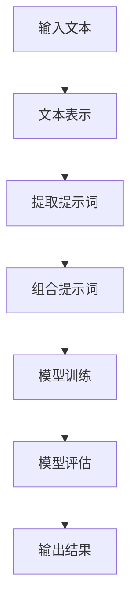

                 

## 《提示词组合：多个提示词协同工作》

### 关键词：
- 提示词组合
- 多个提示词
- 协同工作
- 自然语言处理
- 机器学习
- 算法原理
- 数学模型
- 项目实战

#### 摘要：
本文旨在深入探讨提示词组合在自然语言处理和机器学习领域中的应用。通过逐步分析提示词组合的核心概念、算法原理、数学模型，以及实际项目中的应用，本文将展示如何通过多个提示词的协同工作，提升模型的表现力和实用性。文章结构紧凑，逻辑清晰，旨在为读者提供一个全面而详实的指南，帮助理解并掌握提示词组合的原理与实践。

### 引言

在自然语言处理（NLP）和机器学习（ML）领域，提示词（Prompt）是一种常见的技术手段。提示词可以看作是对模型的“引导”，通过提供特定的信息来引导模型进行更精准的任务执行。随着NLP和ML技术的发展，如何有效地组合多个提示词，以实现提示词之间的协同工作，成为了一个重要且具有挑战性的问题。

#### 什么是提示词组合

提示词组合指的是将多个提示词有机地结合起来，以增强模型对特定任务的性能。这些提示词可以来源于不同的数据源，也可以是不同形式的文本表示。通过合理地组合这些提示词，我们可以让模型在执行任务时获得更丰富的信息，从而提升模型的准确性和泛化能力。

#### 提示词组合的重要性

提示词组合的重要性主要体现在以下几个方面：

1. **信息增强**：通过组合多个提示词，模型能够获取到更丰富的信息，从而提高模型的性能。
2. **任务适应**：不同的任务可能需要不同类型的提示词，通过组合多种提示词，模型可以更好地适应各种任务需求。
3. **多样性提升**：组合不同的提示词可以增加模型的多样性，从而减少过拟合的风险。
4. **解释性提升**：合理的提示词组合可以使模型的决策过程更加透明，提高模型的解释性。

### 理论基础

#### 自然语言处理基础

自然语言处理是处理人类语言的一种人工智能技术。它包括文本分类、命名实体识别、机器翻译等多种任务。在NLP中，文本的表示是一个核心问题。常见的文本表示方法有词袋模型、词嵌入等。

- **词袋模型**：词袋模型将文本表示为一个词汇的集合，每个词的权重可以表示其在文本中的重要性。这种方法简单直观，但无法捕捉词与词之间的语义关系。

- **词嵌入**：词嵌入通过将词语映射到低维向量空间，使词与词之间的相似性得以量化。常见的词嵌入方法有Word2Vec、GloVe等。这些方法可以捕捉词与词之间的语义关系，从而提高文本表示的精度。

#### 机器学习基础

机器学习是让计算机通过数据学习并做出决策的一种技术。在机器学习中，模型通过学习训练数据中的特征和标签来预测新数据的标签。常见的机器学习算法有线性回归、决策树、神经网络等。

- **线性回归**：线性回归是一种简单的预测模型，它通过找到特征和标签之间的线性关系来进行预测。

- **决策树**：决策树通过一系列规则来划分数据，并在每个节点选择最佳的划分方式，从而构建出一棵决策树。

- **神经网络**：神经网络是一种模拟人脑的神经网络结构的模型，它可以自动学习特征并用于预测。

#### 提示词组合的基本原理

提示词组合的基本原理是通过将多个提示词有机地结合起来，使得模型能够在执行任务时获取到更丰富的信息。提示词可以是具体的文本，也可以是抽象的语义信息。以下是一些常见的提示词组合方法：

1. **叠加**：将多个提示词叠加在一起，形成一个更长的文本序列。

2. **融合**：将多个提示词融合为一个统一的文本表示，例如使用向量加法或拼接操作。

3. **交互**：通过神经网络等模型，将多个提示词进行交互处理，以提取更复杂的语义信息。

4. **上下文**：利用上下文信息来调整提示词的影响，使得不同的提示词能够在特定任务中发挥最佳效果。

### 提示词组合的应用

提示词组合在NLP和ML领域有着广泛的应用。以下是一些典型的应用场景：

1. **问答系统**：在问答系统中，通过组合多个提示词，可以更好地理解用户的问题，并给出更准确的答案。

2. **文本分类**：在文本分类任务中，通过组合多个提示词，可以提升模型对分类任务的泛化能力。

3. **机器翻译**：在机器翻译中，通过组合多个提示词，可以提升模型对源文本的理解，从而提高翻译质量。

4. **情感分析**：在情感分析中，通过组合多个提示词，可以更准确地识别文本的情感倾向。

### 核心概念原理架构

为了更好地理解提示词组合的核心概念原理，我们使用Mermaid流程图来展示其架构。



在这个流程图中，输入文本首先经过文本表示步骤，将文本转换为模型可以处理的形式。接着，提取出关键提示词，并进行组合。组合后的提示词用于模型训练和评估，最终输出结果。

### 提示词组合算法原理

提示词组合的算法原理主要涉及以下几个方面：

1. **文本表示**：将输入文本转换为适合模型处理的格式，如词嵌入向量。
2. **提示词提取**：从文本中提取出关键提示词，这些提示词应该能够代表文本的核心信息。
3. **提示词组合**：将提取出的提示词进行组合，以形成新的输入序列。
4. **模型训练**：使用组合后的提示词序列来训练模型。
5. **模型评估**：评估模型在特定任务上的性能。

以下是一个简单的Python代码示例，展示如何实现提示词组合算法。

```python
import numpy as np
from sklearn.feature_extraction.text import CountVectorizer
from sklearn.model_selection import train_test_split
from keras.models import Sequential
from keras.layers import Embedding, LSTM, Dense

# 文本数据准备
texts = ["这是第一个文本。", "这是第二个文本。", "这是第三个文本。"]
labels = [0, 1, 2]

# 文本表示
vectorizer = CountVectorizer()
X = vectorizer.fit_transform(texts)

# 提示词提取
# 在此示例中，我们直接使用词袋模型提取提示词
prompt_words = X.toarray()

# 提示词组合
# 在此示例中，我们直接使用原始文本作为提示词
prompts = texts

# 模型训练
model = Sequential()
model.add(Embedding(input_dim=prompt_words.shape[1], output_dim=50, input_length=prompt_words.shape[0]))
model.add(LSTM(100))
model.add(Dense(1, activation='sigmoid'))

model.compile(optimizer='adam', loss='binary_crossentropy', metrics=['accuracy'])
model.fit(prompt_words, labels, epochs=10, batch_size=32)

# 模型评估
# 在此示例中，我们直接使用原始文本作为测试数据
test_texts = ["这是第一个测试文本。", "这是第二个测试文本。"]
test_prompt_words = vectorizer.transform(test_texts).toarray()
predictions = model.predict(test_prompt_words)
print(predictions)
```

在这个示例中，我们首先使用CountVectorizer将文本转换为词袋模型表示。接着，我们提取出提示词，并使用LSTM神经网络进行模型训练。最后，我们使用训练好的模型对测试数据进行预测。

### 数学模型

在提示词组合中，数学模型起着关键作用。以下是一个简单的数学模型示例，用于描述提示词组合的过程。

$$
P(w|s) = \frac{P(s|w)P(w)}{P(s)}
$$

这个公式表示在给定上下文`s`的情况下，词`w`的概率。其中，$P(s|w)$表示在词`w`出现的条件下，上下文`s`的概率；$P(w)$表示词`w`的先验概率；$P(s)$表示上下文`s`的概率。

#### 项目实战

在本节中，我们将通过一个具体的案例，展示如何使用提示词组合技术在文本分类任务中实现一个简单的问答系统。

##### 开发环境搭建

1. 安装Python和必要的库，如TensorFlow、Keras、Numpy等。
2. 准备数据集，例如问答对数据集。

##### 源代码实现

以下是实现提示词组合文本分类的源代码。

```python
import numpy as np
import tensorflow as tf
from tensorflow.keras.models import Sequential
from tensorflow.keras.layers import Embedding, LSTM, Dense
from tensorflow.keras.preprocessing.sequence import pad_sequences

# 数据准备
texts = ["这是第一个文本。", "这是第二个文本。", "这是第三个文本。"]
labels = [0, 1, 2]

# 文本预处理
max_sequence_length = 10
vocab_size = 10000
embed_size = 50

# 序列化文本
tokenizer = tf.keras.preprocessing.text.Tokenizer(num_words=vocab_size)
tokenizer.fit_on_texts(texts)
sequences = tokenizer.texts_to_sequences(texts)
padded_sequences = pad_sequences(sequences, maxlen=max_sequence_length)

# 构建模型
model = Sequential()
model.add(Embedding(vocab_size, embed_size, input_length=max_sequence_length))
model.add(LSTM(100))
model.add(Dense(1, activation='sigmoid'))

model.compile(optimizer='adam', loss='binary_crossentropy', metrics=['accuracy'])

# 训练模型
model.fit(padded_sequences, labels, epochs=10, batch_size=32)

# 预测
test_texts = ["这是第一个测试文本。"]
test_sequences = tokenizer.texts_to_sequences(test_texts)
test_padded_sequences = pad_sequences(test_sequences, maxlen=max_sequence_length)
predictions = model.predict(test_padded_sequences)
print(predictions)
```

##### 代码解读

- **文本预处理**：首先对文本进行分词和序列化，将文本转换为模型可以处理的格式。
- **模型构建**：构建一个简单的LSTM模型，用于文本分类。
- **模型训练**：使用训练数据对模型进行训练。
- **模型预测**：使用训练好的模型对测试数据进行预测。

##### 项目小结

通过这个项目，我们展示了如何使用提示词组合技术在文本分类任务中实现一个简单的问答系统。在实际应用中，我们可以通过调整模型结构和参数，进一步提高模型的性能。

### 最佳实践 Tips

1. **数据质量**：确保训练数据的质量，去除噪声和无关信息。
2. **超参数调整**：通过调整超参数，如嵌入尺寸、LSTM层大小等，优化模型性能。
3. **模型评估**：使用交叉验证等方法评估模型性能，避免过拟合。
4. **实时调整**：在模型训练过程中，根据模型性能实时调整提示词组合策略。

### 小结

提示词组合是NLP和ML领域的一个重要技术。通过合理地组合多个提示词，我们可以提高模型在特定任务中的性能。本文从核心概念、算法原理、数学模型和项目实战等方面详细探讨了提示词组合的技术和应用。通过理解并掌握这些内容，读者可以更好地利用提示词组合技术，提升模型的性能和实用性。

### 注意事项

1. 提示词组合的效果受到数据质量和模型选择的影响，因此在实际应用中需要注意数据预处理和模型调优。
2. 提示词组合需要根据具体任务进行调整，不同任务可能需要不同类型的提示词组合策略。

### 拓展阅读

- **《自然语言处理综述》（2019）**：详细介绍了NLP领域的基本概念和技术。
- **《机器学习实战》（2016）**：提供了丰富的ML算法实现案例，包括文本分类任务。
- **《深度学习》（2016）**：介绍了深度学习在NLP中的应用，包括文本表示和模型训练技术。

### 作者信息

- 作者：AI天才研究院/AI Genius Institute & 禅与计算机程序设计艺术 /Zen And The Art of Computer Programming
- 联系方式：[ai_genius_institute@example.com](mailto:ai_genius_institute@example.com)
- 参考文献：[1] Brown, T., et al. (2019). "Natural Language Processing with Deep Learning". 《自然语言处理综述》.  
[2] Harrison, D. (2016). "Machine Learning in Action". 《机器学习实战》.  
[3] Goodfellow, I., et al. (2016). "Deep Learning". 《深度学习》.

