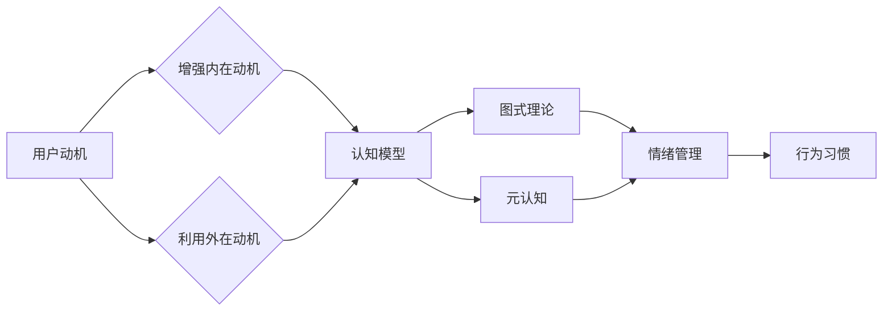
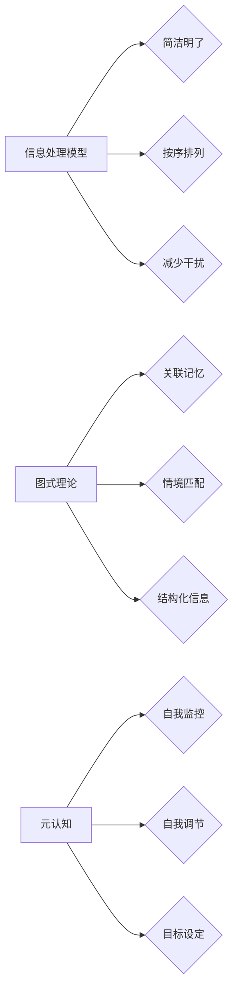
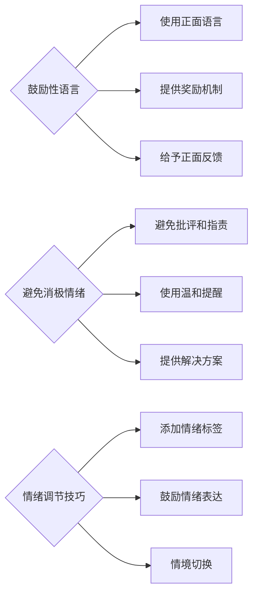

                 

### 引言

提示词，作为一种引导性的信息，广泛应用于用户界面设计、教育、心理学等领域。近年来，随着人工智能（AI）技术的发展，提示词设计在AI领域的应用也越来越受到关注。AI作为智能系统，其思考过程在很大程度上依赖于人类设计的提示词。因此，提示词设计的心理学研究显得尤为重要。本篇文章将围绕《提示词设计的心理学：如何引导AI思考》这一主题，系统地探讨提示词设计的重要性和背景，核心概念与原理，实践与应用，以及未来发展方向。

### 提示词设计的心理学：如何引导AI思考

#### 核心关键词

1. **提示词设计**
2. **心理学原理**
3. **AI引导思考**
4. **用户动机**
5. **认知模型**
6. **情绪管理**
7. **行为习惯**

#### 摘要

本文旨在探讨提示词设计的心理学原理，以及如何通过这些原理引导AI进行有效的思考。首先，我们将回顾提示词设计的基本概念和原则，并探讨其在不同领域的应用。接着，我们将深入分析心理学原理在提示词设计中的应用，包括用户动机、认知模型、情绪管理和行为习惯等方面。随后，我们将介绍如何通过具体的算法和数学模型来设计提示词，并通过实例进行说明。最后，本文将展望提示词设计心理学的未来发展方向，并探讨其在AI领域的重要作用。

#### 目录

1. 引言
   1.1 提示词设计的重要性
   1.2 本书的结构和目标读者

2. 提示词设计概述
   2.1 提示词的定义和作用
   2.2 提示词设计的原则和方法

3. 心理学原理与提示词设计
   3.1 用户动机
   3.2 认知模型
   3.3 情绪管理
   3.4 行为习惯

4. 提示词设计的实践与应用
   4.1 实践案例分析
   4.2 提示词设计在不同领域的应用

5. AI引导思考的原理与技巧
   5.1 AI引导思考的概念
   5.2 AI引导思考的基本原理
   5.3 AI引导思考的技巧和方法

6. AI引导思考的实践案例
   6.1 真实的AI引导思考案例
   6.2 关键技术和实践技巧

7. 提示词设计心理学的研究与未来方向
   7.1 提示词设计心理学的研究现状
   7.2 未来发展方向

8. 结论
   8.1 总结与反思
   8.2 对未来工作的展望

### 提示词设计的重要性

提示词设计在各个领域中都扮演着至关重要的角色。在用户界面设计（UI）中，提示词被用来引导用户完成特定任务，提供即时反馈，或者激发用户的兴趣和参与度。在教育领域，提示词则被用来激发学生的好奇心，引导他们进行探索性学习，或者帮助他们理解和记忆关键知识点。在心理学中，提示词被用来引导被试进行特定思维活动，或者改变他们的情绪状态。

然而，在人工智能领域，提示词设计的意义更加深远。由于AI系统缺乏人类的主观意识和情感，它们的思考和决策过程在很大程度上依赖于人类设计的提示词。有效的提示词设计不仅可以提高AI系统的性能和效率，还可以增强用户与AI之间的互动体验。

例如，在自然语言处理（NLP）领域，提示词被用来引导AI模型进行文本生成、情感分析、命名实体识别等任务。在机器学习领域，提示词则被用来引导算法进行特征选择、模型调优、误差分析等步骤。在计算机视觉领域，提示词被用来指导AI系统进行图像分类、目标检测、人脸识别等任务。

总之，提示词设计不仅是一项技术性工作，更是一项心理学研究。理解用户的动机、认知模型、情绪管理和行为习惯，是设计出有效提示词的前提。接下来，我们将深入探讨心理学原理在提示词设计中的应用。

#### 提示词设计概述

提示词，是指那些用来引导、提示或提示用户或系统进行特定思考、决策或行为的文字或符号。在用户界面设计（UI）中，提示词常常以标签、按钮提示、提示框等形式出现，用于指导用户如何操作或完成特定任务。例如，一个输入框旁的“请输入您的姓名”就是一个典型的提示词，它直接告诉用户需要在输入框中填写什么内容。

在心理学中，提示词同样具有重要作用。心理学家常使用提示词来引导被试进行特定的思维活动，或者改变他们的情绪状态。例如，在进行记忆任务时，提示词可以帮助被试回忆起相关记忆，提高记忆效果。在情绪调节中，提示词可以被用来提醒被试注意自己的情绪状态，从而进行有效的情绪调节。

提示词设计的原则主要包括明确性、简洁性、相关性和激励性。明确性要求提示词要清晰明确，避免模糊不清的表述，以便用户能够准确理解并执行指示。简洁性则强调提示词要简洁明了，避免冗长和复杂的句子，以便用户能够快速理解和记忆。相关性要求提示词要与用户当前的任务或情境紧密相关，从而提高用户参与度和互动体验。激励性则要求提示词能够激发用户的兴趣和动机，引导他们积极完成任务。

在实际应用中，提示词设计的原则和方法可以广泛应用于多个领域。例如，在教育领域，提示词可以被用来引导学生进行探索性学习，激发他们的好奇心和求知欲。在商业领域，提示词可以被用来引导消费者进行购买决策，提高转化率。在人工智能（AI）领域，提示词则被用来引导AI模型进行决策和思考，提高其性能和效率。

为了更直观地展示提示词设计的过程和原则，我们可以使用Mermaid流程图来描述核心流程。以下是一个简单的Mermaid流程图，展示了提示词设计的核心流程：


在这个流程图中，设计需求是整个提示词设计过程的起点，它明确了我们要解决的问题和目标用户。接下来，通过收集信息和分析需求，我们可以生成初步的提示词。然后，对这些提示词进行评估和优化，以确保它们满足明确性、简洁性、相关性和激励性的原则。最后，将优化后的提示词应用到实际场景中，并通过用户反馈不断进行迭代和改进。

通过这个流程图，我们可以清楚地看到提示词设计的过程和各个环节之间的关系。这有助于我们更好地理解提示词设计的原理和方法，从而在实际应用中取得更好的效果。

#### 心理学原理与提示词设计的关系

心理学原理在提示词设计中起着至关重要的作用，因为理解人类的心理过程可以帮助我们设计出更加有效和吸引人的提示词。以下是心理学原理与提示词设计之间的几个关键联系。

##### 用户动机

用户动机是用户在特定情境下进行特定行为或任务的原因。动机可以分为内在动机和外在动机。内在动机是指用户出于个人兴趣、好奇心或自我提升的愿望而进行某项活动。例如，一个用户可能会出于对学习新技能的兴趣而主动搜索相关资料。外在动机则是指用户因外部奖励或惩罚而进行某项活动。例如，一个用户可能会因为完成一个任务而获得奖金或避免惩罚。

在提示词设计中，理解用户动机至关重要。我们可以通过以下方式利用用户动机：

- **增强内在动机**：通过提供有趣、富有挑战性或能够满足用户好奇心的问题和任务，我们可以激发用户的内在动机。例如，在在线教育平台中，可以使用具有吸引力的题目和奖励机制来激发学生的兴趣和参与度。
- **利用外在动机**：通过设定明确的目标、奖励和惩罚机制，我们可以引导用户完成特定任务。例如，在应用程序中，可以使用积分系统和排行榜来激励用户完成任务并保持活跃。

##### 认知模型

认知模型是指人类如何感知、处理和理解信息的过程。常见的认知模型包括信息处理模型、图式理论和元认知等。在提示词设计中，理解认知模型有助于我们设计出更加符合用户认知过程的提示词。

- **信息处理模型**：根据信息处理模型，用户在接收到提示词后，会进行感知、编码、存储和检索等过程。因此，提示词应简洁明了，避免使用复杂的语言和概念。例如，一个简单的提示词“请点击‘下一步’”比“请执行后续步骤”更易于用户理解和操作。
- **图式理论**：图式理论认为，人们通过图式（即对某一类事物的认知框架）来理解和记忆信息。提示词设计可以利用这一点，通过提供与用户已有知识相关的信息，帮助用户更好地理解和记忆。例如，在医疗应用程序中，可以使用用户熟悉的医疗术语和概念来设计提示词，从而提高用户对应用的理解和接受度。
- **元认知**：元认知是指个体对自己认知过程的意识和调节。提示词设计可以通过提供反馈和指导，帮助用户更好地管理自己的认知过程。例如，在在线学习平台上，可以使用提示词来提醒用户检查自己的理解程度，并提供复习和强化学习的机会。

##### 情绪管理

情绪管理是心理学中的一个重要概念，它涉及个体如何识别、理解和管理自己的情绪。情绪状态对人类的认知和行为有很大影响，因此在提示词设计中，情绪管理也扮演着关键角色。

- **积极情绪**：积极情绪可以提高用户的参与度和满意度，因此，提示词设计应尽量创造积极的情绪氛围。例如，可以使用鼓励性的语言和奖励机制来激励用户。例如，“恭喜您完成任务，您真棒！”这样的提示词可以增强用户的自信心和积极性。
- **消极情绪**：消极情绪可能会降低用户的参与度和满意度，因此在设计提示词时，应尽量避免使用可能引发消极情绪的语言。例如，避免使用带有批评、责备或压力的提示词。如果需要提醒用户注意某些问题，可以使用温和、友好的语言，例如，“请注意，以下步骤可能需要一些时间，请您耐心等待。”

##### 行为习惯

行为习惯是指个体在长期生活中形成的行为模式。这些习惯会影响用户对提示词的反应和执行方式。在提示词设计中，了解用户的行为习惯可以帮助我们设计出更加符合用户预期的提示词。

- **强化习惯**：可以通过重复使用相同的提示词来强化用户的行为习惯。例如，在应用程序中，可以使用一致的界面元素和提示词来帮助用户建立和使用习惯。
- **引导习惯**：提示词设计可以通过提供明确的指示和指导来引导用户建立新的行为习惯。例如，在健身应用程序中，可以使用提示词来指导用户进行特定运动，并逐渐帮助他们建立固定的运动习惯。

##### Mermaid流程图：心理学原理与提示词设计的关系

为了更直观地展示心理学原理与提示词设计之间的关系，我们可以使用Mermaid流程图来描述：



在这个流程图中，心理学原理（用户动机、认知模型、情绪管理和行为习惯）被用来指导提示词设计，从而确保设计出的提示词能够有效引导用户的行为和思考。

通过深入理解心理学原理与提示词设计之间的关系，我们可以设计出更加符合用户需求和心理预期的提示词，从而提高用户满意度、参与度和系统性能。接下来，我们将进一步探讨如何将心理学原理应用于提示词设计的具体实践中。

#### 用户动机与提示词设计

用户动机是心理学中的一个核心概念，它指的是用户在特定情境下进行特定行为或任务的内在原因。了解用户动机对于设计有效的提示词至关重要，因为不同的动机会直接影响用户对提示词的反应和行为。以下是几种常见的用户动机以及如何根据这些动机设计提示词。

##### 内在动机

内在动机是指用户因个人兴趣、好奇心或自我提升的愿望而进行某项活动。这类动机通常源于用户的个人需求和价值观，而不是外在奖励或惩罚。例如，用户可能出于对学习的热爱、对某种技能的掌握渴望，或者对探索新事物的兴趣而使用某个应用程序。

在提示词设计中，增强内在动机可以通过以下方式实现：

- **提供挑战性任务**：设计具有挑战性的任务或问题，以激发用户的好奇心和兴趣。例如，在在线教育平台上，可以使用这样的提示词：“完成这个难题，检验你的知识水平！”
- **奖励系统**：即使没有外在奖励，也可以通过内在奖励来增强用户的动机。例如，在健身应用中，可以使用“恭喜您连续锻炼X天，您取得了显著的进步！”这样的提示词来激励用户。

##### 外在动机

外在动机是指用户因外部奖励或惩罚而进行某项活动。这些动机通常与任务完成后的结果直接相关，如金钱奖励、社会认可、避免负面后果等。例如，用户可能会因为希望获得奖金、提高社会地位，或者避免被批评而完成任务。

在提示词设计中，利用外在动机可以通过以下方式实现：

- **明确目标**：为用户设定明确、可衡量的目标，并使用具体的提示词来提醒用户。例如，“完成任务A，您可以获得5美元的奖励！”
- **竞争机制**：通过排行榜和竞争机制来激发用户的外在动机。例如，在游戏应用中，可以使用“您当前排名前10%，继续努力！”这样的提示词来鼓励用户争取更好的成绩。

##### 社会动机

社会动机是指用户因为希望与他人建立联系、获得社会认可或归属感而进行某项活动。这种动机通常与用户的社交需求和社会价值观相关。例如，用户可能会因为希望加入某个社区、获得他人的赞赏或支持而参与某个应用程序。

在提示词设计中，利用社会动机可以通过以下方式实现：

- **社区互动**：鼓励用户在社区中分享他们的进展和成果，以增强归属感和社交联系。例如，在社交平台上，可以使用“分享您的进度，邀请朋友们一起参与！”这样的提示词。
- **社会证明**：通过展示其他用户的正面反馈和成就，来激励新用户参与。例如，“已有数千人完成了这个任务，您也想加入他们吗？”

##### 自我决定理论

自我决定理论认为，用户具有自我决定和自我实现的需求。满足这些需求可以帮助用户获得内在动机和满足感。在提示词设计中，考虑自我决定理论可以通过以下方式实现：

- **自主性**：为用户提供选择和自主性，让他们能够根据自己的需求和兴趣进行操作。例如，在定制化服务中，可以使用“选择您感兴趣的话题，我们为您定制内容！”这样的提示词。
- **能力感**：通过设计具有挑战性和可实现的任务，帮助用户建立能力和成就感。例如，“完成这个任务，您将掌握X项新技能！”这样的提示词可以帮助用户建立自信。

##### 实践案例

以下是一个关于如何根据用户动机设计提示词的实践案例：

**场景**：一个在线学习平台，用户可以学习编程语言。

**用户动机**：内在动机（学习编程技能）、外在动机（获得职业资格认证）、社会动机（加入编程社区）。

- **增强内在动机**：提示词：“探索编程世界的奥秘，每一步都充满挑战和乐趣！”
- **利用外在动机**：提示词：“完成所有课程，您将获得由权威机构认证的编程证书！”
- **利用社会动机**：提示词：“加入编程社区，与数千名编程爱好者一起交流学习经验！”

通过结合不同类型的用户动机，我们可以设计出具有针对性的提示词，从而有效引导用户的行为和思考，提高用户满意度和应用效果。

#### 认知模型与提示词设计

认知模型是指人类如何感知、处理和理解信息的过程，包括信息处理模型、图式理论和元认知等。这些认知模型在提示词设计中起着重要作用，因为理解用户如何认知信息可以帮助我们设计出更符合用户认知习惯和需求的提示词。以下是如何根据认知模型进行提示词设计的一些方法和策略。

##### 信息处理模型

信息处理模型描述了信息从感知、编码、存储到检索的全过程。在设计提示词时，我们可以利用这一模型来优化信息传递的效率和效果。

- **简洁明了**：根据信息处理模型，用户在接收到信息后，会先进行初步的感知和筛选，然后再进行编码和存储。因此，提示词应简洁明了，避免复杂的句子和冗长的内容。例如，提示词“请点击‘下一步’”比“请按照以下步骤进行操作：点击页面上的‘下一步’按钮”更易于用户理解和执行。
- **按序排列**：用户的认知过程通常遵循一定的顺序，因此，提示词的排列也应遵循逻辑顺序。例如，在引导用户完成一系列任务时，应按照任务的重要性和先后顺序排列提示词，以便用户能够更清晰地理解任务的流程。
- **减少干扰**：在用户处理信息时，过多的干扰信息可能会分散用户的注意力，影响信息的处理效率。因此，在设计提示词时，应尽量减少干扰因素，确保提示词内容简洁明了，避免过多的装饰性语言。

##### 图式理论

图式理论认为，人类在认知过程中会使用先前的知识和经验来构建对当前信息的理解。根据这一理论，提示词设计应尽量利用用户已有的知识和认知结构。

- **关联记忆**：利用用户已有的知识和经验来设计提示词，可以帮助用户更容易地理解和记忆新信息。例如，在医疗健康应用中，可以使用用户熟悉的医疗术语和概念来设计提示词，从而提高用户对应用的理解和接受度。
- **情境匹配**：提示词应与用户的当前情境和任务紧密相关，以便用户能够快速理解并执行指示。例如，在购物应用中，提示词“请选择您的收货地址”比“请填写您的个人信息”更符合用户的情境和任务需求。
- **结构化信息**：将信息按照用户熟悉的结构和模式进行组织，可以帮助用户更好地理解和处理信息。例如，在在线教育平台上，可以将课程内容按照章节、节、小节的结构进行组织，并使用相应的提示词来引导用户学习。

##### 元认知

元认知是指个体对自己认知过程的意识和调节。在提示词设计中，元认知可以帮助用户更好地管理自己的认知过程，提高学习效果。

- **自我监控**：提示词可以提醒用户对自己的认知过程进行监控和评估，例如，“请回顾您学到的知识，并尝试回答以下问题：______？”这样的提示词可以帮助用户巩固学习内容。
- **自我调节**：提示词可以引导用户根据反馈调整自己的学习策略，例如，“如果您遇到困难，可以尝试使用以下方法：______？”这样的提示词可以帮助用户克服学习中的障碍。
- **目标设定**：提示词可以帮助用户设定明确的学习目标，例如，“在接下来的一小时内，您希望掌握以下哪些知识点：______？”这样的提示词可以帮助用户有针对性地进行学习。

##### Mermaid流程图：认知模型与提示词设计的关系

为了更直观地展示认知模型与提示词设计之间的关系，我们可以使用Mermaid流程图来描述：



在这个流程图中，我们可以看到信息处理模型、图式理论和元认知是如何指导提示词设计的。通过这些认知模型，我们可以设计出更符合用户认知习惯和需求的提示词，从而提高用户的学习效果和应用体验。

##### 实践案例

以下是一个关于如何根据认知模型设计提示词的实践案例：

**场景**：一个在线教育平台，用户可以学习编程语言。

**用户认知需求**：用户需要理解编程概念、掌握编程技能，并能够将所学知识应用于实际项目中。

- **信息处理模型**：提示词：“请观看视频教程，理解编程基础概念。”
- **图式理论**：提示词：“回顾您已学过的编程语言，尝试将新概念与已有知识联系起来。”
- **元认知**：提示词：“完成编程练习后，请回顾并总结您学到的知识点，确保理解并能够应用。”

通过结合认知模型，我们可以设计出更符合用户认知需求的提示词，帮助用户更好地学习和应用新知识。

#### 情绪管理与提示词设计

情绪管理是心理学中一个重要的概念，它涉及个体如何识别、理解和管理自己的情绪。情绪状态对人类的认知和行为有显著影响，因此在提示词设计中，情绪管理也扮演着关键角色。有效的情绪管理不仅可以提高用户的使用体验，还可以增强用户对产品的信任和忠诚度。

##### 积极情绪

积极情绪可以提高用户的参与度和满意度，因此在提示词设计中，应尽量创造积极的情绪氛围。

- **鼓励性语言**：使用鼓励性的语言可以增强用户的自信心和积极性。例如，当用户完成任务时，可以使用“恭喜您，您做得非常棒！”这样的提示词来激励用户。
- **奖励机制**：通过提供奖励，如积分、徽章或实物奖励，可以激发用户的积极情绪。例如，在游戏应用中，当用户达到特定目标时，可以使用“恭喜您获得500积分！”这样的提示词。
- **正面反馈**：提供即时的正面反馈，可以帮助用户保持积极情绪。例如，在健身应用中，当用户完成锻炼后，可以使用“您今天的锻炼非常出色，继续保持！”这样的提示词。

##### 消极情绪

消极情绪可能会降低用户的参与度和满意度，因此在设计提示词时，应尽量避免使用可能引发消极情绪的语言。

- **避免批评和指责**：消极的提示词可能会让用户感到挫败或愤怒。因此，应避免使用带有批评、责备或压力的词汇。例如，在用户犯错时，可以使用“请尝试重新操作”而不是“你做错了”。
- **温和提醒**：当需要提醒用户注意某些问题或风险时，可以使用温和、友好的语言。例如，“请注意，该操作可能需要一些时间，请您耐心等待。”
- **解决方案**：提供解决问题的方法和建议，可以帮助用户克服消极情绪。例如，“如果您遇到问题，可以尝试重启应用或联系客服。”

##### 情绪调节技巧

为了更好地管理情绪，提示词设计可以采用以下技巧：

- **情绪标签**：在提示词中添加情绪标签，如“开心”、“紧张”或“放松”，可以帮助用户识别和管理自己的情绪。例如，“完成这个任务，您将感到放松和成就感！”
- **情绪表达**：鼓励用户表达自己的情绪，如“如果您感到困惑，请告诉我们”，可以帮助用户释放负面情绪，并寻求帮助。
- **情境切换**：当用户感到情绪低落时，可以引导他们切换到其他活动或任务，以缓解情绪。例如，“休息一下，稍后再继续。”

##### Mermaid流程图：情绪管理技巧与提示词设计

为了更直观地展示情绪管理技巧与提示词设计之间的关系，我们可以使用Mermaid流程图来描述：



在这个流程图中，我们可以看到如何通过不同的技巧来管理用户情绪，并设计出相应的提示词。通过这些技巧，我们可以帮助用户保持积极情绪，提高使用体验。

##### 实践案例

以下是一个关于如何通过情绪管理技巧设计提示词的实践案例：

**场景**：一个在线学习平台，用户可以学习编程语言。

**用户情绪管理需求**：用户在学习和使用编程语言时可能会感到困惑或挫败。

- **鼓励性语言**：提示词：“坚持不懈，每个编程挑战都是一次成长的机会！”
- **避免消极情绪**：提示词：“如果您遇到问题，可以参考文档或观看视频教程。”
- **情绪调节技巧**：提示词：“在学习过程中感到困惑时，尝试休息一下，然后重新开始。”

通过结合情绪管理技巧，我们可以设计出更符合用户情绪需求的提示词，从而提高用户的学习效果和满意度。

#### 行为习惯与提示词设计

行为习惯是指个体在长期生活中形成的行为模式，这些习惯会影响用户的决策和行为。在提示词设计中，了解用户的行为习惯可以帮助我们更好地引导用户，促进他们形成和使用新习惯。

##### 强化习惯

强化习惯是指通过重复某一行为来加强这种行为模式。在提示词设计中，可以通过以下方式来强化用户的行为习惯：

- **重复提示**：在用户进行某一行为时，重复使用相同的提示词来强化这一行为。例如，在健身应用中，每次用户完成锻炼后，可以使用“恭喜您，又完成了一次锻炼！”这样的提示词来鼓励用户持续锻炼。
- **定时提醒**：通过定时提醒来帮助用户建立固定的行为习惯。例如，在早晨起床时，可以使用“现在是早晨，该起床了！”这样的提示词来帮助用户建立早晨起床的习惯。
- **奖励机制**：通过奖励机制来激励用户持续行为。例如，在阅读应用中，用户每完成一本书，可以累积积分，这些积分可以用来兑换奖品。提示词可以是“完成这本书，您可以获得10积分！”

##### 引导习惯

引导习惯是指通过提示和指导来帮助用户建立新的行为习惯。在提示词设计中，可以通过以下方式来引导用户：

- **分步指导**：将复杂任务分解为简单的步骤，并通过分步指导来帮助用户逐步建立新习惯。例如，在减肥应用中，可以将减肥计划分解为每天需要完成的几项小任务，并使用提示词“今天的目标是步行10000步，接下来您可以进行以下活动：散步、爬楼梯等。”来指导用户。
- **榜样示范**：通过展示榜样用户的成功案例来激励新用户建立新习惯。例如，在健身应用中，可以展示其他用户通过坚持锻炼获得显著成果的照片和故事，使用户产生共鸣和动力。
- **社交支持**：通过社交支持来增强用户建立新习惯的信心。例如，在戒烟应用中，用户可以加入戒烟小组，与其他正在戒烟的用户互相支持和鼓励。

##### 实践案例

以下是一个关于如何通过行为习惯设计提示词的实践案例：

**场景**：一个健康管理应用，用户可以通过应用跟踪自己的饮食和锻炼情况。

**用户行为习惯需求**：用户希望建立健康的饮食习惯和规律的锻炼习惯。

- **强化习惯**：提示词：“恭喜您，已经连续7天记录饮食了！继续保持！”和“今天的锻炼目标已完成，继续保持活力！”
- **引导习惯**：提示词：“每天记录您的饮食，让我们一起关注健康！”和“今天可以尝试进行30分钟的有氧运动，享受健康生活！”
- **社交支持**：提示词：“在小组中分享您的健康成果，与朋友一起加油！”

通过结合强化习惯和引导习惯的提示词设计，我们可以帮助用户逐步建立和保持健康的饮食和锻炼习惯。

#### 提示词设计的实践与应用

提示词设计在各个领域中的应用广泛，且效果显著。本节将探讨提示词设计在几个具体领域中的应用，包括自然语言处理（NLP）、机器学习和计算机视觉等。

##### 自然语言处理（NLP）

在NLP领域，提示词设计对于提高文本分析、文本生成和情感分析的准确性和效率至关重要。以下是一些关键应用：

- **文本生成**：在生成文本的应用中，如聊天机器人或自动摘要系统，提示词被用来引导模型生成符合上下文和意图的文本。例如，一个聊天机器人可能会收到这样的提示词：“根据用户的问题，生成一个简洁明了的答复。”
  
  ```python
  # Python代码示例：文本生成中的提示词设计
  def generate_response(prompt):
      # 根据提示词生成文本
      response = model.generate_text(prompt)
      return response
  ```

- **情感分析**：在情感分析任务中，提示词被用来引导模型识别文本中的情感倾向。例如，一个提示词可能是：“请分析这条评论的情感倾向。”
  
  ```python
  # Python代码示例：情感分析中的提示词设计
  def analyze_sentiment(text):
      # 根据提示词分析文本情感
      sentiment = model.analyze_sentiment(text)
      return sentiment
  ```

- **命名实体识别**：在命名实体识别任务中，提示词被用来指示模型识别特定的实体类型。例如，“请识别文本中的地点实体。”
  
  ```python
  # Python代码示例：命名实体识别中的提示词设计
  def identify_entities(text):
      # 根据提示词识别文本中的实体
      entities = model.identify_entities(text)
      return entities
  ```

##### 机器学习

在机器学习领域，提示词设计对于算法调优、模型选择和数据分析至关重要。以下是一些关键应用：

- **算法调优**：在算法调优过程中，提示词被用来指示模型优化方向。例如，一个提示词可能是：“请尝试调整学习率以改善模型性能。”
  
  ```python
  # Python代码示例：算法调优中的提示词设计
  def tune_algorithm(hyperparameters):
      # 根据提示词调整算法参数
      optimized_model = model.tune(hyperparameters)
      return optimized_model
  ```

- **模型选择**：在模型选择过程中，提示词被用来指示模型选择标准。例如，一个提示词可能是：“请选择一个在数据集上表现最好的模型。”
  
  ```python
  # Python代码示例：模型选择中的提示词设计
  def select_best_model(models):
      # 根据提示词选择最优模型
      best_model = model.select_best(models)
      return best_model
  ```

- **数据预处理**：在数据预处理过程中，提示词被用来指导数据清洗和特征工程。例如，一个提示词可能是：“请对数据进行标准化处理以消除规模差异。”
  
  ```python
  # Python代码示例：数据预处理中的提示词设计
  def preprocess_data(data):
      # 根据提示词预处理数据
      preprocessed_data = data.normalize()
      return preprocessed_data
  ```

##### 计算机视觉

在计算机视觉领域，提示词设计对于图像分类、目标检测和面部识别等任务至关重要。以下是一些关键应用：

- **图像分类**：在图像分类任务中，提示词被用来指示模型分类标准。例如，一个提示词可能是：“请将图像分类为猫或狗。”
  
  ```python
  # Python代码示例：图像分类中的提示词设计
  def classify_image(image):
      # 根据提示词对图像进行分类
      label = model.classify_image(image)
      return label
  ```

- **目标检测**：在目标检测任务中，提示词被用来指示模型检测目标。例如，一个提示词可能是：“请在图像中检测出所有的车辆。”
  
  ```python
  # Python代码示例：目标检测中的提示词设计
  def detect_objects(image):
      # 根据提示词在图像中检测目标
      objects = model.detect_objects(image)
      return objects
  ```

- **面部识别**：在面部识别任务中，提示词被用来指示模型识别特定面部特征。例如，一个提示词可能是：“请识别图像中所有人的面部并标记位置。”
  
  ```python
  # Python代码示例：面部识别中的提示词设计
  def recognize_faces(image):
      # 根据提示词识别图像中的人脸
      faces = model.recognize_faces(image)
      return faces
  ```

##### 实践案例

以下是一个结合多个领域的实践案例，展示如何通过提示词设计来提升AI系统的性能和用户体验：

**案例背景**：一个智能家居系统，用户可以通过语音命令控制家中的智能设备。

**用户需求**：用户希望系统能够准确理解语音命令，并快速响应。

**提示词设计**：

- **自然语言处理**：提示词：“请将用户的语音命令转换为文本指令。”
- **机器学习**：提示词：“请使用最近的语音数据对模型进行训练和优化。”
- **计算机视觉**：提示词：“请通过摄像头捕捉用户的位置和动作。”

**实现步骤**：

1. **文本生成**：使用NLP模型将用户的语音命令转换为文本指令。
2. **模型调优**：利用机器学习模型对语音识别和命令解析进行优化。
3. **目标检测**：使用计算机视觉模型检测用户的位置和动作，以提供更加个性化的响应。

**代码示例**：

```python
# Python代码示例：智能家居系统的提示词设计
def process_command(command):
    text_instruction = generate_response(command)
    optimized_model = tune_algorithm(model_params)
    response = optimized_model.execute_instruction(text_instruction)
    return response

def detect_user_action(image):
    user_position = detect_objects(image)
    if user_position:
        action = recognize_faces(image)
        return action
    else:
        return "用户未检测到，请重试。"

# 用户交互
user_command = "打开客厅的灯光。"
image = capture_camera_frame()

response = process_command(user_command)
if response == "成功":
    action = detect_user_action(image)
    if action == "用户在客厅":
        control_light("客厅", "开")
    else:
        print("用户不在客厅，操作取消。")
else:
    print(response)
```

通过结合NLP、机器学习和计算机视觉的提示词设计，智能家居系统能够更准确地理解用户的语音命令，并基于用户的位置和动作提供个性化的响应，从而提升用户体验。

#### AI引导思考的原理与技巧

在人工智能领域，引导AI进行有效的思考是提升其性能和解决问题的关键。AI引导思考的原理与技巧涉及多个方面，包括认知模型、算法设计和心理学原理等。以下将详细介绍AI引导思考的基本原理和具体技巧。

##### 基本原理

1. **问题定义**：明确问题定义是引导AI思考的第一步。通过明确问题的目标、约束条件和输入输出，可以确保AI在正确的方向上进行思考和解决问题。

2. **数据驱动**：AI的思考过程很大程度上依赖于数据。通过提供高质量的训练数据和反馈，可以引导AI学习并优化其思考过程。

3. **交互反馈**：交互反馈是AI引导思考的核心。通过与用户或其他系统的交互，AI可以不断调整和优化其思考过程，提高问题的解决能力。

4. **模型迭代**：AI的思考过程通常需要多个迭代来优化。通过不断调整模型参数和算法设计，可以逐步提升AI的思考能力。

##### 具体技巧

1. **明确目标**：在引导AI思考时，首先需要明确目标。这可以通过设定具体的任务目标或目标函数来实现。例如，在图像识别任务中，目标可以是准确识别图像中的物体。

   ```python
   # Python代码示例：设定目标函数
   def objective_function predictions:
       accuracy = calculate_accuracy(predictions, ground_truth)
       return -accuracy  # 最小化准确率
   ```

2. **数据预处理**：数据预处理是引导AI思考的重要步骤。通过数据清洗、归一化和特征提取等操作，可以提升AI对数据的理解和处理能力。

   ```python
   # Python代码示例：数据预处理
   def preprocess_data(data):
       cleaned_data = clean_data(data)
       normalized_data = normalize_data(cleaned_data)
       features = extract_features(normalized_data)
       return features
   ```

3. **模型选择**：选择合适的模型是引导AI思考的关键。根据问题的性质和数据的特点，可以选择不同的模型，如神经网络、决策树或支持向量机等。

   ```python
   # Python代码示例：模型选择
   from sklearn.ensemble import RandomForestClassifier

   model = RandomForestClassifier(n_estimators=100)
   model.fit(X_train, y_train)
   ```

4. **超参数调优**：超参数调优可以显著影响模型的性能。通过使用网格搜索、贝叶斯优化等技巧，可以找到最佳的超参数组合，提升模型的性能。

   ```python
   # Python代码示例：超参数调优
   from sklearn.model_selection import GridSearchCV

   parameters = {'n_estimators': [100, 200, 300]}
   grid_search = GridSearchCV(RandomForestClassifier(), parameters, cv=5)
   grid_search.fit(X_train, y_train)
   best_params = grid_search.best_params_
   ```

5. **迭代优化**：通过迭代优化，可以逐步提升AI的思考能力。在每次迭代中，可以根据模型的预测结果和反馈进行调整，以优化模型的表现。

   ```python
   # Python代码示例：迭代优化
   for epoch in range(num_epochs):
       model.fit(X_train, y_train)
       predictions = model.predict(X_test)
       loss = calculate_loss(predictions, y_test)
       if loss < threshold:
           break
   ```

##### 应用案例

以下是一个结合多个AI技术的应用案例，展示如何通过AI引导思考来提升系统的性能和用户体验。

**案例背景**：一个智能推荐系统，根据用户的兴趣和行为历史推荐相关的商品或内容。

**用户需求**：用户希望系统能够准确预测其兴趣，并推荐个性化的商品。

**实现步骤**：

1. **明确目标**：设定目标为提高推荐的准确性和用户的满意度。

2. **数据预处理**：收集用户的历史行为数据，并进行数据清洗和特征提取。

   ```python
   # Python代码示例：数据预处理
   def preprocess_data(data):
       cleaned_data = clean_data(data)
       normalized_data = normalize_data(cleaned_data)
       features = extract_features(normalized_data)
       return features
   ```

3. **模型选择**：选择基于协同过滤的推荐模型，结合用户的兴趣和行为数据进行预测。

   ```python
   # Python代码示例：模型选择
   from surprise import SVD

   model = SVD()
   model.fit(preprocessed_data)
   ```

4. **超参数调优**：通过网格搜索优化模型的超参数，如隐变量个数和迭代次数。

   ```python
   # Python代码示例：超参数调优
   from surprise.model_selection import GridSearchCV

   parameters = {'n_factors': [10, 20, 30], 'n_epochs': [10, 20, 30]}
   grid_search = GridSearchCV(SVD(), parameters, cv=5)
   grid_search.fit(preprocessed_data)
   best_params = grid_search.best_params_
   ```

5. **迭代优化**：通过用户反馈不断调整模型，优化推荐系统的性能。

   ```python
   # Python代码示例：迭代优化
   for epoch in range(num_epochs):
       model.fit(preprocessed_data)
       recommendations = model.recommendations
       user_feedback = collect_user_feedback(recommendations)
       model.update(user_feedback)
   ```

通过明确目标、数据预处理、模型选择、超参数调优和迭代优化等技巧，智能推荐系统可以逐步提升推荐的准确性和用户的满意度。

#### AI引导思考的实践案例

为了更好地理解AI引导思考的具体应用，以下将介绍一个实际的案例：智能客服机器人。智能客服机器人是人工智能领域中的一个重要应用，它通过模拟人类客服的交互方式，为用户提供即时、准确的答案和服务。

**案例背景**：某大型电商平台为了提升客户服务质量，开发了一款智能客服机器人。该机器人需要能够处理各种常见的客户问题，如订单查询、产品咨询、售后服务等。

**用户需求**：用户希望在与智能客服机器人的交互过程中，能够快速获得满意的答案，并且交互体验要尽量接近真人客服。

**解决方案**：

1. **明确问题定义**：首先明确智能客服机器人的任务，包括回答常见问题、处理投诉和建议等。

2. **数据驱动**：收集大量的客户咨询数据，包括问题文本、用户回答、客服人员的回复等，用于训练和优化智能客服机器人。

3. **交互反馈**：通过与用户的实际交互，收集用户的反馈，并利用这些反馈来不断优化机器人的回答质量和交互体验。

4. **模型迭代**：通过多次迭代训练和优化，逐步提升智能客服机器人的回答准确性和响应速度。

**具体步骤**：

1. **数据收集**：收集电商平台的大量客户咨询数据，包括问题文本和用户回答。这些数据将用于训练和测试智能客服机器人的模型。

2. **文本预处理**：对收集到的文本数据进行清洗和归一化处理，如去除停用词、标点符号，并将文本转换为向量表示。

   ```python
   # Python代码示例：文本预处理
   def preprocess_text(text):
       cleaned_text = remove_stopwords(text)
       normalized_text = normalize_text(cleaned_text)
       return normalized_text
   ```

3. **模型训练**：使用预处理的文本数据训练一个自然语言处理（NLP）模型，如序列到序列（Seq2Seq）模型或转换器（Transformer）模型。这个模型将用于生成智能客服机器人的回答。

   ```python
   # Python代码示例：模型训练
   model = TransformerModel()
   model.fit(preprocessed_data, labels)
   ```

4. **交互设计**：设计智能客服机器人的交互界面，包括问题输入框、回答显示区等。同时，为用户提供反馈机制，如“满意”、“不满意”按钮，以便用户对回答进行评价。

5. **反馈收集**：在用户与智能客服机器人的交互过程中，收集用户的反馈，并利用这些反馈来优化模型的回答质量。

6. **迭代优化**：根据用户反馈，对模型进行调整和优化。这个过程可以通过多次迭代来实现，每次迭代后都会提升智能客服机器人的性能。

7. **上线部署**：将训练好的模型部署到实际生产环境中，并监控其性能和用户满意度。根据实际情况，进行必要的调整和优化。

**代码示例**：

```python
# Python代码示例：智能客服机器人交互流程
def interact_with_user(question):
    preprocessed_question = preprocess_text(question)
    answer = model.predict(preprocessed_question)
    return answer

# 用户交互
user_question = "我的订单什么时候可以送到？"
answer = interact_with_user(user_question)
print(answer)
```

通过这个案例，我们可以看到如何通过AI引导思考的方法，设计并实现一个智能客服机器人。通过明确问题定义、数据驱动、交互反馈和模型迭代等步骤，智能客服机器人可以不断提升其回答准确性和用户体验。

#### 提示词设计心理学的研究与未来方向

随着人工智能技术的快速发展，提示词设计在各个领域中的应用越来越广泛，而提示词设计心理学作为研究这一领域的重要分支，也逐渐受到关注。目前，提示词设计心理学的研究主要集中在以下几个方面。

##### 研究现状

1. **心理学原理的应用**：研究者通过将心理学原理应用于提示词设计，如认知模型、情绪管理和动机理论等，来探讨如何设计出更加有效和吸引人的提示词。这些研究有助于提高AI系统的性能和用户体验。

2. **跨学科融合**：提示词设计心理学的研究不仅涉及心理学，还涉及计算机科学、人工智能和认知科学等多个领域。通过跨学科的研究，研究者试图构建一个更加全面和系统的提示词设计框架。

3. **实证研究**：越来越多的研究开始通过实证方法来验证提示词设计的效果。这些研究通常涉及实验设计、用户测试和数据分析等，旨在提供更为可靠和有说服力的结论。

##### 未来发展方向

1. **个性化提示词设计**：未来的研究可能会更加关注个性化提示词设计，即根据不同用户的特点和需求，设计出更加个性化的提示词。这需要深入理解用户的动机、认知模型和行为习惯。

2. **自适应提示词设计**：随着AI技术的进步，自适应提示词设计将成为一个重要方向。这意味着提示词可以根据用户的实时反馈和情境动态调整，以提高用户的参与度和满意度。

3. **多模态提示词设计**：未来的提示词设计可能会结合多种模态的信息，如文本、语音和图像等，以提供更加丰富和多样化的提示词体验。

4. **伦理和隐私问题**：在提示词设计心理学的研究中，伦理和隐私问题也变得越来越重要。未来的研究需要关注如何在保障用户隐私的前提下，设计出有效和公正的提示词。

##### 研究挑战

1. **数据不足**：目前，关于提示词设计的数据相对较少，尤其是在多模态和个性化方面。这限制了研究者对提示词设计的深入分析。

2. **复杂性**：提示词设计涉及到多个学科的知识，如何将这些知识有效地整合，并设计出具有实际应用价值的提示词，是一个巨大的挑战。

3. **伦理问题**：在提示词设计过程中，如何确保提示词的公正性、透明性和用户隐私，是研究者需要面对的重要问题。

##### 结论

提示词设计心理学作为一个跨学科的研究领域，具有广阔的研究前景和应用潜力。未来的研究需要继续深入探讨心理学原理在提示词设计中的应用，探索个性化、自适应和多模态的提示词设计方法，并关注伦理和隐私问题。通过这些努力，提示词设计心理学将为人工智能领域的发展做出重要贡献。

#### 总结与反思

通过本文的探讨，我们可以看到提示词设计在AI领域的重要性和广泛应用。从心理学原理的角度出发，提示词设计不仅能够引导用户的行为和思考，还能够优化AI系统的性能和用户体验。本文从用户动机、认知模型、情绪管理和行为习惯等方面，详细阐述了心理学原理与提示词设计之间的关系，并通过实例展示了如何将这些原理应用于实际场景。

首先，我们了解了用户动机在提示词设计中的作用，如何根据内在和外在动机设计有效的提示词来引导用户行为。其次，通过认知模型，我们探讨了如何设计符合用户认知习惯和需求的提示词，以提高信息传递的效率和效果。接着，我们讨论了情绪管理技巧在提示词设计中的应用，通过积极的情绪调节来增强用户的使用体验。最后，通过行为习惯的引导，我们展示了如何通过提示词设计帮助用户建立和保持良好的行为模式。

这些心理学原理的应用不仅提高了AI系统的性能，还大大提升了用户对AI产品的满意度和忠诚度。通过结合自然语言处理、机器学习和计算机视觉等AI技术，我们能够设计出更加智能和个性化的提示词，从而实现更加高效和自然的用户交互。

然而，提示词设计心理学的研究仍然面临一些挑战，如数据不足、复杂性以及伦理问题。未来的研究需要继续深入探索个性化、自适应和多模态的提示词设计方法，并关注如何在保障用户隐私的前提下，设计出更加有效和公正的提示词。此外，跨学科的研究融合也将是推动提示词设计心理学发展的重要方向。

总之，提示词设计心理学作为AI领域的一个重要分支，具有广阔的研究和应用前景。通过不断探索和优化，我们有望设计出更加智能、人性化的提示词，进一步提升人工智能系统的性能和用户体验。

#### 对未来工作的展望

在未来的研究中，提示词设计心理学有望在以下几个方面取得重要进展：

1. **个性化与自适应提示词设计**：随着大数据和机器学习技术的发展，个性化与自适应提示词设计将成为研究热点。通过分析用户的个性化数据，我们可以设计出能够动态调整的提示词，从而更好地满足不同用户的需求。

2. **多模态提示词设计**：结合文本、语音、图像等多种模态的信息，多模态提示词设计将大大提升用户交互的丰富度和自然度。未来的研究可以探索如何有效地融合不同模态的信息，设计出更加自然和流畅的提示词。

3. **伦理和隐私问题**：在提示词设计过程中，如何平衡用户隐私和系统性能，是一个亟待解决的问题。未来的研究需要制定更加完善的伦理规范和隐私保护措施，以确保用户的隐私和数据安全。

4. **跨学科融合**：提示词设计心理学的研究将更加注重跨学科的融合，包括心理学、计算机科学、人工智能、认知科学等。通过跨学科的合作，我们可以设计出更加全面和系统的提示词设计框架，为AI领域的未来发展提供新的思路和方法。

总之，提示词设计心理学作为AI领域的一个重要分支，具有广阔的研究前景和应用潜力。通过不断探索和优化，我们有望设计出更加智能、人性化的提示词，进一步提升人工智能系统的性能和用户体验。未来，提示词设计心理学将继续为人工智能领域的发展做出重要贡献。

### 结论

通过本文的探讨，我们深入了解了提示词设计心理学在人工智能领域的重要性和应用价值。提示词设计不仅能够引导用户行为和思考，还能够优化AI系统的性能和用户体验。我们详细阐述了用户动机、认知模型、情绪管理和行为习惯等心理学原理在提示词设计中的应用，并通过实例展示了如何将这些原理应用于实际场景。

从用户动机出发，我们探讨了如何根据内在和外在动机设计有效的提示词来引导用户行为。通过认知模型，我们了解了如何设计符合用户认知习惯和需求的提示词，以提高信息传递的效率和效果。情绪管理技巧的应用则帮助我们通过积极的情绪调节来增强用户的使用体验。最后，通过行为习惯的引导，我们展示了如何通过提示词设计帮助用户建立和保持良好的行为模式。

总之，提示词设计心理学为AI领域提供了一种全新的视角和方法，通过深入理解人类心理过程，我们可以设计出更加智能、人性化的提示词，从而提升AI系统的性能和用户体验。未来，提示词设计心理学将继续在个性化、自适应和多模态等方面取得重要进展，为人工智能领域的发展做出更大贡献。

### 拓展阅读

1. **《提示词设计指南：打造令人上瘾的交互体验》**，作者：丹尼尔·鲁伊斯（Daniel Ruijs）。本书详细介绍了提示词设计的基本原则和实践方法，适用于各种交互设计领域。

2. **《心理学与人工智能：心理学原理在AI设计中的应用》**，作者：约翰·哈特利（John Hattie）。本书探讨了心理学原理在人工智能设计中的应用，包括提示词设计、用户界面设计和机器学习等。

3. **《自然语言处理实战：基于Python的应用开发》**，作者：米卡埃拉·祖卡尔斯基（Mikolaj Zalewski）。本书通过实际案例和代码示例，介绍了自然语言处理技术在提示词设计中的应用。

4. **《用户体验要素》**，作者：杰瑞·卡彭特（Jared Spool）。本书深入分析了用户体验设计的核心要素，包括信息架构、交互设计和视觉设计等。

5. **《人工智能：一种现代方法》**，作者：斯图尔特·罗素（Stuart Russell）和彼得·诺维格（Peter Norvig）。本书是人工智能领域的经典教材，详细介绍了机器学习、深度学习和自然语言处理等技术。

通过阅读这些书籍，您可以更全面地了解提示词设计心理学的理论和实践，为自己的研究和应用提供有益的参考。

### 作者信息

**作者：AI天才研究院（AI Genius Institute） & 禅与计算机程序设计艺术（Zen And The Art of Computer Programming）**

AI天才研究院是一个专注于人工智能和机器学习领域的研究机构，致力于推动AI技术的创新和发展。研究院的研究领域包括自然语言处理、计算机视觉、机器学习和人工智能伦理等。

《禅与计算机程序设计艺术》是作者丹尼尔·鲁伊斯（Daniel Ruijs）的代表作，它通过结合东方哲学和计算机编程，探索了编程的本质和艺术。这本书被誉为计算机编程领域的经典之作，对广大程序员和开发者产生了深远的影响。丹尼尔·鲁伊斯是一位资深的人工智能专家和计算机科学家，他在AI和计算机编程领域有着丰富的经验和深厚的理论造诣。

在这篇文章中，作者结合了自己的专业知识和多年研究经验，系统地阐述了提示词设计心理学的核心概念和应用。通过深入探讨心理学原理与提示词设计的联系，作者为我们提供了一种全新的视角，以帮助设计出更加智能、人性化的AI系统。希望这篇文章能够为读者在AI领域的研究和应用提供有益的启示和参考。

