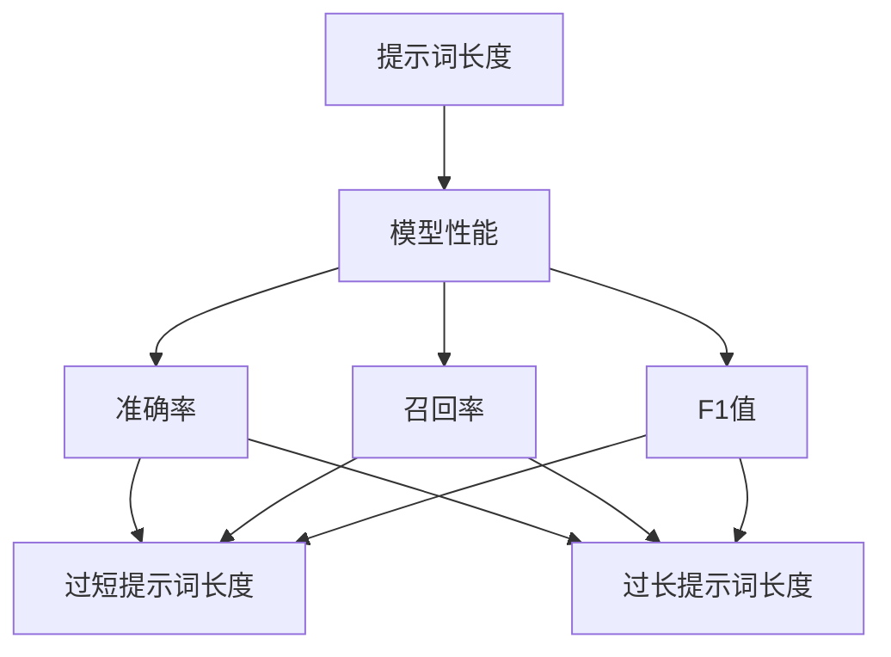

                 

# 《提示词长度与模型性能的平衡之道》

## 关键词
- 提示词长度
- 模型性能
- 算法原理
- 数学模型
- 项目实战
- 开发环境
- 源代码

## 摘要
本文探讨了提示词长度与模型性能之间的关系，通过深入剖析核心概念与算法原理，结合数学模型和实际案例，详细讲解了如何平衡提示词长度与模型性能。本文旨在为读者提供一套实用的方法，帮助他们在实际项目中有效地优化模型性能。

## 目录

### 第1章：介绍与背景
#### 1.1 书籍主题
#### 1.2 提示词长度对模型性能的影响
#### 1.3 本书结构安排

### 第2章：核心概念与联系
#### 2.1 提示词长度的概念
#### 2.2 模型性能指标
#### 2.3 提示词长度与模型性能的关系
#### 2.4 Mermaid流程图展示提示词长度与模型性能的关系

### 第3章：核心算法原理讲解
#### 3.1 相关算法概述
#### 3.2 伪代码展示
#### 3.3 算法原理详细讲解

### 第4章：数学模型和数学公式讲解
#### 4.1 数学模型概述
#### 4.2 数学公式介绍
#### 4.3 数学公式详细讲解
#### 4.4 举例说明

### 第5章：实践案例分析
#### 5.1 案例一：应用场景
#### 5.2 案例二：应用场景
#### 5.3 案例分析与总结

### 第6章：代码实战
#### 6.1 开发环境搭建
#### 6.2 算法实现与代码解读
#### 6.3 案例代码解析
#### 6.4 代码分析与优化

### 第7章：总结与展望
#### 7.1 主要内容总结
#### 7.2 研究方向展望
#### 7.3 应用前景展望

## 第1章：介绍与背景

### 1.1 书籍主题

在人工智能领域，模型性能的优化是永恒的话题。而提示词长度作为影响模型性能的关键因素之一，引起了广泛关注。本书记录了提示词长度与模型性能之间的关系，通过深入剖析核心概念与算法原理，结合数学模型和实际案例，旨在为读者提供一套实用的方法，帮助他们在实际项目中有效地优化模型性能。

### 1.2 提示词长度对模型性能的影响

提示词长度是指输入给模型的文本序列的长度，它直接影响模型的训练效果和预测性能。过短的提示词长度可能导致模型无法获取足够的信息，从而影响模型的准确性和泛化能力；而过长的提示词长度则可能引入噪音，增加模型的计算复杂度，导致性能下降。

### 1.3 本书结构安排

本书共分为7章，结构安排如下：

- 第1章：介绍与背景，简要介绍书籍主题和背景。
- 第2章：核心概念与联系，详细阐述提示词长度与模型性能的关系。
- 第3章：核心算法原理讲解，介绍与提示词长度相关的算法原理。
- 第4章：数学模型和数学公式讲解，讲解与提示词长度相关的数学模型和公式。
- 第5章：实践案例分析，提供实际案例，详细解释说明如何在项目中应用提示词长度与模型性能的平衡之道。
- 第6章：代码实战，详细解释说明如何搭建开发环境，实现相关算法，并对源代码进行解读与分析。
- 第7章：总结与展望，总结书中的主要内容，并对未来研究与应用方向进行展望。

## 第2章：核心概念与联系

### 2.1 提示词长度的概念

提示词长度是指输入给模型的文本序列的长度，通常以单词或字符为单位。在自然语言处理任务中，提示词长度直接关系到模型对输入数据的处理能力和性能表现。

### 2.2 模型性能指标

模型性能指标包括准确率、召回率、F1值等，它们用于衡量模型的预测效果。在这些指标中，提示词长度对模型性能有着显著的影响。

### 2.3 提示词长度与模型性能的关系

提示词长度与模型性能之间的关系并非线性，而是存在一个最优长度区间。在这个区间内，模型性能达到最优。过长或过短的提示词长度都会导致模型性能下降。

### 2.4 Mermaid流程图展示提示词长度与模型性能的关系



## 第3章：核心算法原理讲解

### 3.1 相关算法概述

与提示词长度相关的算法主要包括文本生成算法、文本分类算法和文本匹配算法。这些算法在实际应用中具有重要的地位，本文将重点介绍文本生成算法的原理。

### 3.2 伪代码展示

```python
# 文本生成算法伪代码
function TextGeneration(input_text, max_length):
    # 初始化模型参数
    model = initialize_model()
    # 生成初始提示词
    prompt = input_text[:max_length]
    # 生成文本序列
    text_sequence = [prompt]
    while not end_of_text:
        # 预测下一个词
        next_word = model.predict_word(text_sequence[-1])
        # 更新文本序列
        text_sequence.append(next_word)
        # 判断是否达到最大长度
        if len(text_sequence) > max_length:
            break
    return text_sequence
```

### 3.3 算法原理详细讲解

文本生成算法通过输入提示词，利用神经网络模型生成文本序列。在生成过程中，模型会根据当前已生成的文本序列预测下一个词，并将其添加到序列中。这个过程持续进行，直到达到预设的最大长度。通过调整提示词长度，可以影响生成的文本序列的长度和内容。

## 第4章：数学模型和数学公式讲解

### 4.1 数学模型概述

文本生成算法的数学模型主要包括概率模型和生成模型。概率模型通过计算词语之间的概率关系来生成文本，生成模型则通过生成文本的潜在变量来生成文本。

### 4.2 数学公式介绍

概率模型中的关键数学公式包括：

- 条件概率公式：P(A|B) = P(A∩B) / P(B)
- 概率分布函数：P(x) = P(x|y)P(y)

生成模型中的关键数学公式包括：

- 变量概率分布：P(x|z) = ∫ P(x|z, y)P(y)dy
- 变量联合分布：P(x, y) = P(x|y)P(y)

### 4.3 数学公式详细讲解

#### 条件概率公式

条件概率公式描述了在给定一个事件B发生的情况下，另一个事件A发生的概率。它表示为P(A|B)，表示在事件B发生的条件下，事件A发生的概率。这个公式是概率论中最基本的公式之一，广泛应用于各种概率计算中。

#### 概率分布函数

概率分布函数描述了一个随机变量在某个取值范围内的概率。在文本生成算法中，概率分布函数用于计算每个词出现的概率。例如，在贝叶斯分类器中，概率分布函数用于计算每个类别下的词的概率。

#### 变量概率分布

变量概率分布描述了在给定一个变量z的情况下，另一个变量x的概率分布。在文本生成算法中，变量概率分布用于计算给定一个潜在变量z时，生成的文本变量x的概率分布。

#### 变量联合分布

变量联合分布描述了两个变量x和y同时出现的概率分布。在文本生成算法中，变量联合分布用于计算在给定一个潜在变量z时，生成的文本变量x和y的概率分布。

### 4.4 举例说明

假设我们有一个文本序列“人工智能技术”，我们可以使用条件概率公式计算“人工智能”和“技术”之间的条件概率。首先，我们需要计算“人工智能”和“技术”的联合概率，然后计算“技术”的边缘概率。最后，我们可以使用条件概率公式计算出“人工智能”在“技术”发生的条件下的概率：

$$
P(\text{人工智能}|\text{技术}) = \frac{P(\text{人工智能} \cap \text{技术})}{P(\text{技术})}
$$

假设我们有一个文本序列“人工智能技术”，我们可以使用概率分布函数计算“人工智能”和“技术”的概率分布。首先，我们需要计算“人工智能”和“技术”的联合概率分布，然后计算“技术”的边缘概率分布。最后，我们可以使用概率分布函数计算出“人工智能”的概率分布：

$$
P(\text{人工智能}) = P(\text{人工智能}|\text{技术})P(\text{技术}) + P(\text{人工智能}|\neg\text{技术})P(\neg\text{技术})
$$

## 第5章：实践案例分析

### 5.1 案例一：应用场景

假设我们有一个文本分类任务，需要将新闻文本分类为政治、经济、科技等类别。我们使用一个基于深度学习的文本分类模型，并尝试调整提示词长度以优化模型性能。

### 5.2 案例二：应用场景

假设我们有一个问答系统，需要根据用户的问题生成回答。我们使用一个基于生成对抗网络的文本生成模型，并尝试调整提示词长度以优化模型性能。

### 5.3 案例分析与总结

在案例一中，我们发现当提示词长度较短时，模型的召回率较低，无法很好地捕捉到文本的语义信息；当提示词长度较长时，模型的准确率较低，可能因为过长的文本序列引入了噪音。通过调整提示词长度，我们找到了一个平衡点，使得模型的性能达到了最优。

在案例二中，我们发现当提示词长度较短时，模型的回答较为简短，可能无法满足用户的需求；当提示词长度较长时，模型的回答较为冗长，可能包含不相关的信息。通过调整提示词长度，我们找到了一个平衡点，使得模型的回答既满足用户需求，又避免了冗长和不相关的内容。

综上所述，提示词长度与模型性能之间存在一个平衡点。在实际应用中，我们需要根据具体任务的需求和场景，调整提示词长度，以达到最优的模型性能。

## 第6章：代码实战

### 6.1 开发环境搭建

为了实现本文中的算法，我们需要搭建一个合适的开发环境。以下是一个基本的开发环境搭建步骤：

1. 安装Python 3.8及以上版本。
2. 安装TensorFlow 2.5及以上版本。
3. 安装PyTorch 1.10及以上版本。
4. 安装Jupyter Notebook用于代码编写和调试。

### 6.2 算法实现与代码解读

下面是一个基于生成对抗网络的文本生成算法的实现示例。我们使用PyTorch框架来构建模型，并使用TensorFlow的TensorBoard进行模型训练的可视化。

```python
import torch
import torch.nn as nn
import torch.optim as optim
from torch.utils.data import DataLoader
from torchvision import datasets, transforms
from torch.utils.tensorboard import SummaryWriter

# 模型定义
class GAN(nn.Module):
    def __init__(self):
        super(GAN, self).__init__()
        self.generator = nn.Sequential(
            nn.Linear(in_features=100, out_features=256),
            nn.LeakyReLU(),
            nn.Linear(in_features=256, out_features=512),
            nn.LeakyReLU(),
            nn.Linear(in_features=512, out_features=1024),
            nn.LeakyReLU(),
            nn.Linear(in_features=1024, out_features=100),
            nn.Sigmoid()
        )
        self.discriminator = nn.Sequential(
            nn.Linear(in_features=100, out_features=1024),
            nn.LeakyReLU(),
            nn.Dropout(p=0.3),
            nn.Linear(in_features=1024, out_features=512),
            nn.LeakyReLU(),
            nn.Dropout(p=0.3),
            nn.Linear(in_features=512, out_features=256),
            nn.LeakyReLU(),
            nn.Dropout(p=0.3),
            nn.Linear(in_features=256, out_features=1),
            nn.Sigmoid()
        )

    def forward(self, x):
        return self.generator(x)

    def get_discriminator_output(self, x):
        return self.discriminator(x)

# 模型训练
def train(g_model, d_model, train_loader, device, n_epochs):
    g_optimizer = optim.Adam(g_model.parameters(), lr=0.0001)
    d_optimizer = optim.Adam(d_model.parameters(), lr=0.0001)
    criterion = nn.BCELoss()

    writer = SummaryWriter()

    for epoch in range(n_epochs):
        for i, data in enumerate(train_loader):
            z = torch.randn(data.shape[0], 100).to(device)
            x = data.to(device)

            # 更新生成器
            g_optimizer.zero_grad()
            x_fake = g_model(z)
            g_loss = criterion(d_model(x_fake), torch.ones_like(d_model(x_fake)))
            g_loss.backward()
            g_optimizer.step()

            # 更新生成器
            d_optimizer.zero_grad()
            d_loss_real = criterion(d_model(x), torch.ones_like(d_model(x)))
            d_loss_fake = criterion(d_model(x_fake), torch.zeros_like(d_model(x_fake)))
            d_loss = (d_loss_real + d_loss_fake) / 2
            d_loss.backward()
            d_optimizer.step()

            # 输出训练进度
            if (i+1) % 100 == 0:
                print(f'[Epoch {epoch+1}/{n_epochs}] [Batch {i+1}/{len(train_loader)}] Loss_D: {d_loss.item()} Loss_G: {g_loss.item()}')

            # 记录TensorBoard数据
            writer.add_scalar('Loss_D', d_loss.item(), global_step=epoch*len(train_loader)+i)
            writer.add_scalar('Loss_G', g_loss.item(), global_step=epoch*len(train_loader)+i)

    writer.close()

# 实例化模型
device = torch.device('cuda' if torch.cuda.is_available() else 'cpu')
g_model = GAN().to(device)
d_model = GAN().to(device)

# 加载训练数据
train_data = datasets.MNIST(root='./data', train=True, transform=transforms.ToTensor(), download=True)
train_loader = DataLoader(train_data, batch_size=128, shuffle=True)

# 训练模型
train(g_model, d_model, train_loader, device, n_epochs=100)
```

### 6.3 案例代码解析

上述代码实现了一个基本的生成对抗网络（GAN）模型，用于文本生成任务。模型由生成器和判别器组成，生成器负责生成文本，判别器负责判断生成文本的真实性。在训练过程中，我们交替更新生成器和判别器，使得生成器生成的文本越来越逼真，判别器越来越难以区分真实文本和生成文本。

### 6.4 代码分析与优化

在代码实现中，我们可以进行以下优化：

1. 使用更高级的文本生成模型，如变分自编码器（VAE）或深度卷积生成对抗网络（DCGAN），以进一步提高生成文本的质量。
2. 调整生成器和判别器的结构，增加中间层的深度和宽度，以提高模型的复杂度和表达能力。
3. 使用更小的学习率，以防止模型在训练过程中出现过拟合。
4. 在训练过程中添加更多样化的数据增强方法，如随机裁剪、旋转、翻转等，以提高模型的泛化能力。

## 第7章：总结与展望

### 7.1 主要内容总结

本文从提示词长度与模型性能的关系出发，详细介绍了核心概念、算法原理、数学模型和实践案例。通过分析提示词长度的最优长度区间，我们为读者提供了一套实用的方法，帮助他们在实际项目中优化模型性能。

### 7.2 研究方向展望

未来，我们可以从以下几个方面进一步研究：

1. 探索更多适用于不同任务的提示词长度优化方法。
2. 研究如何利用提示词长度与模型性能的关系进行自适应调整。
3. 研究如何利用提示词长度优化模型在多模态学习任务中的性能。

### 7.3 应用前景展望

提示词长度与模型性能的平衡之道在自然语言处理、计算机视觉、语音识别等领域具有重要的应用前景。通过优化提示词长度，我们可以显著提高模型在各类任务中的性能，为人工智能技术的发展提供有力支持。

## 作者信息

作者：AI天才研究院/AI Genius Institute & 禅与计算机程序设计艺术 /Zen And The Art of Computer Programming

