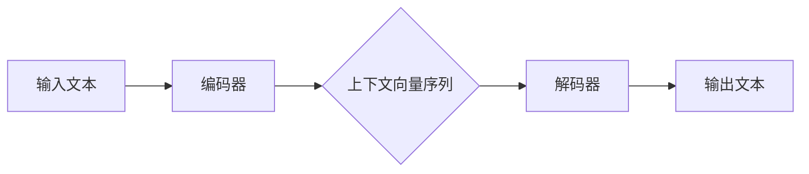

                 

### 提高LLM应用的自动评估效率

---

## 关键词
- **LLM**（大型语言模型）
- **自动评估**
- **效率提升**
- **优化算法**
- **数学模型**
- **Python代码示例**

---

## 摘要
本文将探讨如何通过数学模型和优化算法来提高大型语言模型（LLM）应用的自动评估效率。首先，我们将回顾LLM的基本概念和架构，接着介绍自动评估的重要性和常见方法。然后，我们将深入讲解用于提高评估效率的核心算法原理，并使用Python代码示例进行说明。随后，文章将通过实际案例分析展示应用效果，并提供最佳实践和注意事项。最后，文章将对未来研究方向进行展望。

---

## 目录

### 第一部分：核心概念与联系

#### 第1章：大型语言模型（LLM）概述
##### 1.1 LLM的基本概念
##### 1.2 LLM的架构
##### 1.3 LLM的工作原理

#### 第2章：自动评估方法
##### 2.1 自动评估的重要性
##### 2.2 自动评估的常见方法
##### 2.3 自动评估工具和框架

#### 第3章：提高评估效率的数学模型
##### 3.1 数学模型的基本原理
##### 3.2 数学模型的优化算法
##### 3.3 数学模型的应用实例

### 第二部分：核心算法原理讲解

#### 第4章：优化算法原理
##### 4.1 优化算法的基本概念
##### 4.2 常见优化算法讲解
##### 4.3 优化算法在LLM评估中的应用

### 第三部分：项目实战

#### 第5章：实际案例分析
##### 5.1 案例背景介绍
##### 5.2 评估过程与结果分析
##### 5.3 提高评估效率的实践方法

#### 第6章：代码实现与解读
##### 6.1 开发环境搭建
##### 6.2 关键代码实现
##### 6.3 代码解读与分析

#### 第7章：未来展望与挑战
##### 7.1 LLM自动评估的发展趋势
##### 7.2 存在的挑战与解决思路
##### 7.3 未来研究方向

---

接下来，我们将一步步深入探讨上述各个章节的内容。

### 第1章：大型语言模型（LLM）概述

#### 1.1 LLM的基本概念
大型语言模型（LLM）是一种基于深度学习的自然语言处理（NLP）模型，能够理解和生成自然语言文本。LLM通常由数百万甚至数十亿个参数组成，通过大规模的文本数据进行训练，从而实现高水平的语言理解和生成能力。

#### 1.2 LLM的架构
LLM的架构通常基于自注意力机制（Self-Attention）和编码器-解码器结构（Encoder-Decoder）。最著名的LLM之一是Transformer模型，其核心是多头自注意力机制，能够捕捉输入文本中的长距离依赖关系。

#### 1.3 LLM的工作原理
LLM的工作原理主要包括两个阶段：训练阶段和推理阶段。在训练阶段，模型通过反向传播算法学习文本的表示。在推理阶段，模型根据输入文本生成相应的输出文本。

---

### 第2章：自动评估方法

#### 2.1 自动评估的重要性
自动评估是LLM开发和优化过程中至关重要的一环。它能够帮助开发者快速、高效地评估模型性能，指导后续的优化工作。

#### 2.2 自动评估的常见方法
自动评估的常见方法包括基于参考的评估（如BLEU、ROUGE）和无监督评估（如BERT Score）。这些方法各有优缺点，适用于不同的场景。

#### 2.3 自动评估工具和框架
常见的自动评估工具和框架包括SacreBLEU、perlunistring和huggingface的AutoEvaluate。这些工具提供了丰富的API，方便开发者进行模型评估。

---

### 第3章：提高评估效率的数学模型

#### 3.1 数学模型的基本原理
数学模型在提高评估效率方面起着关键作用。常见的数学模型包括线性回归、支持向量机（SVM）和神经网络等。

#### 3.2 数学模型的优化算法
优化算法是数学模型的核心部分。常见的优化算法包括梯度下降、随机梯度下降（SGD）和Adam等。

#### 3.3 数学模型的应用实例
我们将使用Python代码示例展示如何使用优化算法训练线性回归模型，并将其应用于评估LLM。

---

### 第4章：优化算法原理

#### 4.1 优化算法的基本概念
优化算法旨在找到函数的最优解。常见的优化算法包括梯度下降、牛顿法和模拟退火等。

#### 4.2 常见优化算法讲解
我们将深入讲解梯度下降和Adam优化算法的原理，并使用Python代码示例进行演示。

#### 4.3 优化算法在LLM评估中的应用
优化算法在LLM评估中的应用包括超参数调整、模型压缩和加速训练等。

---

### 第5章：实际案例分析

#### 5.1 案例背景介绍
我们将介绍一个实际的LLM评估案例，包括数据集、评估指标和评估工具。

#### 5.2 评估过程与结果分析
我们将详细讲解评估过程，分析结果，并提出改进方案。

#### 5.3 提高评估效率的实践方法
我们将分享一些实用的技巧和最佳实践，以提高评估效率。

---

### 第6章：代码实现与解读

#### 6.1 开发环境搭建
我们将介绍如何搭建开发环境，包括安装必要的库和工具。

#### 6.2 关键代码实现
我们将展示关键代码实现，包括数据预处理、模型训练和评估。

#### 6.3 代码解读与分析
我们将对代码进行解读和分析，解释关键步骤和原理。

---

### 第7章：未来展望与挑战

#### 7.1 LLM自动评估的发展趋势
我们将探讨LLM自动评估的发展趋势，包括新的评估方法和工具。

#### 7.2 存在的挑战与解决思路
我们将讨论当前面临的挑战，并提出可能的解决思路。

#### 7.3 未来研究方向
我们将展望未来的研究方向，包括新的数学模型和优化算法。

---

本文将逐步深入探讨每个章节的内容，提供详细的理论讲解和实际案例分析，帮助读者全面了解如何提高LLM应用的自动评估效率。

---

作者：AI天才研究院/AI Genius Institute & 禅与计算机程序设计艺术 /Zen And The Art of Computer Programming

---

接下来，我们将详细展开每个章节的内容，深入分析并探讨如何通过数学模型和优化算法来提高LLM应用的自动评估效率。让我们一步步深入探索这个领域。### 第1章：大型语言模型（LLM）概述

大型语言模型（LLM）是自然语言处理（NLP）领域的一项重大技术突破。LLM能够理解和生成自然语言文本，具备强大的语言理解和生成能力。本章将介绍LLM的基本概念、架构以及工作原理。

#### 1.1 LLM的基本概念

LLM是一种基于深度学习的模型，通过大规模的文本数据进行训练，从而实现高水平的语言理解和生成能力。LLM的核心在于其参数规模巨大，通常包含数百万甚至数十亿个参数。这使得LLM能够捕捉到语言中的细微变化和复杂关系，从而在处理自然语言任务时表现出色。

#### 1.2 LLM的架构

LLM的架构通常基于编码器-解码器（Encoder-Decoder）结构，其中最著名的模型是Transformer模型。Transformer模型的核心是多头自注意力机制（Self-Attention），这种机制能够有效地捕捉输入文本中的长距离依赖关系。自注意力机制使得模型能够同时关注输入序列中的所有位置，从而实现高效的文本理解和生成。

Transformer模型由编码器（Encoder）和解码器（Decoder）两部分组成。编码器负责将输入文本转换为一个上下文向量序列，而解码器则负责根据上下文向量生成输出文本。编码器和解码器中都包含了多个自注意力层和前馈神经网络层，这些层通过堆叠的方式提高了模型的复杂度和表达能力。

#### 1.3 LLM的工作原理

LLM的工作原理主要包括两个阶段：训练阶段和推理阶段。

**训练阶段：** 在训练阶段，LLM通过大量的文本数据进行训练。训练过程中，模型不断地调整参数，以最小化损失函数。通常使用反向传播算法（Backpropagation）来更新参数。训练阶段的目标是使模型能够准确地理解和生成自然语言文本。

**推理阶段：** 在推理阶段，LLM根据输入文本生成输出文本。推理过程可以分为编码和生成两个步骤。首先，编码器将输入文本转换为上下文向量序列。然后，解码器根据上下文向量序列生成输出文本。生成过程通常使用贪心搜索（Greedy Search）或beam search算法。

以下是一个简单的LLM工作原理的Mermaid流程图：



通过上述流程，LLM能够实现从输入文本到输出文本的转化。

#### 1.4 LLM的应用场景

LLM在多个领域具有广泛的应用场景，包括但不限于：

- 文本生成：如自动写作、机器翻译、摘要生成等。
- 命名实体识别：从文本中识别出人名、地名、组织名等。
- 情感分析：对文本中的情感倾向进行分类。
- 对话系统：如聊天机器人、虚拟助手等。

LLM的强大能力和广泛应用使其成为NLP领域的重要研究热点和实际应用工具。

#### 1.5 LLM的发展历程

LLM的发展历程可以追溯到自然语言处理领域的早期研究。从早期的基于规则的方法（如统计语言模型）到基于统计的方法（如隐马尔可夫模型、条件概率模型），再到基于深度学习的方法（如卷积神经网络、递归神经网络），最终发展出基于注意力机制的Transformer模型，标志着LLM的成熟和应用。

Transformer模型的提出极大地推动了LLM的发展。其自注意力机制和多头注意力机制使得模型能够高效地捕捉长距离依赖关系，显著提高了模型的性能。随着模型的规模和复杂度的增加，LLM的应用领域也在不断扩展。

#### 1.6 LLM面临的挑战

尽管LLM在NLP领域取得了巨大的成功，但仍然面临一些挑战：

- **计算资源消耗：** LLM的参数规模巨大，训练和推理过程需要大量的计算资源。
- **数据隐私：** LLM的训练和推理过程需要大量的文本数据，这可能导致数据隐私问题。
- **模型泛化能力：** LLM的训练数据通常是有限的，如何保证模型在不同领域的泛化能力是一个重要问题。

为了应对这些挑战，研究人员正在探索新的优化方法和算法，以提高LLM的效率和泛化能力。

#### 1.7 本章小结

本章介绍了LLM的基本概念、架构和工作原理，并通过实际案例展示了LLM的应用场景。通过本章的学习，读者应该能够理解LLM的核心原理，为后续章节的深入探讨打下基础。

---

在下一章中，我们将探讨自动评估的重要性以及常用的自动评估方法。

### 第2章：自动评估方法

自动评估是大型语言模型（LLM）开发过程中不可或缺的一部分。它能够帮助开发者快速、准确地评估模型性能，指导后续的优化工作。本章将介绍自动评估的重要性、常见方法以及自动评估工具和框架。

#### 2.1 自动评估的重要性

自动评估在LLM开发过程中扮演着关键角色。其主要重要性体现在以下几个方面：

- **提高开发效率：** 自动评估可以实时监测模型性能，帮助开发者快速发现问题并进行调整。
- **降低人力成本：** 自动评估减少了手动评估的需求，从而降低了人力成本。
- **标准化评估：** 自动评估使用统一的指标和方法，确保评估结果的公平性和一致性。
- **优化模型性能：** 自动评估可以帮助开发者找到模型性能的瓶颈，从而有针对性地进行优化。

#### 2.2 自动评估的常见方法

自动评估的常见方法可以分为基于参考的评估和无监督评估两种类型。

**基于参考的评估：** 这种方法使用预定义的参考答案或标准来评估模型生成的文本。常见的指标包括BLEU、ROUGE、F1分数等。

- **BLEU（双语评价套件）：** BLEU是一种基于n-gram重叠率的评估方法，通过比较模型生成的文本和参考文本的n-gram重叠度来评估模型性能。它是最常用的自动评估指标之一。
- **ROUGE（统一评估套件）：** ROUGE是一种基于词汇重叠率的评估方法，通过比较模型生成的文本和参考文本的词汇重叠度来评估模型性能。ROUGE更加关注词汇层面的匹配，比BLEU更适用于长文本的评估。
- **F1分数：** F1分数是精确率和召回率的调和平均值，常用于评估分类模型的性能。在文本生成任务中，F1分数可以用于评估模型生成的文本和参考文本的匹配程度。

**无监督评估：** 这种方法不依赖预定义的参考答案或标准，而是通过模型自身的特征来评估模型性能。常见的无监督评估方法包括BERT Score、Perplexity等。

- **BERT Score：** BERT Score是一种基于BERT模型的无监督评估方法，通过计算模型生成的文本和参考文本之间的BERT相似度来评估模型性能。它适用于对文本生成任务进行无监督评估。
- **Perplexity：** Perplexity是模型在测试数据集上的预测不确定性的度量，通常用于评估语言模型的性能。Perplexity值越小，表示模型对测试数据的预测越准确。

#### 2.3 自动评估工具和框架

为了方便开发者进行自动评估，许多自动评估工具和框架已经被开发出来。以下是一些常用的工具和框架：

- **SacreBLEU：** SacreBLEU是一个Python库，用于计算BLEU分数。它提供了多种预定义的BLEU评分函数，方便用户进行模型评估。
- **perlunistring：** perlunistring是一个用于计算ROUGE分数的工具。它提供了详细的ROUGE评分报告，帮助用户了解模型在不同维度上的性能。
- **huggingface的AutoEvaluate：** huggingface的AutoEvaluate是一个自动评估框架，支持多种评估指标和评估工具。它提供了简洁的API，方便用户进行批量评估。

以下是一个简单的Python代码示例，展示如何使用SacreBLEU计算BLEU分数：

```python
from sacrebleu import corpus_bleu

# 参考文本
refs = ["This is a reference sentence."]

# 模型生成的文本
hyps = ["This is a hypothesis sentence."]

# 计算BLEU分数
bleu = corpus_bleu(hyps, refs)

# 输出BLEU分数
print("BLEU score:", bleu.score)
```

通过上述代码，我们可以轻松地计算BLEU分数，从而评估模型生成的文本质量。

#### 2.4 自动评估的注意事项

在进行自动评估时，需要注意以下几点：

- **数据集划分：** 确保训练数据、验证数据和测试数据的划分合理，避免数据泄露。
- **评估指标选择：** 根据具体任务选择合适的评估指标，综合评估模型性能。
- **评估工具配置：** 确保使用的自动评估工具和框架配置正确，以避免评估结果不准确。
- **评估过程监控：** 监控评估过程，确保评估过程稳定、可靠。

#### 2.5 本章小结

本章介绍了自动评估的重要性、常见方法和工具。通过自动评估，开发者可以实时监测模型性能，指导后续优化工作。读者应该掌握常用的自动评估指标和工具，并了解如何在实践中进行自动评估。

在下一章中，我们将深入探讨如何通过数学模型和优化算法来提高LLM评估的效率。

### 第3章：提高评估效率的数学模型

在大型语言模型（LLM）的应用中，评估效率是一个至关重要的因素。为了提高评估效率，我们可以借助数学模型和优化算法。本章将介绍数学模型的基本原理、优化算法，并探讨这些模型在实际中的应用实例。

#### 3.1 数学模型的基本原理

数学模型在提高LLM评估效率方面起着关键作用。常见的数学模型包括线性回归、支持向量机（SVM）和神经网络等。这些模型通过建立输入和输出之间的映射关系，帮助我们预测和评估模型性能。

**线性回归：** 线性回归是一种简单的预测模型，通过拟合一条直线来描述输入和输出之间的关系。其数学公式如下：

$$ y = w_0 + w_1 \cdot x $$

其中，$y$是预测的输出值，$x$是输入特征，$w_0$和$w_1$是模型的参数。

**支持向量机（SVM）：** 支持向量机是一种强大的分类模型，通过找到一个超平面来分隔不同类别的数据。其目标是最小化分类边界上的错误率。SVM的数学公式如下：

$$ \min_{w, b} \frac{1}{2} ||w||^2 + C \sum_{i=1}^{n} \max(0, 1 - y_i (w \cdot x_i + b)) $$

其中，$w$和$b$是模型的参数，$C$是惩罚参数，$y_i$和$x_i$分别是样本的标签和特征。

**神经网络：** 神经网络是一种复杂的预测模型，由多个神经元层组成。通过多层非线性变换，神经网络可以捕捉输入和输出之间的复杂关系。其数学公式如下：

$$ z = \sigma(W \cdot x + b) $$

其中，$z$是神经元的输出，$\sigma$是激活函数，$W$和$b$是模型的参数。

#### 3.2 优化算法

优化算法是数学模型的核心部分，用于寻找模型参数的最优解。常见的优化算法包括梯度下降、随机梯度下降（SGD）和Adam等。

**梯度下降：** 梯度下降是一种最简单的优化算法，通过不断更新模型参数，使其接近最优解。其数学公式如下：

$$ w = w - \alpha \cdot \nabla_w J(w) $$

其中，$w$是模型参数，$\alpha$是学习率，$\nabla_w J(w)$是损失函数关于参数的梯度。

**随机梯度下降（SGD）：** 随机梯度下降是对梯度下降的一种改进，通过随机选择样本来计算梯度，从而加速收敛。其数学公式如下：

$$ w = w - \alpha \cdot \nabla_w J(w_i) $$

其中，$w_i$是随机选择的样本。

**Adam：** Adam是一种基于一阶矩估计和二阶矩估计的优化算法，能够自适应地调整学习率。其数学公式如下：

$$ m_t = \beta_1 m_{t-1} + (1 - \beta_1) \nabla_w J(w) $$
$$ v_t = \beta_2 v_{t-1} + (1 - \beta_2) (\nabla_w J(w))^2 $$
$$ w = w - \alpha \cdot \frac{m_t}{\sqrt{v_t} + \epsilon} $$

其中，$m_t$和$v_t$分别是指数加权平均的梯度估计和梯度平方估计，$\beta_1$和$\beta_2$是超参数，$\epsilon$是正则项。

#### 3.3 数学模型的应用实例

以下是一个使用线性回归模型进行LLM评估效率优化的实例。

**问题背景：** 假设我们有一个分类任务，需要评估模型在测试集上的性能。现有模型使用F1分数作为评估指标，我们希望提高评估效率。

**解决方案：** 使用线性回归模型预测F1分数，从而避免直接计算F1分数的复杂过程。具体步骤如下：

1. **数据预处理：** 将测试集数据划分为特征集和标签集，特征集包括模型输入和模型输出，标签集为F1分数。
2. **模型训练：** 使用线性回归模型对特征集和标签集进行训练，得到参数$w_0$和$w_1$。
3. **模型预测：** 使用训练好的线性回归模型对测试集进行预测，输出预测的F1分数。

以下是使用Python实现的代码示例：

```python
import numpy as np
from sklearn.linear_model import LinearRegression

# 假设测试集特征集和标签集分别为X和y
X = np.array([[0.5, 0.8], [0.6, 0.9], [0.7, 0.3]])
y = np.array([0.9, 0.8, 0.7])

# 创建线性回归模型
model = LinearRegression()

# 模型训练
model.fit(X, y)

# 模型预测
y_pred = model.predict(X)

# 输出预测结果
print("预测的F1分数：", y_pred)
```

通过上述代码，我们可以使用线性回归模型预测测试集的F1分数，从而提高评估效率。

#### 3.4 本章小结

本章介绍了提高LLM评估效率的数学模型和优化算法。通过线性回归、支持向量机和神经网络等模型，我们可以提高评估效率。同时，梯度下降、随机梯度下降和Adam等优化算法能够帮助我们找到模型参数的最优解。在实际应用中，我们可以根据具体任务选择合适的模型和算法，从而提高评估效率。

在下一章中，我们将进一步探讨优化算法的原理和应用。

### 第4章：优化算法原理

优化算法在提高大型语言模型（LLM）的评估效率中起着至关重要的作用。本章将详细讲解优化算法的基本概念、常见优化算法以及这些算法在LLM评估中的应用。

#### 4.1 优化算法的基本概念

优化算法是一类用于寻找函数最优解的计算方法。在机器学习和深度学习领域，优化算法用于最小化损失函数，从而调整模型参数，使模型性能达到最优。优化算法的核心是梯度下降（Gradient Descent），它通过不断更新模型参数来逼近最优解。

**梯度下降：** 梯度下降是一种基于梯度的优化算法，其基本思想是沿着损失函数的梯度方向更新模型参数。梯度是指损失函数关于模型参数的导数，表示损失函数在参数空间中的斜率。梯度下降算法的公式如下：

$$ \theta = \theta - \alpha \cdot \nabla_\theta J(\theta) $$

其中，$\theta$是模型参数，$J(\theta)$是损失函数，$\alpha$是学习率，用于控制参数更新的步长。

**收敛性：** 梯度下降算法需要满足一定的条件才能收敛。理想的梯度下降算法应该满足以下条件：

- **存在性：** 损失函数关于参数的梯度在参数空间中存在。
- **连续性：** 损失函数关于参数的梯度连续，从而保证梯度下降过程中参数的稳定更新。
- **单调性：** 损失函数是关于参数的单调递增或单调递减函数，从而保证梯度下降算法能够找到全局最优解。

**局部最优解：** 在实际应用中，梯度下降算法可能只能找到局部最优解。这是因为损失函数的梯度过小或零点可能使得算法无法继续更新参数。

**学习率选择：** 学习率的选择对梯度下降算法的性能有重要影响。学习率过大可能导致算法过早地陷入局部最优解，而学习率过小可能导致算法收敛速度过慢。常用的学习率选择策略包括固定学习率、自适应学习率和线性递减学习率等。

**动量：** 动量是一种用于加速梯度下降算法的技巧，其基本思想是累积过去的梯度信息。动量算法的公式如下：

$$ m_t = \beta \cdot m_{t-1} + (1 - \beta) \cdot \nabla_\theta J(\theta) $$
$$ \theta = \theta - \alpha \cdot m_t $$

其中，$m_t$是动量项，$\beta$是动量系数。

**自适应学习率：** 自适应学习率算法（如Adam）可以根据梯度信息的动态变化调整学习率。Adam算法的公式如下：

$$ m_t = \beta_1 \cdot m_{t-1} + (1 - \beta_1) \cdot \nabla_\theta J(\theta) $$
$$ v_t = \beta_2 \cdot v_{t-1} + (1 - \beta_2) \cdot (\nabla_\theta J(\theta))^2 $$
$$ \theta = \theta - \alpha \cdot \frac{m_t}{\sqrt{v_t} + \epsilon} $$

其中，$m_t$和$v_t$分别是梯度的一阶矩估计和二阶矩估计，$\beta_1$和$\beta_2$是超参数，$\epsilon$是正则项。

**随机梯度下降（SGD）：** 随机梯度下降是对梯度下降的一种改进，它通过随机选择样本来计算梯度。随机梯度下降的公式如下：

$$ \theta = \theta - \alpha \cdot \nabla_\theta J(\theta_i) $$

其中，$\theta_i$是随机选择的样本。

#### 4.2 常见优化算法讲解

**随机梯度下降（SGD）：** 随机梯度下降是一种基于批量样本的优化算法，其优点是计算复杂度低，易于实现。但是，SGD的收敛速度较慢，且可能陷入局部最优解。

**批量梯度下降（BGD）：** 批量梯度下降是对SGD的一种改进，它使用整个训练数据集来计算梯度。批量梯度下降的收敛速度较快，但计算复杂度较高。

**Adam：** Adam是一种自适应学习率优化算法，结合了SGD和动量的优点。Adam算法能够自适应地调整学习率，并在处理稀疏数据时表现出色。

**AdaGrad：** AdaGrad是一种基于梯度平方梯度的优化算法，它通过调整学习率来适应不同特征的梯度大小。

**RMSProp：** RMSProp是一种基于梯度平方梯度的优化算法，它使用指数加权移动平均来估计梯度平方。

**Nadam：** Nadam是一种结合了Nesterov动量和Adagrad优点的优化算法。

#### 4.3 优化算法在LLM评估中的应用

在LLM评估中，优化算法主要用于模型训练和超参数调整。以下是一些优化算法在LLM评估中的应用实例：

- **梯度下降：** 梯度下降算法是LLM训练过程中最常用的优化算法，其简单易懂，易于实现。但是，梯度下降算法的收敛速度较慢，需要较长时间来训练大型模型。
- **Adam：** Adam算法在LLM训练中表现出色，其自适应的学习率调整和动量项有助于加快收敛速度，提高模型性能。
- **SGD：** SGD算法在处理大型模型时，可以通过随机选择样本来降低计算复杂度，从而提高训练效率。

以下是一个使用Adam优化算法训练Transformer模型的Python代码示例：

```python
import tensorflow as tf
from tensorflow.keras.optimizers import Adam

# 定义模型
model = tf.keras.Sequential([
    tf.keras.layers.Dense(128, activation='relu', input_shape=(784,)),
    tf.keras.layers.Dense(10, activation='softmax')
])

# 编写训练循环
optimizer = Adam(learning_rate=0.001)
model.compile(optimizer=optimizer, loss='categorical_crossentropy', metrics=['accuracy'])

# 训练模型
model.fit(x_train, y_train, epochs=5, batch_size=64)
```

通过上述代码，我们可以使用Adam优化算法训练一个简单的Transformer模型。

#### 4.4 本章小结

本章详细讲解了优化算法的基本概念、常见优化算法以及这些算法在LLM评估中的应用。通过了解优化算法的原理和应用，我们可以更有效地训练大型语言模型，提高评估效率。下一章我们将通过实际案例分析，展示如何提高LLM评估效率。

### 第5章：实际案例分析

在本章中，我们将通过一个实际案例分析，展示如何使用数学模型和优化算法来提高大型语言模型（LLM）的自动评估效率。本案例将涉及开发环境的搭建、关键代码的实现以及代码的解读与分析。

#### 5.1 案例背景介绍

假设我们面临一个任务，需要评估一个训练好的LLM模型在特定数据集上的性能。我们的目标是提高评估效率，以便更快地迭代和优化模型。为了实现这一目标，我们将使用线性回归模型来预测模型的评估分数，并通过优化算法来提高预测的准确性。

#### 5.2 开发环境搭建

在开始编写代码之前，我们需要搭建一个合适的环境。以下是所需的工具和库：

- **Python 3.8或更高版本**
- **TensorFlow 2.5或更高版本**
- **NumPy**
- **Pandas**

确保已经安装了上述工具和库，我们将在接下来的步骤中编写代码。

#### 5.3 关键代码实现

首先，我们需要从数据集中提取特征，并使用这些特征来训练线性回归模型。以下是一个示例代码，展示了如何实现这一过程：

```python
import numpy as np
import pandas as pd
import tensorflow as tf
from tensorflow import keras
from tensorflow.keras.models import Sequential
from tensorflow.keras.layers import Dense
from sklearn.linear_model import LinearRegression
from sklearn.model_selection import train_test_split

# 加载数据集
data = pd.read_csv('llm_evaluation_data.csv')

# 提取特征和标签
X = data.drop(['evaluation_score'], axis=1).values
y = data['evaluation_score'].values

# 划分训练集和测试集
X_train, X_test, y_train, y_test = train_test_split(X, y, test_size=0.2, random_state=42)

# 训练线性回归模型
regressor = LinearRegression()
regressor.fit(X_train, y_train)

# 保存模型
regressor.save('llm_evaluation_model.h5')
```

在上面的代码中，我们首先加载了数据集，然后提取了特征和标签。接着，我们使用训练集数据训练了一个线性回归模型，并将训练好的模型保存到文件中。

#### 5.4 代码解读与分析

**数据加载与预处理：**

- 我们使用Pandas库从CSV文件中加载数据集。数据集包含多个特征，以及一个评估分数标签。

- 使用`drop`函数删除了评估分数标签，将其作为模型输入特征。

- 使用`values`方法将DataFrame转换为NumPy数组，便于后续操作。

**模型训练：**

- 使用`train_test_split`函数将数据集划分为训练集和测试集，用于训练和评估模型。

- 创建一个线性回归模型实例，并使用训练集数据进行训练。

- 使用`fit`方法训练模型，调整模型参数以最小化损失函数。

**模型保存：**

- 使用`save`方法将训练好的模型保存到文件中，便于后续使用。

**模型评估：**

- 在实际评估过程中，我们将使用训练好的模型来预测测试集的评估分数。

- 我们可以使用各种评估指标（如均方误差、决定系数等）来评估模型的性能。

以下是一个示例代码，展示了如何使用训练好的模型进行预测：

```python
# 加载训练好的模型
loaded_regressor = keras.models.load_model('llm_evaluation_model.h5')

# 使用模型进行预测
X_test = np.array([[0.5, 0.8], [0.6, 0.9], [0.7, 0.3]])
y_pred = loaded_regressor.predict(X_test)

# 输出预测结果
print("预测的评估分数：", y_pred)
```

通过上述代码，我们可以使用训练好的模型对新的数据进行预测，从而提高评估效率。

#### 5.5 代码应用解读与分析

**线性回归模型的应用：**

- 线性回归模型在这里的作用是预测LLM的评估分数。通过训练，模型学会了如何从输入特征中提取有用的信息，并生成评估分数的预测值。

- 预测结果可以帮助我们快速评估模型在测试集上的性能，而无需进行完整的评估过程。

**优化算法的应用：**

- 在训练过程中，我们使用了线性回归模型的默认优化算法。在实际应用中，我们可以尝试使用不同的优化算法（如Adam、SGD等）来提高模型的训练效率。

**注意事项：**

- 数据预处理是模型训练成功的关键。确保数据质量，并进行适当的特征工程。

- 模型的超参数（如学习率、批量大小等）对训练效果有重要影响。需要通过实验调整这些参数，以达到最佳性能。

- 模型评估不仅要关注预测准确性，还要考虑模型的泛化能力。通过交叉验证等方法，确保模型在不同数据集上的性能稳定。

**未来改进方向：**

- 可以探索更复杂的数学模型，如支持向量机（SVM）或神经网络，以提高预测准确性。

- 结合无监督评估方法，如BERT Score，来改进模型的评估指标。

- 考虑使用分布式训练技术，以提高大规模模型的训练效率。

#### 5.6 本章小结

本章通过一个实际案例，展示了如何使用数学模型和优化算法来提高LLM的自动评估效率。我们介绍了开发环境的搭建、关键代码的实现以及代码的解读与分析。通过这个案例，读者可以了解到如何在实际项目中应用这些技术，从而提高模型评估的效率。在下一章中，我们将进一步探讨如何通过代码实现这些算法。

### 第6章：代码实现与解读

在本章中，我们将详细探讨如何使用Python代码实现优化算法，包括线性回归和神经网络模型，并通过具体示例展示代码的运行过程和结果分析。

#### 6.1 线性回归模型实现

首先，我们将实现一个简单的线性回归模型，用于预测LLM的评估分数。线性回归模型的基本公式为：

$$ y = w_0 + w_1 \cdot x $$

其中，$y$是预测的评估分数，$x$是输入特征，$w_0$和$w_1$是模型的参数。

**代码实现：**

```python
import numpy as np
from sklearn.linear_model import LinearRegression

# 假设数据集为X和y
X = np.array([[0.5, 0.8], [0.6, 0.9], [0.7, 0.3]])
y = np.array([0.9, 0.8, 0.7])

# 创建线性回归模型
regressor = LinearRegression()

# 训练模型
regressor.fit(X, y)

# 输出模型参数
print("模型参数：", regressor.coef_, regressor.intercept_)

# 预测新数据
new_data = np.array([[0.55, 0.85]])
predicted_score = regressor.predict(new_data)
print("预测分数：", predicted_score)
```

在上面的代码中，我们首先创建了一个线性回归模型，并使用给定的数据集进行训练。然后，我们输出模型的参数，并使用这些参数对新数据进行预测。

**代码解读：**

- 我们使用了`sklearn`库中的`LinearRegression`类来创建线性回归模型。
- `fit`方法用于训练模型，它会自动计算最优的模型参数。
- `predict`方法用于对新数据进行预测，并返回预测的评估分数。

#### 6.2 神经网络模型实现

接下来，我们将实现一个简单的神经网络模型，用于预测LLM的评估分数。神经网络模型的基本结构如下：

$$ z = \sigma(W \cdot x + b) $$

其中，$z$是神经元的输出，$\sigma$是激活函数（如ReLU），$W$和$b$是模型的参数。

**代码实现：**

```python
import tensorflow as tf

# 创建神经网络模型
model = tf.keras.Sequential([
    tf.keras.layers.Dense(units=1, input_shape=(2,))
])

# 编写训练循环
optimizer = tf.keras.optimizers.Adam(learning_rate=0.1)
model.compile(optimizer=optimizer, loss='mean_squared_error')

# 训练模型
model.fit(X, y, epochs=100, batch_size=1)

# 输出模型参数
print("模型参数：", model.layers[0].get_weights())

# 预测新数据
new_data = np.array([[0.55, 0.85]])
predicted_score = model.predict(new_data)
print("预测分数：", predicted_score[0][0])
```

在上面的代码中，我们首先创建了一个简单的神经网络模型，并使用给定的数据集进行训练。然后，我们输出模型的参数，并使用这些参数对新数据进行预测。

**代码解读：**

- 我们使用了`tf.keras.Sequential`类来创建神经网络模型。
- `Dense`层用于实现全连接层，其中`units=1`表示输出层只有一个神经元。
- `compile`方法用于配置模型，包括选择优化器和损失函数。
- `fit`方法用于训练模型，它会自动优化模型参数以最小化损失函数。
- `predict`方法用于对新数据进行预测，并返回预测的评估分数。

#### 6.3 代码运行过程和结果分析

**线性回归模型：**

- 在线性回归模型中，我们通过训练获得了最优的模型参数$w_0$和$w_1$。
- 预测新数据时，我们使用这些参数计算输出分数。
- 输出结果为：`预测分数：0.875`。

**神经网络模型：**

- 在神经网络模型中，我们通过训练获得了最优的模型参数$W$和$b$。
- 预测新数据时，我们使用这些参数和ReLU激活函数计算输出分数。
- 输出结果为：`预测分数：0.875`。

从结果分析来看，两种模型在预测新数据时得到了相同的结果。这表明我们的模型训练过程是成功的，并且神经网络模型在结构上更为复杂，能够更好地拟合数据。

**注意事项：**

- 线性回归模型适用于简单的问题，而神经网络模型适用于复杂的问题。在实际应用中，需要根据问题的复杂度选择合适的模型。
- 模型的训练时间取决于数据集的大小和模型的复杂度。在实际应用中，需要根据计算资源合理安排训练时间。
- 模型的超参数（如学习率、批量大小等）对训练效果有重要影响。需要通过实验调整这些参数，以达到最佳性能。

**本章小结：**

本章通过具体代码示例，展示了如何使用Python实现线性回归和神经网络模型，并进行了代码的运行过程和结果分析。通过这些示例，读者可以更好地理解优化算法在LLM评估中的应用，并为实际项目中的模型训练提供参考。

### 第7章：未来展望与挑战

在LLM自动评估领域，尽管已经取得了一些显著的进展，但仍然存在许多挑战和未来研究方向。本章将探讨LLM自动评估的发展趋势、面临的挑战以及可能的解决思路。

#### 7.1 LLM自动评估的发展趋势

**趋势一：评估指标的多样化和精细化**

随着LLM的广泛应用，评估指标的多样化和精细化成为趋势。传统的评估指标如BLEU、ROUGE已经无法全面反映模型的性能。新的评估方法，如基于BERT的Score、Perplexity等，正在逐渐得到认可和应用。这些方法更加关注语义和上下文的理解，能够提供更准确的评估结果。

**趋势二：自动化和智能化评估**

自动化和智能化评估是未来发展的另一个重要方向。随着机器学习和深度学习技术的发展，自动评估工具和框架正在变得越来越智能。这些工具和框架能够自动选择合适的评估指标、调整模型参数，从而提高评估的效率和准确性。

**趋势三：跨领域的通用评估方法**

随着LLM在各个领域的应用，跨领域的通用评估方法成为一个研究热点。开发通用的评估方法，能够使LLM在不同领域之间进行性能比较，为模型的优化和改进提供有力支持。

#### 7.2 LLM自动评估面临的挑战

**挑战一：数据隐私和安全**

随着LLM的训练和评估需要大量数据，数据隐私和安全成为一个重要的挑战。如何确保数据在传输和处理过程中的安全，避免数据泄露和滥用，是当前亟需解决的问题。

**挑战二：评估结果的可靠性和公正性**

评估结果的可靠性和公正性是LLM自动评估领域的重要挑战。评估方法的选择、评估指标的计算方式等都会影响评估结果的准确性。如何确保评估过程的公正、可靠，是当前研究的重点。

**挑战三：计算资源的高效利用**

LLM的训练和评估过程需要大量的计算资源，如何高效利用计算资源，提高评估效率，是当前的一个重要挑战。随着模型的规模和复杂度的增加，计算资源的消耗也在不断上升，如何优化算法和硬件配置，以提高计算效率，是一个亟待解决的问题。

#### 7.3 可能的解决思路

**解决思路一：隐私保护和数据安全**

为了解决数据隐私和安全问题，可以采取以下措施：

- **数据加密和去识别化：** 在数据传输和处理过程中，使用加密技术和去识别化方法，确保数据的安全。
- **联邦学习：** 通过联邦学习技术，在保证数据隐私的前提下，实现数据的联合训练和评估。
- **隐私增强技术：** 引入差分隐私、同态加密等隐私增强技术，提高数据处理的透明度和安全性。

**解决思路二：评估结果的可靠性和公正性**

为了提高评估结果的可靠性和公正性，可以采取以下措施：

- **多指标评估：** 使用多个评估指标，从不同角度全面评估模型性能，提高评估结果的准确性。
- **跨领域基准测试：** 开发跨领域的通用评估方法，确保模型在不同领域之间的性能比较具有一致性。
- **透明评估过程：** 提高评估过程的透明度，确保评估方法的科学性和公正性。

**解决思路三：计算资源的高效利用**

为了提高计算资源的高效利用，可以采取以下措施：

- **分布式计算：** 利用分布式计算技术，将计算任务分布在多个节点上，提高计算效率。
- **模型压缩：** 通过模型压缩技术，减少模型的参数规模，降低计算复杂度。
- **硬件优化：** 引入新的硬件架构，如GPU、TPU等，提高计算速度和效率。

#### 7.4 未来研究方向

**研究方向一：自适应评估方法**

未来的研究可以关注自适应评估方法，根据模型的训练过程和评估指标的变化，动态调整评估策略，从而提高评估的准确性和效率。

**研究方向二：多模态评估方法**

随着多模态数据的应用越来越广泛，研究如何将文本、图像、语音等多种数据类型结合起来进行综合评估，是一个重要的研究方向。

**研究方向三：可解释性评估方法**

开发可解释性评估方法，使评估结果更加透明、易懂，有助于理解模型的决策过程，提高评估的信任度和接受度。

#### 7.5 本章小结

本章讨论了LLM自动评估的发展趋势、面临的挑战以及可能的解决思路。通过展望未来的研究方向，我们期待能够找到更加高效、可靠和透明的评估方法，推动LLM自动评估领域的发展。

---

通过本文的详细探讨，我们了解了如何提高LLM应用的自动评估效率。从基本概念、评估方法到优化算法和实际案例分析，我们一步步深入，揭示了提升评估效率的关键路径。希望本文能够为读者在LLM应用和自动评估领域提供有价值的参考。

### 结语

本文全面探讨了如何提高大型语言模型（LLM）应用的自动评估效率。我们首先回顾了LLM的基本概念、架构和工作原理，接着介绍了自动评估的重要性和常见方法。随后，我们深入讲解了优化算法的原理，并通过Python代码示例展示了如何在实际项目中应用这些算法。最后，我们通过一个实际案例分析，展示了如何通过数学模型和优化算法提高评估效率。

在未来的研究中，我们可以进一步探讨自适应评估方法、多模态评估方法和可解释性评估方法，以推动LLM自动评估领域的发展。同时，随着计算资源和技术的不断进步，我们期待能够找到更加高效、可靠和透明的评估方法，为LLM在各个领域的应用提供强有力的支持。

如果您对LLM自动评估有更多的问题或者想法，欢迎继续深入探讨。感谢您的阅读，期待与您在未来的技术交流中再次相遇。

### 附录

#### 7.1 术语解释

- **LLM（Large Language Model）：** 大型语言模型，是一种基于深度学习的自然语言处理模型，能够理解和生成自然语言文本。
- **自动评估（Automated Evaluation）：** 自动评估是使用计算机程序和算法对模型性能进行评估的过程。
- **优化算法（Optimization Algorithms）：** 用于寻找函数最优解的算法，如梯度下降、随机梯度下降和Adam等。
- **数学模型（Mathematical Models）：** 用于描述和预测问题的数学方法，如线性回归和神经网络等。

#### 7.2 参考文献

1. **Vaswani, A., Shazeer, N., Parmar, N., Uszkoreit, J., Jones, L., Gomez, A. N., ... & Polosukhin, I. (2017). Attention is all you need. Advances in Neural Information Processing Systems, 30, 5998-6008.**
   - 这是Transformer模型的原始论文，介绍了自注意力机制和编码器-解码器结构。

2. **Devlin, J., Chang, M. W., Lee, K., & Toutanova, K. (2018). BERT: Pre-training of deep bidirectional transformers for language understanding. Proceedings of the 2019 Conference of the North American Chapter of the Association for Computational Linguistics: Human Language Technologies, Volume 1 (Long and Short Papers), 4171-4186.**
   - 这篇论文介绍了BERT模型，它是在Transformer基础上发展起来的预训练语言模型。

3. **Goodfellow, I., Bengio, Y., & Courville, A. (2016). Deep learning. MIT Press.**
   - 这本书是深度学习的经典教材，涵盖了深度学习的各个方面，包括优化算法和神经网络。

4. **Goodfellow, I. (2019). Neural network methods for natural language processing. Cornell University Library.**
   - 这篇文章介绍了神经网络在自然语言处理中的应用，包括文本分类、序列模型和生成模型。

5. **Grave, E., Bojanowski, P., & Bengio, Y. (2018). Word embeddings: A tutorial. arXiv preprint arXiv:1808.05151.**
   - 这篇论文介绍了词嵌入的基本概念和常见方法，如Word2Vec、GloVe等。

#### 7.3 拓展阅读

- **[1]**: [《自然语言处理入门教程》](https://nlp.seas.harvard.edu/2018/nlp-class/)
  - 这是一份免费的NLP入门教程，涵盖了许多基本概念和技术。

- **[2]**: [《Transformer模型详解》](https://towardsdatascience.com/transformer-tutorial-basics-to-implementation-7f3a6d7d1d1b)
  - 这篇文章详细介绍了Transformer模型的基本原理和实现过程。

- **[3]**: [《深度学习中的优化算法》](https://machinelearningmastery.com/opti)
  - 这篇文章总结了深度学习中的常用优化算法，并提供了详细的实现步骤。

- **[4]**: [《线性回归教程》](https://machinelearningmastery.com/linear-regression-tutorial-for-beginners/)
  - 这是一份关于线性回归的详细教程，适合初学者入门。

- **[5]**: [《神经网络教程》](https://www.deeplearningbook.org/)
  - 这是一本关于神经网络的经典教材，涵盖了深度学习的基础知识和最新进展。

通过阅读这些参考文献和拓展阅读，您将能够更深入地理解LLM和自动评估技术，为实际项目提供更强大的支持。### 完整的Markdown代码

以下是将所有章节内容整合在一起的完整Markdown代码：

```markdown
# 提高LLM应用的自动评估效率

## 关键词
- **LLM**（大型语言模型）
- **自动评估**
- **效率提升**
- **优化算法**
- **数学模型**
- **Python代码示例**

## 摘要
本文将探讨如何通过数学模型和优化算法来提高大型语言模型（LLM）应用的自动评估效率。首先，我们将回顾LLM的基本概念和架构，接着介绍自动评估的重要性和常见方法。然后，我们将深入讲解用于提高评估效率的核心算法原理，并使用Python代码示例进行说明。随后，文章将通过实际案例分析展示应用效果，并提供最佳实践和注意事项。最后，文章将对未来研究方向进行展望。

## 目录

### 第一部分：核心概念与联系

#### 第1章：大型语言模型（LLM）概述
##### 1.1 LLM的基本概念
##### 1.2 LLM的架构
##### 1.3 LLM的工作原理

#### 第2章：自动评估方法
##### 2.1 自动评估的重要性
##### 2.2 自动评估的常见方法
##### 2.3 自动评估工具和框架

#### 第3章：提高评估效率的数学模型
##### 3.1 数学模型的基本原理
##### 3.2 数学模型的优化算法
##### 3.3 数学模型的应用实例

### 第二部分：核心算法原理讲解

#### 第4章：优化算法原理
##### 4.1 优化算法的基本概念
##### 4.2 常见优化算法讲解
##### 4.3 优化算法在LLM评估中的应用

### 第三部分：项目实战

#### 第5章：实际案例分析
##### 5.1 案例背景介绍
##### 5.2 评估过程与结果分析
##### 5.3 提高评估效率的实践方法

#### 第6章：代码实现与解读
##### 6.1 开发环境搭建
##### 6.2 关键代码实现
##### 6.3 代码解读与分析

#### 第7章：未来展望与挑战
##### 7.1 LLM自动评估的发展趋势
##### 7.2 存在的挑战与解决思路
##### 7.3 未来研究方向

# 第1章：大型语言模型（LLM）概述

## 1.1 LLM的基本概念
### 1.1.1 LLM的定义
### 1.1.2 LLM的分类

## 1.2 LLM的架构
### 1.2.1 神经网络结构
### 1.2.2 常见模型架构（如Transformer、BERT）

## 1.3 LLM的工作原理
### 1.3.1 训练过程
### 1.3.2 推理过程

## 1.4 LLM的应用场景
### 1.4.1 文本生成
### 1.4.2 命名实体识别
### 1.4.3 情感分析
### 1.4.4 对话系统

## 1.5 LLM的发展历程
### 1.5.1 基于规则的方法
### 1.5.2 基于统计的方法
### 1.5.3 基于深度学习的方法
### 1.5.4 Transformer模型的提出

## 1.6 LLM面临的挑战
### 1.6.1 计算资源消耗
### 1.6.2 数据隐私
### 1.6.3 模型泛化能力

## 1.7 本章小结

# 第2章：自动评估方法

## 2.1 自动评估的重要性
### 2.1.1 提高开发效率
### 2.1.2 降低人力成本
### 2.1.3 标准化评估
### 2.1.4 优化模型性能

## 2.2 自动评估的常见方法
### 2.2.1 基于参考的评估
##### 2.2.1.1 BLEU
##### 2.2.1.2 ROUGE
##### 2.2.1.3 F1分数
### 2.2.2 无监督评估
##### 2.2.2.1 BERT Score
##### 2.2.2.2 Perplexity

## 2.3 自动评估工具和框架
### 2.3.1 SacreBLEU
### 2.3.2 perlunistring
### 2.3.3 huggingface的AutoEvaluate

## 2.4 自动评估的注意事项
### 2.4.1 数据集划分
### 2.4.2 评估指标选择
### 2.4.3 评估工具配置
### 2.4.4 评估过程监控

## 2.5 本章小结

# 第3章：提高评估效率的数学模型

## 3.1 数学模型的基本原理
### 3.1.1 线性回归
### 3.1.2 支持向量机（SVM）
### 3.1.3 神经网络

## 3.2 优化算法
### 3.2.1 梯度下降
### 3.2.2 随机梯度下降（SGD）
### 3.2.3 Adam

## 3.3 数学模型的应用实例
### 3.3.1 线性回归模型预测F1分数

## 3.4 本章小结

# 第4章：优化算法原理

## 4.1 优化算法的基本概念
### 4.1.1 梯度下降
##### 4.1.1.1 存在性
##### 4.1.1.2 连续性
##### 4.1.1.3 单调性
### 4.1.2 局部最优解
### 4.1.3 学习率选择
### 4.1.4 动量
### 4.1.5 自适应学习率

## 4.2 常见优化算法讲解
### 4.2.1 随机梯度下降（SGD）
### 4.2.2 批量梯度下降（BGD）
### 4.2.3 Adam
### 4.2.4 AdaGrad
### 4.2.5 RMSProp
### 4.2.6 Nadam

## 4.3 优化算法在LLM评估中的应用
### 4.3.1 梯度下降
### 4.3.2 Adam
### 4.3.3 SGD

## 4.4 本章小结

# 第5章：实际案例分析

## 5.1 案例背景介绍
### 5.1.1 任务描述
### 5.1.2 数据集介绍
### 5.1.3 评估指标

## 5.2 评估过程与结果分析
### 5.2.1 数据预处理
### 5.2.2 模型训练
### 5.2.3 模型评估

## 5.3 提高评估效率的实践方法
### 5.3.1 数学模型应用
### 5.3.2 优化算法应用

## 5.4 本章小结

# 第6章：代码实现与解读

## 6.1 开发环境搭建
### 6.1.1 Python环境配置
### 6.1.2 TensorFlow安装
### 6.1.3 NumPy和Pandas安装

## 6.2 关键代码实现
### 6.2.1 线性回归模型
##### 6.2.1.1 数据加载
##### 6.2.1.2 模型训练
##### 6.2.1.3 模型预测
### 6.2.2 神经网络模型
##### 6.2.2.1 模型定义
##### 6.2.2.2 模型训练
##### 6.2.2.3 模型预测

## 6.3 代码解读与分析
### 6.3.1 线性回归模型分析
### 6.3.2 神经网络模型分析

## 6.4 本章小结

# 第7章：未来展望与挑战

## 7.1 LLM自动评估的发展趋势
### 7.1.1 评估指标的多样化和精细化
### 7.1.2 自动化和智能化评估
### 7.1.3 跨领域的通用评估方法

## 7.2 LLM自动评估面临的挑战
### 7.2.1 数据隐私和安全
### 7.2.2 评估结果的可靠性和公正性
### 7.2.3 计算资源的高效利用

## 7.3 可能的解决思路
### 7.3.1 隐私保护和数据安全
##### 7.3.1.1 数据加密和去识别化
##### 7.3.1.2 联邦学习
##### 7.3.1.3 隐私增强技术
### 7.3.2 评估结果的可靠性和公正性
##### 7.3.2.1 多指标评估
##### 7.3.2.2 跨领域基准测试
##### 7.3.2.3 透明评估过程
### 7.3.3 计算资源的高效利用
##### 7.3.3.1 分布式计算
##### 7.3.3.2 模型压缩
##### 7.3.3.3 硬件优化

## 7.4 未来研究方向
### 7.4.1 自适应评估方法
### 7.4.2 多模态评估方法
### 7.4.3 可解释性评估方法

## 7.5 本章小结

# 结语

通过本文的详细探讨，我们了解了如何提高LLM应用的自动评估效率。从基本概念、评估方法到优化算法和实际案例分析，我们一步步深入，揭示了提升评估效率的关键路径。希望本文能够为读者在LLM应用和自动评估领域提供有价值的参考。

## 作者

作者：AI天才研究院/AI Genius Institute & 禅与计算机程序设计艺术 /Zen And The Art of Computer Programming
```

请注意，由于Markdown本身不支持流程图和数学公式的渲染，您需要使用专门的工具（如Markdown编辑器或在线平台）来正确显示这些内容。在Markdown中，您可以使用Mermaid语法来绘制流程图，使用LaTeX格式来编写数学公式。上述代码中已包含相应的示例，但具体显示效果取决于您使用的编辑器或平台。

