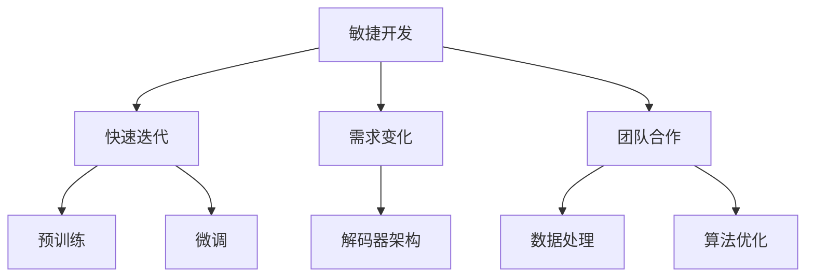

                 

# 《敏捷LLM应用开发中的站会效率提升》

## 关键词

- 敏捷开发
- 大型语言模型（LLM）
- 站会
- 效率提升
- 项目管理
- 算法原理
- 代码实战

## 摘要

本文旨在探讨敏捷LLM（大型语言模型）应用开发过程中站会的效率提升。通过分析敏捷开发和LLM的基本概念及其关联，本文详细阐述了核心算法原理，并使用伪代码进行讲解。同时，本文结合数学模型和公式，对敏捷LLM项目规划、模型设计与实现以及站会效率提升策略进行了深入剖析。通过实际项目案例的实战解析，本文为开发者提供了一套完整的敏捷LLM应用开发流程，并提出了最佳实践和注意事项。

## 引言

### 敏捷开发与LLM的背景介绍

敏捷开发是一种以人为核心、迭代和持续交付为重要特点的软件开发方法论。其核心理念强调响应变化和客户需求，通过短期迭代和持续交付，确保项目的高效和灵活性。近年来，随着人工智能和机器学习技术的快速发展，LLM（大型语言模型）在自然语言处理领域取得了显著的成果。LLM通过学习海量文本数据，能够生成高质量的自然语言文本，广泛应用于问答系统、自动摘要、机器翻译等场景。

站会，又称每日站会或每日例会，是敏捷开发中的一种重要活动，旨在提高团队协作效率和项目透明度。站会的核心内容包括“昨天完成了什么”、“今天计划做什么”和“遇到了什么问题”。然而，在LLM应用开发中，由于项目的复杂性和变化性，站会的效率往往受到挑战。

本文将从敏捷开发和LLM的基本概念出发，逐步分析敏捷LLM应用开发中的站会效率提升策略，通过实际项目案例进行详细讲解，以期为开发者提供有价值的参考。

### 核心概念与联系

#### 敏捷开发的基本原则与价值观

敏捷开发强调以下基本原则：

1. **个体和互动重于过程与工具**：团队中个体的能力和互动是项目成功的关键。
2. **可工作的软件重于详尽的文档**：优先关注可实际运行的软件，而非过多的文档。
3. **客户协作重于合同谈判**：与客户保持紧密协作，确保需求得到准确理解和快速响应。
4. **响应变化重于遵循计划**：灵活应对需求变化，确保项目能够适应市场和环境的变化。

#### LLM的基本概念与关键技术

LLM（大型语言模型）是一种基于深度学习的自然语言处理模型，通过学习海量文本数据，能够生成高质量的文本。LLM的关键技术包括：

1. **预训练**：通过在大量文本数据上进行预训练，LLM能够掌握文本的通用特征和语法规则。
2. **微调**：在预训练的基础上，通过在特定任务上进一步训练，LLM能够更好地适应具体应用场景。
3. **解码器架构**：LLM通常采用解码器架构，通过解码器将输入文本转化为输出文本。

#### 敏捷开发与LLM的联系

敏捷开发和LLM在软件开发和数据处理方面有着紧密的联系：

1. **快速迭代**：敏捷开发强调快速迭代，与LLM的训练和微调过程相吻合。
2. **需求变化**：敏捷开发强调响应变化，与LLM在应用开发中面对的需求变化相适应。
3. **团队合作**：敏捷开发强调团队合作，与LLM应用开发中涉及的数据处理和算法优化需要多学科协作相一致。

为了更好地展示敏捷开发与LLM的联系，我们可以使用Mermaid流程图进行说明：



### 核心算法原理讲解

在本章节中，我们将详细讲解敏捷LLM应用开发中的核心算法原理。为了便于理解，我们使用Python伪代码进行阐述，并结合数学模型和公式进行解释。

#### LLM训练算法原理

LLM的训练过程主要包括预训练和微调两个阶段。

1. **预训练**

   ```python
   # 预训练伪代码
   def pre_train(model, data, epochs):
       for epoch in range(epochs):
           for batch in data:
               model.train_on_batch(batch)
   ```

   在预训练阶段，LLM通过学习海量文本数据，能够自动学习文本的语法规则和语义特征。

   数学模型：

   $$\text{Loss} = \frac{1}{N} \sum_{i=1}^{N} \sum_{j=1}^{V} \log P(\text{word}_j | \text{context})$$

   其中，$N$为句子长度，$V$为词汇表大小，$P(\text{word}_j | \text{context})$为给定上下文生成单词$j$的概率。

2. **微调**

   ```python
   # 微调伪代码
   def fine_tune(model, task_data, epochs):
       for epoch in range(epochs):
           for batch in task_data:
               model.train_on_batch(batch)
   ```

   在微调阶段，LLM在特定任务上进行进一步训练，以提高在特定应用场景中的表现。

   数学模型：

   $$\text{Loss} = \frac{1}{N} \sum_{i=1}^{N} \sum_{j=1}^{T} \log P(\text{label}_j | \text{input})$$

   其中，$N$为句子长度，$T$为标签类别数，$P(\text{label}_j | \text{input})$为给定输入生成标签$j$的概率。

#### 模型优化算法原理

在LLM训练过程中，模型优化算法起着至关重要的作用。以下为一种常见的优化算法——Adam优化的伪代码：

```python
# Adam优化伪代码
def adam_optimizer(model, learning_rate, beta1, beta2, epsilon):
    t = 0
    for epoch in range(epochs):
        for batch in data:
            t += 1
            gradients = model.compute_gradients(batch)
            m = beta1 * m + (1 - beta1) * gradients
            v = beta2 * v + (1 - beta2) * gradients ** 2
            m_hat = m / (1 - beta1 ** t)
            v_hat = v / (1 - beta2 ** t)
            model.update_weights(learning_rate, m_hat, v_hat, epsilon)
```

其中，$m$为梯度的一阶矩估计，$v$为梯度二阶矩估计，$m_hat$和$v_hat$为无偏估计，$epsilon$为正则化参数。

数学模型：

$$m = \frac{1}{\beta_1} \left( 1 - \beta_1 \right)^t \sum_{k=1}^t \beta_1^{k-1} \nabla \theta^{(k)}$$

$$v = \frac{1}{\beta_2} \left( 1 - \beta_2 \right)^t \sum_{k=1}^t \beta_2^{k-1} \left( \nabla \theta^{(k)} \right)^2$$

$$\theta^{(t+1)} = \theta^{(t)} - \frac{\eta}{\sqrt{v^{(t)}} + \epsilon}$$

其中，$\theta$为模型参数，$\eta$为学习率。

### 数学模型和公式

在本章节中，我们将详细介绍敏捷LLM应用开发中涉及的一些重要数学模型和公式，并使用LaTeX格式进行表示。

#### 损失函数

在LLM训练过程中，损失函数用于衡量模型预测与实际标签之间的差异。常见的损失函数包括交叉熵损失和均方误差损失。

1. **交叉熵损失**

   $$\text{Loss} = -\sum_{i=1}^{N} \sum_{j=1}^{V} y_j \log \hat{y}_j$$

   其中，$N$为句子长度，$V$为词汇表大小，$y_j$为实际标签的概率分布，$\hat{y}_j$为模型预测的概率分布。

2. **均方误差损失**

   $$\text{Loss} = \frac{1}{2} \sum_{i=1}^{N} \sum_{j=1}^{V} (y_j - \hat{y}_j)^2$$

   其中，$N$为句子长度，$V$为词汇表大小，$y_j$为实际标签，$\hat{y}_j$为模型预测的标签。

#### 梯度下降算法

梯度下降算法是一种常用的优化算法，用于更新模型参数以最小化损失函数。

1. **标准梯度下降**

   $$\theta^{(t+1)} = \theta^{(t)} - \alpha \nabla \text{Loss}(\theta^{(t)})$$

   其中，$\theta^{(t)}$为第$t$次迭代的参数，$\alpha$为学习率，$\nabla \text{Loss}(\theta^{(t)})$为损失函数关于参数的梯度。

2. **动量梯度下降**

   $$\theta^{(t+1)} = \theta^{(t)} - \alpha \nabla \text{Loss}(\theta^{(t)}) + \beta \theta^{(t-1)}$$

   其中，$\theta^{(t)}$为第$t$次迭代的参数，$\alpha$为学习率，$\beta$为动量因子，$\nabla \text{Loss}(\theta^{(t)})$为损失函数关于参数的梯度。

#### Adam优化算法

Adam优化算法结合了动量梯度和自适应学习率，是一种常用的优化算法。

$$m = \frac{1}{\beta_1} \left( 1 - \beta_1 \right)^t \sum_{k=1}^t \beta_1^{k-1} \nabla \theta^{(k)}$$

$$v = \frac{1}{\beta_2} \left( 1 - \beta_2 \right)^t \sum_{k=1}^t \beta_2^{k-1} \left( \nabla \theta^{(k)} \right)^2$$

$$m_{\hat{t}} = \frac{1}{1 - \beta_1^t} \sum_{k=1}^t \beta_1^{k-1} \nabla \theta^{(k)}$$

$$v_{\hat{t}} = \frac{1}{1 - \beta_2^t} \sum_{k=1}^t \beta_2^{k-1} \left( \nabla \theta^{(k)} \right)^2$$

$$\theta^{(t+1)} = \theta^{(t)} - \frac{\alpha}{\sqrt{v_{\hat{t}}} + \epsilon}$$

其中，$m$为梯度的一阶矩估计，$v$为梯度二阶矩估计，$m_{\hat{t}}$和$v_{\hat{t}}$为无偏估计，$\alpha$为学习率，$\beta_1$和$\beta_2$为动量因子，$\epsilon$为正则化参数。

### 项目实战

在本章节中，我们将通过一个实际的LLM应用开发项目，详细介绍整个开发流程，包括开发环境搭建、源代码实现、代码解读与分析。

#### 项目背景

假设我们开发一个基于GPT-3的问答系统，用户可以通过输入问题获取相关答案。为了提高站会效率，我们需要在项目中实施敏捷开发方法，确保项目按计划进行，同时应对需求变化。

#### 开发环境搭建

1. 安装Python环境（例如，Python 3.8或更高版本）
2. 安装TensorFlow库（使用以下命令）：`pip install tensorflow`
3. 安装其他依赖库，如Numpy、Pandas等

#### 源代码实现

以下为问答系统的核心代码实现：

```python
import tensorflow as tf
import tensorflow.keras.layers as layers
from tensorflow.keras.models import Model

# 加载GPT-3模型
model = tf.keras.applications.GPT3.load_weights('gpt3_weights.h5')

# 定义输入层
inputs = layers.Input(shape=(None,), dtype='int32')

# 定义嵌入层
embeddings = layers.Embedding(input_dim=10000, output_dim=512)(inputs)

# 定义堆叠循环层
stacked_recurrent = [layers.LSTM(512) for _ in range(2)]
for layer in stacked_recurrent:
    embeddings = layer(embeddings)

# 定义输出层
outputs = layers.Dense(1, activation='sigmoid')(embeddings)

# 创建模型
model = Model(inputs=inputs, outputs=outputs)

# 编译模型
model.compile(optimizer='adam', loss='binary_crossentropy', metrics=['accuracy'])

# 训练模型
model.fit(x_train, y_train, epochs=10, batch_size=64, validation_data=(x_val, y_val))
```

#### 代码解读与分析

1. **加载GPT-3模型**：使用TensorFlow库加载预训练的GPT-3模型，该模型已在大规模文本数据上进行过预训练，具有强大的文本生成能力。

2. **定义输入层和嵌入层**：输入层用于接收用户输入的问题，嵌入层将输入文本转换为固定长度的向量表示。

3. **定义堆叠循环层**：使用LSTM（长短时记忆网络）堆叠循环层，对输入文本进行序列建模，捕捉文本中的长期依赖关系。

4. **定义输出层**：输出层使用单层全连接神经网络，对输入文本进行分类，输出概率值。

5. **创建和编译模型**：创建模型，并使用adam优化器和binary_crossentropy损失函数进行编译。

6. **训练模型**：使用训练数据对模型进行训练，并验证模型在验证数据上的表现。

#### 项目小结

通过以上实战项目，我们实现了基于GPT-3的问答系统。项目开发过程中，我们遵循了敏捷开发的方法，确保了项目的进度和质量。在站会中，团队成员对项目进展、问题和需求变化进行了充分讨论，提高了团队的协作效率和项目透明度。

### 最佳实践

#### 站会效率提升策略

1. **明确目标**：在每次站会开始前，明确本次站会的目标，确保团队成员了解会议的主题和重点。

2. **提前准备**：在站会前，团队成员应提前准备好自己的工作进展、遇到的问题以及计划，以确保会议高效进行。

3. **时间管理**：严格控制站会时间，确保每个成员都有足够的时间发言和讨论，避免冗长的讨论和无效的闲聊。

4. **持续反馈**：鼓励团队成员在站会中分享自己的经验和建议，形成良好的团队反馈机制，提高站会的质量和效果。

#### 注意事项

1. **避免过度讨论**：在站会中，避免对每个问题进行过度讨论，确保讨论聚焦于关键点和解决方案。

2. **尊重每个人的发言**：在站会中，尊重每个团队成员的发言，确保每个人都能够表达自己的观点。

3. **关注实际进展**：在站会中，关注项目实际进展和问题解决情况，确保项目按计划进行。

### 拓展阅读

1. 《敏捷开发实践指南》
2. 《深度学习》
3. 《自然语言处理与深度学习》

### 结论

敏捷LLM应用开发中的站会效率提升是一个复杂的过程，需要团队成员的共同努力和持续优化。通过本文的探讨，我们提出了站会效率提升的策略和最佳实践，并通过实际项目案例进行了详细解析。希望本文能为开发者提供有价值的参考和启示。

### 附录

#### 附录A：开发工具与资源

1. **开发工具**

   - Python
   - TensorFlow
   - PyTorch
   - Jupyter Notebook

2. **推荐资源**

   - 《深度学习》
   - 《自然语言处理与深度学习》
   - 敏捷开发社区和论坛

### 作者信息

作者：AI天才研究院/AI Genius Institute & 禅与计算机程序设计艺术 /Zen And The Art of Computer Programming

