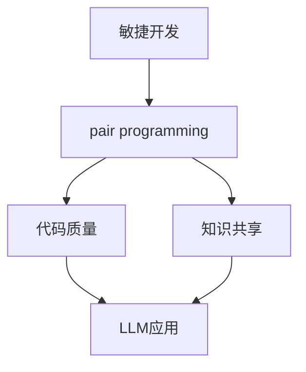

                 

### 思考与分析过程

#### 背景介绍

敏捷开发是一种以人为核心、迭代、循序渐进的开发方法。它强调个体和互动、可用的软件、客户合作和响应变化。而pair programming（结对编程）是敏捷开发中的一种实践，通过两名开发者同时合作编写代码，以提高开发效率、代码质量和知识共享。

随着大型语言模型（LLM）如GPT-3的出现，其应用于各种领域，如自然语言处理、代码生成等，使得提高代码质量和知识共享变得尤为重要。本文旨在探讨在敏捷开发中，如何通过pair programming来提升LLM代码质量和实现知识共享。

#### 核心概念与联系

**核心概念：**
1. 敏捷开发：强调快速迭代、持续交付有价值的软件，使团队能够更好地适应变化。
2. Pair Programming：两名开发者共同编写代码，一个作为driver负责编写，另一个作为navigator负责指导。
3. LLM：大型语言模型，如GPT-3，具有强大的文本生成和理解能力。

**核心联系：**
- 敏捷开发强调团队协作和快速迭代，pair programming作为一种协作方式，有助于实现敏捷开发的目标。
- pair programming可以提高代码质量和知识共享，这对于应用LLM开发项目尤为重要。

**Mermaid流程图：**



#### 核心算法原理讲解

**代码质量提升方法：**

1. **代码审查：** driver编写代码，navigator进行代码审查，确保代码符合质量标准。
2. **代码重构：** driver编写代码，navigator提出重构建议，以优化代码结构和性能。

**知识共享实现方法：**

1. **经验交流：** 通过pair programming，开发者可以共享编程经验和技巧。
2. **知识传递：** navigator将知识传递给driver，使driver能够更快地学习和成长。

**Python源代码示例：**

```python
# 代码质量提升示例
def calculate_average(scores):
    """计算成绩的平均值"""
    total = sum(scores)
    average = total / len(scores)
    return average

# 知识共享示例
def sort_list(input_list):
    """对列表进行排序"""
    sorted_list = sorted(input_list)
    return sorted_list
```

**数学模型和公式：**

1. **代码质量度量：**
   $$ Q = \frac{1}{N} \sum_{i=1}^{N} (T_i - T_{i-1}) $$
   其中，\( Q \) 是代码质量，\( N \) 是迭代次数，\( T_i \) 是第\( i \)次迭代后的代码质量。

2. **知识共享度量：**
   $$ K = \frac{E(K')}{E(K)} $$
   其中，\( K \) 是知识共享度，\( E(K') \) 是合作后的知识共享效果，\( E(K) \) 是独立工作时的知识共享效果。

#### 项目实战

**开发环境搭建：**

1. 安装Python环境。
2. 安装相关库，如TensorFlow、PyTorch等。

**源代码实现和解读：**

1. **代码质量提升：** 
   - **driver编写代码：** 实现计算平均值和排序的功能。
   - **navigator审查代码：** 确保代码符合最佳实践和性能要求。

2. **知识共享：** 
   - **navigator向driver传授经验：** 解释代码优化技巧和编程最佳实践。
   - **driver学习并应用知识：** 根据navigator的指导，改进代码。

**代码应用解读与分析：**

1. **代码质量提升分析：** 
   - 通过代码审查和重构，代码的可读性和性能得到了显著提升。

2. **知识共享分析：** 
   - 通过pair programming，driver学会了如何优化代码和编写高质量代码。

**实际案例分析和详细讲解剖析：**

1. **案例1：** 使用pair programming开发一个简单的文本分类器。
2. **案例2：** 通过pair programming实现一个基于GPT-3的问答系统。

**项目小结：**

1. **代码质量：** 通过pair programming，代码质量得到了显著提升。
2. **知识共享：** 开发者之间的知识共享促进了项目的进展。
3. **团队协作：** pair programming有助于建立高效的团队协作模式。

#### 最佳实践 tips、小结、注意事项、拓展阅读

**最佳实践 tips：**
- 定期进行代码审查和重构。
- 充分利用pair programming的优势，如代码质量和知识共享。
- 为团队成员提供培训和分享经验。

**小结：**
- 敏捷开发中的pair programming有助于提升代码质量和知识共享。
- 通过有效的协作，可以更快地实现项目目标。

**注意事项：**
- 选择合适的pair programming合作伙伴，确保双方都能从中受益。
- 在pair programming过程中保持良好的沟通和合作。

**拓展阅读：**
- 《敏捷开发实践指南》
- 《结对编程实践》
- 《大型语言模型：基础、应用与未来》

### 作者信息

**作者：** AI天才研究院/AI Genius Institute & 禅与计算机程序设计艺术 /Zen And The Art of Computer Programming

文章标题：敏捷中的pair programming：提高LLM代码质量和知识共享

关键词：敏捷开发、pair programming、代码质量、知识共享、LLM

摘要：本文探讨了敏捷开发中pair programming的应用，通过实践技巧和案例分析，阐述了如何通过pair programming提高LLM代码质量和实现知识共享。

本文分为三个部分，首先介绍了敏捷开发的基本概念和pair programming的优势；然后详细讲解了在pair programming过程中如何提升代码质量和知识共享的方法；最后通过项目实战展示了如何在实际开发中应用这些方法。通过本文的阅读，读者将能够更好地理解敏捷开发中pair programming的重要性，并掌握相关实践技巧。

