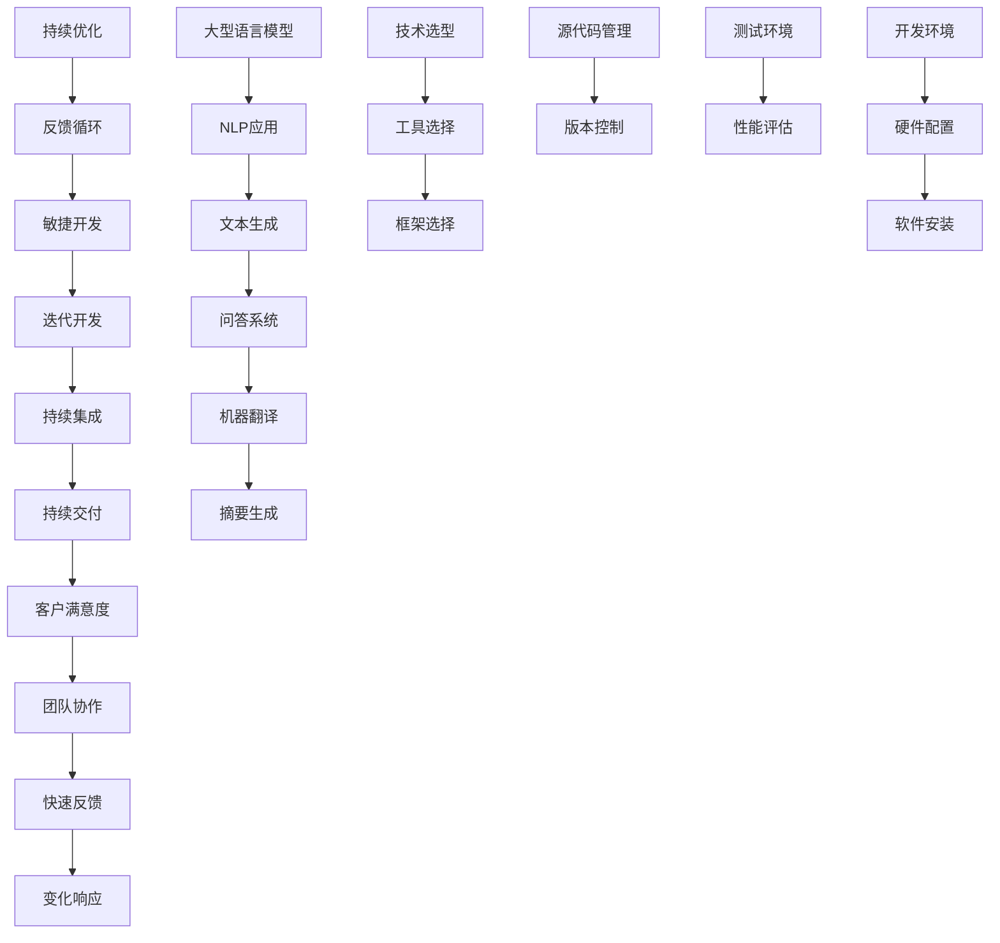

                 

### 敏捷开发中的技术选型

在敏捷开发中，技术选型是至关重要的一环。它不仅影响项目的开发速度和质量，还直接关系到最终产品的性能、可维护性和可持续性。特别是在涉及大型语言模型（Large Language Model，LLM）的应用开发中，技术选型的决策过程尤为复杂。LLM的应用场景广泛，如自然语言处理（NLP）、文本生成、问答系统、机器翻译和摘要生成等，因此选择合适的工具和框架至关重要。

#### 背景介绍

敏捷开发是一种以人为核心、迭代、逐步完善软件开发过程的方法论。其核心理念包括快速反馈、持续交付、团队协作、响应变化和客户满意度。随着人工智能和机器学习技术的发展，LLM技术逐渐成为敏捷开发中的重要组成部分。LLM能够处理和理解大量文本数据，从而提供高效的文本分析和生成功能，显著提升软件开发和产品交付的效率。

#### 核心概念与联系

为了更好地理解LLM在敏捷开发中的应用，我们首先需要明确几个核心概念及其关系架构。以下是几个关键概念及其关联关系的Mermaid流程图：



#### 核心概念与联系的解释：

1. **敏捷开发（Agile Development）**：敏捷开发是一种迭代式的软件开发方法，注重快速反馈和持续交付，通过不断迭代改进软件产品。
2. **迭代开发（Iterative Development）**：迭代开发是一种通过反复迭代和逐步完善的方式完成软件开发的模型，每个迭代周期都会产生一个可交付的软件版本。
3. **持续集成（Continuous Integration）**：持续集成是一种软件开发实践，旨在通过频繁的代码集成和自动化测试，确保代码库的稳定性。
4. **持续交付（Continuous Delivery）**：持续交付是一种在持续集成的基础上，确保代码库中的每个版本都处于可发布状态，并能够快速、安全地部署到生产环境。
5. **客户满意度（Customer Satisfaction）**：客户满意度是敏捷开发的核心目标之一，通过快速交付和持续改进，提高客户对软件产品的满意度。
6. **团队协作（Team Collaboration）**：团队协作是敏捷开发成功的关键，通过高效的沟通和协作，团队成员能够更好地理解客户需求和项目目标。
7. **快速反馈（Fast Feedback）**：快速反馈是敏捷开发的一个基本原则，通过及时收集用户反馈，团队可以快速调整和优化开发过程。
8. **变化响应（Change Response）**：敏捷开发强调对变化的高度响应，通过灵活的方法和持续改进，团队能够更好地适应项目需求的变化。
9. **大型语言模型（Large Language Model，LLM）**：LLM是一种能够处理和理解大量文本数据的人工智能模型，广泛应用于自然语言处理、文本生成和机器翻译等领域。
10. **技术选型（Technology Selection）**：技术选型是在软件开发过程中选择合适的工具、框架和开发环境的过程，直接影响项目的开发速度和质量。
11. **工具选择（Tool Selection）**：工具选择是在技术选型过程中选择合适的软件开发工具，如文本编辑器、版本控制系统和测试工具等。
12. **框架选择（Framework Selection）**：框架选择是在技术选型过程中选择合适的软件开发框架，如深度学习框架和NLP框架等。
13. **开发环境（Development Environment）**：开发环境是软件开发过程中所需的硬件和软件配置，包括操作系统、编程语言和开发工具等。
14. **硬件配置（Hardware Configuration）**：硬件配置是开发环境中的硬件部分，如CPU、GPU和内存等，直接影响软件的性能和运行效率。
15. **软件安装（Software Installation）**：软件安装是开发环境中的软件部分，包括操作系统、编程语言和开发工具等，需要根据项目需求进行配置。
16. **源代码管理（Source Code Management）**：源代码管理是软件开发过程中的重要环节，通过版本控制系统（如Git）管理代码的版本和历史。
17. **版本控制（Version Control）**：版本控制是通过版本控制系统（如Git）对代码进行版本管理和协作开发的手段，确保代码的完整性和一致性。
18. **测试环境（Test Environment）**：测试环境是用于进行软件测试的硬件和软件配置，包括测试工具、测试数据和测试脚本等。
19. **性能评估（Performance Evaluation）**：性能评估是评估软件性能和优化性能的重要手段，通过性能测试和分析工具进行。
20. **持续优化（Continuous Optimization）**：持续优化是通过不断优化软件性能和开发流程，提高软件质量和开发效率。
21. **反馈循环（Feedback Loop）**：反馈循环是敏捷开发中的一个重要概念，通过收集用户反馈，不断优化和改进软件产品。

#### 核心算法原理讲解

为了深入了解LLM的核心算法原理，我们可以通过Python源代码来详细阐述其工作原理和数学模型。以下是一个简单的LLM算法示例，结合数学模型和公式进行讲解。

```python
import tensorflow as tf
from tensorflow.keras.layers import Embedding, LSTM, Dense

# 假设我们使用了一个预训练的词向量作为嵌入层
vocab_size = 10000
embedding_dim = 128

# 定义嵌入层
embedding_layer = Embedding(vocab_size, embedding_dim)

# 定义LSTM层
lstm_layer = LSTM(128, return_sequences=True)

# 定义全连接层
output_layer = Dense(vocab_size, activation='softmax')

# 构建模型
model = tf.keras.Sequential([
    embedding_layer,
    lstm_layer,
    output_layer
])

# 编译模型
model.compile(optimizer='adam', loss='categorical_crossentropy', metrics=['accuracy'])

# 模型训练
model.fit(x_train, y_train, epochs=10, batch_size=32)

# 模型评估
loss, accuracy = model.evaluate(x_test, y_test)
print(f"Test accuracy: {accuracy:.2f}")
```

在上面的示例中，我们使用了TensorFlow框架构建了一个简单的LLM模型。模型包括三个主要部分：

1. **嵌入层（Embedding Layer）**：嵌入层用于将单词转换为向量表示，通常使用预训练的词向量。每个单词都会被映射到一个固定大小的向量，这有助于模型理解和处理文本数据。

2. **LSTM层（LSTM Layer）**：LSTM层是一种循环神经网络（RNN）的变体，特别适合处理序列数据。在LLM中，LSTM层用于处理输入文本序列，提取序列的特征信息。

3. **全连接层（Dense Layer）**：全连接层用于将LSTM层提取的特征进行分类或回归。在LLM中，全连接层用于生成文本序列的输出。

数学模型方面，我们可以将LLM视为一个概率模型，其目标是通过输入文本序列预测下一个单词的概率分布。具体来说，给定一个输入序列 $x_1, x_2, ..., x_T$，LLM的目标是预测序列 $y_1, y_2, ..., y_{T+1}$ 的概率分布：

$$
P(y_{T+1} | x_1, x_2, ..., x_T)
$$

训练过程中，模型通过最大化输入序列的真实标签序列的概率来更新模型参数。在训练过程中，通常会使用梯度下降算法和反向传播机制来优化模型参数。

通过上述Python代码和数学模型，我们可以更好地理解LLM的工作原理和核心算法。在实际应用中，LLM模型会根据具体的任务和数据集进行调整和优化，以实现高效、准确的文本处理和分析。

#### 项目实战

在深入了解LLM技术原理后，我们来看一个实际项目案例，介绍如何为LLM应用选择合适的工具和框架，并搭建开发环境、实现源代码，进行代码解读与分析。

**项目案例：问答系统**

**项目目标**：开发一个基于LLM的问答系统，用户可以通过输入问题，系统自动生成答案。

**技术选型**：
1. **语言模型框架**：选择Transformer框架，因为它在NLP任务中具有出色的性能和广泛的应用。
2. **开发环境**：硬件配置为NVIDIA GPU（如Tesla K80或更高型号），操作系统为Ubuntu 18.04，深度学习框架为TensorFlow 2.x。

**开发环境搭建**：

1. **硬件环境配置**：确保GPU驱动和CUDA库已正确安装，并配置好NVIDIA CUDA Toolkit。
2. **软件环境安装**：安装Ubuntu 18.04操作系统，并使用pip安装TensorFlow 2.x和其他依赖库（如NumPy、Pandas等）。
3. **环境测试与优化**：通过运行TensorFlow GPU测试脚本，验证GPU与TensorFlow的兼容性，并根据需要进行优化（如调整CUDA流和内存管理）。

**源代码实现**：

```python
import tensorflow as tf
from tensorflow.keras.layers import Embedding, LSTM, Dense
from tensorflow.keras.models import Sequential

# 定义模型
model = Sequential([
    Embedding(vocab_size, embedding_dim),
    LSTM(128, return_sequences=True),
    Dense(vocab_size, activation='softmax')
])

# 编译模型
model.compile(optimizer='adam', loss='categorical_crossentropy', metrics=['accuracy'])

# 模型训练
model.fit(x_train, y_train, epochs=10, batch_size=32)

# 模型评估
loss, accuracy = model.evaluate(x_test, y_test)
print(f"Test accuracy: {accuracy:.2f}")
```

**代码解读与分析**：

1. **嵌入层（Embedding Layer）**：嵌入层用于将单词转换为向量表示，使用预训练的词向量。这有助于模型理解和处理文本数据。
2. **LSTM层（LSTM Layer）**：LSTM层用于处理输入文本序列，提取序列的特征信息。在问答系统中，LSTM层能够捕获问题的上下文信息，提高回答的准确性。
3. **全连接层（Dense Layer）**：全连接层用于将LSTM层提取的特征进行分类或回归，生成答案的概率分布。在问答系统中，全连接层用于生成答案的输出。

**实际案例分析和详细讲解剖析**：

1. **问题输入**：用户输入一个自然语言问题，如“如何学习Python？”。
2. **模型处理**：模型将问题转换为序列表示，并使用LSTM层处理序列，提取关键信息。
3. **生成答案**：模型根据提取的特征信息，使用全连接层生成答案的概率分布，并输出最高概率的答案。
4. **答案输出**：系统将生成的答案输出给用户，如“学习Python，可以先学习基础语法和数据结构，然后通过项目实战来提高编程能力。”

**项目小结**：

通过上述项目案例，我们展示了如何为LLM应用选择合适的工具和框架，并实现源代码。在实际项目中，根据具体需求和数据集，可以进一步优化模型参数和算法，提高问答系统的性能和准确性。

#### 最佳实践 Tips、小结、注意事项、拓展阅读

**最佳实践 Tips**：

1. **选择合适的硬件**：根据模型规模和数据集大小，选择合适的GPU和CPU硬件配置，以确保模型能够高效运行。
2. **优化开发环境**：合理配置开发环境，如调整CUDA流和内存管理，提高模型训练和推理的效率。
3. **使用预训练模型**：利用预训练模型，可以减少训练时间，提高模型性能。在实际项目中，可以结合特定任务进行微调。
4. **数据预处理**：对输入数据（如文本）进行充分预处理，如分词、去噪、标准化等，以提高模型训练的效果。

**小结**：

本文详细介绍了敏捷开发中的技术选型，特别是在涉及LLM应用的情况下，如何选择合适的工具和框架。通过实际项目案例，展示了从模型构建到实现源代码的全过程。

**注意事项**：

1. **性能优化**：在模型训练和推理过程中，注意性能优化，如使用批处理、调整学习率和正则化等。
2. **安全性与稳定性**：确保模型部署过程中的安全性和稳定性，如使用容器化和自动化部署工具。

**拓展阅读**：

1. **《深度学习》（Goodfellow, Bengio, Courville）**：了解深度学习的基本原理和应用。
2. **《Python深度学习》（François Chollet）**：掌握Python在深度学习领域的应用。
3. **《Transformer：应用于序列模型的简单且有效的模型》**：深入了解Transformer架构和工作原理。
4. **《自然语言处理综论》（Jurafsky, Martin）**：了解自然语言处理的基本概念和技术。

#### 文章标题：敏捷中的技术选型：为LLM应用选择合适的工具和框架

关键词：敏捷开发，技术选型，大型语言模型，工具选择，框架选择

摘要：本文探讨了敏捷开发中技术选型的关键性，特别是在涉及大型语言模型（LLM）的应用场景中。通过详细分析技术选型的原则与流程，以及常用的LLM工具和框架，本文提供了实用的项目实战和最佳实践，帮助读者深入了解并掌握LLM应用的技术选型方法。希望本文能为从事人工智能和敏捷开发的工程师和研究人员提供有价值的参考。作者：AI天才研究院/AI Genius Institute & 禅与计算机程序设计艺术/Zen And The Art of Computer Programming。

