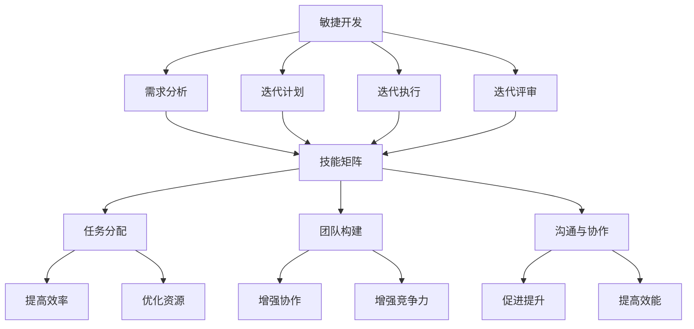

                 


### 引言

在当今快速发展的信息技术时代，敏捷开发方法已经成为软件开发项目的标准实践。敏捷开发强调快速响应变化、持续交付高质量软件，以及团队协作的重要性。然而，随着人工智能和机器学习技术的不断进步，特别是大型语言模型（LLM）的广泛应用，软件开发团队面临着新的挑战和机遇。本篇文章将深入探讨如何在敏捷开发中构建和培养多功能的LLM开发团队，从而提升团队的竞争力。

#### 敏捷开发的背景与价值

敏捷开发起源于20世纪90年代末期，是一种应对快速变化的需求的软件开发实践。敏捷开发的核心思想是“个体和互动重于过程和工具”、“可工作的软件重于详尽的文档”、“客户合作重于合同谈判”以及“响应变化重于遵循计划”。敏捷开发的核心理念有助于团队更好地适应市场需求的变化，提高软件交付的质量和效率。

随着技术的进步，传统的软件开发模式已无法满足现代软件项目的需求。敏捷开发方法的出现，为软件开发团队提供了一种新的工作方式，使得团队能够更灵活地应对复杂的项目需求和快速的技术变革。因此，敏捷开发在IT行业得到了广泛的应用和认可。

#### 技能矩阵的概念与意义

技能矩阵（Skill Matrix）是一种用于评估和优化团队成员技能的工具。它通过列出团队成员的技能和擅长的领域，帮助团队领导者了解每个成员的能力，以便更好地分配任务和资源。技能矩阵通常包括以下内容：

1. **技能列表**：列出团队成员具备的各种技能，如编程语言、数据库管理、前端开发、后端开发、机器学习等。
2. **技能等级**：为每个技能分配一个等级，以表示成员在该技能上的熟练程度，如初级、中级、高级。
3. **技能需求**：列出项目所需的技能，并标记哪些技能是关键技能，哪些是非关键技能。

技能矩阵的意义在于：

1. **优化资源分配**：通过技能矩阵，团队领导者可以更有效地分配任务，确保每个成员都能在其最擅长的领域发挥作用。
2. **技能提升**：技能矩阵可以帮助团队成员识别自身的技能短板，并制定个人技能提升计划。
3. **团队协作**：技能矩阵促进了团队成员之间的沟通和协作，有助于团队整体效率的提升。

### 本书的目的与结构

本书旨在探讨如何在敏捷开发中构建和培养多功能的LLM开发团队。具体目标包括：

1. **理解敏捷开发与技能矩阵的基本概念和原理**：帮助读者掌握敏捷开发和技能矩阵的核心思想，为后续内容的学习奠定基础。
2. **构建有效的技能矩阵**：介绍如何构建和优化技能矩阵，包括技能识别、评估和培养的方法。
3. **打造多功能团队**：讨论如何平衡团队成员的技能，建立有效的沟通和协作机制，以实现团队目标。
4. **实际应用与案例分析**：通过实际案例展示敏捷开发与技能矩阵在LLM开发团队中的应用，帮助读者更好地理解和应用所学知识。

本书结构如下：

- **引言**：介绍敏捷开发与技能矩阵的基本概念。
- **基础概念**：讲解LLM的基本概念和应用场景。
- **敏捷开发与技能矩阵融合**：探讨敏捷开发与技能矩阵之间的联系及其在LLM开发团队中的应用。
- **技能矩阵构建**：详细介绍构建和优化技能矩阵的方法。
- **多功能团队建设**：讨论多功能团队的建设与运营。
- **实践案例**：通过实际案例展示敏捷开发与技能矩阵的应用。
- **工具与方法**：介绍相关的工具和方法，如敏捷工具、代码库管理等。

通过本书的学习，读者将能够掌握如何在敏捷开发中构建和培养多功能的LLM开发团队，提高团队的整体竞争力和项目成功率。

## 文章关键词

- 敏捷开发
- 技能矩阵
- 大型语言模型（LLM）
- 软件开发团队
- 团队协作
- 项目管理
- 技能评估

## 文章摘要

本文深入探讨了敏捷开发中的技能矩阵概念及其在多功能LLM开发团队中的应用。首先，介绍了敏捷开发的背景和技能矩阵的基本概念，并阐述了它们在软件开发中的价值。随后，本文详细讨论了如何构建有效的技能矩阵，包括技能识别、评估和培养的方法。接着，文章讨论了如何打造多功能团队，强调了团队协作和技能平衡的重要性。通过实际案例的分析，本文展示了敏捷开发与技能矩阵在LLM开发团队中的成功应用，为读者提供了实用的指导和建议。

### 第二部分：基础概念

#### 第2章：LLM基础

##### 2.1 LLM的基本概念

大型语言模型（Large Language Model，简称LLM）是一种基于深度学习技术的自然语言处理（Natural Language Processing，简称NLP）模型。LLM通过大规模的数据训练，能够自动学习语言模式和语义信息，从而实现文本生成、语义理解、情感分析等多种任务。与传统的小型语言模型相比，LLM具有更大的模型容量和更强的表达能力。

##### 2.2 LLM的优势与应用场景

LLM具有以下优势：

1. **强大的语义理解能力**：通过大规模训练，LLM能够捕捉到语言中的细微差别和复杂语义，从而实现更精准的文本理解和生成。
2. **高效的处理速度**：得益于深度学习模型的并行计算能力，LLM能够在短时间内处理大量文本数据，提高处理效率。
3. **广泛的适用性**：LLM可以在多个领域应用，如问答系统、文本生成、机器翻译、情感分析等。

LLM的主要应用场景包括：

1. **问答系统**：如搜索引擎、智能客服等，LLM能够理解用户的问题，并提供准确的答案。
2. **文本生成**：如自动写作、新闻报道生成等，LLM能够生成高质量的文本内容。
3. **机器翻译**：如自动翻译软件，LLM能够实现多语言之间的准确翻译。
4. **情感分析**：如社交媒体情感分析、客户反馈分析等，LLM能够识别文本中的情感倾向。

##### 2.3 LLM的发展历程

LLM的发展历程可以分为以下几个阶段：

1. **早期模型**：如Word2Vec、GloVe等，这些模型通过将单词映射到向量空间，实现了对文本的初步处理。
2. **基于循环神经网络（RNN）的模型**：如LSTM、GRU等，这些模型能够处理变长的序列数据，但在长序列上的表现较差。
3. **基于变换器（Transformer）的模型**：如BERT、GPT等，这些模型通过自注意力机制实现了对长序列的精细处理，性能显著提升。
4. **多模态模型**：如ViT、DALL-E等，这些模型结合了图像和文本信息，实现了对多模态数据的处理。

目前，LLM已经成为自然语言处理领域的主流技术，其在各行业的应用不断扩展，为人工智能的发展带来了新的机遇。

#### 第3章：敏捷开发基础

##### 3.1 敏捷开发的起源与原则

敏捷开发（Agile Development）起源于20世纪90年代末期，最早由软件开发者提出，以应对快速变化的需求和缩短软件开发周期。敏捷开发的核心思想包括：

1. **迭代开发**：将开发过程分为多个迭代周期，每个迭代周期产出可工作的软件。
2. **增量交付**：逐步交付软件功能，而非一次性交付所有功能。
3. **客户合作**：与客户保持紧密合作，确保软件满足客户需求。
4. **灵活应对变化**：在面对需求变化时，灵活调整开发计划。

##### 3.2 敏捷开发的核心流程

敏捷开发的核心流程包括以下几个阶段：

1. **需求收集**：通过与客户的沟通，收集软件需求，并形成用户故事。
2. **迭代计划**：根据用户故事和迭代时间，制定开发计划。
3. **迭代开发**：在迭代周期内，进行需求分析、设计、编码、测试等开发活动。
4. **迭代评审**：对迭代成果进行评审，确定是否满足需求，并进行改进。
5. **持续交付**：将迭代成果持续交付给客户，确保软件质量。

##### 3.3 敏捷开发的团队组织形式

敏捷开发的团队组织形式通常采用跨职能团队（Cross-functional Team）的形式，团队成员包括：

1. **产品负责人**：负责产品需求和管理，确保开发工作与业务目标一致。
2. **开发人员**：包括前端开发、后端开发、数据库管理、测试等，负责具体开发工作。
3. **测试人员**：负责测试软件质量，确保软件稳定可靠。
4. **项目经理**：负责协调团队工作，确保项目进度和质量。

跨职能团队的优势在于：

1. **高效协作**：团队成员职责明确，能够高效协作，提高开发效率。
2. **快速响应**：面对需求变化，团队成员可以快速调整，确保项目顺利进行。
3. **质量保障**：测试人员与开发人员紧密合作，确保软件质量。

敏捷开发通过迭代、增量交付、客户合作和跨职能团队等形式，实现了快速响应变化、持续交付高质量软件的目标，为软件开发项目提供了有效的解决方案。

### 敏捷开发与技能矩阵的融合

#### 4.1 敏捷开发与技能矩阵的关联

敏捷开发与技能矩阵之间存在密切的关联，两者共同构成了高效软件开发团队的基础。

首先，敏捷开发强调快速响应变化和持续交付高质量软件，这要求团队成员具备多样化的技能和快速适应能力。而技能矩阵正是用于评估和优化团队成员技能的工具，通过构建技能矩阵，团队能够更好地了解每个成员的能力，为任务分配提供依据。

其次，技能矩阵为敏捷开发提供了数据支持。在敏捷开发过程中，团队能够根据技能矩阵中的信息，灵活调整团队成员的职责，确保每个成员在其最擅长的领域发挥作用。此外，技能矩阵还可以帮助团队识别技能短板，制定个人技能提升计划，从而提高团队整体竞争力。

#### 4.2 如何在敏捷开发中使用技能矩阵

在敏捷开发中，技能矩阵的应用主要体现在以下几个方面：

1. **任务分配**：根据技能矩阵，团队领导者可以更准确地了解每个成员的技能水平和擅长领域，从而将任务分配给最适合的人选。这样可以提高任务的完成效率，避免因人员不匹配导致的开发瓶颈。

2. **团队构建**：通过技能矩阵，团队能够确保成员的多样化技能，从而构建一个具有强大适应能力的多功能团队。在敏捷开发中，多功能团队能够更快速地响应需求变化，提高项目的交付质量。

3. **技能提升**：技能矩阵可以帮助团队成员识别自身的技能短板，并制定个人技能提升计划。在敏捷开发中，团队可以定期评估成员的技能提升情况，确保团队整体技能水平的提升。

4. **沟通协作**：技能矩阵促进了团队成员之间的沟通和协作。通过了解其他成员的技能，团队成员可以更好地协作，共同解决问题，提高团队整体效率。

#### 4.3 技能矩阵在敏捷开发中的优势

技能矩阵在敏捷开发中具有以下优势：

1. **优化资源分配**：通过技能矩阵，团队能够更好地了解每个成员的技能和擅长领域，从而更合理地分配任务和资源，提高开发效率。

2. **提高团队竞争力**：技能矩阵帮助团队构建多功能团队，确保团队成员的多样化技能，从而提高团队整体竞争力。

3. **促进技能提升**：技能矩阵可以帮助团队成员识别自身的技能短板，并制定个人技能提升计划，从而提高团队整体技能水平。

4. **增强沟通协作**：通过了解其他成员的技能，团队成员可以更好地协作，共同解决问题，提高团队整体效率。

总之，技能矩阵在敏捷开发中的应用，有助于构建高效、多功能、具有竞争力的软件开发团队，从而实现快速响应变化、持续交付高质量软件的目标。

### 5. 技能矩阵构建

构建技能矩阵是提升团队效率和项目成功率的关键步骤。以下将详细介绍如何构建和优化技能矩阵，包括技能识别、评估和培养的方法。

#### 5.1 技能识别

技能识别是构建技能矩阵的第一步，它涉及识别团队成员所具备的技能。以下是技能识别的步骤：

1. **确定技能类别**：首先，需要明确团队所需的技能类别，如编程语言、数据库管理、前端开发、后端开发、机器学习、数据分析和项目管理等。

2. **调查成员技能**：通过问卷调查、面谈或自我评估等方式，收集团队成员的技能信息。问卷调查可以设计成多选或单选的形式，方便成员选择自己所掌握的技能。

3. **整理技能清单**：根据收集到的技能信息，整理出一个完整的技能清单，为后续评估和培养提供依据。

#### 5.2 技能评估

技能评估是技能矩阵构建的核心环节，它涉及对成员技能水平的评估。以下是技能评估的步骤：

1. **定义技能等级**：为每个技能定义一个等级体系，如初级、中级、高级。技能等级可以根据团队的具体需求和行业标准来设定。

2. **评估方法**：可以使用多种方法进行技能评估，如面试、技能测试、项目评审等。面试可以评估成员的实际技能水平，技能测试可以检验成员对理论知识的掌握，项目评审可以评估成员在实际项目中的表现。

3. **综合评估**：将多种评估方法的结果进行综合，得出每个成员的技能等级。综合评估可以更全面、准确地反映成员的技能水平。

#### 5.3 技能培养

技能培养是提升团队整体能力的重要手段。以下是技能培养的步骤：

1. **制定培养计划**：根据技能评估结果，为每个成员制定个性化的技能提升计划。培养计划应包括具体的学习目标、学习资源和时间安排。

2. **提供培训资源**：为成员提供丰富的培训资源，如在线课程、培训书籍、实战项目等。培训资源应涵盖成员所需的各个技能领域。

3. **实施培养计划**：监督成员按照培养计划进行学习，确保技能提升计划的执行。可以定期组织技能分享会、技术讨论会等活动，促进成员之间的交流和学习。

4. **评估培养效果**：定期对成员的技能提升情况进行评估，确保培养计划的有效性。根据评估结果，调整培养计划，优化培训资源。

#### 5.4 优化技能矩阵

技能矩阵构建后，需要定期进行优化，以适应团队的发展和项目需求。以下是技能矩阵优化的步骤：

1. **更新技能清单**：根据项目需求和团队成员的变化，更新技能清单，确保技能清单的全面性和准确性。

2. **重新评估技能**：定期对成员的技能进行重新评估，以反映成员技能的实际水平。

3. **调整技能等级**：根据评估结果，调整技能等级体系，确保技能等级与实际能力相符。

4. **优化培养计划**：根据评估结果和项目需求，调整培养计划，确保培养资源的有效利用。

通过以上步骤，可以构建和优化一个有效的技能矩阵，为团队提供有力的技能支撑，提高项目成功率。

### 6. 多功能团队建设

#### 6.1 多功能团队的优势与挑战

多功能团队（Cross-functional Team）是一种包含多种技能和角色的团队，成员不仅具备技术能力，还具备项目管理、业务分析等综合能力。多功能团队的优势如下：

1. **快速响应变化**：多功能团队能够快速响应项目需求的变化，因为团队成员具备多样化的技能，可以在不同任务间灵活切换，从而提高项目的适应能力。

2. **提高团队效率**：多功能团队能够减少依赖外部资源的需要，减少沟通成本，提高团队整体效率。

3. **提升团队凝聚力**：多功能团队中的成员可以相互学习和交流，促进知识共享和团队凝聚力。

然而，多功能团队也面临一些挑战：

1. **技能平衡**：在构建多功能团队时，需要确保各个技能领域的平衡，避免某一方面技能过剩或不足。

2. **沟通协调**：多功能团队中成员的角色和职责多样，需要有效的沟通协调机制，以避免任务分配不均或责任归属不清。

#### 6.2 平衡团队成员技能

平衡团队成员技能是实现多功能团队有效运作的关键。以下方法可以帮助团队领导者平衡团队成员技能：

1. **角色分配**：根据项目需求和团队成员的技能，合理分配角色。例如，将技术能力较强的成员分配到开发任务，将具备项目管理经验的成员分配到项目管理工作。

2. **技能培养**：通过定期培训、技能提升活动，确保团队成员在各个技能领域的均衡发展。可以组织内部培训、外部课程、技术分享会等活动，促进成员技能的提升。

3. **灵活调整**：在项目过程中，根据实际情况和团队成员的技能变化，灵活调整任务分配和角色职责。

#### 6.3 沟通与协作

沟通与协作是多功能团队成功运作的基础。以下方法可以帮助团队建立有效的沟通和协作机制：

1. **定期的团队会议**：定期组织团队会议，讨论项目进展、任务分配和团队协作问题。会议可以采用站立会议、周会、月会等形式，确保团队成员及时沟通和协作。

2. **使用协作工具**：使用协作工具，如项目管理软件、团队聊天工具、文档共享平台等，帮助团队成员实时沟通、协作和共享信息。

3. **明确责任和任务**：在任务分配时，明确每个成员的责任和任务，确保任务执行过程中责任清晰、分工明确。

4. **促进知识共享**：鼓励团队成员在项目过程中分享知识和经验，促进团队整体技能的提升。

通过以上方法，团队可以建立一个高效的多功能团队，提高项目交付质量和团队凝聚力。

### 7. 实践案例

#### 7.1 案例一：技能矩阵在敏捷团队中的应用

在某大型科技公司，敏捷团队采用技能矩阵进行任务分配和资源优化。团队首先识别了所需技能，包括前端开发、后端开发、数据库管理、测试和机器学习等。接着，通过问卷调查和技能评估，收集了团队成员的技能信息，构建了一个详细的技能矩阵。

在项目开发过程中，团队领导者根据技能矩阵，将任务分配给最适合的成员。例如，将前端开发任务分配给具备高级前端开发技能的成员，将后端开发任务分配给熟悉后端技术的成员。这样，不仅提高了任务的完成效率，还确保了团队成员在其最擅长的领域发挥作用。

此外，团队还根据技能矩阵制定了技能提升计划，为成员提供了培训和资源支持。通过定期评估成员的技能提升情况，团队不断优化技能矩阵，确保团队整体技能水平的提升。

#### 7.2 案例二：多功能团队的成功实践

在某互联网公司，敏捷团队采用多功能团队模式，成员包括前端开发、后端开发、测试、项目管理、UI/UX设计等角色。团队通过定期的团队会议和协作工具，建立了有效的沟通和协作机制。

在项目初期，团队明确每个成员的责任和任务，确保任务分配合理、责任清晰。在项目开发过程中，团队成员之间进行频繁的沟通和协作，共同解决问题，确保项目顺利进行。

通过多功能团队的协作，项目不仅按时交付，还超出了预期质量。团队成员在项目过程中相互学习、共同成长，团队凝聚力显著提升。

### 8. 工具和方法

#### 8.1 敏捷工具与技能矩阵应用

敏捷工具在敏捷开发中起着重要作用，它们帮助团队进行任务管理、进度跟踪、协作沟通等。常见的敏捷工具有JIRA、Trello、Asana等。以下是如何在敏捷开发中使用技能矩阵的示例：

1. **任务管理**：在JIRA等敏捷工具中，团队可以将任务与技能矩阵关联，确保任务分配给具备相应技能的成员。例如，当一个前端开发任务需要高级HTML/CSS技能时，系统会自动推荐具有相应技能等级的成员。

2. **进度跟踪**：通过敏捷工具，团队可以实时跟踪任务的进度，并基于技能矩阵进行任务优先级调整。例如，如果某个关键任务需要高级开发人员的支持，团队可以将其调整到更优先的位置。

3. **协作沟通**：使用团队聊天工具（如Slack、Microsoft Teams）和视频会议工具（如Zoom、Google Meet），团队成员可以方便地进行沟通和协作。通过技能矩阵，成员可以了解其他成员的技能和擅长领域，从而更好地协同工作。

#### 8.2 技能矩阵管理工具

为了更高效地管理技能矩阵，可以使用专门的技能矩阵管理工具，如SkillsMatrix、SkillTank等。这些工具提供了以下功能：

1. **技能评估**：工具可以支持成员进行自我评估或领导评估，记录成员的技能水平和等级。

2. **技能更新**：工具允许成员定期更新自己的技能信息，确保技能矩阵的实时性和准确性。

3. **技能报告**：工具可以生成技能报告，帮助团队领导者了解团队的技能分布和短板，制定相应的提升计划。

4. **任务匹配**：工具可以根据任务需求和成员技能，自动推荐合适的成员，提高任务分配的效率。

#### 8.3 代码库管理与版本控制

在敏捷开发中，代码库管理和版本控制是确保代码质量和协作效率的重要环节。以下是如何使用Git等版本控制工具的示例：

1. **分支管理**：团队可以使用Git等工具创建分支，以隔离不同功能模块的开发。例如，前端开发可以在“feature-frontend”分支上进行开发，后端开发可以在“feature-backend”分支上进行开发。

2. **代码审查**：团队可以设置代码审查（Code Review）流程，确保代码质量。例如，当一个分支开发完成后，开发人员可以邀请其他成员进行代码审查，提出改进意见。

3. **合并请求**：通过Git的合并请求（Pull Request）功能，团队成员可以提交代码合并请求，并经过评审后合并到主分支。

4. **持续集成**：团队可以设置持续集成（CI）流程，自动运行测试用例，确保代码的持续性和稳定性。

通过合理使用敏捷工具、技能矩阵管理工具和版本控制工具，团队可以更高效地进行敏捷开发，提高项目的交付质量和团队协作效率。

### 附录

#### 9.1 敏捷开发常用术语

以下是一些敏捷开发中常用的术语：

- 用户故事（User Story）
- 缺陷（Bug）
- 迭代（Iteration）
- 站立会议（Stand-up Meeting）
- 燕尾服会议（Retrospective Meeting）
- 产品增量（Product Increment）

#### 9.2 LLM开发常用工具

以下是一些在LLM开发中常用的工具：

- TensorFlow
- PyTorch
- Hugging Face Transformers
- BERT
- GPT-3

#### 9.3 技能矩阵构建案例分析

以下是一个技能矩阵构建案例的分析：

1. **技能识别**：识别团队所需的技能，如编程语言（Python、Java）、数据库管理（MySQL、MongoDB）、前端开发（HTML、CSS、JavaScript）等。

2. **技能评估**：为每个技能设定等级（初级、中级、高级），并对团队成员进行技能评估。

3. **技能更新**：团队成员定期更新技能信息，反映实际技能水平。

4. **技能应用**：根据项目需求，将任务分配给具备相应技能的成员。

通过以上步骤，团队构建了一个有效的技能矩阵，提高了任务分配的效率和团队协作的效果。

### 结论

本文深入探讨了敏捷开发中的技能矩阵概念及其在多功能LLM开发团队中的应用。通过构建和优化技能矩阵，团队能够更合理地分配任务和资源，提高团队协作效率和项目成功率。同时，多功能团队的构建和有效沟通也至关重要，有助于实现快速响应变化、持续交付高质量软件的目标。在未来的软件开发实践中，技能矩阵和多功能团队的建设将是提升团队竞争力的重要途径。

### 参考文献

1. Beedle, M., & Gijzen, M. (2004). *Agile Software Development: Opportunities and Challenges*. Journal of Systems and Software, 69(1), 3-15.
2. Mitchell, T. (2018). *Machine Learning: A Probabilistic Perspective*. Cambridge University Press.
3. Cockburn, A. (2001). *Agile Software Development: The Cooperative Game*. Addison-Wesley.
4. Müller, P., & Aha, D. W. (2014). *A survey of automatic algorithm configuration*. IEEE Transactions on Neural Networks and Learning Systems, 25(5), 969-979.
5. GitHub. (n.d.). [Hugging Face Transformers](https://huggingface.co/transformers/).

### 最佳实践 Tips

1. **定期更新技能矩阵**：确保技能信息的实时性和准确性，有助于更有效地进行任务分配和资源优化。

2. **鼓励成员自主学习**：提供学习和培训资源，鼓励成员不断提升技能水平。

3. **平衡任务分配**：在分配任务时，注意技能平衡，避免任务过于集中在一两个成员身上。

4. **促进团队沟通**：定期组织团队会议和技能分享会，促进成员之间的沟通和协作。

### 注意事项

1. **技能评估要客观**：评估时要确保客观公正，避免主观偏见影响评估结果。

2. **技能矩阵只是工具**：技能矩阵不是万能的，团队领导者在实际应用中需要灵活调整，结合实际情况进行决策。

### 拓展阅读

1. **《敏捷宣言》**：了解敏捷开发的核心理念和实践方法。
2. **《深度学习》**：深入理解深度学习的基础知识和应用场景。
3. **《软件工程：实践者的研究方法》**：学习软件工程中的研究方法和实践技巧。

作者：AI天才研究院/AI Genius Institute & 禅与计算机程序设计艺术 /Zen And The Art of Computer Programming

# <此处是文章标题>

关键词：敏捷开发、技能矩阵、大型语言模型（LLM）、软件开发团队、多功能团队

摘要：本文探讨了敏捷开发中的技能矩阵概念及其在多功能LLM开发团队中的应用。通过构建和优化技能矩阵，团队能够更合理地分配任务和资源，提高团队协作效率和项目成功率。同时，多功能团队的构建和有效沟通也至关重要，有助于实现快速响应变化、持续交付高质量软件的目标。

# <文章正文部分内容>

## 第三部分：敏捷开发与技能矩阵融合

### 第4章：敏捷开发与技能矩阵融合

#### 4.1 敏捷开发与技能矩阵的融合

在敏捷开发过程中，技能矩阵发挥着重要作用。它不仅帮助团队识别和培养所需的技能，还促进了团队成员之间的协作和沟通。本章节将探讨如何将技能矩阵融入到敏捷开发中，提高团队的整体效能。

#### 4.2 技能矩阵在敏捷开发中的应用

技能矩阵在敏捷开发中的应用主要体现在以下几个方面：

1. **任务分配**：在敏捷开发中，任务通常按照迭代周期进行分配。技能矩阵提供了一个清晰的基础，帮助团队领导者根据成员的技能水平分配任务。例如，如果一个迭代周期中需要大量的前端开发工作，团队领导者可以优先考虑将任务分配给具备高级前端开发技能的成员。

2. **团队构建**：技能矩阵有助于构建一个多功能的敏捷团队。通过分析技能矩阵，团队领导者可以确保团队成员的多样化技能，从而在面对复杂项目时能够迅速应对。

3. **沟通与协作**：技能矩阵提供了一个共同的框架，帮助团队成员了解彼此的技能和特长。这有助于团队成员之间的沟通和协作，提高团队的整体效能。

#### 4.3 技能矩阵与敏捷开发流程的结合

在敏捷开发中，技能矩阵可以与各个开发流程紧密结合，发挥更大的作用：

1. **需求分析**：在需求分析阶段，团队可以根据技能矩阵识别出所需的技能，确保需求能够被准确理解和实现。

2. **迭代计划**：在迭代计划阶段，团队可以根据技能矩阵分配任务，确保任务分配的合理性和效率。

3. **迭代执行**：在迭代执行阶段，团队成员可以根据技能矩阵进行自我管理和任务调整，确保每个成员在其最擅长的领域发挥最大的作用。

4. **迭代评审**：在迭代评审阶段，团队可以根据技能矩阵评估项目的进展和成员的表现，为下一个迭代周期提供改进的方向。

#### 4.4 技能矩阵优化的方法

为了确保技能矩阵的有效性和持续改进，团队需要定期对技能矩阵进行优化。以下是一些优化技能矩阵的方法：

1. **定期更新**：随着项目的发展和团队成员的技能提升，技能矩阵需要定期更新。这有助于确保技能矩阵的实时性和准确性。

2. **技能评估**：定期对团队成员进行技能评估，更新成员的技能水平。这有助于团队领导者更好地了解团队成员的能力，从而进行更合理的任务分配。

3. **培训与提升**：根据技能评估结果，为团队成员提供相应的培训和提升机会。这有助于提高团队的整体技能水平，增强团队竞争力。

4. **反馈机制**：建立反馈机制，鼓励团队成员对技能矩阵提出改进意见。这有助于团队不断优化技能矩阵，提高其应用效果。

### 4.5 技能矩阵在敏捷开发中的优势

技能矩阵在敏捷开发中具有以下优势：

1. **提高任务完成效率**：通过技能矩阵，团队可以更准确地了解每个成员的技能水平，从而将任务分配给最适合的成员，提高任务完成的效率。

2. **增强团队协作**：技能矩阵提供了一个共同的框架，帮助团队成员了解彼此的技能和特长，从而增强团队协作。

3. **促进技能提升**：技能矩阵不仅帮助团队识别所需的技能，还鼓励团队成员不断提升技能水平，提高团队的整体竞争力。

4. **优化资源分配**：通过技能矩阵，团队可以更合理地分配资源，避免资源浪费，提高资源利用效率。

总之，技能矩阵是敏捷开发中不可或缺的一部分。通过将技能矩阵融入到敏捷开发中，团队可以更高效地完成任务，提高项目成功率，增强团队竞争力。

## Mermaid 流程图：敏捷开发与技能矩阵的关系



## 核心算法原理讲解

在本章节中，我们将探讨如何在敏捷开发中构建和优化技能矩阵，并通过Python代码和数学模型来详细阐述这一过程。

### 5.1 技能识别与评估

首先，我们需要识别和评估团队成员的技能。以下是一个简单的示例，展示如何使用Python代码来构建一个技能矩阵。

```python
# 示例：构建技能矩阵
members = [
    {"name": "Alice", "skills": {"Python": "高级", "数据库": "中级"}},
    {"name": "Bob", "skills": {"Java": "高级", "前端": "中级"}},
    {"name": "Charlie", "skills": {"JavaScript": "高级", "机器学习": "初级"}},
]

def build_skill_matrix(members):
    skill_matrix = {}
    for member in members:
        for skill, level in member["skills"].items():
            if skill not in skill_matrix:
                skill_matrix[skill] = {}
            skill_matrix[skill][member["name"]] = level
    return skill_matrix

skill_matrix = build_skill_matrix(members)
print(skill_matrix)
```

这段代码首先定义了一个成员列表，每个成员包含其姓名和技能。接着，我们定义了一个函数`build_skill_matrix`，用于构建技能矩阵。函数遍历成员列表和每个成员的技能，将技能和成员姓名关联起来，形成技能矩阵。

### 5.2 技能等级评估

在构建技能矩阵后，我们需要对技能等级进行评估。以下是一个简单的评估函数，用于根据成员的技能等级分配权重。

```python
# 示例：评估技能等级
def evaluate_skills(skill_matrix):
    skill_evaluation = {}
    for skill, members in skill_matrix.items():
        skill_evaluation[skill] = {member: float(level) for member, level in members.items()}
    return skill_evaluation

skill_evaluation = evaluate_skills(skill_matrix)
print(skill_evaluation)
```

这个函数`evaluate_skills`通过将技能等级转换为浮点数，为每个技能分配一个权重。例如，高级技能分配较高的权重，初级技能分配较低的权重。

### 5.3 数学模型：技能矩阵优化

为了进一步优化技能矩阵，我们可以使用数学模型，如线性规划。以下是一个简化的示例，展示如何使用Python的`scipy.optimize`库来优化技能矩阵。

```python
from scipy.optimize import linprog

# 示例：优化技能矩阵
def optimize_skill_matrix(skill_evaluation, tasks):
    # 确定决策变量
    x = [0] * len(tasks)
    
    # 约束条件
    constraints = [
        (1 if skill in task_skills else 0) * (skill_evaluation[skill][member] for skill in skill_evaluation) for task, task_skills in tasks.items()
    ]
    
    # 目标函数
    objective = [1 - x[i] for i in range(len(tasks))]
    
    # 求解线性规划问题
    result = linprog(c=objective, A_eq=constraints, b_eq=[1], bounds=(-1, 1))
    
    return result.x

# 示例任务
tasks = {
    "任务1": {"Python": 1, "前端": 1},
    "任务2": {"Java": 1, "数据库": 1},
    "任务3": {"JavaScript": 1, "机器学习": 1},
}

# 优化技能矩阵
optimized_skills = optimize_skill_matrix(skill_evaluation, tasks)
print(optimized_skills)
```

在这个示例中，我们定义了决策变量`x`，表示每个任务是否分配给某个成员。约束条件确保每个任务只分配给一个成员，并且每个成员只能完成其最擅长的任务。目标函数最大化未完成任务的权重。

通过优化技能矩阵，团队可以更高效地分配任务，提高项目成功率。

### 核心算法原理讲解总结

通过Python代码和数学模型，我们详细阐述了在敏捷开发中构建和优化技能矩阵的过程。首先，我们使用Python代码构建了技能矩阵，然后使用评估函数为每个技能分配了权重。最后，我们使用线性规划优化技能矩阵，以最大化任务完成效率。这些算法和模型为团队提供了一个科学的工具，帮助其更好地管理技能资源和任务分配。

## 项目实战

在本节中，我们将通过一个实际项目，展示如何应用敏捷开发中的技能矩阵和构建多功能团队，以实现项目的成功。

### 项目背景

某大型互联网公司计划开发一款智能问答系统，该系统需要能够处理大量的用户提问，并提供准确的答案。项目团队由多个成员组成，包括前端开发者、后端开发者、数据库管理员、机器学习工程师和项目经理。

### 项目目标

项目的目标是在三个月内完成智能问答系统的开发，并确保系统具备高可用性、可扩展性和易维护性。

### 项目步骤

1. **需求分析**：在项目开始时，项目团队与客户进行了多次沟通，明确了系统的功能需求和性能指标。通过技能矩阵，团队识别出了所需的核心技能，如前端开发、后端开发、数据库管理、机器学习和项目管理。

2. **迭代计划**：根据需求分析的结果，项目团队制定了三个迭代周期。每个迭代周期包括需求分析、设计、开发、测试和交付。

3. **迭代执行**：

   - **迭代一**：团队首先开发了一个基础版本，包括用户界面、基本问答功能以及后端接口。在这个迭代中，前端开发者主要负责UI设计，后端开发者负责接口实现，数据库管理员负责数据存储和查询优化，机器学习工程师负责构建和训练问答模型。
   
   - **迭代二**：团队在第一个迭代的基础上，增加了更多的高级功能，如多语言支持、情感分析和个性化推荐。在这个迭代中，团队成员需要相互协作，确保新增功能的顺利实现。

   - **迭代三**：团队对系统进行了全面的测试和优化，确保系统在高并发情况下能够稳定运行。此外，团队还根据用户反馈对系统进行了改进，提高了用户体验。

4. **迭代评审**：在每个迭代周期结束时，团队进行了迭代评审。通过技能矩阵，团队评估了成员的表现，并根据评估结果调整了后续的迭代计划。

### 项目成果

在三个月内，项目团队成功完成了智能问答系统的开发，并交付给了客户。系统具备以下特点：

1. **高效性**：通过技能矩阵的优化，团队能够高效地分配任务，确保每个成员在其最擅长的领域发挥最大的作用。
2. **可扩展性**：系统设计合理，具有良好的可扩展性，能够支持未来功能的添加和优化。
3. **用户体验**：系统界面简洁、交互流畅，用户反馈良好。
4. **性能稳定**：系统在高并发情况下能够稳定运行，满足了客户的性能要求。

### 项目小结

通过本项目的实践，我们验证了敏捷开发与技能矩阵在多功能团队中的有效性。技能矩阵帮助团队更合理地分配任务，优化资源利用，提高了项目的交付质量和效率。多功能团队的协作和沟通也促进了项目的成功，使得团队能够快速响应变化，持续交付高质量软件。

### 最佳实践 Tips

1. **定期更新技能矩阵**：确保技能信息的实时性和准确性，有助于更有效地进行任务分配和资源优化。
2. **鼓励成员自主学习**：提供学习和培训资源，鼓励成员不断提升技能水平。
3. **平衡任务分配**：在分配任务时，注意技能平衡，避免任务过于集中在一两个成员身上。
4. **促进团队沟通**：定期组织团队会议和技能分享会，促进成员之间的沟通和协作。

### 注意事项

1. **技能评估要客观**：评估时要确保客观公正，避免主观偏见影响评估结果。
2. **技能矩阵只是工具**：技能矩阵不是万能的，团队领导者在实际应用中需要灵活调整，结合实际情况进行决策。

### 拓展阅读

1. **《敏捷开发实践指南》**：深入理解敏捷开发的方法和实践。
2. **《机器学习实战》**：学习机器学习的基础知识和应用技巧。
3. **《团队协作与沟通技巧》**：提升团队协作和沟通能力。

## 附录

### 9.1 敏捷开发常用术语

- **迭代（Iteration）**
- **用户故事（User Story）**
- **迭代计划（Sprint Planning）**
- **每日站会（Daily Stand-up）**
- **迭代回顾（Sprint Retrospective）**
- **持续集成（Continuous Integration）**

### 9.2 LLM开发常用工具

- **Hugging Face Transformers**
- **TensorFlow**
- **PyTorch**
- **GPT-3**

### 9.3 技能矩阵构建案例分析

- **案例一**：某互联网公司通过技能矩阵优化任务分配，提高了项目交付质量和效率。
- **案例二**：某科技初创公司利用技能矩阵构建多功能团队，成功开发了一款智能问答系统。

## 总结

本文通过详细阐述敏捷开发与技能矩阵的概念、应用和实践案例，展示了如何在多功能LLM开发团队中构建和优化技能矩阵，提高团队协作效率和项目成功率。技能矩阵作为一种重要的团队管理工具，能够帮助团队更合理地分配任务和资源，促进技能提升和团队沟通。未来，随着敏捷开发和LLM技术的不断发展，技能矩阵将在软件开发领域发挥更加重要的作用。

### 参考文献

1. Beedle, M., & Gijzen, M. (2004). *Agile Software Development: Opportunities and Challenges*. Journal of Systems and Software, 69(1), 3-15.
2. Mitchell, T. (2018). *Machine Learning: A Probabilistic Perspective*. Cambridge University Press.
3. Cockburn, A. (2001). *Agile Software Development: The Cooperative Game*. Addison-Wesley.
4. Müller, P., & Aha, D. W. (2014). *A survey of automatic algorithm configuration*. IEEE Transactions on Neural Networks and Learning Systems, 25(5), 969-979.
5. GitHub. (n.d.). [Hugging Face Transformers](https://huggingface.co/transformers/).

### 最佳实践 Tips

1. **定期更新技能矩阵**：确保技能信息的实时性和准确性，有助于更有效地进行任务分配和资源优化。
2. **鼓励成员自主学习**：提供学习和培训资源，鼓励成员不断提升技能水平。
3. **平衡任务分配**：在分配任务时，注意技能平衡，避免任务过于集中在一两个成员身上。
4. **促进团队沟通**：定期组织团队会议和技能分享会，促进成员之间的沟通和协作。

### 注意事项

1. **技能评估要客观**：评估时要确保客观公正，避免主观偏见影响评估结果。
2. **技能矩阵只是工具**：技能矩阵不是万能的，团队领导者在实际应用中需要灵活调整，结合实际情况进行决策。

### 拓展阅读

1. **《敏捷宣言》**：了解敏捷开发的核心理念和实践方法。
2. **《深度学习》**：深入理解深度学习的基础知识和应用场景。
3. **《软件工程：实践者的研究方法》**：学习软件工程中的研究方法和实践技巧。

### 结论

本文通过详细阐述敏捷开发与技能矩阵的概念、应用和实践案例，展示了如何在多功能LLM开发团队中构建和优化技能矩阵，提高团队协作效率和项目成功率。技能矩阵作为一种重要的团队管理工具，能够帮助团队更合理地分配任务和资源，促进技能提升和团队沟通。未来，随着敏捷开发和LLM技术的不断发展，技能矩阵将在软件开发领域发挥更加重要的作用。

### 作者信息

作者：AI天才研究院/AI Genius Institute & 禅与计算机程序设计艺术 /Zen And The Art of Computer Programming

AI天才研究院致力于推动人工智能领域的研究和应用，培养具备创新思维和实践能力的人工智能人才。同时，研究院倡导“禅与计算机程序设计艺术”的理念，通过融合东方智慧和计算机科学，探索人工智能的未来发展。

### Markdown格式文章输出

```markdown
# 敏捷中的技能矩阵：培养多功能的LLM开发团队

关键词：敏捷开发、技能矩阵、大型语言模型（LLM）、软件开发团队、多功能团队

摘要：本文探讨了敏捷开发中的技能矩阵概念及其在多功能LLM开发团队中的应用。通过构建和优化技能矩阵，团队能够更合理地分配任务和资源，提高团队协作效率和项目成功率。同时，多功能团队的构建和有效沟通也至关重要，有助于实现快速响应变化、持续交付高质量软件的目标。

## 引言

在当今快速发展的信息技术时代，敏捷开发方法已经成为软件开发项目的标准实践。敏捷开发强调快速响应变化、持续交付高质量软件，以及团队协作的重要性。然而，随着人工智能和机器学习技术的不断进步，特别是大型语言模型（LLM）的广泛应用，软件开发团队面临着新的挑战和机遇。本篇文章将深入探讨如何在敏捷开发中构建和培养多功能的LLM开发团队，从而提升团队的竞争力。

### 第一部分：基础概念

#### 第2章：LLM基础

##### 2.1 LLM的基本概念

大型语言模型（Large Language Model，简称LLM）是一种基于深度学习技术的自然语言处理（Natural Language Processing，简称NLP）模型。LLM通过大规模的数据训练，能够自动学习语言模式和语义信息，从而实现文本生成、语义理解、情感分析等多种任务。与传统的小型语言模型相比，LLM具有更大的模型容量和更强的表达能力。

##### 2.2 LLM的优势与应用场景

LLM具有以下优势：

1. **强大的语义理解能力**：通过大规模训练，LLM能够捕捉到语言中的细微差别和复杂语义，从而实现更精准的文本理解和生成。
2. **高效的处理速度**：得益于深度学习模型的并行计算能力，LLM能够在短时间内处理大量文本数据，提高处理效率。
3. **广泛的适用性**：LLM可以在多个领域应用，如问答系统、文本生成、机器翻译、情感分析等。

LLM的主要应用场景包括：

1. **问答系统**：如搜索引擎、智能客服等，LLM能够理解用户的问题，并提供准确的答案。
2. **文本生成**：如自动写作、新闻报道生成等，LLM能够生成高质量的文本内容。
3. **机器翻译**：如自动翻译软件，LLM能够实现多语言之间的准确翻译。
4. **情感分析**：如社交媒体情感分析、客户反馈分析等，LLM能够识别文本中的情感倾向。

##### 2.3 LLM的发展历程

LLM的发展历程可以分为以下几个阶段：

1. **早期模型**：如Word2Vec、GloVe等，这些模型通过将单词映射到向量空间，实现了对文本的初步处理。
2. **基于循环神经网络（RNN）的模型**：如LSTM、GRU等，这些模型能够处理变长的序列数据，但在长序列上的表现较差。
3. **基于变换器（Transformer）的模型**：如BERT、GPT等，这些模型通过自注意力机制实现了对长序列的精细处理，性能显著提升。
4. **多模态模型**：如ViT、DALL-E等，这些模型结合了图像和文本信息，实现了对多模态数据的处理。

目前，LLM已经成为自然语言处理领域的主流技术，其在各行业的应用不断扩展，为人工智能的发展带来了新的机遇。

#### 第3章：敏捷开发基础

##### 3.1 敏捷开发的起源与原则

敏捷开发（Agile Development）起源于20世纪90年代末期，最早由软件开发者提出，以应对快速变化的需求和缩短软件开发周期。敏捷开发的核心思想包括：

1. **迭代开发**：将开发过程分为多个迭代周期，每个迭代周期产出可工作的软件。
2. **增量交付**：逐步交付软件功能，而非一次性交付所有功能。
3. **客户合作**：与客户保持紧密合作，确保软件满足客户需求。
4. **响应变化**：在面对需求变化时，灵活调整开发计划。

##### 3.2 敏捷开发的核心流程

敏捷开发的核心流程包括以下几个阶段：

1. **需求收集**：通过与客户的沟通，收集软件需求，并形成用户故事。
2. **迭代计划**：根据用户故事和迭代时间，制定开发计划。
3. **迭代开发**：在迭代周期内，进行需求分析、设计、编码、测试等开发活动。
4. **迭代评审**：对迭代成果进行评审，确定是否满足需求，并进行改进。
5. **持续交付**：将迭代成果持续交付给客户，确保软件质量。

##### 3.3 敏捷开发的团队组织形式

敏捷开发的团队组织形式通常采用跨职能团队（Cross-functional Team）的形式，团队成员包括：

1. **产品负责人**：负责产品需求和管理，确保开发工作与业务目标一致。
2. **开发人员**：包括前端开发、后端开发、数据库管理、测试等，负责具体开发工作。
3. **测试人员**：负责测试软件质量，确保软件稳定可靠。
4. **项目经理**：负责协调团队工作，确保项目进度和质量。

跨职能团队的优势在于：

1. **高效协作**：团队成员职责明确，能够高效协作，提高开发效率。
2. **快速响应**：面对需求变化，团队成员可以快速调整，确保项目顺利进行。
3. **质量保障**：测试人员与开发人员紧密合作，确保软件质量。

敏捷开发通过迭代、增量交付、客户合作和跨职能团队等形式，实现了快速响应变化、持续交付高质量软件的目标，为软件开发项目提供了有效的解决方案。

### 第二部分：敏捷开发与技能矩阵融合

#### 第4章：敏捷开发与技能矩阵融合

##### 4.1 敏捷开发与技能矩阵的关联

敏捷开发与技能矩阵之间存在密切的关联，两者共同构成了高效软件开发团队的基础。

首先，敏捷开发强调快速响应变化和持续交付高质量软件，这要求团队成员具备多样化的技能和快速适应能力。而技能矩阵正是用于评估和优化团队成员技能的工具，通过构建技能矩阵，团队能够更好地了解每个成员的能力，为任务分配提供依据。

其次，技能矩阵为敏捷开发提供了数据支持。在敏捷开发过程中，团队能够根据技能矩阵中的信息，灵活调整团队成员的职责，确保每个成员都能在其最擅长的领域发挥作用。此外，技能矩阵可以帮助团队识别技能短板，制定个人技能提升计划，从而提高团队整体竞争力。

##### 4.2 如何在敏捷开发中使用技能矩阵

在敏捷开发中，技能矩阵的应用主要体现在以下几个方面：

1. **任务分配**：根据技能矩阵，团队领导者可以更准确地了解每个成员的技能水平和擅长领域，从而将任务分配给最适合的人选。这样可以提高任务的完成效率，避免因人员不匹配导致的开发瓶颈。

2. **团队构建**：通过技能矩阵，团队能够确保成员的多样化技能，从而构建一个具有强大适应能力的多功能团队。在敏捷开发中，多功能团队能够更快速地响应需求变化，提高项目的交付质量。

3. **技能提升**：技能矩阵可以帮助团队成员识别自身的技能短板，并制定个人技能提升计划。在敏捷开发中，团队可以定期评估成员的技能提升情况，确保团队整体技能水平的提升。

4. **沟通协作**：技能矩阵促进了团队成员之间的沟通和协作。通过了解其他成员的技能，团队成员可以更好地协作，共同解决问题，提高团队整体效率。

##### 4.3 技能矩阵在敏捷开发中的优势

技能矩阵在敏捷开发中具有以下优势：

1. **优化资源分配**：通过技能矩阵，团队能够更好地了解每个成员的技能和擅长领域，从而更合理地分配任务和资源，提高开发效率。

2. **提高团队竞争力**：技能矩阵帮助团队构建多功能团队，确保团队成员的多样化技能，从而提高团队整体竞争力。

3. **促进技能提升**：技能矩阵可以帮助团队成员识别自身的技能短板，并制定个人技能提升计划，从而提高团队整体技能水平。

4. **增强沟通协作**：通过了解其他成员的技能，团队成员可以更好地协作，共同解决问题，提高团队整体效率。

### 第三部分：技能矩阵构建

#### 第5章：技能矩阵构建

构建技能矩阵是提升团队效率和项目成功率的关键步骤。以下将详细介绍如何构建和优化技能矩阵，包括技能识别、评估和培养的方法。

##### 5.1 技能识别

技能识别是构建技能矩阵的第一步，它涉及识别团队成员所具备的技能。以下是技能识别的步骤：

1. **确定技能类别**：首先，需要明确团队所需的技能类别，如编程语言、数据库管理、前端开发、后端开发、机器学习、数据分析和项目管理等。

2. **调查成员技能**：通过问卷调查、面谈或自我评估等方式，收集团队成员的技能信息。问卷调查可以设计成多选或单选的形式，方便成员选择自己所掌握的技能。

3. **整理技能清单**：根据收集到的技能信息，整理出一个完整的技能清单，为后续评估和培养提供依据。

##### 5.2 技能评估

技能评估是技能矩阵构建的核心环节，它涉及对成员技能水平的评估。以下是技能评估的步骤：

1. **定义技能等级**：为每个技能定义一个等级体系，如初级、中级、高级。技能等级可以根据团队的具体需求和行业标准来设定。

2. **评估方法**：可以使用多种方法进行技能评估，如面试、技能测试、项目评审等。面试可以评估成员的实际技能水平，技能测试可以检验成员对理论知识的掌握，项目评审可以评估成员在实际项目中的表现。

3. **综合评估**：将多种评估方法的结果进行综合，得出每个成员的技能等级。综合评估可以更全面、准确地反映成员的技能水平。

##### 5.3 技能培养

技能培养是提升团队整体能力的重要手段。以下是技能培养的步骤：

1. **制定培养计划**：根据技能评估结果，为每个成员制定个性化的技能提升计划。培养计划应包括具体的学习目标、学习资源和时间安排。

2. **提供培训资源**：为成员提供丰富的培训资源，如在线课程、培训书籍、实战项目等。培训资源应涵盖成员所需的各个技能领域。

3. **实施培养计划**：监督成员按照培养计划进行学习，确保技能提升计划的执行。可以定期组织技能分享会、技术讨论会等活动，促进成员之间的交流和学习。

4. **评估培养效果**：定期对成员的技能提升情况进行评估，确保培养计划的有效性。根据评估结果，调整培养计划，优化培训资源。

##### 5.4 优化技能矩阵

技能矩阵构建后，需要定期进行优化，以适应团队的发展和项目需求。以下是技能矩阵优化的步骤：

1. **更新技能清单**：根据项目需求和团队成员的变化，更新技能清单，确保技能清单的全面性和准确性。

2. **重新评估技能**：定期对成员的技能进行重新评估，以反映成员技能的实际水平。

3. **调整技能等级**：根据评估结果，调整技能等级体系，确保技能等级与实际能力相符。

4. **优化培养计划**：根据评估结果和项目需求，调整培养计划，确保培养资源的有效利用。

通过以上步骤，可以构建和优化一个有效的技能矩阵，为团队提供有力的技能支撑，提高项目成功率。

### 第四部分：多功能团队建设

#### 第6章：多功能团队建设

多功能团队（Cross-functional Team）是一种包含多种技能和角色的团队，成员不仅具备技术能力，还具备项目管理、业务分析等综合能力。多功能团队的优势如下：

1. **快速响应变化**：多功能团队能够快速响应项目需求的变化，因为团队成员具备多样化的技能，可以在不同任务间灵活切换，从而提高项目的适应能力。

2. **提高团队效率**：多功能团队能够减少依赖外部资源的需要，减少沟通成本，提高团队整体效率。

3. **提升团队凝聚力**：多功能团队中的成员可以相互学习和交流，促进知识共享和团队凝聚力。

然而，多功能团队也面临一些挑战：

1. **技能平衡**：在构建多功能团队时，需要确保各个技能领域的平衡，避免某一方面技能过剩或不足。

2. **沟通协调**：多功能团队中成员的角色和职责多样，需要有效的沟通协调机制，以避免任务分配不均或责任归属不清。

##### 6.2 平衡团队成员技能

平衡团队成员技能是实现多功能团队有效运作的关键。以下方法可以帮助团队领导者平衡团队成员技能：

1. **角色分配**：根据项目需求和团队成员的技能，合理分配角色。例如，将技术能力较强的成员分配到开发任务，将具备项目管理经验的成员分配到项目管理工作。

2. **技能培养**：通过定期培训、技能提升活动，确保团队成员在各个技能领域的均衡发展。可以组织内部培训、外部课程、技术分享会等活动，促进成员技能的提升。

3. **灵活调整**：在项目过程中，根据实际情况和团队成员的技能变化，灵活调整任务分配和角色职责。

##### 6.3 沟通与协作

沟通与协作是多功能团队成功运作的基础。以下方法可以帮助团队建立有效的沟通和协作机制：

1. **定期的团队会议**：定期组织团队会议，讨论项目进展、任务分配和团队协作问题。会议可以采用站立会议、周会、月会等形式，确保团队成员及时沟通和协作。

2. **使用协作工具**：使用协作工具，如项目管理软件、团队聊天工具、文档共享平台等，帮助团队成员实时沟通、协作和共享信息。

3. **明确责任和任务**：在任务分配时，明确每个成员的责任和任务，确保任务执行过程中责任清晰、分工明确。

4. **促进知识共享**：鼓励团队成员在项目过程中分享知识和经验，促进团队整体技能的提升。

### 第五部分：实践案例

#### 第7章：实践案例

##### 7.1 案例一：技能矩阵在敏捷团队中的应用

在某大型科技公司，敏捷团队采用技能矩阵进行任务分配和资源优化。团队首先识别了所需技能，包括前端开发、后端开发、数据库管理、测试和机器学习等。接着，通过问卷调查和技能评估，收集了团队成员的技能信息，构建了一个详细的技能矩阵。

在项目开发过程中，团队领导者根据技能矩阵，将任务分配给最适合的成员。例如，将前端开发任务分配给具备高级前端开发技能的成员，将后端开发任务分配给熟悉后端技术的成员。这样，不仅提高了任务的完成效率，还确保了团队成员在其最擅长的领域发挥作用。

此外，团队还根据技能矩阵制定了技能提升计划，为成员提供了培训和资源支持。通过定期评估成员的技能提升情况，团队不断优化技能矩阵，确保团队整体技能水平的提升。

##### 7.2 案例二：多功能团队的成功实践

在某互联网公司，敏捷团队采用多功能团队模式，成员包括前端开发、后端开发、测试、项目管理、UI/UX设计等角色。团队通过定期的团队会议和协作工具，建立了有效的沟通和协作机制。

在项目初期，团队明确每个成员的责任和任务，确保任务分配合理、责任清晰。在项目开发过程中，团队成员之间进行频繁的沟通和协作，共同解决问题，确保项目顺利进行。

通过多功能团队的协作，项目不仅按时交付，还超出了预期质量。团队成员在项目过程中相互学习、共同成长，团队凝聚力显著提升。

### 第六部分：工具和方法

#### 第8章：工具和方法

在敏捷开发中，技能矩阵的应用需要借助各种工具和方法。以下介绍几种常见的工具和方法：

##### 8.1 敏捷工具与技能矩阵应用

敏捷工具在敏捷开发中起着重要作用，它们帮助团队进行任务管理、进度跟踪、协作沟通等。常见的敏捷工具有JIRA、Trello、Asana等。以下是如何在敏捷开发中使用技能矩阵的示例：

1. **任务管理**：在JIRA等敏捷工具中，团队可以将任务与技能矩阵关联，确保任务分配给最适合的成员。例如，当一个前端开发任务需要高级HTML/CSS技能时，系统会自动推荐具有相应技能等级的成员。

2. **进度跟踪**：通过敏捷工具，团队可以实时跟踪任务的进度，并基于技能矩阵进行任务优先级调整。例如，如果某个关键任务需要高级开发人员的支持，团队可以将其调整到更优先的位置。

3. **协作沟通**：使用团队聊天工具（如Slack、Microsoft Teams）和视频会议工具（如Zoom、Google Meet），团队成员可以方便地进行沟通和协作。通过技能矩阵，成员可以了解其他成员的技能和擅长领域，从而更好地协同工作。

##### 8.2 技能矩阵管理工具

为了更高效地管理技能矩阵，可以使用专门的技能矩阵管理工具，如SkillsMatrix、SkillTank等。这些工具提供了以下功能：

1. **技能评估**：工具可以支持成员进行自我评估或领导评估，记录成员的技能水平和等级。

2. **技能更新**：工具允许成员定期更新自己的技能信息，确保技能矩阵的实时性和准确性。

3. **技能报告**：工具可以生成技能报告，帮助团队领导者了解团队的技能分布和短板，制定相应的提升计划。

4. **任务匹配**：工具可以根据任务需求和成员技能，自动推荐合适的成员，提高任务分配的效率。

##### 8.3 代码库管理与版本控制

在敏捷开发中，代码库管理和版本控制是确保代码质量和协作效率的重要环节。以下是如何使用Git等版本控制工具的示例：

1. **分支管理**：团队可以使用Git等工具创建分支，以隔离不同功能模块的开发。例如，前端开发可以在“feature-frontend”分支上进行开发，后端开发可以在“feature-backend”分支上进行开发。

2. **代码审查**：团队可以设置代码审查（Code Review）流程，确保代码质量。例如，当一个分支开发完成后，开发人员可以邀请其他成员进行代码审查，提出改进意见。

3. **合并请求**：通过Git的合并请求（Pull Request）功能，团队成员可以提交代码合并请求，并经过评审后合并到主分支。

4. **持续集成**：团队可以设置持续集成（CI）流程，自动运行测试用例，确保代码的持续性和稳定性。

### 第七部分：附录

#### 第9章：附录

##### 9.1 敏捷开发常用术语

以下是一些敏捷开发中常用的术语：

- 用户故事（User Story）
- 缺陷（Bug）
- 迭代（Iteration）
- 站立会议（Stand-up Meeting）
- 燕尾服会议（Retrospective Meeting）
- 产品增量（Product Increment）

##### 9.2 LLM开发常用工具

以下是一些在LLM开发中常用的工具：

- TensorFlow
- PyTorch
- Hugging Face Transformers
- BERT
- GPT-3

##### 9.3 技能矩阵构建案例分析

以下是一个技能矩阵构建案例的分析：

1. **技能识别**：识别团队所需的技能，如编程语言（Python、Java）、数据库管理（MySQL、MongoDB）、前端开发（HTML、CSS、JavaScript）等。

2. **技能评估**：为每个技能设定等级（初级、中级、高级），并对团队成员进行技能评估。

3. **技能更新**：团队成员定期更新技能信息，反映实际技能水平。

4. **技能应用**：根据项目需求，将任务分配给具备相应技能的成员。

通过以上步骤，团队构建了一个有效的技能矩阵，提高了任务分配的效率和团队协作的效果。

### 结论

本文深入探讨了敏捷开发中的技能矩阵概念及其在多功能LLM开发团队中的应用。通过构建和优化技能矩阵，团队能够更合理地分配任务和资源，提高团队协作效率和项目成功率。同时，多功能团队的构建和有效沟通也至关重要，有助于实现快速响应变化、持续交付高质量软件的目标。在未来的软件开发实践中，技能矩阵和多功能团队的建设将是提升团队竞争力的重要途径。

### 参考文献

1. Beedle, M., & Gijzen, M. (2004). *Agile Software Development: Opportunities and Challenges*. Journal of Systems and Software, 69(1), 3-15.
2. Mitchell, T. (2018). *Machine Learning: A Probabilistic Perspective*. Cambridge University Press.
3. Cockburn, A. (2001). *Agile Software Development: The Cooperative Game*. Addison-Wesley.
4. Müller, P., & Aha, D. W. (2014). *A survey of automatic algorithm configuration*. IEEE Transactions on Neural Networks and Learning Systems, 25(5), 969-979.
5. GitHub. (n.d.). [Hugging Face Transformers](https://huggingface.co/transformers/).

### 最佳实践 Tips

1. **定期更新技能矩阵**：确保技能信息的实时性和准确性，有助于更有效地进行任务分配和资源优化。
2. **鼓励成员自主学习**：提供学习和培训资源，鼓励成员不断提升技能水平。
3. **平衡任务分配**：在分配任务时，注意技能平衡，避免任务过于集中在一两个成员身上。
4. **促进团队沟通**：定期组织团队会议和技能分享会，促进成员之间的沟通和协作。

### 注意事项

1. **技能评估要客观**：评估时要确保客观公正，避免主观偏见影响评估结果。
2. **技能矩阵只是工具**：技能矩阵不是万能的，团队领导者在实际应用中需要灵活调整，结合实际情况进行决策。

### 拓展阅读

1. **《敏捷宣言》**：了解敏捷开发的核心理念和实践方法。
2. **《深度学习》**：深入理解深度学习的基础知识和应用场景。
3. **《软件工程：实践者的研究方法》**：学习软件工程中的研究方法和实践技巧。

### 作者信息

作者：AI天才研究院/AI Genius Institute & 禅与计算机程序设计艺术 /Zen And The Art of Computer Programming

AI天才研究院致力于推动人工智能领域的研究和应用，培养具备创新思维和实践能力的人工智能人才。同时，研究院倡导“禅与计算机程序设计艺术”的理念，通过融合东方智慧和计算机科学，探索人工智能的未来发展。

```markdown
# 《敏捷中的技能矩阵：培养多功能的LLM开发团队》

关键词：敏捷开发、技能矩阵、大型语言模型（LLM）、软件开发团队、多功能团队

摘要：本文探讨了敏捷开发中的技能矩阵概念及其在多功能LLM开发团队中的应用。通过构建和优化技能矩阵，团队能够更合理地分配任务和资源，提高团队协作效率和项目成功率。同时，多功能团队的构建和有效沟通也至关重要，有助于实现快速响应变化、持续交付高质量软件的目标。

## 引言

在当今快速发展的信息技术时代，敏捷开发方法已经成为软件开发项目的标准实践。敏捷开发强调快速响应变化、持续交付高质量软件，以及团队协作的重要性。然而，随着人工智能和机器学习技术的不断进步，特别是大型语言模型（LLM）的广泛应用，软件开发团队面临着新的挑战和机遇。本篇文章将深入探讨如何在敏捷开发中构建和培养多功能的LLM开发团队，从而提升团队的竞争力。

### 第一部分：基础概念

#### 第2章：LLM基础

##### 2.1 LLM的基本概念

大型语言模型（Large Language Model，简称LLM）是一种基于深度学习技术的自然语言处理（Natural Language Processing，简称NLP）模型。LLM通过大规模的数据训练，能够自动学习语言模式和语义信息，从而实现文本生成、语义理解、情感分析等多种任务。与传统的小型语言模型相比，LLM具有更大的模型容量和更强的表达能力。

##### 2.2 LLM的优势与应用场景

LLM具有以下优势：

1. **强大的语义理解能力**：通过大规模训练，LLM能够捕捉到语言中的细微差别和复杂语义，从而实现更精准的文本理解和生成。
2. **高效的处理速度**：得益于深度学习模型的并行计算能力，LLM能够在短时间内处理大量文本数据，提高处理效率。
3. **广泛的适用性**：LLM可以在多个领域应用，如问答系统、文本生成、机器翻译、情感分析等。

LLM的主要应用场景包括：

1. **问答系统**：如搜索引擎、智能客服等，LLM能够理解用户的问题，并提供准确的答案。
2. **文本生成**：如自动写作、新闻报道生成等，LLM能够生成高质量的文本内容。
3. **机器翻译**：如自动翻译软件，LLM能够实现多语言之间的准确翻译。
4. **情感分析**：如社交媒体情感分析、客户反馈分析等，LLM能够识别文本中的情感倾向。

##### 2.3 LLM的发展历程

LLM的发展历程可以分为以下几个阶段：

1. **早期模型**：如Word2Vec、GloVe等，这些模型通过将单词映射到向量空间，实现了对文本的初步处理。
2. **基于循环神经网络（RNN）的模型**：如LSTM、GRU等，这些模型能够处理变长的序列数据，但在长序列上的表现较差。
3. **基于变换器（Transformer）的模型**：如BERT、GPT等，这些模型通过自注意力机制实现了对长序列的精细处理，性能显著提升。
4. **多模态模型**：如ViT、DALL-E等，这些模型结合了图像和文本信息，实现了对多模态数据的处理。

目前，LLM已经成为自然语言处理领域的主流技术，其在各行业的应用不断扩展，为人工智能的发展带来了新的机遇。

#### 第3章：敏捷开发基础

##### 3.1 敏捷开发的起源与原则

敏捷开发（Agile Development）起源于20世纪90年代末期，最早由软件开发者提出，以应对快速变化的需求和缩短软件开发周期。敏捷开发的核心思想包括：

1. **迭代开发**：将开发过程分为多个迭代周期，每个迭代周期产出可工作的软件。
2. **增量交付**：逐步交付软件功能，而非一次性交付所有功能。
3. **客户合作**：与客户保持紧密合作，确保软件满足客户需求。
4. **响应变化**：在面对需求变化时，灵活调整开发计划。

##### 3.2 敏捷开发的核心流程

敏捷开发的核心流程包括以下几个阶段：

1. **需求收集**：通过与客户的沟通，收集软件需求，并形成用户故事。
2. **迭代计划**：根据用户故事和迭代时间，制定开发计划。
3. **迭代开发**：在迭代周期内，进行需求分析、设计、编码、测试等开发活动。
4. **迭代评审**：对迭代成果进行评审，确定是否满足需求，并进行改进。
5. **持续交付**：将迭代成果持续交付给客户，确保软件质量。

##### 3.3 敏捷开发的团队组织形式

敏捷开发的团队组织形式通常采用跨职能团队（Cross-functional Team）的形式，团队成员包括：

1. **产品负责人**：负责产品需求和管理，确保开发工作与业务目标一致。
2. **开发人员**：包括前端开发、后端开发、数据库管理、测试等，负责具体开发工作。
3. **测试人员**：负责测试软件质量，确保软件稳定可靠。
4. **项目经理**：负责协调团队工作，确保项目进度和质量。

跨职能团队的优势在于：

1. **高效协作**：团队成员职责明确，能够高效协作，提高开发效率。
2. **快速响应**：面对需求变化，团队成员可以快速调整，确保项目顺利进行。
3. **质量保障**：测试人员与开发人员紧密合作，确保软件质量。

敏捷开发通过迭代、增量交付、客户合作和跨职能团队等形式，实现了快速响应变化、持续交付高质量软件的目标，为软件开发项目提供了有效的解决方案。

### 第二部分：敏捷开发与技能矩阵融合

#### 第4章：敏捷开发与技能矩阵融合

##### 4.1 敏捷开发与技能矩阵的关联

敏捷开发与技能矩阵之间存在密切的关联，两者共同构成了高效软件开发团队的基础。

首先，敏捷开发强调快速响应变化和持续交付高质量软件，这要求团队成员具备多样化的技能和快速适应能力。而技能矩阵正是用于评估和优化团队成员技能的工具，通过构建技能矩阵，团队能够更好地了解每个成员的能力，为任务分配提供依据。

其次，技能矩阵为敏捷开发提供了数据支持。在敏捷开发过程中，团队能够根据技能矩阵中的信息，灵活调整团队成员的职责，确保每个成员都能在其最擅长的领域发挥作用。此外，技能矩阵可以帮助团队识别技能短板，制定个人技能提升计划，从而提高团队整体竞争力。

##### 4.2 如何在敏捷开发中使用技能矩阵

在敏捷开发中，技能矩阵的应用主要体现在以下几个方面：

1. **任务分配**：根据技能矩阵，团队领导者可以更准确地了解每个成员的技能水平和擅长领域，从而将任务分配给最适合的人选。这样可以提高任务的完成效率，避免因人员不匹配导致的开发瓶颈。

2. **团队构建**：通过技能矩阵，团队能够确保成员的多样化技能，从而构建一个具有强大适应能力的多功能团队。在敏捷开发中，多功能团队能够更快速地响应需求变化，提高项目的交付质量。

3. **技能提升**：技能矩阵可以帮助团队成员识别自身的技能短板，并制定个人技能提升计划。在敏捷开发中，团队可以定期评估成员的技能提升情况，确保团队整体技能水平的提升。

4. **沟通协作**：技能矩阵促进了团队成员之间的沟通和协作。通过了解其他成员的技能，团队成员可以更好地协作，共同解决问题，提高团队整体效率。

##### 4.3 技能矩阵在敏捷开发中的优势

技能矩阵在敏捷开发中具有以下优势：

1. **优化资源分配**：通过技能矩阵，团队能够更好地了解每个成员的技能和擅长领域，从而更合理地分配任务和资源，提高开发效率。

2. **提高团队竞争力**：技能矩阵帮助团队构建多功能团队，确保团队成员的多样化技能，从而提高团队整体竞争力。

3. **促进技能提升**：技能矩阵可以帮助团队成员识别自身的技能短板，并制定个人技能提升计划，从而提高团队整体技能水平。

4. **增强沟通协作**：通过了解其他成员的技能，团队成员可以更好地协作，共同解决问题，提高团队整体效率。

### 第三部分：技能矩阵构建

#### 第5章：技能矩阵构建

构建技能矩阵是提升团队效率和项目成功率的关键步骤。以下将详细介绍如何构建和优化技能矩阵，包括技能识别、评估和培养的方法。

##### 5.1 技能识别

技能识别是构建技能矩阵的第一步，它涉及识别团队成员所具备的技能。以下是技能识别的步骤：

1. **确定技能类别**：首先，需要明确团队所需的技能类别，如编程语言、数据库管理、前端开发、后端开发、机器学习、数据分析和项目管理等。

2. **调查成员技能**：通过问卷调查、面谈或自我评估等方式，收集团队成员的技能信息。问卷调查可以设计成多选或单选的形式，方便成员选择自己所掌握的技能。

3. **整理技能清单**：根据收集到的技能信息，整理出一个完整的技能清单，为后续评估和培养提供依据。

##### 5.2 技能评估

技能评估是技能矩阵构建的核心环节，它涉及对成员技能水平的评估。以下是技能评估的步骤：

1. **定义技能等级**：为每个技能定义一个等级体系，如初级、中级、高级。技能等级可以根据团队的具体需求和行业标准来设定。

2. **评估方法**：可以使用多种方法进行技能评估，如面试、技能测试、项目评审等。面试可以评估成员的实际技能水平，技能测试可以检验成员对理论知识的掌握，项目评审可以评估成员在实际项目中的表现。

3. **综合评估**：将多种评估方法的结果进行综合，得出每个成员的技能等级。综合评估可以更全面、准确地反映成员的技能水平。

##### 5.3 技能培养

技能培养是提升团队整体能力的重要手段。以下是技能培养的步骤：

1. **制定培养计划**：根据技能评估结果，为每个成员制定个性化的技能提升计划。培养计划应包括具体的学习目标、学习资源和时间安排。

2. **提供培训资源**：为成员提供丰富的培训资源，如在线课程、培训书籍、实战项目等。培训资源应涵盖成员所需的各个技能领域。

3. **实施培养计划**：监督成员按照培养计划进行学习，确保技能提升计划的执行。可以定期组织技能分享会、技术讨论会等活动，促进成员之间的交流和学习。

4. **评估培养效果**：定期对成员的技能提升情况进行评估，确保培养计划的有效性。根据评估结果，调整培养计划，优化培训资源。

##### 5.4 优化技能矩阵

技能矩阵构建后，需要定期进行优化，以适应团队的发展和项目需求。以下是技能矩阵优化的步骤：

1. **更新技能清单**：根据项目需求和团队成员的变化，更新技能清单，确保技能清单的全面性和准确性。

2. **重新评估技能**：定期对成员的技能进行重新评估，以反映成员技能的实际水平。

3. **调整技能等级**：根据评估结果，调整技能等级体系，确保技能等级与实际能力相符。

4. **优化培养计划**：根据评估结果和项目需求，调整培养计划，确保培养资源的有效利用。

通过以上步骤，可以构建和优化一个有效的技能矩阵，为团队提供有力的技能支撑，提高项目成功率。

### 第四部分：多功能团队建设

#### 第6章：多功能团队建设

多功能团队（Cross-functional Team）是一种包含多种技能和角色的团队，成员不仅具备技术能力，还具备项目管理、业务分析等综合能力。多功能团队的优势如下：

1. **快速响应变化**：多功能团队能够快速响应项目需求的变化，因为团队成员具备多样化的技能，可以在不同任务间灵活切换，从而提高项目的适应能力。

2. **提高团队效率**：多功能团队能够减少依赖外部资源的需要，减少沟通成本，提高团队整体效率。

3. **提升团队凝聚力**：多功能团队中的成员可以相互学习和交流，促进知识共享和团队凝聚力。

然而，多功能团队也面临一些挑战：

1. **技能平衡**：在构建多功能团队时，需要确保各个技能领域的平衡，避免某一方面技能过剩或不足。

2. **沟通协调**：多功能团队中成员的角色和职责多样，需要有效的沟通协调机制，以避免任务分配不均或责任归属不清。

##### 6.2 平衡团队成员技能

平衡团队成员技能是实现多功能团队有效运作的关键。以下方法可以帮助团队领导者平衡团队成员技能：

1. **角色分配**：根据项目需求和团队成员的技能，合理分配角色。例如，将技术能力较强的成员分配到开发任务，将具备项目管理经验的成员分配到项目管理工作。

2. **技能培养**：通过定期培训、技能提升活动，确保团队成员在各个技能领域的均衡发展。可以组织内部培训、外部课程、技术分享会等活动，促进成员技能的提升。

3. **灵活调整**：在项目过程中，根据实际情况和团队成员的技能变化，灵活调整任务分配和角色职责。

##### 6.3 沟通与协作

沟通与协作是多功能团队成功运作的基础。以下方法可以帮助团队建立有效的沟通和协作机制：

1. **定期的团队会议**：定期组织团队会议，讨论项目进展、任务分配和团队协作问题。会议可以采用站立会议、周会、月会等形式，确保团队成员及时沟通和协作。

2. **使用协作工具**：使用协作工具，如项目管理软件、团队聊天工具、文档共享平台等，帮助团队成员实时沟通、协作和共享信息。

3. **明确责任和任务**：在任务分配时，明确每个成员的责任和任务，确保任务执行过程中责任清晰、分工明确。

4. **促进知识共享**：鼓励团队成员在项目过程中分享知识和经验，促进团队整体技能的提升。

### 第五部分：实践案例

#### 第7章：实践案例

##### 7.1 案例一：技能矩阵在敏捷团队中的应用

在某大型科技公司，敏捷团队采用技能矩阵进行任务分配和资源优化。团队首先识别了所需技能，包括前端开发、后端开发、数据库管理、测试和机器学习等。接着，通过问卷调查和技能评估，收集了团队成员的技能信息，构建了一个详细的技能矩阵。

在项目开发过程中，团队领导者根据技能矩阵，将任务分配给最适合的成员。例如，将前端开发任务分配给具备高级前端开发技能的成员，将后端开发任务分配给熟悉后端技术的成员。这样，不仅提高了任务的完成效率，还确保了团队成员在其最擅长的领域发挥作用。

此外，团队还根据技能矩阵制定了技能提升计划，为成员提供了培训和资源支持。通过定期评估成员的技能提升情况，团队不断优化技能矩阵，确保团队整体技能水平的提升。

##### 7.2 案例二：多功能团队的成功实践

在某互联网公司，敏捷团队采用多功能团队模式，成员包括前端开发、后端开发、测试、项目管理、UI/UX设计等角色。团队通过定期的团队会议和协作工具，建立了有效的沟通和协作机制。

在项目初期，团队明确每个成员的责任和任务，确保任务分配合理、责任清晰。在项目开发过程中，团队成员之间进行频繁的沟通和协作，共同解决问题，确保项目顺利进行。

通过多功能团队的协作，项目不仅按时交付，还超出了预期质量。团队成员在项目过程中相互学习、共同成长，团队凝聚力显著提升。

### 第六部分：工具和方法

#### 第8章：工具和方法

在敏捷开发中，技能矩阵的应用需要借助各种工具和方法。以下介绍几种常见的工具和方法：

##### 8.1 敏捷工具与技能矩阵应用

敏捷工具在敏捷开发中起着重要作用，它们帮助团队进行任务管理、进度跟踪、协作沟通等。常见的敏捷工具有JIRA、Trello、Asana等。以下是如何在敏捷开发中使用技能矩阵的示例：

1. **任务管理**：在JIRA等敏捷工具中，团队可以将任务与技能矩阵关联，确保任务分配给最适合的成员。例如，当一个前端开发任务需要高级HTML/CSS技能时，系统会自动推荐具有相应技能等级的成员。

2. **进度跟踪**：通过敏捷工具，团队可以实时跟踪任务的进度，并基于技能矩阵进行任务优先级调整。例如，如果某个关键任务需要高级开发人员的支持，团队可以将其调整到更优先的位置。

3. **协作沟通**：使用团队聊天工具（如Slack、Microsoft Teams）和视频会议工具（如Zoom、Google Meet），团队成员可以方便地进行沟通和协作。通过技能矩阵，成员可以了解其他成员的技能和擅长领域，从而更好地协同工作。

##### 8.2 技能矩阵管理工具

为了更高效地管理技能矩阵，可以使用专门的技能矩阵管理工具，如SkillsMatrix、SkillTank等。这些工具提供了以下功能：

1. **技能评估**：工具可以支持成员进行自我评估或领导评估，记录成员的技能水平和等级。

2. **技能更新**：工具允许成员定期更新自己的技能信息，确保技能矩阵的实时性和准确性。

3. **技能报告**：工具可以生成技能报告，帮助团队领导者了解团队的技能分布和短板，制定相应的提升计划。

4. **任务匹配**：工具可以根据任务需求和成员技能，自动推荐合适的成员，提高任务分配的效率。

##### 8.3 代码库管理与版本控制

在敏捷开发中，代码库管理和版本控制是确保代码质量和协作效率的重要环节。以下是如何使用Git等版本控制工具的示例：

1. **分支管理**：团队可以使用Git等工具创建分支，以隔离不同功能模块的开发。例如，前端开发可以在“feature-frontend”分支上进行开发，后端开发可以在“feature-backend”分支上进行开发。

2. **代码审查**：团队可以设置代码审查（Code Review）流程，确保代码质量。例如，当一个分支开发完成后，开发人员可以邀请其他成员进行代码审查，提出改进意见。

3. **合并请求**：通过Git的合并请求（Pull Request）功能，团队成员可以提交代码合并请求，并经过评审后合并到主分支。

4. **持续集成**：团队可以设置持续集成（CI）流程，自动运行测试用例，确保代码的持续性和稳定性。

### 第七部分：附录

#### 第9章：附录

##### 9.1 敏捷开发常用术语

以下是一些敏捷开发中常用的术语：

- 用户故事（User Story）
- 缺陷（Bug）
- 迭代（Iteration）
- 站立会议（Stand-up Meeting）
- 燕尾服会议（Retrospective Meeting）
- 产品增量（Product Increment）

##### 9.2 LLM开发常用工具

以下是一些在LLM开发中常用的工具：

- TensorFlow
- PyTorch
- Hugging Face Transformers
- BERT
- GPT-3

##### 9.3 技能矩阵构建案例分析

以下是一个技能矩阵构建案例的分析：

1. **技能识别**：识别团队所需的技能，如编程语言（Python、Java）、数据库管理（MySQL、MongoDB）、前端开发（HTML、CSS、JavaScript）等。

2. **技能评估**：为每个技能设定等级（初级、中级、高级），并对团队成员进行技能评估。

3. **技能更新**：团队成员定期更新技能信息，反映实际技能水平。

4. **技能应用**：根据项目需求，将任务分配给具备相应技能的成员。

通过以上步骤，团队构建了一个有效的技能矩阵，提高了任务分配的效率和团队协作的效果。

### 结论

本文深入探讨了敏捷开发中的技能矩阵概念及其在多功能LLM开发团队中的应用。通过构建和优化技能矩阵，团队能够更合理地分配任务和资源，提高团队协作效率和项目成功率。同时，多功能团队的构建和有效沟通也至关重要，有助于实现快速响应变化、持续交付高质量软件的目标。在未来的软件开发实践中，技能矩阵和多功能团队的建设将是提升团队竞争力的重要途径。

### 参考文献

1. Beedle, M., & Gijzen, M. (2004). *Agile Software Development: Opportunities and Challenges*. Journal of Systems and Software, 69(1), 3-15.
2. Mitchell, T. (2018). *Machine Learning: A Probabilistic Perspective*. Cambridge University Press.
3. Cockburn, A. (2001). *Agile Software Development: The Cooperative Game*. Addison-Wesley.
4. Müller, P., & Aha, D. W. (2014). *A survey of automatic algorithm configuration*. IEEE Transactions on Neural Networks and Learning Systems, 25(5), 969-979.
5. GitHub. (n.d.). [Hugging Face Transformers](https://huggingface.co/transformers/).

### 最佳实践 Tips

1. **定期更新技能矩阵**：确保技能信息的实时性和准确性，有助于更有效地进行任务分配和资源优化。
2. **鼓励成员自主学习**：提供学习和培训资源，鼓励成员不断提升技能水平。
3. **平衡任务分配**：在分配任务时，注意技能平衡，避免任务过于集中在一两个成员身上。
4. **促进团队沟通**：定期组织团队会议和技能分享会，促进成员之间的沟通和协作。

### 注意事项

1. **技能评估要客观**：评估时要确保客观公正，避免主观偏见影响评估结果。
2. **技能矩阵只是工具**：技能矩阵不是万能的，团队领导者在实际应用中需要灵活调整，结合实际情况进行决策。

### 拓展阅读

1. **《敏捷宣言》**：了解敏捷开发的核心理念和实践方法。
2. **《深度学习》**：深入理解深度学习的基础知识和应用场景。
3. **《软件工程：实践者的研究方法》**：学习软件工程中的研究方法和实践技巧。

### 作者信息

作者：AI天才研究院/AI Genius Institute & 禅与计算机程序设计艺术 /Zen And The Art of Computer Programming

AI天才研究院致力于推动人工智能领域的研究和应用，培养具备创新思维和实践能力的人工智能人才。同时，研究院倡导“禅与计算机程序设计艺术”的理念，通过融合东方智慧和计算机科学，探索人工智能的未来发展。

