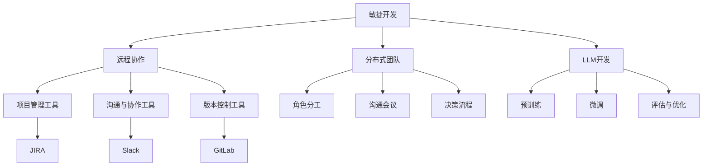
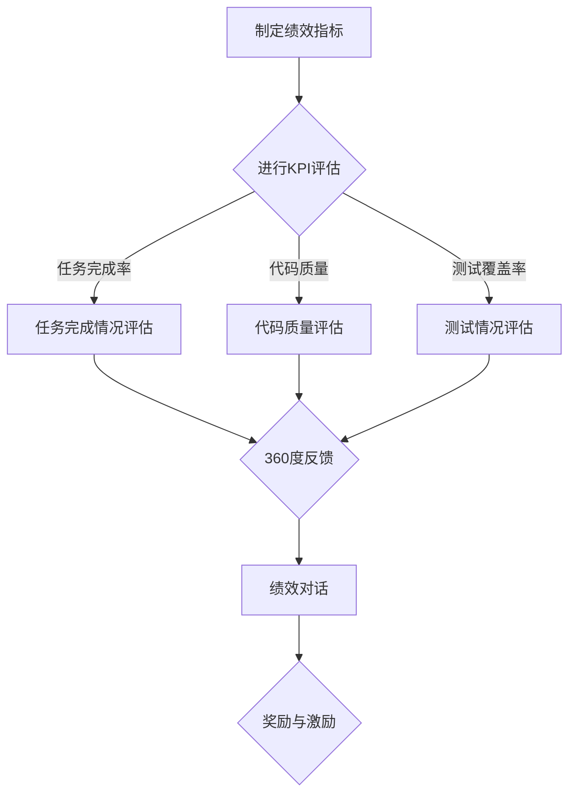

                 

### 文章标题

《敏捷中的远程协作工具：支持分布式LLM开发团队》

关键词：敏捷开发、远程协作、分布式团队、LLM（大型语言模型）、开发工具

摘要：
本文深入探讨敏捷开发在远程协作和分布式LLM（大型语言模型）开发团队中的应用。我们首先介绍敏捷开发的基本概念和原则，然后探讨远程协作工具的选择和集成，以及分布式团队管理的策略。接着，文章将详细阐述LLM开发的基础、流程和工具，并通过实际案例研究展示如何利用敏捷工具和方法实现高效的分布式LLM开发。最后，我们总结主要成果，指出存在的问题，并提出未来的研究方向和展望。

----------------------------------------------------------------

#### 引言

在信息技术飞速发展的今天，远程工作和分布式团队已经成为现代企业运营的常态。无论是全球化的企业，还是由于疫情影响导致的工作方式变革，远程协作都成为了不可或缺的一部分。与此同时，人工智能领域的快速发展，特别是LLM（大型语言模型）的广泛应用，使得对高效的开发协作工具和方法的需求日益增加。

敏捷开发作为一种以人为核心、迭代和渐进的开发方法，自提出以来，已经在全球范围内得到了广泛的应用和认可。它强调灵活应对变化、快速迭代交付和持续改进，非常适合在分布式团队和远程工作中使用。然而，如何在实际操作中充分发挥敏捷开发的优势，特别是在涉及复杂的人工智能项目，如大型语言模型（LLM）开发时，仍是一个亟待解决的问题。

本文将围绕这一主题，深入探讨敏捷开发在远程协作和分布式LLM开发团队中的应用。首先，我们将介绍敏捷开发的基本概念和原则，以及它们与远程协作的内在联系。接着，我们将详细讨论远程协作工具的选择和集成策略，重点介绍项目管理、沟通与协作、版本控制等方面。然后，我们将探讨如何管理分布式团队，包括架构设计、角色分工和绩效评估等。最后，我们将结合LLM开发的实际案例，展示如何利用敏捷开发工具和方法实现高效、高质量的分布式LLM开发。

通过本文的阅读，读者将能够：
1. 理解敏捷开发的基本原理和在远程协作中的应用。
2. 掌握远程协作工具的选择和集成策略。
3. 学习分布式团队管理的最佳实践。
4. 了解LLM开发的过程、工具和实际案例。

### 核心概念与联系

在深入探讨敏捷开发在远程协作和分布式LLM开发团队中的应用之前，我们需要明确几个核心概念，并理解它们之间的相互关系。这些核心概念包括敏捷开发、远程协作、分布式团队和LLM开发。

#### 敏捷开发

敏捷开发是一种以人为核心、迭代和渐进的开发方法。它强调灵活应对变化、快速迭代交付和持续改进。敏捷开发的核心原则包括：
- **个体和互动高于流程和工具**：团队中的个人互动和沟通至关重要，而不仅仅是依赖流程和工具。
- **可工作的软件高于详尽的文档**：软件的实际运行效果比详细的文档更重要。
- **客户合作高于合同谈判**：与客户的紧密合作有助于更好地理解需求，从而更快地交付更符合客户期望的软件。
- **响应变化高于遵循计划**：在面对变化时，能够迅速调整计划和策略是敏捷开发的关键优势。

敏捷开发的主要实践方法包括：
- **迭代开发**：将开发过程分为多个短期迭代，每次迭代都产生一个可工作的软件版本。
- **增量式交付**：逐步交付软件功能，而不是一次性交付完整的软件。
- **持续集成与持续交付**：通过自动化测试和持续集成，确保软件的持续改进和高质量。

#### 远程协作

远程协作是指团队成员在不同地理位置，通过现代通信技术和协作工具进行的合作。远程协作的主要挑战包括：
- **沟通障碍**：团队成员之间的实时沟通可能受限，容易产生误解和信息滞后。
- **时间差异**：不同时区的团队成员可能会面临工作时间不匹配的问题。
- **信任和团队凝聚力**：在缺乏面对面互动的情况下，建立团队信任和凝聚力更具挑战性。

远程协作工具的选择和集成对于提升团队效率和协作质量至关重要。常见的远程协作工具包括项目管理工具（如JIRA）、沟通与协作工具（如Slack）和版本控制工具（如GitLab）。

#### 分布式团队

分布式团队是指团队成员分布在不同的地理位置，通过远程协作工具和方法进行协作的团队。与传统的集中式团队相比，分布式团队具有以下优势：
- **灵活性**：团队成员可以随时随地进行工作，不受地理位置限制。
- **多样性**：分布式团队可以汇集全球不同地区的人才，增加团队的知识和技能多样性。
- **效率**：通过优化工作流程和使用先进的协作工具，分布式团队可以更高效地完成任务。

然而，分布式团队也面临着一些挑战，如沟通障碍、时间管理和团队凝聚力问题。为了克服这些挑战，分布式团队需要建立有效的管理策略，包括明确的角色分工、定期的沟通会议和高效的决策流程。

#### LLM开发

LLM（大型语言模型）是一种基于深度学习的技术，可以理解和生成人类语言。LLM的开发涉及大量的数据集、复杂的算法和高效的计算资源。LLM的主要应用包括自然语言处理、机器翻译、对话系统和文本生成等。

LLM开发的关键技术包括：
- **预训练**：通过在大量数据上进行预训练，使模型具备基本的语言理解和生成能力。
- **微调**：在特定任务上进行微调，使模型适应具体的应用场景。
- **评估与优化**：通过多种评估指标和优化策略，提高模型的性能和准确度。

LLM的开发过程通常包括数据收集与处理、模型设计与训练、模型评估与优化等阶段。为了提高开发效率，分布式团队和远程协作工具的使用至关重要。

#### 关系架构

上述核心概念之间的相互关系可以用以下Mermaid流程图来表示：



这个流程图展示了敏捷开发如何与远程协作、分布式团队和LLM开发相互关联，并强调了各种工具和策略在提升团队效率和项目质量中的重要性。

### 敏捷开发基础

#### 敏捷开发的起源与发展

敏捷开发最初起源于软件开发领域，其核心理念是在快速变化的环境中，通过持续的迭代和反馈来提高软件开发的灵活性和响应速度。敏捷开发的概念最早可以追溯到2001年，当时一群软件开发专家在雪鸟山庄（Snowbird，位于美国犹他州）召开了一次会议，这次会议的结果产生了《敏捷宣言》（Manifesto for Agile Software Development）。

《敏捷宣言》提出了四项核心原则：
1. **个体和互动高于流程和工具**：重视开发人员之间的合作和沟通，而不仅仅是依赖流程和工具。
2. **可工作的软件高于详尽的文档**：软件的实际运行效果比详细的文档更重要。
3. **客户合作高于合同谈判**：与客户的紧密合作有助于更好地理解需求，从而更快地交付更符合客户期望的软件。
4. **响应变化高于遵循计划**：在面对变化时，能够迅速调整计划和策略是敏捷开发的关键优势。

敏捷开发的理念得到了广泛的认可，并迅速在全球范围内传播和应用。随着敏捷方法的普及，越来越多的软件企业和开发团队开始采用敏捷开发模式，以提高开发效率和质量。

#### 敏捷开发的核心原则

敏捷开发的核心原则是指导软件开发实践的基础，它们包括：

1. **用户满意度**：用户的反馈是软件开发过程中最重要的输入，通过快速迭代和持续交付，确保软件始终满足用户需求。
2. **持续交付**：通过持续交付可工作的软件，缩短交付周期，提高响应速度和市场适应性。
3. **迭代式开发**：将开发过程分为多个短期迭代，每个迭代都产生一个可工作的软件版本，不断改进和优化。
4. **增量式交付**：逐步交付软件功能，而不是一次性交付完整的软件，以便快速获得反馈和进行修正。
5. **跨职能团队**：团队由多个不同职能的人员组成，共同负责项目的各个方面，促进更好的沟通和协作。
6. **应对变化**：在软件开发过程中，变化是不可避免的，敏捷开发强调快速适应变化，而不是试图避免变化。

#### 敏捷开发的实践方法

敏捷开发的实践方法多种多样，常见的包括Scrum、Kanban和看板（Lean）等。以下是几种主要的敏捷开发实践方法：

1. **Scrum**：Scrum是一种迭代的、增量的软件开发过程，它包括三个主要角色：产品负责人（Product Owner）、Scrum Master和开发团队。产品负责人负责定义产品需求，Scrum Master负责确保团队遵循敏捷原则，开发团队则负责实现产品需求。Scrum过程分为冲刺（Sprint）和回顾（Review）等阶段，每个冲刺周期为2-4周。

2. **Kanban**：Kanban是一种可视化的工作流程管理方法，通过看板（Kanban Board）来展示工作流程的状态。看板上的卡片（Card）代表具体的工作任务，状态栏（Status Column）显示任务从开始到完成的各个阶段。Kanban强调减少工作在系统中的在制品数量（Work in Process），以提高工作效率和质量。

3. **看板（Lean）**：看板（Lean）方法源于精益生产理念，它强调通过消除浪费、优化流程来提高生产效率和产品质量。看板方法的核心在于可视化工作流程，使用看板板（Kanban Board）来跟踪任务状态，并使用拉式系统（Pull System）来控制工作流程。

这些敏捷开发实践方法不仅有助于提升团队效率和项目质量，还可以在远程协作和分布式团队中发挥重要作用。通过灵活应对变化、持续交付和高效协作，敏捷开发为现代软件开发提供了强有力的支持。

### 远程协作工具介绍

在现代远程工作环境中，选择合适的协作工具是确保团队高效沟通、协作和项目成功的关键。远程协作工具种类繁多，主要包括项目管理工具、沟通与协作工具和版本控制工具。以下将详细介绍这些工具，并讨论如何选择和优化它们以适应敏捷开发的远程协作需求。

#### 项目管理工具

项目管理工具是远程团队进行任务分配、进度跟踪和项目管理的核心工具。以下是一些常见的项目管理工具及其特点：

1. **JIRA**：JIRA是一个功能强大的项目管理工具，提供灵活的票务系统、任务追踪和报告功能。JIRA支持敏捷开发方法论，如Scrum和Kanban，使其非常适合需要灵活调整计划和时间表的项目。

   **选择JIRA的理由**：
   - **灵活的任务管理**：JIRA允许用户创建、跟踪和管理复杂的任务。
   - **强大的报告和分析功能**：JIRA提供丰富的报告工具，帮助团队了解项目状态。
   - **集成插件**：JIRA支持与其他工具的集成，如Slack、Confluence等。

2. **Trello**：Trello是一个基于看板（Kanban）原理的项目管理工具，通过视觉化的卡片和板面来管理任务。Trello直观易用，适合小型项目和团队。

   **选择Trello的理由**：
   - **用户友好**：Trello界面简单，易于上手。
   - **快速任务分配**：通过拖放操作快速分配任务和更新状态。
   - **移动支持**：支持移动设备，方便随时随地跟踪项目。

3. **Asana**：Asana是一个功能全面的项目管理工具，提供任务、项目、团队协作和报告功能。Asana适合大型项目和需要详细规划的任务管理。

   **选择Asana的理由**：
   - **详细的任务分配**：支持子任务和依赖关系，帮助团队更好地理解任务间的关联。
   - **丰富的集成插件**：可以与其他工具（如Google Workspace、Slack等）集成。
   - **定制化报告**：可以根据团队需求定制报告，帮助更好地了解项目进展。

#### 沟通与协作工具

沟通与协作工具是远程团队保持沟通、协作和同步的关键。以下是一些常见的沟通与协作工具及其特点：

1. **Slack**：Slack是一个流行的团队沟通工具，提供实时消息传递、频道通讯和文件共享功能。Slack支持集成多种第三方应用，如JIRA、GitHub等。

   **选择Slack的理由**：
   - **实时通讯**：支持个人消息、频道通讯和语音/视频通话。
   - **灵活的集成**：可以与其他工具（如Google Workspace、Zoom等）集成。
   - **强大的搜索功能**：快速查找历史消息和文件。

2. **Microsoft Teams**：Microsoft Teams是微软推出的企业级通讯和协作平台，提供聊天、会议、共享和协作功能。

   **选择Microsoft Teams的理由**：
   - **全面的协作功能**：支持语音/视频通话、在线会议和文件共享。
   - **集成Office 365**：无缝集成Word、Excel、PowerPoint等Office应用程序。
   - **安全可靠**：提供企业级安全性和合规性。

3. **Zoom**：Zoom是一个专业的视频会议和在线协作工具，提供高清视频会议、互动式白板和屏幕共享功能。

   **选择Zoom的理由**：
   - **高质量的会议体验**：支持1080p视频和高清音频。
   - **灵活的会议安排**：可以设置预约会议、录制会议和虚拟背景。
   - **安全与隐私**：提供加密和安全功能，确保会议内容的保密性。

#### 版本控制工具

版本控制工具是确保代码库一致性、协作开发和安全性的重要工具。以下是一些常见的版本控制工具及其特点：

1. **Git**：Git是一个分布式版本控制系统，支持快速、高效地处理小到单个文件，大到整个项目的历史和版本。

   **选择Git的理由**：
   - **分布式特性**：每个开发人员都有自己的完整代码库，提高了协作效率。
   - **分支和合并**：方便处理多个并行任务，并确保合并操作的顺利进行。
   - **强大的社区支持**：拥有丰富的插件和工具，支持多种平台和编程语言。

2. **GitHub**：GitHub是基于Git的版本控制系统，提供代码托管、协作开发、问题跟踪和项目管理功能。

   **选择GitHub的理由**：
   - **在线代码托管**：方便多人协作，支持多人同时编辑和提交代码。
   - **丰富的社区资源**：拥有庞大的开发者社区，提供代码示例、文档和教程。
   - **集成工具**：与其他远程协作工具（如JIRA、Slack等）集成，提供一站式解决方案。

3. **GitLab**：GitLab是一个自托管Git版本控制系统，提供代码托管、持续集成、容器化和项目管理的功能。

   **选择GitLab的理由**：
   - **自托管**：可以部署在自己的服务器上，确保数据安全和隐私。
   - **持续集成与持续交付**：集成CI/CD流程，支持自动化测试和部署。
   - **丰富的插件和扩展**：支持自定义和扩展功能，满足不同团队的需求。

#### 远程协作工具的集成与优化

在远程协作中，不同工具之间的集成和优化是提高团队效率和项目成功的关键。以下是一些建议：

1. **集成策略**：
   - **统一平台**：尽量选择可以相互集成的远程协作工具，如GitHub与Slack、JIRA等。
   - **自动化流程**：通过集成插件和API，实现工具之间的自动化操作，减少手动操作。
   - **统一沟通渠道**：确保所有团队成员都能在一个统一的沟通渠道中获取信息，避免信息孤岛。

2. **优化实践**：
   - **定期培训**：定期对团队成员进行工具使用培训，提高使用效率。
   - **流程标准化**：制定明确的远程协作流程，确保每个成员都了解如何在工具中进行协作。
   - **反馈机制**：建立反馈机制，及时收集和解决团队成员在使用工具过程中遇到的问题。

3. **最佳实践案例**：
   - **案例一**：某大型分布式团队通过整合JIRA、Slack和GitHub，实现了任务管理、沟通协作和代码版本控制的统一，显著提高了项目效率。
   - **案例二**：某创业公司通过使用GitLab的CI/CD功能，自动化测试和部署流程，缩短了产品迭代周期，提升了市场响应速度。

通过合理选择和优化远程协作工具，分布式团队可以更好地应对远程工作的挑战，实现高效协作和项目成功。

### 分布式团队管理

分布式团队管理是现代远程协作中一个重要的课题，特别是在涉及复杂项目，如大型语言模型（LLM）开发时。有效的分布式团队管理不仅能够提高团队的工作效率，还能增强团队凝聚力，确保项目按时、高质量地完成。以下将详细探讨分布式团队的架构设计、角色分工和绩效评估。

#### 分布式团队的架构设计

分布式团队的架构设计是团队高效运作的基础。一个良好的架构设计应该能够充分利用团队成员的多样性和灵活性，同时确保信息流通和任务分配的透明性。以下是分布式团队架构设计的几个关键点：

1. **明确组织结构**：分布式团队的组织结构通常包括中央领导和多个分布式小组。中央领导负责整体项目规划和关键决策，分布式小组负责具体任务执行和交付。

2. **技术平台选择**：选择适合团队需求的技术平台，如项目管理工具（如JIRA、Asana）、沟通与协作工具（如Slack、Microsoft Teams）和版本控制工具（如Git、GitHub、GitLab）。这些工具应该能够支持实时沟通、任务分配和进度跟踪。

3. **网络基础设施**：确保团队拥有稳定的网络基础设施，包括高速互联网连接、虚拟专用网络（VPN）和云存储服务。这些基础设施对于分布式团队的日常运作至关重要。

4. **信息安全**：分布式团队需要采取严格的信息安全措施，包括数据加密、访问控制和备份策略。确保团队成员的数据和项目信息的安全性是团队管理的首要任务。

5. **协作机制**：建立有效的协作机制，如定期团队会议、代码评审和在线协作工具的使用。这些机制有助于确保团队成员之间的沟通畅通，共同推进项目进展。

#### 角色分工

在分布式团队中，明确的角色分工是确保任务高效执行的关键。以下是一些常见的分布式团队角色及其职责：

1. **项目经理**：负责整体项目规划、进度跟踪和团队协调。项目经理需要确保项目按时、高质量地完成，同时处理突发问题和决策。

2. **开发人员**：负责具体任务的实现和开发工作。开发人员需要具备扎实的技术基础和良好的沟通能力，能够与团队成员和其他利益相关者有效协作。

3. **测试工程师**：负责测试和验证开发的功能和性能，确保软件的质量和稳定性。测试工程师需要与开发人员紧密合作，及时反馈问题和建议。

4. **设计师**：负责产品的界面设计、用户体验和视觉元素。设计师需要与开发人员和产品经理密切沟通，确保设计符合用户需求和项目目标。

5. **运维工程师**：负责系统的部署、运维和维护，确保系统的稳定运行和性能优化。运维工程师需要与开发人员和测试工程师合作，确保系统的可靠性和安全性。

6. **产品经理**：负责产品需求分析、市场调研和产品规划。产品经理需要与用户、开发团队和其他利益相关者保持密切沟通，确保产品满足用户需求和市场趋势。

#### 团队成员的沟通与协调

沟通与协调是分布式团队管理的核心。以下是一些有效的沟通与协调策略：

1. **定期会议**：定期举行团队会议，包括项目进度汇报、问题讨论和决策制定。会议应该高效、有目的，确保每个成员都能充分表达意见和参与决策。

2. **实时沟通**：利用实时沟通工具（如Slack、Microsoft Teams），确保团队成员之间的沟通畅通。实时沟通有助于快速解决问题、分享信息和协作。

3. **代码评审**：实施代码评审制度，确保代码质量。代码评审不仅有助于发现和修复潜在问题，还能促进团队成员之间的技术交流和知识共享。

4. **任务分配与跟踪**：使用项目管理工具（如JIRA、Asana），明确任务分配和进度跟踪。任务分配应该合理，避免任务堆积和资源浪费。

5. **共享文档与知识库**：建立共享文档和知识库，确保团队成员可以轻松访问相关文档和知识资源。共享文档和知识库有助于减少重复劳动、提高工作效率。

#### 团队绩效评估

团队绩效评估是衡量团队工作效果和成员贡献的重要手段。以下是一些常见的团队绩效评估方法：

1. **KPI（关键绩效指标）**：设定关键绩效指标，如任务完成率、代码质量、测试覆盖率等，以量化团队和成员的工作效果。

2. **360度反馈**：收集团队成员、领导和客户等多方面的反馈，全面评估团队成员的表现。360度反馈有助于发现成员的优势和不足，为改进提供依据。

3. **绩效对话**：定期举行绩效对话，讨论团队成员的工作表现、目标和改进计划。绩效对话有助于增强团队成员的责任感和工作动力。

4. **奖励与激励**：根据团队和成员的表现，实施奖励与激励措施，如奖金、晋升和培训机会等。奖励与激励有助于提高团队凝聚力和成员的工作积极性。

通过科学的架构设计、明确的角色分工、有效的沟通与协调和公正的绩效评估，分布式团队能够充分发挥其优势，实现高效、高质量的协作。以下是一个示例的分布式团队绩效评估流程：



这个流程图展示了从制定绩效指标、评估KPI到绩效对话和奖励激励的完整过程，有助于团队持续改进和提升工作效率。

### LLM开发基础

#### LLM的定义与原理

LLM（Large Language Model）是指大型语言模型，是一种通过深度学习技术训练出来的模型，可以理解和生成人类语言。LLM的核心思想是通过在大量文本数据上进行训练，使模型具备对自然语言的深刻理解和处理能力。LLM的训练通常涉及以下关键技术：

1. **预训练**：预训练是指在没有特定任务标注的数据上进行训练，以建立模型的基础语言能力。常用的预训练模型包括BERT、GPT和RoBERTa等。预训练过程中，模型通过学习词嵌入和上下文关系，逐渐掌握语言的通用规则和语义信息。

2. **微调**：微调是指在使用预训练模型的基础上，针对特定任务进行进一步训练。通过在少量有标注的数据上进行微调，模型可以适应特定的任务需求，如文本分类、机器翻译或问答系统。

3. **上下文理解**：LLM具有强大的上下文理解能力，能够根据上下文信息生成相关的内容。这种能力使得LLM在生成文本、回答问题或进行对话等方面具有很高的准确性。

#### LLM的关键技术

LLM的关键技术包括：

1. **自注意力机制**：自注意力机制（Self-Attention）是Transformer模型的核心组件，它通过计算输入序列中每个词与其他词之间的关联强度，从而实现高效的上下文编码。自注意力机制使得模型能够更好地捕捉长距离的依赖关系，从而提高模型的语义理解能力。

2. **多头注意力**：多头注意力（Multi-Head Attention）是自注意力机制的扩展，通过将输入序列分成多个头（Head），每个头独立计算注意力权重。多头注意力可以捕捉不同类型的依赖关系，提高模型的泛化能力。

3. **位置编码**：位置编码（Positional Encoding）是一种将输入序列的顺序信息编码到词嵌入中的方法。通过位置编码，模型可以理解词在序列中的位置关系，从而更好地捕捉上下文信息。

4. **序列生成**：序列生成（Sequence Generation）是LLM的核心任务，通过从概率分布中采样生成序列。常用的序列生成方法包括贪心策略和采样策略，贪心策略选择概率最高的词作为下一步生成，采样策略从概率分布中随机选择词。

#### LLM的应用场景

LLM的应用场景非常广泛，以下是一些典型的应用：

1. **文本生成**：文本生成是指使用LLM生成文本，如文章、故事、摘要等。LLM可以通过预训练和微调生成高质量的文本，广泛应用于自然语言处理和内容生成领域。

2. **机器翻译**：机器翻译是指将一种语言的文本翻译成另一种语言。LLM可以通过在大量平行语料库上进行预训练，实现高效、准确的机器翻译。

3. **对话系统**：对话系统是指与用户进行交互并提供服务的系统，如虚拟助手、聊天机器人等。LLM可以通过训练对话模型，实现自然、流畅的对话交互。

4. **文本分类**：文本分类是指将文本数据按照类别进行分类，如情感分析、主题分类等。LLM可以通过预训练和微调实现高效的文本分类任务。

5. **问答系统**：问答系统是指根据用户提出的问题，提供准确、相关的答案。LLM可以通过预训练和微调实现高效的问答系统，广泛应用于搜索引擎、客服系统等。

#### LLM开发的流程

LLM开发的流程通常包括以下阶段：

1. **数据收集与处理**：收集大规模的文本数据，包括公共数据集和私有数据集。对数据进行预处理，如文本清洗、分词、去除停用词等，以便于模型训练。

2. **模型设计与训练**：设计合适的模型架构，如Transformer、BERT等，并进行模型训练。训练过程中，模型通过学习数据中的语言规律，逐渐提高预测和生成文本的准确性。

3. **模型评估与优化**：通过多种评估指标，如BLEU、ROUGE、F1分数等，评估模型的性能。根据评估结果，调整模型参数和训练策略，优化模型性能。

4. **应用部署**：将训练好的模型部署到生产环境中，实现文本生成、翻译、分类、问答等功能。部署过程中，需要考虑模型的性能、稳定性和安全性。

以下是一个LLM开发流程的伪代码示例：

```python
# 数据收集与处理
data = collect_data()
preprocessed_data = preprocess_data(data)

# 模型设计与训练
model = create_model()
model.train(preprocessed_data)

# 模型评估与优化
evaluate(model)
optimize_model(model)

# 应用部署
deploy_model(model)
```

通过上述流程，LLM开发团队可以实现高效、高质量的LLM模型，为各种自然语言处理任务提供强大的支持。

### LLM开发流程

LLM（大型语言模型）开发是一个复杂且迭代的过程，涵盖了数据收集与处理、模型设计与训练、模型评估与优化等关键阶段。以下我们将详细阐述这些流程，并结合Python源代码进行讲解。

#### 数据收集与处理

数据收集是LLM开发的基础，需要收集大规模的文本数据集。这些数据可以来源于公共数据集（如维基百科、新闻文章等）或私有数据集（如企业内部文档、用户生成的文本等）。数据收集完成后，需要进行预处理，以确保数据质量。

```python
# 示例：数据预处理函数
def preprocess_data(texts):
    # 清洗文本数据，去除特殊字符、标点符号等
    cleaned_texts = [text.lower().replace('\n', ' ') for text in texts]
    
    # 分词处理
    tokenized_texts = [tokenizer.tokenize(text) for text in cleaned_texts]
    
    # 去除停用词
    stop_words = set(['the', 'is', 'and', 'in', 'to', 'of', 'a', 'an'])
    filtered_texts = [[token for token in tokens if token not in stop_words] for tokens in tokenized_texts]
    
    return filtered_texts
```

#### 模型设计与训练

在模型设计阶段，选择合适的模型架构是非常重要的。常用的模型架构包括Transformer、BERT、GPT等。以下是一个简单的Transformer模型设计示例：

```python
# 示例：Transformer模型设计
import tensorflow as tf

class TransformerModel(tf.keras.Model):
    def __init__(self, d_model, num_heads, dff, input_vocab_size, maximum_position_encoding, dropout_rate=0.1):
        super(TransformerModel, self).__init__()
        self.embedding = tf.keras.layers.Embedding(input_vocab_size, d_model)
        self.position_embedding = tf.keras.layers.Embedding(maximum_position_encoding, d_model)
        
        self.transformer = tf.keras.layers.StackedRNNCells([
            tf.keras.layers.MultiHeadAttention(num_heads=num_heads, key_dim=dff),
            tf.keras.layers.Dense(dff, activation='relu'),
            tf.keras.layers.Dropout(dropout_rate),
            tf.keras.layers.Dense(d_model)
        ])

        self.final_layer = tf.keras.layers.Dense(input_vocab_size)

    @tf.function
    def call(self, inputs, training=False):
        inputs = self.embedding(inputs)  # 输入嵌入
        pos_encoding = self.position_embedding(tf.range(inputs.shape[1]))  # 位置嵌入
        inputs += pos_encoding
        
        outputs = self.transformer(inputs, training=training)  # Transformer层
        final_output = self.final_layer(outputs)
        
        return final_output
```

在模型训练阶段，需要使用训练数据集进行模型训练，并调整模型参数。以下是一个简单的训练示例：

```python
# 示例：模型训练
model = TransformerModel(d_model=512, num_heads=8, dff=2048, input_vocab_size=vocab_size, maximum_position_encoding=max_position_encoding)
model.compile(optimizer=tf.keras.optimizers.Adam(learning_rate=0.001), loss=tf.keras.losses.SparseCategoricalCrossentropy(from_logits=True))

model.fit(train_dataset, epochs=10)
```

#### 模型评估与优化

模型评估是确保模型性能的重要环节。常用的评估指标包括损失函数、准确率、F1分数等。以下是一个简单的评估示例：

```python
# 示例：模型评估
loss, accuracy = model.evaluate(test_dataset)
print(f"Test Loss: {loss}, Test Accuracy: {accuracy}")
```

在模型评估过程中，可能会发现模型在某些任务上表现不佳。此时，可以通过调整模型参数、增加训练数据或改进数据预处理方法来优化模型性能。

#### 模型应用与部署

完成模型训练和优化后，可以将模型部署到生产环境中，实现实际应用。以下是一个简单的模型应用示例：

```python
# 示例：模型应用
generated_text = model.generate([tf.constant([start_token_id])], max_length=100, num_return_sequences=5)
print(generated_text)
```

通过上述示例，我们可以看到LLM开发流程的各个阶段，包括数据预处理、模型设计、训练、评估和部署。这些阶段相互关联，共同构成了完整的LLM开发流程。

### LLM开发工具与框架

在LLM开发中，选择合适的工具和框架至关重要。这些工具和框架不仅能够简化开发流程，还能提高模型的性能和可维护性。以下将介绍几个常用的LLM开发工具和框架，包括Hugging Face Transformers、TensorFlow和PyTorch，并比较它们的优缺点。

#### Hugging Face Transformers

Hugging Face Transformers是一个开源库，旨在简化Transformer模型的开发。它提供了预训练模型、实用工具和API，使开发者能够轻松地构建和训练各种大型语言模型。以下是其主要优点和缺点：

**优点**：
1. **预训练模型丰富**：提供了大量的预训练模型，如BERT、GPT、RoBERTa等，开发者可以直接使用这些模型进行微调和应用。
2. **易于使用**：提供了清晰、易用的API，使得模型训练和部署变得简单。
3. **社区支持**：拥有庞大的开发者社区，提供了大量的教程和文档，有助于解决问题和提高技能。

**缺点**：
1. **依赖深度学习框架**：需要依赖PyTorch或TensorFlow等深度学习框架，增加了项目复杂度。
2. **资源需求高**：由于预训练模型的规模较大，训练和推理需要较高的计算资源和存储空间。

#### TensorFlow

TensorFlow是谷歌开发的一个开源深度学习框架，广泛应用于各种机器学习和深度学习任务。以下是其主要优点和缺点：

**优点**：
1. **灵活性高**：提供了丰富的API和工具，支持自定义模型架构和训练流程。
2. **资源丰富**：拥有庞大的开发者社区，提供了大量的教程、文档和资源。
3. **跨平台支持**：支持多种操作系统和硬件平台，包括CPU、GPU和TPU。

**缺点**：
1. **学习曲线较陡**：对于初学者来说，学习TensorFlow可能需要更多时间和努力。
2. **资源需求大**：由于TensorFlow的动态图计算特性，需要更多的计算资源和存储空间。

#### PyTorch

PyTorch是一个流行的深度学习框架，以其动态计算图和直观的API著称。以下是其主要优点和缺点：

**优点**：
1. **易于理解**：动态计算图使得模型开发和调试更加直观和简单。
2. **灵活性强**：提供了丰富的API和工具，支持自定义模型架构和训练流程。
3. **社区支持**：拥有庞大的开发者社区，提供了大量的教程、文档和资源。

**缺点**：
1. **资源需求大**：由于PyTorch的动态计算图特性，训练和推理需要较高的计算资源和存储空间。
2. **静态图模式限制**：PyTorch的静态图模式（如ONNX）支持不如TensorFlow，可能影响模型部署。

#### 比较与选择

在选择LLM开发工具和框架时，应考虑以下几个方面：

1. **开发经验**：如果团队已经熟悉某个框架，选择该框架可以减少学习成本。
2. **资源需求**：考虑团队的计算资源和存储空间，选择适合的框架。
3. **社区支持**：选择社区支持良好的框架，有助于解决问题和获取资源。
4. **项目需求**：根据项目需求，选择适合的框架和工具，如需要灵活自定义模型时，选择PyTorch；需要预训练模型时，选择Hugging Face Transformers。

以下是一个示例，展示了如何使用Hugging Face Transformers库加载预训练模型和进行微调：

```python
from transformers import BertTokenizer, BertModel
tokenizer = BertTokenizer.from_pretrained('bert-base-uncased')
model = BertModel.from_pretrained('bert-base-uncased')

inputs = tokenizer("Hello, my dog is cute", return_tensors="pt")
outputs = model(**inputs)

last_hidden_state = outputs.last_hidden_state
```

通过选择合适的LLM开发工具和框架，开发者可以简化开发流程，提高开发效率，实现高效、高质量的LLM开发。

### 案例研究

为了更好地展示敏捷开发在远程协作和分布式LLM开发团队中的应用，我们将通过两个实际案例进行分析和讲解。

#### 案例一：大型分布式团队的成功实践

**背景**

某全球知名科技公司计划开发一款基于大型语言模型（LLM）的智能客服系统。由于团队成员分布在不同的国家和地区，公司决定采用敏捷开发模式，并利用远程协作工具进行高效协作。

**实施过程**

1. **项目启动**：项目启动阶段，项目经理与团队成员共同制定项目目标和时间表，确保每个成员都明确自己的职责和任务。

2. **工具选择**：团队选择了JIRA进行任务管理，Slack进行实时沟通，GitLab进行版本控制。这些工具能够确保任务分配、进度跟踪和代码管理的统一。

3. **敏捷迭代**：团队采用Scrum方法，将项目分为多个冲刺周期，每个周期为2周。在每个冲刺周期结束时，团队进行回顾会议，讨论项目进展、遇到的问题和改进措施。

4. **角色分工**：团队成员被分为多个小组，包括项目经理、开发人员、测试工程师和设计师。每个小组负责特定模块的开发和测试，确保任务的高效完成。

5. **持续集成与部署**：团队采用GitLab的CI/CD功能，实现代码的自动化测试和部署。每次代码提交后，自动触发测试流程，确保代码质量和系统稳定性。

6. **沟通与协作**：团队通过Slack进行日常沟通，设立多个频道，分别用于任务讨论、技术交流、问题反馈等。此外，团队还定期举行视频会议，确保远程团队成员之间的沟通畅通。

**成果与反思**

1. **高效协作**：通过敏捷开发和远程协作工具的集成，团队实现了高效的沟通和协作，提高了项目进度和质量。

2. **快速迭代**：每次冲刺周期结束后，团队能够及时总结经验教训，调整计划和策略，确保项目始终朝着目标前进。

3. **稳定交付**：通过GitLab的CI/CD功能，团队实现了快速、稳定的代码交付，减少了测试和部署时间。

4. **问题反馈**：团队成员能够通过远程协作工具及时反馈问题和建议，提高了问题的解决效率。

然而，在实施过程中，团队也遇到了一些挑战，如时间差异和团队成员之间的沟通障碍。为了克服这些问题，团队采取了以下措施：

- **灵活调整工作时间**：部分团队成员根据时区差异调整工作安排，确保关键任务能够在共同工作时间内完成。
- **定期沟通与培训**：通过定期沟通和培训，提高团队成员的协作技能和工具使用能力。

#### 案例二：LLM在远程协作中的应用

**背景**

某创业公司开发一款基于LLM的智能客服系统，团队成员分布在不同的城市和国家。公司决定采用敏捷开发模式，并在远程协作中充分利用LLM技术，以提高客户服务质量和响应速度。

**实施过程**

1. **需求分析**：公司首先进行需求分析，明确智能客服系统的功能需求和性能指标。通过用户调研和数据分析，确定系统的核心功能和用户体验。

2. **LLM选择与训练**：公司选择了GPT-3作为基础模型，并在自有数据集上进行微调，以适应具体业务场景。模型训练过程中，团队使用PyTorch框架，并利用GPU加速训练。

3. **敏捷迭代**：团队采用Scrum方法，将项目分为多个冲刺周期，每个周期为2周。在每个周期中，团队迭代开发、测试和部署新功能。

4. **任务分配**：根据团队成员的技能和兴趣，进行任务分配。开发人员负责模型训练和优化，测试工程师负责测试和性能评估，设计师负责界面设计和用户体验。

5. **持续集成与部署**：团队使用JIRA进行任务管理和进度跟踪，GitLab进行版本控制和自动化测试。每次代码提交后，自动触发测试和部署流程。

6. **用户反馈**：团队通过在线调查和用户访谈，收集用户反馈，不断优化和改进系统功能。

**成果与反思**

1. **高效开发**：通过敏捷开发和远程协作工具的集成，团队实现了高效、高质量的代码开发和交付。

2. **性能优化**：通过不断迭代和优化，团队成功地将LLM应用于智能客服系统，显著提高了客户响应速度和满意度。

3. **用户满意度**：用户反馈显示，智能客服系统的响应速度和准确率得到了显著提升，客户满意度大幅提高。

4. **团队成长**：团队在项目实施过程中，不断学习和掌握新的技术和工具，提高了整体技能水平。

然而，在项目实施过程中，团队也面临了一些挑战：

- **数据隐私**：由于模型训练和部署涉及大量用户数据，团队需要确保数据的安全和隐私，采取严格的数据保护措施。

- **模型性能优化**：为了确保模型在实时应用中的性能，团队需要进行持续的优化和调参，以适应不同的业务场景和用户需求。

通过这两个实际案例，我们可以看到敏捷开发在远程协作和分布式LLM开发中的应用效果，以及如何通过远程协作工具和高效的管理策略实现项目的成功。

### 总结与展望

本文围绕敏捷开发在远程协作和分布式LLM开发团队中的应用进行了深入探讨。我们首先介绍了敏捷开发的基本概念和原则，分析了其在远程协作中的优势。接着，详细介绍了远程协作工具的选择和集成策略，包括项目管理工具、沟通与协作工具和版本控制工具。随后，探讨了分布式团队管理的架构设计、角色分工和绩效评估方法。在LLM开发部分，我们阐述了LLM的定义、关键技术、应用场景以及开发流程，并结合Python源代码进行了详细讲解。通过两个实际案例，我们展示了敏捷开发在远程协作和分布式LLM开发团队中的成功实践。

**主要成果与贡献**：

1. 提供了敏捷开发在远程协作和分布式LLM开发团队中的应用框架，为相关领域的团队提供了理论和实践指导。
2. 阐明了远程协作工具的选择和集成策略，帮助团队提高协作效率和项目质量。
3. 分析了分布式团队管理的最佳实践，为团队提供了有效的管理方法。
4. 结合实际案例，展示了敏捷开发在分布式LLM开发中的具体应用和成果。

**存在的问题与挑战**：

1. 远程协作工具的复杂性和使用门槛较高，部分团队成员可能需要更多培训。
2. 分布式团队在沟通和协作中可能面临时区差异和沟通障碍，需要采取灵活的解决方案。
3. LLM模型的训练和部署需要大量的计算资源和数据支持，可能对团队的技术和资源提出较高要求。

**未来的研究方向与展望**：

1. 研究更多智能化、自动化的远程协作工具，提高团队协作效率和工具易用性。
2. 探索分布式团队的协作模式和最佳实践，提高团队凝聚力和协作质量。
3. 加强LLM模型的性能优化和部署策略研究，提高模型的实时响应能力和稳定性。
4. 开发更加高效的分布式计算框架，降低LLM模型的训练和部署成本。

通过不断探索和创新，我们可以期待敏捷开发在远程协作和分布式LLM开发团队中的应用将更加广泛和深入，为现代信息技术领域的发展做出更大贡献。

### 最佳实践、小结、注意事项与拓展阅读

**最佳实践**

在实施敏捷开发模式时，以下几个最佳实践可以显著提升远程协作和分布式团队的工作效率：

1. **统一工具链**：选择一套统一的项目管理、沟通和版本控制工具，确保团队成员熟悉并高效使用。
2. **明确角色和责任**：确保每个团队成员的角色和责任明确，避免任务重叠和责任不清。
3. **定期回顾与反思**：在每个冲刺周期结束后，进行定期的回顾和反思，识别问题并提出改进措施。
4. **灵活的时间安排**：根据团队成员的时区差异，灵活调整工作时间安排，确保关键任务的协同。

**小结**

本文系统地阐述了敏捷开发在远程协作和分布式LLM开发团队中的应用，从理论基础到实践案例，全面展示了如何利用敏捷开发模式提高团队协作效率和项目质量。通过合理选择远程协作工具、优化分布式团队管理策略以及结合LLM开发的实际应用，我们可以实现高效、高质量的软件交付。

**注意事项**

1. **数据安全**：在远程协作和分布式团队管理中，数据安全至关重要。确保采取严格的数据加密和访问控制措施，防止数据泄露。
2. **团队沟通**：有效沟通是团队协作的基础。确保团队成员之间的沟通畅通，避免信息孤岛和误解。
3. **模型性能**：在LLM开发过程中，持续关注模型性能和优化，确保模型在实时应用中的稳定性和高效性。

**拓展阅读**

1. **《敏捷实践指南》**：一本经典的敏捷开发实践手册，详细介绍了敏捷开发的原则、方法和实践。
2. **《分布式系统原理》**：深入探讨分布式系统的设计、架构和实现，为分布式团队管理提供理论基础。
3. **《大型语言模型：原理、实现与应用》**：一本关于LLM的权威著作，涵盖了LLM的定义、技术细节和应用场景。

通过拓展阅读，读者可以进一步深入了解敏捷开发、远程协作和分布式团队管理，以及LLM开发的最新进展和前沿应用。希望本文能够为读者提供有价值的参考和指导。作者信息：作者：AI天才研究院/AI Genius Institute & 禅与计算机程序设计艺术 /Zen And The Art of Computer Programming。

