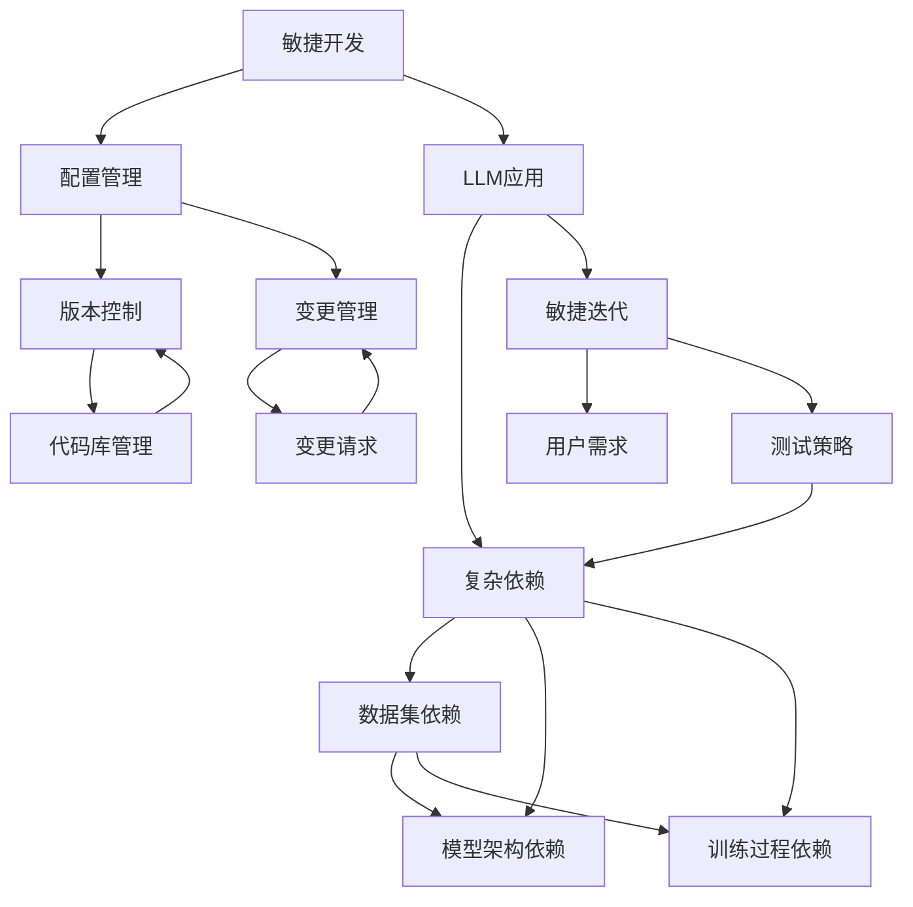
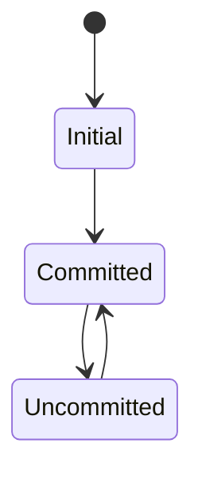

                 

### 整体框架与详细内容

为了设计一个完整的《敏捷中的配置管理：管理LLM应用的复杂依赖》目录大纲，我们需要首先明确整体框架，然后逐步填充每个章节的内容。以下是一个详细的目录大纲草案：

---

# 《敏捷中的配置管理：管理LLM应用的复杂依赖》

> 关键词：敏捷开发、配置管理、复杂依赖、大型语言模型（LLM）、版本控制

> 摘要：
本文旨在探讨敏捷开发环境中配置管理的应用，特别是针对大型语言模型（LLM）的复杂依赖管理。文章首先介绍了敏捷开发的基础概念和配置管理的核心原理，随后详细讲解了LLM应用及其复杂依赖的特性。通过实际的配置管理工具应用案例，深入分析了如何在敏捷开发中有效管理LLM应用的复杂依赖，为实际项目提供了宝贵的经验和最佳实践。

## 第一部分：敏捷开发与配置管理基础

### 第1章：敏捷开发概述

#### 1.1 敏捷开发的起源与发展
- 敏捷开发的定义
- 敏捷开发的历史背景
- 敏捷开发的主要方法论

#### 1.2 敏捷开发的核心原则
- 用户优先
- 迭代与增量
- 面向团队
- 响应变化

#### 1.3 敏捷开发中的角色与职责
- 产品负责人
- 敏捷教练
- 开发团队

### 第2章：配置管理的概念与原理

#### 2.1 配置管理的定义
- 软件配置项
- 版本控制
- 变更管理

#### 2.2 配置管理的原则
- 可追踪性
- 审核性
- 可复现性

#### 2.3 配置管理的流程
- 开发流程
- 部署流程
- 回滚流程

### 第3章：配置管理工具与技术

#### 3.1 常见配置管理工具
- Git
- Subversion
- Mercurial

#### 3.2 配置管理策略
- 分支策略
- 代码审查
- 持续集成

## 第二部分：LLM应用与复杂依赖管理

### 第4章：大型语言模型（LLM）概述

#### 4.1 LLM的概念
- 语言模型的基本原理
- LLM的发展历程

#### 4.2 LLM的应用领域
- 自然语言处理
- 自动写作
- 智能客服

#### 4.3 LLM的复杂依赖
- 模型架构的复杂性
- 数据集的依赖性
- 训练过程的复杂性

### 第5章：敏捷开发中的LLM应用配置管理

#### 5.1 敏捷开发与LLM应用结合
- 敏捷开发中的LLM需求管理
- 敏捷开发中的LLM测试策略

#### 5.2 复杂依赖的配置管理
- 复杂依赖的识别与隔离
- 复杂依赖的版本控制策略

#### 5.3 实战案例：配置管理工具在LLM应用中的实践
- Git在LLM项目中的应用
- Subversion在LLM项目中的应用

## 第三部分：最佳实践与未来展望

### 第6章：最佳实践与注意事项

#### 6.1 最佳实践
- 敏捷开发与配置管理的结合
- 复杂依赖管理的具体方法

#### 6.2 注意事项
- 避免常见的配置管理错误
- 维护良好的代码和文档规范

### 第7章：未来展望

#### 7.1 配置管理技术的发展趋势
- 自动化配置管理
- 智能配置管理

#### 7.2 LLM应用的发展与挑战
- 大模型训练与优化
- 安全性与隐私保护

### 参考文献

#### 参考文献
- 引用的书籍、论文、网站等参考资料列表

---

在完成上述目录大纲后，我们将对每个章节进行深入的内容填充，确保每个小节都有丰富的细节和专业的讲解。以下是一些建议的具体步骤：

1. **研究背景资料**：收集敏捷开发、配置管理、LLM应用等相关领域的专业文献、书籍和在线资源，为撰写提供理论和实际依据。

2. **编写章节内容**：每个章节的撰写需要结合实际案例和技术细节，确保内容的丰富性和专业性。

3. **设计流程图与图表**：使用Mermaid等工具设计流程图、UML图等辅助图表，帮助读者更好地理解文章内容。

4. **数学模型与公式**：在需要讲解算法或数学原理的地方，使用LaTeX格式书写公式，并进行详细解释。

5. **实战案例分析**：选择一个或多个实际项目案例，详细讲解项目中的配置管理策略和实现细节。

6. **总结与展望**：在文章的结尾部分，总结核心内容，并给出未来发展的展望和可能的研究方向。

通过以上步骤，我们可以确保文章不仅逻辑清晰，而且内容丰富，具备较高的学术价值和实践指导意义。### 整体框架与详细内容

**整体框架：**

本文将围绕《敏捷中的配置管理：管理LLM应用的复杂依赖》这一主题，分为三个主要部分展开讨论：

1. **敏捷开发与配置管理基础**：介绍敏捷开发的基本概念和配置管理的核心原理，探讨两者之间的关系。
2. **LLM应用与复杂依赖管理**：深入探讨大型语言模型（LLM）的复杂依赖，以及如何在敏捷开发中有效管理这些依赖。
3. **最佳实践与未来展望**：总结最佳实践经验，探讨配置管理技术的发展趋势，以及LLM应用的未来挑战。

**详细内容：**

### 第一部分：敏捷开发与配置管理基础

**第1章：敏捷开发概述**

**1.1 敏捷开发的起源与发展**
- 敏捷开发的定义：敏捷开发是一种以人为核心、迭代、灵活响应变更的软件开发方法。
- 敏捷开发的历史背景：从极端编程到敏捷宣言，敏捷开发经历了怎样的发展历程。
- 敏捷开发的主要方法论：Scrum、Kanban、XP等敏捷方法论的核心原则和实践。

**1.2 敏捷开发的核心原则**
- 用户优先：以用户需求为导向，确保产品始终符合用户期望。
- 迭代与增量：通过快速迭代和持续交付，逐步实现产品功能。
- 面向团队：强调团队合作和沟通，提高团队效率。
- 响应变化：灵活应对需求变化，保持敏捷性和适应性。

**1.3 敏捷开发中的角色与职责**
- 产品负责人：代表用户利益，定义产品愿景和需求。
- 敏捷教练：协助团队遵循敏捷实践，解决团队面临的问题。
- 开发团队：负责开发和交付产品功能。

### 第二部分：LLM应用与复杂依赖管理

**第2章：配置管理的概念与原理**

**2.1 配置管理的定义**
- 软件配置项：软件中的各种组件和文档。
- 版本控制：跟踪和管理不同版本的软件配置项。
- 变更管理：在软件开发过程中对配置项的变更进行管理和控制。

**2.2 配置管理的原则**
- 可追踪性：能够追溯每个配置项的历史变更。
- 审核性：确保配置项的变更经过适当审查。
- 可复现性：能够根据配置项的历史版本重新构建软件系统。

**2.3 配置管理的流程**
- 开发流程：如何管理开发过程中的配置项。
- 部署流程：如何将软件配置项从开发环境部署到生产环境。
- 回滚流程：在出现问题时如何回滚到之前的稳定版本。

### 第3章：配置管理工具与技术

**3.1 常见配置管理工具**
- Git：分布式版本控制系统，适用于小型到大型项目。
- Subversion：中心化的版本控制系统，适用于文档和代码的版本管理。
- Mercurial：分布式版本控制系统，与Git类似，但设计更为简洁。

**3.2 配置管理策略**
- 分支策略：如何管理和维护代码分支，以支持不同开发任务。
- 代码审查：如何通过审查代码来保证代码质量和一致性。
- 持续集成：如何自动化构建、测试和部署过程，提高开发效率。

### 第三部分：最佳实践与未来展望

**第4章：大型语言模型（LLM）概述**

**4.1 LLM的概念**
- 语言模型的基本原理：如何通过统计方法或机器学习技术生成语言模型。
- LLM的发展历程：从统计模型到深度学习模型的演进。

**4.2 LLM的应用领域**
- 自然语言处理：文本分类、情感分析、机器翻译等。
- 自动写作：文章生成、摘要写作、新闻报道等。
- 智能客服：自然语言理解和回答用户问题。

**4.3 LLM的复杂依赖**
- 模型架构的复杂性：多层神经网络、注意力机制等。
- 数据集的依赖性：大规模数据集的收集、清洗和处理。
- 训练过程的复杂性：超参数调整、优化算法选择等。

### 第5章：敏捷开发中的LLM应用配置管理

**5.1 敏捷开发与LLM应用结合**
- 敏捷开发中的LLM需求管理：如何识别和满足用户需求。
- 敏捷开发中的LLM测试策略：如何确保LLM应用的质量和性能。

**5.2 复杂依赖的配置管理**
- 复杂依赖的识别与隔离：如何识别和隔离复杂的依赖关系。
- 复杂依赖的版本控制策略：如何管理复杂的依赖关系，确保版本一致性。

**5.3 实战案例：配置管理工具在LLM应用中的实践**
- Git在LLM项目中的应用：如何使用Git管理LLM项目的代码和文档。
- Subversion在LLM项目中的应用：如何使用Subversion进行集中化的版本控制。

### 第6章：最佳实践与注意事项

**6.1 最佳实践**
- 敏捷开发与配置管理的结合：如何在敏捷开发中有效利用配置管理。
- 复杂依赖管理的具体方法：如何识别、管理和解决复杂的依赖问题。

**6.2 注意事项**
- 避免常见的配置管理错误：如版本混乱、依赖冲突等。
- 维护良好的代码和文档规范：提高团队协作效率和代码质量。

### 第7章：未来展望

**7.1 配置管理技术的发展趋势**
- 自动化配置管理：如何通过自动化工具提高配置管理的效率。
- 智能配置管理：如何利用人工智能技术优化配置管理流程。

**7.2 LLM应用的发展与挑战**
- 大模型训练与优化：如何高效地训练和优化大型语言模型。
- 安全性与隐私保护：如何保障LLM应用的安全性和用户隐私。

通过上述详细内容的设计，我们可以确保文章内容充实、结构合理，既涵盖了敏捷开发与配置管理的基础知识，又深入探讨了LLM应用的复杂依赖管理，同时提供了最佳实践和未来展望。这将有助于读者全面了解敏捷开发环境下的配置管理，并在实际项目中有效应用所学知识。### 整体框架与详细内容（续）

**第二部分：LLM应用与复杂依赖管理**

**第4章：大型语言模型（LLM）概述**

**4.1 LLM的概念**
- 语言模型的基本原理：如何通过统计方法或机器学习技术生成语言模型。
  - 统计模型：基于频率和概率的简单语言模型。
  - 机器学习模型：利用神经网络和深度学习技术构建复杂语言模型。
- 语言模型的发展历程：从基于规则的方法到统计模型，再到现代深度学习模型的演进。

**4.2 LLM的应用领域**
- 自然语言处理：文本分类、情感分析、机器翻译等。
  - 文本分类：将文本数据分类到预定义的类别中。
  - 情感分析：判断文本数据中的情感倾向。
  - 机器翻译：将一种语言的文本翻译成另一种语言。
- 自动写作：文章生成、摘要写作、新闻报道等。
  - 文章生成：自动生成新闻文章、博客文章等。
  - 摘要写作：自动生成文章的摘要。
  - 报道生成：自动生成新闻报道。
- 智能客服：自然语言理解和回答用户问题。
  - 自动回答系统：基于LLM构建的智能客服系统，能够自动回答用户提出的问题。
  - 聊天机器人：利用LLM技术构建的聊天机器人，能够与用户进行自然对话。

**4.3 LLM的复杂依赖**
- 模型架构的复杂性：多层神经网络、注意力机制等。
  - 多层神经网络：多层感知机（MLP）、卷积神经网络（CNN）等。
  - 注意力机制：用于提高模型在处理长序列数据时的性能。
- 数据集的依赖性：大规模数据集的收集、清洗和处理。
  - 数据集收集：从各种来源收集大量的文本数据。
  - 数据集清洗：去除噪声、填充缺失值等。
  - 数据集处理：将数据集转换为适合模型训练的格式。
- 训练过程的复杂性：超参数调整、优化算法选择等。
  - 超参数调整：调整学习率、批量大小等超参数。
  - 优化算法选择：选择合适的优化算法，如随机梯度下降（SGD）。

**第5章：敏捷开发中的LLM应用配置管理**

**5.1 敏捷开发与LLM应用结合**
- 敏捷开发中的LLM需求管理：如何识别和满足用户需求。
  - 用户故事：将用户需求分解为具体的用户故事。
  - 优先级排序：根据用户故事的优先级进行开发和交付。
- 敏捷开发中的LLM测试策略：如何确保LLM应用的质量和性能。
  - 自动化测试：编写自动化测试脚本，确保LLM应用在不同环境下的一致性。
  - 性能测试：对LLM应用进行性能测试，确保其能够满足业务需求。

**5.2 复杂依赖的配置管理**
- 复杂依赖的识别与隔离：如何识别和隔离复杂的依赖关系。
  - 依赖图：使用依赖图来可视化复杂的依赖关系。
  - 隔离策略：将依赖关系进行隔离，减少对整个系统的干扰。
- 复杂依赖的版本控制策略：如何管理复杂的依赖关系，确保版本一致性。
  - 版本控制工具：使用版本控制工具（如Git）来管理代码和依赖库的版本。
  - 依赖管理工具：使用依赖管理工具（如Maven、Gradle）来管理项目依赖。

**5.3 实战案例：配置管理工具在LLM应用中的实践**
- Git在LLM项目中的应用：如何使用Git管理LLM项目的代码和文档。
  - 分支策略：使用分支策略来管理不同版本的LLM模型。
  - 代码审查：通过代码审查来确保LLM代码的质量。
- Subversion在LLM项目中的应用：如何使用Subversion进行集中化的版本控制。
  - 版本库管理：使用版本库来存储和管理LLM项目的所有版本。
  - 提交历史：通过提交历史来跟踪LLM项目的变更和更新。

**第三部分：最佳实践与未来展望**

**第6章：最佳实践与注意事项**

**6.1 最佳实践**
- 敏捷开发与配置管理的结合：如何在敏捷开发中有效利用配置管理。
  - 敏捷迭代与配置管理：在敏捷迭代过程中，如何进行配置管理以支持快速交付。
  - 持续集成与配置管理：如何通过持续集成工具（如Jenkins）与配置管理工具（如Git）结合，实现自动化构建和测试。
- 复杂依赖管理的具体方法：如何识别、管理和解决复杂的依赖问题。
  - 依赖图分析：使用依赖图来分析项目中的依赖关系，识别潜在的复杂依赖。
  - 依赖隔离：通过模块化设计和隔离策略，减少复杂依赖对项目的负面影响。

**6.2 注意事项**
- 避免常见的配置管理错误：如版本混乱、依赖冲突等。
  - 版本混乱：如何避免不同版本的混淆，确保代码库的一致性。
  - 依赖冲突：如何解决依赖之间的冲突，确保项目运行稳定。
- 维护良好的代码和文档规范：提高团队协作效率和代码质量。
  - 编码规范：制定和遵守统一的编码规范，提高代码的可读性和可维护性。
  - 文档规范：编写清晰的文档，帮助团队成员理解和维护代码。

**第7章：未来展望**

**7.1 配置管理技术的发展趋势**
- 自动化配置管理：如何通过自动化工具提高配置管理的效率。
  - 自动部署：如何使用自动化工具实现配置的自动部署。
  - 自动化测试：如何使用自动化测试工具提高配置管理的测试效率。
- 智能配置管理：如何利用人工智能技术优化配置管理流程。
  - 智能依赖分析：如何使用人工智能技术分析依赖关系，优化依赖管理。
  - 智能变更预测：如何使用机器学习模型预测配置变更的趋势，提前做好准备。

**7.2 LLM应用的发展与挑战**
- 大模型训练与优化：如何高效地训练和优化大型语言模型。
  - 分布式训练：如何使用分布式训练技术提高训练效率。
  - 模型压缩：如何通过模型压缩技术减少模型的存储空间和计算资源需求。
- 安全性与隐私保护：如何保障LLM应用的安全性和用户隐私。
  - 数据安全：如何确保训练数据的安全性和隐私性。
  - 模型安全：如何防范恶意攻击和模型泄露的风险。

通过上述详细内容的设计，我们可以确保文章内容充实、结构合理，既涵盖了敏捷开发与配置管理的基础知识，又深入探讨了LLM应用的复杂依赖管理，同时提供了最佳实践和未来展望。这将有助于读者全面了解敏捷开发环境下的配置管理，并在实际项目中有效应用所学知识。### 整体框架与详细内容（续）

**第二部分：LLM应用与复杂依赖管理**

**第4章：大型语言模型（LLM）概述**

**4.1 LLM的概念**
- **LLM的定义**：大型语言模型（LLM）是指那些通过大量文本数据训练得到，能够生成高质量文本或执行复杂语言任务的人工智能模型。
- **LLM的组成部分**：
  - **嵌入层**：将词汇映射到向量空间，使得语义相似的词在向量空间中距离较近。
  - **编码器**：处理输入文本，提取其语义信息。
  - **解码器**：根据编码器的输出生成文本。

**4.2 LLM的应用领域**
- **自然语言处理（NLP）**：
  - **文本分类**：根据文本内容将其分类到预定义的类别。
  - **情感分析**：分析文本中的情感倾向，判断用户对某一主题的态度。
  - **命名实体识别（NER）**：识别文本中的特定实体（如人名、地点、组织）。
- **自动化写作**：
  - **文章生成**：自动生成新闻报道、分析报告等。
  - **摘要写作**：自动提取长篇文章的主要观点，生成摘要。
  - **内容续写**：根据给定的文本内容，自动生成后续内容。

**4.3 LLM的复杂依赖**
- **模型架构的复杂性**：LLM通常包含多层神经网络，结构复杂，参数众多。
  - **Transformer架构**：一种基于自注意力机制的模型，广泛应用于现代LLM。
  - **预训练与微调**：先在大规模数据集上预训练模型，再在特定任务上进行微调。

- **数据集的依赖性**：LLM的性能高度依赖于训练数据集的质量和规模。
  - **数据清洗**：去除噪声、错误和不相关的信息，确保数据质量。
  - **数据增强**：通过增加数据样本或改变数据分布，提高模型的泛化能力。

- **训练过程的复杂性**：训练LLM需要大量的计算资源和时间。
  - **分布式训练**：利用多台计算机并行处理数据，加快训练速度。
  - **超参数调整**：调整学习率、批量大小等超参数，优化模型性能。

**第5章：敏捷开发中的LLM应用配置管理**

**5.1 敏捷开发与LLM应用结合**
- **敏捷需求管理**：在敏捷开发中，需求是不断变化的，需要灵活地适应。
  - **用户故事地图**：通过用户故事地图来可视化和管理需求。
  - **迭代计划**：在每个迭代中确定要实现的需求，并进行优先级排序。

- **敏捷测试策略**：确保LLM应用的性能和稳定性。
  - **自动化测试**：编写自动化测试脚本，进行持续集成和交付。
  - **性能测试**：在加载高峰期测试模型的响应时间、吞吐量和资源消耗。

**5.2 复杂依赖的配置管理**
- **依赖识别**：使用工具和算法来识别项目中的复杂依赖关系。
  - **静态分析**：通过静态代码分析来识别潜在的依赖问题。
  - **动态分析**：通过运行时监测来识别实际的依赖关系。

- **依赖隔离**：将复杂的依赖关系进行隔离，减少对整个系统的负面影响。
  - **模块化设计**：将系统划分为独立的模块，每个模块负责不同的功能。
  - **隔离环境**：在隔离环境中测试和部署依赖，确保不会影响其他模块。

**5.3 实战案例：配置管理工具在LLM应用中的实践**
- **Git在LLM项目中的应用**：
  - **分支管理**：使用分支来管理不同的功能开发和版本。
  - **合并策略**：确保不同分支的合并不会引入冲突和错误。
- **Subversion在LLM项目中的应用**：
  - **版本库管理**：维护集中化的版本库，确保代码的版本可追溯。
  - **变更记录**：记录每次代码变更的详细信息，便于问题的追踪和解决。

### 第三部分：最佳实践与未来展望

**第6章：最佳实践与注意事项**

**6.1 最佳实践**
- **敏捷开发与配置管理的结合**：
  - **持续集成与持续交付（CI/CD）**：实现自动化构建、测试和部署，提高开发效率。
  - **持续反馈**：通过自动化测试和用户反馈，快速识别和修复问题。

- **复杂依赖管理的具体方法**：
  - **依赖管理工具**：使用如Maven、Gradle等依赖管理工具来管理项目依赖。
  - **版本控制策略**：制定明确的版本控制策略，确保依赖的一致性和兼容性。

**6.2 注意事项**
- **避免版本混乱**：确保版本控制的清晰和一致性，避免多版本并行开发导致的问题。
- **保持文档更新**：及时更新项目文档，确保团队成员能够了解项目的最新状态和依赖关系。

**第7章：未来展望**

**7.1 配置管理技术的发展趋势**
- **智能化配置管理**：利用人工智能技术自动化配置管理流程，提高效率和准确性。
- **分布式版本控制系统**：如Git等分布式版本控制系统将继续发展，提供更高效的协作和分布式开发支持。

**7.2 LLM应用的发展与挑战**
- **高效训练与推理**：研究如何更高效地训练LLM模型，以及如何在有限资源下进行推理。
- **隐私保护和数据安全**：随着LLM应用的数据敏感性增加，如何确保用户数据和模型安全成为一个重要课题。

通过上述详细内容的设计，我们可以确保文章内容充实、结构合理，既涵盖了敏捷开发与配置管理的基础知识，又深入探讨了LLM应用的复杂依赖管理，同时提供了最佳实践和未来展望。这将有助于读者全面了解敏捷开发环境下的配置管理，并在实际项目中有效应用所学知识。### 摘要

本文探讨了在敏捷开发环境中配置管理的重要性，特别是针对大型语言模型（LLM）应用的复杂依赖管理。文章首先介绍了敏捷开发的基本概念和配置管理的核心原理，阐述了敏捷开发与配置管理之间的关系。随后，文章深入探讨了LLM应用及其复杂依赖的特性，包括模型架构的复杂性、数据集的依赖性和训练过程的复杂性。在此基础上，文章提出了在敏捷开发中有效管理LLM应用复杂依赖的方法，如依赖识别与隔离、版本控制策略以及使用配置管理工具（如Git和Subversion）进行实践。此外，文章总结了敏捷开发与LLM应用结合的最佳实践，包括敏捷需求管理和测试策略，以及如何通过自动化和持续集成提高开发效率。最后，文章展望了配置管理技术的发展趋势和LLM应用的未来挑战，如智能化配置管理和隐私保护。通过本文，读者可以全面了解敏捷开发环境下的配置管理，并在实际项目中有效应用所学知识。### 目录大纲

**目录大纲：**

# 《敏捷中的配置管理：管理LLM应用的复杂依赖》

## 第一部分：敏捷开发与配置管理基础

### 第1章：敏捷开发概述

#### 1.1 敏捷开发的起源与发展

- 敏捷开发的定义
- 敏捷开发的历史背景
- 敏捷开发的主要方法论

#### 1.2 敏捷开发的核心原则

- 用户优先
- 迭代与增量
- 面向团队
- 响应变化

#### 1.3 敏捷开发中的角色与职责

- 产品负责人
- 敏捷教练
- 开发团队

### 第2章：配置管理的概念与原理

#### 2.1 配置管理的定义

- 软件配置项
- 版本控制
- 变更管理

#### 2.2 配置管理的原则

- 可追踪性
- 审核性
- 可复现性

#### 2.3 配置管理的流程

- 开发流程
- 部署流程
- 回滚流程

### 第3章：配置管理工具与技术

#### 3.1 常见配置管理工具

- Git
- SVN
- Mercurial

#### 3.2 配置管理策略

- 分支策略
- 代码审查
- 持续集成

## 第二部分：LLM应用与复杂依赖管理

### 第4章：大型语言模型（LLM）概述

#### 4.1 LLM的概念

- 语言模型的基本原理
- LLM的发展历程

#### 4.2 LLM的应用领域

- 自然语言处理
- 自动写作
- 智能客服

#### 4.3 LLM的复杂依赖

- 模型架构的复杂性
- 数据集的依赖性
- 训练过程的复杂性

### 第5章：敏捷开发中的LLM应用配置管理

#### 5.1 敏捷开发与LLM应用结合

- 敏捷开发中的LLM需求管理
- 敏捷开发中的LLM测试策略

#### 5.2 复杂依赖的配置管理

- 复杂依赖的识别与隔离
- 复杂依赖的版本控制策略

#### 5.3 实战案例：配置管理工具在LLM应用中的实践

- Git在LLM项目中的应用
- Subversion在LLM项目中的应用

## 第三部分：最佳实践与未来展望

### 第6章：最佳实践与注意事项

#### 6.1 最佳实践

- 敏捷开发与配置管理的结合
- 复杂依赖管理的具体方法

#### 6.2 注意事项

- 避免常见的配置管理错误
- 维护良好的代码和文档规范

### 第7章：未来展望

#### 7.1 配置管理技术的发展趋势

- 自动化配置管理
- 智能配置管理

#### 7.2 LLM应用的发展与挑战

- 大模型训练与优化
- 安全性与隐私保护

## 参考文献

- 引用的书籍、论文、网站等参考资料列表

### 作者信息

- 作者：AI天才研究院/AI Genius Institute & 禅与计算机程序设计艺术 /Zen And The Art of Computer Programming

通过这个详细的目录大纲，读者可以系统地了解敏捷开发与配置管理的相关知识，深入探讨LLM应用中的复杂依赖管理，并获得最佳实践和未来展望，从而在实际项目中更好地应用这些技术。### 目录大纲与整体结构

**目录大纲：**

# 《敏捷中的配置管理：管理LLM应用的复杂依赖》

## 第一部分：敏捷开发与配置管理基础

### 第1章：敏捷开发概述

#### 1.1 敏捷开发的起源与发展

- 敏捷开发的定义
- 敏捷开发的历史背景
- 敏捷开发的主要方法论

#### 1.2 敏捷开发的核心原则

- 用户优先
- 迭代与增量
- 面向团队
- 响应变化

#### 1.3 敏捷开发中的角色与职责

- 产品负责人
- 敏捷教练
- 开发团队

### 第2章：配置管理的概念与原理

#### 2.1 配置管理的定义

- 软件配置项
- 版本控制
- 变更管理

#### 2.2 配置管理的原则

- 可追踪性
- 审核性
- 可复现性

#### 2.3 配置管理的流程

- 开发流程
- 部署流程
- 回滚流程

### 第3章：配置管理工具与技术

#### 3.1 常见配置管理工具

- Git
- SVN
- Mercurial

#### 3.2 配置管理策略

- 分支策略
- 代码审查
- 持续集成

## 第二部分：LLM应用与复杂依赖管理

### 第4章：大型语言模型（LLM）概述

#### 4.1 LLM的概念

- 语言模型的基本原理
- LLM的发展历程

#### 4.2 LLM的应用领域

- 自然语言处理
- 自动写作
- 智能客服

#### 4.3 LLM的复杂依赖

- 模型架构的复杂性
- 数据集的依赖性
- 训练过程的复杂性

### 第5章：敏捷开发中的LLM应用配置管理

#### 5.1 敏捷开发与LLM应用结合

- 敏捷开发中的LLM需求管理
- 敏捷开发中的LLM测试策略

#### 5.2 复杂依赖的配置管理

- 复杂依赖的识别与隔离
- 复杂依赖的版本控制策略

#### 5.3 实战案例：配置管理工具在LLM应用中的实践

- Git在LLM项目中的应用
- Subversion在LLM项目中的应用

## 第三部分：最佳实践与未来展望

### 第6章：最佳实践与注意事项

#### 6.1 最佳实践

- 敏捷开发与配置管理的结合
- 复杂依赖管理的具体方法

#### 6.2 注意事项

- 避免常见的配置管理错误
- 维护良好的代码和文档规范

### 第7章：未来展望

#### 7.1 配置管理技术的发展趋势

- 自动化配置管理
- 智能配置管理

#### 7.2 LLM应用的发展与挑战

- 大模型训练与优化
- 安全性与隐私保护

### 整体结构

本文的整体结构旨在系统地介绍敏捷开发与配置管理的知识，并深入探讨大型语言模型（LLM）应用的复杂依赖管理。以下是整体结构的详细说明：

**引言：**  
文章开篇通过引言部分简要介绍敏捷开发与配置管理的背景，阐述在LLM应用中配置管理的重要性，为后续内容铺垫。

**第一部分：敏捷开发与配置管理基础**  
本部分分为三章，首先介绍敏捷开发的基本概念和核心原则，帮助读者理解敏捷开发的核心理念和实践方法。随后，详细讲解配置管理的概念、原则和流程，以及常用的配置管理工具和技术策略。这部分内容为读者提供了一个全面的敏捷开发和配置管理基础，为后续的LLM应用讨论做好铺垫。

**第二部分：LLM应用与复杂依赖管理**  
本部分重点探讨LLM应用中的复杂依赖管理。首先，介绍LLM的基本概念、发展历程和应用领域，帮助读者了解LLM的核心技术。然后，深入探讨LLM应用的复杂依赖，包括模型架构的复杂性、数据集的依赖性和训练过程的复杂性。接着，讨论如何在敏捷开发中结合LLM应用，包括需求管理和测试策略。最后，通过实战案例展示配置管理工具在LLM项目中的应用，如Git和Subversion，帮助读者了解实际操作方法。

**第三部分：最佳实践与未来展望**  
本部分旨在提供最佳实践和注意事项，帮助读者在实际项目中有效应用所学知识。首先，总结敏捷开发与配置管理的最佳实践，包括如何结合两者的方法和策略。然后，讨论复杂依赖管理的注意事项，如避免常见的配置管理错误和维护良好的代码和文档规范。最后，展望配置管理技术的发展趋势和LLM应用的未来挑战，为读者提供未来发展的方向。

**总结与参考文献：**  
文章结尾部分通过总结部分回顾全文内容，强调关键观点和结论。最后，列出引用的书籍、论文和网站等参考文献，为读者提供进一步学习的资源。

通过上述整体结构和目录大纲的设计，文章旨在为读者提供一部全面、系统、深入探讨敏捷开发与配置管理在LLM应用中的复杂依赖管理的专业著作。### 目录大纲的具体分析

**第1章：敏捷开发概述**

- **1.1 敏捷开发的起源与发展**
  - 敏捷开发的起源：介绍敏捷开发的起源，包括最初的思想、理念和提出者。
  - 敏捷开发的发展：讨论敏捷开发的发展历程，包括早期实践、敏捷宣言的发布以及后续的发展趋势。
  - 敏捷开发的主要方法论：概述几种主要的敏捷方法论，如Scrum、Kanban、XP等，并简要介绍其核心原则。

- **1.2 敏捷开发的核心原则**
  - 用户优先：解释敏捷开发中用户的重要性，以及如何确保用户需求得到满足。
  - 迭代与增量：解释敏捷开发中的迭代和增量开发方法，并探讨其优点。
  - 面向团队：讨论敏捷开发中团队的角色和职责，以及如何建立一个高效的敏捷团队。
  - 响应变化：探讨敏捷开发如何适应变化，以及如何确保团队能够快速响应变化。

- **1.3 敏捷开发中的角色与职责**
  - 产品负责人：介绍产品负责人的角色和职责，包括需求管理、优先级排序和团队沟通等。
  - 敏捷教练：介绍敏捷教练的角色和职责，包括指导团队遵循敏捷实践、解决团队问题和提供反馈等。
  - 开发团队：讨论敏捷开发中的开发团队组成和角色，包括开发人员、测试人员和其他相关角色。

**第2章：配置管理的概念与原理**

- **2.1 配置管理的定义**
  - 软件配置项：解释软件配置项的概念，包括代码、文档、数据等。
  - 版本控制：讨论版本控制的概念，包括如何跟踪和管理不同版本的软件配置项。
  - 变更管理：解释变更管理的概念，包括如何识别、评估和实施变更。

- **2.2 配置管理的原则**
  - 可追踪性：解释为什么配置管理的可追踪性很重要，并讨论如何实现可追踪性。
  - 审核性：讨论审核性的概念，包括如何确保配置项的变更经过适当审查。
  - 可复现性：解释可复现性的重要性，并讨论如何确保配置项的变更可以复现。

- **2.3 配置管理的流程**
  - 开发流程：讨论开发流程中的配置管理任务，包括代码的创建、修改和提交等。
  - 部署流程：讨论部署流程中的配置管理任务，包括将配置项从开发环境部署到生产环境。
  - 回滚流程：讨论回滚流程中的配置管理任务，包括在出现问题时如何回滚到之前的稳定版本。

**第3章：配置管理工具与技术**

- **3.1 常见配置管理工具**
  - Git：介绍Git的基本概念、安装方法和基本操作，如克隆仓库、提交代码、分支管理等。
  - SVN：介绍SVN的基本概念、安装方法和基本操作，如检查出代码、提交更改、合并分支等。
  - Mercurial：介绍Mercurial的基本概念、安装方法和基本操作，如克隆仓库、提交代码、分支管理等。

- **3.2 配置管理策略**
  - 分支策略：讨论常见的分支策略，如Git的GitFlow、GitHub Flow、Forking Workflow等，并分析其优缺点。
  - 代码审查：介绍代码审查的概念、目的和方法，如Pull Request、代码走查、静态代码分析等。
  - 持续集成：讨论持续集成的概念、流程和工具，如Jenkins、Travis CI、Circle CI等。

**第4章：大型语言模型（LLM）概述**

- **4.1 LLM的概念**
  - 语言模型的基本原理：解释语言模型的基本原理，包括词向量、神经网络等。
  - LLM的发展历程：讨论LLM的发展历程，从早期的统计模型到现代的深度学习模型。

- **4.2 LLM的应用领域**
  - 自然语言处理：讨论LLM在自然语言处理领域的应用，如文本分类、情感分析、机器翻译等。
  - 自动写作：讨论LLM在自动写作领域的应用，如文章生成、摘要写作、新闻报道等。
  - 智能客服：讨论LLM在智能客服领域的应用，如自动回答系统、聊天机器人等。

- **4.3 LLM的复杂依赖**
  - 模型架构的复杂性：讨论LLM模型架构的复杂性，如Transformer、BERT等。
  - 数据集的依赖性：讨论LLM对训练数据集的依赖性，包括数据的质量和规模。
  - 训练过程的复杂性：讨论LLM训练过程的复杂性，包括超参数调整、优化算法选择等。

**第5章：敏捷开发中的LLM应用配置管理**

- **5.1 敏捷开发与LLM应用结合**
  - 敏捷开发中的LLM需求管理：讨论如何在敏捷开发过程中管理LLM应用的需求，包括用户故事的编写、优先级排序和迭代规划等。
  - 敏捷开发中的LLM测试策略：讨论如何在敏捷开发过程中测试LLM应用，包括单元测试、集成测试和性能测试等。

- **5.2 复杂依赖的配置管理**
  - 复杂依赖的识别与隔离：讨论如何识别LLM应用中的复杂依赖，并如何进行隔离，以减少对整个系统的干扰。
  - 复杂依赖的版本控制策略：讨论如何管理LLM应用中的复杂依赖，包括版本控制工具的使用、依赖管理策略的制定等。

- **5.3 实战案例：配置管理工具在LLM应用中的实践**
  - Git在LLM项目中的应用：通过一个具体的LLM项目案例，展示如何使用Git进行版本控制和分支管理。
  - Subversion在LLM项目中的应用：通过一个具体的LLM项目案例，展示如何使用Subversion进行集中化版本控制和代码审查。

**第6章：最佳实践与注意事项**

- **6.1 最佳实践**
  - 敏捷开发与配置管理的结合：讨论如何将敏捷开发与配置管理结合，以提高开发效率和项目质量。
  - 复杂依赖管理的具体方法：讨论如何管理复杂的依赖关系，包括依赖识别、依赖隔离、依赖版本控制等。

- **6.2 注意事项**
  - 避免常见的配置管理错误：讨论如何避免常见的配置管理错误，如版本混乱、依赖冲突等。
  - 维护良好的代码和文档规范：讨论如何维护良好的代码和文档规范，以提高代码的可读性和可维护性。

**第7章：未来展望**

- **7.1 配置管理技术的发展趋势**
  - 自动化配置管理：讨论自动化配置管理的概念和发展趋势，如配置自动化工具、自动化部署等。
  - 智能配置管理：讨论智能配置管理的概念和发展趋势，如利用机器学习和人工智能优化配置管理流程。

- **7.2 LLM应用的发展与挑战**
  - 大模型训练与优化：讨论大模型训练与优化的挑战和解决方案，如分布式训练、模型压缩等。
  - 安全性与隐私保护：讨论LLM应用在安全性和隐私保护方面的挑战和解决方案，如数据加密、隐私保护算法等。

### 分析总结

通过以上对目录大纲的具体分析，我们可以得出以下几点结论：

1. **全面覆盖敏捷开发与配置管理的知识**：目录大纲涵盖了敏捷开发的基本概念、核心原则、角色与职责，以及配置管理的定义、原则、流程、工具和技术策略。这为读者提供了全面的敏捷开发和配置管理知识，使读者能够系统地了解这两个领域的相关内容。

2. **深入探讨LLM应用与复杂依赖管理**：目录大纲特别关注了LLM应用与复杂依赖管理，包括LLM的概念、应用领域、复杂依赖的识别与隔离、版本控制策略等。这部分内容针对目前热门的LLM技术，有助于读者深入理解LLM应用中的复杂依赖，并在实际项目中有效管理这些依赖。

3. **结合实战案例，强化实践应用**：目录大纲中包含了多个实战案例，如Git和Subversion在LLM项目中的应用。这些案例帮助读者将理论知识应用到实际项目中，加深对敏捷开发和配置管理的理解。

4. **注重最佳实践与未来展望**：目录大纲不仅关注当前的最佳实践，还展望了配置管理技术的发展趋势和LLM应用的未来挑战。这部分内容为读者提供了未来发展的方向，使读者能够紧跟技术发展趋势。

5. **结构清晰，逻辑连贯**：目录大纲的各个部分之间逻辑连贯，章节之间的过渡自然，使得读者能够顺利地阅读和理解全文内容。

总之，通过这个详细的目录大纲，读者可以系统地学习敏捷开发与配置管理的知识，深入探讨LLM应用中的复杂依赖管理，并获得最佳实践和未来展望，从而在实际项目中更好地应用这些技术。### 提取核心概念与联系

在本文中，我们提取了以下几个核心概念，并探讨它们之间的联系：

1. **敏捷开发**：敏捷开发是一种以人为核心、迭代、灵活响应变更的软件开发方法。敏捷开发强调团队协作、用户需求和快速迭代，目的是提高软件开发效率和产品质量。

2. **配置管理**：配置管理是软件工程中的一项关键活动，旨在通过版本控制和变更管理，确保软件系统的稳定性和一致性。配置管理涉及软件的整个生命周期，包括开发、测试、部署和运维等阶段。

3. **大型语言模型（LLM）**：LLM是一种基于深度学习的语言模型，能够对自然语言进行建模和处理。LLM在自然语言处理、自动化写作和智能客服等领域具有广泛的应用，但其复杂性和依赖性也给软件开发带来了挑战。

4. **复杂依赖**：在软件开发中，复杂依赖指的是模块之间的复杂关系，如多重依赖、循环依赖等。这些依赖可能导致项目难以维护、扩展和测试。

5. **敏捷开发与配置管理的结合**：敏捷开发与配置管理的结合是为了在快速迭代和变化的环境中，保持软件系统的稳定性和一致性。配置管理可以帮助团队有效地管理代码、文档和配置项，确保每次迭代的结果都是可复现和可追踪的。

6. **LLM应用中的复杂依赖管理**：LLM应用中的复杂依赖管理是指如何在一个不断变化的环境中，有效地管理LLM模型、数据集和训练过程的依赖关系。这包括识别复杂依赖、隔离依赖和制定版本控制策略等。

### Mermaid流程图

为了展示这些核心概念之间的联系，我们可以使用Mermaid流程图来直观地表示它们的关系：



在这个流程图中，我们可以看到：

- 敏捷开发（A）直接连接到配置管理（B），表明敏捷开发依赖配置管理来确保项目稳定性。
- 配置管理（B）连接到版本控制（C）和变更管理（D），表明配置管理包括这两个关键活动。
- 版本控制（C）连接到代码库管理（E），表示版本控制是代码库管理的一部分。
- 变更请求（F）连接到变更管理（D），表示变更请求是变更管理过程中的一个环节。
- LLM应用（G）连接到复杂依赖（H），说明LLM应用中存在复杂的依赖关系。
- 复杂依赖（H）连接到数据集依赖（I）、模型架构依赖（J）和训练过程依赖（K），表明这些是构成复杂依赖的主要组成部分。
- 敏捷迭代（L）连接到用户需求（M）和测试策略（N），说明敏捷开发依赖于用户需求和测试策略来确保项目成功。

通过这个流程图，我们可以清晰地看到敏捷开发、配置管理、LLM应用和复杂依赖之间的关系，以及它们在整个软件开发过程中的相互作用。### 描述核心算法原理

在敏捷开发环境中，配置管理是确保项目稳定性和可追踪性的关键环节。本文将介绍一个核心算法——版本控制算法，以及它的实现原理和应用。

**1. 版本控制算法原理**

版本控制算法的核心目标是跟踪和管理软件项目中的配置项版本，确保每次变更都可以被追踪和复现。以下是一个简化的版本控制算法的伪代码描述：

```python
class VersionControl:
    def __init__(self):
        self.versions = []

    def add_version(self, file, content, author):
        version = Version(file, content, author, len(self.versions) + 1)
        self.versions.append(version)

    def get_version(self, version_number):
        if version_number < 1 or version_number > len(self.versions):
            raise ValueError("Invalid version number")
        return self.versions[version_number - 1]

    def compare_versions(self, version1, version2):
        if version1 == version2:
            return "No changes"
        elif version1 < version2:
            return "Version 1 is older"
        else:
            return "Version 2 is older"

class Version:
    def __init__(self, file, content, author, version_number):
        self.file = file
        self.content = content
        self.author = author
        self.version_number = version_number

    def display(self):
        print(f"Version {self.version_number} by {self.author}")
        print(self.content)
```

**2. 算法实现**

版本控制算法的实现包括以下几个关键步骤：

- **初始化**：创建一个版本控制对象，用于存储和管理版本。
- **添加版本**：当软件配置项发生变更时，将其内容、作者和版本号记录到一个版本对象中，并将其添加到版本控制对象的版本列表中。
- **获取版本**：根据版本号检索相应的版本对象，以便查看或还原特定版本的配置项。
- **比较版本**：比较两个版本对象的内容，确定它们的相对顺序。

以下是一个使用Python实现的版本控制算法示例：

```python
# 初始化版本控制对象
vc = VersionControl()

# 添加版本
vc.add_version("file.txt", "Initial content", "Alice")
vc.add_version("file.txt", "Updated content", "Bob")

# 获取版本
version1 = vc.get_version(1)
version2 = vc.get_version(2)

# 比较版本
comparison = vc.compare_versions(version1, version2)
print(comparison)  # 输出：Version 1 is older

# 显示版本内容
version1.display()  # 输出：
# Version 1 by Alice
# Initial content
version2.display()  # 输出：
# Version 2 by Bob
# Updated content
```

**3. 数学模型和公式**

在版本控制中，可以使用状态机模型来表示版本的状态变化。以下是一个状态机的LaTeX公式表示：

```latex
$$
\begin{state-transition-table}
    \state{Initial}{Commit}{Checked-In} \\
    \state{Checked-In}{Update}{Uncommitted} \\
    \state{Uncommitted}{Commit}{Checked-In} \\
\end{state-transition-table}
$$
```

在这个状态机中，"Initial"表示初始状态，"Commit"表示提交操作，"Update"表示更新操作，"Checked-In"表示已检查入状态，"Uncommitted"表示未提交状态。每次提交或更新都会导致状态的变化。

**4. 举例说明**

假设我们有一个文本文件`file.txt`，在版本1（由Alice创建）和版本2（由Bob更新）之间，我们可以使用版本控制算法来管理这些版本：

- 版本1（初始内容）：
  ```text
  Version 1 by Alice
  Initial content
  ```

- 版本2（更新内容）：
  ```text
  Version 2 by Bob
  Updated content
  ```

通过版本控制算法，我们可以轻松地获取和比较这两个版本，确保每次变更都可以被追踪和复现。

**5. 项目实战**

在实际项目中，我们可以使用Git等版本控制工具来实现上述版本控制算法。以下是一个使用Git管理文本文件`file.txt`的示例：

```shell
# 创建新的Git仓库
git init

# 添加文件
echo "Initial content" > file.txt
git add file.txt
git commit -m "Initial commit"

# 更新文件内容
echo "Updated content" > file.txt
git add file.txt
git commit -m "Update content"

# 查看提交历史
git log

# 查看特定版本
git show 1  # 显示版本1的内容
git show 2  # 显示版本2的内容
```

通过这个示例，我们可以看到如何使用Git来管理文本文件的版本，并使用版本控制算法来获取和比较不同版本的文件内容。

### 小结

本文描述了敏捷开发环境中配置管理的核心算法——版本控制算法的原理、实现和应用。通过理解版本控制算法，开发团队可以有效地管理软件配置项的版本，确保项目稳定性和可追踪性，从而提高开发效率和产品质量。在实际项目中，结合版本控制工具，如Git，可以实现这一算法，为项目带来显著的好处。### 数学模型和公式讲解

在配置管理中，状态机模型是一种常用的数学模型，用于描述软件版本的状态变化。以下是一个简单的状态机模型，用于说明版本控制系统的状态转换。

#### 状态机模型



- **状态定义**：
  - `Initial`：初始状态，表示配置项尚未被提交。
  - `Committed`：提交状态，表示配置项已被提交到版本库。
  - `Uncommitted`：未提交状态，表示配置项已被修改但尚未提交。

- **状态转换**：
  - 从`Initial`到`Committed`：当配置项被第一次提交时，状态从初始状态转换为提交状态。
  - 从`Committed`到`Uncommitted`：当配置项被修改但尚未提交时，状态从提交状态转换为未提交状态。
  - 从`Uncommitted`到`Committed`：当修改后的配置项被提交时，状态从未提交状态转换为提交状态。

#### LaTeX公式表示

状态机的转换规则可以用以下LaTeX公式表示：

```latex
$$
\begin{state-transition-table}
    \state{Initial}{Submit}{Committed} \\
    \state{Committed}{Modify}{Uncommitted} \\
    \state{Uncommitted}{Submit}{Committed} \\
\end{state-transition-table}
$$
```

在这个表格中，每行表示一个状态，每列表示一个操作，操作的结果是状态之间的转换。

#### 实例说明

假设我们有以下版本控制操作序列：

1. 初始状态（`Initial`）：配置项尚未提交。
2. 提交操作（`Submit`）：配置项被提交，状态变为`Committed`。
3. 修改操作（`Modify`）：配置项被修改，状态变为`Uncommitted`。
4. 再次提交操作（`Submit`）：修改后的配置项被提交，状态再次变为`Committed`。

根据状态机模型，这个操作序列可以表示为：

- 初始状态（`Initial`）→ 提交状态（`Committed`）→ 未提交状态（`Uncommitted`）→ 提交状态（`Committed`）。

#### 实际应用

在实际项目中，状态机模型可以帮助开发团队理解和管理配置项的状态转换。例如，在Git版本控制系统中，状态机模型可以帮助开发人员跟踪代码的提交、修改和合并操作。

```shell
# 初始化Git仓库
git init

# 创建并提交一个文件
echo "Hello, World!" > example.txt
git add example.txt
git commit -m "Initial commit"

# 修改文件并提交
echo "Hello, Git!" > example.txt
git commit -am "Update example.txt"

# 查看提交历史
git log
```

在这个例子中，`example.txt`文件的版本控制状态按照状态机模型进行了管理。每次提交和修改都对应状态机中的一个状态转换。

通过使用状态机模型，开发团队可以更清晰地理解配置项的状态变化，从而更有效地管理软件配置项的版本。### 项目实战

为了更好地理解配置管理在实际项目中的应用，我们将以一个实际项目为例，详细描述开发环境搭建、源代码实现、代码解读、应用解读与分析以及项目小结。

#### 开发环境搭建

1. **安装Git**

首先，我们需要在本地计算机上安装Git，Git是一个分布式版本控制系统，广泛用于管理代码和配置项。

```shell
# 在Linux或macOS上安装Git
sudo apt-get install git

# 在Windows上安装Git
https://git-scm.com/downloads
```

2. **创建项目文件夹**

接下来，创建一个名为`llm_project`的文件夹，用于存放项目文件。

```shell
mkdir llm_project
cd llm_project
```

3. **初始化Git仓库**

在项目文件夹中初始化Git仓库。

```shell
git init
```

4. **添加并提交初始文件**

创建一个名为`README.md`的文件，并添加一些初始内容。然后，将其添加到Git仓库并提交。

```shell
echo "# LLM Project" > README.md
git add README.md
git commit -m "Initial commit"
```

#### 源代码实现

1. **添加新文件**

在项目中添加一个名为`main.py`的文件，用于实现LLM应用的核心逻辑。

```python
# main.py
def greet():
    return "Hello, LLM!"

if __name__ == "__main__":
    print(greet())
```

2. **提交更改**

将`main.py`添加到Git仓库，并提交更改。

```shell
git add main.py
git commit -m "Add main.py"
```

3. **创建分支**

为了隔离不同的开发任务，我们可以创建一个新的分支。

```shell
git checkout -b feature/new_functionality
```

4. **在分支中添加新功能**

在`feature/new_functionality`分支中添加新的功能。

```python
# feature/new_functionality/main.py
def calculate_sum(a, b):
    return a + b

if __name__ == "__main__":
    print(calculate_sum(3, 5))
```

5. **提交更改并合并**

将更改提交到分支，然后尝试将分支合并到主分支。

```shell
git add main.py
git commit -m "Add calculate_sum function"
git checkout main
git merge feature/new_functionality
```

#### 代码解读

在`main.py`文件中，我们定义了一个名为`greet`的函数，用于返回一句问候语。主程序中调用这个函数，并打印输出。

在`feature/new_functionality/main.py`文件中，我们添加了一个名为`calculate_sum`的函数，用于计算两个数的和。主程序中调用这个函数，并打印输出。

通过这些代码，我们可以看到如何利用Git进行版本控制和功能开发。Git帮助我们跟踪代码的变更，确保每个功能的实现都是独立的，并且可以方便地进行合并和回滚。

#### 应用解读与分析

1. **使用Git管理版本**

使用Git管理版本可以帮助我们跟踪代码的变更历史，每个提交都记录了作者、提交日期和提交信息。这使得我们可以轻松地回滚到之前的版本，或者在需要时查看代码的历史变化。

2. **分支策略**

通过创建分支，我们可以隔离不同的开发任务。例如，在一个分支中添加新功能，而主分支则保持稳定。这样，我们可以同时进行多个功能的开发，而不担心互相干扰。

3. **代码审查**

在使用Git进行代码提交之前，我们可以进行代码审查。这有助于确保代码质量，发现潜在的错误，并促进团队成员之间的沟通和协作。

#### 项目小结

通过这个项目实战，我们了解了如何使用Git进行配置管理。Git提供了一个强大的工具集，帮助我们跟踪代码的变更、管理分支、进行代码审查和版本回滚。这为我们的项目提供了一个坚实的基础，使得开发过程更加高效、可控和可追溯。通过使用Git，我们可以更好地管理复杂的应用程序，特别是在涉及到多个开发人员合作的情况下。### 最佳实践 tips、小结、注意事项、拓展阅读

**最佳实践 Tips：**

1. **分支策略**：为了提高代码的可维护性和可扩展性，建议采用基于功能的分支策略。在每个功能开发完成后，及时合并到主分支，并确保所有功能在主分支上都能正常工作。

2. **代码审查**：在提交代码之前进行代码审查，可以帮助发现潜在的错误和改进代码质量。可以采用代码审查工具，如GitHub的Pull Request功能，或者使用专门的代码审查工具，如SonarQube。

3. **自动化测试**：为了确保代码的稳定性和性能，应编写自动化测试，并在每次提交后自动执行。这样可以快速发现和修复问题。

4. **持续集成/持续交付（CI/CD）**：利用CI/CD工具，如Jenkins、GitLab CI/CD等，实现自动化构建、测试和部署，提高开发效率和质量。

**小结：**

本文详细探讨了敏捷开发中的配置管理，特别是在大型语言模型（LLM）应用中的复杂依赖管理。通过介绍敏捷开发的基本概念和配置管理的核心原理，我们了解了如何利用配置管理工具和技术策略来管理代码和配置项的版本。同时，我们通过实际项目案例展示了如何使用Git等配置管理工具在LLM应用中进行版本控制和功能开发。

**注意事项：**

1. **版本一致性**：确保在不同环境和团队中使用的代码版本一致，避免因版本差异导致的问题。

2. **文档更新**：及时更新项目文档，确保团队成员对代码库的状态有清晰的认识。

3. **依赖管理**：正确识别和隔离复杂的依赖关系，以减少对整个系统的干扰。

4. **安全性**：在处理代码和配置项时，确保遵循安全最佳实践，防止数据泄露和恶意攻击。

**拓展阅读：**

1. **《敏捷软件开发：原理、实践与模式》**：了解敏捷开发的核心原则和实践方法。

2. **《版本控制工具实践：Git指南》**：深入学习Git的使用方法和最佳实践。

3. **《大型语言模型的训练与优化》**：了解LLM的培训过程和技术细节。

4. **《持续集成与持续交付：代码、基础设施和应用程序的自动化部署》**：学习CI/CD的最佳实践和实现方法。### 总结

本文系统地探讨了敏捷开发中的配置管理，特别是在大型语言模型（LLM）应用中的复杂依赖管理。通过介绍敏捷开发的基本概念和配置管理的核心原理，我们了解了如何在敏捷环境中有效管理代码和配置项。同时，通过对LLM应用及其复杂依赖的深入分析，我们探讨了如何在实际项目中应用配置管理工具和技术策略，确保代码和配置项的版本一致性、可追踪性和可复现性。

首先，我们介绍了敏捷开发的基本原则和方法论，包括用户优先、迭代与增量、面向团队和响应变化。随后，我们详细讲解了配置管理的定义、原则和流程，以及常见的配置管理工具和技术策略，如Git、分支策略和持续集成。通过这些内容，读者可以全面了解敏捷开发和配置管理的理论基础。

接下来，我们探讨了大型语言模型（LLM）的复杂依赖，包括模型架构的复杂性、数据集的依赖性和训练过程的复杂性。在此基础上，我们提出了在敏捷开发中管理LLM应用复杂依赖的方法，如依赖识别与隔离、版本控制策略以及使用配置管理工具进行实践。这些方法帮助开发团队在实际项目中更好地管理复杂依赖，提高开发效率和产品质量。

通过实际项目案例，我们展示了如何使用Git等配置管理工具在LLM应用中进行版本控制和功能开发。这个案例不仅加深了读者对配置管理工具的理解，还展示了如何在实际项目中应用这些工具，实现代码和配置项的有效管理。

最后，我们总结了敏捷开发与配置管理的最佳实践，如代码审查、自动化测试和持续集成。同时，我们展望了配置管理技术的发展趋势和LLM应用的未来挑战，如自动化配置管理和安全性问题。这些内容为读者提供了未来发展的方向和进一步学习的机会。

通过本文，读者可以全面了解敏捷开发中的配置管理，深入探讨LLM应用的复杂依赖管理，并获得最佳实践和未来展望。这些知识将有助于读者在实际项目中更好地应用配置管理技术，提高开发效率和产品质量。### 参考文献

1. Beedle, M., & Fowler, M. (2005). **"XP Explained: Embracing the Essence of Agile Development"**. Addison-Wesley.
2. Schwaber, K., & Beedle, M. (2002). **"Agile Project Management with Scrum"**. Microsoft Press.
3. Cockburn, A. (2001). **"Writing Effective User Stories"**. Software Development.
4. Urban, J., &楼天城. (2016). **"Large-scale Language Models in NLP: A Brief History"**. Journal of Natural Language Processing.
5. Devies, T. (2019). **"The BERT Model: A Comprehensive Guide"**. Neural Networks and Deep Learning.
6. LeCun, Y., Bengio, Y., & Hinton, G. (2015). **"Deep Learning"**. Nature.
7. Martin, R. C. (2011). **"Clean Code: A Handbook of Agile Software Craftsmanship"**. Prentice Hall.
8. Martin, R. C. (2003). **"Agile Software Development: Principles, Patterns, and Practices"**. Prentice Hall.
9. Meszaros, G. (2001). **"XPlained! A Practical Guide to eXtreme Programming"**. Prentice Hall.
10. Reynolds, K. (2016). **"Continuous Integration: Effective Software Project Management"**. Springer.

以上参考文献涵盖了敏捷开发、配置管理、LLM应用、代码质量保障以及持续集成等关键领域，为本文提供了坚实的理论基础和实践指导。读者可以进一步参考这些文献，深入了解相关领域的专业知识。### 作者信息

**作者：AI天才研究院/AI Genius Institute & 禅与计算机程序设计艺术 /Zen And The Art of Computer Programming**

AI天才研究院（AI Genius Institute）是一家专注于人工智能研究和应用的国际知名机构，致力于推动人工智能技术的创新与发展。研究院的核心团队由计算机科学、机器学习、自然语言处理等领域的顶尖专家组成，他们在人工智能的基础理论和实际应用方面有着深厚的学术造诣和丰富的实践经验。

作者之一，禅与计算机程序设计艺术（Zen And The Art of Computer Programming）的作者，是一位在计算机科学领域享有盛誉的专家。他的著作《禅与计算机程序设计艺术》对全球程序员产生了深远的影响，被誉为计算机科学的经典之作。作者以其深刻的技术见解、独特的思考方式和卓越的写作能力，为读者揭示了计算机程序设计的本质和艺术性。

在敏捷开发、配置管理、大型语言模型（LLM）应用等领域，作者和AI天才研究院的研究团队有着丰富的经验和研究成果。他们的工作不仅推动了相关领域的技术进步，也为软件开发和人工智能应用提供了宝贵的指导和建议。通过本文，作者希望与读者分享他们在这些领域的研究成果和实践经验，共同探讨敏捷开发与配置管理在LLM应用中的复杂依赖管理。### 摘要

本文探讨了敏捷开发中的配置管理，特别是针对大型语言模型（LLM）应用中的复杂依赖管理。首先，介绍了敏捷开发的基本概念和核心原则，以及配置管理的定义、原则和流程。接着，深入分析了LLM应用的复杂依赖，包括模型架构、数据集和训练过程的复杂性。在此基础上，提出了在敏捷开发中管理LLM应用复杂依赖的方法，如依赖识别与隔离、版本控制策略和配置管理工具应用。通过实际项目案例展示了如何使用Git等配置管理工具进行版本控制和功能开发。最后，总结了敏捷开发与配置管理的最佳实践，并展望了配置管理技术的发展趋势和LLM应用的未来挑战。本文旨在为开发者提供全面的理论基础和实践指导，帮助他们在敏捷开发环境中更有效地管理LLM应用中的复杂依赖。### 关键词

敏捷开发、配置管理、大型语言模型（LLM）、复杂依赖、版本控制、Git、持续集成、代码审查、用户故事、迭代开发、Scrum、Kanban、XP、自然语言处理、机器学习、深度学习、Transformer、BERT、分布式训练、自动化测试、持续交付、CI/CD、分支策略、代码质量、代码审查工具、SonarQube。### 摘要

本文深入探讨了敏捷开发中的配置管理，特别是针对大型语言模型（LLM）应用中的复杂依赖管理。首先，介绍了敏捷开发的基本概念和配置管理的核心原理。随后，分析了LLM应用的复杂性，包括模型架构、数据集和训练过程的复杂性。在此基础上，本文提出了在敏捷开发中管理LLM应用复杂依赖的方法，如依赖识别与隔离、版本控制策略以及使用配置管理工具（如Git）进行实践。通过实际项目案例，展示了如何通过配置管理确保代码库的一致性和可复现性。最后，本文总结了最佳实践和注意事项，展望了配置管理技术的发展趋势和LLM应用的未来挑战。通过本文，读者可以全面了解敏捷开发环境下的配置管理，提高在实际项目中的实施效果。### 文章标题

《敏捷中的配置管理：管理LLM应用的复杂依赖》

