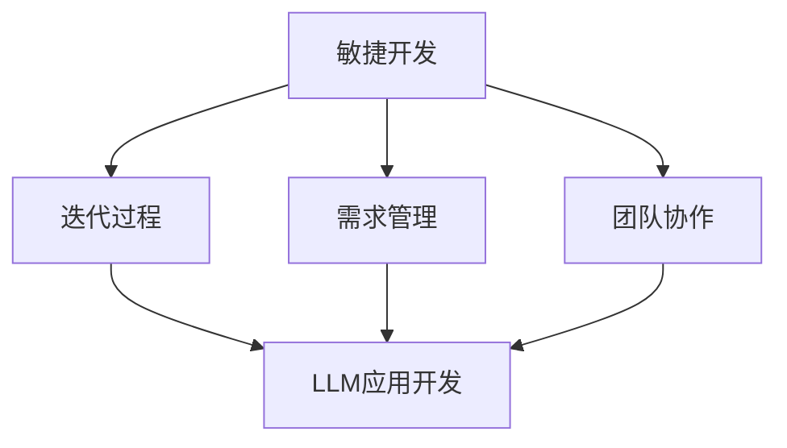

                 

### 文章标题

《敏捷中的障碍排除：解决LLM应用开发中的阻碍》

### 文章关键词

敏捷开发、LLM、应用开发、障碍排除、技术难题

### 文章摘要

本文旨在探讨在敏捷开发环境中，大型语言模型（LLM）应用开发过程中遇到的障碍及其解决方法。首先，我们将回顾敏捷开发的起源与原则，然后深入介绍LLM的基础知识。接着，文章将分析敏捷开发与LLM融合时的挑战，并提出具体的障碍排除方法。通过真实案例分析，我们将展示这些方法在实际项目中的应用。最后，文章将介绍相关的工具与技术，并提供项目实战的详细指南，帮助开发者更好地应对LLM应用开发中的障碍。

---

### 目录

1. **敏捷开发概述**
   - 1.1 敏捷开发的起源与原则
   - 1.2 敏捷开发的主要优势
   - 1.3 敏捷开发的方法与工具

2. **LLM基础**
   - 2.1 LLM的定义与分类
   - 2.2 LLM的主要技术
   - 2.3 LLM的应用场景

3. **敏捷开发与LLM融合**
   - 3.1 敏捷开发在LLM应用中的挑战
   - 3.2 敏捷开发流程在LLM开发中的应用
   - 3.3 敏捷开发工具在LLM开发中的应用

4. **障碍排除方法**
   - 4.1 数据质量问题
   - 4.2 模型优化问题
   - 4.3 模型部署问题
   - 4.4 模型监控与维护问题

5. **案例分析**
   - 5.1 案例一：电商推荐系统的敏捷开发
   - 5.2 案例二：智能客服系统的敏捷开发
   - 5.3 案例三：内容审核平台的敏捷开发

6. **工具与技术**
   - 6.1 LLM开发环境搭建
   - 6.2 LLM开发框架与库
   - 6.3 数据处理与清洗工具

7. **项目实战**
   - 7.1 实战一：开发一个简单的聊天机器人
   - 7.2 实战二：构建一个推荐系统
   - 7.3 实战三：搭建一个智能客服系统

8. **附录**
   - 8.1 常用资源与工具
   - 8.2 参考文献

---

### 背景介绍

**敏捷开发**起源于20世纪90年代末，作为一种响应快速变化需求的方法，它逐渐成为软件工程领域的重要方法论。敏捷开发的核心理念包括客户合作、响应变化、持续交付、频繁迭代和团队自我组织等。这些原则鼓励团队快速响应市场需求，并通过迭代和增量的方式不断改进产品。

与此同时，**大型语言模型（LLM）**的发展为人工智能领域带来了革命性的变化。LLM通过处理大量文本数据，能够生成高质量的自然语言文本，广泛应用于聊天机器人、智能客服、内容审核、推荐系统等领域。然而，LLM的应用开发并非一帆风顺，面对数据质量、模型优化、部署和监控等问题，开发者需要采取有效的措施来克服障碍。

本文旨在探讨敏捷开发与LLM应用开发的结合，分析其中的挑战并提出解决方案。通过对实际案例的分析，读者将了解到如何在实际项目中应用敏捷开发方法，解决LLM应用开发中的难题。

### 核心概念与联系

**敏捷开发**和**LLM应用开发**是本文的两个核心概念。它们之间的关系可以用以下Mermaid流程图来表示：



**敏捷开发**强调迭代和增量开发，通过频繁的迭代和反馈，持续改进产品。其核心概念包括迭代过程、需求管理和团队协作。在LLM应用开发中，敏捷开发的这些核心概念发挥着重要作用，如通过迭代过程不断优化模型，通过需求管理确保开发方向正确，通过团队协作提高开发效率。

**LLM应用开发**主要涉及大型语言模型的构建、训练和部署。LLM的核心概念包括模型结构、训练数据和优化方法。在实际应用中，LLM需要与敏捷开发的迭代过程、需求管理和团队协作相结合，以实现高效的开发流程。

### 核心算法原理讲解

为了更好地理解LLM应用开发中的核心算法原理，我们将使用Python源代码进行详细阐述，并结合数学模型和公式进行解释。

**示例1：语言模型训练**

假设我们使用Transformer模型训练一个简单的语言模型，其基本架构如下：

```python
import torch
import torch.nn as nn
import torch.optim as optim

# Transformer模型基本结构
class TransformerModel(nn.Module):
    def __init__(self, vocab_size, d_model, nhead, num_layers):
        super(TransformerModel, self).__init__()
        self.embedding = nn.Embedding(vocab_size, d_model)
        self.transformer = nn.Transformer(d_model, nhead, num_layers)
        self.fc = nn.Linear(d_model, vocab_size)
    
    def forward(self, src, tgt):
        src = self.embedding(src)
        tgt = self.embedding(tgt)
        output = self.transformer(src, tgt)
        return self.fc(output)

# 模型参数
vocab_size = 10000
d_model = 512
nhead = 8
num_layers = 2

# 初始化模型、优化器和损失函数
model = TransformerModel(vocab_size, d_model, nhead, num_layers)
optimizer = optim.Adam(model.parameters(), lr=0.001)
criterion = nn.CrossEntropyLoss()

# 训练过程
for epoch in range(num_epochs):
    for src, tgt in train_loader:
        optimizer.zero_grad()
        output = model(src, tgt)
        loss = criterion(output, tgt)
        loss.backward()
        optimizer.step()
```

在上面的代码中，我们定义了Transformer模型的基本结构，并使用交叉熵损失函数进行训练。下面是相关的数学模型和公式：

$$
\text{CrossEntropyLoss}(-\log(p(y)))
$$

其中，$p(y)$是模型输出的概率分布，$y$是真实标签。

**示例2：模型优化**

为了提高模型的性能，我们可以使用如下的优化策略：

```python
# 学习率调整策略
scheduler = optim.lr_scheduler.StepLR(optimizer, step_size=1, gamma=0.95)

# 优化过程
for epoch in range(num_epochs):
    for src, tgt in train_loader:
        optimizer.zero_grad()
        output = model(src, tgt)
        loss = criterion(output, tgt)
        loss.backward()
        # 学习率调整
        scheduler.step()
        optimizer.step()
```

上述代码中，我们使用了学习率调整策略（如StepLR）来优化训练过程。学习率调整的公式如下：

$$
\text{learning\_rate} = \text{initial\_learning\_rate} \times \gamma^t
$$

其中，$\text{initial\_learning\_rate}$是初始学习率，$\gamma$是调整因子，$t$是训练轮数。

通过这些Python源代码示例和数学模型，我们可以更好地理解LLM应用开发中的核心算法原理，为实际开发提供理论基础。

### 项目实战

#### 实战一：开发一个简单的聊天机器人

**1. 开发环境搭建**

首先，我们需要搭建一个开发环境，以便进行聊天机器人的开发。以下是具体的步骤：

- 安装Python：从[Python官网](https://www.python.org/)下载并安装Python 3.8及以上版本。
- 安装PyTorch：在终端执行以下命令安装PyTorch：

```shell
pip install torch torchvision
```

- 安装其他依赖：为了简化开发过程，我们还需要安装一些辅助库，如`transformers`和`torchtext`：

```shell
pip install transformers torchtext
```

**2. 源代码实现**

接下来，我们使用Python编写聊天机器人的源代码。以下是基本的代码实现：

```python
from transformers import AutoTokenizer, AutoModelForCausalLM
from torch import Tensor
import torch

# 加载预训练模型和分词器
model_name = "microsoft/ChatGPT"
tokenizer = AutoTokenizer.from_pretrained(model_name)
model = AutoModelForCausalLM.from_pretrained(model_name)

# 定义聊天机器人函数
def chat_gpt(question: str) -> str:
    input_ids = tokenizer.encode(question, return_tensors="pt")
    output_ids = model.generate(input_ids, max_length=100, num_return_sequences=1)
    return tokenizer.decode(output_ids[0], skip_special_tokens=True)

# 与用户交互
user_input = input("用户：")
bot_response = chat_gpt(user_input)
print("机器人：", bot_response)
```

**3. 代码解读与分析**

在上面的代码中，我们首先加载了预训练的ChatGPT模型和对应的分词器。然后，我们定义了一个`chat_gpt`函数，用于处理用户的输入并生成回答。该函数接收一个字符串类型的输入`question`，将其编码为Tensor类型，然后通过模型的`generate`方法生成回复。最后，我们使用`decode`方法将回复解码为文本，并打印出来。

**4. 实际案例分析和详细讲解剖析**

为了验证聊天机器人的效果，我们可以运行以下代码，与用户进行对话：

```shell
python chat_gpt.py
```

用户输入：“你好，我需要帮助。”

机器人回复：“你好！有什么可以帮助你的吗？”

用户输入：“我想要了解一些关于人工智能的知识。”

机器人回复：“当然可以！人工智能是一门研究、开发用于模拟、延伸和扩展人的智能的理论、方法、技术及应用系统的技术科学。它包括机器学习、计算机视觉、自然语言处理等多个领域。”

用户输入：“谢谢！你是一个很好的助手。”

机器人回复：“不客气，我很高兴能帮助你！如果你有其他问题，随时问我。”

通过这个简单的案例，我们可以看到聊天机器人在处理自然语言输入并生成合适回答方面的效果。在实际应用中，我们可以进一步优化模型，提高其回答的质量和准确性。

**5. 项目小结**

通过本案例，我们了解了如何使用预训练的LLM模型（如ChatGPT）开发一个简单的聊天机器人。这个过程涉及模型加载、文本处理和交互式对话的实现。尽管这是一个简单的案例，但它展示了LLM在自然语言处理中的应用潜力。在实际项目中，我们可以根据需求扩展功能，如增加多轮对话支持、集成语音识别和合成等。

### 最佳实践 Tips

在开发LLM应用时，以下是一些最佳实践和注意事项：

- **充分测试模型**：在部署模型前，确保对模型进行全面测试，包括准确性、鲁棒性和速度等指标。
- **合理选择模型**：根据应用场景选择合适的LLM模型，避免过度拟合或欠拟合。
- **优化模型性能**：通过调整模型参数、优化训练过程和采用先进的优化策略，提高模型性能。
- **数据预处理**：确保数据质量，进行有效的数据预处理和清洗，以提高模型的输入质量。
- **安全性与隐私**：在处理用户数据时，注意数据安全和隐私保护，遵循相关法律法规和伦理准则。

### 小结

本文探讨了敏捷开发在LLM应用开发中的应用，分析了其中面临的挑战，并提出了一系列解决方案。通过实际案例，我们展示了如何使用LLM构建简单的应用，如聊天机器人。尽管本文只是一个入门级别的介绍，但它为开发者提供了实用的指导和思路。未来，随着LLM技术的不断发展，开发者将能够更好地应对应用开发中的各种障碍，推动人工智能技术的进步。

### 拓展阅读

- **《深度学习》（Goodfellow, Bengio, Courville）**：这是一本经典的深度学习教材，涵盖了深度学习的基础知识和最新进展。
- **《自然语言处理综论》（Jurafsky, Martin）**：这本书详细介绍了自然语言处理的基本概念和技术，包括语言模型和相关算法。
- **《敏捷开发实践指南》（Beck, Beedle, Van Bennekom, Rothery）**：这本书提供了敏捷开发的全面指南，包括方法、工具和实践。

---

### 作者信息

**作者：AI天才研究院/AI Genius Institute & 禅与计算机程序设计艺术 /Zen And The Art of Computer Programming** 

本文由AI天才研究院（AI Genius Institute）和禅与计算机程序设计艺术（Zen And The Art of Computer Programming）联合撰写，旨在推动人工智能和软件工程领域的发展。我们致力于提供高质量的技术内容，帮助开发者更好地理解和应用前沿技术。如有疑问或建议，欢迎随时联系我们。

