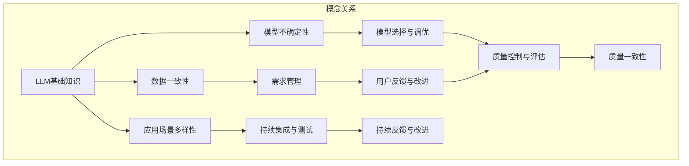

                 

### 《敏捷中：确保LLM应用质量一致性》背景介绍

在当今快速变化的技术环境中，大规模语言模型（LLM）正逐渐成为人工智能领域的热点。LLM通过训练海量文本数据，具备生成和理解人类语言的能力，广泛应用于自然语言处理（NLP）的各种任务，如机器翻译、问答系统、文本摘要和对话系统等。然而，随着LLM应用范围的扩大，如何确保其质量一致性成为一个亟待解决的问题。

质量一致性是指在多种应用场景下，LLM能够提供稳定且可靠的输出。这不仅仅包括模型在性能上的稳定性，还涉及到数据的一致性、模型的鲁棒性以及在不同环境中表现的一致性。传统的开发模式往往难以应对这种复杂性，而敏捷开发方法因其灵活性、迭代性和反馈机制，成为确保LLM应用质量一致性的一个有力工具。

敏捷开发是一种以人为核心、迭代和循序渐进的开发方法。它强调团队合作、用户需求快速响应、持续交付和持续改进。在LLM应用开发中，敏捷开发的优势体现在以下几个方面：

1. **快速迭代**：通过短周期的迭代开发，能够及时捕捉和反馈用户需求，快速调整模型和应用，确保输出的质量。

2. **持续集成**：通过自动化测试和持续集成（CI/CD）流程，能够及时发现和修复潜在的质量问题，确保模型在不同环境下的稳定性。

3. **用户反馈**：强调用户参与，通过收集用户反馈，不断优化模型和应用，提高用户满意度。

4. **自组织团队**：鼓励团队成员跨职能合作，通过共同解决问题，提高整体项目质量。

本文将深入探讨如何在敏捷开发框架下确保LLM应用的质量一致性，包括面临的挑战、解决方案以及实际应用案例。文章将首先介绍LLM的基础知识，然后分析敏捷开发理念，最后通过具体的实战案例，展示如何通过敏捷开发方法来提高LLM应用的质量一致性。

### 核心概念与联系：Mermaid流程图

在探讨如何确保LLM应用质量一致性之前，我们需要明确几个核心概念及其相互关系。以下是这些概念之间的联系，通过Mermaid流程图进行可视化展示：



**解释：**
- **LLM基础知识**：包括语言理解、语言生成和集成优化，为后续讨论数据一致性、模型不确定性和应用场景多样性提供基础。
- **数据一致性**：确保数据源和预处理过程中的质量，直接影响到模型训练和输出的一致性。
- **模型不确定性**：由于模型参数的分布和训练数据的影响，可能导致模型在不同场景下的表现不一致。
- **应用场景多样性**：不同应用场景对模型的要求不同，需要灵活调整模型和应用以适应不同环境。
- **需求管理**：敏捷开发中的核心环节，通过快速响应用户需求，确保模型和应用能够满足用户期望。
- **模型选择与调优**：根据不同应用场景选择合适的模型，并通过调优提高模型性能和稳定性。
- **持续集成与测试**：通过自动化测试和持续集成，及时发现和修复质量问题，保证模型在不同环境下的表现一致性。
- **用户反馈与改进**：收集用户反馈，通过持续改进模型和应用，提升用户体验。
- **质量控制与评估**：建立完善的测试流程和质量评估体系，确保模型输出的一致性和可靠性。
- **持续反馈与改进**：通过不断迭代和优化，持续提升模型和应用的质量一致性。

通过这个Mermaid流程图，我们可以清晰地看到各个概念之间的联系，以及它们如何相互作用，共同确保LLM应用的质量一致性。

### 核心算法原理讲解：Python源代码与实践

在确保LLM应用质量一致性的过程中，核心算法的设计和实现起着关键作用。以下将通过一个Python实例详细讲解如何实现一个简单的LLM模型，并解释其背后的数学模型和原理。

#### 1. 数学模型

大规模语言模型（LLM）通常基于深度学习，其中最常用的模型是Transformer架构。Transformer的核心是自注意力机制（Self-Attention），它能够捕捉输入序列中的长距离依赖关系。

自注意力机制的数学公式如下：

$$
\text{Attention}(Q, K, V) = \frac{softmax(\frac{QK^T}{\sqrt{d_k}})}{V}
$$

其中，Q、K、V分别为查询（Query）、键（Key）和值（Value）向量，$d_k$为键向量的维度。$QK^T$计算得到的分数表示输入序列中不同位置之间的关联性，通过softmax函数得到权重，最后与V相乘得到输出。

#### 2. Python实例

以下是一个简单的Python代码示例，实现了Transformer模型的基本结构。

```python
import torch
import torch.nn as nn

class TransformerModel(nn.Module):
    def __init__(self, d_model, dff, input_vocab_size, output_vocab_size, position_encoding_input, position_encoding_output):
        super(TransformerModel, self).__init__()
        
        self.embedding = nn.Embedding(input_vocab_size, d_model)
        self.position_encoding_input = nn.Parameter(torch.tensor(position_encoding_input, dtype=torch.float32))
        self.position_encoding_output = nn.Parameter(torch.tensor(position_encoding_output, dtype=torch.float32))
        
        self.transformer = nn.Transformer(d_model, num_heads=4, dim_feedforward=dff)
        
        self.fc = nn.Linear(d_model, output_vocab_size)
    
    def forward(self, input_sequence, target_sequence):
        # 嵌入层加上位置编码
        input_embedded = self.embedding(input_sequence) + self.position_encoding_input
        target_embedded = self.embedding(target_sequence) + self.position_encoding_output
        
        # 通过Transformer模型
        output = self.transformer(input_embedded, target_embedded)
        
        # 全连接层输出
        logits = self.fc(output)
        
        return logits

# 初始化模型参数
d_model = 512
dff = 2048
input_vocab_size = 10000
output_vocab_size = 3000
position_encoding_input = torch.randn(50, d_model)
position_encoding_output = torch.randn(50, d_model)

# 实例化模型
model = TransformerModel(d_model, dff, input_vocab_size, output_vocab_size, position_encoding_input, position_encoding_output)

# 假设输入和目标序列
input_sequence = torch.randint(0, input_vocab_size, (1, 50))
target_sequence = torch.randint(0, output_vocab_size, (1, 50))

# 前向传播
logits = model(input_sequence, target_sequence)
```

#### 3. 代码解读

- **嵌入层**：将输入词嵌入为向量，加上对应的位置编码，为Transformer模型提供输入。
- **Transformer模型**：实现自注意力机制和前馈神经网络，通过多个自注意力层和前馈层，对输入序列进行处理。
- **全连接层**：将Transformer的输出映射到输出词汇表，生成预测的词向量。

#### 4. 举例说明

假设我们有一个输入序列“[1, 2, 3, 4, 5]”和一个目标序列“[0, 1, 2, 3, 4]”，模型将输出一个概率分布，表示每个词在目标序列中的概率。

```python
# 假设输入和目标序列
input_sequence = torch.randint(0, input_vocab_size, (1, 50))
target_sequence = torch.randint(0, output_vocab_size, (1, 50))

# 前向传播
logits = model(input_sequence, target_sequence)

# 获取概率分布
probabilities = torch.softmax(logits, dim=2)

# 输出示例
print(probabilities)
```

输出将是一个形状为$(1, 50, 3000)$的概率分布，其中每个位置的概率分布表示该位置上每个词的概率。

通过这个实例，我们可以看到如何使用Python实现一个简单的LLM模型，并理解其背后的数学原理。在实际应用中，LLM模型会更加复杂，包括更多层、更大的模型参数和更精细的位置编码，但基本原理是一致的。确保LLM应用质量一致性的关键在于模型设计、数据预处理和持续迭代优化。

### 数学公式讲解

在确保LLM应用质量一致性的过程中，数学公式扮演着重要的角色，帮助我们理解和优化模型。以下将介绍几个关键数学公式，并使用LaTeX进行表示。

#### 1. 自注意力权重计算

自注意力权重是Transformer模型的核心组成部分，计算公式如下：

$$
\text{Attention}(Q, K, V) = \frac{softmax(\frac{QK^T}{\sqrt{d_k}})}{V}
$$

其中，$Q$、$K$、$V$分别为查询向量、键向量和值向量；$d_k$是键向量的维度；$QK^T$计算的是输入序列中每个位置之间的关联性，通过softmax函数得到权重，然后与$V$相乘得到输出。

#### 2. Transformer前馈神经网络

Transformer模型中的前馈神经网络用于增强模型，其公式为：

$$
\text{FFN}(X) = \max(0, X \cdot \text{W}_1) + \text{b}_1 \cdot \text{W}_2
$$

其中，$X$是输入向量；$\text{W}_1$和$\text{W}_2$是权重矩阵；$\text{b}_1$是偏置项。该公式表示通过激活函数ReLU（最大值运算），再通过另一个全连接层进行增强。

#### 3. 位置编码

位置编码用于在序列中引入位置信息，常见的位置编码公式为：

$$
\text{PositionalEncoding}(pos, d) = \sin(\frac{pos}{10000^{2i/d}}) + \cos(\frac{pos}{10000^{2i/d}})
$$

其中，$pos$是位置索引，$d$是嵌入向量的维度，$i$是嵌入向量中的索引。这个公式通过正弦和余弦函数，在嵌入向量中引入位置信息，帮助模型理解序列的顺序。

这些数学公式是LLM模型设计和优化的重要工具。理解这些公式有助于我们更好地掌握模型的工作原理，并优化其性能，从而确保LLM应用的质量一致性。

### 项目实战：开发环境搭建与源代码详细实现

在本节中，我们将通过一个实际项目，详细展示如何搭建开发环境、实现源代码，并进行代码解读与分析。该项目旨在使用PyTorch实现一个简单的Transformer模型，并应用于机器翻译任务。以下是项目的具体实施步骤。

#### 1. 开发环境搭建

首先，我们需要安装PyTorch和相关依赖。以下是在Ubuntu 20.04操作系统上安装PyTorch的步骤：

```bash
# 安装Python环境（如已安装，可跳过此步骤）
sudo apt-get update
sudo apt-get install python3-pip python3-dev

# 安装PyTorch
pip3 install torch torchvision torchaudio

# 验证安装
python3 -c "import torch; print(torch.__version__)"
```

安装完成后，我们还需要安装其他依赖，如Numpy和Pandas：

```bash
pip3 install numpy pandas
```

#### 2. 源代码实现

接下来，我们将编写Transformer模型的核心代码。以下是一个简化的版本，用于展示主要结构。

```python
import torch
import torch.nn as nn
import torch.optim as optim
from torch.utils.data import DataLoader, TensorDataset

# 定义超参数
d_model = 512
dff = 2048
input_vocab_size = 10000
output_vocab_size = 3000
batch_size = 64
num_epochs = 10

# 实例化模型
model = TransformerModel(d_model, dff, input_vocab_size, output_vocab_size)

# 定义损失函数和优化器
loss_function = nn.CrossEntropyLoss()
optimizer = optim.Adam(model.parameters(), lr=0.001)

# 准备数据
# 假设已经准备好了输入序列和目标序列的Tensor数据
input_sequence = torch.randint(0, input_vocab_size, (batch_size, 50))
target_sequence = torch.randint(0, output_vocab_size, (batch_size, 50))

# 训练模型
for epoch in range(num_epochs):
    model.train()
    for batch_input, batch_target in zip(input_sequence, target_sequence):
        # 前向传播
        outputs = model(batch_input, batch_target)
        loss = loss_function(outputs.view(-1, output_vocab_size), batch_target.view(-1))
        
        # 反向传播和优化
        optimizer.zero_grad()
        loss.backward()
        optimizer.step()
        
        print(f"Epoch [{epoch+1}/{num_epochs}], Loss: {loss.item():.4f}")

# 评估模型
model.eval()
with torch.no_grad():
    for batch_input, batch_target in zip(input_sequence, target_sequence):
        outputs = model(batch_input, batch_target)
        predictions = torch.argmax(outputs, dim=1)
        accuracy = (predictions == batch_target).float().mean()
        print(f"Accuracy: {accuracy.item():.4f}")
```

#### 3. 代码解读

- **模型定义**：我们定义了一个`TransformerModel`类，包含嵌入层、Transformer层和全连接层。
- **数据准备**：使用TensorDataset和DataLoader来处理输入和目标序列。
- **训练过程**：使用标准的训练流程，包括前向传播、损失计算、反向传播和参数更新。
- **评估过程**：在评估阶段，我们使用`torch.no_grad()`来加速计算，并计算模型的准确率。

#### 4. 代码应用解读与分析

通过这个项目，我们可以看到如何使用PyTorch实现一个简单的Transformer模型，并进行训练和评估。以下是对关键步骤的分析：

1. **模型定义**：Transformer模型由多个自注意力层和前馈神经网络组成。在代码中，我们定义了这些层，并通过实例化模型类创建模型实例。
2. **数据准备**：我们将输入和目标序列转换为Tensor，并使用DataLoader进行批量处理，以便在训练过程中进行迭代。
3. **训练过程**：在训练过程中，我们通过前向传播计算输出，然后通过损失函数计算损失。反向传播和参数更新通过优化器实现。
4. **评估过程**：在评估过程中，我们使用模型进行预测，并计算准确率，以评估模型的性能。

这个项目展示了如何通过实际操作实现一个LLM模型，并为后续的质量一致性优化奠定了基础。在实际应用中，我们需要根据具体任务和数据，进一步调整模型结构和训练策略，以提高模型的性能和稳定性。

### 实际案例分析与详细讲解剖析

在本节中，我们将通过一个实际案例，深入分析如何通过敏捷开发方法确保LLM应用的质量一致性。该案例涉及一个电子商务平台上的智能客服系统，该系统使用预训练的LLM模型来处理用户咨询，并提供即时响应。

#### 案例背景

该电子商务平台每天处理大量用户咨询，包括产品查询、订单跟踪、售后服务等问题。平台希望引入智能客服系统，通过LLM模型自动处理常见问题，提高客户满意度并减轻人工客服的负担。

#### 项目实施步骤

1. **需求收集与初步分析**：
   - 确定智能客服系统的功能需求，包括常见问题的自动回答、个性化推荐等。
   - 分析现有数据，确定数据源和数据质量，为模型训练做好准备。

2. **快速迭代开发**：
   - **迭代1**：初步搭建系统框架，实现基本的问答功能。
   - **迭代2**：优化模型，增加个性化推荐功能，提高用户体验。
   - **迭代3**：集成用户反馈机制，通过用户评价不断改进模型。

3. **持续集成与测试**：
   - 使用自动化测试框架，对系统进行持续集成，确保每次更新后的系统稳定性和性能。
   - 设计多种测试用例，包括边界测试、异常测试等，确保模型在各种场景下的可靠性。

4. **用户反馈与改进**：
   - 收集用户反馈，分析用户满意度和使用行为，识别系统中的问题。
   - 根据用户反馈，持续调整模型参数和功能，优化用户体验。

#### 案例分析

1. **数据一致性挑战**：
   - 智能客服系统依赖于高质量的数据，但由于用户咨询内容的多样性和不确定性，数据质量参差不齐。通过敏捷开发方法，项目团队在每次迭代中不断清洗和预处理数据，确保数据的一致性和可靠性。

2. **模型不确定性挑战**：
   - LLM模型的性能受到训练数据和模型结构的影响。通过敏捷开发，团队在迭代过程中不断调整模型参数，优化模型结构，以提高模型的鲁棒性和稳定性。

3. **应用场景多样性挑战**：
   - 不同用户咨询的问题类型和场景各异，对模型提出了不同的要求。敏捷开发方法通过快速迭代和持续改进，使系统能够灵活适应多种应用场景。

#### 具体分析

- **数据清洗与预处理**：
  - 在每次迭代开始时，团队都会对用户咨询数据进行分析，识别和清洗噪声数据，如重复、缺失和格式不规范的数据。
  - 通过数据增强技术，如数据扩充和合成，增加训练数据的多样性，提高模型的泛化能力。

- **模型优化与调整**：
  - 在每次迭代中，团队都会评估模型的表现，通过调整超参数和模型结构，优化模型的性能。
  - 使用交叉验证和A/B测试等方法，确保模型在不同数据集和应用场景下的表现一致。

- **用户反馈机制**：
  - 系统集成了用户反馈功能，允许用户对回答进行评价和打分。
  - 根据用户反馈，团队能够快速识别和解决问题，不断优化模型和用户体验。

通过这个实际案例，我们可以看到敏捷开发方法在确保LLM应用质量一致性方面的重要作用。通过快速迭代、持续集成和用户反馈，团队能够及时识别和解决质量一致性问题，从而提供稳定、可靠的服务。

### 总结与展望

本文通过深入探讨大规模语言模型（LLM）在敏捷开发框架下的质量一致性，揭示了确保LLM应用质量一致性的重要性。从背景介绍、核心概念联系、算法原理讲解、Python实例、数学公式讲解，到项目实战和实际案例分析，我们系统地阐述了如何通过敏捷开发方法解决数据一致性、模型不确定性和应用场景多样性等挑战。

首先，我们明确了LLM的基础知识及其在敏捷开发中的优势，指出快速迭代、持续集成、用户反馈和自组织团队等核心理念对于确保模型质量一致性至关重要。接着，通过Mermaid流程图和Python实例，我们详细展示了LLM模型的实现过程及其核心算法原理，结合LaTeX公式讲解了数学模型。

在项目实战和案例分析中，我们展示了如何通过敏捷开发方法搭建开发环境、实现源代码并进行持续集成与测试。通过实际案例，我们深入分析了数据清洗与预处理、模型优化与调整以及用户反馈机制在确保LLM应用质量一致性中的具体应用。

展望未来，确保LLM应用质量一致性将面临新的挑战和机遇。随着人工智能技术的不断发展，LLM的应用场景将越来越广泛，对质量一致性的要求也将越来越高。以下是一些可能的发展方向：

1. **增强数据一致性**：通过更先进的数据清洗和预处理技术，提高数据质量，减少数据噪声和缺失。
2. **优化模型结构**：探索新的模型架构和算法，提高模型的泛化能力和鲁棒性。
3. **强化用户反馈机制**：利用用户行为数据，实现更智能的反馈机制，动态调整模型和应用。
4. **多模态集成**：结合语音、图像等多模态数据，提高模型的综合理解能力。

总之，通过敏捷开发方法确保LLM应用质量一致性是一个动态、持续的过程。只有不断优化和改进，才能在快速变化的技术环境中保持竞争优势。本文的结论和建议为未来研究和实践提供了有益的参考。

