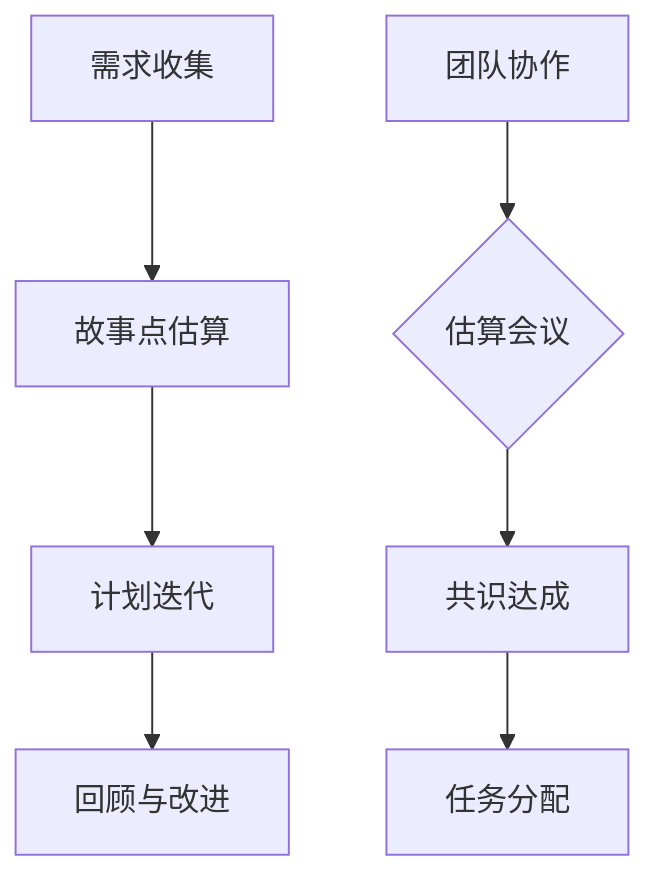

                 

### 文章标题：敏捷估算扑克：提高LLM应用开发团队的估算技能

#### 关键词：敏捷估算扑克，LLM应用开发，估算技能，团队协作，项目管理

#### 摘要：
本文深入探讨了敏捷估算扑克在大型语言模型（LLM）应用开发团队中的应用。通过分析LLM开发中的独特挑战，本文揭示了敏捷估算扑克的原理和实施步骤，并提供了实际案例，以展示如何通过这种创新方法提高团队的估算技能和项目管理效率。

---

### 引言

随着人工智能技术的快速发展，大型语言模型（LLM）已经成为许多企业和研究机构的焦点。LLM在自然语言处理、机器翻译、智能助手等领域展现出了巨大的潜力。然而，LLM应用开发并非一帆风顺，其过程充满了复杂性和不确定性。为了有效管理开发过程，提高估算准确性，开发团队需要采用有效的估算方法。

传统的估算方法往往依赖于经验和主观判断，难以适应快速变化的需求和市场动态。而敏捷估算扑克作为一种基于团队协作的估算工具，能够显著提升团队的估算能力和项目管理的透明度。本文将详细探讨敏捷估算扑克在LLM应用开发团队中的应用，并分享最佳实践。

### 敏捷估算扑克的基本原理

敏捷估算扑克是一种基于团队协作的估算技术，它通过直观的视觉工具——扑克牌，帮助团队成员进行工作量、时间长度和风险概率的估算。这种方法的核心在于通过快速迭代和持续反馈，提高团队对项目的理解和控制能力。

#### 核心概念与联系

为了更好地理解敏捷估算扑克的原理，我们可以通过以下Mermaid流程图来展示其核心概念和联系：



#### 估算会议

估算会议是敏捷估算扑克的核心环节。在会议中，团队成员会聚集在一起，通过讨论和投票来估算特定任务或故事点的工作量。以下是估算会议的步骤：

1. **故事点分解**：将大型任务分解为可管理的子任务或用户故事。
2. **准备扑克牌**：为每个故事点准备一套标有不同工作量（例如：1、2、3、5、8、13、21等）的扑克牌。
3. **洗牌与分发**：洗牌后，每位团队成员随机抽取一张扑克牌，并将其放在桌面上。
4. **估算与讨论**：团队成员根据自己手中的扑克牌进行估算，并轮流发言，解释自己的估算依据。
5. **共识达成**：通过讨论和投票，团队达成一致的工作量估算。
6. **记录结果**：将估算结果记录在项目看板上，以便后续跟踪和回顾。

#### 核心算法原理讲解

敏捷估算扑克的工作量估算通常采用斐波那契数列作为基础。斐波那契数列是一种递归数列，其特点是每一项都等于前两项之和。在估算扑克中，常用的数列包括1、2、3、5、8、13、21等，这些数字反映了任务工作量的相对大小。

以下是一个简单的Python代码示例，用于生成斐波那契数列：

```python
def fibonacci(n):
    if n <= 0:
        return []
    elif n == 1:
        return [1]
    elif n == 2:
        return [1, 2]
    else:
        fib_sequence = [1, 2]
        for i in range(2, n):
            fib_sequence.append(fib_sequence[-1] + fib_sequence[-2])
        return fib_sequence

fib_sequence = fibonacci(10)
print(fib_sequence)
```

输出结果为：

```
[1, 2, 3, 5, 8, 13, 21, 34, 55, 89]
```

这些数字可以用来表示故事点的工作量，团队成员可以根据自己的判断将这些数字分配给不同的任务。

#### 数学模型和公式

在敏捷估算扑克中，常用的数学模型包括：

- **工作量估算公式**：工作量 = 故事点数 × 单位工作量
- **风险概率公式**：风险概率 = 风险事件数 / 总任务数

其中，故事点数和单位工作量通常通过估算会议来确定，而风险事件数和总任务数可以通过项目计划和任务分解来确定。

#### 举例说明

假设一个团队正在开发一个LLM应用，他们需要估算一个包含5个用户故事的任务集。以下是具体的估算过程：

1. **需求分析**：将任务分解为5个用户故事。
2. **准备扑克牌**：为每个用户故事准备一套包含1、2、3、5、8、13、21的扑克牌。
3. **估算会议**：团队成员分别抽取扑克牌，进行估算和讨论。
4. **共识达成**：通过讨论，团队决定每个用户故事的工作量如下：
   - 用户故事1：5个故事点
   - 用户故事2：3个故事点
   - 用户故事3：8个故事点
   - 用户故事4：13个故事点
   - 用户故事5：21个故事点
5. **记录结果**：将估算结果记录在项目看板上，以便后续跟踪和回顾。

通过这种方式，团队可以更准确地估算整个任务集的工作量，从而为项目规划和进度跟踪提供可靠的数据支持。

### 敏捷估算扑克在LLM应用开发中的应用

LLM应用开发具有独特性，因此在估算过程中需要考虑多个因素。以下是一些关键应用场景和注意事项：

#### 应用场景

1. **需求变化管理**：LLM应用的需求通常变化较快，敏捷估算扑克可以帮助团队快速响应需求变化，调整估算结果。
2. **工作量分配**：通过估算，团队可以更公平地分配工作量，避免个别成员承担过多的工作压力。
3. **风险评估**：敏捷估算扑克可以用于评估项目风险，帮助团队提前识别和准备应对措施。
4. **项目进度跟踪**：通过持续估算和回顾，团队可以更好地跟踪项目进度，确保项目按时交付。

#### 注意事项

1. **团队共识**：确保团队成员在估算过程中达成共识，避免主观判断导致的估算偏差。
2. **透明度**：保持估算过程的透明度，让所有团队成员都能参与估算和讨论。
3. **持续改进**：通过回顾和反思，不断优化估算方法和流程，提高估算准确性。

### 实际案例

以下是一个敏捷估算扑克在LLM应用开发团队中的实际案例：

**案例背景**：一个团队正在开发一个基于大型语言模型（LLM）的智能问答系统。项目时间紧迫，需求不断变化，团队需要一种高效的方法来估算工作量和管理项目进度。

**实施过程**：

1. **需求收集**：团队与客户进行多次会议，收集并确认需求。
2. **故事点估算**：将需求分解为用户故事，并准备相应的估算扑克牌。
3. **计划迭代**：根据估算结果，团队制定迭代计划和里程碑目标。
4. **回顾与改进**：在每个迭代结束时，团队进行回顾会议，讨论估算过程中的问题和改进点。

**效果评估**：

- **工作量估算准确性**：通过估算会议，团队能够更准确地估算每个用户故事的工作量，减少了项目延期和资源浪费的风险。
- **团队协作效率**：团队成员在估算过程中进行充分讨论和协作，提高了团队的整体效率。
- **需求变更应对**：团队能够灵活调整估算结果，快速响应需求变化，确保项目顺利进行。

### 敏捷估算扑克的优化与改进

尽管敏捷估算扑克在LLM应用开发中展示了其优势，但仍然存在改进空间。以下是一些优化策略：

1. **引入概率估算**：除了工作量估算，还可以考虑引入概率估算，为任务完成时间提供更全面的预测。
2. **动态调整估算方法**：根据项目进展和团队反馈，不断调整和优化估算方法，提高估算准确性。
3. **自动化工具**：开发自动化工具，帮助团队进行估算和数据分析，减少人为错误。

### 总结与展望

敏捷估算扑克为LLM应用开发团队提供了一种有效的工作量估算和管理方法。通过团队协作和持续改进，敏捷估算扑克能够提高估算准确性，增强团队协作效率，为项目成功提供有力支持。

展望未来，随着人工智能技术的不断进步，敏捷估算扑克有望在更多领域得到应用。通过不断优化和扩展，敏捷估算扑克将成为项目管理和团队协作的重要工具。

### 作者信息

作者：AI天才研究院/AI Genius Institute & 禅与计算机程序设计艺术 /Zen And The Art of Computer Programming

---

通过本文，我们深入探讨了敏捷估算扑克在LLM应用开发团队中的应用。希望本文能为读者提供有价值的见解和实用的方法，帮助团队更好地管理项目，提高估算技能。未来，我们期待敏捷估算扑克在更多领域发挥其潜力，为人工智能应用的发展贡献力量。

