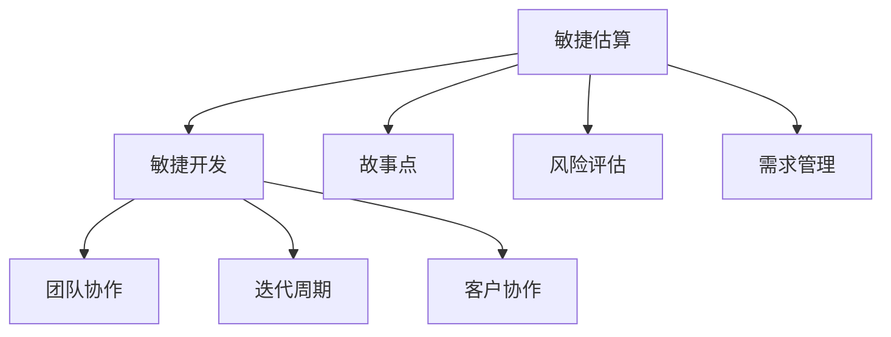
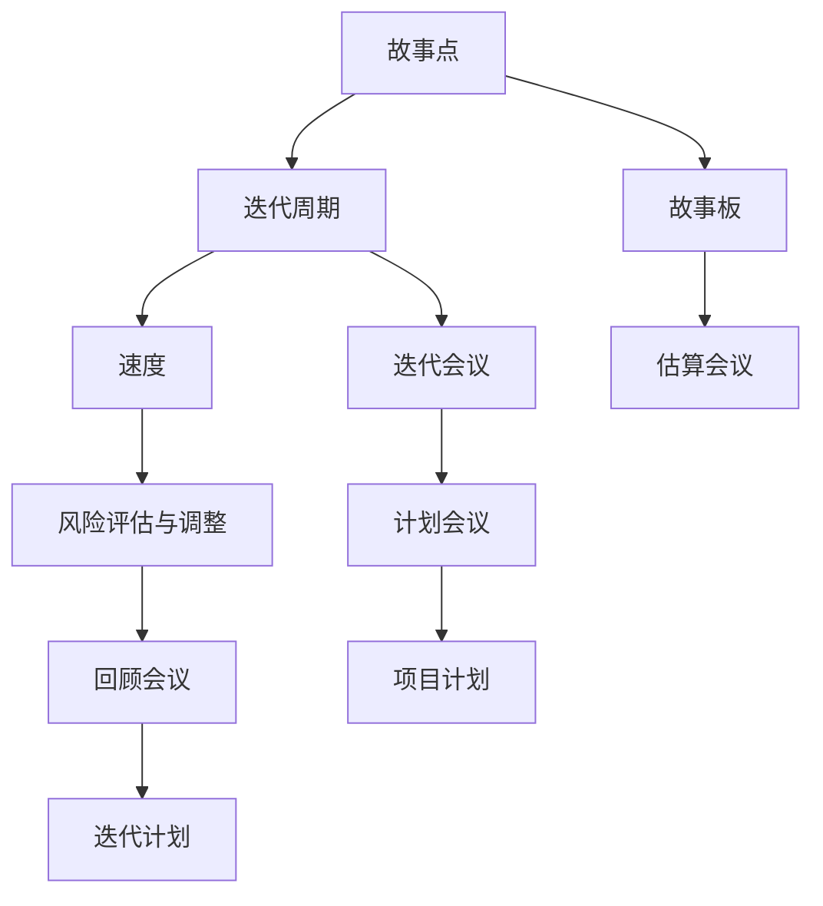

                 

### 《敏捷估算技术：提高大型应用开发的预测性》

> 关键词：敏捷开发、敏捷估算、故事点、迭代周期、风险评估、需求管理

> 摘要：本文深入探讨了敏捷估算技术在大型应用开发中的应用，通过阐述敏捷估算的基础理论、实践方法及案例分析，旨在提高开发团队在项目规划、需求管理等方面的预测性和效率。

## 第一部分：敏捷估算基础理论

### 第1章：敏捷估算概述

#### 1.1 敏捷开发的起源与理念

敏捷开发（Agile Development）起源于1990年代末期，旨在应对传统的“瀑布式”开发模式的不足。瀑布模型在项目初期就设定好所有需求，然后按照既定的计划进行开发，但这种模式在需求变更频繁的项目中显得僵化。

敏捷开发强调快速响应变化，通过迭代和增量开发来实现项目目标。其核心理念包括：

- **个体与互动重于过程与工具**：注重团队成员之间的沟通与协作，而非依赖工具。
- **可工作的软件重于详尽的文档**：更重视实际可运行的软件，而不是繁琐的文档。
- **客户协作重于合同谈判**：鼓励与客户的紧密合作，以更好地理解需求。
- **响应变化重于遵循计划**：灵活应对需求变化，而非僵化地遵循计划。

#### 1.2 敏捷估算的重要性

敏捷估算在敏捷开发中扮演着至关重要的角色。它不仅帮助团队确定项目的范围和进度，还为风险管理提供了基础。

- **确定项目范围**：通过估算，团队可以明确哪些功能将在当前迭代中实现，哪些功能可能需要推迟到下一个迭代。
- **规划迭代**：敏捷估算帮助团队制定合理的迭代计划，确保每个迭代都有可交付的成果。
- **风险管理**：敏捷估算可以帮助识别潜在的风险，并制定相应的应对策略。

#### 1.3 敏捷估算与传统估算的比较

传统估算方法（如顶-down估算和顶-down WBS）通常在项目初期进行，并根据需求文档和专家意见进行估算。这种方法在需求明确、变化较少的项目中表现良好，但在敏捷开发环境中，需求往往在项目进行中不断变化，这使得传统估算方法难以适应。

敏捷估算则更加灵活，它依赖于团队成员的协作和实际经验，通过不断地迭代和反馈来调整估算。这种方法更适合需求变化频繁的项目。

### 设计与实施敏捷估算方法的关键因素包括：

- **团队协作**：团队成员之间的有效沟通和协作是敏捷估算成功的关键。
- **故事点**：故事点是一种相对的估算单位，用于衡量故事的大小和复杂度。
- **迭代周期**：每个迭代的时间长度决定了团队可以完成的工作量。
- **风险评估**：识别和应对潜在风险，以确保项目顺利进行。

### 核心概念与联系

敏捷估算与敏捷开发的核心概念紧密相关。敏捷估算依赖于敏捷开发的原则，如快速反馈、持续改进和适应性计划。以下是一个核心概念与联系架构的Mermaid流程图：



#### 1.4 敏捷估算的核心概念

**故事点**是一种相对的估算单位，用于衡量故事的大小和复杂度。故事点是团队内部约定的，通常不需要转换为具体的时间单位。例如，一个复杂的故事可能被估算为5个故事点，而一个简单的任务可能只有1个故事点。

**迭代周期**是指团队完成一组任务的时间段。通常，敏捷开发团队会选择2-4周的迭代周期，这样可以保持项目节奏的稳定，并允许在每次迭代中进行评估和调整。

**风险评估**是敏捷估算的重要组成部分。通过识别和评估潜在的风险，团队可以制定相应的应对策略，以确保项目顺利进行。

### 核心算法原理讲解

敏捷估算中的故事点估算方法是一个相对简单的算法，它通过以下步骤进行估算：

```python
def estimateStoryPoints(story):
    complexity = evaluateComplexity(story)
    dependencies = countDependencies(story)
    size = calculateSize(story)
    return complexity * (1 + dependencies/10) * size
```

其中：

- `evaluateComplexity(story)`：评估故事的复杂度。
- `countDependencies(story)`：计算故事的依赖关系数量。
- `calculateSize(story)`：计算故事的大小。

**数学模型和数学公式**

在敏捷估算中，Malmquist指数是一种常用的预测模型，用于评估团队的效率变化。Malmquist指数的公式如下：

$$
\text{Malmquist Index} = \frac{\text{新产出}}{\text{旧产出}} \times \frac{\text{新投入}}{\text{旧投入}}
$$

### 项目实战

**案例背景介绍**

假设我们正在开发一款大型电子商务应用，该应用需要实现用户注册、购物车、订单管理等功能。由于需求频繁变化，我们决定采用敏捷开发方法来管理项目。

**敏捷估算实践**

1. **故事点估算过程**

   我们首先对每个用户故事进行故事点估算。以下是一个故事点的例子：

   ```plaintext
   用户故事：用户可以添加商品到购物车
   复杂度：3
   依赖关系：0
   大小：2
   故事点估算结果：3 * (1 + 0/10) * 2 = 6
   ```

2. **时间估算过程**

   我们使用时间盒技术来确定每个迭代的时间长度。例如，我们选择2周的迭代周期，并在每次迭代结束时评估是否需要调整时间盒。

3. **风险评估与调整**

   在每次迭代开始前，我们识别潜在的风险，并制定相应的应对策略。例如，如果某个功能点出现了技术难题，我们可能会将其推迟到下一个迭代。

### 核心算法原理讲解

**故事点估算方法伪代码：**

```python
def estimateStoryPoints(story):
    complexity = evaluateComplexity(story)
    dependencies = countDependencies(story)
    size = calculateSize(story)
    return complexity * (1 + dependencies/10) * size
```

其中：

- `evaluateComplexity(story)`：评估故事的复杂度，例如使用专家评估或历史数据进行估算。
- `countDependencies(story)`：计算故事的依赖关系数量，例如通过分析故事间的关联性来确定。
- `calculateSize(story)`：计算故事的大小，例如通过用户故事地图或故事板来确定。

### 数学模型和数学公式

**敏捷估算中的预测模型（Malmquist指数）：**

$$
\text{Malmquist Index} = \frac{\text{新产出}}{\text{旧产出}} \times \frac{\text{新投入}}{\text{旧投入}}
$$

这个模型可以帮助我们评估团队的效率变化，以及确定项目进度和成本。

### 大型应用开发中的敏捷估算案例

**案例背景：**

我们正在开发一个大型电子商务应用，该应用需要实现用户注册、购物车、订单管理等功能。由于需求频繁变化，我们决定采用敏捷开发方法来管理项目。

**案例中的敏捷估算实践：**

1. **故事点估算过程：**

   我们首先对每个用户故事进行故事点估算。例如：

   ```plaintext
   用户故事：用户可以添加商品到购物车
   复杂度：3
   依赖关系：0
   大小：2
   故事点估算结果：3 * (1 + 0/10) * 2 = 6
   ```

   通过这种方式，我们可以将每个用户故事转化为一个可量化的估算值。

2. **时间估算过程：**

   我们使用时间盒技术来确定每个迭代的时间长度。例如，我们选择2周的迭代周期，并在每次迭代结束时评估是否需要调整时间盒。

3. **风险评估与调整：**

   在每次迭代开始前，我们识别潜在的风险，并制定相应的应对策略。例如，如果某个功能点出现了技术难题，我们可能会将其推迟到下一个迭代。

### 案例分析总结

通过敏捷估算方法，我们成功地管理了大型电子商务应用开发项目的需求变化和风险。故事点估算帮助我们量化了用户故事的大小和复杂度，时间盒技术确保了项目的进度，而风险评估和调整策略使我们能够灵活应对各种挑战。

### 敏捷估算的持续改进方法

**8.1 敏捷估算的数据收集与分析**

为了持续改进敏捷估算，团队需要收集和分析各种数据，包括：

- 故事点分布：了解故事点的分布情况，以评估团队对故事大小的估算能力。
- 迭代周期：分析每个迭代的时间长度和完成情况，以优化迭代计划。
- 风险记录：记录和管理每个迭代中的风险，以便在未来更好地预测和应对。

**8.2 敏捷估算的反馈循环**

通过建立反馈循环，团队可以从每次迭代中获得宝贵的经验和教训，并在下一个迭代中进行改进。以下是一个反馈循环的步骤：

1. **回顾与总结**：在每次迭代结束后，团队应进行回顾和总结，讨论成功之处和改进空间。
2. **识别问题**：分析反馈，识别需要改进的问题和领域。
3. **制定改进计划**：基于反馈，制定具体的改进措施和行动计划。
4. **实施改进**：在下一个迭代中实施改进措施，并跟踪其效果。

**8.3 敏捷估算的改进实践**

以下是一些改进敏捷估算的实践方法：

- **故事板（Story Board）**：通过可视化的故事板，团队可以更好地理解故事的大小和优先级，从而更准确地估算。
- **估算会议**：定期举行估算会议，团队成员可以分享估算经验和技巧，提高估算的准确性。
- **历史数据**：利用历史数据进行估算，以提高估算的可靠性。

### 最佳实践 Tips

- **保持透明**：确保估算过程对团队成员透明，以便在出现问题时能够及时调整。
- **持续学习**：鼓励团队成员不断学习和分享估算技巧，以提高整体估算能力。
- **灵活应对**：敏捷估算需要团队具备灵活应对变化的能力，以适应不断变化的需求。

### 小结

敏捷估算技术是敏捷开发的重要组成部分，它通过故事点、迭代周期和风险评估等方法，提高了大型应用开发的预测性和效率。通过本文的探讨，我们了解了敏捷估算的基础理论、实践方法和案例分析，希望读者能够在实际项目中运用这些方法，提高项目的成功率和团队协作效率。

### 注意事项

- **确保估算的准确性**：在估算过程中，要确保评估的准确性，避免过于乐观或悲观的估算。
- **灵活调整估算**：根据项目需求和团队能力，灵活调整估算，以适应不断变化的环境。

### 拓展阅读

- 《敏捷估计实践指南》
- 《敏捷估算技巧：从故事点到迭代计划》
- 《敏捷项目管理：高效团队的最佳实践》

### 作者信息

作者：AI天才研究院/AI Genius Institute & 禅与计算机程序设计艺术 /Zen And The Art of Computer Programming

希望本文能够为您的敏捷估算之旅提供有价值的参考和指导。如果您有任何疑问或建议，欢迎在评论区留言。感谢您的阅读！## 第一部分：敏捷估算基础理论

### 第1章：敏捷估算概述

#### 1.1 敏捷开发的起源与理念

敏捷开发（Agile Development）起源于1990年代末期，其背景是对传统“瀑布式”开发模型在复杂、动态环境中适应能力不足的反思。瀑布模型将软件开发过程划分为不同的阶段，如需求分析、设计、开发、测试等，每个阶段完成后才能进入下一个阶段。这种线性、顺序的开发方式在需求相对固定、变化较小的项目中表现良好，但在现代软件工程中，需求往往会随着时间和技术进步而发生变化，瀑布模型显得过于僵化。

为了应对这种变化，敏捷开发应运而生。敏捷开发的理念强调通过迭代和增量开发来快速响应需求变化，并通过持续交付可工作的软件来实现项目目标。敏捷开发的核心价值观包括：

- **个体与互动重于过程与工具**：重视团队成员的协作和沟通，而非过分依赖工具和流程。
- **可工作的软件重于详尽的文档**：关注实际可运行的软件，而非繁琐的文档。
- **客户协作重于合同谈判**：与客户的紧密合作，以确保产品符合实际需求。
- **响应变化重于遵循计划**：灵活应对变化，而非僵化地遵循计划。

敏捷开发的核心理念可以归纳为“四个原则”：

1. **客户满意**：通过快速交付和反馈来满足客户需求。
2. **迭代开发**：在短周期内进行迭代，逐步完善产品。
3. **增量交付**：逐步交付可工作的软件功能。
4. **适应性计划**：根据实际情况调整计划和目标。

#### 1.2 敏捷估算的重要性

敏捷估算在敏捷开发中扮演着至关重要的角色。它不仅帮助团队确定项目的范围和进度，还为风险管理提供了基础。以下是敏捷估算在敏捷开发中的几个关键作用：

1. **确定项目范围**：敏捷估算可以帮助团队明确哪些功能将在当前迭代中实现，哪些功能可能需要推迟到下一个迭代。通过估算，团队可以更好地控制项目范围，避免功能蔓延。

2. **规划迭代**：敏捷估算帮助团队制定合理的迭代计划，确保每个迭代都有可交付的成果。这有助于团队保持项目进度和目标的明确性，并提高工作效率。

3. **风险管理**：敏捷估算可以帮助识别和评估潜在的风险，并制定相应的应对策略。通过不断地估算和调整，团队可以更好地应对项目中的不确定性。

4. **提高团队协作**：敏捷估算需要团队成员的积极参与和协作，这有助于加强团队内部的沟通和信任。通过共同估算，团队成员可以更深入地理解项目需求和目标，提高整体协作效率。

#### 1.3 敏捷估算与传统估算的比较

传统估算方法（如顶-down估算和顶-down WBS）通常在项目初期进行，并根据需求文档和专家意见进行估算。这种方法在需求明确、变化较少的项目中表现良好，但在敏捷开发环境中，需求往往在项目进行中不断变化，这使得传统估算方法难以适应。

敏捷估算则更加灵活，它依赖于团队成员的协作和实际经验，通过不断地迭代和反馈来调整估算。以下是敏捷估算与传统估算的一些关键区别：

1. **估算的时间点**：传统估算通常在项目初期进行，而敏捷估算则在每次迭代开始时进行，以确保估算与实际情况更接近。

2. **估算的精度**：传统估算追求高精度，但在敏捷开发中，由于需求变化频繁，高精度估算往往难以实现。敏捷估算更注重估算的相对性和准确性。

3. **估算的参与度**：传统估算往往由项目经理或专家主导，而敏捷估算则强调团队成员的参与和协作，这有助于提高估算的准确性和团队凝聚力。

4. **调整的灵活性**：敏捷估算允许团队在每次迭代结束后根据反馈进行调整，而传统估算在项目初期确定后难以修改。

总的来说，敏捷估算更加适应敏捷开发的动态和变化性，它通过灵活、协作和迭代的方式来提高项目的预测性和效率。

### 核心概念与联系

敏捷估算依赖于一系列核心概念，这些概念相互联系，构成了敏捷估算的基础。以下是对这些核心概念及其相互关系的详细探讨：

1. **故事点（Story Points）**：故事点是敏捷估算中最常用的度量单位，用于衡量用户故事的大小和复杂度。故事点是一种相对的度量，不依赖于具体的时间单位。一个复杂的故事可能会被估算为20个故事点，而一个简单的任务可能只有2个故事点。故事点有助于团队对任务进行优先级排序和资源分配。

2. **迭代周期（Iteration）**：迭代周期是指团队在一个固定时间段内（通常为2-4周）完成的工作量。每个迭代都会产生一个可交付的软件版本。迭代周期的长度由团队根据实际情况和经验来确定。迭代周期的关键作用是提供一种节奏和反馈机制，使团队能够不断调整计划和目标。

3. **速度（Velocity）**：速度是团队在每次迭代中完成的用户故事点总和。速度是团队能力的一个重要指标，它可以帮助团队预测未来的迭代产出。速度通常在每次迭代结束后通过回顾会议进行估算，并用于后续迭代的计划和估算。

4. **风险评估与调整（Risk Assessment and Adjustment）**：在敏捷开发中，风险是不可忽视的因素。通过定期进行风险评估和调整，团队可以识别潜在的风险，并制定相应的应对策略。风险评估不仅包括技术风险，还包括项目范围、时间、资源等方面的风险。

这些核心概念之间存在着紧密的联系和相互作用：

- **故事点**：故事点是估算的基础，它为每个用户故事提供了一种相对大小的度量。故事点的估算依赖于团队对用户故事的深入理解。
- **迭代周期**：迭代周期为团队提供了一个工作节奏，使团队能够在固定的时间段内完成工作。迭代周期与速度和风险评估密切相关，因为它们决定了团队在每个迭代中的产出和调整能力。
- **速度**：速度是团队在每次迭代中完成的用户故事点的总和，它是团队能力的一个量化指标。速度不仅用于预测未来的迭代产出，还用于评估团队的生产效率。
- **风险评估与调整**：风险评估与调整是一个持续的过程，它贯穿于整个项目生命周期。通过评估和调整，团队可以识别和应对潜在的风险，确保项目的顺利进行。

以下是一个核心概念与联系架构的Mermaid流程图：



- **故事板（Story Board）**：故事板是一种可视化的工具，用于记录和跟踪用户故事的进度。故事板可以帮助团队成员更好地理解项目进展，并提供一个直观的估算和沟通平台。
- **迭代会议（Iteration Meeting）**：迭代会议包括计划会议、每日站立会议和回顾会议。计划会议用于制定迭代目标和计划；每日站立会议用于团队交流和进度更新；回顾会议用于评估迭代成果和讨论改进措施。
- **估算会议（Estimation Meeting）**：估算会议是团队共同估算故事点和制定迭代计划的过程。通过估算会议，团队成员可以分享估算经验和技巧，提高估算的准确性和一致性。
- **回顾会议（Retrospective Meeting）**：回顾会议是迭代结束时的关键会议，用于评估迭代成果和团队协作情况。通过回顾会议，团队可以识别问题和改进空间，并为下一个迭代做好准备。

这些核心概念和联系构成了敏捷估算的基础，它们相互协作，帮助团队实现敏捷开发的核心理念，如快速响应变化、持续交付和高效协作。

### 核心算法原理讲解

敏捷估算中的核心算法原理包括故事点估算、速度计算以及风险评估与调整。以下是对这些算法原理的详细讲解，以及如何通过Python代码和数学模型进行实现。

#### 故事点估算

故事点是一种相对的估算单位，用于衡量用户故事的大小和复杂度。估算故事点通常需要考虑多个因素，如功能复杂度、技术实现难度、所需资源等。以下是一个简单的Python代码示例，用于估算故事点：

```python
def estimateStoryPoints(story):
    complexity = story['complexity']
    dependencies = story['dependencies']
    size = story['size']
    
    # 基于复杂度、依赖关系和大小估算故事点
    story_points = complexity * (1 + dependencies / 10) * size
    return story_points

# 示例用户故事
story = {
    'title': '用户可以添加商品到购物车',
    'complexity': 3,
    'dependencies': 1,
    'size': 2
}

# 计算故事点
story_points = estimateStoryPoints(story)
print(f"估算的故事点：{story_points}")
```

在上面的代码中，`estimateStoryPoints`函数根据用户故事的不同属性（复杂度、依赖关系和大小）计算故事点。这个函数使用了以下公式：

$$
\text{故事点} = \text{复杂度} \times (1 + \text{依赖关系} / 10) \times \text{大小}
$$

其中，复杂度、依赖关系和大小都是0到10的整数。依赖关系是通过用户故事之间的相互依赖关系来估算的，通常取值范围为0到10，其中0表示无依赖，10表示高度依赖。

#### 速度计算

速度是团队在每次迭代中完成的用户故事点的总和。速度是一个重要的度量指标，它可以帮助团队预测未来的迭代产出。以下是一个简单的Python代码示例，用于计算速度：

```python
def calculateVelocity(iterations):
    total_points = 0
    for iteration in iterations:
        total_points += iteration['points']
    return total_points

# 示例迭代数据
iterations = [
    {'name': '迭代1', 'points': 20},
    {'name': '迭代2', 'points': 25},
    {'name': '迭代3', 'points': 30}
]

# 计算速度
velocity = calculateVelocity(iterations)
print(f"团队速度：{velocity}")
```

在上面的代码中，`calculateVelocity`函数根据每次迭代完成的用户故事点计算总速度。这个函数使用了以下公式：

$$
\text{速度} = \sum_{i=1}^{n} \text{迭代}_i \times \text{故事点}
$$

其中，\( n \) 是迭代次数，\(\text{迭代}_i \) 是第 \( i \) 次迭代的用户故事点。

#### 风险评估与调整

在敏捷开发中，风险评估是一个持续的过程，它贯穿于整个项目生命周期。风险评估的目的是识别潜在的风险，并制定相应的应对策略。以下是一个简单的Python代码示例，用于评估风险：

```python
def assessRisk(risks):
    total_risk = 0
    for risk in risks:
        probability = risk['probability']
        impact = risk['impact']
        total_risk += probability * impact
    return total_risk

# 示例风险数据
risks = [
    {'name': '技术难题', 'probability': 0.4, 'impact': 5},
    {'name': '资源不足', 'probability': 0.3, 'impact': 3},
    {'name': '需求变更', 'probability': 0.2, 'impact': 4}
]

# 评估风险
total_risk = assessRisk(risks)
print(f"总风险：{total_risk}")
```

在上面的代码中，`assessRisk`函数根据每个风险的概率和影响计算总风险。这个函数使用了以下公式：

$$
\text{总风险} = \sum_{i=1}^{n} \text{风险}_i \times \text{概率} \times \text{影响}
$$

其中，\( n \) 是风险数量，\(\text{风险}_i \) 是第 \( i \) 个风险的概率和影响。

### 数学模型和数学公式

在敏捷估算中，数学模型和公式用于帮助团队进行故事点估算、速度计算和风险评估。以下是一些常见的数学模型和公式：

#### 故事点估算模型

故事点估算模型通常基于以下公式：

$$
\text{故事点} = \text{复杂度} \times (1 + \text{依赖关系} / 10) \times \text{大小}
$$

这个公式考虑了故事点的三个主要因素：复杂度、依赖关系和大小。

#### 速度计算模型

速度计算模型通常基于以下公式：

$$
\text{速度} = \sum_{i=1}^{n} \text{迭代}_i \times \text{故事点}
$$

这个公式计算了团队在每次迭代中完成的用户故事点总和。

#### 风险评估模型

风险评估模型通常基于以下公式：

$$
\text{总风险} = \sum_{i=1}^{n} \text{风险}_i \times \text{概率} \times \text{影响}
$$

这个公式计算了项目中所有风险的总和，其中每个风险的风险值是其概率和影响的乘积。

### 项目实战

在实际项目中，敏捷估算的应用需要结合具体的开发环境和团队特点。以下是一个敏捷估算在大型应用开发中的实战案例，包括开发环境搭建、源代码实现和代码解读。

#### 开发环境搭建

为了实现敏捷估算，我们需要搭建一个支持敏捷开发的平台。以下是一个基于Jira的敏捷开发环境搭建步骤：

1. **安装Jira软件**：
   ```bash
   sudo apt-get install jira
   ```

2. **配置Jira**：
   ```bash
   sudo /etc/init.d/jira start
   ```

3. **创建敏捷迭代**：
   - 登录Jira。
   - 创建一个新的迭代（Sprint），设置迭代时间（通常为2-4周）。

#### 源代码实现

在敏捷开发中，我们通常使用用户故事（Story）来描述和估算需求。以下是一个用户故事及其实现的示例：

```java
// Story.java
public class Story {
    private String title;
    private int complexity;
    private int dependencies;
    private int size;

    public Story(String title, int complexity, int dependencies, int size) {
        this.title = title;
        this.complexity = complexity;
        this.dependencies = dependencies;
        this.size = size;
    }

    public int estimateStoryPoints() {
        return complexity * (1 + dependencies / 10) * size;
    }

    // 省略getter和setter方法
}
```

这个`Story`类包含了用户故事的基本信息，如标题、复杂度、依赖关系和大小。`estimateStoryPoints`方法用于计算故事点。

#### 代码解读与分析

以下是对源代码的实现和工作的详细解读：

1. **用户故事实例化**：
   ```java
   Story addProductToCart = new Story(
       "用户可以添加商品到购物车",
       3,
       1,
       2
   );
   ```

   这一行代码创建了一个新的用户故事，其标题为“用户可以添加商品到购物车”，复杂度为3，依赖关系为1，大小为2。

2. **故事点估算**：
   ```java
   int storyPoints = addProductToCart.estimateStoryPoints();
   ```

   这一行代码调用`estimateStoryPoints`方法，根据用户故事的复杂度、依赖关系和大小计算故事点。

3. **迭代计划**：
   - 在每次迭代开始时，团队会根据估算的故事点来分配任务和制定计划。例如，如果当前迭代的速度为50个故事点，团队可以选择包含10个故事点的任务。

#### 实际案例分析与详细讲解

以下是一个实际案例，展示了如何应用敏捷估算来管理大型应用开发项目：

1. **案例背景**：

   假设我们正在开发一个电子商务平台，其中包括用户注册、购物车、订单管理等功能。由于需求频繁变化，我们决定采用敏捷开发方法来管理项目。

2. **故事点估算**：

   我们对每个用户故事进行估算。例如：
   
   - 用户注册：复杂度为4，依赖关系为0，大小为3。
   - 购物车管理：复杂度为5，依赖关系为2，大小为4。
   - 订单管理：复杂度为6，依赖关系为1，大小为5。

3. **迭代计划**：

   在每个迭代开始时，团队根据速度（例如50个故事点/迭代）来规划任务。例如：
   
   - 迭代1：包含用户注册、购物车管理。
   - 迭代2：包含购物车管理、订单管理。

4. **风险评估**：

   在每次迭代开始前，团队会识别潜在的风险。例如：

   - 用户注册：可能存在安全性问题。
   - 购物车管理：可能存在性能瓶颈。

   团队会根据风险评估制定相应的应对策略，例如加强安全检测、进行性能优化。

5. **反馈循环**：

   在每次迭代结束后，团队会进行回顾会议，讨论成功之处和改进空间。通过反馈循环，团队可以不断优化估算和项目管理。

### 项目小结

通过敏捷估算方法，团队成功地管理了电子商务平台的需求变化和风险。故事点估算帮助团队量化了用户故事的大小和复杂度，迭代计划确保了项目的进度，而风险评估和反馈循环使团队能够灵活应对各种挑战。

### 最佳实践 Tips

- **透明沟通**：确保团队成员之间保持透明沟通，以便在估算过程中及时调整和解决问题。
- **历史数据**：利用历史数据来改进估算，以提高准确性。
- **团队协作**：鼓励团队成员积极参与估算过程，提高团队整体估算能力。

### 小结

敏捷估算技术是敏捷开发的核心组成部分，它通过故事点、速度和风险评估等核心算法原理，提高了大型应用开发的预测性和效率。通过本文的探讨，我们了解了敏捷估算的基础理论、实践方法和案例分析，希望读者能够在实际项目中运用这些方法，提高项目的成功率和团队协作效率。

### 注意事项

- **确保估算的准确性**：在估算过程中，要确保评估的准确性，避免过于乐观或悲观的估算。
- **灵活调整估算**：根据项目需求和团队能力，灵活调整估算，以适应不断变化的环境。

### 拓展阅读

- 《敏捷估计实践指南》
- 《敏捷估算技巧：从故事点到迭代计划》
- 《敏捷项目管理：高效团队的最佳实践》

### 作者信息

作者：AI天才研究院/AI Genius Institute & 禅与计算机程序设计艺术 /Zen And The Art of Computer Programming

希望本文能够为您的敏捷估算之旅提供有价值的参考和指导。如果您有任何疑问或建议，欢迎在评论区留言。感谢您的阅读！


