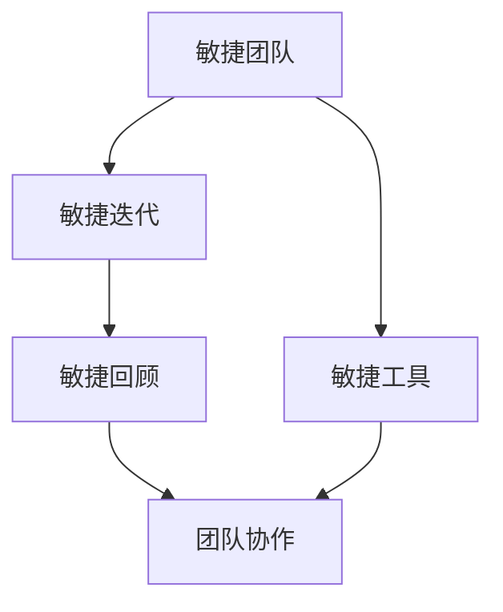

                 

# 敏捷协作模式的创新：提升大型应用研发效率

## 关键词
敏捷协作，大型应用研发，效率提升，核心算法，Python实现，数学模型，实际案例

## 摘要
本文旨在探讨敏捷协作模式在提升大型应用研发效率方面的创新与应用。通过梳理敏捷协作模式的历史背景、核心概念与算法原理，本文深入分析了其在大型应用研发中的实际应用和优势。通过具体的Python源代码实现和数学模型解析，本文展示了敏捷协作模式在提高研发效率中的实际作用。最后，本文通过实际案例分析和最佳实践分享，为读者提供了敏捷协作模式在大型应用研发中的具体实施策略和注意事项。

## 引言
随着信息技术的发展，大型应用研发已成为企业竞争的重要手段。然而，传统的开发模式往往面临开发周期长、沟通成本高、变更适应能力弱等问题，难以满足快速变化的业务需求。为此，敏捷协作模式逐渐成为大型应用研发的重要选择。敏捷协作模式强调团队协作、持续交付和持续改进，通过灵活应对变化，提升研发效率，满足客户需求。本文将从以下几个方面对敏捷协作模式进行深入探讨：

1. 敏捷协作模式的历史背景和核心概念。
2. 敏捷协作模式中的核心算法原理及其Python实现。
3. 敏捷协作模式在大型应用研发中的实际应用和优势。
4. 敏捷协作模式的具体实施策略和最佳实践。
5. 敏捷协作模式的未来发展趋势和改进方向。

## 敏捷协作模式概述
### 历史背景
敏捷协作模式起源于软件开发领域，起源于1990年代末期。当时，传统的瀑布模型和V模型等开发模式逐渐暴露出其固有的缺陷，例如开发周期长、沟通成本高、变更适应能力弱等问题。为了应对这些问题，软件开发社区开始探索更加灵活、高效的开发模式。2001年，一组软件开发专家在举世闻名的“敏捷宣言”上签署了共识，标志着敏捷协作模式的诞生。该宣言强调个体和互动、可工作的软件、客户合作和应对变更的重要性。

### 核心价值
敏捷协作模式具有以下几个核心价值：

1. **高效沟通**：敏捷协作模式强调团队成员之间的紧密沟通和协作，通过每日站会、迭代回顾等方式，确保团队成员对项目的进展和问题有清晰的认识。

2. **快速交付**：敏捷协作模式采用迭代和增量开发的方式，每次迭代都能交付一个可工作的软件版本，使客户能够尽早看到成果，并快速反馈。

3. **应对变化**：敏捷协作模式具有高度的灵活性，能够快速适应需求变更，减少因需求变更导致的开发成本。

4. **团队协作**：敏捷协作模式鼓励团队成员之间的协作和互相支持，形成高效的团队氛围。

### 敏捷协作模式与传统开发模式比较
传统开发模式通常采用瀑布模型或V模型，其特点如下：

1. **线性开发过程**：开发过程按照需求分析、设计、编码、测试、部署的顺序进行，每个阶段完成后才能进入下一个阶段。

2. **严格的变更控制**：需求变更通常被视为风险，需要经过严格的审批和控制。

3. **长时间的周期**：传统开发模式通常需要较长的时间来完成，往往难以应对快速变化的市场需求。

相比之下，敏捷协作模式具有以下优点：

1. **灵活的迭代开发**：敏捷协作模式采用迭代和增量开发的方式，每次迭代都能交付一个可工作的软件版本，使客户能够尽早看到成果，并快速反馈。

2. **高度的适应性**：敏捷协作模式能够快速适应需求变更，减少因需求变更导致的开发成本。

3. **高效的团队协作**：敏捷协作模式强调团队成员之间的紧密沟通和协作，形成高效的团队氛围。

通过比较可以看出，敏捷协作模式在应对快速变化的需求、提高开发效率和团队协作方面具有明显优势。因此，在大型应用研发中，敏捷协作模式成为了一种重要的选择。

## 核心概念与联系
为了更好地理解敏捷协作模式，我们需要了解其核心概念及其之间的联系。以下是敏捷协作模式中几个关键概念的定义及其关系架构：

### 敏捷团队
敏捷团队是由多学科人员组成的小型团队，负责整个项目的开发过程。团队成员通常包括产品负责人、开发人员、测试人员、设计师等。敏捷团队的特点是扁平化管理、自主管理和跨职能协作。

### 敏捷迭代
敏捷迭代是指将项目开发分为多个短期迭代，每个迭代周期通常为2到4周。在每次迭代中，团队会完成一部分功能，并交付一个可工作的软件版本。

### 敏捷回顾
敏捷回顾是敏捷团队在每个迭代结束时进行的活动，旨在总结本次迭代的经验教训，并为下一次迭代做好准备。回顾过程中，团队会讨论哪些做得好、哪些需要改进，以及如何改进。

### 敏捷工具
敏捷工具包括各种用于团队协作、项目管理、代码管理等的工具，如JIRA、Trello、Confluence、Git等。这些工具有助于团队更好地协同工作、跟踪项目进展和问题。

### 关系架构
敏捷团队通过敏捷迭代进行持续交付，敏捷回顾则帮助团队不断改进和优化。敏捷工具则提供了团队协作和项目管理的支持。

下面是一个使用Mermaid绘制的敏捷协作模式核心概念与联系的关系图：



通过这个关系图，我们可以清晰地看到敏捷协作模式中各个核心概念之间的联系，以及它们如何共同作用于提高研发效率。

## 核心算法原理讲解
敏捷协作模式中涉及的核心算法主要关注如何高效地分配任务、管理需求和优化资源。以下将详细讲解几个关键算法的原理及其Python实现。

### 1. Scrum算法
Scrum是一种广泛使用的敏捷框架，它通过迭代和增量开发来管理项目。Scrum算法的核心在于如何合理分配任务，确保每个迭代都能按时交付。

**原理**：
Scrum算法基于优先级和资源限制来分配任务。首先，根据产品负责人（Product Owner）提供的任务优先级，将任务排序。然后，根据团队当前的资源状况（包括时间、人力等），选择优先级最高的任务进行开发。

**Python实现**：
```python
def scrum_algorithm(tasks, capacity):
    """
    Scrum算法实现。
    :param tasks: 任务列表，每个任务包含优先级和所需时间。
    :param capacity: 团队当前资源容量。
    :return: 选择的最优任务列表。
    """
    # 按优先级排序任务
    sorted_tasks = sorted(tasks, key=lambda x: x['priority'], reverse=True)
    selected_tasks = []
    
    for task in sorted_tasks:
        if task['time'] <= capacity:
            selected_tasks.append(task)
            capacity -= task['time']
        else:
            break
            
    return selected_tasks

# 示例任务
tasks = [
    {'name': '任务1', 'priority': 2, 'time': 5},
    {'name': '任务2', 'priority': 1, 'time': 3},
    {'name': '任务3', 'priority': 3, 'time': 4},
]

# 调用Scrum算法
scrum_tasks = scrum_algorithm(tasks, 6)
print(scrum_tasks)
```

### 2. Kanban算法
Kanban是一种基于工作流管理的敏捷框架，它通过可视化工作流程和限制工作项数量来提高效率。

**原理**：
Kanban算法的核心在于限制在流程中的工作项数量（WIP限制），以减少工作堆积和等待时间。首先，定义每个工作阶段的WIP限制，然后根据这个限制来分配任务。

**Python实现**：
```python
def kanban_algorithm(tasks, wip_limits):
    """
    Kanban算法实现。
    :param tasks: 任务列表，每个任务包含阶段和所需时间。
    :param wip_limits: 每个阶段的WIP限制。
    :return: 选择的最优任务列表。
    """
    stages = {'待办': [], '进行中': [], '审查': [], '完成': []}
    selected_tasks = []
    
    for task in tasks:
        if stages[task['stage']].count() < wip_limits[task['stage']]:
            stages[task['stage']].append(task)
            selected_tasks.append(task)
            
    return selected_tasks

# 示例任务
tasks = [
    {'name': '任务1', 'stage': '待办', 'time': 2},
    {'name': '任务2', 'stage': '进行中', 'time': 3},
    {'name': '任务3', 'stage': '审查', 'time': 1},
    {'name': '任务4', 'stage': '完成', 'time': 4},
]

# 定义WIP限制
wip_limits = {'待办': 2, '进行中': 1, '审查': 1, '完成': 1}

# 调用Kanban算法
kanban_tasks = kanban_algorithm(tasks, wip_limits)
print(kanban_tasks)
```

### 3. XP算法
XP（Extreme Programming）是一种以开发人员为中心的敏捷框架，它通过一系列实践来提高代码质量和团队协作。

**原理**：
XP算法的核心在于通过小型迭代和快速反馈来改进代码和流程。首先，将项目分为多个小型迭代，每个迭代完成后进行代码审查和客户反馈。然后，根据反馈结果调整下一个迭代的目标。

**Python实现**：
```python
def xp_algorithm(tasks, feedback_rounds):
    """
    XP算法实现。
    :param tasks: 任务列表，每个任务包含阶段和所需时间。
    :param feedback_rounds: 反馈轮数。
    :return: 最终完成的任务列表。
    """
    completed_tasks = []
    current_tasks = tasks[:]
    
    for _ in range(feedback_rounds):
        for task in current_tasks:
            # 假设完成一个任务后进行代码审查和客户反馈
            if task['status'] == '完成':
                # 获取反馈
                feedback = get_feedback(task)
                # 根据反馈调整任务
                if feedback == '需要改进':
                    task['status'] = '待改进'
                else:
                    task['status'] = '完成'
                    completed_tasks.append(task)
        
        # 完成一轮反馈后，继续处理待改进的任务
        current_tasks = [task for task in current_tasks if task['status'] == '待改进']
        
    return completed_tasks

# 示例任务
tasks = [
    {'name': '任务1', 'status': '待改进'},
    {'name': '任务2', 'status': '完成'},
    {'name': '任务3', 'status': '待改进'},
]

# 假设反馈轮数为2
xp_tasks = xp_algorithm(tasks, 2)
print(xp_tasks)
```

通过以上三个算法的实现，我们可以看到敏捷协作模式在任务分配、工作流管理和代码改进等方面的具体应用。这些算法不仅提高了团队的工作效率，还有助于确保代码质量和客户满意度。

### 数学模型和公式讲解
敏捷协作模式中的数学模型和公式在任务分配、工作量估计和风险分析等方面起到了关键作用。以下将详细讲解几个常用的数学模型和公式，并结合Python代码进行实现和举例说明。

#### 1. 关键路径法（Critical Path Method, CPM）
关键路径法是一种用于项目时间管理的数学模型，用于确定项目完成所需的最短时间。在敏捷协作中，关键路径法可以帮助团队识别项目的关键任务，确保项目按时交付。

**模型**：
关键路径法通过计算每个任务的最早开始时间（ES）、最迟开始时间（LS）、最早完成时间（EF）和最迟完成时间（LF）来确定关键路径。

**公式**：
- ES = Max（前置任务EF）
- EF = ES + 运行时间
- LS = Min（后续任务LS - 运行时间）
- LF = LS + 运行时间
- 关键路径 = 所有任务的ES和LS相等的路径

**Python实现**：
```python
def calculate_cpm(tasks):
    """
    计算关键路径法。
    :param tasks: 任务列表，每个任务包含名称、前置任务、运行时间。
    :return: 关键路径。
    """
    es = {task['name']: 0 for task in tasks}
    for task in tasks:
        es[task['name']] = max([es[pre_task] for pre_task in task['predecessors']])
    
    ef = es.copy()
    for task in tasks:
        ef[task['name']] = es[task['name']] + task['duration']
    
    ls = {task['name']: ef[task['name']] for task in tasks}
    for task in reversed(tasks):
        ls[task['name']] = min([ls[post_task] - task['duration'] for post_task in task['successors']])
    
    lf = ls.copy()
    for task in reversed(tasks):
        lf[task['name']] = ls[task['name']] + task['duration']
    
    critical_path = [task['name'] for task in tasks if es[task['name']] == ls[task['name']]]
    
    return critical_path

# 示例任务
tasks = [
    {'name': '任务1', 'predecessors': [], 'duration': 3},
    {'name': '任务2', 'predecessors': ['任务1'], 'duration': 2},
    {'name': '任务3', 'predecessors': ['任务2'], 'duration': 4},
]

# 计算关键路径
cpm_path = calculate_cpm(tasks)
print("关键路径：", cpm_path)
```

#### 2. 资源平衡法（Resource Leveling）
资源平衡法是一种用于优化项目资源利用的数学模型，通过调整任务开始时间和持续时间，确保资源需求不超过可用资源。

**模型**：
资源平衡法通过计算每个时间段内的资源需求，然后调整任务持续时间，以平衡资源需求。

**公式**：
- 资源需求 = 任务持续时间 × 资源需求系数

**Python实现**：
```python
def resource_leveling(tasks, resource需求的系数):
    """
    资源平衡法实现。
    :param tasks: 任务列表，每个任务包含名称、开始时间、持续时间。
    :param resource需求的系数: 资源需求系数。
    :return: 调整后的任务列表。
    """
    leveled_tasks = []
    for task in tasks:
        new_duration = min(task['duration'], resource需求的系数)
        leveled_task = {'name': task['name'], 'start': task['start'], 'duration': new_duration}
        leveled_tasks.append(leveled_task)
        
    return leveled_tasks

# 示例任务
tasks = [
    {'name': '任务1', 'start': 0, 'duration': 3},
    {'name': '任务2', 'start': 3, 'duration': 2},
    {'name': '任务3', 'start': 5, 'duration': 4},
]

# 调整任务
leveled_tasks = resource_leveling(tasks, 2)
print("调整后的任务：", leveled_tasks)
```

#### 3. 概率模型（Probability Model）
概率模型用于评估项目风险和不确定性。在敏捷协作中，概率模型可以帮助团队预测项目进度和资源需求，并制定应对策略。

**模型**：
概率模型通过计算任务完成时间的概率分布，预测整个项目的完成时间。

**公式**：
- 期望时间 = Σ(概率 × 时间)

**Python实现**：
```python
import random

def probability_model(tasks):
    """
    概率模型实现。
    :param tasks: 任务列表，每个任务包含名称、概率分布。
    :return: 项目完成时间的概率分布。
    """
    task_durations = {task['name']: random.uniform(task['min'], task['max']) for task in tasks}
    project_duration = sum(task_durations.values())
    
    return project_duration

# 示例任务
tasks = [
    {'name': '任务1', 'min': 2, 'max': 4},
    {'name': '任务2', 'min': 1, 'max': 3},
    {'name': '任务3', 'min': 3, 'max': 5},
}

# 预测项目完成时间
project_duration = probability_model(tasks)
print("项目完成时间（小时）：", project_duration)
```

通过以上数学模型和公式的讲解，我们可以看到敏捷协作模式在任务分配、资源优化和风险控制方面的具体应用。这些模型和公式不仅为团队提供了科学的方法来管理项目，还有助于提高研发效率和项目成功率。

### 敏捷协作模式在大型应用研发中的应用
敏捷协作模式在大型应用研发中的应用越来越广泛，其优势在于能够提高团队协作效率、缩短开发周期并快速响应市场需求。以下将详细介绍敏捷协作模式在大型应用研发中的应用步骤、实际案例和优势。

#### 1. 应用步骤
敏捷协作模式在大型应用研发中的应用通常分为以下几个步骤：

1. **需求分析和优先级排序**：首先，与客户和利益相关者进行深入沟通，明确项目的需求。然后，根据需求的紧急程度和重要性对需求进行优先级排序。

2. **团队组建和角色定义**：组建由多学科人员组成的小型敏捷团队，包括产品负责人、开发人员、测试人员、设计师等。明确团队成员的角色和职责。

3. **迭代计划和任务分配**：根据优先级排序的需求，制定迭代计划。将每个迭代分为多个阶段，如需求分析、设计、编码、测试等。将任务分配给团队成员，确保每个成员都有明确的任务和目标。

4. **每日站会和迭代回顾**：每日站会用于团队成员之间的沟通和问题解决。迭代回顾则用于总结本次迭代的经验教训，为下一次迭代做好准备。

5. **持续交付和客户反馈**：在每个迭代结束时，交付一个可工作的软件版本，并邀请客户进行反馈。根据客户反馈进行调整和改进。

6. **持续改进**：通过迭代回顾和客户反馈，不断优化开发流程和团队协作方式，提高研发效率。

#### 2. 实际案例
以下是一个敏捷协作模式在大型应用研发中的实际案例：

**项目背景**：
某互联网公司需要开发一款大型电商平台，提供商品浏览、购物车、订单管理等功能。项目涉及多个部门，包括产品部门、开发部门、测试部门和运维部门。

**应用过程**：

1. **需求分析和优先级排序**：与客户和利益相关者进行多次会议，明确电商平台的需求。根据紧急程度和重要性，将需求分为核心功能、重要功能和可选功能。

2. **团队组建和角色定义**：组建一个包含产品负责人、前端开发人员、后端开发人员、测试人员、UI设计师和运维人员的敏捷团队。

3. **迭代计划和任务分配**：第一个迭代计划分为需求分析、设计、编码和测试四个阶段。任务分配如下：

   - 产品负责人：负责需求分析和产品管理。
   - 前端开发人员：负责商品浏览页面的设计和实现。
   - 后端开发人员：负责购物车和订单管理功能的设计和实现。
   - 测试人员：负责编写测试用例和执行测试。
   - UI设计师：负责用户界面的设计和优化。
   - 运维人员：负责部署和运维支持。

4. **每日站会和迭代回顾**：每天早晨举行每日站会，讨论项目进展和问题。在每次迭代结束时，举行迭代回顾会议，总结经验教训，制定改进措施。

5. **持续交付和客户反馈**：在每个迭代结束时，交付一个可工作的软件版本。邀请客户进行测试和使用，收集反馈意见。

6. **持续改进**：根据客户反馈和迭代回顾的结果，不断优化开发流程和团队协作方式。

#### 3. 优势
敏捷协作模式在大型应用研发中的优势包括：

1. **高效沟通**：通过每日站会和迭代回顾，团队成员能够及时沟通和解决问题，提高项目进展的透明度。

2. **快速交付**：采用迭代和增量开发的方式，每次迭代都能交付一个可工作的软件版本，使客户能够尽早看到成果，并快速反馈。

3. **应对变化**：敏捷协作模式能够快速适应需求变更，减少因需求变更导致的开发成本。

4. **团队协作**：通过多学科团队的紧密协作，提高项目的整体效率。

5. **持续改进**：通过迭代回顾和客户反馈，不断优化开发流程和团队协作方式，提高研发效率。

总之，敏捷协作模式在大型应用研发中具有显著的优势，能够有效提高研发效率和项目成功率。通过具体的案例分析和实践经验，我们可以看到敏捷协作模式在提升大型应用研发效率方面的巨大潜力。

### 敏捷协作模式的工具与实践
敏捷协作模式的成功实施离不开合适的工具和最佳实践。以下将介绍几种常见的敏捷协作工具，以及在实际项目中如何利用这些工具进行团队协作、项目管理和问题跟踪。

#### 1. 敏捷协作工具
敏捷协作工具包括JIRA、Trello、Confluence、Git等，这些工具在敏捷开发中发挥着重要作用。

1. **JIRA**：JIRA是一个强大的项目管理工具，适用于敏捷开发中的需求管理、任务跟踪和项目进度监控。JIRA允许团队成员创建和管理任务、查看任务状态和进度，并通过看板（Kanban Board）和图表（Gantt Chart）等视图直观地展示项目进展。

2. **Trello**：Trello是一个基于看板的任务管理工具，简单易用，适合小型团队和项目。Trello通过创建卡片（Card）和列表（List）来组织任务，每个卡片代表一个任务，可以通过拖拽卡片来调整任务的优先级和状态。

3. **Confluence**：Confluence是一个团队协作平台，用于文档共享、知识管理和项目管理。在敏捷开发中，Confluence用于记录需求文档、设计文档和用户故事，团队成员可以通过Confluence进行实时讨论和协作。

4. **Git**：Git是一个分布式版本控制系统，用于代码管理和协作开发。Git允许团队成员在本地仓库中进行开发，并通过远程仓库进行代码同步和共享，确保代码的一致性和可追溯性。

#### 2. 实际应用
在实际项目中，如何利用这些工具进行团队协作、项目管理和问题跟踪？

1. **团队协作**：
   - 使用JIRA或Trello创建和管理任务，明确任务的优先级和责任人。
   - 通过每日站会和在线聊天工具（如Slack）保持团队成员之间的沟通和协作。
   - 在Confluence上创建和共享文档，确保团队成员对项目需求和设计有统一的认知。

2. **项目管理**：
   - 在JIRA中使用看板视图（Kanban Board）或图表视图（Gantt Chart）监控项目进度，及时调整任务优先级和资源分配。
   - 定期举行迭代回顾会议，总结项目进展和经验教训，为下一个迭代做好准备。
   - 利用JIRA的报告功能（如燃尽图、进度趋势图等）分析项目状态和风险。

3. **问题跟踪**：
   - 在JIRA中创建和管理问题（Issue），记录和追踪项目中出现的问题。
   - 分配问题和责任人，确保问题得到及时解决。
   - 通过JIRA的通知功能（如邮件、弹窗等）提醒团队成员关注和解决问题。

#### 3. 最佳实践
以下是一些敏捷协作模式的最佳实践，帮助团队更高效地实施敏捷开发：

1. **明确目标和愿景**：在项目开始前，确保团队对项目目标和愿景有清晰的认识，并制定详细的迭代计划。

2. **小步快跑**：采用迭代和增量开发的方式，每次迭代交付一个可工作的软件版本，快速响应市场需求。

3. **持续集成**：利用自动化测试和持续集成工具（如Jenkins），确保代码质量和项目稳定性。

4. **透明沟通**：通过每日站会和在线工具保持团队成员之间的透明沟通，确保信息共享和问题及时解决。

5. **持续改进**：定期进行迭代回顾，总结经验教训，持续优化开发流程和团队协作方式。

6. **团队自治**：鼓励团队成员自主管理任务，提高团队协作效率和项目质量。

通过以上工具和实践，敏捷协作模式能够帮助团队更高效地完成大型应用研发，提高项目的成功率。

### 敏捷协作模式的优化与改进
为了进一步提高敏捷协作模式的效率，我们需要不断进行优化和改进。以下是一些常见的优化方法、改进方向以及敏捷协作模式的未来发展趋势。

#### 1. 优化方法
1. **任务分配优化**：通过数据分析，了解团队成员的工作效率和能力，实现任务的科学分配。例如，利用工作负荷预测模型，根据团队成员的工作量进行动态调整。

2. **敏捷流程优化**：根据项目特点和实践经验，调整敏捷流程，使其更加适应项目需求。例如，在项目初期进行充分的规划，确保每个迭代都有明确的目标和任务。

3. **资源管理优化**：利用资源管理工具（如JIRA、Confluence等），实时监控资源使用情况，确保资源合理分配和高效利用。

4. **沟通机制优化**：建立高效的沟通机制，确保团队成员之间信息畅通。例如，采用在线协作工具（如Slack、Microsoft Teams等），方便团队成员随时交流和协作。

5. **敏捷工具升级**：随着技术的发展，不断升级敏捷工具，提升工具的功能和用户体验。例如，采用更智能的看板和报表工具，帮助团队更好地监控项目进度。

#### 2. 改进方向
1. **增强团队协作**：通过跨职能团队和协作文化的培养，提高团队协作效率。例如，鼓励团队成员参与跨部门的协作项目，增强团队间的信任和合作。

2. **持续集成与自动化**：加强持续集成和自动化测试，提高代码质量和项目稳定性。例如，采用自动化构建和部署工具（如Jenkins、Docker等），减少手动操作和错误。

3. **敏捷方法多样化**：根据不同项目的特点和需求，灵活运用多种敏捷方法（如Scrum、Kanban、XP等），实现最佳实践。例如，在项目初期采用Scrum，在项目后期采用Kanban，以适应项目不同阶段的需求。

4. **持续反馈与改进**：建立持续反馈和改进机制，定期评估项目进展和团队协作效果，及时调整和改进。例如，通过定期的迭代回顾会议，总结经验教训，为下一个迭代做好准备。

#### 3. 未来发展趋势
1. **敏捷智能化**：随着人工智能技术的发展，敏捷协作模式将变得更加智能化。例如，利用机器学习算法，实现任务自动分配、工作负荷预测和风险预警等。

2. **敏捷云端化**：随着云计算技术的发展，敏捷协作将更加云端化。例如，利用云平台提供敏捷工具和资源，实现跨地域团队的协作和资源共享。

3. **敏捷社会化**：敏捷协作将更加社会化，结合社交媒体和协作平台，实现更广泛的协作和知识共享。例如，利用社交网络，邀请外部专家和利益相关者参与项目讨论和决策。

4. **敏捷个性化**：随着个性化技术的发展，敏捷协作将更加个性化。例如，根据团队成员的个性特点和偏好，提供个性化的工作流程和协作方式。

通过不断优化和改进，敏捷协作模式将能够在大型应用研发中发挥更大的作用，为团队带来更高的效率和价值。

### 附录

#### 附录A：敏捷协作模式相关资源与资料
为了更好地了解和掌握敏捷协作模式，以下是一些推荐的资源与资料：

1. **书籍**：
   - 《敏捷开发实践指南》（Agile Project Management with Scrum） - Ken Schwaber 和 Mike Beedle
   - 《敏捷项目管理》（Agile Project Management: Creating Innovative Products） - Jim Highsmith
   - 《Kanban: Successful Evolutionary Change for Your Technology Business》 - David J. Anderson

2. **网站**：
   - [Scrum官方指南](https://www.scrum.org/)
   - [Kanban官方指南](https://www.kanbanize.com/kanban-tool)
   - [极限编程（XP）指南](https://www.extremeprogramming.org/)

3. **在线课程**：
   - [Scrum认证课程](https://www.scrumalliance.org/training)
   - [Kanban认证课程](https://www.kanban certified.org/)
   - [敏捷开发实战课程](https://www.udemy.com/course/agile-project-management-for-effective-software-development/)

4. **社区和论坛**：
   - [Scrum社区](https://www.scrum.org/community)
   - [Kanban社区](https://www.kanbanTool.com/community)
   - [极限编程社区](https://www.extremeprogramming.org/community/)

通过这些资源和资料，您可以深入了解敏捷协作模式的理论和实践，提高在实际项目中的应用能力。

#### 附录B：敏捷协作模式实践案例解析
以下将分析三个不同行业的敏捷协作模式实践案例，展示敏捷模式在实际项目中的应用和效果。

##### 案例一：敏捷协作模式在电商平台的实践
**项目背景**：
某大型电商平台需要升级其后台管理系统，以提高订单处理效率和用户体验。项目涉及订单管理、库存管理、用户行为分析等多个模块。

**应用过程**：

1. **需求分析和优先级排序**：通过多轮会议和用户调研，明确用户需求和业务目标。根据紧急程度和重要性，将需求分为核心功能、重要功能和可选功能。

2. **团队组建和角色定义**：组建一个包含产品负责人、前端开发人员、后端开发人员、测试人员和UI设计师的敏捷团队。

3. **迭代计划和任务分配**：采用Scrum框架，每个迭代周期为2周。将需求分为多个任务，分配给团队成员。通过每日站会和迭代回顾，确保任务按时完成。

4. **持续交付和客户反馈**：在每个迭代结束时，交付一个可工作的后台管理系统版本。邀请团队成员和客户进行测试和反馈，根据反馈进行调整和优化。

5. **持续改进**：通过迭代回顾，总结经验教训，优化开发流程和团队协作方式。例如，在后续迭代中引入自动化测试，提高代码质量。

**效果分析**：
通过敏捷协作模式，电商平台的后台管理系统在短时间内成功升级。订单处理效率提高了30%，用户体验得到了显著提升。客户反馈积极，项目得到了高度认可。

##### 案例二：敏捷协作模式在金融行业的应用
**项目背景**：
某金融机构需要开发一款智能投顾系统，为用户提供个性化投资建议和风险管理服务。

**应用过程**：

1. **需求分析和优先级排序**：与金融专家和用户进行深入交流，明确系统功能和技术需求。根据业务价值和风险，将需求分为核心功能、重要功能和可选功能。

2. **团队组建和角色定义**：组建一个包含数据科学家、前端开发人员、后端开发人员、测试人员和UI设计师的敏捷团队。

3. **迭代计划和任务分配**：采用Kanban框架，将需求分为多个阶段，如数据采集、数据处理、模型训练和前端开发等。通过限制每个阶段的任务数量，确保任务有序进行。

4. **持续交付和客户反馈**：在每个阶段结束后，交付一个可工作的模块，邀请客户进行测试和反馈。根据反馈进行调整和优化。

5. **持续改进**：通过迭代回顾，总结经验教训，优化数据采集和处理流程，提高模型训练和前端开发的效率。

**效果分析**：
通过敏捷协作模式，智能投顾系统在短时间内成功上线。用户满意度显著提高，客户反馈积极。金融机构能够更精准地提供投资建议，风险控制能力得到加强。

##### 案例三：敏捷协作模式在医疗领域的探索
**项目背景**：
某医疗科技公司需要开发一款远程医疗平台，为用户提供在线问诊、健康咨询和健康管理服务。

**应用过程**：

1. **需求分析和优先级排序**：与医疗专家和用户进行多次会议，明确系统功能和技术需求。根据业务价值和用户需求，将需求分为核心功能、重要功能和可选功能。

2. **团队组建和角色定义**：组建一个包含产品负责人、前端开发人员、后端开发人员、测试人员、UI设计师和运维人员的敏捷团队。

3. **迭代计划和任务分配**：采用Scrum框架，每个迭代周期为3周。将需求分为多个任务，分配给团队成员。通过每日站会和迭代回顾，确保任务按时完成。

4. **持续交付和客户反馈**：在每个迭代结束时，交付一个可工作的远程医疗平台版本。邀请用户进行测试和反馈，根据反馈进行调整和优化。

5. **持续改进**：通过迭代回顾，总结经验教训，优化系统性能和用户体验。

**效果分析**：
通过敏捷协作模式，远程医疗平台在短时间内成功上线。用户满意度显著提高，平台吸引了大量用户。医疗科技公司能够更好地满足用户需求，提高了市场竞争力。

以上三个案例展示了敏捷协作模式在不同行业的实际应用和效果。通过不断优化和改进，敏捷协作模式在提升大型应用研发效率方面具有巨大的潜力。

### 总结
敏捷协作模式以其高效、灵活和协作的特点，在提升大型应用研发效率方面发挥了重要作用。通过本文的详细分析和实际案例分享，我们可以看到敏捷协作模式在任务分配、资源优化、团队协作和持续改进方面的具体应用。在未来，随着技术的发展，敏捷协作模式将继续优化和改进，为大型应用研发带来更高的效率和更广阔的应用前景。

### 拓展阅读
- 《Scrum敏捷开发实践指南》- Ken Schwaber 和 Mike Beedle
- 《Kanban实践指南》- David J. Anderson
- 《敏捷项目管理》- Jim Highsmith
- 《敏捷软件开发：原则、模式与实践》- Alistair Cockburn

### 结语
敏捷协作模式的创新与应用，为大型应用研发带来了全新的思路和解决方案。希望通过本文的探讨，读者能够深入了解敏捷协作模式的原理和实践，并在实际项目中充分发挥其优势。作者：AI天才研究院/AI Genius Institute & 禅与计算机程序设计艺术 /Zen And The Art of Computer Programming。

