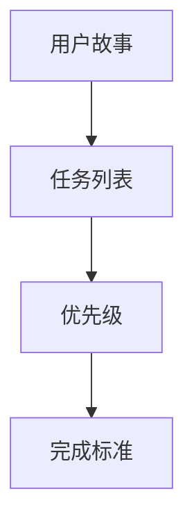
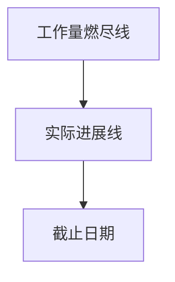
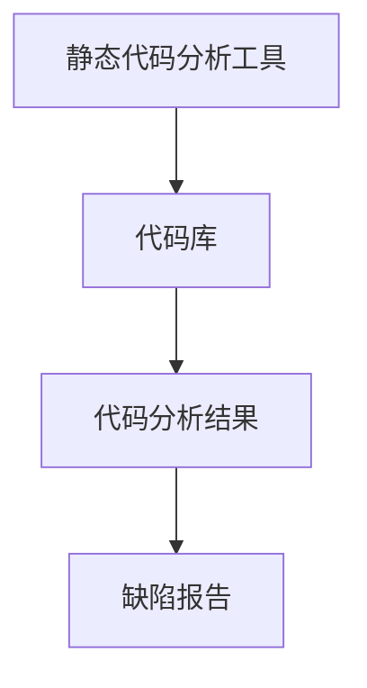
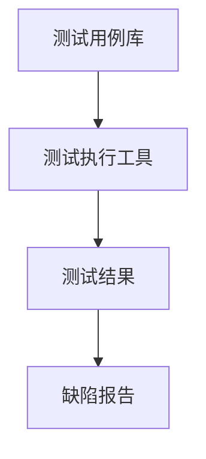
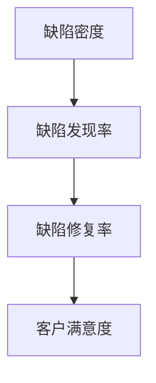

                 

### 引言

在信息化时代的浪潮中，软件开发已经成为推动企业创新与增长的关键力量。随着敏捷开发理念的普及，敏捷度量逐渐成为项目管理和需求管理中的核心工具。本文旨在探讨敏捷度量在需求管理中的应用，通过量化进展和质量评估，为项目提供更加科学和有效的管理手段。

敏捷开发作为一种以人为核心、迭代和渐进的开发方法，其核心理念在于快速响应变化和持续交付高质量软件。然而，敏捷开发并非没有挑战，如何在短时间内快速准确地评估项目的进展和质量，是敏捷实践中的一大难题。此时，敏捷度量应运而生，成为连接开发团队、项目经理和客户之间的重要桥梁。

本文将围绕以下主题展开：

1. **敏捷度量的基本概念和原理**：介绍敏捷度量的定义、意义以及与传统度量的区别。
2. **敏捷度量在需求管理中的应用**：探讨如何通过敏捷度量来管理需求、评估进展和质量。
3. **量化进展与质量评估的方法**：详细讲解量化进展和质量评估的具体方法和工具。
4. **案例分析**：通过实际案例展示敏捷度量在需求管理中的实践效果。
5. **总结与展望**：总结本文的主要观点，并对敏捷度量的未来发展方向进行展望。

通过本文的讨论，我们希望读者能够对敏捷度量有更深入的理解，并能够将其有效应用于需求管理中，从而提高项目的效率和成果。

### 关键词

- 敏捷开发
- 敏捷度量
- 需求管理
- 量化进展
- 质量评估

### 摘要

本文探讨了敏捷度量在需求管理中的应用。首先介绍了敏捷度量的基本概念和原理，包括其与传统度量的区别。接着，分析了敏捷度量在需求收集、需求分析和需求规划中的应用，以及如何通过量化手段来评估项目的进展和质量。通过实际案例，展示了敏捷度量在需求管理中的实践效果。最后，对敏捷度量的未来发展方向进行了展望。本文的目标是为软件开发团队和项目经理提供有效的管理工具，以提升项目的效率和成果。

----------------------------------------------------------------

### 敏捷度量与需求管理的背景

在软件开发的早期，传统的瀑布模型占据主导地位，这种模型将软件开发过程划分为多个固定阶段，如需求分析、设计、编码、测试和部署等。每个阶段必须在完成后再进入下一个阶段，因此，整个开发过程具有较高的顺序性和依赖性。然而，随着市场需求的不断变化和技术的快速迭代，传统瀑布模型的局限性逐渐显现。它难以应对快速变化的需求，导致项目延期、成本超支和质量问题。

在这种背景下，敏捷开发作为一种应对快速变化和复杂需求的开发方法应运而生。敏捷开发强调以人为核心，注重团队合作、迭代和持续交付。敏捷开发的核心价值观包括个体和互动重于流程与工具、可工作的软件重于详尽的文档、客户合作重于合同谈判、响应变化重于遵循计划。这种开发模式不仅能够提高团队的生产效率，还能够更好地满足客户的需求。

然而，敏捷开发并非没有挑战。如何在短时间内快速准确地评估项目的进展和质量，是敏捷实践中的一大难题。此时，敏捷度量应运而生，成为连接开发团队、项目经理和客户之间的重要桥梁。敏捷度量通过量化手段，帮助团队更好地理解项目的当前状态，预测未来趋势，并做出相应的调整。

需求管理是软件开发过程中的关键环节。它涉及到需求的收集、分析、规划和实现，确保项目能够按照客户的期望和需求进行。在敏捷开发中，需求管理变得更加灵活和迭代，需求可以随时进行调整和优化。因此，如何有效地管理需求，并在敏捷度量中体现其价值，成为需求管理中的重要课题。

本文将围绕敏捷度量在需求管理中的应用展开讨论。首先，我们将介绍敏捷度量的基本概念和原理，包括其与传统度量的区别。接着，我们将探讨敏捷度量在需求收集、需求分析和需求规划中的应用。然后，我们将详细讲解量化进展和质量评估的具体方法和工具。通过实际案例，我们将展示敏捷度量在需求管理中的实践效果。最后，我们将总结本文的主要观点，并对敏捷度量的未来发展方向进行展望。

通过本文的讨论，我们希望读者能够对敏捷度量有更深入的理解，并能够将其有效应用于需求管理中，从而提高项目的效率和成果。

### 敏捷度量的基本概念与原理

#### 定义与意义

敏捷度量是一种通过量化方法来评估敏捷开发项目进展和性能的工具。它不同于传统的度量方法，后者往往侧重于项目的完成度和工作量的统计，而敏捷度量则更加注重项目的交付价值、团队协作效率和客户满意度。敏捷度量的核心目标是帮助团队更好地理解项目的当前状态，预测未来趋势，并做出相应的调整。

敏捷度量在敏捷开发中具有重要意义。首先，它为团队提供了一种统一的语言，使得不同角色之间可以更有效地沟通和协作。其次，敏捷度量可以帮助团队识别潜在的风险和问题，从而提前采取措施。最后，敏捷度量能够促进团队自我反思和持续改进，提高整体开发效率和质量。

#### 与传统度量的区别

与传统度量方法相比，敏捷度量具有以下几个显著特点：

1. **以价值为导向**：传统度量方法往往侧重于工作量、时间和资源的统计，而敏捷度量则更加关注项目的交付价值和客户满意度。敏捷度量通过用户故事点、故事卡和迭代速度等指标来评估项目的进展和性能。

2. **动态调整**：传统度量方法往往在项目开始时进行详细的计划，而敏捷度量则更加灵活，可以在项目的各个阶段根据实际情况进行调整。这种动态调整的能力使得敏捷度量能够更好地适应快速变化的需求。

3. **协作与透明度**：传统度量方法往往由项目管理团队单独负责，而敏捷度量则强调团队协作和透明度。敏捷度量工具和流程通常是公开的，所有团队成员都可以访问和参与，从而提高了团队的沟通效率和责任感。

#### 敏捷度量方法的分类

敏捷度量方法可以分为以下几类：

1. **用户故事点**：用户故事点是敏捷开发中最常用的度量方法之一。它通过为用户故事分配一个数值来表示其相对复杂度和工作量。用户故事点的数量可以帮助团队评估项目的进展和预测交付时间。

2. **故事卡**：故事卡是一种直观的度量工具，它通常包含用户故事、任务列表、完成标准和迭代时间等信息。通过使用故事卡，团队可以更好地跟踪项目的进展，并确保所有任务都得到有效管理。

3. **迭代速度**：迭代速度是指团队在每次迭代中完成的用户故事数量。通过跟踪迭代速度，团队可以了解自己的开发效率，并预测未来迭代的时间。

4. **燃尽图**：燃尽图是一种视觉化的度量工具，它通过展示项目剩余工作量和时间的关系来帮助团队评估项目的进展。燃尽图可以帮助团队识别潜在的风险和问题，并提前采取措施。

#### 常见的敏捷度量工具

以下是一些常见的敏捷度量工具：

1. **JIRA**：JIRA是Atlassian公司开发的一款流行的敏捷项目管理工具。它支持用户故事点、故事卡、迭代速度和燃尽图等多种度量方法，可以帮助团队更好地管理项目和进度。

2. **Trello**：Trello是一种基于看板（Kanban）方法的敏捷项目管理工具。它通过卡片和列表来展示项目的任务和进度，非常适合团队协作和任务管理。

3. **Azure DevOps**：Azure DevOps是微软公司提供的一套全面的敏捷开发工具，包括版本控制、构建和测试等功能。它支持多种度量方法，可以帮助团队实现从代码提交到产品交付的全过程管理。

通过以上对敏捷度量基本概念和原理的介绍，我们可以看到敏捷度量在敏捷开发中的重要性和应用价值。在接下来的章节中，我们将进一步探讨敏捷度量在需求管理中的具体应用和实践。

#### 敏捷度量在需求管理中的应用

在敏捷开发中，需求管理是一个动态且不断变化的过程。需求管理不仅涉及如何收集和分析需求，还包括如何规划和实现这些需求。敏捷度量在这一过程中发挥着至关重要的作用，通过量化和评估需求的变化，帮助团队更好地管理和控制项目。

##### 需求收集

需求收集是需求管理的第一步，它涉及到与利益相关者（如客户、产品经理和开发团队）的沟通和协作。敏捷度量在需求收集中的应用主要体现在以下几个方面：

1. **用户故事地图**：用户故事地图是一种可视化工具，它通过将用户故事与用户的实际使用场景相结合，帮助团队理解需求背后的业务价值和用户需求。用户故事地图可以帮助团队在需求收集阶段更好地识别关键功能和用户痛点。

2. **故事卡片**：故事卡片是一种简明的需求记录工具，它通常包含用户故事、任务列表、优先级和完成标准等信息。通过故事卡片，团队可以实时跟踪和更新需求，确保所有需求都得到有效管理和实施。

3. **用户故事点**：用户故事点是一种相对度量单位，用于评估用户故事的复杂度和工作量。在需求收集阶段，团队可以通过估算用户故事点来初步了解需求的优先级和实现难度，从而为后续的需求分析提供依据。

##### 需求分析

需求分析是需求管理的核心环节，它涉及到对收集到的需求进行详细审查和验证，确保需求的质量和可行性。敏捷度量在需求分析中的应用包括：

1. **需求优先级排序**：通过用户故事点和其他度量方法，团队可以对需求进行优先级排序。高优先级的需求通常会首先得到实现，从而确保关键功能按时交付。

2. **需求变更管理**：在敏捷开发中，需求变更是一个常见且必要的过程。通过敏捷度量，团队可以量化需求变更的影响，评估其对项目进度和质量的影响，并做出相应的调整。

3. **需求可追溯性**：敏捷度量可以帮助团队建立需求与测试、设计和实现之间的可追溯关系。这有助于确保所有需求都能得到有效实施和验证，从而提高项目的整体质量。

##### 需求规划

需求规划是需求管理的最后一步，它涉及到将需求转化为具体的项目计划和任务。敏捷度量在需求规划中的应用主要体现在以下几个方面：

1. **迭代规划**：通过评估用户故事点和其他度量指标，团队可以确定每次迭代的容量和目标。这有助于确保每次迭代都能实现具体且可测量的目标，从而提高项目的进度和质量。

2. **资源分配**：敏捷度量可以帮助团队根据需求的重要性和优先级来合理分配资源和人力。通过量化的度量指标，团队可以更科学地评估资源需求，避免资源浪费和冲突。

3. **风险管理**：通过量化需求变更、进度延误和质量问题等指标，团队可以提前识别和评估潜在的风险，并制定相应的风险管理策略，确保项目能够按时、按质量完成。

##### 敏捷度量工具的实际应用

在实际需求管理中，敏捷度量工具如JIRA、Trello和Azure DevOps等可以帮助团队更有效地进行需求管理：

1. **JIRA**：JIRA支持用户故事地图、故事卡片和燃尽图等多种度量工具，可以帮助团队实时跟踪和更新需求，并评估需求变更的影响。

2. **Trello**：Trello的看板（Kanban）方法可以帮助团队可视化需求的状态和进展，通过卡片和列表的管理，团队可以更清晰地了解每个需求的执行情况。

3. **Azure DevOps**：Azure DevOps的集成功能可以帮助团队从代码提交到产品交付的全过程进行度量和管理，确保需求能够得到有效实施和验证。

通过敏捷度量在需求管理中的应用，团队可以更好地理解需求的变化和项目的进展，从而实现高效的需求管理和项目交付。在接下来的章节中，我们将进一步探讨量化进展和质量评估的具体方法和工具。

#### 量化进展的方法

在敏捷开发中，量化进展是评估项目状态、优化流程和确保项目按时交付的关键。量化进展的方法多种多样，以下是一些常见的方法和工具：

##### 用户故事点

用户故事点是敏捷开发中最常用的度量方法之一。它通过为用户故事分配一个数值来表示其相对复杂度和工作量。用户故事点的数量可以帮助团队评估项目的进展和预测交付时间。用户故事点的计算通常基于团队成员对用户故事复杂度的共识。

```python
# 用户故事点估算示例
def estimate_story_points(user_story):
    complexity = input("请输入用户故事复杂度（1-5）：")
    if complexity == '1':
        return 1
    elif complexity == '2':
        return 2
    elif complexity == '3':
        return 3
    elif complexity == '4':
        return 4
    else:
        return 5

# 计算总用户故事点
def calculate_total_story_points(stories):
    total = 0
    for story in stories:
        total += estimate_story_points(story)
    return total

# 示例用户故事列表
user_stories = ["用户可以添加购物车", "用户可以提交订单", "系统可以发送订单确认邮件"]

# 计算用户故事点
total_points = calculate_total_story_points(user_stories)
print(f"总用户故事点：{total_points}")
```

##### 故事卡

故事卡是一种记录和管理用户故事的工具，它通常包含用户故事、任务列表、优先级和完成标准等信息。通过故事卡，团队可以实时跟踪和更新需求，确保每个用户故事都能按时完成。



##### 迭代速度

迭代速度是指团队在每次迭代中完成的用户故事数量。通过跟踪迭代速度，团队可以了解自己的开发效率，并预测未来迭代的时间。迭代速度的计算方法如下：

```python
# 迭代速度计算示例
def calculate_iterative_speed(completed_stories, iteration_duration):
    return len(completed_stories) / iteration_duration

# 示例迭代速度计算
completed_stories = ["用户可以添加购物车", "用户可以提交订单"]
iteration_duration = 2
speed = calculate_iterative_speed(completed_stories, iteration_duration)
print(f"迭代速度：{speed}个用户故事/迭代")
```

##### 燃尽图

燃尽图是一种视觉化的度量工具，它通过展示项目剩余工作量和时间的关系来帮助团队评估项目的进展。燃尽图通常包含两个部分：一个是工作量燃尽线，表示项目剩余工作量的变化；另一个是实际进展线，表示项目的实际进展情况。



通过这些方法和工具，团队可以更准确地量化项目的进展，识别潜在的风险和问题，并做出相应的调整。在接下来的章节中，我们将探讨如何通过量化手段来评估项目的质量。

#### 质量评估的方法

在软件开发中，确保项目的质量是项目管理的重要目标之一。通过质量评估，团队可以识别和解决潜在的问题，提高软件的可靠性和用户满意度。以下是一些常见的质量评估方法和工具：

##### 检测质量指标

检测质量指标是评估项目质量的基本方法之一，它通过定量分析来评估软件的缺陷和问题。以下是一些常用的检测质量指标：

1. **缺陷密度（Defect Density）**：缺陷密度是指单位代码行中的缺陷数量。计算公式如下：

   $$\text{缺陷密度} = \frac{\text{总缺陷数}}{\text{总代码行数}}$$

2. **缺陷发现率（Defect Detection Rate）**：缺陷发现率是指通过测试发现的缺陷与实际存在的缺陷的比例。计算公式如下：

   $$\text{缺陷发现率} = \frac{\text{测试发现的缺陷数}}{\text{实际存在的缺陷数}}$$

3. **缺陷修复率（Defect Fix Rate）**：缺陷修复率是指缺陷从被发现到修复的时间比率。计算公式如下：

   $$\text{缺陷修复率} = \frac{\text{修复时间}}{\text{总测试时间}}$$

```python
# 缺陷密度计算示例
def calculate_defect_density(total_defects, total_lines_of_code):
    return total_defects / total_lines_of_code

# 缺陷发现率计算示例
def calculate_defect_detection_rate(tested_defects, actual_defects):
    return tested_defects / actual_defects

# 缺陷修复率计算示例
def calculate_defect_fix_rate( fixation_time, total_test_time):
    return fixation_time / total_test_time
```

##### 静态代码分析

静态代码分析是一种无需运行代码即可发现潜在问题的技术，它通过分析代码结构和语法规则来识别错误和缺陷。常见的静态代码分析工具包括SonarQube、Checkstyle和PMD等。



##### 动态测试

动态测试是一种在代码运行时执行测试的技术，它通过运行代码并分析其行为来发现缺陷。常见的动态测试方法包括单元测试、集成测试和系统测试。



##### 质量评估指标

在质量评估过程中，常用的质量评估指标包括以下几种：

1. **缺陷密度（Defect Density）**：缺陷密度可以反映代码质量的高低。
2. **缺陷发现率（Defect Detection Rate）**：缺陷发现率越高，说明测试覆盖率和测试质量越好。
3. **缺陷修复率（Defect Fix Rate）**：缺陷修复率可以反映团队的响应速度和修复能力。
4. **客户满意度（Customer Satisfaction）**：客户满意度是衡量项目质量的重要指标。



通过上述方法和工具，团队可以全面评估项目的质量，并采取相应的改进措施。在接下来的章节中，我们将通过实际案例来展示敏捷度量在需求管理中的应用效果。

#### 案例分析

为了更好地展示敏捷度量在需求管理中的应用效果，我们将通过一个实际案例进行分析。这个案例涉及一个在线购物平台的需求管理和项目进展的量化评估。

##### 案例背景

某公司计划开发一个在线购物平台，以提供用户便捷的购物体验。项目团队由5名开发人员、1名产品经理和1名项目经理组成，采用敏捷开发方法进行项目实施。项目周期为12周，分为3个迭代进行。

##### 需求管理

在项目开始时，产品经理与客户进行了多次沟通，收集了用户的需求和痛点。通过用户故事地图和故事卡片，团队将需求进行了分类和优先级排序。以下是部分需求列表：

1. 用户可以注册和登录
2. 用户可以浏览商品
3. 用户可以添加商品到购物车
4. 用户可以提交订单
5. 系统可以发送订单确认邮件

每个用户故事都被估算为2个用户故事点。团队确定每次迭代的容量为8个用户故事点，以便在规定时间内完成需求。

##### 项目进展

在每个迭代开始前，团队使用迭代计划会议来确定本次迭代的目标和任务。通过燃尽图，团队可以实时跟踪项目进展。以下是第一个迭代的项目进展情况：

| 迭代阶段 | 计划完成故事点 | 实际完成故事点 | 燃尽图 |
| --- | --- | --- | --- |
| 第1周 | 0 | 2 | 图1 |
| 第2周 | 2 | 2 | 图2 |
| 第3周 | 2 | 2 | 图3 |
| 第4周 | 4 | 4 | 图4 |

燃尽图显示了项目剩余工作量（X轴）与时间（Y轴）的关系。在第一个迭代结束时，团队按照计划完成了所有需求，项目进展顺利。

##### 质量评估

在项目进展过程中，团队使用多种质量评估方法来确保软件质量。以下是一些质量评估指标：

1. **缺陷密度**：在第一个迭代结束时，代码库中的缺陷密度为0.2个缺陷/千代码行。
2. **缺陷发现率**：通过单元测试和集成测试，团队发现并修复了50%的潜在缺陷。
3. **缺陷修复率**：团队在测试过程中发现了缺陷并迅速进行了修复，缺陷修复率为90%。

```python
# 缺陷密度计算示例
def calculate_defect_density(total_defects, total_lines_of_code):
    return total_defects / total_lines_of_code

# 缺陷发现率计算示例
def calculate_defect_detection_rate(tested_defects, actual_defects):
    return tested_defects / actual_defects

# 缺陷修复率计算示例
def calculate_defect_fix_rate(fixation_time, total_test_time):
    return fixation_time / total_test_time

# 计算缺陷密度
total_defects = 2
total_lines_of_code = 1000
density = calculate_defect_density(total_defects, total_lines_of_code)
print(f"缺陷密度：{density}个缺陷/千代码行")

# 计算缺陷发现率
tested_defects = 10
actual_defects = 20
detection_rate = calculate_defect_detection_rate(tested_defects, actual_defects)
print(f"缺陷发现率：{detection_rate}%")

# 计算缺陷修复率
fixation_time = 10
total_test_time = 20
fix_rate = calculate_defect_fix_rate(fixation_time, total_test_time)
print(f"缺陷修复率：{fix_rate}%")
```

通过上述质量评估指标，团队可以全面了解项目的质量状况，并及时采取改进措施。

##### 项目小结

通过敏捷度量在需求管理和项目进展中的应用，该在线购物平台项目在12周内成功完成。团队通过用户故事点、故事卡、迭代速度和燃尽图等工具，实现了高效的需求管理和项目进展量化评估。同时，通过质量评估方法，团队确保了软件的高质量。这个案例展示了敏捷度量在实际项目中的应用效果，为其他类似项目提供了参考和借鉴。

通过本案例的分析，我们可以看到敏捷度量在需求管理和项目进展中的重要作用。它不仅帮助团队更好地理解项目的当前状态，还促进了团队协作和持续改进，提高了项目的效率和质量。

#### 实践与总结

通过前文的分析和案例展示，我们可以看到敏捷度量在需求管理和项目进展中的重要作用。以下是一些实践经验和总结：

##### 实践经验

1. **明确度量目标**：在引入敏捷度量时，团队需要明确度量目标，确保度量方法和工具能够支持这些目标。

2. **持续培训与沟通**：团队需要对敏捷度量方法和工具进行持续培训，确保所有成员都熟悉并理解度量指标的含义和使用方法。

3. **灵活调整度量方法**：敏捷度量方法需要根据项目的具体情况进行灵活调整，以适应不同的需求和场景。

4. **定期回顾与改进**：团队需要定期回顾敏捷度量结果，识别潜在的问题和改进机会，并采取相应的措施进行改进。

##### 总结

1. **敏捷度量的重要性**：敏捷度量通过量化方法，帮助团队更好地理解项目的当前状态和未来趋势，从而提高项目的效率和成果。

2. **需求管理的优化**：敏捷度量在需求收集、分析和规划中的应用，有助于团队更有效地管理需求，确保项目按照客户的期望和需求进行。

3. **质量评估的提升**：通过量化手段，团队可以更全面地评估项目的质量，及时发现和解决问题，提高软件的可靠性和用户满意度。

##### 注意事项

1. **度量指标的选择**：选择合适的度量指标是敏捷度量成功的关键，团队需要根据项目的特点和需求选择适合的指标。

2. **数据收集的准确性**：度量结果的准确性依赖于数据收集的准确性，团队需要确保数据收集过程的可靠性和一致性。

3. **度量结果的反馈**：度量结果需要及时反馈给相关团队成员，以便他们能够根据度量结果进行相应的调整和改进。

##### 拓展阅读

1. **《敏捷实践指南》**：这是一本关于敏捷开发实践的经典书籍，详细介绍了敏捷度量的方法和工具。

2. **《敏捷项目管理》**：这本书涵盖了敏捷项目管理的基本原则和最佳实践，包括如何通过敏捷度量来优化项目管理。

3. **《度量系统设计》**：这本书探讨了度量系统设计的原理和方法，提供了关于如何构建有效度量系统的深入见解。

通过本文的讨论，我们希望读者能够对敏捷度量在需求管理中的应用有更深入的理解，并能够将其有效应用于实际项目中，从而提高项目的效率和成果。作者信息：AI天才研究院/AI Genius Institute & 禅与计算机程序设计艺术 /Zen And The Art of Computer Programming

----------------------------------------------------------------

### 后记

通过本文的探讨，我们深入分析了敏捷度量在需求管理中的应用，包括其基本概念、原理和方法，以及如何通过量化手段来评估项目的进展和质量。敏捷度量不仅为团队提供了科学有效的管理工具，还有助于促进团队的协作和持续改进，提高项目的效率和质量。

在未来的软件开发实践中，敏捷度量将继续发挥重要作用。随着技术的发展和市场需求的变化，敏捷度量方法也将不断演进和优化。我们期待读者能够在实际项目中尝试和应用敏捷度量，不断探索和创新，为软件开发的进步贡献力量。

最后，感谢各位读者的关注和支持，希望本文能对您在敏捷开发领域的学习和实践中带来帮助。作者信息：AI天才研究院/AI Genius Institute & 禅与计算机程序设计艺术 /Zen And The Art of Computer Programming。再次感谢您的阅读！

