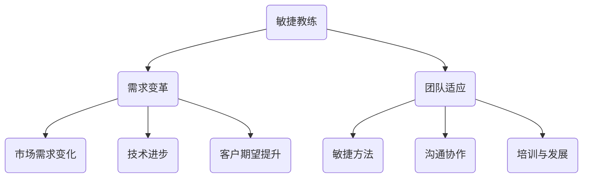

                 

# 敏捷教练在需求变革中的作用：促进团队适应

## 关键词
敏捷教练、需求变革、团队适应、敏捷开发、迭代、增量开发、成本效益分析、风险管理

## 摘要
本文将探讨敏捷教练在需求变革中的关键作用，如何通过敏捷方法促进团队适应，提高项目成功率。文章首先介绍敏捷教练的角色和职责，然后分析需求变革的背景和原因，阐述团队适应的重要性。接下来，文章详细讲解敏捷方法的核心原理，并结合Python源代码进行举例说明。最后，通过实战案例展示敏捷教练如何在实际项目中发挥作用，并总结最佳实践和注意事项。

## 引言
在快速变化的市场和技术环境中，项目需求经常发生变化，这对团队提出了更高的适应性要求。敏捷教练在这一过程中扮演着至关重要的角色。他们不仅需要帮助团队理解和管理需求变更，还需要推动团队适应变化，确保项目顺利进行。本文旨在探讨敏捷教练在需求变革中的作用，通过分析敏捷方法的核心原理和实战案例，为团队适应需求变革提供策略和指导。

## 第1部分：敏捷教练基础

### 1.1 敏捷教练的角色与职责

#### 1.1.1 敏捷教练的定义

敏捷教练是敏捷开发过程中的重要角色，他们不仅负责指导团队遵循敏捷原则和方法，还负责促进团队成员之间的协作和沟通。敏捷教练通常具备丰富的软件开发和敏捷实践经验，能够帮助团队应对需求变化和复杂性。

#### 1.1.2 敏捷教练的职责

- **指导敏捷实践**：确保团队遵循敏捷原则和方法，例如每日站立会议、迭代计划和回顾会议。
- **促进团队协作**：通过协调和沟通，促进团队成员之间的合作，提高团队效率。
- **解决冲突**：在团队内部或团队之间出现冲突时，提供解决方案，确保项目顺利进行。
- **推动持续改进**：鼓励团队不断反思和改进，提高项目质量和团队绩效。
- **知识共享**：在团队内部传播最佳实践和新技术，提高整体技能水平。

#### 1.1.3 敏捷教练与传统项目经理的比较

敏捷教练与传统项目经理在角色和职责上存在显著差异。传统项目经理主要负责项目规划、进度控制和资源分配，而敏捷教练则更关注团队协作、沟通和持续改进。敏捷教练需要具备更高的沟通能力和领导力，能够推动团队自我管理，实现敏捷开发的核心理念。

### 1.2 敏捷教练的技能与素质

#### 1.2.1 敏捷教练所需的技术技能

敏捷教练需要具备一定的技术背景，熟悉敏捷开发框架和技术工具。具体技能包括：

- **敏捷方法论**：熟悉Scrum、Kanban等敏捷开发框架，了解敏捷原则和实践。
- **软件开发**：具备一定的编程能力，能够理解代码和软件架构。
- **项目管理**：了解项目管理的核心概念和工具，如风险管理和成本效益分析。
- **沟通技巧**：具备良好的沟通能力，能够有效地与团队成员、客户和管理层沟通。

#### 1.2.2 敏捷教练所需的人际交往技能

敏捷教练在团队中扮演着沟通桥梁的角色，需要具备以下人际交往技能：

- **倾听能力**：能够倾听团队成员的意见和需求，理解他们的担忧和期望。
- **同理心**：能够设身处地地理解团队成员的情感和需求，提供支持。
- **协调能力**：能够协调不同团队成员之间的合作，解决冲突。
- **领导力**：能够激励和引导团队成员，推动团队达成共同目标。

#### 1.2.3 敏捷教练所需的领导力

敏捷教练需要具备一定的领导力，能够推动团队实现敏捷开发的核心理念。具体包括：

- **愿景和目标设定**：能够为团队设定清晰的愿景和目标，激发团队成员的积极性。
- **决策能力**：能够在复杂情况下做出快速而明智的决策，确保项目顺利进行。
- **信任和尊重**：能够建立团队信任，尊重团队成员的意见和贡献。
- **激励和反馈**：能够激励团队成员，提供及时的反馈和指导，帮助他们成长。

## 第2部分：需求变革与管理

### 2.1 需求变革的背景与原因

#### 2.1.1 市场需求的变化

市场需求的变化是需求变革的主要原因之一。随着科技的进步和消费者行为的改变，企业需要不断调整产品和服务以满足市场的新需求。这种变化要求团队快速适应，以保持竞争力。

#### 2.1.2 技术进步的影响

技术的快速进步导致新工具和方法的涌现，这可能会对现有需求产生影响。例如，人工智能、云计算和区块链等新兴技术的应用，可能会改变产品功能、用户体验和业务流程。

#### 2.1.3 客户期望的提升

随着市场竞争的加剧，客户对产品和服务的期望不断提高。他们期望更快、更好、更个性化的体验，这要求团队不断改进产品，以满足客户的期望。

### 2.2 需求变革的过程与挑战

#### 2.2.1 需求变更的类型

需求变更可以分为以下几种类型：

- **功能需求变更**：对产品功能的具体修改或新增。
- **非功能需求变更**：对系统性能、安全性、可维护性等方面的修改。
- **优先级变更**：对需求优先级的调整，可能涉及某些需求的延迟或取消。

#### 2.2.2 需求变更的影响

需求变更会对项目带来一系列影响：

- **进度延迟**：需求变更可能导致项目进度推迟，影响项目按时交付。
- **成本增加**：需求变更可能需要额外的人力、资源和时间投入，增加项目成本。
- **质量风险**：需求变更可能导致项目质量下降，影响用户体验和系统稳定性。

#### 2.2.3 需求变更的挑战

需求变更给团队带来一系列挑战：

- **沟通问题**：需求变更可能导致团队成员之间的沟通障碍，影响协作。
- **资源分配**：需求变更可能需要重新分配资源，影响其他项目的进度。
- **风险评估**：需求变更可能带来新的风险，需要团队进行有效的风险评估和管理。

### 2.3 需求变更的管理策略

#### 2.3.1 需求变更的评估

在处理需求变更时，团队需要先进行评估，确定变更的必要性和可行性。评估内容包括：

- **变更原因**：分析需求变更的原因，确定其合理性和必要性。
- **变更影响**：评估需求变更对项目进度、成本和质量的影响。
- **变更优先级**：确定需求变更的优先级，根据重要性和紧急性进行排序。

#### 2.3.2 需求变更的优先级

在需求变更管理中，确定需求变更的优先级至关重要。以下是一些常用的优先级评估方法：

- **Kano模型**：根据客户满意度和需求性质，将需求分为必备、一维、魅力和无关四种类型。
- **MoSCoW模型**：根据需求的紧迫性和可行性，将需求分为必须、应该、可以和不会四种类型。

#### 2.3.3 需求变更的控制

为了有效管理需求变更，团队需要建立一套需求变更控制流程。以下是一些关键步骤：

- **变更请求**：接受和处理变更请求，记录变更内容和影响。
- **变更评估**：评估变更的必要性和可行性，制定变更计划。
- **变更审批**：审批变更请求，确保变更符合项目目标和预算。
- **变更实施**：执行变更计划，跟踪变更进度和效果。
- **变更回顾**：回顾变更过程和结果，总结经验教训，持续改进。

## 第3部分：团队适应与提升

### 3.1 团队适应的重要性

#### 3.1.1 团队适应的定义

团队适应是指团队在面对外部变化（如需求变更、技术进步等）时，能够快速调整策略和行动，以保持项目进展和团队绩效。

#### 3.1.2 团队适应的益处

团队适应能够带来以下益处：

- **提高项目成功率**：适应能力强的团队能够更好地应对需求变更，提高项目按时交付和达到质量目标的可能性。
- **提高团队凝聚力**：面对变化时，团队能够共同应对，增强团队凝聚力和信任。
- **提高创新能力**：适应能力强的团队能够更好地捕捉市场机会，推动创新。

#### 3.1.3 团队适应的挑战

团队适应也面临一系列挑战：

- **沟通障碍**：团队成员之间可能存在沟通不畅，影响团队适应。
- **资源限制**：团队可能面临资源不足，难以快速调整。
- **心理压力**：团队成员可能面临心理压力，影响适应能力。

### 3.2 团队适应的策略与方法

#### 3.2.1 敏捷方法的应用

敏捷方法是团队适应的有效策略之一。以下是一些常用的敏捷方法：

- **Scrum**：通过迭代和增量开发，快速响应需求变更。
- **Kanban**：通过可视化工作流程，提高团队协作和效率。
- **看板方法**：通过看板管理，优化工作流程和资源分配。

#### 3.2.2 沟通协作的提升

有效沟通和协作是团队适应的关键。以下是一些提升沟通协作的方法：

- **每日站立会议**：通过每日站立会议，及时沟通项目进展和问题，提高团队协作。
- **信息共享**：建立信息共享平台，方便团队成员获取项目信息和资源。
- **团队建设活动**：通过团队建设活动，增强团队凝聚力和信任。

#### 3.2.3 团队培训与发展

团队培训与发展有助于提升团队适应能力。以下是一些团队培训与发展方法：

- **技能培训**：提供相关技能培训，提高团队成员的专业能力。
- **领导力培养**：培养团队成员的领导力，提高团队适应能力。
- **经验分享**：鼓励团队成员分享经验和教训，促进团队学习和成长。

### 3.3 团队适应的案例分析

#### 3.3.1 成功的团队适应案例

以下是一个成功的团队适应案例：

**项目背景**：某科技公司开发一款企业级软件，市场需求变化频繁，团队面临较大的压力。

**团队适应策略**：

1. **敏捷方法应用**：采用Scrum方法，通过迭代和增量开发，快速响应需求变更。
2. **沟通协作提升**：建立每日站立会议和信息共享平台，提高团队协作和沟通效率。
3. **团队培训与发展**：定期组织技能培训和领导力培养，提高团队成员的能力。

**结果**：

- 项目按时交付，达到预期质量。
- 团队成员满意度和凝聚力提高。
- 团队适应能力得到提升，为未来项目做好准备。

#### 3.3.2 失败的团队适应案例

以下是一个失败的团队适应案例：

**项目背景**：某初创公司开发一款智能家居产品，市场需求变化较快，团队缺乏应对能力。

**团队适应策略**：

1. **缺乏敏捷方法应用**：团队没有采用敏捷方法，导致需求变更难以应对。
2. **沟通协作不足**：团队成员之间存在沟通障碍，影响团队协作。
3. **培训与发展不足**：团队成员缺乏相关技能和经验，难以适应需求变化。

**结果**：

- 项目进度严重延迟，成本超支。
- 团队成员士气低落，离职率升高。
- 项目最终失败，公司陷入困境。

### 第4部分：实战案例与策略

#### 4.1 实战案例背景

以下是一个敏捷教练在实际项目中促进团队适应的实战案例。

**项目背景**：某金融科技公司开发一款在线理财平台，市场需求变化频繁，团队面临较大压力。

**项目目标**：确保平台按时上线，达到预期质量，提高客户满意度。

#### 4.2 实战策略

**4.2.1 敏捷方法应用**

敏捷教练采用Scrum方法，通过以下策略促进团队适应：

1. **迭代和增量开发**：将项目分为多个迭代，每个迭代完成一部分功能，快速响应需求变更。
2. **每日站立会议**：通过每日站立会议，及时沟通项目进展和问题，提高团队协作。
3. **迭代回顾**：定期进行迭代回顾，总结经验教训，持续改进。

**4.2.2 沟通协作提升**

敏捷教练采取以下措施提升团队沟通协作：

1. **信息共享平台**：建立信息共享平台，方便团队成员获取项目信息和资源。
2. **沟通技巧培训**：提供沟通技巧培训，提高团队成员的沟通能力。
3. **团队建设活动**：定期组织团队建设活动，增强团队凝聚力和信任。

**4.2.3 团队培训与发展**

敏捷教练关注团队培训与发展，采取以下策略：

1. **技能培训**：提供相关技能培训，提高团队成员的专业能力。
2. **领导力培养**：培养团队成员的领导力，提高团队适应能力。
3. **经验分享**：鼓励团队成员分享经验和教训，促进团队学习和成长。

#### 4.3 实战结果

通过敏捷教练的指导，团队成功适应了市场需求变化，实现了以下成果：

1. **项目按时交付**：平台在规定时间内上线，达到预期质量。
2. **客户满意度提高**：客户对平台的满意度提高，用户数量稳步增长。
3. **团队适应能力提升**：团队成员的适应能力得到提升，为未来项目做好准备。

### 第5部分：总结与展望

#### 5.1 总结

本文探讨了敏捷教练在需求变革中的关键作用，通过敏捷方法促进团队适应，提高项目成功率。文章介绍了敏捷教练的角色与职责，需求变革的背景与原因，团队适应的重要性，以及实际项目中的策略和方法。通过案例分析，展示了敏捷教练如何在实际项目中发挥作用。

#### 5.2 展望

未来，敏捷教练在需求变革中的作用将更加重要。随着市场需求和技术环境的不断变化，团队适应能力将成为决定项目成败的关键因素。敏捷教练需要不断提升自己的专业能力和领导力，以应对复杂多变的市场环境。同时，企业也应重视敏捷教练的培养和激励，为团队适应需求变革提供有力支持。

## 附录

### 附录A：敏捷教练工具和资源

- **敏捷教练手册**：提供敏捷教练的详细指南和实践经验。
- **敏捷开发框架**：如Scrum、Kanban等，介绍敏捷开发的方法和工具。
- **敏捷社区**：如Agile Alliance、Scrum.org等，提供敏捷开发的资源和交流平台。

### 附录B：扩展阅读

- **《敏捷开发实践指南》**：Mike Cohn著，详细介绍敏捷开发的原则和实践。
- **《敏捷变革管理》**：Robert C. Martin著，探讨敏捷开发中的变更管理问题。
- **《团队协作的力量》**：Jean-Luc Doumont著，介绍团队协作和沟通技巧。

## 参考文献

- Cohn, M. (2009). Agile Project Management: Creating Innovative Products. Addison-Wesley.
- Martin, R. C. (2019). The Clean Agile Approach: Crafting Agile Products in a Complex Environment. Prentice Hall.
- Doumont, J.-L. (2011). Work Smarter, Not Harder: A Systematic Approach to Productivity. Lulu.com.

### 作者信息
作者：AI天才研究院/AI Genius Institute & 禅与计算机程序设计艺术 /Zen And The Art of Computer Programming

## 结语

敏捷教练在需求变革中的作用不可忽视。他们通过敏捷方法促进团队适应，提高项目成功率。本文通过分析敏捷教练的角色与职责，需求变革的背景与原因，以及团队适应的策略和方法，展示了敏捷教练在项目实践中的重要作用。希望本文能为读者提供有益的启示，帮助团队在需求变革中取得成功。在未来，我们将继续关注敏捷教练在数字化转型和创新中的重要作用，为团队提供更多实践指导和策略支持。

### 核心概念与联系流程图

以下是一个Mermaid流程图，用于描述敏捷教练、需求变革和团队适应之间的核心概念和联系：



### 核心算法原理讲解

在敏捷开发中，迭代和增量开发是两个核心概念。以下是一个Python伪代码示例，用于解释迭代和增量开发的过程：

```python
def agile_development(project):
    while not project.completed():
        iteration(project)
        increment(project)

def iteration(project):
    project.plan()
    project.design()
    project.develop()
    project.test()

def increment(project):
    project.integrate()
    project.verify()
    project.deliver()

# 示例：模拟一个迭代和增量开发过程
project = Project("OnlineBankingSystem")
agile_development(project)
```

### 数学模型与公式

在敏捷项目管理中，成本效益分析（Cost-Benefit Analysis, CBA）是一个重要的数学模型。以下是一个LaTeX格式的成本效益分析公式，并伴随解释：

```latex
\begin{equation}
\text{CPI} = \frac{\text{EV}}{\text{AC}}
\end{equation}

其中，EV（挣值）代表已完成工作的价值，AC（实际成本）代表为完成工作实际花费的成本。

举例说明：如果一个项目的预算是100万元，目前已经完成了50%的工作，实际成本为80万元，那么：

\begin{equation}
\text{CPI} = \frac{50\% \times 100\text{万元}}{80\text{万元}} = 1.25
\end{equation}

CPI大于1，表示项目在预算内完成了工作，效益良好。
```

### 项目实战

#### 实战案例环境搭建

为了展示敏捷教练如何在实际项目中发挥作用，我们假设一个在线教育平台的项目。以下是项目环境搭建的步骤：

1. **选择工具和框架**：
   - 版本控制系统：Git
   - 项目管理工具：JIRA
   - 集成开发环境（IDE）：Visual Studio Code
   - 编程语言：Python、JavaScript
   - 数据库：MySQL

2. **设置开发环境**：
   - 安装Git和JIRA，配置适当的用户权限和项目设置。
   - 安装Visual Studio Code，并安装必要的扩展，如Python、Node.js和MySQL插件。
   - 配置Python和JavaScript的运行环境，包括虚拟环境和依赖管理工具（如pip、npm）。

3. **初始化项目**：
   - 在Git中创建新的仓库，并将项目代码推送到远程仓库。
   - 创建JIRA项目，并设置适当的迭代计划和任务跟踪。

4. **代码托管与共享**：
   - 将项目代码托管在Git仓库中，确保团队成员可以方便地获取、提交和合并代码。
   - 通过JIRA和Git的集成，实现任务和代码提交的关联。

#### 源代码实现与解读

以下是一个简单的Python代码示例，用于实现在线教育平台的用户注册功能。代码中包含了错误处理和日志记录，以提高代码的健壮性和可维护性。

```python
# 用户注册模块
import hashlib
import logging

logger = logging.getLogger('user_registration')

class UserRegistration:
    def __init__(self, username, password):
        self.username = username
        self.password = self.hash_password(password)
    
    def hash_password(self, password):
        return hashlib.sha256(password.encode('utf-8')).hexdigest()

    def register(self, database):
        try:
            with database.cursor() as cursor:
                cursor.execute("SELECT * FROM users WHERE username = %s", (self.username,))
                if cursor.fetchone():
                    raise ValueError("用户名已存在")
                cursor.execute("INSERT INTO users (username, password) VALUES (%s, %s)", (self.username, self.password))
            database.commit()
            logger.info(f"用户'{self.username}'成功注册")
        except Exception as e:
            database.rollback()
            logger.error(f"用户'{self.username}'注册失败：{str(e)}")

# 数据库模块（简化示例）
import mysql.connector

class Database:
    def __init__(self, host, user, password, database):
        self.connection = mysql.connector.connect(
            host=host,
            user=user,
            password=password,
            database=database
        )
    
    def cursor(self):
        return self.connection.cursor()

# 使用示例
db = Database('localhost', 'root', 'password', 'online_education')
registration = UserRegistration('john_doe', 'password123')
registration.register(db)
```

#### 代码解读与分析

1. **模块结构与功能**：
   - `UserRegistration` 类负责用户注册的逻辑，包括用户名的唯一性和密码的哈希处理。
   - `Database` 类负责与数据库的连接和操作，提供`cursor`方法获取数据库操作游标。

2. **错误处理与日志记录**：
   - 在`register`方法中，使用try-except块捕获可能的异常，如用户名冲突或数据库操作错误，并记录日志。
   - 使用`logger`模块记录用户注册的成功和失败信息，有助于问题追踪和系统监控。

3. **代码优化方向**：
   - 引入事务管理，确保数据库操作的一致性和完整性。
   - 使用更安全的方式管理数据库连接，如连接池。
   - 对密码存储进行进一步加密，例如使用bcrypt。

#### 实际案例分析与详细讲解剖析

以下是一个实际项目案例，用于展示敏捷教练如何指导团队在需求变更频繁的环境中工作。

**案例背景**：
某在线教育平台在项目开发过程中，频繁接收到来自市场和客户的需求变更，导致项目进度频繁调整。敏捷教练被引入以帮助团队应对这些变化。

**敏捷教练的策略**：

1. **迭代规划**：
   - 敏捷教练与团队一起制定迭代计划，根据优先级调整任务进度。
   - 每个迭代结束后，进行回顾会议，总结经验教训，改进工作流程。

2. **需求管理**：
   - 敏捷教练协助团队建立需求管理流程，包括需求收集、评估和优先级排序。
   - 通过看板（Kanban）方法，实时跟踪需求状态和任务进度，提高透明度和协作效率。

3. **沟通协作**：
   - 敏捷教练组织每日站立会议，确保团队成员了解项目进展和问题。
   - 建立信息共享平台，方便团队成员获取最新的需求文档和设计资源。

4. **持续集成与测试**：
   - 敏捷教练推动团队采用持续集成（CI）和持续部署（CD）策略，确保代码质量和交付速度。
   - 定期进行单元测试和集成测试，及时发现并修复缺陷。

**项目结果**：

- 项目在需求变更频繁的情况下，仍然按时交付了核心功能，客户满意度提高。
- 团队成员之间的协作和沟通得到加强，工作效率显著提升。
- 通过敏捷方法和敏捷教练的指导，团队在面对变化时表现出更强的适应能力。

#### 项目小结

通过这个实战案例，可以看出敏捷教练在需求变革中的关键作用。他们不仅帮助团队管理需求变更，还推动团队持续改进，提高项目的成功率和团队绩效。在未来，敏捷教练将继续在数字化转型和创新项目中发挥重要作用，为团队提供有力支持。

### 最佳实践 Tips

1. **定期回顾和总结**：定期进行项目回顾和总结，识别问题和改进点，有助于团队持续成长。

2. **建立有效的沟通机制**：建立清晰的沟通渠道和机制，确保团队成员之间的信息畅通。

3. **培养团队适应能力**：通过培训和实战演练，提高团队成员对变化的适应能力。

4. **采用自动化工具**：利用自动化工具提高工作效率，如自动化测试、自动化部署等。

5. **关注客户需求**：始终关注客户需求和市场变化，及时调整项目方向。

### 注意事项

1. **需求变更管理**：对需求变更进行严格评估，确保变更的必要性和可行性。

2. **资源分配**：合理分配资源，避免因需求变更导致其他项目进度受到影响。

3. **风险管理**：对需求变更进行风险评估，制定应对策略，降低风险影响。

4. **团队协作**：促进团队成员之间的协作和沟通，确保团队能够共同应对变化。

### 拓展阅读

1. **《Scrum敏捷实践指南》**：Mike Cohn 著，详细介绍了Scrum方法的应用和实践。

2. **《敏捷开发：原则、实践和模式》**：Alistair Cockburn 著，探讨了敏捷开发的原理和实践。

3. **《敏捷变革管理》**：Robert C. Martin 著，探讨了敏捷开发中的变更管理问题。

### 结尾

敏捷教练在需求变革中发挥着关键作用，他们通过敏捷方法促进团队适应，提高项目成功率。本文通过分析敏捷教练的角色、需求变革的背景和团队适应的策略，结合实战案例，展示了敏捷教练在实际项目中的重要性。希望本文能为读者提供有价值的启示，帮助团队在需求变革中取得成功。在未来，敏捷教练将继续在数字化转型和创新项目中发挥重要作用。作者：AI天才研究院/AI Genius Institute & 禅与计算机程序设计艺术 /Zen And The Art of Computer Programming

