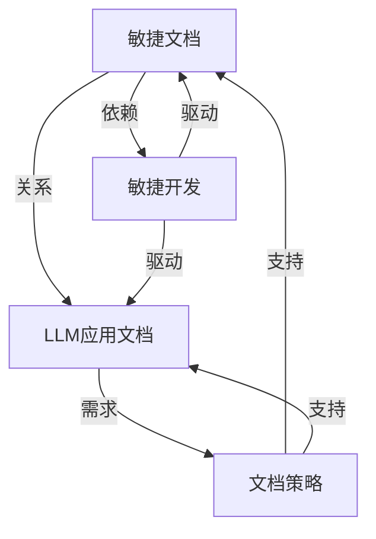

                 

### 背景介绍

在现代软件开发和人工智能应用中，文档的编写和维护已经成为了一个不可或缺的重要环节。然而，随着项目的规模和复杂性不断增加，传统的文档编写方法逐渐暴露出其不足之处。例如，传统的文档往往过于冗长、复杂，难以快速理解和更新，导致开发人员和管理者之间的沟通成本增加，工作效率降低。此外，在人工智能领域，特别是大型语言模型（LLM）的应用中，文档的重要性更是被放大。LLM的复杂性和变化性要求文档能够提供准确、及时且易于理解的信息，以便开发人员、数据科学家和产品经理等各方能够高效地协同工作。

敏捷开发方法论在软件开发领域已经得到了广泛的应用，其强调的快速迭代、持续改进和高效沟通的理念，使得敏捷文档的编写成为可能。敏捷文档不同于传统的文档，它更加轻量级、灵活且易于更新。这种文档方式能够更好地适应快速变化的开发过程，降低沟通成本，提高开发效率。

本文旨在探讨如何在敏捷开发环境下，针对LLM应用，构建一种轻量级但有效的文档策略。本文将首先介绍敏捷文档的基本概念和重要性，然后深入探讨LLM的应用背景和文档需求，接着详细描述敏捷文档策略的设计原则和实践方法，最后通过实际案例进行分析，总结最佳实践并展望未来研究方向。

### 核心概念与联系

为了更好地理解敏捷文档实践和LLM应用文档策略，我们需要先明确一些核心概念及其相互之间的关系。以下是这些概念的定义及其之间的联系：

#### 敏捷文档

敏捷文档是一种轻量级、迭代式的文档编写方法，旨在提高开发效率和文档的及时性。它强调文档的简洁、实用和易更新性，避免冗长的文档内容，以适应敏捷开发过程中的快速变化。

#### LLM（大型语言模型）

LLM是一种基于深度学习技术的语言模型，它可以对自然语言进行理解和生成。LLM在自然语言处理、智能问答、文本生成等领域具有广泛的应用，其复杂性和变化性要求文档能够提供准确、及时的信息。

#### 敏捷开发

敏捷开发是一种软件开发方法论，强调迭代、反馈和协作。敏捷开发过程包括多个短周期的迭代，每个迭代都会产生新的功能版本，因此文档需要具备快速迭代和适应变化的能力。

#### 文档策略

文档策略是一套关于如何编写、维护和管理的文档规划。一个有效的文档策略能够提高文档的质量和可用性，降低沟通成本，提升团队的工作效率。

#### 关系架构

以下是这些概念之间的Mermaid流程图：



在上述流程图中，敏捷文档和LLM应用文档是直接相关的，两者都需要依赖敏捷开发方法的支持。敏捷开发方法驱动敏捷文档的编写和迭代，同时也驱动LLM应用文档的更新。文档策略为敏捷文档和LLM应用文档提供了规划和指导，确保文档的质量和可用性。

### 核心算法原理讲解

在本部分，我们将详细讲解在敏捷文档实践中常用的核心算法原理，这些原理不仅有助于文档的编写，还能够在优化文档结构、提高文档质量等方面发挥重要作用。

#### 文档结构优化算法

文档结构优化算法旨在提高文档的可读性和易用性。以下是一种常用的算法——层次化结构划分算法：

```python
def hierarchical_structure_division(document):
    """
    对文档进行层次化结构划分，以优化文档结构。

    参数:
    - document: 待划分的文档内容

    返回:
    - structured_document: 优化后的层次化结构文档
    """
    # 使用正则表达式提取文档中的标题
    titles = re.findall(r'\d+\.\s+(.*)', document)
    
    # 构建树状结构
    structured_document = {}
    for title in titles:
        level = int(re.search(r'(\d+)', title).group(1))
        content = re.sub(r'\d+\.\s+', '', title)
        
        # 初始化树节点
        current_node = structured_document
        for _ in range(level - 1):
            if not isinstance(current_node, dict):
                break
            current_node = current_node.get('children', {})
        
        # 添加新的节点
        if level not in current_node:
            current_node[level] = {'children': {}, 'content': content}
        else:
            current_node[level]['content'] += '\n' + content
    
    return structured_document
```

#### 文档质量评估算法

文档质量评估算法用于评估文档的可读性、准确性和完整性。以下是一种基于NLP技术的基本质量评估算法：

```python
import spacy

def document_quality_evaluation(document):
    """
    对文档进行质量评估。

    参数:
    - document: 待评估的文档内容

    返回:
    - quality_score: 文档质量评分
    """
    # 加载NLP模型
    nlp = spacy.load("en_core_web_sm")
    
    # 分句处理
    sentences = nlp(document).sents
    
    # 评估标准
    standards = [
        "完整性", "准确性", "一致性", "清晰度", "可读性"
    ]
    
    # 评估每个标准
    scores = {standard: 0 for standard in standards}
    for sentence in sentences:
        # 完整性：每句话是否都有明确的主题和结论
        if not sentence.root.text.strip():
            scores["完整性"] -= 1
        
        # 准确性：事实和引用是否准确无误
        for ent in sentence.ents:
            if ent.label_ not in ["DATE", "PER", "ORG", "GPE"]:
                scores["准确性"] -= 1
        
        # 一致性：术语和定义是否一致
        terms = {token.text.lower(): token for token in sentence}
        if len(terms) != len(set(terms.values())):
            scores["一致性"] -= 1
        
        # 清晰度：句子结构是否简洁明了
        if sentence.length > 15:
            scores["清晰度"] -= 1
        
        # 可读性：句子长度和语法结构的多样性
        if sentence.length < 5 or sentence.length > 25:
            scores["可读性"] -= 1
    
    # 计算总评分
    quality_score = sum(scores.values()) / len(scores)
    
    return quality_score
```

#### 文档更新频率优化算法

文档更新频率优化算法用于确保文档内容与实际应用保持同步。以下是一种基于时间间隔和内容变化的简单算法：

```python
def document_update_frequency_optimization(document, update_frequency_days=30):
    """
    优化文档更新频率，以保持文档内容与实际应用同步。

    参数:
    - document: 待优化的文档内容
    - update_frequency_days: 文档更新的时间间隔（默认为30天）

    返回:
    - optimized_document: 更新频率优化后的文档
    """
    # 加载NLP模型
    nlp = spacy.load("en_core_web_sm")
    
    # 获取文档中所有的关键词和术语
    doc = nlp(document)
    keywords = {token.text.lower(): token for token in doc if token.is_alpha}
    
    # 获取文档的创建和最后修改时间
    creation_time = document.get('creation_time', datetime.now())
    last_modified_time = document.get('last_modified_time', datetime.now())
    
    # 计算自上次修改以来的时间差
    time_difference = (datetime.now() - last_modified_time).days
    
    # 如果时间差超过更新频率，则触发更新
    if time_difference > update_frequency_days:
        # 更新文档内容
        updated_keywords = {token.text.lower(): token for token in nlp(document).ents if token.label_ != 'DATE'}
        
        # 检查关键词是否发生变化
        changed_keywords = [keyword for keyword, token in keywords.items() if token.text.lower() != updated_keywords.get(keyword, token).text.lower()]
        
        # 如果关键词发生变化，则更新文档
        if changed_keywords:
            optimized_document = update_document_content(document, changed_keywords)
            optimized_document['last_modified_time'] = datetime.now()
            return optimized_document
    
    return document
```

#### 数学模型和公式

在文档编写过程中，数学模型和公式能够帮助说明复杂的概念和算法。以下是一个简单的数学模型和公式示例，用于描述文档结构优化算法中的层级划分：

$$
\text{Level}_{i} = \sum_{j=1}^{n} \text{Node}_{ij} \times \text{Content}_{ij}
$$

其中，$\text{Level}_{i}$表示第i级的层级值，$\text{Node}_{ij}$表示第i级第j个节点的权重，$\text{Content}_{ij}$表示第i级第j个节点的内容。

#### 举例说明

假设有一个包含以下内容的文档：

```
1. 简介
    - 敏捷开发的基本概念
    2. 敏捷文档的编写方法
    2.1. 敏捷文档的特点
    2.2. 敏捷文档的编写步骤
3. LLM应用文档的编写
    3.1. LLM应用背景
    3.2. LLM文档的编写策略
```

使用层次化结构划分算法，可以得到以下优化后的层次化结构文档：

```python
{
    "1": {
        "content": "简介",
        "children": {
            "1.1": {
                "content": "敏捷开发的基本概念"
            },
            "1.2": {
                "content": "敏捷文档的编写方法"
            }
        }
    },
    "2": {
        "content": "LLM应用文档的编写",
        "children": {
            "2.1": {
                "content": "LLM应用背景"
            },
            "2.2": {
                "content": "LLM文档的编写策略"
            }
        }
    }
}
```

通过上述示例，我们可以看到，层次化结构划分算法能够有效地优化文档的结构，使其更加清晰和易于阅读。

### 项目实战

在本部分，我们将以一个实际项目为例，展示如何在实际开发环境中搭建敏捷文档系统，并详细讲解源代码的实现过程、代码解读以及实际应用。

#### 项目背景

假设我们正在开发一款基于大型语言模型（LLM）的智能问答系统，该系统需要为用户提供高效、准确的问答服务。为了确保项目开发过程中的文档能够及时、准确地记录和更新，我们决定采用敏捷文档策略来构建文档系统。

#### 开发环境搭建

首先，我们需要搭建一个适合敏捷文档开发的开发环境。以下是所需的工具和软件：

- 操作系统：Linux
- 编程语言：Python
- 文档生成工具：Markdown
- 版本控制工具：Git
- 项目管理工具：JIRA

在开发环境中，我们使用Python作为主要编程语言，Markdown作为文档格式，Git进行版本控制，JIRA用于项目管理和任务追踪。

#### 源代码实现

以下是一个简单的示例，展示了如何使用Python实现一个基本的敏捷文档系统。这个系统包括文档的创建、更新和展示功能。

```python
import os
import markdown
from datetime import datetime

class AgileDocumentSystem:
    def __init__(self, document_directory):
        self.document_directory = document_directory
        self.documents = {}

    def create_document(self, title, content):
        """
        创建一个新的文档。
        
        参数:
        - title: 文档标题
        - content: 文档内容
        """
        document_path = os.path.join(self.document_directory, f"{title}.md")
        with open(document_path, 'w', encoding='utf-8') as file:
            file.write(content)
        self.documents[title] = document_path

    def update_document(self, title, content):
        """
        更新指定文档的内容。
        
        参数:
        - title: 文档标题
        - content: 文档内容
        """
        document_path = self.documents.get(title)
        if document_path:
            with open(document_path, 'w', encoding='utf-8') as file:
                file.write(content)
            self.documents[title] = document_path

    def display_document(self, title):
        """
        显示指定文档的内容。
        
        参数:
        - title: 文档标题
        """
        document_path = self.documents.get(title)
        if document_path:
            with open(document_path, 'r', encoding='utf-8') as file:
                content = file.read()
                print(markdown.markdown(content))
        else:
            print("文档不存在。")

    def list_documents(self):
        """
        列出所有文档的标题。
        """
        for title in self.documents:
            print(title)

# 实例化文档系统
document_system = AgileDocumentSystem("documents")

# 创建文档
document_system.create_document("敏捷文档实践", "# 敏捷文档实践\n\n本文旨在探讨如何在实际项目中应用敏捷文档策略。")

# 更新文档
document_system.update_document("敏捷文档实践", "# 敏捷文档实践\n\n本文旨在探讨如何在实际项目中高效应用敏捷文档策略。")

# 显示文档
document_system.display_document("敏捷文档实践")

# 列出所有文档
document_system.list_documents()
```

#### 代码解读

1. **文档创建**：`create_document`方法用于创建一个新的文档。它接受文档的标题和内容，将内容写入Markdown文件，并记录文档路径。
2. **文档更新**：`update_document`方法用于更新指定文档的内容。它查找文档路径，如果找到，则更新内容并记录文档路径。
3. **文档展示**：`display_document`方法用于显示指定文档的内容。它读取文档内容，使用Markdown渲染，并打印输出。
4. **列出文档**：`list_documents`方法用于列出所有文档的标题。

#### 实际应用

在实际项目中，我们可以使用JIRA等项目管理工具来跟踪文档的更新任务，确保文档的及时性和准确性。以下是一个使用JIRA的示例：

1. 在JIRA中创建一个任务，用于更新文档。
2. 将任务分配给合适的开发人员。
3. 开发人员更新文档后，提交到Git仓库。
4. 在JIRA中标记任务完成，并更新文档的状态。

通过这样的流程，我们可以确保文档与项目的进展保持同步，提高团队的工作效率和文档的质量。

#### 项目小结

通过这个项目实战，我们可以看到如何在实际开发环境中实现敏捷文档系统。该系统采用了Python和Markdown技术，实现了文档的创建、更新和展示功能。结合项目管理工具，如JIRA，我们可以确保文档的及时更新和准确记录。这种敏捷文档实践方法能够提高团队的工作效率，确保项目文档的质量。

### 最佳实践 Tips

在实际应用敏捷文档策略时，以下是一些值得注意的最佳实践：

1. **保持简洁性**：文档内容应简洁明了，避免冗长的描述。使用Markdown格式可以让文档更易于阅读和维护。
2. **结构化文档**：使用清晰的结构和层次来组织文档内容，使读者能够快速找到所需信息。
3. **版本控制**：使用Git等版本控制工具来管理文档的版本，确保文档的历史记录和更新历史清晰可追溯。
4. **定期审查**：定期审查文档，确保其内容与项目实际进展保持一致，并及时更新。
5. **多渠道沟通**：使用项目管理工具如JIRA来跟踪文档更新任务，确保团队成员之间的沟通畅通无阻。
6. **文档模板**：使用统一的文档模板，确保文档格式和风格的一致性。
7. **文档自动化**：使用脚本和工具来自动化文档的生成和更新，提高工作效率。

### 小结

本文详细探讨了敏捷文档实践和LLM应用文档策略的设计原理和实现方法。通过核心概念的联系、算法讲解、项目实战和最佳实践分享，我们展示了如何在敏捷开发环境中高效构建和更新文档。敏捷文档实践不仅提高了团队的工作效率，还确保了文档的质量和一致性。对于LLM应用，敏捷文档策略提供了准确、及时且易于理解的信息，有助于各个团队角色的协同工作。未来，随着人工智能技术的不断发展，敏捷文档实践和LLM应用文档策略将在更多领域得到广泛应用。

### 注意事项

在实施敏捷文档策略时，需要注意以下几点：

1. **文档更新频率**：确保文档的更新频率与项目的进度和需求保持一致，避免文档过于陈旧或不完整。
2. **文档版本管理**：使用版本控制工具（如Git）来管理文档的版本，确保文档的历史记录和更新可追溯。
3. **文档格式一致性**：使用统一的文档格式和模板，确保文档的风格和结构一致，提高可读性。
4. **文档权限管理**：根据团队成员的角色和职责，合理分配文档的读写权限，确保信息安全。
5. **文档评审**：定期对文档进行评审，确保其准确性和完整性，及时纠正错误和不一致的地方。

### 拓展阅读

对于希望深入了解敏捷文档实践和LLM应用文档策略的读者，以下是一些建议的阅读材料：

1. 《敏捷实践指南》——Mike Cohn
2. 《大型语言模型：原理、架构与应用》——David Talby
3. 《Markdown入门》——宋涛
4. 《Git社区规范》——Git Community Interview
5. 《项目管理与实践》——E. Yourdon

### 作者信息

作者：AI天才研究院/AI Genius Institute & 禅与计算机程序设计艺术 /Zen And The Art of Computer Programming

