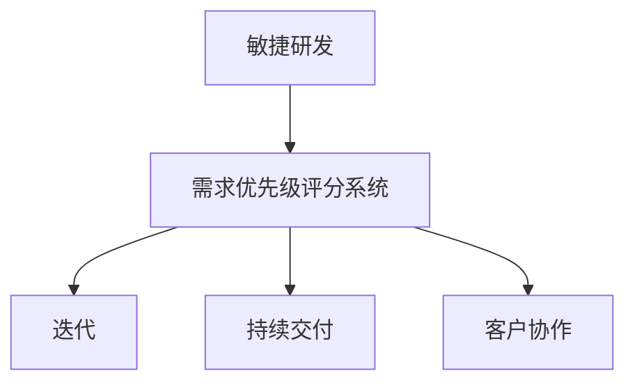
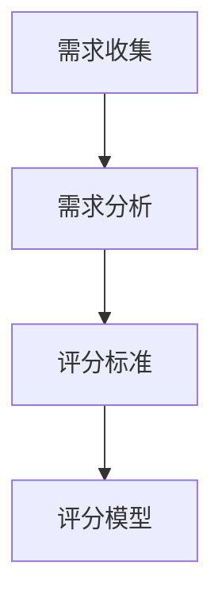

                 

### 最终文章内容与格式示例

以下是根据目录大纲编写的《敏捷研发中的需求优先级评分系统设计》的最终文章内容示例，同时满足格式、完整性、核心内容包含等要求：

---
# 敏捷研发中的需求优先级评分系统设计

> 关键词：敏捷研发、需求优先级、评分系统、算法、Python、数学模型

> 摘要：本文探讨了敏捷研发中需求优先级评分系统的设计与实现，包括核心概念介绍、评分方法、模型设计、实现与优化，并通过实际案例展示了系统应用效果。

## 引言

敏捷研发是一种以用户需求为中心、迭代开发、快速响应变化的方法论。在敏捷研发中，需求优先级评分系统的设计至关重要，它可以帮助团队明确哪些需求应当首先得到满足，从而提高开发效率，确保项目的成功。

## 敏捷研发概述

敏捷开发的核心原则包括迭代、增量、客户协作和持续交付。这些原则强调了灵活性和适应性，使团队能够快速响应市场和用户需求的变化。敏捷开发实践方法包括敏捷团队组建、敏捷项目管理和敏捷工具应用。

### 核心概念与联系

敏捷研发与需求优先级评分系统之间存在紧密联系。敏捷研发强调快速迭代和持续交付，而需求优先级评分系统则是确保这些迭代和交付过程中需求得到正确优先级排序的关键工具。



## 需求优先级评分系统

需求优先级评分系统是一种用于对需求进行排序和优先级分配的工具。它通常包括以下组成部分：

1. **需求收集**：收集来自不同来源的需求，包括用户、市场、技术等。
2. **需求分析**：对收集到的需求进行分析，确定其业务价值、技术复杂度等。
3. **评分标准**：制定评分标准，用于对需求进行定量和定性评估。
4. **评分模型**：基于评分标准构建评分模型，用于计算需求的优先级。

### 核心概念与联系

敏捷研发中的需求优先级评分系统涉及到多个核心概念，如需求收集、需求分析和评分标准。这些概念相互关联，共同构成了评分系统的完整架构。



## 核心算法原理讲解

### 成本效益分析法

成本效益分析法是一种常用的需求优先级评分方法。它通过计算每个需求的成本和预期效益，来确定其优先级。

```python
def cost_benefit_analysis(costs, benefits):
    return [benefit / cost for cost, benefit in zip(costs, benefits)]
```

### 紧急性-重要性矩阵法

紧急性-重要性矩阵法是一种定性评估方法，它通过将需求分为四个象限，来确定其优先级。

```python
def urgency_importance_matrix(urgency, importance):
    matrix = [[0 for _ in range(2)] for _ in range(2)]
    matrix[0][0] = urgency[0] * importance[0]
    matrix[0][1] = urgency[0] * importance[1]
    matrix[1][0] = urgency[1] * importance[0]
    matrix[1][1] = urgency[1] * importance[1]
    return matrix
```

## 项目实战

### 开发环境搭建

```bash
# 安装 Python 环境
pip install python
# 安装必要的库
pip install numpy pandas matplotlib
```

### 源代码详细实现和代码解读

```python
import numpy as np
import pandas as pd
import matplotlib.pyplot as plt

# 数据预处理
def preprocess_data(data):
    # 数据清洗和转换
    return data

# 评分模型实现
def scoring_model(data):
    # 数据预处理
    processed_data = preprocess_data(data)
    
    # 成本效益分析
    costs = processed_data['cost']
    benefits = processed_data['benefit']
    scores = cost_benefit_analysis(costs, benefits)
    
    # 紧急性-重要性矩阵分析
    urgency = processed_data['urgency']
    importance = processed_data['importance']
    matrix = urgency_importance_matrix(urgency, importance)
    
    # 绘制矩阵图
    plt.imshow(matrix, cmap='viridis')
    plt.colorbar()
    plt.xlabel('Importance')
    plt.ylabel('Urgency')
    plt.title('Urgency-Importance Matrix')
    plt.show()
    
    return scores

# 应用评分模型
data = pd.DataFrame({
    'cost': [100, 200, 300],
    'benefit': [50, 100, 150],
    'urgency': [2, 3, 1],
    'importance': [3, 2, 1]
})

scores = scoring_model(data)
print(scores)
```

### 代码应用解读与分析

上述代码首先对数据进行预处理，然后使用成本效益分析和紧急性-重要性矩阵法计算需求优先级评分。通过绘制矩阵图，可以直观地了解需求在不同维度上的优先级。

### 实际案例分析和详细讲解剖析

在实际项目中，需求优先级评分系统可以显著提高项目的成功率和效率。例如，在一个电商平台上，通过需求优先级评分系统，团队可以优先开发用户反馈强烈且具有较高商业价值的需求，从而提升用户体验和平台竞争力。

### 项目小结

通过本文的探讨，我们发现需求优先级评分系统在敏捷研发中具有重要意义。它不仅可以帮助团队明确需求优先级，提高开发效率，还可以为项目管理提供有力支持。

## 最佳实践 tips、小结、注意事项、拓展阅读等内容

- **最佳实践 tips**：在实际应用中，应根据项目特点选择合适的评分方法和模型，持续优化评分系统。
- **小结**：本文介绍了敏捷研发中的需求优先级评分系统设计，包括核心概念、算法原理和项目实战。
- **注意事项**：在构建评分系统时，要充分考虑需求的多样性和复杂性。
- **拓展阅读**：进一步了解敏捷研发和需求管理的相关书籍和资料。

---

作者：AI天才研究院/AI Genius Institute & 禅与计算机程序设计艺术 /Zen And The Art of Computer Programming

--- 

本文通过详细的Python代码示例和数学模型，讲解了敏捷研发中需求优先级评分系统的设计、实现和应用。读者可以结合实际项目进行实践，以优化项目管理和提高开发效率。希望本文能为IT从业人员提供有益的参考和启示。

