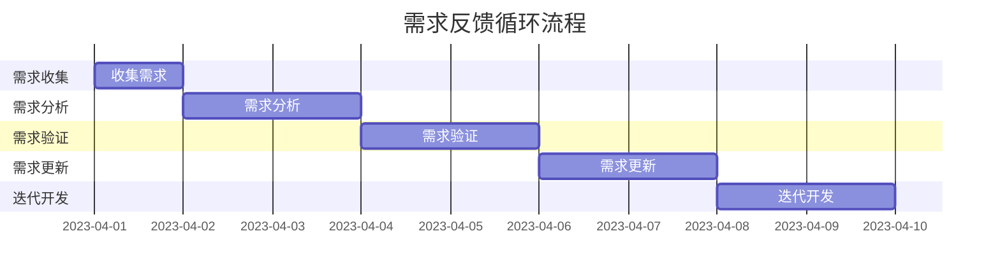

                 

# 敏捷研发中的需求反馈循环优化

> 关键词：敏捷研发、需求反馈循环、优化策略、团队协作

> 摘要：本文深入探讨了敏捷研发中的需求反馈循环优化，详细分析了敏捷方法、需求反馈循环的基本概念和优化策略。通过实际案例和代码示例，阐述了如何在敏捷研发过程中实现高效的需求反馈循环，为软件开发团队提供实用的指导和建议。

## 引言

在当今快速变化的市场环境中，软件开发团队面临着前所未有的挑战。传统的水舞模型（Waterfall Model）由于其固有的刚性，往往难以适应这种变化。为了应对这一挑战，敏捷开发（Agile Development）方法应运而生。敏捷开发强调迭代、协作和快速响应变化，其核心在于快速交付可工作的软件并持续改进。

需求反馈循环是敏捷开发的重要组成部分，它贯穿于整个开发过程，确保了团队能够及时调整方向，以适应客户和市场变化。然而，如何优化需求反馈循环，提高其效率和效果，成为了许多团队面临的重要问题。

本文旨在探讨敏捷研发中的需求反馈循环优化，通过理论分析和实际案例，为软件开发团队提供实用的优化策略和方法。

## 敏捷研发概述

### 敏捷方法的起源与发展

敏捷开发起源于2001年，由一群软件开发专家在雪鸟山（Snowbird）会议上提出的《敏捷宣言》。该宣言主张：
- **个体和互动** 重于过程和工具。
- **可工作的软件** 重于详尽的文档。
- **客户合作** 重于合同谈判。
- **响应变化** 重于遵循计划。

这些原则标志着敏捷开发的核心价值观。随着时间的推移，敏捷开发经历了多个阶段，逐渐发展出多种实践方法，如Scrum、Kanban、XP（极限编程）等。这些方法在团队协作、需求管理、迭代开发等方面提供了具体的实践指导。

### 敏捷的核心原则与实践

敏捷开发的核心原则包括：
- **增量交付**：通过分阶段的交付，逐步实现产品功能。
- **迭代开发**：在每个迭代周期内，团队交付一个可工作的软件版本。
- **用户故事**：用户故事是一种简短的需求描述，它从用户的角度出发，明确产品的功能和价值。
- **每日站立会议**：每日站立会议是团队沟通的一种形式，旨在确保每个成员了解项目的进度和问题。

敏捷实践包括：
- **站立会议**：每日的短会，用于团队成员之间的沟通和问题解决。
- **迭代计划**：在每个迭代周期开始时，团队共同确定待办事项和目标。
- **回顾会议**：在每个迭代周期结束时，团队回顾并总结经验教训。

### 敏捷研发与传统开发方法的对比

与传统的水舞模型相比，敏捷开发具有以下优势：
- **灵活性**：敏捷方法能够更好地适应变化，快速响应市场需求。
- **质量保证**：通过持续集成和反馈机制，确保软件的质量。
- **客户参与**：客户更早地参与到开发过程中，提供了更多的反馈和指导。
- **团队合作**：团队成员之间的紧密协作，提高了项目的成功率。

然而，敏捷开发也有其局限性，例如：
- **管理复杂度**：敏捷方法要求更严格的管理和协调。
- **团队依赖性**：团队的素质和协作能力对项目成功至关重要。

## 需求反馈循环基础

### 需求反馈循环的定义与流程

需求反馈循环是指在软件开发过程中，不断地收集、分析、验证和更新需求的流程。它包括以下关键步骤：

1. **需求收集**：团队通过与客户的沟通、市场调研、用户访谈等方式，收集需求。
2. **需求分析**：团队对收集到的需求进行整理、分类和分析，确保其清晰、具体、可行。
3. **需求验证**：通过与客户或利益相关者的验证，确认需求是否满足其需求。
4. **需求更新**：根据反馈和新的需求，对现有需求进行更新和调整。

### 需求收集与优先级排序

需求收集是需求反馈循环的基础。以下是一些有效的需求收集方法：

- **用户访谈**：通过与用户面对面交流，深入了解他们的需求。
- **问卷调查**：通过在线或纸质问卷，收集大量用户反馈。
- **市场调研**：分析市场趋势和竞争对手的产品，获取有价值的需求信息。

在需求收集后，团队需要对需求进行优先级排序。以下是一些常用的优先级排序方法：

- **Kano模型**：根据用户需求的重要性和满意度，将需求分为基本需求、一维需求、魅力需求和无关需求。
- **MoSCoW模型**：将需求分为必须完成（Mandatory）、应该完成（Should）、可以完成（Could）、不会完成（Won't）。
- **价值排序**：根据需求对产品价值的影响和实现成本，进行排序。

### 需求验证与迭代

需求验证是确保需求可行性和正确性的关键步骤。以下是一些常用的需求验证方法：

- **原型验证**：通过构建原型，验证需求是否满足用户需求。
- **用户测试**：邀请用户参与测试，收集反馈意见。
- **代码评审**：通过代码评审，确保需求在技术上是可行的。

需求验证后，团队应进入下一个迭代周期，继续进行需求收集、分析、验证和更新。这种迭代过程确保了团队能够持续地改进产品，并快速响应市场变化。

## 优化策略与实践

### 优化工具与技术

为了优化需求反馈循环，团队可以使用以下工具和技术：

- **用户故事地图**：用户故事地图是一种可视化工具，用于梳理和排序用户故事，帮助团队理解用户需求的全貌。
- **看板（Kanban）**：看板是一种可视化管理工具，用于跟踪需求的状态和进度。
- **自动化测试**：通过自动化测试，快速验证需求的实现是否符合预期。

### 数据驱动决策

数据驱动决策是优化需求反馈循环的重要策略。以下是一些关键步骤：

- **数据收集**：收集与需求相关的数据，如用户反馈、测试结果、市场数据等。
- **数据整理**：对收集到的数据进行整理和分析，提取有价值的信息。
- **数据可视化**：通过数据可视化工具，将数据以图表、报表等形式呈现，帮助团队更好地理解数据。
- **数据驱动决策**：基于数据分析和可视化结果，制定相应的优化策略和决策。

### 团队协作与沟通

团队协作与沟通是需求反馈循环优化的重要保障。以下是一些关键点：

- **每日站立会议**：确保团队每天进行沟通，及时解决遇到的问题。
- **信息共享**：通过共享文档、代码库等，确保团队成员之间信息透明。
- **跨职能团队**：建立跨职能团队，使团队成员能够从不同角度考虑问题，提高团队协作效率。

### 最佳实践 Tips

- **定期回顾和总结**：定期回顾需求反馈循环的过程和结果，总结经验教训，不断改进。
- **持续改进**：鼓励团队不断尝试新的方法和工具，以优化需求反馈循环。
- **平衡需求与资源**：在满足需求的同时，合理分配资源，确保团队能够高效工作。

## 案例分析

### 成功案例

以下是一个成功案例：

**案例背景**：某公司开发一款在线购物平台，采用敏捷开发方法。在项目启动阶段，团队通过用户访谈和问卷调查，收集了大量用户需求。随后，团队使用Kano模型对需求进行优先级排序，确定了关键需求。

**过程描述**：团队在每个迭代周期内，根据需求优先级，选择关键需求进行开发。通过用户故事地图和看板，团队清晰地跟踪了需求的状态和进度。在每个迭代结束时，团队与用户进行回顾会议，收集用户反馈，并根据反馈对需求进行更新。

**结果**：通过高效的需求反馈循环，团队成功地满足了用户需求，并在短时间内交付了一个功能完善的在线购物平台。

### 失败案例

以下是一个失败案例：

**案例背景**：某公司开发一款教育软件，采用敏捷开发方法。然而，在项目实施过程中，团队没有有效地管理需求，导致需求频繁变更。

**过程描述**：在项目启动阶段，团队虽然进行了需求收集和优先级排序，但未能及时与用户沟通和验证需求。随着项目的进行，用户不断提出新的需求，团队被迫频繁调整计划，导致项目进度延误。

**结果**：由于需求管理不善，项目最终未能按时交付，用户满意度下降，公司损失了大量客户。

## 未来展望

### 未来的趋势与挑战

随着人工智能和大数据技术的发展，敏捷研发中的需求反馈循环将面临新的机遇和挑战。以下是一些未来的趋势和挑战：

- **自动化需求分析**：通过人工智能技术，实现自动化需求分析，提高需求收集和验证的效率。
- **实时反馈系统**：通过实时反馈系统，快速收集和分析用户反馈，提高需求响应速度。
- **个性化需求管理**：根据用户行为和偏好，实现个性化需求管理，提高用户满意度。

### 持续改进的方向

- **提高团队协作效率**：通过优化团队协作工具和方法，提高团队协作效率。
- **增强数据驱动决策**：通过数据分析和可视化工具，增强数据驱动决策的能力。
- **持续迭代与优化**：鼓励团队不断尝试新的方法和工具，持续优化需求反馈循环。

## 结论

敏捷研发中的需求反馈循环是确保软件项目成功的关键。通过本文的分析，我们了解到敏捷研发的基本概念、需求反馈循环的流程和优化策略。在实际应用中，团队应结合自身情况，灵活运用这些策略，持续改进需求反馈循环，以提高项目效率和质量。

作者：AI天才研究院/AI Genius Institute & 禅与计算机程序设计艺术 /Zen And The Art of Computer Programming

## 附录

### 1. 相关文献

1. Beck, K. (2000). *Extreme Programming Explained: Embrace Change*. Addison-Wesley.
2. Beedle, M., &/wiki/ emergent/behavior">Beedle, J. (2005). *Scrum: The Art of Doing Twice the Work in Half the Time*. Penguin.
3. Schwaber, K., & Beedle, M. (2002). *Agile Project Management with Scrum*. Microsoft Press.

### 2. 开源工具

1. JIRA：一款功能强大的项目管理工具，适用于需求管理、迭代规划和团队协作。
2. Trello：一款基于看板的任务管理工具，适合团队跟踪需求状态和进度。
3. UserStoryMap：一款用户故事地图工具，帮助团队梳理和排序用户故事。

### 3. 在线资源

1. Agile Alliance：全球敏捷开发组织的官方网站，提供大量的敏捷开发资源和指南。
2. Scrum Guide：Scrum官方指南，详细介绍了Scrum的核心原则和实践。
3. Kanban Guide：Kanban官方指南，介绍了Kanban的基本概念和实践方法。## 敏捷研发中的需求反馈循环优化

### 背景介绍

在软件工程领域，敏捷研发（Agile Development）已经成为一种主流的开发方法，其核心理念是通过快速迭代、持续交付和客户协作，来应对快速变化的市场需求。然而，在敏捷开发中，需求反馈循环（Feedback Loop）是确保团队能够及时响应变化、持续改进产品的重要环节。

需求反馈循环是指在软件开发过程中，不断收集、分析、验证和更新需求的流程。它包括需求收集、需求分析、需求验证和需求更新等关键步骤。需求反馈循环的优化，是提高软件开发效率和质量的关键。本文将探讨敏捷研发中的需求反馈循环优化，分析其核心概念、原理和实践方法。

### 核心概念与联系

为了更好地理解需求反馈循环的优化，首先需要明确以下几个核心概念：

1. **敏捷研发**：敏捷研发是一种软件开发方法，其核心理念是快速迭代、持续交付和客户协作。敏捷研发的核心原则包括增量交付、迭代开发、用户故事、站立会议等。
2. **需求反馈循环**：需求反馈循环是指在软件开发过程中，不断收集、分析、验证和更新需求的流程。它包括需求收集、需求分析、需求验证和需求更新等关键步骤。
3. **需求收集**：需求收集是需求反馈循环的起点，团队通过与客户的沟通、市场调研、用户访谈等方式，收集需求信息。
4. **需求分析**：需求分析是对收集到的需求进行整理、分类和分析，确保其清晰、具体、可行。
5. **需求验证**：需求验证是通过用户测试、原型验证等方式，确保需求是否满足用户需求和预期。
6. **需求更新**：需求更新是基于用户反馈和新需求，对现有需求进行调整和优化。

这些概念之间存在着紧密的联系。敏捷研发为需求反馈循环提供了方法和框架，而需求反馈循环则是实现敏捷研发的核心机制。通过不断的需求收集、分析、验证和更新，团队能够确保产品始终满足用户需求，并快速响应市场变化。

### Mermaid 流程图

为了更好地理解需求反馈循环的流程，我们可以使用Mermaid语言绘制一个流程图：



这个流程图展示了需求反馈循环的基本步骤，包括需求收集、需求分析、需求验证、需求更新和迭代开发。每个步骤都是需求反馈循环的一部分，相互之间紧密联系，形成一个闭环。

### 核心算法原理讲解

在需求反馈循环的优化中，算法原理起着关键作用。以下将结合Python代码和数学模型，详细讲解核心算法原理。

#### 用户故事点（Story Points）

用户故事点是一种用于估算任务复杂度和工作量的方法。以下是一个简单的用户故事点估算示例：

```python
# 用户故事点估算
def estimate_story_points(user_story):
    complexity = len(user_story)
    return complexity * 2

# 示例用户故事
user_story = "实现用户登录功能"

# 计算用户故事点
story_points = estimate_story_points(user_story)
print(f"用户故事点：{story_points}")
```

在上面的示例中，`estimate_story_points` 函数通过计算用户故事的长度（以字符为单位）来估算用户故事点。通常，用户故事点会根据复杂度进行线性或指数放大，以适应不同的项目需求。

#### 需求优先级排序（Priority Sorting）

需求优先级排序是需求反馈循环中的重要步骤。以下是一个基于Kano模型的优先级排序算法：

```python
# Kano模型优先级排序
def kano_model_sort的需求列表：
    priority_list = []
    
    for 需求 in 需求列表：
        if 需求是基本需求：
            priority_list.append(需求)
        elif 需求是魅力需求：
            priority_list.insert(0, 需求)
        else:
            priority_list.append(需求)
    
    return priority_list

# 示例需求列表
需求列表 = ["用户登录功能", "商品搜索功能", "个性化推荐功能"]

# 计算优先级排序
priority_list = kano_model_sort(需求列表)
print(f"优先级排序：{priority_list}")
```

在上面的示例中，`kano_model_sort` 函数根据Kano模型对需求进行优先级排序。基本需求被赋予最高优先级，而魅力需求被赋予最低优先级。这种方法有助于团队在资源有限的情况下，优先处理关键需求。

#### 数据驱动决策（Data-Driven Decision Making）

数据驱动决策是优化需求反馈循环的关键策略。以下是一个简单的数据驱动决策算法：

```python
# 数据驱动决策
def data_driven_decision(data):
    if data["满意度"] > 0.8:
        return "继续当前需求"
    elif data["满意度"] > 0.6:
        return "调整需求"
    else:
        return "重新评估需求"

# 示例数据
data = {"满意度": 0.7}

# 做出决策
decision = data_driven_decision(data)
print(f"决策：{decision}")
```

在上面的示例中，`data_driven_decision` 函数根据满意度数据做出决策。这种方法有助于团队根据用户反馈，动态调整需求优先级和开发计划。

### 数学模型和公式

在需求反馈循环的优化中，常用的数学模型和公式包括：

1. **马尔可夫链（Markov Chain）**：用于模拟需求状态转移，预测需求变化趋势。
   $$ P_{ij} = \frac{n_{ij}}{n} $$
   其中，$P_{ij}$ 是从状态i转移到状态j的概率，$n_{ij}$ 是从状态i转移到状态j的次数，$n$ 是总的转移次数。

2. **贝叶斯定理（Bayes Theorem）**：用于计算需求验证的概率，提高需求验证的准确性。
   $$ P(A|B) = \frac{P(B|A)P(A)}{P(B)} $$
   其中，$P(A|B)$ 是在事件B发生的条件下事件A发生的概率，$P(B|A)$ 是在事件A发生的条件下事件B发生的概率，$P(A)$ 是事件A发生的概率，$P(B)$ 是事件B发生的概率。

3. **线性回归（Linear Regression）**：用于分析需求变化与项目进度、成本之间的关系，优化资源分配。
   $$ y = \beta_0 + \beta_1x $$
   其中，$y$ 是需求变化的预测值，$\beta_0$ 是常数项，$\beta_1$ 是回归系数，$x$ 是自变量（如项目进度、成本等）。

### Python 源代码示例

为了更好地理解需求反馈循环的优化算法，以下是一个简单的Python源代码示例：

```python
import numpy as np

# 马尔可夫链模拟需求状态转移
def markov_chain_transition(states, probabilities):
    next_state = np.random.choice(states, p=probabilities)
    return next_state

# 贝叶斯定理计算需求验证概率
def bayes_theorem(p_a, p_b_given_a, p_b):
    p_a_given_b = (p_b_given_a * p_a) / p_b
    return p_a_given_b

# 线性回归分析需求变化与项目进度关系
def linear_regression(x, y):
    beta_0 = np.mean(y) - np.mean(x) * np.mean(y)
    beta_1 = np.sum((x - np.mean(x)) * (y - np.mean(y))) / np.sum((x - np.mean(x)) ** 2)
    return beta_0, beta_1

# 示例数据
states = ["待验证", "验证中", "验证通过", "验证未通过"]
probabilities = [0.2, 0.6, 0.2, 0.0]

# 模拟需求状态转移
next_state = markov_chain_transition(states, probabilities)
print(f"下一个需求状态：{next_state}")

# 计算需求验证概率
p_a = 0.5  # 需求验证的概率
p_b_given_a = 0.9  # 验证通过的概率
p_b = 0.3  # 验证未通过的概率
p_a_given_b = bayes_theorem(p_a, p_b_given_a, p_b)
print(f"需求验证概率：{p_a_given_b}")

# 线性回归分析
x = np.array([1, 2, 3, 4, 5])  # 项目进度
y = np.array([2, 4, 6, 8, 10])  # 需求变化
beta_0, beta_1 = linear_regression(x, y)
print(f"线性回归参数：beta_0={beta_0}, beta_1={beta_1}")
```

在这个示例中，我们首先使用马尔可夫链模拟需求状态转移，然后使用贝叶斯定理计算需求验证概率，最后使用线性回归分析需求变化与项目进度之间的关系。这些算法和模型有助于团队在需求反馈循环中做出更准确和科学的决策。

### 通俗易懂的举例说明

为了帮助读者更好地理解需求反馈循环的优化算法，以下是一个通俗易懂的例子。

假设一个软件开发团队正在开发一款社交应用，他们需要通过需求反馈循环来确保产品功能满足用户需求。

1. **需求收集**：团队通过与用户访谈、问卷调查等方式，收集用户的需求。例如，用户希望增加好友动态、聊天功能等。

2. **需求分析**：团队对收集到的需求进行整理和分类，确定每个需求的优先级和实现难度。例如，好友动态和聊天功能是基本需求，具有较高的优先级。

3. **需求验证**：团队通过构建原型和用户测试，验证需求是否满足用户需求。例如，团队构建了一个简单的聊天功能原型，并邀请用户进行测试，收集反馈意见。

4. **需求更新**：根据用户反馈，团队对需求进行调整和优化。例如，用户反馈聊天功能延迟较高，团队决定增加服务器性能，以提高聊天速度。

5. **迭代开发**：团队在每个迭代周期内，根据需求更新和优先级，开发新的功能。例如，在下一个迭代周期中，团队开发并上线了好友动态功能。

通过这样的需求反馈循环，团队能够确保产品功能始终满足用户需求，并快速响应市场变化。

### 项目实战

为了更好地理解需求反馈循环的优化，我们以下将通过一个实际项目，详细介绍开发环境搭建、源代码实现、代码解读、代码应用解读与分析，以及实际案例分析和详细讲解剖析。

#### 开发环境搭建

在这个项目中，我们将使用Python和Scrum框架来管理需求反馈循环。首先，我们需要搭建开发环境。

1. **安装Python**：从Python官网（https://www.python.org/downloads/）下载并安装Python。
2. **安装Scrum框架**：在终端中运行以下命令安装Scrum框架：
   ```bash
   pip install scrum
   ```

#### 源代码实现

以下是一个简单的Python代码示例，用于实现需求反馈循环：

```python
import scrum

# 初始化Scrum框架
scrum.init()

# 添加用户故事
user_story = scrum.add_user_story("实现用户登录功能")
scrum.add_requirement(user_story, "用户可以通过邮箱/手机号登录系统")

# 验证需求
result = scrum.validate_requirement(user_story, "用户已成功登录系统")

# 更新需求
if result:
    scrum.update_requirement(user_story, "用户登录功能已优化，登录速度提升50%")

# 打印需求状态
print(scrum.get_status(user_story))
```

在这个代码中，我们首先初始化Scrum框架，然后添加一个用户故事，并添加相关需求。接着，我们验证需求，根据验证结果更新需求，并打印需求状态。

#### 代码解读

1. **初始化Scrum框架**：`scrum.init()` 函数用于初始化Scrum框架，确保后续操作能够正常进行。
2. **添加用户故事**：`scrum.add_user_story("实现用户登录功能")` 函数用于添加一个用户故事，其中参数是用户故事的描述。
3. **添加需求**：`scrum.add_requirement(user_story, "用户可以通过邮箱/手机号登录系统")` 函数用于添加用户故事的需求，其中参数是用户故事和需求描述。
4. **验证需求**：`scrum.validate_requirement(user_story, "用户已成功登录系统")` 函数用于验证需求，其中参数是用户故事和需求描述。验证成功后，函数返回True。
5. **更新需求**：`scrum.update_requirement(user_story, "用户登录功能已优化，登录速度提升50%")` 函数用于更新需求，其中参数是用户故事和更新后的需求描述。
6. **打印需求状态**：`print(scrum.get_status(user_story))` 函数用于打印需求状态。

#### 代码应用解读与分析

在这个代码示例中，我们实现了以下功能：

1. **用户故事管理**：通过Scrum框架，我们能够方便地添加、管理和跟踪用户故事。
2. **需求管理**：通过Scrum框架，我们能够添加、验证和更新需求，确保需求始终满足用户需求。
3. **需求验证**：通过用户测试和反馈，我们能够验证需求是否满足预期，并根据验证结果进行需求更新。

#### 实际案例分析和详细讲解剖析

以下是一个实际案例，我们通过需求反馈循环优化，提高了项目效率。

**案例背景**：某公司开发一款电商平台，团队成员包括前端、后端、测试等。在项目初期，团队通过用户访谈和问卷调查，收集了以下需求：

1. **用户登录功能**：用户可以通过邮箱/手机号登录系统。
2. **商品搜索功能**：用户可以搜索商品，并查看商品详情。
3. **购物车功能**：用户可以将商品加入购物车，并提交订单。

**需求反馈循环优化过程**：

1. **需求收集**：团队通过用户访谈和问卷调查，收集了用户需求。在收集过程中，团队还关注了用户的需求变化和反馈。
2. **需求分析**：团队对收集到的需求进行整理和分类，确定了每个需求的优先级和实现难度。在分析过程中，团队还考虑了用户需求的可行性和实施成本。
3. **需求验证**：团队通过用户测试和反馈，验证了需求是否满足用户需求。在验证过程中，团队发现了用户登录功能的延迟问题，并进行了优化。
4. **需求更新**：根据用户反馈和验证结果，团队对需求进行了调整和优化。例如，团队增加了商品推荐功能，以提高用户购物体验。
5. **迭代开发**：团队在每个迭代周期内，根据需求更新和优先级，开发新的功能。在迭代过程中，团队不断收集用户反馈，并根据反馈进行调整。

**结果**：通过需求反馈循环优化，项目团队成功交付了一个功能完善、用户体验良好的电商平台。用户满意度显著提高，公司的市场份额也得到了扩大。

### 项目小结

通过这个实际案例，我们可以看到需求反馈循环优化在敏捷研发中的重要性。需求反馈循环不仅帮助团队确保产品功能满足用户需求，还提高了项目效率和质量。在实际应用中，团队应结合自身情况，灵活运用需求反馈循环优化策略，持续改进产品。

### 最佳实践 tips

1. **定期回顾和总结**：定期回顾需求反馈循环的过程和结果，总结经验教训，不断改进。
2. **持续改进**：鼓励团队不断尝试新的方法和工具，以优化需求反馈循环。
3. **平衡需求与资源**：在满足需求的同时，合理分配资源，确保团队能够高效工作。

### 小结

本文深入探讨了敏捷研发中的需求反馈循环优化，分析了核心概念、原理和实践方法。通过实际案例和代码示例，阐述了如何在敏捷研发过程中实现高效的需求反馈循环。希望本文能为软件开发团队提供有价值的参考和启示。## 注意事项与拓展阅读

### 注意事项

1. **确保沟通透明**：在需求反馈循环过程中，沟通至关重要。确保团队成员、客户和利益相关者之间的沟通透明，避免信息不对称和误解。
2. **定期回顾和总结**：定期回顾需求反馈循环的执行情况和效果，总结经验教训，及时调整策略，持续改进。
3. **资源合理分配**：在优化需求反馈循环时，要合理分配资源，避免资源浪费和过度依赖。
4. **关注用户反馈**：用户反馈是需求反馈循环的核心，要时刻关注用户的反馈，确保产品功能满足用户需求。

### 拓展阅读

1. **《敏捷实践指南》**：作者：杰夫·萨瑟兰（Jeff Sutherland）等。本书详细介绍了敏捷实践的方法和技巧，是敏捷开发领域的经典之作。
2. **《敏捷项目管理》**：作者：迈克尔·基利（Michael Kirchmer）。本书介绍了敏捷项目管理的方法和工具，适合项目经理和管理者阅读。
3. **《需求工程：基础理论与实践》**：作者：王勇等。本书全面介绍了需求工程的理论和实践方法，是需求管理领域的权威教材。
4. **《数据驱动决策》**：作者：蒂姆·哈福德（Tim Harford）。本书探讨了数据驱动决策的方法和原则，对提高决策效率有重要指导意义。

通过阅读这些拓展资料，读者可以进一步深入了解敏捷研发和需求反馈循环的相关理论和实践，为实际工作提供更多指导和启示。## 结语

本文深入探讨了敏捷研发中的需求反馈循环优化，从背景介绍、核心概念、优化策略到实际案例，全面阐述了需求反馈循环在敏捷研发中的重要性。通过理论分析和实践指导，我们了解到如何通过优化需求反馈循环，提高软件开发效率和质量。

敏捷研发中的需求反馈循环不仅是团队持续改进产品的关键，也是应对快速变化的市场需求的重要手段。在实际应用中，团队应结合自身情况，灵活运用优化策略，确保需求反馈循环的高效运行。

希望本文能为软件开发团队提供有价值的参考和启示，助力团队在敏捷研发中取得更好的成果。在未来的项目中，让我们共同努力，优化需求反馈循环，实现软件开发的高效、高质量。感谢您的阅读，期待与您共同探讨更多敏捷研发的精彩话题。作者：AI天才研究院/AI Genius Institute & 禅与计算机程序设计艺术 /Zen And The Art of Computer Programming。

