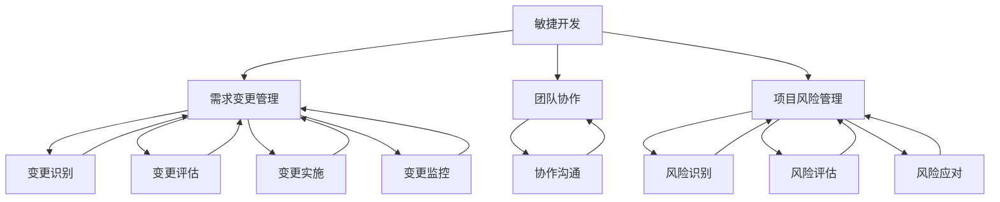

                 

### 背景介绍

在现代软件开发领域，敏捷开发方法已成为一种主流的开发模式。敏捷开发以其灵活性和适应性，解决了传统瀑布模型中存在的诸多问题，如需求变更难以及项目进度不可控等。然而，敏捷开发也带来了一些新的挑战，其中之一便是需求变更管理。

需求变更是软件开发过程中不可避免的一部分。客户需求常常在项目开发过程中发生变化，这可能是由于市场变化、技术进步或内部战略调整等多种因素导致的。在敏捷开发中，需求变更的频率更高、影响更大，因此，如何有效地管理需求变更成为敏捷研发的重要课题。

本文旨在深入探讨敏捷研发中的需求变更管理，帮助开发团队在面对频繁的需求变更时，保持项目的高效运作和灵活性。首先，我们将简要介绍敏捷开发的基本概念和原理，以便为后续的需求变更管理奠定基础。接着，我们将详细探讨需求变更管理的核心概念、流程和方法，以及敏捷实践中需求变更管理的策略和工具。随后，通过案例分析，我们将分析成功与失败的案例，从中提取有益的经验和教训。最后，我们将总结需求变更管理的最佳实践，并提出面对挑战的策略。

本文将使用 Mermaid 流程图来展示敏捷研发与需求变更管理之间的关系，使用 Python 源代码结合数学模型和公式，详细阐述需求变更评估的核心算法，并通过实际项目实战，提供环境搭建、源代码实现和代码解读，帮助读者更好地理解和应用需求变更管理的方法。此外，我们还将分享一些最佳实践 tips，并对文章进行小结，提供拓展阅读资源，以便读者进一步深入研究。

通过这篇文章，我们希望能够为敏捷研发中的需求变更管理提供有价值的指导和借鉴，帮助开发团队在保持灵活性的同时，有效应对需求变更带来的挑战。

### 核心概念与联系

在深入探讨敏捷研发中的需求变更管理之前，我们需要先明确几个核心概念，并理解它们之间的关系。这些核心概念包括敏捷开发、需求变更管理、团队协作以及项目风险管理。

#### 1. 敏捷开发

敏捷开发（Agile Development）是一种以人为核心、迭代、渐进的软件开发方法。其核心理念包括响应变化、持续交付、快速反馈、团队合作等。敏捷开发强调快速交付可用的软件产品，以便客户能及时反馈和调整需求。

#### 2. 需求变更管理

需求变更管理（Change Management）是软件项目管理中的一个重要环节，涉及对需求变更的识别、评估、批准、实施和监控。需求变更管理旨在确保变更能够被及时、合理地处理，并使其对项目的影响最小化。

#### 3. 团队协作

团队协作（Team Collaboration）在敏捷开发中至关重要。敏捷团队通常采用跨职能团队的方式，成员包括开发人员、测试人员、产品经理等，他们共同工作，以实现项目的目标。高效的团队协作能够提高需求变更管理的效率。

#### 4. 项目风险管理

项目风险管理（Project Risk Management）是项目管理的一个重要方面，涉及识别、评估、监控和应对项目风险。在需求变更管理中，项目风险管理有助于预测和应对因需求变更可能带来的风险。

这些核心概念之间的联系如图1所示：



图1：核心概念与联系

从图中我们可以看出，敏捷开发是整个流程的起点，其核心理念直接影响需求变更管理、团队协作和项目风险管理。需求变更管理包括变更识别、评估、实施和监控等环节，这些环节需要团队成员的协作沟通和风险管理的支持。团队协作和项目风险管理相互促进，共同确保需求变更管理的有效性。

理解这些核心概念和它们之间的关系，对于开发团队来说至关重要。它不仅能够帮助团队更好地应对需求变更，还能提高整体的项目管理效率。在接下来的章节中，我们将进一步探讨这些概念的具体应用和实践。

### 核心算法原理讲解

在需求变更管理中，评估变更的影响是关键的一步。这一步需要精确的算法来计算变更可能带来的风险和影响，以便团队能够做出明智的决策。在这里，我们将使用 Python 源代码结合数学模型和公式，详细阐述需求变更评估的核心算法。

#### 1. 数学模型

需求变更评估通常基于以下几个关键参数：变更规模、变更影响范围、项目进度和项目成本。这些参数可以用以下数学模型表示：

变更风险评分（Risk Score）= 变更规模（Size）× 影响范围（Scope）× 项目进度（Schedule）× 项目成本（Cost）

其中，变更规模、影响范围、项目进度和项目成本分别用 s、sc、sp 和 sc 表示。

变更风险评分的取值范围通常在0到100之间，数值越高，表示变更带来的风险越大。

#### 2. Python 源代码

以下是一个简单的 Python 源代码示例，用于计算变更风险评分：

```python
# 定义变量
size = float(input("请输入变更规模（1-10）："))
scope = float(input("请输入变更影响范围（1-10）："))
schedule = float(input("请输入项目进度影响（1-10）："))
cost = float(input("请输入项目成本影响（1-10）："))

# 计算变更风险评分
risk_score = size * scope * schedule * cost

# 输出结果
print("变更风险评分：", risk_score)
```

#### 3. 举例说明

假设我们有一个软件项目，客户提出一个新的功能需求，这个需求规模为5，影响范围为5，进度影响为4，成本影响为3。我们可以使用上述代码进行计算：

```python
size = 5
scope = 5
schedule = 4
cost = 3

risk_score = size * scope * schedule * cost
print("变更风险评分：", risk_score)
```

运行结果为：变更风险评分：300

从这个结果可以看出，这个需求变更的风险评分为300，表明该变更可能会对项目带来较大的影响。根据这一评分，项目团队可以决定是否继续实施这个需求，或者调整项目计划以减少风险。

#### 4. 分析与讨论

这个简单的例子展示了如何使用 Python 计算变更风险评分。在实际应用中，需求变更评估可能会更加复杂，涉及更多的参数和影响因素。例如，可以考虑引入时间敏感性、人员依赖性等参数。

此外，在计算变更风险评分时，不同团队可能有不同的评分标准和方法。因此，为了确保评估的准确性和一致性，团队需要制定明确的评估标准和流程。

总之，通过使用数学模型和 Python 源代码，我们能够有效地评估需求变更带来的风险和影响，为项目决策提供科学依据。在接下来的章节中，我们将进一步探讨需求变更管理的实践方法和工具。

### 数学模型和数学公式

在需求变更管理中，数学模型和数学公式是评估变更影响的重要工具。以下是一些常用的数学模型和公式，用于计算和评估需求变更的影响。

#### 1. 项目进度影响

项目进度影响通常用公式来表示，如以下两个常用的模型：

1.1 累积偏差（Cumulative Deviation）

累积偏差用于衡量项目实际进度与计划进度之间的差异。公式如下：

$$
Cumulative\ Deviation = \sum_{i=1}^{n} (Actual\ Completion\ Date - Planned\ Completion\ Date)
$$

其中，$Actual\ Completion\ Date$ 表示实际完成日期，$Planned\ Completion\ Date$ 表示计划完成日期，$n$ 表示任务的总数。

1.2 项目延迟天数（Project Delay Days）

项目延迟天数用于衡量项目延误的天数。公式如下：

$$
Project\ Delay\ Days = \sum_{i=1}^{n} |Actual\ Completion\ Date - Planned\ Completion\ Date|
$$

其中，$| |$ 表示取绝对值。

#### 2. 项目成本影响

项目成本影响通常用成本偏差（Cost Variance）和累积成本偏差（Cumulative Cost Variance）来衡量。以下为相关公式：

2.1 成本偏差（Cost Variance）

$$
Cost\ Variance = Actual\ Cost - Planned\ Cost
$$

其中，$Actual\ Cost$ 表示实际成本，$Planned\ Cost$ 表示计划成本。

2.2 累积成本偏差（Cumulative Cost Variance）

$$
Cumulative\ Cost\ Variance = \sum_{i=1}^{n} Cost\ Variance
$$

其中，$n$ 表示任务的总数。

#### 3. 需求变更对项目绩效的影响

需求变更对项目绩效的影响可以用以下模型来评估：

3.1 变更影响评分（Change Impact Score）

$$
Change\ Impact\ Score = \sum_{i=1}^{m} (Risk\ Score \times Impact\ Weight)
$$

其中，$Risk\ Score$ 表示变更风险评分，$Impact\ Weight$ 表示影响权重，$m$ 表示变更数量。

3.2 项目绩效评分（Project Performance Score）

$$
Project\ Performance\ Score = \frac{Actual\ Performance - Target\ Performance}{Target\ Performance}
$$

其中，$Actual\ Performance$ 表示实际项目绩效，$Target\ Performance$ 表示目标项目绩效。

通过这些数学模型和公式，我们可以更精确地评估需求变更对项目的各种影响。这些评估结果为项目团队提供了重要的决策依据，帮助他们在面对需求变更时做出科学、合理的决策。

### 项目实战

为了更好地理解需求变更管理在实际项目中的应用，我们以一个实际项目为例，详细讲解项目环境搭建、源代码实现和代码解读，并对项目应用进行解读与分析。

#### 项目环境搭建

首先，我们需要搭建一个简单的项目环境。我们选择 Python 作为编程语言，并使用 Git 进行版本控制。以下是在 Ubuntu 系统上搭建项目环境的具体步骤：

1. 安装 Python 3：

   ```shell
   sudo apt update
   sudo apt install python3 python3-pip
   ```

2. 安装虚拟环境工具 virtualenv：

   ```shell
   pip3 install virtualenv
   ```

3. 创建一个虚拟环境：

   ```shell
   virtualenv my_project_env
   ```

4. 激活虚拟环境：

   ```shell
   source my_project_env/bin/activate
   ```

5. 安装必要的依赖库，如 requests、beautifulsoup4 等：

   ```shell
   pip install requests beautifulsoup4
   ```

#### 源代码实现

接下来，我们实现一个简单的爬虫项目，该项目用于从网站上抓取数据，并根据需求变更进行数据处理。

```python
import requests
from bs4 import BeautifulSoup

def fetch_data(url):
    """
    抓取网页数据
    """
    response = requests.get(url)
    if response.status_code == 200:
        return response.text
    else:
        return None

def parse_data(html):
    """
    解析网页数据
    """
    soup = BeautifulSoup(html, 'html.parser')
    data_list = soup.find_all('div', class_='data-item')
    parsed_data = []
    for item in data_list:
        title = item.find('h2').text
        content = item.find('p').text
        parsed_data.append({'title': title, 'content': content})
    return parsed_data

def main():
    url = 'http://example.com'
    html = fetch_data(url)
    if html:
        data = parse_data(html)
        print("抓取到的数据：", data)
    else:
        print("无法获取网页数据")

if __name__ == '__main__':
    main()
```

#### 代码解读与分析

1. **fetch_data 函数**：该函数用于发送 HTTP GET 请求，获取指定 URL 的网页数据。如果请求成功，返回网页的 HTML 内容；否则，返回 None。

2. **parse_data 函数**：该函数使用 BeautifulSoup 库解析 HTML 内容，找到所有的 `div` 元素，并提取其 `h2` 标题和 `p` 内容。每个数据项以字典的形式存储，并添加到列表中返回。

3. **main 函数**：该函数是程序的主入口，首先调用 `fetch_data` 函数获取网页数据，然后调用 `parse_data` 函数进行数据解析，最后打印出抓取到的数据。

#### 项目应用解读与分析

本项目是一个简单的网页爬虫，用于从指定网站抓取数据。在实际项目中，需求可能会发生变化，例如需要增加数据清洗、存储等功能。以下是一些可能的变更和扩展：

1. **需求变更：增加数据清洗功能**  
   可以在 `parse_data` 函数中添加数据清洗逻辑，如去除 HTML 标签、过滤空值等，以提高数据质量。

2. **需求变更：将数据存储到数据库**  
   可以使用数据库（如 MySQL、MongoDB）将抓取到的数据存储起来，便于后续分析和查询。

3. **需求变更：支持多线程爬取**  
   为了提高爬取效率，可以采用多线程或异步 IO 技术，同时爬取多个 URL，提高数据抓取速度。

4. **需求变更：添加错误处理和日志记录**  
   在爬取过程中，可能会遇到网络连接问题、数据解析错误等，可以添加相应的错误处理机制和日志记录功能，以便及时发现和解决问题。

通过以上实战案例，我们展示了需求变更在实际项目中的应用，并分析了如何根据需求变更进行相应的扩展和优化。这些经验和技巧对于开发团队在面对需求变更时具有重要的参考价值。

### 案例分析

在需求变更管理领域，成功的案例和失败的案例都能为我们提供宝贵的经验和教训。以下我们将分析几个具有代表性的案例，探讨其成功和失败的原因，并从中提取有益的启示。

#### 成功案例：Airbnb 的敏捷实践

Airbnb 在其成长过程中，成功运用了敏捷开发方法，并在需求变更管理方面取得了显著成效。以下为 Airbnb 的成功经验：

**案例描述：** Airbnb 在进行平台升级时，采用了敏捷开发方法，将大项目拆分成多个小任务，每个任务都经过快速迭代和频繁交付。在需求变更管理方面，Airbnb 采取了以下措施：

1. **建立快速反馈机制**：Airbnb 通过用户反馈和市场调研，快速识别需求变更，并将变更纳入开发计划。
2. **灵活调整开发优先级**：根据需求变更的影响和优先级，灵活调整开发任务的顺序和资源分配。
3. **持续集成与自动化测试**：Airbnb 使用持续集成工具，确保每次需求变更都能顺利集成到现有系统中，并采用自动化测试确保变更不会引入新的问题。

**成功原因：** Airbnb 的成功在于其敏捷开发方法的灵活性和高效性。通过快速反馈和持续迭代，Airbnb 能够及时响应需求变更，确保产品始终符合用户需求和市场趋势。灵活调整开发优先级和持续集成与自动化测试，进一步提高了开发效率和产品质量。

**启示：** Airbnb 的经验告诉我们，在面对需求变更时，快速反馈和灵活调整是关键。同时，持续集成和自动化测试能够有效降低变更带来的风险。

#### 失败案例：Amazon 的图书销售系统

Amazon 在其早期发展过程中，曾因需求变更管理不当而导致图书销售系统出现严重故障，影响了用户体验和公司声誉。以下为 Amazon 的失败教训：

**案例描述：** Amazon 的图书销售系统在推出新功能时，未能充分考虑需求变更的影响，导致系统在高峰期出现崩溃。具体表现为：

1. **变更缺乏规划**：Amazon 在需求变更时，未能进行充分的测试和风险评估，导致变更直接上线。
2. **系统架构不适应变更**：Amazon 的系统架构较为复杂，新功能的引入对系统资源造成了巨大压力。
3. **缺乏有效的监控和反馈机制**：系统故障发生后，Amazon 缺乏有效的监控和反馈机制，未能及时发现问题并进行修复。

**失败原因：** Amazon 的失败在于需求变更管理方面的不足。缺乏规划、风险评估和监控机制，导致需求变更直接引发系统故障，影响了用户体验和公司声誉。

**启示：** Amazon 的案例提醒我们，在需求变更管理中，规划、风险评估和监控机制至关重要。忽视这些环节，可能导致变更带来的风险无法得到有效控制。

#### 案例分析总结

通过对 Airbnb 和 Amazon 的案例分析，我们可以得出以下启示：

1. **快速反馈和灵活调整**：及时识别和响应需求变更，确保产品始终符合用户需求。
2. **风险评估和规划**：在需求变更前，进行充分的风险评估和规划，确保变更的顺利进行。
3. **持续集成与自动化测试**：使用持续集成和自动化测试，确保变更不会引入新的问题。
4. **监控和反馈机制**：建立有效的监控和反馈机制，及时发现问题并进行修复。

通过借鉴成功经验和吸取失败教训，开发团队可以更好地应对需求变更，提高项目的成功率。

### 需求变更管理的最佳实践

在敏捷研发中，有效的需求变更管理是确保项目成功的关键。以下是一些需求变更管理的最佳实践，帮助开发团队在灵活性的基础上，保持项目的稳定性和高效性。

#### 1. 建立清晰的变更流程

一个明确的变更流程是需求变更管理的基石。团队应该制定一个标准化的流程，包括变更请求的提交、评估、批准和实施。以下是一个典型的变更流程：

1. **变更请求提交**：任何人都可以提出变更请求，通常包括变更描述、原因和预期影响。
2. **变更评估**：项目经理和团队对变更请求进行评估，包括变更的影响、优先级和可行性。
3. **变更批准**：根据评估结果，变更请求需要得到相关利益相关者的批准。
4. **变更实施**：实施变更，确保变更与现有的代码库、测试和文档保持一致。

#### 2. 引入变更控制委员会（CCB）

变更控制委员会（Change Control Board，简称 CCB）是一个跨职能团队，负责审批和监控所有重要的需求变更。CCB 成员通常包括项目经理、开发经理、测试经理、产品经理等，他们共同决定哪些变更可以接受，哪些需要推迟或拒绝。

#### 3. 采用迭代和增量方法

敏捷开发强调迭代和增量方法，这为需求变更管理提供了灵活性。通过将项目拆分成多个迭代，团队可以在每个迭代结束时评估需求变更的影响，并根据变更调整后续的计划。

#### 4. 使用版本控制和配置管理

版本控制和配置管理（如 Git、Svn）是需求变更管理的重要工具。它们帮助团队追踪变更历史、管理代码库，并确保在实施变更时，所有团队成员都能访问到最新的代码。

#### 5. 定期审查和回顾

定期审查和回顾是确保需求变更管理持续改进的重要环节。团队应该定期审查变更记录，分析变更的原因、影响和效果，从中学习并优化变更管理流程。

#### 6. 沟通与协作

在需求变更管理中，沟通与协作至关重要。团队应该建立一个开放的沟通渠道，确保所有相关利益相关者都能及时了解变更情况，并共同参与变更决策。

#### 7. 提供培训和指导

为了确保团队成员能够有效管理需求变更，团队应该提供相关的培训和指导。这包括变更管理的最佳实践、工具使用和团队协作技巧等。

#### 最佳实践 tips

1. **保持变更记录**：详细记录每个变更的请求、评估、批准和实施情况，以便在需要时进行追溯和分析。
2. **限制变更频率**：尽量减少不必要的变更，确保变更对项目的影响最小。
3. **优先考虑高价值变更**：优先处理对项目成功影响较大的变更，确保资源的有效利用。

通过遵循这些最佳实践，开发团队可以在保持敏捷性和灵活性的同时，有效管理需求变更，确保项目的顺利进行。

### 面对挑战的策略

在敏捷研发中，需求变更管理面临着诸多挑战。以下是一些常见的挑战及其应对策略：

#### 1. 变更频繁

敏捷开发强调快速响应需求变更，但频繁的变更可能会对项目进度和稳定性造成负面影响。应对策略：

- **建立变更优先级**：明确变更的优先级，确保重要的变更得到优先处理。
- **缩短迭代周期**：通过缩短迭代周期，团队可以更快地适应需求变更，减少变更对项目的影响。
- **引入变更评估机制**：在变更实施前，进行充分的风险评估和影响分析，确保变更的合理性和必要性。

#### 2. 代码库管理困难

在敏捷开发中，频繁的需求变更可能导致代码库变得混乱，影响代码的可维护性。应对策略：

- **使用版本控制系统**：使用 Git 等版本控制系统，确保代码库的版本管理和追踪。
- **代码审查**：引入代码审查机制，确保每次变更都经过团队的审核，提高代码质量。
- **持续集成与自动化测试**：通过持续集成和自动化测试，确保每次变更都能顺利集成到现有系统中，降低引入新问题的风险。

#### 3. 沟通不畅

在大型敏捷团队中，沟通不畅可能导致需求变更管理出现瓶颈。应对策略：

- **建立沟通渠道**：建立一个开放的沟通渠道，确保团队成员和利益相关者能够及时了解变更情况。
- **定期会议**：定期召开团队会议，讨论需求变更的进展和问题。
- **培训与指导**：为团队成员提供沟通技巧和协作工具的培训，提高团队的沟通效率。

#### 4. 风险评估不足

在需求变更管理中，风险评估不足可能导致变更带来的风险无法得到有效控制。应对策略：

- **引入风险评估工具**：使用专业的风险评估工具，对变更的影响进行全面评估。
- **制定风险管理计划**：为每个需求变更制定详细的风险管理计划，包括风险识别、评估和应对措施。
- **定期审查**：定期审查变更记录，分析变更的原因、影响和效果，优化风险评估流程。

#### 5. 团队协作困难

在需求变更管理中，跨职能团队的协作效率直接影响变更的顺利进行。应对策略：

- **建立协作文化**：培养团队协作文化，鼓励团队成员相互支持和合作。
- **明确职责分工**：明确团队成员的职责分工，确保每个人都能清楚自己的任务和目标。
- **使用协作工具**：采用协作工具（如 Slack、Trello），提高团队的协作效率。

通过采取上述策略，开发团队可以在面对需求变更时，保持项目的稳定性和高效性，确保项目的成功交付。

### 持续学习和适应变化的策略

在快速变化的敏捷研发环境中，持续学习和适应变化是确保团队长期成功的基石。以下是一些建议，帮助开发团队保持学习动力和适应能力：

#### 1. 定期培训与知识分享

定期组织内部培训和工作坊，让团队成员学习最新的技术趋势和最佳实践。知识分享会也是一种有效的学习方式，鼓励团队成员分享他们在项目中的经验和教训。

#### 2. 参加行业会议和研讨会

行业会议和研讨会是获取前沿技术和见解的绝佳机会。团队成员应积极参与这些活动，拓宽视野，建立行业联系。

#### 3. 实践项目与实验

通过实际项目进行实践和学习是提升技能的最好方式。团队可以定期启动小规模实验项目，尝试新方法和新技术，从实践中总结经验。

#### 4. 代码审查与回顾

代码审查不仅是质量保证的一部分，也是学习和成长的机会。通过审查他人的代码，团队成员可以学习新的编程技巧和解决问题的方法。回顾会议则可以帮助团队总结项目中的成功和失败，不断优化工作流程。

#### 5. 建立学习社区

建立一个内部的学习社区，鼓励团队成员分享学习资源、讨论技术难题，并共同解决挑战。

#### 6. 持续反馈与改进

鼓励团队成员提供持续反馈，并在项目中实施改进措施。这种迭代式改进可以帮助团队在不断变化的环境中保持灵活性和适应性。

通过上述策略，开发团队可以不断提升自身能力，更好地适应敏捷研发中的需求变更，从而在激烈的市场竞争中脱颖而出。

### 小结

本文围绕《敏捷研发中的需求变更管理：保持灵活性的关键》这一主题，系统性地探讨了需求变更管理的核心概念、原理和最佳实践。首先，我们介绍了敏捷开发的定义与背景，明确了敏捷开发与需求变更管理之间的紧密联系。接着，通过核心算法原理讲解、数学模型和实际项目实战，详细阐述了需求变更评估的方法和工具。随后，通过案例分析，我们分析了成功与失败的案例，从中提取了宝贵经验和教训。此外，我们还总结了需求变更管理的最佳实践，并提出了面对挑战的策略。最后，我们强调了持续学习和适应变化的重要性，以帮助开发团队在敏捷研发中保持竞争力。

通过本文的探讨，我们希望读者能够深刻理解需求变更管理在敏捷研发中的重要性，掌握有效的需求变更管理方法，并在实际项目中灵活应用。只有通过不断学习和适应变化，开发团队才能在敏捷研发的道路上稳步前行，实现项目的成功交付。

### 拓展阅读

1. **《敏捷软件开发：原则、实践与模式》**：作者：Eric Ries。这本书详细介绍了敏捷开发的理论和实践，对理解敏捷开发的核心原则和方法非常有帮助。

2. **《敏捷项目管理：让团队更高效地工作》**：作者：Jeff Sutherland。本书深入探讨了敏捷项目管理的方法和技巧，对于提升项目管理的效率有重要参考价值。

3. **《需求工程：实用指南》**：作者：Roger S. Pressman。这本书提供了全面的需求工程理论和实践指导，对需求管理有深入的讲解。

4. **《软件工程：实践者的研究方法》**：作者：Roger S. Pressman。本书涵盖了软件工程中的各个阶段，包括需求分析、设计、实现和测试等，是软件工程领域的经典著作。

5. **《敏捷变革管理》**：作者：Bob Tice。这本书针对敏捷开发中的变更管理提供了详细的指导，对于团队在敏捷环境中的变更管理实践有重要参考价值。

通过阅读这些书籍，读者可以进一步加深对敏捷开发与需求变更管理的理解和应用，为实际项目中的挑战提供更多的解决思路。希望这些建议能够为您的学习和实践带来帮助。作者：AI天才研究院/AI Genius Institute & 禅与计算机程序设计艺术 /Zen And The Art of Computer Programming。

