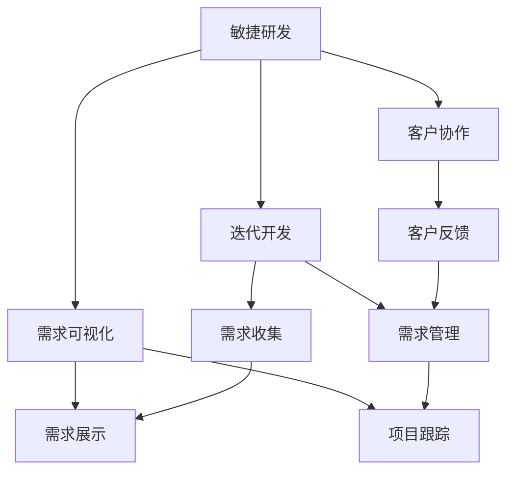

                 

### 引言

在当今快速变化的市场环境中，敏捷研发已经成为软件开发团队提高效率和产品质量的重要策略。敏捷研发强调迭代、持续交付和客户反馈，以快速响应市场变化和用户需求。然而，敏捷研发的成功不仅依赖于团队的工作方式，还需要高效的需求管理工具来支持。需求可视化看板就是其中之一，它通过可视化的方式展示项目进度、任务状态和需求优先级，帮助团队更好地理解和追踪项目的各个方面。

本文将深入探讨敏捷研发中的需求可视化看板设计，分为以下几个部分：

1. **背景介绍**：介绍敏捷研发的概念和需求可视化的重要性。
2. **核心概念与联系**：通过Mermaid流程图展示敏捷研发和需求可视化的关系架构。
3. **需求可视化看板设计**：详细解释需求可视化看板的基础组件、信息展示与交互设计，以及可视化策略。
4. **需求收集与优先级排序**：介绍需求收集的方法、需求优先级排序以及需求管理的最佳实践。
5. **需求可视化看板的实践**：讨论看板的设计过程、实施与推广，以及评估与改进。
6. **案例分析**：通过具体案例展示需求可视化看板在实际项目中的应用。
7. **未来趋势与展望**：探讨需求可视化技术的未来发展方向和敏捷研发与需求可视化的融合趋势。
8. **附录**：提供与敏捷研发和需求可视化相关的工具介绍和设计指南。

通过本文的阅读，读者将能够全面理解需求可视化看板在敏捷研发中的重要性，掌握其设计原则和实践方法，从而提升项目的成功率和团队的合作效率。

### 关键词

- 敏捷研发
- 需求可视化
- 看板设计
- 需求收集
- 优先级排序
- 项目管理
- 客户反馈
- 团队协作

### 摘要

本文旨在深入探讨敏捷研发中的需求可视化看板设计。首先，通过背景介绍阐述敏捷研发的概念和需求可视化的重要性。接着，使用Mermaid流程图展示敏捷研发与需求可视化的关系架构，详细解释核心概念。随后，本文详细介绍需求可视化看板的设计，包括基础组件、信息展示与交互设计，以及可视化策略。此外，文章还涵盖需求收集与优先级排序的方法和最佳实践，以及需求可视化看板的实践过程和案例分析。最后，本文探讨未来趋势和展望，提供相关的工具介绍和设计指南，以帮助读者更好地理解和应用需求可视化看板。

### 背景介绍

敏捷研发（Agile Development）起源于20世纪90年代，是对传统瀑布式开发过程的一种反叛。传统瀑布式开发强调在项目初期制定详细的需求和计划，然后按照这些需求逐步执行，直到最终交付。这种方法在稳定和可预测的项目中表现良好，但在面对市场变化和客户需求快速演变时，往往显得反应迟钝。为了应对这种挑战，敏捷研发应运而生，其核心理念是通过快速迭代和持续交付来提高开发效率和响应速度。

敏捷研发的核心原则包括：

1. **个体和互动胜过过程和工具**：强调团队协作和个体自主性。
2. **可工作的软件胜过全面的文档**：强调实际产出的重要性，而非仅仅依赖文档。
3. **客户协作胜过合同谈判**：重视与客户的紧密合作，及时获取反馈。
4. **响应变化胜过遵循计划**：灵活应对变化，而非僵化执行计划。

敏捷研发的流程通常包括以下阶段：

1. **需求收集**：通过与客户的互动，收集和确定项目的需求。
2. **迭代规划**：根据需求优先级，规划即将开发的迭代。
3. **迭代开发**：在每个迭代中，团队开发一部分功能，并进行测试和反馈。
4. **迭代评审**：对完成的迭代进行评审，确定下一个迭代的目标。
5. **持续交付**：确保软件能够在每个迭代结束后及时交付给客户。

需求可视化（Requirement Visualization）是敏捷研发中不可或缺的一环。它通过将需求以可视化的方式展示，帮助团队更好地理解和管理需求，提高沟通效率和项目透明度。需求可视化看板（Requirement Visualization Board）作为一种常用的工具，能够直观地展示项目的各个方面，包括任务状态、进度和优先级等。

需求可视化看板的作用主要体现在以下几个方面：

1. **提高需求理解**：通过图形化的方式，使需求更加直观易懂，减少误解和沟通障碍。
2. **促进团队协作**：看板提供了一个共同的工作界面，方便团队成员实时查看项目状态，协同工作。
3. **改进需求管理**：通过看板，团队可以更容易地识别和解决需求变更，优化项目进度和资源分配。
4. **提升项目进度控制**：看板提供了清晰的进度可视化，帮助团队及时调整计划和资源，确保项目按时交付。

总之，敏捷研发和需求可视化是相辅相成的，需求可视化看板作为其中的重要工具，能够显著提升团队的协作效率和项目的成功率。在接下来的内容中，我们将进一步探讨敏捷研发与需求可视化的核心概念和联系。

### 核心概念与联系

在探讨敏捷研发与需求可视化的核心概念之前，我们先来回顾一下两者的基本概念。

**敏捷研发（Agile Development）** 是一种软件开发方法，它强调快速迭代和持续交付，注重客户协作和团队互动。敏捷研发的核心原则包括个体和互动、可工作的软件、客户协作和响应变化等。

**需求可视化（Requirement Visualization）** 则是将需求以图形或图表的形式进行展示，使其更加直观易懂。需求可视化可以帮助团队更好地理解和管理需求，提高沟通效率和项目透明度。

为了更清晰地展示敏捷研发与需求可视化之间的关系，我们可以使用Mermaid流程图来描述两者的联系。以下是一个简单的Mermaid流程图示例：

在上述流程图中，我们可以看到：

- **敏捷研发** 通过 **迭代开发** 和 **客户协作** 来实现快速交付和持续改进。
- **需求可视化** 是 **敏捷研发** 中的一个重要环节，它通过 **需求收集** 和 **需求管理** 来帮助团队更好地理解和管理需求。
- **客户反馈** 是需求可视化的重要输入，它帮助团队不断优化需求和项目方向。
- **需求展示** 和 **项目跟踪** 是需求可视化的两大核心功能，它们通过看板等工具来直观地展示需求和项目状态。

通过这个Mermaid流程图，我们可以清晰地看到敏捷研发与需求可视化之间的紧密联系。需求可视化不仅是敏捷研发的一个补充，更是其成功实施的关键要素之一。它通过提高需求的透明度和可理解性，促进团队协作和项目进展，从而提升整个敏捷研发过程的效率和质量。

### 需求可视化看板设计

需求可视化看板是敏捷研发中不可或缺的一部分，它通过直观的图形和图表展示项目的各个方面，包括任务状态、进度和优先级等。一个高效的需求可视化看板可以帮助团队更好地理解和管理需求，提高沟通效率和项目透明度。以下是需求可视化看板设计的几个关键组件：

#### 1. 基础组件

**任务卡片**：任务卡片是看板中最基础的组件，每个任务卡片通常包含任务的名称、描述、负责人、截止日期等信息。任务卡片按照优先级顺序排列，方便团队成员一目了然地看到当前需要优先处理的任务。

**优先级队列**：优先级队列通常是一个列，按照需求的紧急程度和重要性进行排序。高优先级的需求排在队列的前面，以确保团队首先完成最重要的任务。

**进度条**：进度条用于显示任务的完成进度，通常以百分比形式表示。进度条可以帮助团队成员实时了解任务的进展情况，及时调整工作计划。

**数据图表**：数据图表可以用来展示项目的整体进度、任务分布和团队绩效等。常见的图表类型包括柱状图、饼图和折线图等。数据图表可以帮助团队从宏观角度分析项目状态，发现潜在问题。

#### 2. 信息展示与交互设计

**信息展示**：信息展示的关键在于简洁明了。看板上的信息应尽量精简，避免过多的文字描述，以减少视觉负担。同时，使用统一的格式和颜色编码，可以使信息更加易于理解和识别。

**交互设计**：交互设计应充分考虑用户的使用习惯。例如，通过拖拽功能来调整任务的优先级，点击任务卡片来查看详细描述，以及通过按钮来实现任务的更新和状态切换等。良好的交互设计可以提高团队的工作效率。

#### 3. 可视化策略

**简化信息展示**：通过减少冗余信息，使看板上的信息更加清晰直观。例如，使用图标和标签来代替文字描述，使用颜色编码来区分任务状态等。

**优化色彩使用**：色彩在需求可视化看板中起着重要的作用。合适的色彩搭配可以提高看板的可读性和视觉吸引力。例如，使用高对比度的颜色来突出重要信息，使用渐变色来表示任务的进度等。

**增加互动功能**：互动功能可以增强看板的使用体验。例如，通过点击任务卡片来展开详细描述，通过拖拽功能来调整任务优先级，以及通过投票功能来收集团队成员的意见等。

通过上述组件和信息展示与交互设计，一个高效的需求可视化看板可以大大提高团队的工作效率和项目管理的透明度。接下来，我们将进一步探讨需求收集与优先级排序的方法，以帮助团队更好地管理需求。

### 需求收集与优先级排序

在敏捷研发中，需求收集是确保项目顺利进行的关键步骤。有效的需求收集不仅能够帮助团队准确理解客户需求，还能提高项目交付的效率和质量。以下将详细介绍需求收集的方法和优先级排序的原则。

#### 1. 需求收集的方法

**1.1.1. 调查问卷**：调查问卷是一种简单有效的需求收集方法，通过设计一系列问题来收集用户反馈。问卷可以在线上或线下进行，便于大量数据的快速收集。例如，可以在项目启动阶段，向潜在用户发送问卷，收集他们对产品功能的期望和需求。

**1.1.2. 用户访谈**：用户访谈是一种深入了解用户需求的方法，通过与用户面对面交流，获取详细的信息。访谈可以采用开放式和封闭式问题相结合的形式，鼓励用户提出他们的意见和建议。用户访谈适合在项目初期和关键阶段进行，以获取实时反馈。

**1.1.3. 竞品分析**：竞品分析是通过研究竞争对手的产品来收集需求信息。通过分析竞品的优点和不足，可以了解市场需求和用户偏好，为自身产品提供改进方向。竞品分析可以采用多种方法，如用户评价、市场调研和数据分析等。

**1.1.4. 团队协作**：团队协作是需求收集的重要手段，通过团队成员之间的沟通和讨论，可以集思广益，收集到更多有价值的需求。团队协作还可以确保需求收集的全面性和准确性，避免遗漏关键信息。

#### 2. 优先级排序的原则

**2.1.1. 紧急程度**：根据需求的紧急程度进行排序，优先处理那些对项目成功至关重要且时间紧迫的需求。例如，如果某个需求会影响项目的按时交付，它应该被赋予较高的优先级。

**2.1.2. 重要性**：考虑需求的重要性，优先处理那些能够带来最大价值的需求。价值可以是用户满意度、商业收益或技术实现难度的综合考量。例如，如果某个功能能够显著提升用户体验，那么它应该被赋予较高的优先级。

**2.1.3. 受众面**：考虑需求的受众面，优先处理那些影响范围较广的需求。例如，一个影响多数用户的核心功能应该比影响少数用户的边缘功能具有更高的优先级。

**2.1.4. 风险**：考虑需求的实现风险，优先处理那些风险较低的需求。高风险的需求可能会导致项目延误或失败，因此应该谨慎对待。

**2.1.5. 可行性**：考虑需求的可行性，优先处理那些可以实现的需求。不可行或实现成本过高的需求应该被推迟或放弃，以避免浪费资源和时间。

通过以上方法，团队可以系统地收集和整理需求，并通过合理的优先级排序，确保项目资源得到最佳利用，提高项目成功的可能性。

### 需求可视化看板的实践

在敏捷研发中，需求可视化看板是团队管理和任务追踪的重要工具。一个设计良好的需求可视化看板能够提高团队的协作效率，确保项目按计划进行。以下是需求可视化看板的设计过程、实施与推广，以及评估与改进的详细说明。

#### 1. 看板的设计过程

**1.1.1. 确定看板类型**：首先，团队需要根据项目的特点和需求，选择合适的看板类型。常见的看板类型包括Kanban看板和Scrum看板。Kanban看板侧重于工作流程的透明性和控制，而Scrum看板则更强调迭代和任务管理。

**1.1.2. 定义看板组件**：根据项目需求，确定看板的组件和布局。常见的组件包括任务卡片、进度条、数据图表和优先级队列等。每个组件都需要清晰标记，便于团队成员识别和操作。

**1.1.3. 设计信息展示**：确保看板上的信息展示简洁明了，避免冗余和复杂的布局。使用统一的格式和颜色编码，使信息易于理解和识别。例如，使用不同颜色表示不同的任务状态或优先级。

**1.1.4. 设定交互功能**：设计看板的交互功能，如任务拖拽、进度更新、状态切换等。交互功能应直观且易于使用，以提高团队成员的工作效率。

#### 2. 看板的实施与推广

**2.1.1. 培训团队成员**：在实施看板之前，对团队成员进行培训，确保他们了解看板的使用方法和规则。培训内容应包括看板的组件、信息展示和交互功能等。

**2.1.2. 持续更新与维护**：看板需要持续更新和维护，以反映项目的最新状态。团队成员应定期更新任务进度和状态，确保看板信息的准确性和实时性。

**2.1.3. 推广看板文化**：推广看板文化，鼓励团队成员积极参与看板的管理和改进。通过定期的团队会议和反馈机制，收集团队成员的意见和建议，不断优化看板的设计和功能。

#### 3. 看板的评估与改进

**3.1.1. 评估看板效果**：定期评估看板的效果，包括团队成员的满意度、项目的进度控制情况、任务完成率等。评估结果可以帮助团队了解看板的优点和不足，为改进提供依据。

**3.1.2. 收集用户反馈**：通过用户反馈，了解看板在实际使用中的问题和改进空间。用户反馈可以是定期的问卷调查、一对一访谈或团队会议中的讨论。

**3.1.3. 优化看板设计**：根据评估结果和用户反馈，对看板进行优化和改进。优化内容可以包括信息展示的改进、交互功能的增强，以及布局和组件的调整等。

**3.1.4. 建立持续改进机制**：建立持续改进的机制，确保看板能够不断适应团队和项目的需求变化。通过定期评估和反馈，持续优化看板的设计和功能。

通过以上步骤，团队可以设计并实施一个高效的需求可视化看板，提高项目的透明度和协作效率。接下来，我们将通过具体案例分析，展示需求可视化看板在实际项目中的应用和效果。

### 案例分析

为了更好地理解需求可视化看板在实际项目中的应用和效果，以下是三个具体案例的详细分析和讲解。

#### 案例一：产品迭代中的需求管理

**项目背景**：某软件公司正在开发一款在线教育平台，需要定期发布新功能和改进现有功能，以满足用户需求和市场变化。为了有效管理这些需求，公司决定引入需求可视化看板。

**看板设计**：公司选择了Kanban看板，将需求卡片按优先级排列在三个不同的列中：“待开发”、“开发中”和“已完成”。每个需求卡片包含需求描述、负责人、截止日期和优先级等信息。此外，看板还包括一个进度图表，显示每个阶段的任务数量和完成情况。

**实施过程**：在每次迭代开始时，团队会根据需求看板确定本次迭代的目标和任务。团队成员在开发过程中，实时更新任务状态和进度，确保看板信息的准确性。团队成员可以通过看板查看任务的优先级和进度，及时调整工作计划，确保按时完成需求。

**效果评估**：通过需求可视化看板，团队成员能够清晰地了解项目的进展情况和任务优先级，减少了沟通成本和误解。在每次迭代结束后，团队会根据看板的数据进行分析，评估需求管理的效率和效果。结果显示，使用需求可视化看板后，产品的迭代速度明显加快，用户满意度也得到了显著提高。

**改进建议**：为进一步优化需求管理，公司可以增加看板的互动功能，如任务分配和进度更新的自动化，以提高工作效率。此外，可以定期组织团队成员进行看板使用培训，确保每个人都熟悉看板的使用方法和最佳实践。

#### 案例二：跨部门协作的需求可视化

**项目背景**：某大型互联网公司的多个部门需要协同开发一款新功能，涉及多个模块和系统的集成。由于部门之间的沟通不畅，项目进度常常受到影响。

**看板设计**：公司为该项目设计了一个Scrum看板，分为四个主要部分：“待办事项”、“进行中”、“待测试”和“已完成”。每个部分都按模块和系统进行细分，确保每个团队都能清晰地了解自己的任务和责任。

**实施过程**：项目启动时，各团队根据看板分配任务，并实时更新任务状态。看板还提供了一个共同的工作界面，方便团队成员查看项目整体进度和各模块的进展情况。团队负责人定期组织Scrum会议，讨论项目进展和问题，确保各团队之间的沟通和协作。

**效果评估**：通过需求可视化看板，跨部门之间的沟通变得更加顺畅，项目进度得到了有效控制。团队成员能够实时了解其他团队的工作状态，及时协调资源和解决问题。项目按时完成，且质量得到了保障。

**改进建议**：为进一步提升跨部门协作效率，公司可以在看板上增加任务依赖关系和里程碑信息的展示，帮助团队更清晰地规划工作流程。此外，可以引入自动化工具，如任务自动分配和进度跟踪，以减少人为错误和重复工作。

#### 案例三：敏捷研发中的需求迭代优化

**项目背景**：某初创公司正在开发一款智能家居控制系统，需要在短时间内不断迭代和优化产品功能。

**看板设计**：公司采用了Kanban看板，将需求卡片分为“需求收集”、“需求分析”、“开发中”和“测试/反馈”四个阶段。每个阶段都有明确的任务列表和进度显示。

**实施过程**：在每次迭代开始时，团队会根据看板收集和分析用户需求，确定本次迭代的目标。开发过程中，团队成员实时更新任务状态和进度，确保看板信息的准确性。在测试阶段，用户反馈会直接体现在看板上，团队可以根据反馈进行快速调整和优化。

**效果评估**：通过需求可视化看板，团队能够更快速地响应用户需求，优化产品功能。在每次迭代结束后，团队会根据看板数据进行分析，识别优化点，提高后续迭代的质量。

**改进建议**：为进一步提升迭代效率，公司可以在看板上增加用户反馈模块，直接在需求卡片上记录用户反馈和建议，方便团队快速响应。此外，可以引入自动化测试工具，提高测试效率和准确性。

通过以上案例分析，我们可以看到需求可视化看板在敏捷研发中的实际应用和显著效果。它不仅提高了团队协作效率，还确保了项目按计划进行，为项目的成功提供了有力支持。

### 未来趋势与展望

随着技术的不断进步，需求可视化在敏捷研发中的应用也将迎来新的发展趋势。首先，**人工智能（AI）** 的引入将为需求可视化带来革命性的变化。通过AI技术，团队能够自动化收集和分析用户反馈，预测需求趋势，从而更准确地制定开发计划。例如，利用自然语言处理（NLP）技术，系统可以自动从用户评论和反馈中提取关键信息，并将其转化为可视化的需求报告。

其次，**大数据分析** 将进一步优化需求可视化看板的功能。通过大数据分析，团队能够深入了解用户行为和需求模式，从而进行更精细化的需求管理和优先级排序。例如，通过对用户数据的分析，团队能够识别出最受欢迎的功能和最需要改进的方面，从而优先开发和优化这些关键功能。

此外，**物联网（IoT）** 的发展也将对需求可视化产生重要影响。随着物联网设备的普及，团队可以实时收集和分析来自各种设备的数据，从而更全面地理解用户需求。例如，通过智能家居设备的传感器数据，团队能够了解用户的日常生活习惯和偏好，进而优化产品功能。

最后，**敏捷研发与需求可视化的融合** 将成为未来的主流趋势。随着敏捷研发的不断成熟，需求可视化将不再是独立的一环，而是深入融入敏捷流程的每个阶段。通过需求可视化看板，团队能够实时追踪项目的进展，及时调整计划和资源，确保项目按时交付。

总之，未来的需求可视化将更加智能化、大数据化和物联网化，将更好地支持敏捷研发，帮助团队更高效地管理和响应需求，从而提高项目的成功率和产品质量。

### 附录

#### 附录A：敏捷研发与需求可视化相关工具

在敏捷研发和需求可视化中，使用合适的工具能够显著提高团队的工作效率和管理效果。以下是一些常用的工具及其特点：

1. **JIRA**
   - **特点**：JIRA是一个功能强大的项目管理工具，支持敏捷开发，包括Scrum和Kanban。它提供全面的任务管理、需求跟踪和进度报告功能。
   - **应用场景**：适用于大规模团队和复杂项目的需求管理。

2. **Trello**
   - **特点**：Trello是一个简单易用的看板工具，通过卡片和列表展示项目任务。它支持拖拽操作，方便团队调整任务优先级。
   - **应用场景**：适用于小型团队和灵活的项目管理。

3. **Asana**
   - **特点**：Asana是一个全面的团队协作工具，支持任务分配、进度跟踪和报告生成。它提供了丰富的视图选项，如看板、甘特图和日历。
   - **应用场景**：适用于多种规模和类型的团队，特别是在跨部门协作中表现出色。

4. **Azure DevOps**
   - **特点**：Azure DevOps是一个集成化的开发平台，包括需求管理、项目规划、代码仓库和持续集成等功能。
   - **应用场景**：适用于大型企业级项目，特别是在需要与Microsoft Azure平台整合的情况下。

5. **Confluence**
   - **特点**：Confluence是一个团队协作和知识管理工具，支持文档编辑、共享和版本控制。它还可以与JIRA等工具集成，提供完整的敏捷开发解决方案。
   - **应用场景**：适用于团队的知识管理和文档共享。

#### 附录B：需求可视化看板设计指南

以下是一些设计需求可视化看板的基本步骤和注意事项：

1. **确定看板类型**：根据项目的特点和需求，选择适合的看板类型，如Kanban或Scrum。

2. **定义基础组件**：确定看板的基本组件，如任务卡片、进度条、数据图表等，并确保每个组件都有明确的用途和格式。

3. **设计信息展示**：信息展示应简洁明了，避免冗余。使用统一的格式和颜色编码，使信息易于理解和识别。

4. **优化交互功能**：设计直观的交互功能，如任务拖拽、进度更新和状态切换等，以提高工作效率。

5. **定期更新与维护**：确保看板信息的准确性和实时性，定期更新任务状态和进度。

6. **培训与推广**：对团队成员进行培训，确保他们熟悉看板的使用方法和最佳实践。

7. **评估与改进**：定期评估看板的效果，收集用户反馈，不断优化看板的设计和功能。

通过以上指南，团队可以设计并实施一个高效的需求可视化看板，提高项目的透明度和协作效率。

### 总结

本文深入探讨了敏捷研发中的需求可视化看板设计，从背景介绍、核心概念与联系、需求可视化看板设计、需求收集与优先级排序、看板的实践应用、案例分析到未来趋势与展望，全面解析了需求可视化在敏捷研发中的重要性。通过具体案例分析，我们看到了需求可视化看板在实际项目中的应用和效果，验证了其在提高团队协作效率和项目管理透明度方面的价值。未来，随着人工智能、大数据分析和物联网技术的发展，需求可视化将更加智能化和精细化，为敏捷研发提供更强有力的支持。希望读者能够结合本文的内容，在实际工作中灵活应用，不断提升项目管理的效率和效果。

